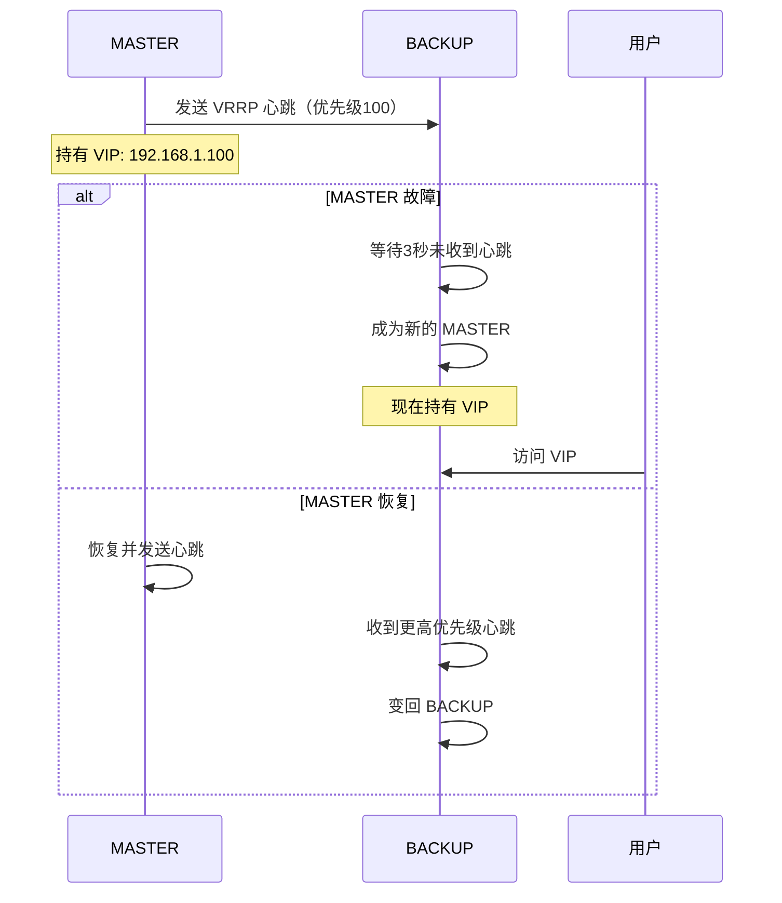
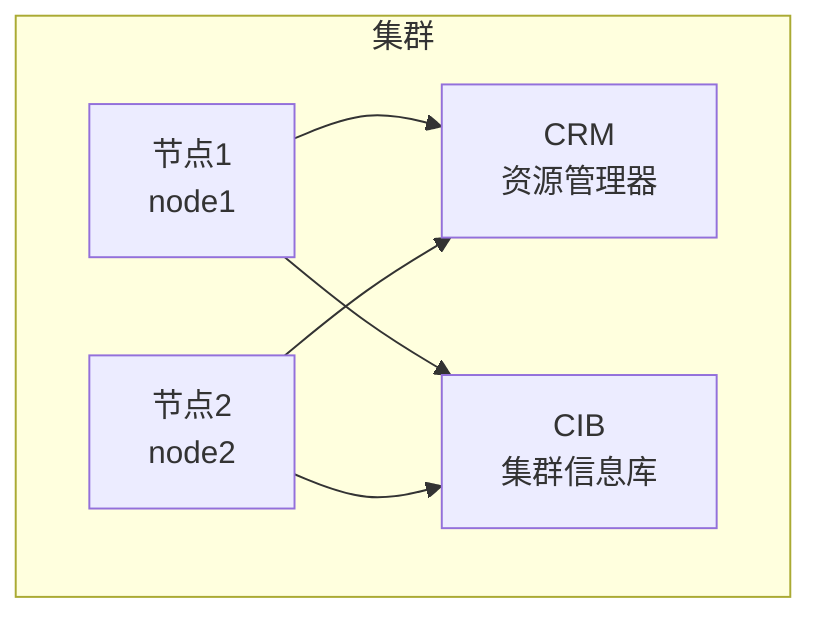
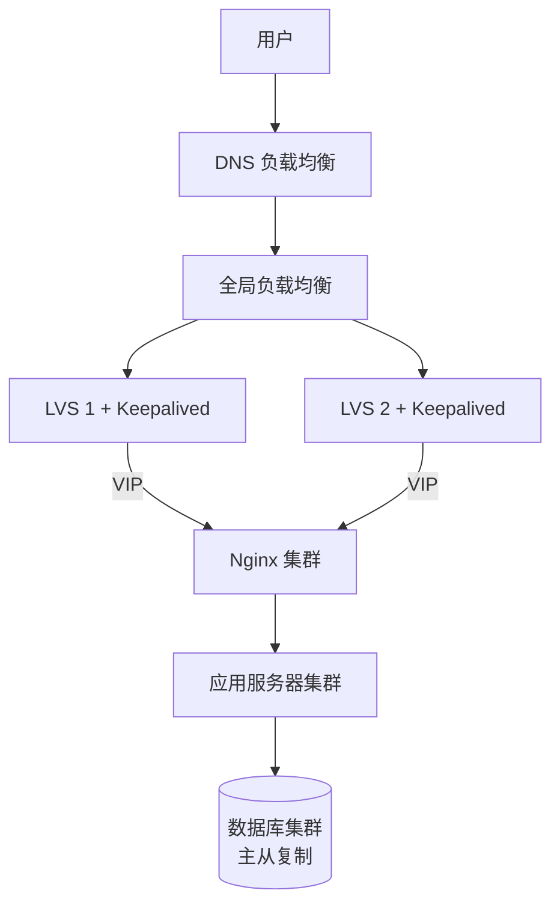
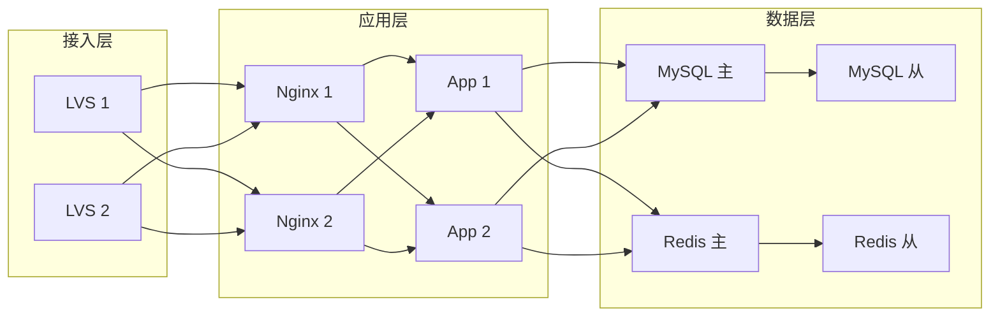
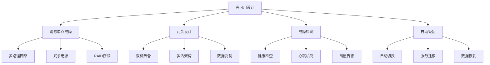
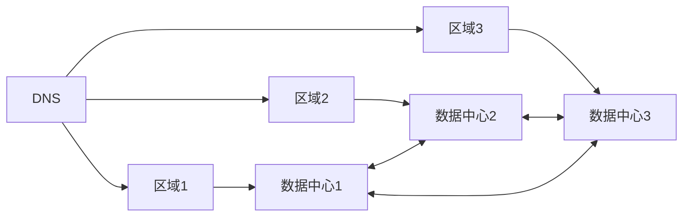
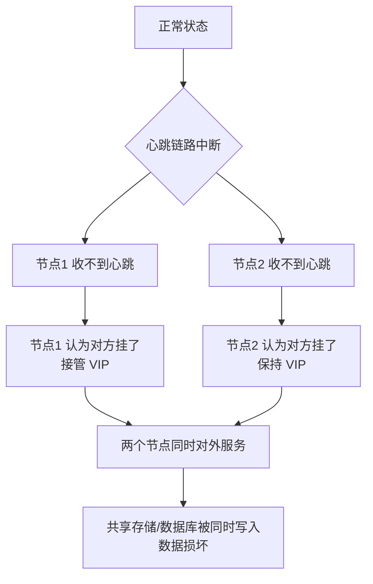

+++
title = "第64章：高可用"
weight = 640
date = "2026-03-24T13:18:28+08:00"
type = "docs"
description = ""
isCJKLanguage = true
draft = false
+++


# 第六十四章：高可用

## 64.1 Keepalived

### 什么是高可用？

想象一下：你家的备用电源。当主电源停电时，备用电源自动接管，冰箱继续工作，空调继续运转，你甚至感觉不到停电了。

**高可用（High Availability，HA）** 就是给服务器配备"备用电源"！


```mermaid
graph LR
    A[用户] -->|访问 VIP| VIP[虚拟 IP<br/>192.168.1.100]
    VIP --> M[主节点<br/>持有 VIP]
    M <-.->|VRRP 心跳| B[备节点<br/>待命]
    M -->|故障| B
```

> 注意图中"VIP 漂移"的关键：**用户始终访问同一个 VIP**，
> 变化的是"谁持有这个 VIP"。这样客户端不需要改配置，切换对用户基本透明。

### Keepalived 是什么？

Keepalived 是一款基于 VRRP 协议的高可用软件，主要用于：
1. **IP 漂移**：故障时 VIP 自动切换
2. **健康检查**：检测服务状态
3. **故障转移**：自动切换到备用节点

### Keepalived 安装

```bash
# Ubuntu/Debian
sudo apt install keepalived

# CentOS/RHEL
sudo dnf install keepalived

# 启动
sudo systemctl enable keepalived
sudo systemctl start keepalived
```

### Keepalived 配置

```bash
# /etc/keepalived/keepalived.conf

! Configuration File for keepalived

global_defs {
   router_id LVS_DEVEL
   vrrp_skip_check_adv_addr
   vrrp_garp_interval 0
   vrrp_gna_interval 0
}

vrrp_instance VI_1 {
    state MASTER              # 初始状态：MASTER 或 BACKUP
    interface eth0            # 网卡名称
    virtual_router_id 51      # VRRP 路由 ID（同一组要相同）
    priority 100              # 优先级（MASTER 要比 BACKUP 高）
    advert_int 1              # 心跳间隔（秒）
    nopreempt                 # 非抢占模式
    
    authentication {
        auth_type PASS        # 认证类型
        auth_pass 1111        # 认证密码
    }
    
    virtual_ipaddress {
        192.168.1.100         # 虚拟 IP（VIP）
    }
    
    # 通知脚本
    notify_master "/etc/keepalived/notify.sh master"
    notify_backup "/etc/keepalived/notify.sh backup"
    notify_fault "/etc/keepalived/notify.sh fault"
}
```

> **三个必须知道的现实约束**
>
> **1. 云环境要用单播模式。** VRRP 默认依赖**组播**，而绝大多数云厂商的 VPC 都不允许组播，
> 直接把标准配置搬上云会发现两台机器都收不到心跳、各持一个 VIP（脑裂）。
> 这时要配置 `unicast_peer` 指定对端地址，并开 `unicast_src_ip`：
>
> ```bash
> vrrp_instance VI_1 {
>     state MASTER
>     interface eth0
>     virtual_router_id 51
>     priority 100
>     unicast_src_ip 10.0.0.11       # 本机 IP
>     unicast_peer {
>         10.0.0.12                  # 对端 IP
>     }
>     virtual_ipaddress {
>         10.0.0.100/24
>     }
> }
> ```
>
> **2. 防火墙要放行 VRRP。** VRRP 是 **IP 协议号 112**，不是 TCP/UDP 端口，
> 用"放行端口"的思路配防火墙一定配错：
>
> ```bash
> sudo firewall-cmd --add-rich-rule='rule protocol value="vrrp" accept' --permanent
> sudo firewall-cmd --reload
> ```
>
> **3. 心跳链路要可靠。** 两台机器都活着但网络不通，会各自认为自己是主，这就是**脑裂**。
> 关键业务建议再加一条专用的心跳链路（直连网线或独立网段），或者干脆用带仲裁节点的方案。

### MASTER/BACKUP 配置

**MASTER 节点** (`node1`)：
```bash
# /etc/keepalived/keepalived.conf

vrrp_instance VI_1 {
    state MASTER
    interface eth0
    virtual_router_id 51
    priority 100
    advert_int 1
    
    authentication {
        auth_type PASS
        auth_pass 1111
    }
    
    virtual_ipaddress {
        192.168.1.100
    }
}
```

**BACKUP 节点** (`node2`)：
```bash
# /etc/keepalived/keepalived.conf

vrrp_instance VI_1 {
    state BACKUP
    interface eth0
    virtual_router_id 51
    priority 90               # 低于 MASTER
    advert_int 1
    
    authentication {
        auth_type PASS
        auth_pass 1111
    }
    
    virtual_ipaddress {
        192.168.1.100
    }
}
```

### 健康检查

```bash
# 检查脚本
vrrp_script chk_nginx {
    script "/usr/bin/pgrep nginx"
    interval 2                # 每2秒检查一次
    weight -20                # 检查失败时优先级减少20
    fall 2                    # 连续2次失败才算失败
    rise 1                    # 连续1次成功就算成功
}

vrrp_instance VI_1 {
    # ... 其他配置 ...
    
    track_script {
        chk_nginx            # 使用上面的检查脚本
    }
}
```

### Nginx + Keepalived 完整配置

**MASTER 节点**：
```bash
# /etc/keepalived/keepalived.conf

global_defs {
   router_id NGINX_MASTER
}

vrrp_script chk_nginx {
    script "pgrep nginx"
    interval 2
    weight -20
    fall 2
    rise 1
}

vrrp_instance VI_1 {
    state MASTER
    interface eth0
    virtual_router_id 51
    priority 100
    advert_int 1
    authentication {
        auth_type PASS
        auth_pass 1111
    }
    
    virtual_ipaddress {
        192.168.1.100/24 dev eth0
    }
    
    track_script {
        chk_nginx
    }
}
```

**BACKUP 节点**：
```bash
# /etc/keepalived/keepalived.conf（除了 priority 90，其他相同）
```

## 64.2 VRRP

### VRRP 协议简介

VRRP（Virtual Router Redundancy Protocol，虚拟路由器冗余协议）是 Keepalived 工作的基础协议。


```mermaid
sequenceDiagram
    participant M as MASTER
    participant B as BACKUP
    participant U as 用户
    
    M->>B: 发送 VRRP 心跳（优先级100）
    Note over M: 持有 VIP: 192.168.1.100
    
    alt MASTER 故障
        B->>B: 等待3秒未收到心跳
        B->>B: 成为新的 MASTER
        Note over B: 现在持有 VIP
        U->>B: 访问 VIP
    else MASTER 恢复
        M->>M: 恢复并发送心跳
        B->>B: 收到更高优先级心跳
        B->>B: 变回 BACKUP
    end
```

### VRRP 工作原理

| 概念 | 说明 |
|------|------|
| Virtual Router | 虚拟路由器（一组真实路由器） |
| Virtual IP | 虚拟 IP（用户访问的 IP） |
| Master | 主路由器（当前持有 VIP） |
| Backup | 备份路由器（待命状态） |
| Priority | 优先级（决定谁是 Master） |
| VRRP Group | VRRP 组（同一组的路由器协同工作） |

### VRRP 选举过程

1. 初始状态，所有路由器都认为自己应该是 Master
2. 优先级高的成为 Master
3. Master 定期发送心跳
4. 如果 Backup 收不到心跳，开始选举
5. 优先级最高的 Backup 成为新的 Master

补充两个容易忽略的细节：

- **优先级相同怎么办**：先比优先级，相同则比较接口 IP（**大的**胜出），
  所以两台机器的优先级不要配成一样，否则选举结果不可控。
- **多久判定 Master 挂了**：大约是 `3 × advert_int` 再加一点偏移时间。
  `advert_int 1` 对应约 3 秒，这就是上面时序图里"等待 3 秒"的来历。

### VRRP 安全

```bash
# 简单认证
authentication {
    auth_type PASS
    auth_pass 1111
}
```

> **`auth_type AH` 已经不存在了**：老教程里常写"AH 认证更安全"，
> 但 VRRPv3 本身**不支持** AH 认证，Keepalived 从 **2.0 版本起已彻底移除 AH**。
> 现在写 `auth_type AH` 会导致 keepalived 启动直接报错，只用 `PASS` 即可。
>
> **更要知道的是：VRRP 认证根本不是安全机制。** `auth_pass` 是**明文**传输的，
> 只能防止"配置写错误加入同一组"，挡不住任何有意的攻击。
> 真正有效的做法是：把 VRRP 限制在受控的二层网络内、用 `unicast_peer` 只向指定对端发心跳、
> 并在防火墙上只放行对端 IP 的 VRRP 报文。

## 64.3 Pacemaker

### Pacemaker 简介

Pacemaker 是 Linux 下最强大的高可用集群管理器，支持更复杂的高可用场景。


```mermaid
graph TB
    subgraph 集群
        C1[节点1<br/>node1]
        C2[节点2<br/>node2]
        CRM[CRM<br/>资源管理器]
        CIB[CIB<br/>集群信息库]
    end
    
    C1 --> CRM
    C2 --> CRM
    C1 --> CIB
    C2 --> CIB
```

### Pacemaker 组件

| 组件 | 说明 |
|------|------|
| CRM | Cluster Resource Manager，集群资源管理器（Pacemaker 的主体） |
| CIB | Cluster Information Base，集群信息库（XML 配置 + 实际状态） |
| PEngine | Policy Engine，策略引擎（按约束算出资源该跑在哪） |
| LRM | Local Resource Manager，每个节点上真正执行启停动作的组件 |
| DC | Designated Coordinator，由集群选出的"当前决策节点" |
| Corosync | 底层成员管理与消息层，负责心跳、投票与确定集群成员 |

> **Pacemaker 和 keepalived 怎么选**：keepalived 只解决"VIP 漂移 + 简单服务检查"；
> Pacemaker（配合 Corosync）是**通用集群资源管理器**，能编排"先挂 VIP、再挂文件系统、最后起数据库"
> 这类多资源依赖，还能通过**仲裁（quorum）**从机制上抑制脑裂。
> 一句话原则：**涉及有状态服务（数据库、共享存储）就用 Pacemaker，只做无状态入口就用 keepalived。**

### 安装 Pacemaker

```bash
# CentOS/RHEL (需要 EPEL)
sudo yum install pacemaker pcs

# Ubuntu/Debian
sudo apt install pacemaker pcs

# 启动并设置开机启动
sudo systemctl start pcsd
sudo systemctl enable pcsd

# 设置 hacluster 密码
sudo passwd hacluster
```

### 集群配置

```bash
# 1. 节点认证
sudo pcs host auth node1 node2

# 2. 创建集群（老写法是 pcs cluster setup my_cluster --start node1 node2，
#    pcs 0.10 起 --start 已被移除，改为 setup 之后再单独 start）
sudo pcs cluster setup my_cluster node1 node2

# 3. 启用集群
sudo pcs cluster start --all
sudo pcs cluster enable --all

# 4. 检查状态
sudo pcs cluster status
```

> **`pcs host auth` 会提示输入用户名和密码**（默认是 `hacluster` 账号，
> 密码就是前面用 `passwd hacluster` 设置的那个），两台节点要填完全一致。
> 集群至少要 **3 个节点**才能形成可靠的仲裁；只有 2 个节点时，
> 必须额外配置仲裁设备或 `no-quorum-policy`，否则脑裂时谁也说不清该由谁接管。

### 资源管理

```bash
# 创建资源（VIP）
sudo pcs resource create VIP ocf:heartbeat:IPaddr2 \
    ip=192.168.1.100 \
    cidr_netmask=24 \
    op monitor interval=30s

# 创建资源（Nginx）
sudo pcs resource create WebServer systemd:nginx

# 创建资源（MySQL）
sudo pcs resource create MySQL ocf:heartbeat:mysql \
    binary=/usr/bin/mysqld \
    config=/etc/my.cnf \
    datadir=/var/lib/mysql \
    op monitor interval=20s

# 查看资源
sudo pcs resource config        # pcs 0.10 起推荐用它；pcs resource show 已标记为过时

# 启动资源
sudo pcs resource start VIP

# 资源约束
sudo pcs constraint colocation add WebServer VIP INFINITY
sudo pcs constraint order start VIP then WebServer
```

> **约束是 Pacemaker 的精髓**，两条最常用的：
>
> | 约束 | 作用 | 上例的含义 |
> |------|------|------------|
> | `colocation`（共置） | 规定两个资源是否必须在一起 | WebServer 必须和 VIP 在同一节点（否则 VIP 指向的机器上没有服务） |
> | `order`（顺序） | 规定启动/停止的先后 | 先起 VIP 再起 WebServer；停止时顺序自动反过来 |
>
> `INFINITY` 表示"强制"（正无穷表示必须在一起，负无穷表示必须分开）。
> 常见的"必需但容易忘"的一条是：**有状态资源（如数据库）要先停应用再停库**，
> 这类方向性要求靠 `order` 的 `start`/`stop`/`promote` 关键字表达。

### 故障转移

```bash
# 手动迁移资源
sudo pcs resource move WebServer node2

# 查看资源位置（注意：上面这条 move 会悄悄生成一条 -INFINITY 的位置约束，
# 不清理的话资源就再也回不来了，故障恢复后一定要执行 clear）
sudo pcs resource clear WebServer

# 查看资源位置
sudo pcs resource status WebServer

# 设置资源粘性（偏好当前节点）
sudo pcs resource meta WebServer resource-stickiness=100

# 亲和性约束
sudo pcs constraint location WebServer prefers node1=200
sudo pcs constraint location WebServer prefers node2=100
```

### 监控和日志

```bash
# 查看集群状态
sudo pcs status

# 查看资源详情
sudo pcs resource show VIP --full

# 查看事件日志
sudo journalctl -u pacemaker -f

# 查看资源代理
sudo pcs resource standards
sudo pcs resource agents ocf:heartbeat
```

> **`pcs` 命令的新旧差异是排查时的一大坑**：网上大量教程来自 pcs 0.9 时代，
> 例如 `pcs resource show`、`pcs cluster setup --start`、`pcs constraint order A then B`
> 这些写法在 pcs 0.10（RHEL 8 起）里都已经过时或直接报错。
> 记不住语法时，用 `pcs --help` 或 `man pcs` 看当前版本支持什么，比照抄教程可靠。

## 64.4 高可用架构

### 经典高可用架构


```mermaid
graph TB
    A[用户] --> B[DNS 负载均衡]
    B --> C[全局负载均衡]
    
    C --> D[LVS 1 + Keepalived]
    C --> E[LVS 2 + Keepalived]
    D -->|VIP| F[Nginx 集群]
    E -->|VIP| F
    F --> G[应用服务器集群]
    G --> H[(数据库集群<br/>主从复制)]
```

### Web 应用高可用


```mermaid
graph LR
    subgraph 接入层
        L1[LVS 1]
        L2[LVS 2]
    end
    
    subgraph 应用层
        N1[Nginx 1]
        N2[Nginx 2]
        A1[App 1]
        A2[App 2]
    end
    
    subgraph 数据层
        M1[MySQL 主]
        M2[MySQL 从]
        R1[Redis 主]
        R2[Redis 从]
    end
    
    L1 --> N1
    L1 --> N2
    L2 --> N1
    L2 --> N2
    
    N1 --> A1
    N1 --> A2
    N2 --> A1
    N2 --> A2
    
    A1 --> M1
    A2 --> M1
    M1 --> M2
    A1 --> R1
    A2 --> R1
    R1 --> R2
```

### MySQL 高可用方案

| 方案 | 说明 | 复杂度 |
|------|------|--------|
| 主从复制（异步） | 最基础，主库提交后不等从库确认 | 低（可能丢最后一段数据） |
| 半同步复制 | 至少一个从库确认收到日志才返回成功 | 中（减少数据丢失） |
| 双主复制 | 双向同步，需谨慎处理冲突 | 中（冲突难解决，不推荐写入双主） |
| MHA | 经典的主从自动切换工具 | **已停止维护**（最后版本 2018 年），新项目不要选 |
| Orchestrator | 拓扑管理与自动故障转移 | 中（常与 ProxySQL 搭配） |
| MySQL Group Replication / InnoDB Cluster | MySQL 8 官方方案，Paxos 协议自动选主 | 中（官方推荐，运维成本较低） |
| Galera Cluster | 同步多主（MariaDB/Percona 常用） | 中（写放大明显，跨机房部署要慎重） |

> **选型建议**：新项目优先用 **MySQL 8 的 InnoDB Cluster（Group Replication + MySQL Router）**，
> 它是官方方案、自动选主、工具链完整；
> 如果已经在用主从架构、只是想要故障转移，**Orchestrator** 比 MHA 更活跃、更值得投入。
> 另外无论选哪种，"自动切换"都要求先在**测试环境演练过**，否则第一次切换很可能发生在生产事故现场。

### Nginx + Keepalived 实战

```bash
# /etc/keepalived/keepalived.conf (MASTER)

global_defs {
   router_id lb-master
}

vrrp_script chk_nginx {
    script "/etc/keepalived/check_nginx.sh"
    interval 2
    weight -20
}

vrrp_instance VI_1 {
    state MASTER
    interface eth0
    virtual_router_id 51
    priority 100
    advert_int 1
    
    authentication {
        auth_type PASS
        auth_pass 1111
    }
    
    virtual_ipaddress {
        192.168.1.100/24
    }
    
    track_script {
        chk_nginx
    }
}
```

```bash
# /etc/keepalived/check_nginx.sh
#!/bin/bash

# 退出码 0 表示"健康"，非 0 表示"异常"，keepalived 只看退出码

# 第一层：进程还在不在（比 pgrep 更规范，能识别 systemd 管理的服务状态）
systemctl is-active --quiet nginx || exit 1

# 第二层：服务是否真的能响应请求（进程活着但卡死时，上面那条检查不出来）
curl -fsS -m 2 -o /dev/null http://127.0.0.1/healthz || exit 1

exit 0
```

> **检查脚本写得好不好，直接决定切换是否可靠**，三个要点：
>
> 1. **只判断"进程存在"是不够的**：Nginx 卡死、工作进程全阻塞时进程仍在，
>    但服务已经不可用。所以建议像上面这样补一层真实请求检查。
> 2. **别让检查本身拖慢切换**：脚本里要加超时（`curl -m 2`），
>    否则脚本卡住会让 keepalived 一直等，切换时间被无限拉长。
> 3. **`weight` 的取值要能真正触发切换**：如果主节点 `priority 100`、备节点 `priority 90`，
>    主节点的 `weight` 必须小于 `-10`（比如 `-20`），否则"降级"之后优先级仍高于备节点，
>    检查失败也不会切换——这是非常常见的配置错误。

### Ceph 分布式存储高可用

```bash
# Ceph 架构
ceph osd tree

# 集群整体健康状态（先看这一条，再往下查）
ceph -s

# 查看 MON（监控）/ MGR（管理）/ OSD（存储）组件分布
ceph mon stat
ceph mgr dump | head -20

# 副本池配置
ceph osd pool set mypool size 3
ceph osd pool set mypool min_size 2

# 查看池的副本设置
ceph osd pool get mypool size
ceph osd pool get mypool min_size

# PG 状态
ceph pg stat
```

> **`size` 与 `min_size` 的关系**：`size=3` 表示每份数据存 3 个副本，
> `min_size=2` 表示"至少有 2 个副本可用时才允许写入"。
> 如果把 `min_size` 设成 1，看起来"更不容易拒绝写入"，
> 但实际上可能在只剩一个副本时就继续写入，一旦再坏一块盘就真丢数据了。
> 一般保持 `min_size = size/2 + 1`（3 副本对应 2）。

### 高可用架构设计原则


```mermaid
graph TB
    A[高可用设计] --> B[消除单点故障]
    A --> C[冗余设计]
    A --> D[故障检测]
    A --> E[自动恢复]
    
    B --> B1[多路径网络]
    B --> B2[冗余电源]
    B --> B3[RAID存储]
    
    C --> C1[双机热备]
    C --> C2[多活架构]
    C --> C3[数据复制]
    
    D --> D1[健康检查]
    D --> D2[心跳机制]
    D --> D3[阈值告警]
    
    E --> E1[自动切换]
    E --> E2[服务迁移]
    E --> E3[数据恢复]
```

### 常见高可用架构

#### 主备模式（Active-Passive）

```
    [用户] --> [VIP]
              ↓
         [主服务器] <--> [备服务器]
              ↓
         [共享存储]
```

```bash
# 主备切换场景
# 1. 主服务器故障检测
# 2. Keepalived 释放 VIP
# 3. 备服务器接管 VIP
# 4. 启动服务
# 5. 用户无感知恢复
```

#### 双主模式（Active-Active）

```
    [用户1] --> [VIP1] --> [服务器1]
    [用户2] --> [VIP2] --> [服务器2]
         ↓               ↓
      [共享存储] <-----> [共享存储]
```

#### 多活架构（Multi-Active）


```mermaid
graph LR
    A[DNS] --> B[区域1]
    A --> C[区域2]
    A --> D[区域3]
    
    B --> E[数据中心1]
    C --> F[数据中心2]
    D --> G[数据中心3]
    
    E <--> F
    F <--> G
    G <--> E
```

### MySQL 高可用方案详解

#### 主从复制 + 故障转移

```bash
# 1. 配置主从复制
# 主库 my.cnf
[mysqld]
server-id=1
log-bin=mysql-bin
binlog-format=ROW

# 从库 my.cnf
[mysqld]
server-id=2
relay-log=relay-bin
read-only=1

# 2. 主库创建复制用户
# 注意：MySQL 8 已不支持在 GRANT 里顺带创建用户并设密码（老写法会直接报语法错误），
# 必须分两步：先 CREATE USER，再 GRANT 权限
CREATE USER 'repl'@'%' IDENTIFIED BY 'StrongPassword!';
GRANT REPLICATION SLAVE ON *.* TO 'repl'@'%';

# 3. 从库配置主库信息
# MySQL 8.0.23 起 CHANGE MASTER TO 已废弃，改用 CHANGE REPLICATION SOURCE TO
CHANGE REPLICATION SOURCE TO
    SOURCE_HOST='主库IP',
    SOURCE_USER='repl',
    SOURCE_PASSWORD='StrongPassword!',
    SOURCE_LOG_FILE='mysql-bin.000001',
    SOURCE_LOG_POS=123;

# 4. 启动复制并查看状态
START REPLICA;
SHOW REPLICA STATUS\G
```

> **看复制是否正常，重点看两个字段**：
> `Replica_IO_Running` 与 `Replica_SQL_Running` 都应为 `Yes`；
> 再关注 `Seconds_Behind_Source`（延迟秒数）和 `Last_Error`（出错原因）。
> 老版本输出里这些字段叫 `Slave_IO_Running`、`Master_*`，MySQL 8 已统一改成 `Replica`/`Source` 用词，
> 看到老名字不用担心，是版本差异。
>
> **从库不要随便写**：配置了 `super_read_only=1` 之后，从库上连管理员都会被拦住写入，
> 可以避免"误在从库改数据导致主从数据分叉"。这项建议在**所有**从库上打开。

#### MHA（MySQL High Availability）

```bash
# 安装 MHA
dnf install mha4mysql-node mha4mysql-manager

# 配置 MHA
# /etc/app1.cnf
[server default]
user=mha
password=mha
manager_workdir=/var/log/mha
remote_workdir=/var/log/mha

[server1]
hostname=192.168.1.101

[server2]
hostname=192.168.1.102
candidate_master=1
```

> **MHA 已停止维护**：它的最后一次发布停留在 2018 年，相关信息如下，供阅读老文档时对照理解：
>
> - 这两个包在主流发行版官方仓库里已经找不到，需要自行编译或找第三方源，风险较高。
> - 它是**异步复制**基础上的切换工具，主库崩溃时**仍可能丢最后一段事务**，
>   而且新版本 MySQL 的语法变化（如 `CHANGE REPLICATION SOURCE TO`）它不一定适配。
> - 所以：**读懂它的思路即可，新项目请用 InnoDB Cluster 或 Orchestrator。**

#### Galera Cluster（同步多主）

```bash
# 安装 Galera
# CentOS
yum install MariaDB-server-galera

# 配置 Galera
# /etc/my.cnf.d/server.cnf
[galera]
wsrep_on=ON
wsrep_cluster_name="my_cluster"
wsrep_cluster_address="gcomm://192.168.1.101,192.168.1.102,192.168.1.103"
wsrep_node_address=192.168.1.101
wsrep_provider=/usr/lib/galera/libgalera_smm.so
```

> **首次启动必须"引导集群"**：正常配置里 `wsrep_cluster_address` 写的是全部节点，
> 但**第一个启动的节点**必须用空地址引导，否则会因为找不到其他成员而启动失败：
>
> ```bash
> # 只在第一个节点上执行一次，用于初始化集群
> mysqld --wsrep-new-cluster
> ```
>
> 之后再正常启动其余节点即可。这个"引导顺序"是 Galera 部署最常见的卡点：
> 三个节点同时启动谁也不服谁，集群永远起不来。
>
> 另外 Galera 是**同步多主**，任何写入都要在多数节点确认后提交，
> 所以跨机房、跨可用区部署时，**网络往返延迟会直接变成写入延迟**，这一点要提前算清楚。

### Redis 高可用方案

#### 主从 + Sentinel

```bash
# 1. 启动主从
redis-server --port 6379 --daemonize yes
redis-server --port 6380 --daemonize yes --slaveof 127.0.0.1 6379
# 说明：slaveof 是旧词，新版本更推荐 replicaof，两者目前都还能用
# redis-server --port 6380 --daemonize yes --replicaof 127.0.0.1 6379

# 2. 启动 Sentinel
redis-sentinel /etc/sentinel.conf

# 3. Sentinel 配置
# /etc/sentinel.conf
sentinel monitor mymaster 127.0.0.1 6379 2
sentinel down-after-milliseconds mymaster 5000
sentinel parallel-syncs mymaster 1
sentinel failover-timeout mymaster 900000
```

> **Sentinel 的两个前提**
>
> 1. **配置文件必须可写**：Sentinel 在运行中会重写自己的配置文件来记录当前主库是谁，
>    如果文件权限不对（比如放在只读目录），故障转移会失败。
> 2. **判断主库下线需要多个 Sentinel 达成共识**：上面 `... 6379 2` 里的 `2` 是 quorum，
>    意思是"至少 2 个 Sentinel 认为主库挂了"才触发切换。
>    因此**生产环境至少要 3 个 Sentinel**（且分布在不同机器上），只部署 1 个等于没有高可用。

#### Redis Cluster

```bash
# 创建集群
# 注意：--cluster-replicas 1 表示"每个主节点配 1 个副本"，
# 因此 3 主 3 从至少需要 6 个节点；只写 3 个节点会直接报错
# "Invalid configuration for cluster creation. Redis Cluster requires at least 3 master nodes."
redis-cli --cluster create \
    192.168.1.101:6379 192.168.1.102:6379 192.168.1.103:6379 \
    192.168.1.104:6379 192.168.1.105:6379 192.168.1.106:6379 \
    --cluster-replicas 1

# 如果只是实验环境、没有 6 台机器，可以明确起见把副本数设为 0
redis-cli --cluster create \
    192.168.1.101:6379 192.168.1.102:6379 192.168.1.103:6379 \
    --cluster-replicas 0

# 查看集群状态
redis-cli -c cluster info
redis-cli -c cluster nodes
```

> **Redis Cluster 的硬性规则**：至少 **3 个主节点**（因为集群靠"多数主节点同意"来判断故障）；
> `--cluster-replicas 1` 意味着总共至少 6 个节点。
> 它和 Sentinel 是两条不同的路线——**Cluster 分片存储（每台只存一部分数据）**，
> **Sentinel 不分区（每台都是全量数据，只做主从切换）**，
> 选哪个取决于你是"数据量装不下"还是"只想让服务不要挂"。

### Keepalived 故障排查

```bash
# 1. 查看 Keepalived 状态
systemctl status keepalived
journalctl -u keepalived -f        # 实时看日志；Debian 系没有 /var/log/messages，用这个最稳

# 2. 查看 VRRP 状态
journalctl -u keepalived | grep -i vrrp        # RHEL 系也可以看 /var/log/messages

# 3. 检查 VIP 是否绑定
ip addr show | grep 192.168.1.100

# 4. 测试 VRRP 通信
tcpdump -n -i eth0 vrrp          # -n 避免反向解析，输出更干净
# 收不到任何 VRRP 报文 = 心跳不通，重点查：组播是否被禁（云环境改用 unicast_peer）、
# 防火墙是否放行了协议号 112、两台机器是否真在同一二层网络

# 5. 常见问题
# - VIP 没有绑定：检查防火墙、优先级
# -频繁切换：检查网络稳定性、心跳间隔
# - 服务未启动：检查 notify 脚本、优先级计算
```

> **"两边都认为自己持有 VIP"是最危险的情况**：这通常意味着**脑裂**——
> 心跳链路断了，但两台机器都活着，于是各持一个 VIP 对外服务，
> 后面的共享存储/数据库会被同时写入，很容易造成数据损坏。
>
> 判断方法很简单，在**两台机器上同时**执行 `ip addr | grep 192.168.1.100`，
> 如果都显示持有，就确认了。处理顺序是：**先止血**（立刻停掉其中一台的服务或网卡），
> 再检查心跳网络、防火墙和 `virtual_router_id` 是否写错。

### Pacemaker 高级配置

```bash
# 查看集群状态
sudo pcs cluster status

# 查看资源详细状态
sudo pcs resource show

# 查看约束
sudo pcs constraint show

# 设置资源亲和性（在一起）
sudo pcs constraint colocation add webserver with VIP INFINITY

# 设置启动顺序
sudo pcs constraint order VIP then webserver

# 设置资源粘性（倾向留在当前节点）
sudo pcs resource meta webserver resource-stickiness=100

# 测试故障转移
sudo pcs resource move webserver node2
```

### 高可用方案选型指南

| 场景 | 推荐方案 | 原因 |
|------|---------|------|
| Web 服务 | Nginx + Keepalived | 简单、成本低 |
| 数据库 | 主从 + MHA/Galera | 数据一致性 |
| 缓存 | Redis Sentinel/Cluster | 自动故障转移 |
| 存储 | Ceph/GlusterFS | 分布式冗余 |
| 消息队列 | Kafka/RabbitMQ 集群 | 高可用队列 |
| 负载均衡 | LVS + Keepalived | 内核级性能 |

### 脑裂与仲裁：高可用最容易翻车的地方

高可用的目标是"坏掉一部分也不影响服务"，但**两台机器都活着、只是互相看不见**时，
系统可能做出比"直接挂掉"更糟的决定——两个节点都开始对外提供服务。这就是**脑裂（Split Brain）**。


```mermaid
graph TB
    A[正常状态] --> B{心跳链路中断}
    B --> C[节点1 收不到心跳]
    B --> D[节点2 收不到心跳]
    C --> E[节点1 认为对方挂了<br/>接管 VIP]
    D --> F[节点2 认为对方挂了<br/>保持 VIP]
    E --> G[两个节点同时对外服务]
    F --> G
    G --> H[共享存储/数据库被同时写入<br/>数据损坏]
```

防范脑裂靠的不是"配置更仔细"，而是**机制**：

| 手段 | 说明 |
|------|------|
| 仲裁（Quorum） | 集群靠多数票决策；3 节点比 2 节点可靠得多，因为 2 节点无法形成多数 |
| 独立心跳链路 | 心跳走单独的网线/网段，避免"业务网抖一下两边就分家" |
| STONITH / 隔离（Fencing） | 判定对方失联后，**直接把对方电源断掉或强制重启**，确保它无法继续写数据 |
| 共享存储锁 | 数据库、分布式存储自带的锁机制，作为最后一道防线 |

> **关键认知**：没有 STONITH 的两节点集群，在"网络分区"这种场景下**无法保证数据安全**。
> 与其配一个"看起来能切换、出事却会写坏数据"的集群，不如老老实实做**主备 + 人工确认切换**。

### RTO、RPO 与"练过没有"

谈高可用不能只说"要几个 9"，要落到两个可量化的指标上：

| 指标 | 含义 | 决定因素 |
|------|------|----------|
| RTO（恢复时间目标） | 故障后**多久**能恢复服务 | 检测速度 + 切换速度 + 人工介入程度 |
| RPO（恢复点目标） | 故障时**最多能丢多少数据** | 复制方式（异步/半同步/同步）、备份频率 |

这两个指标直接决定方案和技术选型：

- RTO = 秒级、RPO = 0：需要同步复制 + 自动切换（成本最高）。
- RTO = 分钟级、RPO 允许丢几秒：异步复制 + 自动切换即可。
- RTO = 小时级、RPO 按天：**定期备份 + 恢复演练**就够了，不必硬上集群。

> **最后一句最重要：高可用方案必须演练。** "配好了"和"真能切"是两回事。
> 建议至少每个季度做一次：
>
> 1. 在业务低峰期，用 `systemctl stop` 主动停掉主节点服务，确认能自动切换；
> 2. 直接断电（或拔网线）模拟真实宕机，确认脑裂保护是否生效；
> 3. 记录**实际的**切换耗时，与 RTO 目标对比，不达标就继续优化；
> 4. 演练后检查数据是否完整、有无双写痕迹，并把过程写进文档。
>
> 没有演练过的故障转移，通常会在真正出事的那一刻才暴露问题。

### 常见误区

| 误区 | 为什么不对 |
|------|------------|
| "做了主备就等于高可用" | 没演练、没监控、切换需要人工十分钟，实际 RTO 可能远达不到要求 |
| "两台机器都部署就是冗余" | 两台在同一台宿主机/同一个机柜/同一个可用区，一次故障同时带走 |
| "只做机器冗余，数据不用管" | 数据丢了服务再多也没意义；数据层要有备份 + 复制 + 定期恢复演练 |
| "配置了 VIP 就不会脑裂" | 心跳链路故障时，两边都可能认为自己是主；必须靠仲裁或 STONITH |
| "高可用能顺便解决性能问题" | 两者是不同目标：HA 解决"不中断"，性能要靠负载均衡、缓存、扩容 |

> 一句总结：**高可用不是买了什么软件，而是一整套"检测 → 决策 → 切换 → 恢复 → 演练"的流程。**

## 本章小结

本章我们学习了高可用的核心知识：

| 组件 | 说明 |
|------|------|
| Keepalived | 基于 VRRP 实现 VIP 漂移 + 服务健康检查，适合无状态入口 |
| VRRP | 虚拟路由器冗余协议，通过选举决定谁持有 VIP |
| Pacemaker + Corosync | 通用集群资源管理器，支持多资源编排、约束与仲裁 |
| 脑裂与 STONITH | 网络分区时的数据安全防线，有状态服务必须考虑 |
| 数据层高可用 | MySQL（InnoDB Cluster/Orchestrator）、Redis（Sentinel/Cluster）、Ceph |
| RTO / RPO | 衡量高可用水平的两个核心指标 |

高可用指标：

| 指标 | 说明 |
|------|------|
| 可用性 | 系统正常运行时间比例 |
| 99% | 一年宕机约 3.65 天 |
| 99.9% | 一年宕机约 8.7 小时 |
| 99.99% | 一年宕机约 52 分钟 |
| 99.999% | 一年宕机约 5 分钟 |
| RTO | 故障后多久恢复服务（恢复时间目标） |
| RPO | 故障时最多丢多少数据（恢复点目标） |

高可用设计原则：
1. **消除单点故障**
2. **冗余部署**
3. **故障自动检测和转移**
4. **数据一致性保证**
5. **防止脑裂（仲裁 / STONITH）**
6. **定期演练，验证切换真的有效**

实施高可用的推荐顺序（从易到难）：

1. **先做好监控与告警**：不知道系统挂了，再多冗余也没意义。
2. **再做好备份与恢复演练**：这是成本最低、收益最高的"高可用"。
3. **然后是无状态服务的高可用**：Nginx/应用层用 Keepalived + 负载均衡即可。
4. **最后才是有状态服务的高可用**：数据库、缓存、存储，往往复杂度最高，要充分评估 RTO/RPO 后再动手。

---

> 💡 **温馨提示**：
> 高可用不是万能的，它增加了系统复杂度。评估是否需要高可用时，考虑：停机成本有多高？业务连续性要求有多严格？预算允许吗？有时候，简单的备份+恢复策略可能更实用。

---

**第六十四章：高可用 — 完结！** 🎉

---

# 🎊 全书完结！🎊

## 教程总结

经过十二章的学习，我们从 Linux 基础一路走到了高可用架构：

| 卷 | 章节 | 主题 |
|----|------|------|
| 第十三卷 | 53-54 | Bash 脚本 |
| 第十四卷 | 55-56 | Git 版本控制 |
| 第十五卷 | 57-58 | 监控与日志 |
| 第十六卷 | 59-60 | 备份与恢复 |
| 第十七卷 | 61-62 | 自动化运维 |
| 第十八卷 | 63-64 | 负载均衡与高可用 |

## 学习路线图


```mermaid
graph LR
    A[Linux 基础] --> B[用户与权限]
    B --> C[文件系统]
    C --> D[网络管理]
    D --> E[软件管理]
    E --> F[服务管理]
    F --> G[Shell 脚本]
    G --> H[Git 版本控制]
    H --> I[系统监控]
    I --> J[日志管理]
    J --> K[数据备份]
    K --> L[数据恢复]
    L --> M[自动化运维]
    M --> N[负载均衡]
    N --> O[高可用架构]
    
    style A fill:#ff6b6b
    style O fill:#51cf66
```

## 下一阶段建议

1. **Kubernetes**：容器编排是现代运维的核心
2. **Prometheus + Grafana**：监控的可视化进阶
3. **CI/CD**：Jenkins、GitLab CI、Argo CD
4. **云原生**：Docker Compose、Kubernetes、Istio
5. **安全**：防火墙、安全审计、漏洞扫描

---

> 🎉 **恭喜你完成了 Linux 核心教程的全部内容！**
> 
> 从 Shell 脚本到 Git，从监控到备份，从自动化到高可用——你已经掌握了 Linux 世界的核心知识。
> 
> 记住：**技术是工具，思维是灵魂**。持续学习，不断实践，你就是下一个 Linux 大师！

**感谢阅读，祝学习愉快！** 🚀
