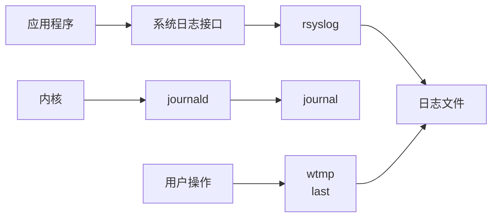
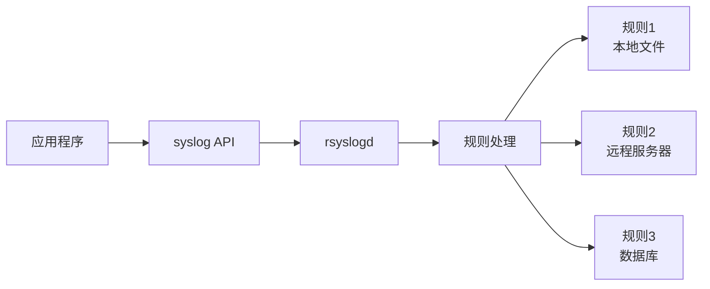
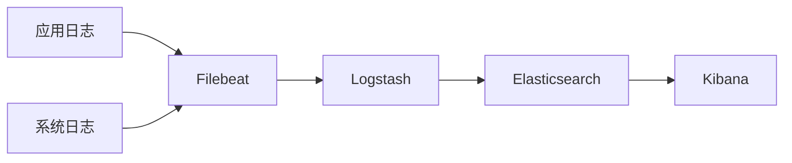
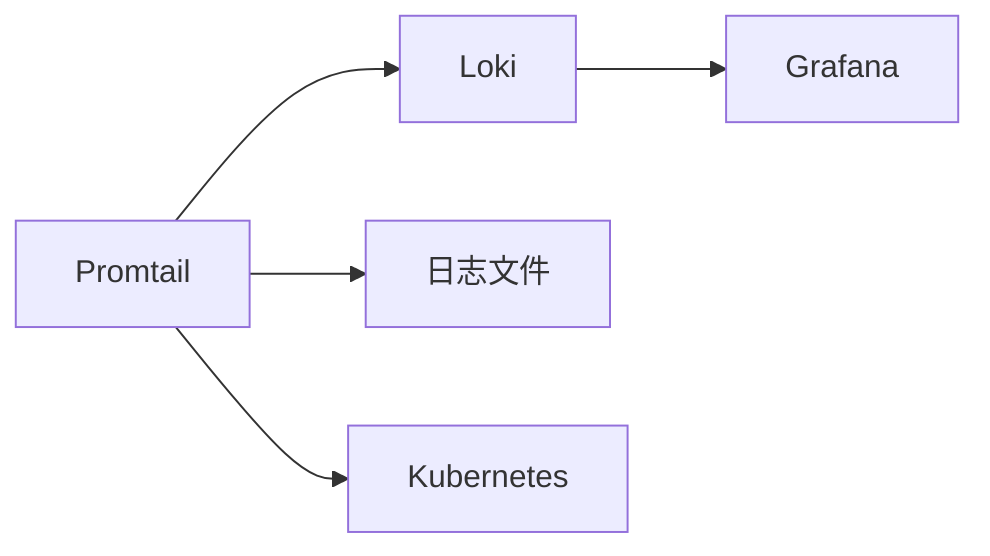
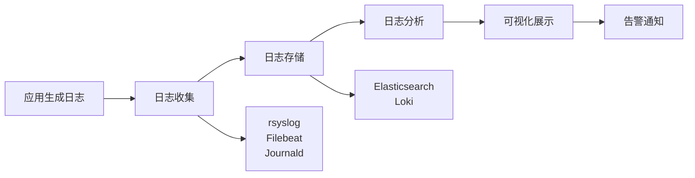

+++
title = "第58章：日志管理"
weight = 580
date = "2026-03-24T13:18:28+08:00"
type = "docs"
description = ""
isCJKLanguage = true
draft = false
+++


# 第五十八章：日志管理

## 58.1 系统日志

### Linux 日志体系

Linux 系统有一套完整的日志体系，记录着系统运行的一切"蛛丝马迹"。



### 主要日志文件

| 文件路径 | 内容 |
|---------|------|
| `/var/log/messages` | 系统主日志 |
| `/var/log/syslog` | 系统日志（Debian/Ubuntu） |
| `/var/log/secure` | 安全日志（认证相关） |
| `/var/log/boot.log` | 启动日志 |
| `/var/log/dmesg` | 内核消息 |
| `/var/log/kern.log` | 内核日志 |
| `/var/log/cron` | 定时任务日志 |
| `/var/log/maillog` | 邮件日志 |

### /var/log 目录结构

```bash
ls -la /var/log/

# 常见日志文件
/var/log/syslog       # 系统主要日志
/var/log/auth.log     # 认证日志
/var/log/nginx/       # Nginx 日志目录
/var/log/apache2/      # Apache 日志目录
/var/log/mysql/       # MySQL 日志
/var/log/httpd/       # Apache 日志
```

### 日志轮转机制

Linux 使用 `logrotate` 自动管理日志文件大小：

```bash
# 查看 logrotate 配置
ls /etc/logrotate.d/

# 查看 logrotate 主配置
cat /etc/logrotate.conf
```

### 查看日志文件

```bash
# 查看完整日志
cat /var/log/syslog

# 分页查看
less /var/log/syslog

# 实时跟踪日志
tail -f /var/log/syslog

# 查看最后100行
tail -100 /var/log/syslog

# 查看日志开头
head /var/log/syslog

# 按关键字过滤
grep "error" /var/log/syslog

# 统计错误次数
grep -c "error" /var/log/syslog
```

## 58.2 journalctl

`journalctl` 是 systemd 的日志管理工具，提供现代化的日志查看体验。

### 基本用法

```bash
# 查看所有日志（最 오래）
journalctl

# 查看系统日志
journalctl -xe

# 查看本次启动后的日志
journalctl -b

# 查看上次启动的日志
journalctl -b -1

# 查看指定时间的日志
journalctl --since "2024-01-01 10:00:00"
journalctl --since "1 hour ago"
journalctl --since today
journalctl --since yesterday
journalctl --until "2024-01-01 12:00:00"
```

### 进程相关日志

```bash
# 查看特定 PID 的日志
journalctl _PID=1234

# 查看特定服务的日志
journalctl -u nginx.service

# 查看多个服务
journalctl -u nginx.service -u mysql.service

# 跟踪服务实时日志
journalctl -f -u nginx.service
```

### 优先级过滤

```bash
# 0: emergency
# 1: alert  
# 2: critical
# 3: error
# 4: warning
# 5: notice
# 6: info
# 7: debug

# 只显示错误及以上级别
journalctl -p err

# 显示特定范围
journalctl -p 3..4
```

### 日志格式

```bash
# 按行号显示
journalctl -n 50

# 显示完整时间
journalctl -o short-iso

# 显示完整信息
journalctl -o verbose

# JSON 格式
journalctl -o json

# 显示磁盘使用
journalctl --disk-usage

# 清理旧日志
journalctl --vacuum-size=500M
journalctl --vacuum-time=7d
```

### journalctl 高级用法

```bash
# 查看内核日志
journalctl -k

# 查看用户日志
journalctl --user

# 查看用户服务
journalctl --user-unit=myapp.service

# 导出日志
journalctl --export > /tmp/logs.txt

# 实时显示新条目
journalctl -f

# 反向显示（最新的在前）
journalctl -r
```

## 58.3 rsyslog

rsyslog 是 syslog 的增强版，负责收集和转发系统日志。

### rsyslog 架构



### rsyslog 配置

```bash
# 主配置文件
/etc/rsyslog.conf

# 规则配置目录
/etc/rsyslog.d/

# 格式
# 设施.优先级      动作
# mail.info        /var/log/maillog
# mail.=info       /var/log/maillog
# mail.!info       /var/log/maillog
# mail.*           /var/log/maillog
```

### 设施和优先级

| 设施 | 说明 | 优先级 |
|------|------|--------|
| auth | 认证相关 | emerg/alert/crit/err/warning/info/debug/none |
| authpriv | 私有认证 | |
| cron | 定时任务 | |
| daemon | 守护进程 | |
| kern | 内核 | |
| lpr | 打印 | |
| mail | 邮件 | |
| news | 新闻 | |
| syslog | syslog自身 | |
| user | 用户进程 | |
| local0-7 | 本地 | |

### 配置示例

```bash
# /etc/rsyslog.d/50-default.conf

# 保存到本地文件
*.info;mail.none;authpriv.none;cron.none    /var/log/syslog
authpriv.*                                 /var/log/secure
mail.*                                     -/var/log/maillog
cron.*                                     /var/log/cron
*.emerg                                    :omusrmsg:*
```

### 远程日志

```bash
# 客户端配置 - 发送日志到远程服务器
# /etc/rsyslog.d/client.conf
*.* @@192.168.1.100:514

# 服务器配置 - 接收远程日志
# /etc/rsyslog.d/server.conf
# 加载 UDP 模块
module(load="imudp")
input(type="imudp" port="514")

# 加载 TCP 模块
module(load="imtcp")
input(type="imtcp" port="514")

# 接收远程日志并保存到文件
template RemoteLogs, "/var/log/%HOSTNAME%/%PROGRAMNAME%.log"
*.* ?RemoteLogs
& ~
```

### 日志格式模板

```bash
# 自定义日志格式
$ActionFileDefaultTemplate RSYSLOG_TraditionalFileFormat

# 时间戳格式
$template myFormat,"%TIMESTAMP% %HOSTNAME% %syslogtag%%msg%\n"
$ActionFileDefaultTemplate myFormat
```

## 58.4 logrotate

logrotate 负责自动轮转、压缩、删除日志文件，防止日志撑爆磁盘。

### 工作原理


### 主配置文件

```bash
# /etc/logrotate.conf
# 全局配置

# 每周轮转一次
weekly

# 保留4周日志
rotate 4

# 创建新日志文件
create

# 压缩日志
compress

# 不压缩日志的类型
delaycompress

# 包含子配置
include /etc/logrotate.d/
```

### 应用配置示例

```bash
# /etc/logrotate.d/nginx
/var/log/nginx/*.log {
    daily                 # 每日轮转
    missingok             # 日志不存在不报错
    rotate 14             # 保留14个文件
    compress              # 压缩
    delaycompress         # 延迟压缩（保留最近一个不压缩）
    notifempty            # 空日志不轮转
    create 0640 www-data adm  # 创建新文件的权限
    sharedscripts         # 多个日志文件共享脚本执行
    postrotate
        # nginx 重新打开日志
        [ -f /var/run/nginx.pid ] && kill -USR1 `cat /var/run/nginx.pid`
    endscript
}
```

### 手动执行

```bash
# 手动运行 logrotate
logrotate -f /etc/logrotate.conf

# 调试模式（不实际执行）
logrotate -d /etc/logrotate.conf

# 指定配置文件
logrotate -f /etc/logrotate.d/nginx
```

### 常用参数

| 参数 | 说明 |
|------|------|
| daily | 每日轮转 |
| weekly | 每周轮转 |
| monthly | 每月轮转 |
| rotate N | 保留 N 个文件 |
| compress | 压缩 |
| create mode owner group | 创建新文件权限 |
| missingok | 缺失不报错 |
| notifempty | 空文件不轮转 |
| sharedscripts | 脚本只执行一次 |
| postrotate/endscript | 轮转后执行的脚本 |
| prerotate/endscript | 轮转前执行的脚本 |

## 58.5 ELK Stack

ELK Stack 是强大的日志分析平台，由 Elasticsearch、Logstash、Kibana 组成。



### Elasticsearch

```bash
# 安装 Elasticsearch
wget -qO - https://artifacts.elastic.co/GPG-KEY-elasticsearch | sudo apt-key add -
echo "deb https://artifacts.elastic.co/packages/8.x/apt stable main" | sudo tee /etc/apt/sources.list.d/elastic-8.x.list
sudo apt update
sudo apt install elasticsearch

# 配置
sudo nano /etc/elasticsearch/elasticsearch.yml
# cluster.name: my-cluster
# node.name: node-1
# network.host: 0.0.0.0
# discovery.seed_hosts: ["127.0.0.1"]

# 启动
sudo systemctl start elasticsearch
sudo systemctl enable elasticsearch

# 测试
curl -X GET "localhost:9200/"
```

### Logstash

```bash
# 安装 Logstash
sudo apt install logstash

# 配置 pipeline
# /etc/logstash/conf.d/pipeline.conf
input {
  beats {
    port => 5044
  }
  tcp {
    port => 5000
  }
}

filter {
  if [log_type] == "nginx" {
    grok {
      match => { "message" => "%{IPORHOST:client_ip} - %{DATA:user} \[%{HTTPDATE:timestamp}\] \"%{WORD:method} %{URIPATHPARAM:request} HTTP/%{NUMBER:http_version}\" %{NUMBER:status:int} %{NUMBER:bytes:int}" }
    }
    date {
      match => [ "timestamp", "dd/MMM/yyyy:HH:mm:ss Z" ]
    }
  }
}

output {
  elasticsearch {
    hosts => ["localhost:9200"]
    index => "logs-%{+YYYY.MM.dd}"
  }
}

# 启动
sudo systemctl start logstash
```

### Kibana

```bash
# 安装 Kibana
sudo apt install kibana

# 配置
sudo nano /etc/kibana/kibana.yml
# server.host: "0.0.0.0"
# elasticsearch.hosts: ["http://localhost:9200"]

# 启动
sudo systemctl start kibana
sudo systemctl enable kibana

# 访问
# http://localhost:5601
```

### Filebeat

```bash
# 安装 Filebeat
sudo apt install filebeat

# 配置
sudo nano /etc/filebeat/filebeat.yml

filebeat.inputs:
- type: log
  enabled: true
  paths:
    - /var/log/*.log
    - /var/log/nginx/*.log

output.logstash:
  hosts: ["localhost:5044"]

# 启动
sudo systemctl start filebeat
sudo systemctl enable filebeat
```

## 58.6 Loki

Loki 是 Grafana 实验室出品的日志聚合系统，专为 Kubernetes 设计，资源占用比 ELK 低得多。

### Loki 架构



### 安装 Loki

```bash
# 下载 Loki
wget https://github.com/grafana/loki/releases/download/v2.8.0/loki-linux-amd64.zip
unzip loki-linux-amd64.zip
sudo mv loki-linux-amd64 /usr/local/bin/loki

# 创建配置目录
sudo mkdir -p /etc/loki
sudo nano /etc/loki/local-config.yaml
```

### Loki 配置

```yaml
# /etc/loki/local-config.yaml
auth_enabled: false

server:
  http_listen_port: 3100

ingester:
  lifecycler:
    address: 127.0.0.1
    ring:
      kvstore:
        store: inmemory
      replication_factor: 1
  chunk_idle_period: 15m
  chunk_retain_period: 30s

schema_config:
  configs:
    - from: 2024-01-01
      store: boltdb-shipper
      object_store: filesystem
      schema: v11
      index:
        prefix: index_
        period: 168h

storage_config:
  boltdb_shipper:
    active_index_directory: /tmp/loki/index
    cache_location: /tmp/loki/cache

  filesystem:
    directory: /tmp/loki/chunks

limits_config:
  reject_old_samples: true
  reject_old_samples_max_age: 168h
```

### Promtail 配置

```bash
# 创建 Promtail 配置
sudo nano /etc/promtail/config.yml

server:
  http_listen_port: 9080
  grpc_listen_port: 0

positions:
  filename: /tmp/positions.yaml

client:
  url: http://localhost:3100/loki/api/v1/push

scrape_configs:
- job_name: system
  static_configs:
  - targets:
      - localhost
    labels:
      job: varlogs
      __path__: /var/log/*log
```

### 启动 Loki

```bash
# 创建 systemd 服务
sudo nano /etc/systemd/system/loki.service

[Unit]
Description=Loki
After=network.target

[Service]
Type=simple
ExecStart=/usr/local/bin/loki -config.file /etc/loki/local-config.yaml
Restart=always

[Install]
WantedBy=multi-user.target

# 启动
sudo systemctl daemon-reload
sudo systemctl start loki
sudo systemctl enable loki
```

### Grafana 添加 Loki 数据源

1. 打开 Grafana
2. Configuration → Data Sources
3. 选择 "Loki"
4. URL: `http://localhost:3100`
5. Save & Test

### LogQL 查询

```logql
# 查找所有日志
{job="varlogs"}

# 过滤关键字
{service="nginx"} |= "error"

# 正则匹配
{service="nginx"} |~ "status_code=[4-5]\\d{2}"

# 解析标签
{service="nginx"} | json | status_code >= 400

# 统计
count_over_time({job="nginx"}[5m])

# 错误率
sum(rate({job="nginx"} | json | status_code >= 500[5m])) / sum(rate({job="nginx"}[5m]))
```

## 本章小结

本章我们学习了日志管理的完整体系：

| 工具 | 说明 |
|------|------|
| 系统日志 | /var/log 目录下的各种日志文件 |
| journalctl | systemd 日志查看工具 |
| rsyslog | 日志收集和转发服务 |
| logrotate | 日志轮转管理 |
| ELK Stack | Elasticsearch + Logstash + Kibana |
| Loki | 轻量级日志聚合系统 |

日志管理流程：



---

> 💡 **温馨提示**：
> 日志是排查问题的"第一现场"。养成查看日志的习惯比什么都重要。生产环境一定要配置日志轮转，否则磁盘被日志撑爆就是"灾难"！

---

**第五十八章：日志管理 — 完结！** 🎉

下一章我们将学习"数据备份"，掌握 tar/rsync 备份、数据库备份、定时备份、云端备份等内容。敬请期待！ 🚀
