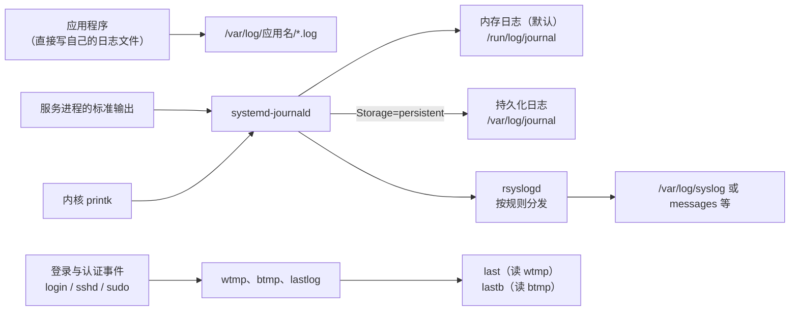
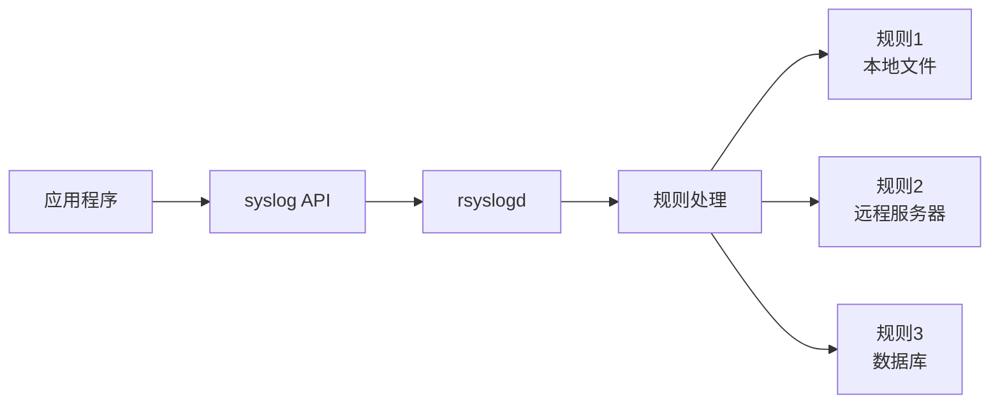
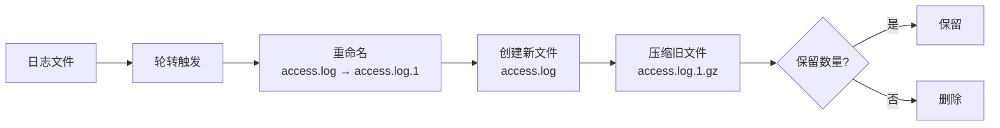
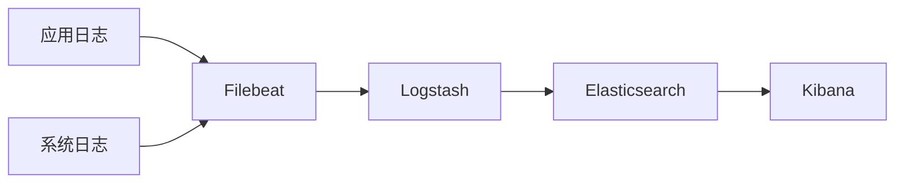
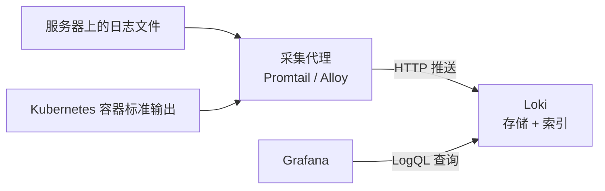
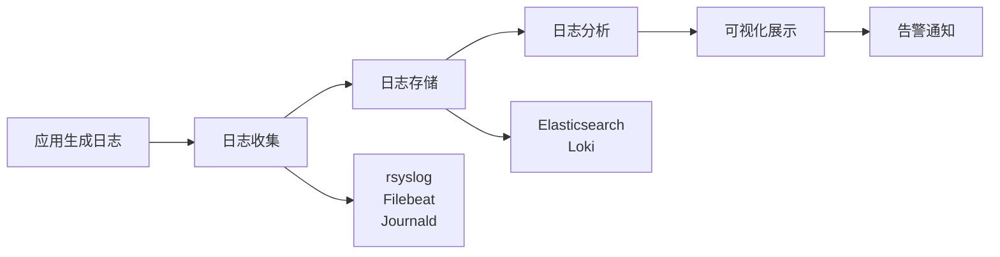

+++
title = "第58章：日志管理"
weight = 580
date = "2026-03-24T13:18:28+08:00"
type = "docs"
description = ""
isCJKLanguage = true
draft = false
+++


# 第五十八章：日志管理

## 58.1 系统日志

### Linux 日志体系

Linux 的日志来自好几个源头，由不同的组件负责收集，最后落到磁盘上：


```mermaid
graph LR
    A["应用程序<br>（直接写自己的日志文件）"] --> D["/var/log/应用名/*.log"]
    B["服务进程的标准输出"] --> C["systemd-journald"]
    E["内核 printk"] --> C
    C --> F["内存日志（默认）<br>/run/log/journal"]
    C -->|"Storage=persistent"| G["持久化日志<br>/var/log/journal"]
    C --> H["rsyslogd<br>按规则分发"]
    H --> I["/var/log/syslog 或 messages 等"]
    J["登录与认证事件<br>login / sshd / sudo"] --> K["wtmp、btmp、lastlog"]
    K --> L["last（读 wtmp）<br>lastb（读 btmp）"]
```

两条主线要记牢：

- **systemd-journald**：接住内核消息和服务进程的标准输出，默认只放在内存（`/run/log/journal`），重启就没了；
- **rsyslogd**：把 journald（或应用自己）投递过来的日志，按"设施.优先级"规则分发到 `/var/log/` 下的文件。

### 主要日志文件

| 文件路径 | 内容 | 适用发行版 |
|---------|------|-----------|
| `/var/log/messages` | 系统主日志（不含认证、邮件、定时任务） | RHEL 系（RHEL / CentOS / Rocky / Alma） |
| `/var/log/syslog` | 系统主日志 | Debian 系（Debian / Ubuntu） |
| `/var/log/secure` | 认证与安全事件（登录、sudo、su） | RHEL 系 |
| `/var/log/auth.log` | 认证与安全事件 | Debian 系 |
| `/var/log/cron` | 定时任务日志 | RHEL 系（Debian 系并进 syslog） |
| `/var/log/maillog` | 邮件日志 | RHEL 系 |
| `/var/log/mail.log` | 邮件日志 | Debian 系 |
| `/var/log/kern.log` | 内核日志 | Debian 系 |
| `/var/log/boot.log` | 启动过程日志 | 部分发行版才有，不一定存在 |
| `/var/log/dmesg` | 内核环形缓冲区的一份快照 | 部分系统有；通用做法是直接执行 `dmesg` 命令 |

> ⚠️ "日志在哪个文件"没有统一答案：**先确认发行版，再确认日志由 journald 还是 rsyslog 管**。Debian/Ubuntu 默认两者并存，日志常常两处都有；而精简的容器镜像里往往只有 journald，`/var/log/syslog` 可能压根不存在。找不到日志时先 `ls /var/log/`，别对着表格硬背。

### /var/log 目录结构

```bash
ls -la /var/log/

# 应用自己的日志通常各自一个子目录
/var/log/nginx/       # Nginx
/var/log/apache2/     # Apache（Debian 系）
/var/log/httpd/       # Apache（RHEL 系）
/var/log/mysql/       # MySQL / MariaDB

# 系统级日志文件（具体有哪些取决于发行版和已安装的服务）
/var/log/syslog       # Debian 系主日志
/var/log/messages     # RHEL 系主日志
/var/log/auth.log     # Debian 系认证日志
/var/log/secure       # RHEL 系认证日志
/var/log/journal/     # 只在配置了持久化存储时才存在
```

### 日志轮转机制

Linux 使用 `logrotate` 自动管理日志文件大小：

```bash
# 查看 logrotate 配置
ls /etc/logrotate.d/

# 查看 logrotate 主配置
cat /etc/logrotate.conf
```

### 查看日志文件

```bash
# 查看完整日志
cat /var/log/syslog

# 分页查看
less /var/log/syslog

# 实时跟踪日志
tail -f /var/log/syslog

# 查看最后 100 行（-n 不能省，tail -100 是过时写法，新版会给出警告）
tail -n 100 /var/log/syslog

# 实时跟踪并自动适应日志轮转（比 -f 更适合长期挂着）
tail -F /var/log/syslog

# 查看日志开头
head /var/log/syslog

# 按关键字过滤
grep "error" /var/log/syslog

# 统计错误次数
grep -c "error" /var/log/syslog
```

## 58.2 journalctl

`journalctl` 是 systemd 的日志管理工具，提供现代化的日志查看体验。

### 基本用法

```bash
# 查看所有日志（最早的在前，会进入分页器，按 q 退出）
journalctl

# 不想用内置分页器，或者要交给别的命令处理时
journalctl --no-pager | less

# 查看最近的问题条目：-x 附加解释信息，-e 直接跳到日志末尾
journalctl -xe

# 查看本次启动后的日志
journalctl -b

# 查看上次启动的日志
journalctl -b -1

# 查看指定时间的日志
journalctl --since "2024-01-01 10:00:00"
journalctl --since "1 hour ago"
journalctl --since today
journalctl --since yesterday
journalctl --until "2024-01-01 12:00:00"
```

### 进程相关日志

```bash
# 查看特定 PID 的日志
journalctl _PID=1234

# 查看特定服务的日志
journalctl -u nginx.service

# 查看多个服务
journalctl -u nginx.service -u mysql.service

# 跟踪服务实时日志
journalctl -f -u nginx.service
```

### 优先级过滤

```bash
# 0: emergency
# 1: alert  
# 2: critical
# 3: error
# 4: warning
# 5: notice
# 6: info
# 7: debug

# 只显示错误及以上级别
journalctl -p err

# 显示特定范围
journalctl -p 3..4
```

### 日志格式

```bash
# 按行号显示
journalctl -n 50

# 显示完整时间
journalctl -o short-iso

# 显示完整信息
journalctl -o verbose

# JSON 格式
journalctl -o json

# 显示磁盘使用
journalctl --disk-usage

# 清理旧日志
journalctl --vacuum-size=500M
journalctl --vacuum-time=7d
```

### journalctl 高级用法

```bash
# 查看内核日志
journalctl -k

# 查看用户日志
journalctl --user

# 查看用户服务
journalctl --user-unit=myapp.service

# 导出日志
journalctl --export > /tmp/logs.export     # 二进制格式，用于备份/迁移，需用 --file 读回
journalctl -o json --no-pager > /tmp/logs.json   # 结构化文本，交给 jq 之类的工具分析

# 实时显示新条目
journalctl -f

# 反向显示（最新的在前）
journalctl -r
```

### 一条必须先知道的：日志默认重启就没了

刚装好的系统里，`journalctl` 只能看到**本次开机以来**的日志，`journalctl -b -1`（看上一次启动）会直接报 "No journal files were found"。因为 journald 默认把日志写在内存文件系统 `/run/log/journal` 里。

想让它持久保存，创建目录并重启服务即可（重启后系统会自动改成持久化模式）：

```bash
sudo mkdir -p /var/log/journal
sudo systemd-tmpfiles --create --prefix /var/log/journal
sudo systemctl restart systemd-journald

# 确认日志目录已经建立，之后 -b -1 就能看到上次启动的日志了
journalctl --disk-usage
```

日志会一直长，必须限制它的大小，否则同样能把磁盘撑满：

```bash
# 在 /etc/systemd/journald.conf 里限制总量（推荐）
# SystemMaxUse=500M
sudo systemctl restart systemd-journald

# 或者临时清理
journalctl --vacuum-size=500M      # 只保留最近 500M
journalctl --vacuum-time=7d        # 只保留最近 7 天
```

### journalctl 和 syslog 是什么关系

两者**不是二选一**：

- 服务把日志打到标准输出/标准错误 → journald 收下；
- 如果系统装了 rsyslog，它作为 journald 的一个"客户端"再把日志转发到 `/var/log/syslog`、`/var/log/messages` 等文件；
- 所以同一条日志常常既能在 `journalctl -u nginx` 里看到，也能在 `/var/log/syslog` 里 `grep` 到。

排查顺序建议：**先用 `journalctl -u 服务名` 定位（结构化、有优先级、能按时间过滤），需要翻历史文件或日志被转发到别处时再去看 `/var/log/`。**

## 58.3 rsyslog

rsyslog 是 syslog 的增强版，负责收集和转发系统日志。

### rsyslog 架构


```mermaid
graph LR
    A[应用程序] --> B[syslog API]
    B --> C[rsyslogd]
    C --> D[规则处理]
    D --> E[规则1<br/>本地文件]
    D --> F[规则2<br/>远程服务器]
    D --> G[规则3<br/>数据库]
```

### rsyslog 配置

```bash
# 主配置文件
/etc/rsyslog.conf

# 规则配置目录
/etc/rsyslog.d/

# 规则格式： 设施.优先级    动作
#
# 选择器的含义（按优先级从高到低是 emerg > alert > crit > err > warning > notice > info > debug）：
#   mail.info    邮件相关、info 及以上                ┐
#   mail.=info   只有 info 这一级                      ├ 注意等号和感叹号的区别
#   mail.!info   info 以外的所有级别                   ┘
#   mail.*       所有级别
#   mail.none    什么等级都不要（常用于"排除某类日志"）
#
# 选择器可以合并，用分号隔开：
#   *.info;mail.none    所有设施的 info 及以上，但不要邮件
```

### 设施和优先级

| 设施 | 说明 | 优先级 |
|------|------|--------|
| auth | 认证相关 | emerg/alert/crit/err/warning/info/debug/none |
| authpriv | 私有认证 | |
| cron | 定时任务 | |
| daemon | 守护进程 | |
| kern | 内核 | |
| lpr | 打印 | |
| mail | 邮件 | |
| news | 新闻 | |
| syslog | syslog自身 | |
| user | 用户进程 | |
| local0-7 | 本地 | |

### 配置示例

```bash
# /etc/rsyslog.d/50-default.conf

# 下面这份是 Debian/Ubuntu 风格的规则
*.info;mail.none;authpriv.none;cron.none    /var/log/syslog
authpriv.*                                 /var/log/auth.log
mail.*                                     -/var/log/mail.log
cron.*                                     /var/log/cron.log
*.emerg                                    :omusrmsg:*
```

几点说明：

- 每行都是"**选择器 + 动作**"，选择器写"设施.优先级"；
- `*.info;mail.none;...` 的意思是：所有设施的 info 及以上，但**排除**邮件、私有认证和定时任务——这些内容各有自己的文件，没必要在主日志里重复一遍；
- 动作前面加 `-`（如 `-/var/log/mail.log`）表示**异步写入**：先攒在内存里，攒够或关闭时再落盘，性能好一点，代价是崩溃时可能丢最后几条；
- `:omusrmsg:*` 表示"给所有已登录用户都发一条消息"，`wall` 命令用的就是这个通道。

RHEL 系的同名文件里路径不一样，对照着改即可：

```bash
# /etc/rsyslog.d/*.conf（RHEL 风格）
*.info;mail.none;authpriv.none;cron.none    /var/log/messages
authpriv.*                                 /var/log/secure
mail.*                                     -/var/log/maillog
cron.*                                     /var/log/cron
```

### 远程日志

```bash
# 客户端配置 - 发送日志到远程服务器
# /etc/rsyslog.d/client.conf
*.* @192.168.1.100:514      # 单个 @ = UDP，快但可能丢包
*.* @@192.168.1.100:514     # 双 @ = TCP，更可靠；只选一种写

# 服务器配置 - 接收远程日志
# /etc/rsyslog.d/server.conf
# 加载 UDP 模块
module(load="imudp")
input(type="imudp" port="514")

# 加载 TCP 模块
module(load="imtcp")
input(type="imtcp" port="514")

# 接收远程日志并保存到文件
template RemoteLogs, "/var/log/%HOSTNAME%/%PROGRAMNAME%.log"
*.* ?RemoteLogs
& ~                         # & 表示"上一条规则"，~ 表示丢弃：不再往本地文件写一份
```

几个容易踩的点：

- 服务端要放行端口：`sudo ufw allow 514/tcp` 或 `sudo firewall-cmd --add-port=514/tcp --permanent`；
- `& ~` 别忘写，否则远程日志会在 `/var/log/syslog` 里再存一份，量大的时候磁盘吃不消；
- 按 `%HOSTNAME%` 分目录很方便，但主机名是客户端报上来的，不可全信。正规做法是在服务端用 `%FROMHOST-IP%` 之类的字段，或者对日志做校验；
- UDP 在网络上丢了就是丢了。日志审计场景请用 **TCP**（`@@`），需要加密再配 `gtls`/`imtcp` 的 TLS 参数。

### 日志格式模板

```bash
# 自定义日志格式（现代写法，推荐）
template(name="myFormat" type="string"
         string="%TIMESTAMP% %HOSTNAME% %syslogtag%%msg%\n")

# 把上面的模板设为默认格式
*.* /var/log/custom.log;myFormat
```

老配置文件里还能看到 `$template`、`$ActionFileDefaultTemplate` 这类以 `$` 开头的写法（所谓"传统格式"）。它们目前仍然有效，rsyslog 会同时兼容两种语法，但**新写的配置请用 `template(...)`、`action(...)`、`input(...)` 这种"新格式"**，可读性更好，也更容易查文档对照。

## 58.4 logrotate

logrotate 负责自动轮转、压缩、删除日志文件，防止日志撑爆磁盘。

### 工作原理


```mermaid
graph LR
    A[日志文件] --> B[轮转触发]
    B --> C[重命名<br/>access.log → access.log.1]
    C --> D[创建新文件<br/>access.log]
    D --> E[压缩旧文件<br/>access.log.1.gz]
    E --> F{保留数量?}
    F -->|是| G[保留]
    F -->|否| H[删除]
```

### 主配置文件

```bash
# /etc/logrotate.conf
# 全局配置

# 每周轮转一次
weekly

# 保留4周日志
rotate 4

# 创建新日志文件
create

# 压缩日志
compress

# 不压缩日志的类型
delaycompress

# 包含子配置
include /etc/logrotate.d/
```

### 应用配置示例

```bash
# /etc/logrotate.d/nginx
/var/log/nginx/*.log {
    daily                       # 每天轮转一次
    rotate 14                   # 保留 14 份历史
    compress                    # 压缩历史文件（.gz）
    delaycompress               # 最近那一份先不压，方便还在写它句柄的进程继续写
    missingok                   # 文件不存在不报错
    notifempty                  # 文件为空就不轮转
    create 0640 www-data adm    # 轮转后新建文件的权限与属主（RHEL 系通常写 nginx adm）
    su www-data adm             # 以该身份操作（目录属主不是 root 时必须写，否则会拒绝执行）
    sharedscripts               # 下面这段脚本对这批文件只执行一次，而不是每个文件都执行
    postrotate
        # 让 nginx 重新打开日志文件，否则它会继续往已被改名/压缩的旧文件里写
        if [ -f /run/nginx.pid ]; then
            kill -USR1 "$(cat /run/nginx.pid)"
        fi
    endscript
}
```

几个高频参数：

| 参数 | 什么时候用 |
|------|-----------|
| `size 100M` | 按大小轮转，比"每天一次"更能防住突然爆量 |
| `daily` + `maxsize 500M` | 每天转，但如果当天就超过 500M 也提前转 |
| `dateext` | 用日期给历史文件命名（`access.log-20260324`），比 `.1 .2 .3` 直观 |
| `su 用户 组` | 日志目录不属于 root 时必加，否则 logrotate 直接跳过并报错 |
| `copytruncate` | 程序不支持重新打开日志（没法 `kill -USR1`）时的备选：先复制再清空原文件。**有丢日志的风险**，能用 postrotate 就别用它 |
| `olddir /var/log/nginx/old` | 把历史文件挪到单独目录，主目录清爽 |

### 手动执行

```bash
# 手动运行 logrotate
logrotate -f /etc/logrotate.conf

# 调试模式（不实际执行）
logrotate -d /etc/logrotate.conf

# 显示详细过程（想看它到底干了什么时用）
logrotate -v /etc/logrotate.conf

# 指定配置文件
logrotate -f /etc/logrotate.d/nginx
```

> ⚠️ 现代发行版里 logrotate **不是由 cron 触发**，而是由 systemd 定时器（`logrotate.timer`）或 cron.daily 调用。检查方式：
>
> ```bash
> systemctl list-timers logrotate.timer     # 看下次什么时候跑
> systemctl status logrotate.timer
> ```
>
> 自己加了配置文件后，最稳妥的验证方式是 `logrotate -d /etc/logrotate.d/你的配置` 做一次演练，确认真会轮转、路径没写错。

### 常用参数

| 参数 | 说明 |
|------|------|
| daily | 每日轮转 |
| weekly | 每周轮转 |
| monthly | 每月轮转 |
| rotate N | 保留 N 个文件 |
| compress | 压缩 |
| create mode owner group | 创建新文件权限 |
| missingok | 缺失不报错 |
| notifempty | 空文件不轮转 |
| sharedscripts | 脚本只执行一次 |
| postrotate/endscript | 轮转后执行的脚本 |
| prerotate/endscript | 轮转前执行的脚本 |
| size 大小 | 达到指定大小就轮转 |
| maxsize 大小 | 即使没到周期，超过这个大小也轮转 |
| dateext | 历史文件用日期命名 |
| su 用户 组 | 指定执行身份（目录属主非 root 时必需） |
| copytruncate | 复制后清空原文件（不推荐，可能丢日志） |

## 58.5 ELK Stack

ELK Stack 是强大的日志分析平台，由 Elasticsearch、Logstash、Kibana 组成。


```mermaid
graph LR
    A[应用日志] --> B[Filebeat]
    B --> C[Logstash]
    C --> D[Elasticsearch]
    D --> E[Kibana]
    
    F[系统日志] --> B
```

### Elasticsearch

```bash
# 安装 Elasticsearch（以 Debian/Ubuntu 为例）
# 注意：apt-key 已被废弃，Ubuntu 24.04 起直接不可用，要用 signed-by 的 keyring
sudo install -d -m 0755 /etc/apt/keyrings
curl -fsSL https://artifacts.elastic.co/GPG-KEY-elasticsearch \
  | sudo gpg --dearmor -o /etc/apt/keyrings/elastic.gpg
echo "deb [signed-by=/etc/apt/keyrings/elastic.gpg] https://artifacts.elastic.co/packages/8.x/apt stable main" \
  | sudo tee /etc/apt/sources.list.d/elastic-8.x.list
sudo apt update
sudo apt install elasticsearch

# 单机部署时内核参数要放宽，否则 Elasticsearch 起不来
sudo sysctl -w vm.max_map_count=262144
echo "vm.max_map_count=262144" | sudo tee /etc/sysctl.d/99-elasticsearch.conf

# 配置（8.x 的配置文件是 YAML，注意缩进用空格，不能用 Tab）
sudo nano /etc/elasticsearch/elasticsearch.yml
# cluster.name: my-cluster
# node.name: node-1
# network.host: 127.0.0.1        # 只监听本机；要对外提供服务再改成具体网卡 IP
# discovery.seed_hosts: ["127.0.0.1"]

# 启动
sudo systemctl start elasticsearch
sudo systemctl enable elasticsearch

# 测试（8.x 默认开启安全认证，必须带账号密码或证书）
sudo /usr/share/elasticsearch/bin/elasticsearch-reset-password -u elastic   # 取一次初始密码
curl -k -u elastic:你设置的密码 "https://localhost:9200/"
```

> ⚠️ Elasticsearch 8.x 起**默认启用 TLS 和身份认证**。老教程里的 `curl localhost:9200/` 会直接返回 `missing authentication credentials`，不是装坏了。
>
> 另外 `network.host: 0.0.0.0` 意味着**任何人都能连你的 ES**。ES 没有复杂的权限模型，一旦暴露在公网，数据被拖走或者索引被勒索删除的例子非常多。默认只监听 `127.0.0.1`，确需对外时限制来源 IP 或走内网 + 反向代理 + 认证。

### Logstash

```bash
# 安装 Logstash
sudo apt install logstash

# 配置 pipeline
# /etc/logstash/conf.d/pipeline.conf
input {
  beats {
    port => 5044
  }
  tcp {
    port => 5000
  }
}

filter {
  if [log_type] == "nginx" {
    grok {
      match => { "message" => "%{IPORHOST:client_ip} - %{DATA:user} \[%{HTTPDATE:timestamp}\] \"%{WORD:method} %{URIPATHPARAM:request} HTTP/%{NUMBER:http_version}\" %{NUMBER:status:int} %{NUMBER:bytes:int}" }
    }
    date {
      match => [ "timestamp", "dd/MMM/yyyy:HH:mm:ss Z" ]
    }
  }
}

output {
  elasticsearch {
    hosts => ["localhost:9200"]
    index => "logs-%{+YYYY.MM.dd}"
  }
}

# 启动
sudo systemctl start logstash
```

### Kibana

```bash
# 安装 Kibana
sudo apt install kibana

# 配置
sudo nano /etc/kibana/kibana.yml
# server.host: "0.0.0.0"
# elasticsearch.hosts: ["http://localhost:9200"]

# 启动
sudo systemctl start kibana
sudo systemctl enable kibana

# 访问
# http://localhost:5601
```

### Filebeat

```bash
# 安装 Filebeat
sudo apt install filebeat

# 配置
sudo nano /etc/filebeat/filebeat.yml

filebeat.inputs:
- type: log
  enabled: true
  paths:
    - /var/log/*.log
    - /var/log/nginx/*.log

output.logstash:
  hosts: ["localhost:5044"]

# 启动
sudo systemctl start filebeat
sudo systemctl enable filebeat
```

## 58.6 Loki

Loki 是 Grafana 实验室出品的日志聚合系统，**只给日志建标签索引、不索引正文**，因此资源占用比 ELK 低得多，和 Grafana 的配合也最顺。它最早为 Kubernetes 场景设计，用来收集容器的标准输出，现在裸机日志也常用它。

### Loki 架构


```mermaid
graph LR
    D["服务器上的日志文件"] --> A["采集代理<br>Promtail / Alloy"]
    E["Kubernetes 容器标准输出"] --> A
    A -->|"HTTP 推送"| B["Loki<br>存储 + 索引"]
    C["Grafana"] -->|"LogQL 查询"| B
```

> ⚠️ Grafana 的采集端生态在 2024 年做过一次调整：**Promtail 已进入维护模式，官方推荐迁移到 Grafana Alloy**。下面仍以 Promtail 为例（存量部署很多），新项目可以直接看 Alloy 的文档，配置思路是一样的"读文件 → 打标签 → 推送 Loki"。

### 安装 Loki

```bash
# 下载 Loki
wget https://github.com/grafana/loki/releases/download/v3.0.0/loki-linux-amd64.zip
unzip loki-linux-amd64.zip
sudo mv loki-linux-amd64 /usr/local/bin/loki
# 安装版本号会不断更新，去 releases 页面挑当前稳定版即可

# 创建配置目录
sudo mkdir -p /etc/loki
sudo nano /etc/loki/local-config.yaml
```

### Loki 配置

```yaml
# /etc/loki/local-config.yaml
auth_enabled: false

server:
  http_listen_port: 3100

ingester:
  lifecycler:
    address: 127.0.0.1
    ring:
      kvstore:
        store: inmemory
      replication_factor: 1
  chunk_idle_period: 15m
  chunk_retain_period: 30s

schema_config:
  configs:
    - from: 2024-01-01
      store: tsdb
      object_store: filesystem
      schema: v13
      index:
        prefix: index_
        period: 24h

storage_config:
  tsdb_shipper:
    active_index_directory: /tmp/loki/index
    cache_location: /tmp/loki/cache

  filesystem:
    directory: /tmp/loki/chunks

limits_config:
  reject_old_samples: true
  reject_old_samples_max_age: 168h
```

> ⚠️ 这份配置里有两处最容易照抄到过时教程的地方：
>
> - `store: boltdb-shipper` 和 `schema: v11` 是 Loki 2.x 的写法，**Loki 3.0 起已移除**，新装请用 `tsdb` + `schema: v13`；
> - 把索引目录和分片目录放在 `/tmp` 只是方便演示。生产环境要换成持久化路径（如 `/var/lib/loki/`），否则一重启索引就没了。

### Promtail 配置

```bash
# 创建 Promtail 配置
sudo nano /etc/promtail/config.yml

server:
  http_listen_port: 9080
  grpc_listen_port: 0

positions:
  filename: /tmp/positions.yaml

# 新版本用 clients（复数，值为列表）；老版本是单数的 client
clients:
  url: http://localhost:3100/loki/api/v1/push

scrape_configs:
- job_name: system
  static_configs:
  - targets:
      - localhost
    labels:
      job: varlogs
      __path__: /var/log/*log
```

`__path__` 是文件通配符，`job` 之类的标签会成为查询时的筛选条件。**标签基数一定要控制住**：像 `__path__` 这种"每个文件都不同"的值不能直接当标签，否则标签组合爆炸，Loki 会又慢又占内存。

### 启动 Loki

```bash
# 创建 systemd 服务
sudo nano /etc/systemd/system/loki.service

[Unit]
Description=Loki
After=network.target

[Service]
Type=simple
ExecStart=/usr/local/bin/loki -config.file /etc/loki/local-config.yaml
Restart=always

[Install]
WantedBy=multi-user.target

# 启动
sudo systemctl daemon-reload
sudo systemctl start loki
sudo systemctl enable loki
```

### Grafana 添加 Loki 数据源

1. 打开 Grafana
2. Configuration → Data Sources
3. 选择 "Loki"
4. URL: `http://localhost:3100`
5. Save & Test

### LogQL 查询

```logql
# 查找所有日志
{job="varlogs"}

# 过滤关键字
{service="nginx"} |= "error"

# 正则匹配
{service="nginx"} |~ "status_code=[4-5]\\d{2}"

# 解析标签
{service="nginx"} | json | status_code >= 400

# 统计
count_over_time({job="nginx"}[5m])

# 错误率
sum(rate({job="nginx"} | json | status_code >= 500[5m])) / sum(rate({job="nginx"}[5m]))
```

过滤器小抄：`|=` 表示"包含这个字符串"，`!=` 表示"不包含"，`|~` / `!~` 才是正则（正则里的 `\d` 记得写成 `\\d`，因为它在 LogQL 的字符串里还要再转义一层）。

> 💡 LogQL 和 PromQL 长得很像：`rate(...[5m])`、`sum(...)` 都是从 Prometheus 那边借来的。区别在于日志流的起点是 `{标签="值"}`，而且它**要求必须先用标签把日志范围缩小**，不能一上来就全文搜——这正是 Loki "便宜"的原因。

## 本章小结

本章我们走完了日志从"产生"到"被分析"的完整链路：

| 工具 / 概念 | 说明 |
|-------------|------|
| `/var/log/` | 传统日志文件所在目录，具体有哪些文件**取决于发行版** |
| journalctl | systemd 的日志工具，`-u` 按服务看、`-p` 按级别过滤；**默认不持久化**，要手动建 `/var/log/journal` |
| rsyslog | 按"设施.优先级"规则把日志分发到文件或远程服务器 |
| logrotate | 轮转、压缩、清理日志；现代发行版由 `logrotate.timer` 触发 |
| ELK Stack | Elasticsearch + Logstash/Filebeat + Kibana，功能全但吃资源 |
| Loki + Grafana | 只索引标签不索引正文，轻量好养，适合和 K8s/Grafana 搭配 |

排障时的常用起手式：

```bash
journalctl -xe --since "10 min ago"     # 最近 10 分钟系统层面的异常
journalctl -u nginx --since today -f     # 跟着某个服务看
tail -F /var/log/nginx/error.log         # 跟踪应用日志
grep -i 'error\|fail' /var/log/syslog | tail -50
df -h /var/log && du -sh /var/log/*      # 日志把磁盘吃满了没有
```

日志管理流程：


```mermaid
graph LR
    A[应用生成日志] --> B[日志收集]
    B --> C[日志存储]
    C --> D[日志分析]
    D --> E[可视化展示]
    E --> F[告警通知]
    
    B --> G[rsyslog<br/>Filebeat<br/>Journald]
    C --> H[Elasticsearch<br/>Loki]
```

---

> 💡 **温馨提示**：
> 日志是排查问题的"第一现场"。养成查看日志的习惯比什么都重要。生产环境一定要配置日志轮转，否则磁盘被日志撑爆就是"灾难"！

---

**第五十八章：日志管理 — 完结！** 🎉

下一章我们将学习"数据备份"，掌握 tar/rsync 备份、数据库备份、定时备份、云端备份等内容。敬请期待！ 🚀
