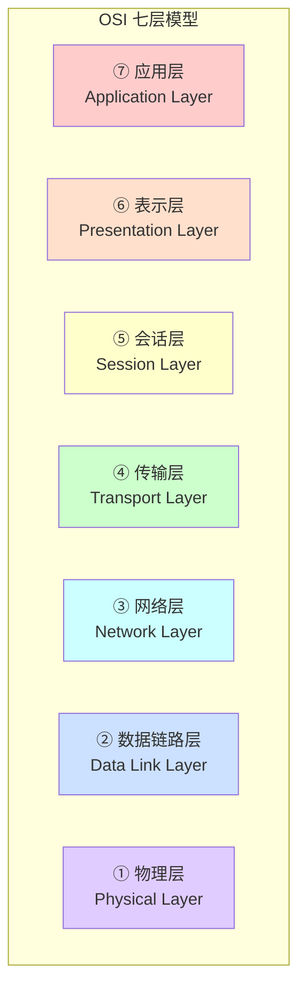
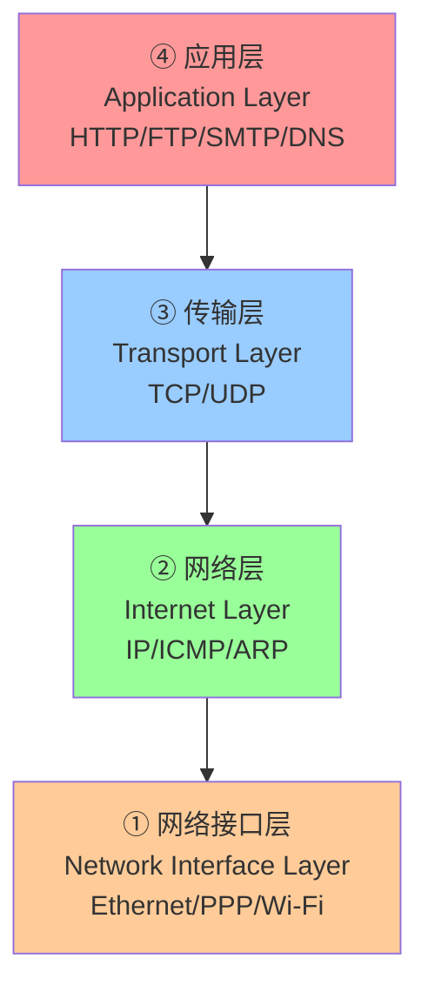
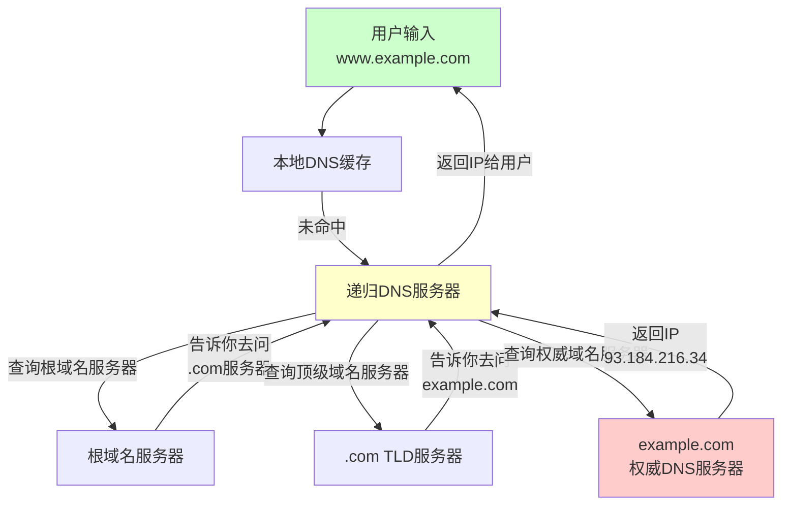
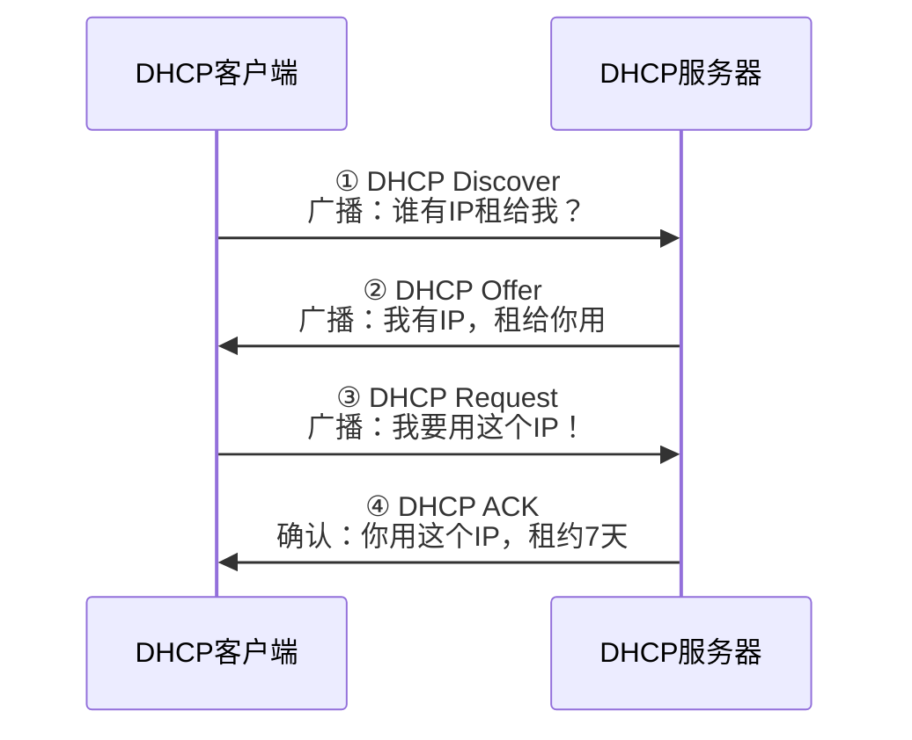
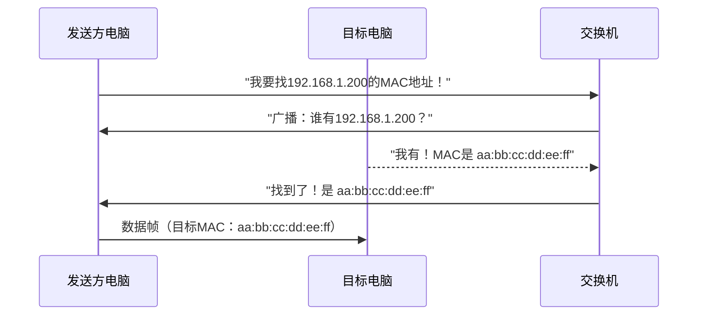
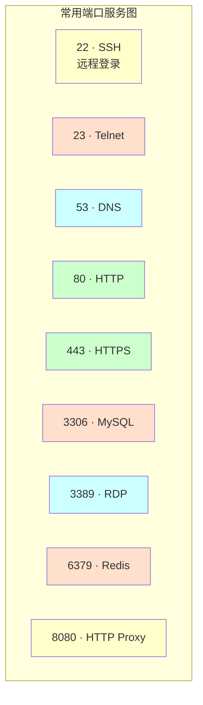

+++
title = "第29章：网络基础概念"
weight = 290
date = "2026-03-24T13:18:28+08:00"
type = "docs"
description = ""
isCJKLanguage = true
draft = false
+++


# 第二十九章：网络基础概念

想象一下，如果没有网络，你的电脑就是一座孤岛——玩不了游戏（单机版扫雷？那是惩罚）、刷不了网页、连不上服务器，简直比停电还难受。网络，就是让全世界电脑"组队开黑"的底层基础设施。

本章，我们将从网络的基本概念出发，把那些让人头皮发麻的术语——OSI七层模型、IP地址、子网掩码、DNS、DHCP、ARP——全部拆解，让你不仅"会用"，还能"懂它"。

> 本章配套视频：你的路由器指示灯疯狂闪烁，那就是网络在狂飙。

## 29.1 OSI 七层模型：网络通信分层

OSI（Open Systems Interconnection Model，开放系统互连模型）是网络通信的"七层高楼"。每层各司其职，数据从你的电脑出发，一路翻山越岭到达目标服务器，每一层都兢兢业业地干着自己的活。

为什么要分层？因为复杂问题拆解原则——没人想一次性搞定整个网络通信，那是灾难。

下面用一张图来展示这七层的关系：



### 29.1.1 各层职责详解

**① 物理层（Physical Layer）**

这是网络的"公路"，负责把数据的"0和1"转换成电信号、光信号或无线电波。网线、光纤、网卡、交换机（物理层）都在这层干活。

简单理解：物理层就是"怎么把数据变成可以传输的物理信号"。

**② 数据链路层（Data Link Layer）**

物理层负责"能跑"，数据链路层负责"跑得稳"。这层会加上MAC地址（每张网卡独一无二的身份证），做差错检测，确保数据帧在两个相邻节点之间可靠传输。

常见的协议：以太网（Ethernet）、PPP（Point-to-Point Protocol，点对点协议）。

**③ 网络层（Network Layer）**

这层负责"快递公司"的工作——IP协议登场了！网络层负责给数据包写上源IP和目标IP，然后决定这条数据包该走哪条路到达目的地。

路由器的"路由"功能就在这层。IP协议、ICMP协议（就是ping用的那个）都在这里。

**④ 传输层（Transport Layer）**

这一层开始"分包裹"了——一台电脑可能同时运行着QQ、浏览器、邮件客户端，网络层只知道送到"这栋楼"，传输层负责"送到具体的房间"。

两个明星协议：

- **TCP**（Transmission Control Protocol，传输控制协议）：可靠的、面向连接的协议，像挂号信，有确认机制。
- **UDP**（User Datagram Protocol，用户数据报协议）：不可靠的、无连接的协议，像平信，速度快但不保证送达。

端口号（Port）就在这层发挥作用，范围是1到65535。

**⑤ 会话层（Session Layer）**

负责建立、维护、管理通信会话。说白了，就是决定"什么时候开始聊天，什么时候结束聊天，中途断了怎么办"。

常见协议：NetBIOS、RPC（Remote Procedure Call，远程过程调用）。

**⑥ 表示层（Presentation Layer）**

负责数据的"翻译"工作——不同电脑可能用不同的编码方式（ASCII、EBCDIC），表示层负责把数据转换成对方能理解的格式。

加密/解密（SSL/TLS）、压缩、解压，也都在这层。

**⑦ 应用层（Application Layer）**

这是普通人唯一"看得见摸得着"的层。HTTP（网页）、FTP（文件传输）、SMTP（邮件发送）、DNS（域名解析）……全是这层的协议。

简单记忆：OSI七层从下往上可以这样记：

> 物链网传会表示应（谐音：**物链网传会话表演**）

或者记住这句：**"应表会传网链物"**（从应用层到物理层），想象一个快递包裹：
- **应**用层：快递单上写什么内容
- **表**示层：用中文还是英文写
- **会**话层：什么时候开始送
- **传**输层：选哪家快递公司（TCP=顺丰，UDP=普通快递）
- **网**络层：写上收件地址（IP地址）
- **链**路层：贴上条形码（MAC地址）
- **物**理层：卡车运走（电信号/光信号）

## 29.2 TCP/IP 四层模型

OSI是理论模型，实际干活的是TCP/IP四层模型。TCP/IP是Internet的基石，比OSI更简洁、更实用。



### 29.2.1 各层职责

**① 网络接口层（Network Interface Layer）**

对应OSI的物理层+数据链路层，负责把数据帧发送到物理介质上。ARP协议在这里解析MAC地址。

**② 网络层（Internet Layer）**

对应OSI的网络层，核心协议是IP（Internet Protocol），负责寻址和路由。

**③ 传输层（Transport Layer）**

对应OSI的传输层，TCP和UDP的地盘，负责端口通信和可靠性控制。

**④ 应用层（Application Layer）**

对应OSI的应用层+表示层+会话层，所有面向用户的协议都在这里。HTTP、SSH、SMTP、POP3、FTP、DNS……

### 29.2.2 OSI与TCP/IP对比

| OSI七层 | TCP/IP四层 | 代表协议 |
|---------|-----------|---------|
| 应用层、表示层、会话层 | 应用层 | HTTP、FTP、SMTP、DNS |
| 传输层 | 传输层 | TCP、UDP |
| 网络层 | 网络层 | IP、ICMP、ARP |
| 数据链路层、物理层 | 网络接口层 | Ethernet、PPP、Wi-Fi |

TCP/IP四层模型更实用，因为它就是Internet实际运行的标准。很多资料把这四层说成五层（把网络接口层拆成物理层+数据链路层），这是为了教学方便，不影响理解。

## 29.3 IP 地址：网络中的唯一标识

IP地址（Internet Protocol Address），就是电脑在网络世界中的"门牌号"。有了它，全世界的电脑才能互相找到对方。

### 29.3.1 IPv4：32位

IPv4是目前最广泛使用的IP地址版本，格式是32位二进制数，通常用"点分十进制"表示——把32位分成4组，每组8位，转换成0到255的十进制数。

例如：`192.168.1.100`

IPv4地址空间有 $2^{32}$ ≈ 42亿个地址。听起来很多，但全球70多亿人，加上服务器、路由器、各种物联网设备……早就"门牌号不够用了"。

这也是为什么现在逐渐在推广IPv6的原因——IPv6的地址多到可以给宇宙中每一颗原子都分配一个IP（好吧，有点夸张，但确实很多）。

IPv4地址的表示范围：0.0.0.0 到 255.255.255.255。

### 29.3.2 IPv6：128位

IPv6地址是128位二进制数，用冒号十六进制表示。例如：

```
2001:0db8:85a3:0000:0000:8a2e:0370:7334
```

简化规则：

- 每组的前导0可以省略：`2001:0db8:85a3:0:0:8a2e:370:7334`
- 连续的0可以用`::`缩写（只能出现一次）：`2001:db8:85a3::8a2e:370:7334`

IPv6的优势：地址空间近乎无限、自动配置更方便、内置IPsec安全支持。

## 29.4 IPv4 地址分类

IPv4地址被分成了五类（Class A到E）。分类的依据是地址的第一个字节（8位）的范围。

### 29.4.1 A类地址

范围：1.0.0.0 - 126.255.255.255

第一个字节的最高位固定为0（所以第一个字节范围是1-126）。

- 网络位：8位（第一字节）
- 主机位：24位（后三字节）
- 可用网络数：$2^7 - 2$ = 126个（减2是因为0.0.0.0是保留地址，127.x.x.x是环回地址）
- 每个网络可用主机数：$2^{24} - 2$ ≈ 1677万

A类地址块：1.0.0.0/8 到 126.0.0.0/8。

适合超大型机构，比如大型ISP、政府机构。

### 29.4.2 B类地址

范围：128.0.0.0 - 191.255.255.255

第一个字节最高两位固定为10（所以第一个字节范围是128-191）。

- 网络位：16位（前两字节）
- 主机位：16位（后两字节）
- 可用网络数：$2^{14}$ = 16384个
- 每个网络可用主机数：$2^{16} - 2$ = 65534个

适合中型机构，如大学、大型企业。

### 29.4.3 C类地址

范围：192.0.0.0 - 223.255.255.255

第一个字节最高三位固定为110（所以第一个字节范围是192-223）。

- 网络位：24位（前三个字节）
- 主机位：8位（最后一字节）
- 可用网络数：$2^{21}$ = 2097152个
- 每个网络可用主机数：$2^8 - 2$ = 254个

这是最常用的地址类型。我们家里路由器分给电脑、手机、冰箱（如果你家冰箱联网的话）的IP，通常都是C类地址，比如192.168.x.x。

### 29.4.4 D类地址（多播）

范围：224.0.0.0 - 239.255.255.255

D类地址没有网络位和主机位之分，用于多播（Multicast）——一对多的通信。比如视频直播、视频会议、路由协议（OSPF、RIP）等都用多播地址。

多播地址不能分配给单个主机。

### 29.4.5 E类地址（实验）

范围：240.0.0.0 - 255.255.255.255

E类地址是实验性地址，保留给未来使用。普通用户基本接触不到。

## 29.5 私有 IP 地址

公有IP地址是全球唯一的，像门牌号一样。私有IP地址（Private IP Address）则是在局域网内部使用的，相当于"公司内部工号"——内部可以用，但出了公司大门就没人认识了。

NAT（Network Address Translation，网络地址转换）技术就是用来把私有IP"翻译"成公有IP访问互联网的。

### 29.5.1 10.0.0.0 - 10.255.255.255

A类私有地址段，又称"10网段"。这是最大的私有地址空间，相当于一整个A类网络。

10.0.0.0/8 包含：约1677万个私有IP地址。

很多大型企业、运营商网络、学校会用这个地址段。

### 29.5.2 172.16.0.0 - 172.31.255.255

B类私有地址段，又称"172.16网段"到"172.31网段"。

172.16.0.0/12 包含：16个B类网络，约104万个私有IP地址。

很多公司的内网会用这个地址段。相比10网段，它更容易管理。

### 29.5.3 192.168.0.0 - 192.168.255.255

C类私有地址段，又称"192.168网段"。

192.168.0.0/16 包含：256个C类网络，约6万5千个私有IP地址。

这是家庭网络、SOHO网络最常用的私有地址段。你的路由器大概率分配的就是192.168.x.x这个段。

默认网关通常是192.168.0.1或192.168.1.1。

> **地址段选择建议**：家庭网络无脑用192.168.x.x，企业内网推荐用10.x.x.x（更易扩展）。就像买房子——家庭用户买小三房就够了，企业直接上别墅。

## 29.6 子网掩码：网络划分

子网掩码（Subnet Mask）用来告诉电脑"我是哪个网络的，哪部分是主机"。它和IP地址配合使用，把一个大的IP网络拆成若干个小网络。

子网掩码用连续的1表示网络位，连续的0表示主机位。

- `255.0.0.0` = `11111111.00000000.00000000.00000000` = /8
- `255.255.0.0` = `11111111.11111111.00000000.00000000` = /16
- `255.255.255.0` = `11111111.11111111.11111111.00000000` = /24

例如，IP `192.168.1.100` 配合子网掩码 `255.255.255.0`（/24），表示：

- 网络地址：192.168.1.0（主机位全0）
- 广播地址：192.168.1.255（主机位全1）
- 可用主机数：$2^8 - 2$ = 254台

CIDR（Classless Inter-Domain Routing，无类域间路由）表示法：直接写网络前缀长度，如`192.168.1.0/24`，比点分十进制更简洁，是目前的主流写法。

**为什么需要子网划分？**

想象一下，一个C类网络（254台主机）对于一个只有10台电脑的部门来说太浪费了，而对于有500台主机的部门来说又不够用。子网划分就是来解决这个问题的。

> **趣味记忆**：IP地址是"地址"，子网掩码是"地图"——地图告诉你哪些邻居和你在同一条街（网络），哪些在别的街（其他网络）。

## 29.7 网关：网络出口

网关（Gateway）是网络的"大门"，也就是不同网络之间通信的出口。你的电脑想要访问别的网络（最典型的就是访问互联网），就必须把数据包交给网关。

在家庭网络中：

- 你的电脑IP：`192.168.1.100`
- 子网掩码：`255.255.255.0`
- 默认网关：`192.168.1.1`（通常是你的路由器LAN口IP）

当你的电脑访问百度（一个公网IP）时，电脑发现"百度不在我的局域网里"，于是把数据包发给网关，让路由器帮忙"出去找"。

如果网关设置错了，你的电脑就会"有去无回"——发出去的数据包不知道往哪扔，访问任何外网都会失败。

> **类比**：网关就像小区大门。你要给远方的朋友寄信，不能直接扔出窗外，你得把信交给小区门口的保安（网关），保安帮你转寄出去。

## 29.8 路由：数据包转发

路由（Routing）是网络层最核心的功能——决定数据包从源头到目的地，该走哪条路。

路由表（Routing Table）是路由的核心数据结构，里面记录了各种"路由规则"：

- 去某个网络该怎么走
- 去某个网络该走哪个网关
- 走哪条路最近/最快

路由分为：

**静态路由（Static Routing）**：手动配置路由条目。小网络用这个没问题，但网络大了就很痛苦。

**动态路由（Dynamic Routing）**：路由协议自动学习路由表。路由器之间互相"聊天"，自动发现最佳路径。常见协议：RIP、OSPF、BGP。

- **RIP**（Routing Information Protocol）：适合小型网络，最大跳数15跳
- **OSPF**（Open Shortest Path First）：适合中大型网络，基于链路状态
- **BGP**（Border Gateway Protocol）：互联网骨干网络用的，连接不同AS（自治系统）

## 29.9 DNS 域名系统

DNS（Domain Name System，域名系统）是互联网的"电话本"——把人类好记的域名（如 `www.baidu.com`）翻译成机器能认的IP地址（如 `220.181.38.149`）。

如果没有DNS，你就得记着"我要上202.108.22.5，而不是记住baidu.com"，那互联网普及率估计要打个一折。

### 29.9.1 域名到 IP 转换

域名的层级结构：根域名（.） → 顶级域名（.com、.cn、.org） → 二级域名（baidu、google） → 子域名（www、mail）。

DNS查询的过程：



DNS查询有两种方式：

**递归查询**：客户端把查询任务完全交给DNS服务器，DNS服务器负责到底，返回最终结果或报错。

**迭代查询**：DNS服务器告诉客户端"我不知道，但你可以去问这个服务器"，客户端自己去下一级问。

### 29.9.2 根域名服务器

全球共有13组根域名服务器（由A到M命名），由不同机构运营。中国有F、I、J、K根镜像服务器。

虽然全球只有13组根域名服务器（为什么是13？因为最初的DNS规范中，UDP报文在512字节限制下最多包含13个服务器地址），但通过"任播"技术，实际上在全球部署了数百个物理服务器实例，保证了高可用性。

常见公共DNS服务器：

| 运营商 | DNS服务器 |
|--------|-----------|
| Google | 8.8.8.8 / 8.8.4.4 |
| Cloudflare | 1.1.1.1 / 1.0.0.1 |
| 阿里云 | 223.5.5.5 / 223.6.6.6 |
| 腾讯 DNSPod | 119.29.29.29 / 182.254.116.116 |

> **冷知识**：根域名服务器如果全挂了，互联网就瘫了——没有DNS，你连域名都解析不了。所以这些服务器被保护得像"核按钮"一样安全。

## 29.10 DHCP 动态主机配置协议

DHCP（Dynamic Host Configuration Protocol，动态主机配置协议）就是网络的"自动分配神器"——它能自动给局域网里的设备分配IP地址、子网掩码、网关、DNS服务器等信息。

想象一下，如果没有DHCP，网管得手动给每台电脑配置IP——50台电脑要改网关？一台一台改，改完人也没了。

### 29.10.1 自动分配 IP

DHCP有三种分配方式：

1. **动态分配（Dynamic Allocation）**：DHCP服务器从地址池中"租"给客户端一个IP地址，租约到期可以续租或被收回。这是家庭网络最常用的方式。
2. **自动分配（Automatic Allocation）**：DHCP服务器从地址池中分配一个固定的IP地址给特定客户端（基于MAC地址），永远不会被收回。
3. **手动分配（Manual Allocation）**：管理员静态绑定IP和MAC地址，DHCP只负责"通知"。

### 29.10.2 租约

DHCP的"租约"机制是其核心。IP地址不是永久占用的，而是"借"给客户端一段时间（通常几小时到几天）。

租约流程：



当租约过半时，客户端会尝试向原服务器续约；如果续约失败，租约到期前会重新发起Discover流程。

> **生活类比**：DHCP租约就像你租房子。房东（DHCP服务器）把房子（IP）租给你（客户端），签了合同（租约期7天）。住了3天半后你去找房东续约（续租）。如果房东不在，你就等合同到期后重新找房子（重新Discover）。

## 29.11 ARP 地址解析协议

ARP（Address Resolution Protocol，地址解析协议）负责在同一个局域网内，把IP地址"翻译"成MAC地址。

为什么需要ARP？因为在数据链路层通信（比如交换机转发数据帧），用的是MAC地址，不是IP地址。当你向同一局域网的某个IP发送数据时，你得先知道对方的MAC地址。

### 29.11.1 IP 到 MAC

ARP的工作流程：



具体过程：

1. 发送方检查ARP缓存，没有找到目标IP对应的MAC地址
2. 发送方广播一个ARP请求包（"谁是192.168.1.200？告诉192.168.1.100"）
3. 目标主机收到请求，单播ARP应答（"我是192.168.1.200，MAC地址是xx:xx:xx:xx:xx:xx"）
4. 发送方收到应答，把IP-MAC对应关系存入ARP缓存（通常缓存15-20分钟）

### 29.11.2 ARP 缓存

ARP缓存（ARP Cache）是本机存储的IP-MAC对应关系表。使用`arp -a`命令可以查看：

```bash
# 在Linux上查看ARP缓存
arp -a
```

```bash
? (192.168.1.1) at 00:1a:2b:3c:4d:5e [ether] on eth0
? (192.168.1.100) at 00:0c:29:5a:6b:7c [ether] on eth0
gateway (192.168.1.1) at 00:1a:2b:3c:4d:5e [ether] on eth0
```

如果ARP缓存被投毒（ARP欺骗攻击），攻击者可以伪装成网关，截获你的网络流量——这就是著名的"中间人攻击"（Man-in-the-Middle Attack）。

> **为什么ARP这么重要？** 因为它太好用了——ARP协议设计时没考虑安全性，就像一把没有锁的门。这也导致ARP欺骗成为局域网攻击的经典手段。

## 29.12 端口：服务标识（1-65535）

如果说IP地址是"大楼地址"，那么端口号（Port）就是"房间号"。一台电脑可能同时运行着Web服务、邮件服务、FTP服务……靠端口号来区分。

端口号是一个16位的数字，范围是1到65535。

### 29.12.1 知名端口：0-1023

这些端口被系统关键服务或常用协议占用，属于"黄金地段"。

| 端口 | 服务 | 说明 |
|------|------|------|
| 20/21 | FTP | 文件传输协议 |
| 22 | SSH | 安全远程登录 |
| 23 | Telnet | 远程登录（明文，不安全） |
| 25 | SMTP | 邮件发送 |
| 53 | DNS | 域名解析 |
| 80 | HTTP | 网页访问 |
| 110 | POP3 | 邮件接收 |
| 143 | IMAP | 邮件访问 |
| 443 | HTTPS | 加密网页 |
| 3306 | MySQL | 数据库 |
| 3389 | RDP | Windows远程桌面 |
| 5432 | PostgreSQL | 数据库 |

这些端口只有root（Linux）或管理员（Windows）才能绑定，防止普通程序"抢地盘"。

### 29.12.2 注册端口：1024-49151

这些端口由IANA注册给特定的应用服务。

例如：1080（SOCKS代理）、1433（MS SQL Server）、1521（Oracle）、3306（MySQL）、6379（Redis）、8080（HTTP代理/备用Web端口）、8443（HTTPS备用端口）。

### 29.12.3 动态端口：49152-65535

又称临时端口（Ephemeral Port），是操作系统分配给客户端程序的"临时房间"。当你访问一个网站时，浏览器会从动态端口范围内随机挑一个作为源端口。

例如，你用浏览器访问 `www.baidu.com`，浏览器可能从动态端口范围选一个（如`49234`）作为源端口，连接百度服务器的`80`端口。响应数据就通过这个`49234`端口返回。

## 29.13 常见端口与服务对应关系

常用端口服务图：



> **记忆技巧**：SSH（22）、SMTP（25）、HTTP（80）这三个最常用——SSH比Telnet多了两个字母，所以端口多1个（23）；HTTP是8，所以端口是80。

---

## 本章小结

本章我们从网络的"灵魂"——OSI七层模型和TCP/IP四层模型出发，一路向下挖掘：

- **OSI七层**是理论框架：物理层→数据链路层→网络层→传输层→会话层→表示层→应用层，每层各司其职。
- **TCP/IP四层**是实际干活的标准：网络接口层→网络层→传输层→应用层。
- **IP地址**是网络中的门牌号，IPv4（32位）快枯竭了，IPv6（128位）来救场。
- **IPv4分类**：A类（1-126，大型）、B类（128-191，中型）、C类（192-223，小型）、D类（224-239，多播）、E类（240-255，实验）。
- **私有IP**：10.x.x.x、172.16-31.x.x、192.168.x.x，只能在局域网内部使用。
- **子网掩码**和**CIDR**用来划分子网，决定哪些IP在同一个网络。
- **网关**是网络出口，是通往外界的唯一桥梁。
- **路由**决定数据包走哪条路到达目的地。
- **DNS**是互联网的电话本，把域名翻译成IP。
- **DHCP**自动分配IP，省去手动配置的痛苦。
- **ARP**把IP翻译成MAC地址，实现局域网内的通信。
- **端口**是服务的房间号，0-1023是系统端口，1024-49151是注册端口，49152-65535是动态端口。

网络基础是Linux服务器管理的地基，这一章没搞懂，后面配置网络服务就是盲人摸象。好了，去敲命令吧！
