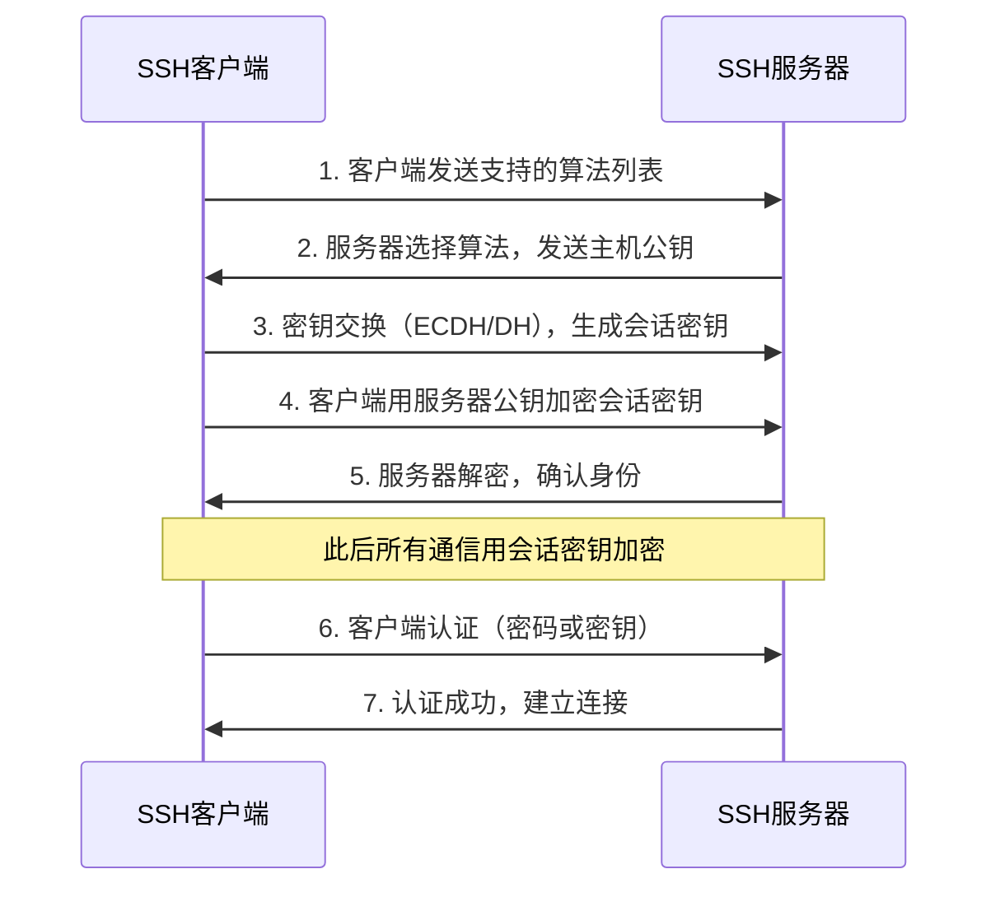

+++
title = "第32章：SSH 远程管理"
weight = 320
date = "2026-03-24T13:18:28+08:00"
type = "docs"
description = ""
isCJKLanguage = true
draft = false
+++


# 第三十二章：SSH 远程管理

SSH（Secure Shell）是Linux管理员的"生命线"——没有它，你管不了服务器、传不了文件、登录不了远程主机。

SSH出现之前，远程管理用的是Telnet和rlogin，但这些协议有一个致命问题：**明文传输**。你输入的密码在网络上"裸奔"，谁截获谁看到。SSH用加密技术解决了这个问题，所有数据都经过加密，让黑客无从下手。

> 本章配套视频：SSH学不会，服务器管理就是空谈。本章让你从"听说过SSH"到"SSH老司机"。

## 32.1 SSH 简介：Secure Shell 安全远程登录

SSH（Secure Shell，安全外壳协议）是一种加密的网络协议，用于在不安全的网络上提供安全的远程登录和其他网络服务。

### 32.1.1 加密通信

SSH的核心是加密。所有传输的数据——包括你输入的密码、你执行的命令、你传输的文件——全部被加密。攻击者即使在网络上抓包，也只能看到一堆乱码。

SSH支持多种加密算法：AES、3DES、Blowfish、ChaCha20等。现代SSH默认使用AES-256-CTR或ChaCha20-Poly1305，安全性极高。

### 32.1.2 端口：22

SSH默认监听TCP端口22。这个端口是互联网上最"繁忙"的端口之一——大多数服务器管理员都用它来管理服务器。

> **安全建议**：把SSH端口改成非22端口，可以减少大量的自动化暴力破解攻击。攻击者通常只扫描22端口，改端口不会让你绝对安全（攻击者可以扫描所有端口），但会**显著减少**很多"噪音"。
> 
> 🔒 **更好的安全措施**：
> 1. **禁用密码登录，只用密钥认证**（最安全）
> 2. **使用Fail2ban自动封禁暴力破解IP**
> 3. **配置防火墙只允许特定IP访问SSH**
> 4. **使用跳板机（Bastion Host）或VPN**
> 5. **定期更新SSH版本，修复安全漏洞**

## 32.2 SSH 工作原理

SSH的安全性来自于它的加密机制和密钥交换过程。整个连接建立过程分为几个阶段。

### 32.2.1 密钥交换

SSH连接建立的第一步是密钥交换（Key Exchange）。客户端和服务器协商确定使用哪种加密算法，并交换临时会话密钥。

密钥交换算法（KEX）：ECDHE（椭圆曲线Diffie-Hellman）、DH（Diffie-Hellman）等。这些算法让双方在一条不安全的通道上，"协商"出一个只有双方知道的共享密钥，而攻击者无法推算出来。

### 32.2.2 对称加密

密钥交换完成后，客户端和服务器会生成一个**会话密钥**（Session Key），用于对称加密后续的所有通信数据。

对称加密的特点：加密和解密用同一把钥匙，速度快，适合加密大量数据。

### 32.2.3 非对称加密

在密钥交换过程中，SSH使用**非对称加密**（公钥加密、私钥解密）来安全地传输会话密钥。

服务器和客户端各自有一对密钥：

- **服务器密钥对**：服务器上的主机公钥/私钥，用于验证服务器身份
- **客户端密钥对**（可选）：用户的公钥/私钥，用于免密码登录

SSH连接建立流程：



## 32.3 SSH 客户端使用：ssh 命令

Linux和macOS自带SSH客户端，Windows 10+也内置了OpenSSH客户端。

### 32.3.1 ssh 用户@主机

最基础的SSH登录方式：

```bash
# 登录到远程服务器（使用当前用户名）
ssh 192.168.1.100

# 登录到远程服务器（指定用户名）
ssh root@192.168.1.100

# 使用域名登录
ssh user@example.com
```

第一次连接一台新服务器时，会看到类似这样的提示：

```bash
The authenticity of host '192.168.1.100 (192.168.1.100)' can't be established.
ECDSA key fingerprint is SHA256:xxxxxxxxxxxxxxxxxxxxxxxxxxxxxxxxxxxxxxx.
Are you sure you want to continue connecting (yes/no)?
```

这是SSH在问你："这是你第一次连接这台服务器，它的指纹是xxx，你要信任它吗？"

输入`yes`确认，SSH会把服务器的公钥保存在`~/.ssh/known_hosts`文件中。下次再连接时，如果服务器指纹变了（说明有人可能在伪造这个服务器），SSH会发出警告：

```
@@@@@@@@@@@@@@@@@@@@@@@@@@@@@@@@@@@@@@@@@@@@@@@@@@@@@@@@@@@
@    WARNING: REMOTE HOST IDENTIFICATION HAS CHANGED!     @
@@@@@@@@@@@@@@@@@@@@@@@@@@@@@@@@@@@@@@@@@@@@@@@@@@@@@@@@@@@
IT IS POSSIBLE THAT SOMEONE IS DOING SOMETHING NASTY!
```

### 32.3.2 ssh -p 端口 用户@主机

如果SSH服务器不是用默认的22端口（见32.4.5节端口修改），登录时需要用`-p`参数指定端口：

```bash
# 连接到非标准端口2222
ssh -p 2222 root@192.168.1.100

# 记住这个写法：-p 端口 用户@主机
# 不要和 scp 的 -P 混淆（scp 用大写 -P）
```

### 32.3.3 ssh -i 密钥文件 用户@主机

使用私钥文件登录（免密码登录的客户端侧命令）：

```bash
# 使用指定私钥登录
ssh -i ~/.ssh/my_private_key root@192.168.1.100

# 私钥文件权限必须是600
chmod 600 ~/.ssh/my_private_key
```

## 32.4 SSH 服务器配置：/etc/ssh/sshd_config

SSH服务器的配置在`/etc/ssh/sshd_config`文件中。修改配置后需要重启sshd服务。

> **重要**：sshd_config是服务器配置文件，ssh_config是客户端配置文件。别搞混。

```bash
# 查看当前SSH服务器配置（带注释的版本）
sudo sshd -T
```

### 32.4.1 Port：端口

指定SSH服务器监听的端口。默认是22。

```bash
# 在sshd_config中添加或修改
Port 22

# 建议改成非标准端口（如2222）减少自动化攻击
Port 2222
```

### 32.4.2 PermitRootLogin：允许 root 登录

是否允许root用户直接通过SSH登录。生产环境建议禁止。

```bash
# 允许root登录（不推荐）
PermitRootLogin yes

# 禁止root登录（推荐）
PermitRootLogin no

# 只允许root用密钥登录（折中方案）
PermitRootLogin prohibit-password

# 完全禁止
PermitRootLogin no
```

### 32.4.3 PasswordAuthentication：密码认证

是否允许使用密码认证。生产环境建议关闭（改为密钥认证）。

```bash
# 允许密码认证（默认）
PasswordAuthentication yes

# 禁止密码认证（强制密钥认证，推荐）
PasswordAuthentication no
```

### 32.4.4 PubkeyAuthentication：公钥认证

是否允许公钥认证。公钥认证比密码安全得多，建议开启。

```bash
# 允许公钥认证（默认）
PubkeyAuthentication yes

# 禁止公钥认证
PubkeyAuthentication no
```

### 32.4.5 端口修改

生产环境建议修改默认端口，减少自动化攻击：

```bash
# 编辑SSH服务器配置
sudo vim /etc/ssh/sshd_config

# 找到 Port 22 这一行，修改为
Port 2222

# 重启SSH服务使配置生效
sudo systemctl restart sshd
```

> **远程修改SSH端口的注意事项**：如果通过SSH远程修改端口，**一定要先开一个新的SSH连接测试新端口是否通**，再关闭旧连接！否则你可能把自己锁在外面，只能去机房接显示器。

## 32.5 SSH 密钥对生成：ssh-keygen

SSH密钥对由公钥和私钥组成。公钥放在服务器上，私钥留在客户端。登录时，客户端用私钥签名，服务器用公钥验证——不需要传输密码。

### 32.5.1 ssh-keygen -t rsa

生成RSA密钥对（传统算法，兼容性最好）：

```bash
# 生成RSA密钥对
ssh-keygen -t rsa -b 4096 -C "your_email@example.com"

# 参数说明：
# -t rsa：指定密钥类型为RSA
# -b 4096：指定密钥长度为4096位（越长越安全，但越慢）
# -C "注释"：给密钥加个备注（通常是邮箱）
```

```bash
Generating public/private rsa key pair.
Enter file in which to save the key (/home/user/.ssh/id_rsa):
Enter passphrase (empty for no passphrase):
Enter same passphrase again:
Your identification has been saved in /home/user/.ssh/id_rsa
Your public key has been saved in /home/user/.ssh/id_rsa.pub
```

`passphrase`（密码短语）是私钥的二次保护。即使你的私钥文件被人复制走，没有密码短语也无法使用。建议设置一个强密码。

### 32.5.2 ssh-keygen -t ed25519

生成Ed25519密钥对（现代算法，更安全、更短、更快）：

```bash
# 生成Ed25519密钥对（推荐）
ssh-keygen -t ed25519 -C "your_email@example.com"
```

```bash
Generating public/private ed25519 key pair.
Enter file in which to save the key (/home/user/.ssh/id_ed25519):
Enter passphrase (empty for no passphrase):
Enter same passphrase again:
Your identification has been saved in /home/user/.ssh/id_ed25519
Your public key has been saved in /home/user/.ssh/id_ed25519.pub
```

Ed25519的优势：密钥更短（256位 vs RSA 4096位）、性能更好、安全性更高。现代SSH客户端基本都支持Ed25519。

**三种密钥类型对比**：

| 类型 | 密钥长度 | 兼容性 | 安全性 | 性能 |
|------|---------|--------|--------|------|
| RSA | 2048-4096位 | 最好 | 高 | 较慢 |
| ECDSA | 256/384/521位 | 较好 | 高 | 快 |
| Ed25519 | 256位固定 | 现代系统 | 最高 | 最快 |

> **推荐**：新系统用Ed25519，老系统兼容性要求高用RSA 4096位。

## 32.6 SSH 公钥认证：无密码登录

公钥认证的原理：客户端持有私钥，服务器持有公钥。登录时，服务器生成一个随机挑战，客户端用私钥签名后发回，服务器用公钥验证——整个过程不需要传输密码。

### 32.6.1 ~/.ssh/authorized_keys

公钥存放在服务器的`~/.ssh/authorized_keys`文件中（每个用户有自己的文件）。

```bash
# 查看当前用户的authorized_keys文件
cat ~/.ssh/authorized_keys
```

文件格式：每行一个公钥，内容是`ssh-rsa AAAA... user@hostname`这样的字符串。

### 32.6.2 权限：700、600

SSH对权限要求非常严格！如果权限不对，SSH会拒绝使用密钥。

```bash
# 用户home目录权限必须是700或更严格（不能有组内用户可写）
chmod 700 ~/.ssh

# authorized_keys文件权限必须是600
chmod 600 ~/.ssh/authorized_keys

# 公钥文件权限可以是644
chmod 644 ~/.ssh/id_rsa.pub
```

常见权限问题：

- `chmod 777 ~/.ssh`：权限太开，SSH拒绝使用（"It is required that your private key files are NOT accessible by others"）
- SSH会同时检查用户home目录和`.ssh`目录的权限

## 32.7 ssh-copy-id 公钥推送工具

手动复制公钥到服务器太麻烦了。`ssh-copy-id`工具帮你一键搞定。

```bash
# 把本地的公钥复制到远程服务器的authorized_keys
ssh-copy-id user@192.168.1.100

# 如果SSH端口不是22
ssh-copy-id -p 2222 user@192.168.1.100

# 指定公钥文件
ssh-copy-id -i ~/.ssh/id_rsa.pub user@192.168.1.100
```

```bash
/usr/bin/ssh-copy-id: INFO: attempting to log in with the new key(s), to filter out any that are already installed.
/usr/bin/ssh-copy-id: INFO: 1 key(s) remain to be installed -- this is the number of new keys
user@192.168.1.100's password: 

Number of key(s) added: 1
```

它会要求你输入一次密码（最后一次），然后把你的公钥自动追加到服务器的`~/.ssh/authorized_keys`文件中。

**如果服务器禁止了密码认证（PasswordAuthentication no）**，ssh-copy-id就无法使用了——你得先把公钥手动传到服务器上：

```bash
# 方法1：scp复制
scp ~/.ssh/id_rsa.pub user@192.168.1.100:~/.ssh/

# 方法2：通过云服务商控制台（阿里云、AWS等有密钥对管理）
```

手动追加公钥：

```bash
# 在本地查看公钥
cat ~/.ssh/id_rsa.pub

# 在服务器上
mkdir -p ~/.ssh
chmod 700 ~/.ssh
echo "ssh-rsa AAAA..." >> ~/.ssh/authorized_keys
chmod 600 ~/.ssh/authorized_keys
```

## 32.8 SSH 配置文件：~/.ssh/config

SSH客户端配置可以写在`~/.ssh/config`文件中，给常用连接起别名、设置默认参数。

```bash
# 创建config文件
touch ~/.ssh/config

# 设置权限
chmod 600 ~/.ssh/config
```

### 32.8.1 Host：主机别名

用简短的名字代替长长的服务器地址：

```bash
# ~/.ssh/config

# 生产服务器
Host prod
    HostName 192.168.1.100
    User root
    Port 2222
    IdentityFile ~/.ssh/id_rsa_prod

# 测试服务器
Host test
    HostName test.example.com
    User developer
    Port 22
    IdentityFile ~/.ssh/id_ed25519_test

# GitHub
Host github.com
    HostName github.com
    User git
    IdentityFile ~/.ssh/id_ed25519_github
```

### 32.8.2 HostName：实际地址

`HostName`指定实际连接的主机名或IP地址（支持域名）。

### 32.8.3 User：用户名

`User`指定登录用户名，不用每次都输入`user@`。

### 32.8.4 Port：端口

`Port`指定SSH端口。

配置完成后，连接变得超级简单：

```bash
# 之前
ssh -p 2222 -i ~/.ssh/id_rsa_prod root@192.168.1.100

# 现在
ssh prod
```

配置示例：管理多台服务器的黄金配置：

```bash
# ~/.ssh/config

# 公共配置（所有连接都用的参数）
Host *
    # 断开后自动重连
    ServerAliveInterval 60
    ServerAliveCountMax 3
    # 压缩传输（慢速网络有用）
    Compression yes

# 生产服务器A
Host prod-a
    HostName 192.168.1.100
    User deploy
    Port 2222
    IdentityFile ~/.ssh/keys/prod_a

# 生产服务器B
Host prod-b
    HostName 192.168.1.101
    User deploy
    Port 2222
    IdentityFile ~/.ssh/keys/prod_b

# Git服务器
Host gitlab
    HostName gitlab.example.com
    User git
    Port 22
    IdentityFile ~/.ssh/keys/gitlab
```

## 32.9 SSH 端口转发

SSH端口转发（Port Forwarding）可以把远程服务器的端口映射到本地，或者把本地端口映射到远程。这是SSH最强大的功能之一。

### 32.9.1 本地转发：-L

把远程服务器的端口映射到本地的指定端口。格式：`-L 本地端口:远程主机:远程端口`。

场景：远程服务器上有个MySQL数据库（localhost:3306），你想从本地电脑用Navicat连接它：

```bash
# 把远程服务器的3306端口映射到本地的3306端口
ssh -L 3306:localhost:3306 user@remote-server

# 然后本地Navicat连接localhost:3306，就等于连接远程服务器的MySQL
```

更复杂的例子：

```bash
# 远程服务器能访问内网10.0.0.50的Redis，想从本地访问
# 把远程内网的10.0.0.50:6379映射到本地的6379端口
ssh -L 6379:10.0.0.50:6379 user@remote-server

# 本地连接localhost:6379，就等于连接远程内网的Redis
redis-cli -h localhost -p 6379
```

### 32.9.2 远程转发：-R

把本地电脑的端口映射到远程服务器的指定端口。格式：`-R 远程端口:本地主机:本地端口`。

场景：你在家访问不了公司内网的服务器，但公司服务器可以SSH连到你家：

```bash
# 在公司服务器上执行（跳板机）
ssh -R 8080:localhost:80 user@home-pc

# 现在你在家访问 home-pc:8080，就等于访问公司服务器的80端口
```

> **实战场景**：内网服务器没有公网IP，无法从外部访问。用远程转发，通过一台有公网IP的云服务器做跳板，实现从公网访问内网服务器。

## 32.10 SSH 隧道：SOCKS 代理

SSH可以建立一个SOCKS5代理服务器，通过SSH隧道转发流量。适合在公共WiFi下安全上网，或者访问特定网络。

```bash
# 建立一个SOCKS5代理，监听本地1080端口
ssh -D 1080 user@remote-server

# 然后在浏览器或系统代理设置中配置：
# SOCKS Host: localhost (127.0.0.1)
# Port: 1080
```

所有通过这个代理的流量都会经过SSH隧道加密传输，在远程服务器上以服务器IP访问目标网站。

```bash
# 保持后台运行（用Ctrl+Shift+T挂起当前session）
# 或使用autossh自动重连
sudo apt install autossh
autossh -M 20000 -D 1080 user@remote-server
```

## 32.11 SSH 安全加固

SSH服务器暴露在互联网上，安全性至关重要。以下是生产环境的SSH加固建议。

### 32.11.1 禁用密码登录

密码登录是最不安全的认证方式——容易被暴力破解。改为密钥认证：

```bash
# 编辑sshd_config
sudo vim /etc/ssh/sshd_config

# 确保以下配置
PasswordAuthentication no
PubkeyAuthentication yes
```

### 32.11.2 更改默认端口

把端口从22改成其他端口，减少99%的自动化攻击扫描：

```bash
Port 2222
```

### 32.11.3 限制用户

只允许特定用户SSH登录：

```bash
# 只允许指定用户
AllowUsers alice bob carol

# 或者禁止指定用户
DenyUsers attacker
```

禁止root登录：

```bash
PermitRootLogin no
```

### 32.11.4 使用防火墙

用防火墙限制SSH端口只对特定IP开放：

```bash
# 只允许192.168.1.0/24网段连接SSH
sudo ufw allow from 192.168.1.0/24 to any port 2222

# 禁止所有连接SSH（慎用，别把自己锁外面）
sudo ufw deny 22/tcp
```

**生产环境SSH加固完整配置**：

```bash
# /etc/ssh/sshd_config

# 基础配置
Port 2222
ListenAddress 0.0.0.0

# 认证配置
PermitRootLogin no
PasswordAuthentication no
PubkeyAuthentication yes
MaxAuthTries 3           # 最多尝试3次密码
LoginGraceTime 60        # 60秒内登录失败则断开

# 超时配置
ClientAliveInterval 300   # 5分钟无活动自动断开
ClientAliveCountMax 2

# 安全配置
X11Forwarding no         # 不需要X11转发
AllowTcpForwarding no    # 不需要端口转发可以关闭
PermitEmptyPasswords no

# 日志
LogLevel VERBOSE
```

```bash
# 修改配置后测试语法，重启服务
sudo sshd -t && sudo systemctl restart sshd
```

## 32.12 fail2ban 防暴力破解

fail2ban是一个入侵防御工具，通过监控日志文件，自动封禁多次登录失败的IP。

### 32.12.1 安装：apt install fail2ban

```bash
# 安装fail2ban
sudo apt update
sudo apt install fail2ban

# 启动并设置开机自启
sudo systemctl enable fail2ban
sudo systemctl start fail2ban

# 查看状态
sudo systemctl status fail2ban
```

### 32.12.2 配置：/etc/fail2ban/jail.local

fail2ban的配置使用`jail.local`文件覆盖默认的`jail.conf`：

```bash
# 创建jail.local（推荐做法，不要直接改jail.conf）
sudo vim /etc/fail2ban/jail.local
```

```bash
# SSH防暴力破解配置
[sshd]
enabled   = true
port      = 2222          # SSH端口（改成非标准端口后要对应修改）
filter    = sshd
logpath   = /var/log/auth.log
maxretry  = 3             # 最多尝试3次
findtime  = 600           # 10分钟内
bantime   = 3600          # 封禁1小时（秒为单位）
action    = iptables-allports[name=sshd]

# Apache/Nginx防暴力破解
[apache-auth]
enabled   = true
port      = http,https
filter    = apache-auth
logpath   = /var/log/apache*/error.log
maxretry  = 5
bantime   = 3600
```

配置说明：

- `enabled`：是否启用这个jail
- `port`：服务端口
- `filter`：日志过滤规则（在`/etc/fail2ban/filter.d/`目录下）
- `logpath`：日志文件路径
- `maxretry`：最大重试次数
- `findtime`：时间窗口（在这个时间内超过maxretry就封禁）
- `bantime`：封禁时长（秒）

```bash
# 重启fail2ban使配置生效
sudo systemctl restart fail2ban

# 查看fail2ban状态
sudo fail2ban-client status

# 查看SSH jail的状态
sudo fail2ban-client status sshd

# 手动解封某个IP
sudo fail2ban-client set sshd unbanip 192.168.1.50

# 手动封禁某个IP
sudo fail2ban-client set sshd banip 192.168.1.50
```

```bash
# fail2ban-client status输出示例
Status
|- Number of jail:    2
`- Jail list:        sshd, apache-auth

# SSH jail详情
sshd
|- filter
|  |- Failed regex:   Failed password for.*from <HOST>
|  `- Total failed:   156
|- action
   |- Currently banned:   3
   |- Total banned:       42
   `- Banned IP list:     192.168.1.100 203.0.113.50 198.51.100.25
```

---

## 本章小结

本章我们全面掌握了SSH远程管理：

- **SSH工作原理**：密钥交换 → 会话密钥 → 对称加密通信
- **ssh命令**：登录（`ssh user@host`）、指定端口（`-p`）、指定密钥（`-i`）
- **sshd_config**：服务器配置，端口、认证方式、安全加固
- **ssh-keygen**：生成密钥对，RSA/Ed25519两种推荐算法
- **公钥认证**：authorized_keys文件，权限700/600是铁律
- **ssh-copy-id**：一键推送公钥到服务器
- **~/.ssh/config**：别名配置，让ssh命令从10个参数变成1个单词
- **端口转发**：本地转发`-L`和远程转发`-R`，SSH隧道穿墙
- **安全加固**：改端口、禁用密码、限制用户、防火墙
- **fail2ban**：自动封禁暴力破解者，保护SSH服务

SSH是Linux管理员每天都要用的工具，花时间熟悉它、配置好它，值得。
