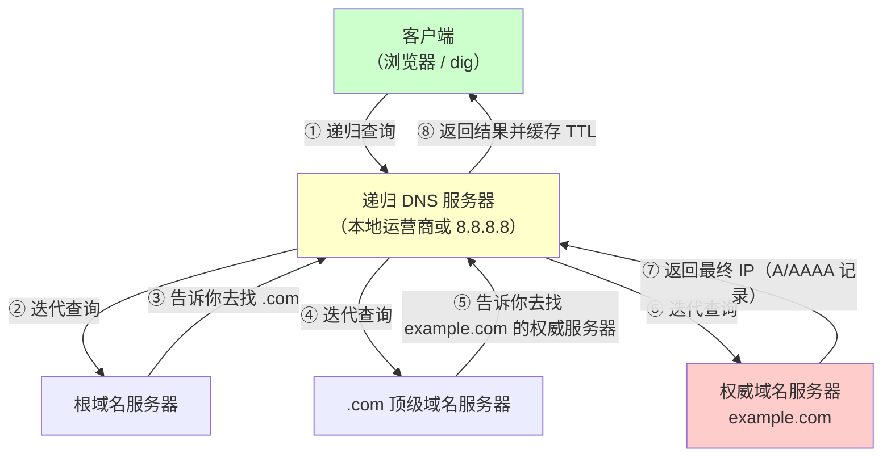

+++
title = "第33章：DNS 服务器"
weight = 330
date = "2026-03-24T13:18:28+08:00"
type = "docs"
description = ""
isCJKLanguage = true
draft = false
+++


# 第三十三章：DNS 服务器

DNS（Domain Name System）是互联网的"中枢神经系统"——没有DNS，你就得记住`220.181.38.149`而不是`www.baidu.com`，记IP比记门牌号还痛苦。

前面我们已经学过DNS的基础知识（第29章），这一章，我们来实战——在Linux上搭建DNS服务器。

DNS服务器软件有很多：古老的BIND、现代的CoreDNS、轻量级的Dnsmasq。我们逐一介绍。

> 本章配套视频：DNS服务器搭好后，你就是你们公司网络的"电话簿管理员"。

## 33.1 DNS 原理

在动手搭建之前，先简单回顾一下DNS的工作原理。

### 33.1.1 递归查询

递归查询是指客户端向DNS服务器发起查询请求，DNS服务器负责"全权代理"，直到返回最终结果（IP或报错）。客户端只发一次请求，不用操心过程。

用户发起查询请求后，DNS服务器会依次向根域名服务器、顶级域名服务器、权威域名服务器发起查询，最终把结果返回给用户。

### 33.1.2 迭代查询

迭代查询是指DNS服务器收到查询请求后，告诉客户端"我不知道答案，你去问这个服务器"，客户端自己去下一个服务器问。

根域名服务器→顶级域名服务器→权威域名服务器之间，使用迭代查询进行交互。



## 33.2 DNS 记录类型

DNS不只是"域名到IP"的翻译，它还支持多种记录类型，每种类型有不同的用途。

### 33.2.1 A：域名到 IP

A记录（Address Record）是最常用的DNS记录，把域名指向一个IPv4地址。

```bash
# example.com 指向 93.184.216.34
example.com.    IN    A    93.184.216.34
```

### 33.2.2 CNAME：别名

CNAME记录（Canonical Name Record）为域名创建一个别名。比如`www.example.com`是`example.com`的别名。

```bash
# www是example.com的别名
www.example.com.    IN    CNAME    example.com.
```

> **注意**：CNAME不能和其他记录混用（不能和NS、MX一起作为相同名字的记录），且CNAME不能指向根域名（如`example.com`不能是CNAME）。
> 
> 💡 **实际应用**：CNAME常用于CDN加速（如`www.example.com`指向`example.cdn.provider.com`）或多域名指向同一服务器。

### 33.2.3 MX：邮件服务器

MX记录（Mail Exchange Record）指定处理邮件的服务器。数字是优先级，数字越小优先级越高。

```bash
# 邮件服务器，优先级10和20
example.com.    IN    MX    10 mail.example.com.
example.com.    IN    MX    20 mail2.example.com.
```

### 33.2.4 TXT：文本记录

TXT记录用于存储任意文本信息，最常见的用途是SPF（Sender Policy Framework）反垃圾邮件验证。

```bash
# SPF记录：只有mail.example.com可以发送@example.com的邮件
example.com.    IN    TXT    "v=spf1 mx -all"
```

### 33.2.5 NS：域名服务器

NS记录（Name Server Record）指定该域名的权威DNS服务器。

```bash
# example.com的DNS服务器
example.com.    IN    NS    ns1.example.com.
example.com.    IN    NS    ns2.example.com.
```

## 33.3 BIND DNS 服务器

BIND（Berkeley Internet Name Domain）是互联网上最古老的DNS服务器软件，几乎所有根DNS服务器和顶级域名服务器都在用它。

### 33.3.1 apt install bind9

在Ubuntu/Debian上安装BIND：

```bash
# 安装BIND9（Ubuntu/Debian）
sudo apt update
sudo apt install bind9 bind9utils bind9-doc

# 安装后查看版本
named -v

# 查看运行状态
sudo systemctl status named
```

在CentOS上安装：

```bash
# CentOS安装BIND
sudo yum install -y bind bind-chroot bind-utils    # CentOS 7 及更早
sudo dnf install -y bind bind-chroot bind-utils    # RHEL 8+/Rocky/AlmaLinux/Fedora

# 启动并设置开机自启
sudo systemctl enable named
sudo systemctl start named
```

> CentOS 7 已于 2024 年 6 月停止维护，新环境请用 Rocky Linux、AlmaLinux 或 RHEL，包管理器统一用 `dnf`。另外 RHEL 系的服务名是 `named`，只有 Debian/Ubuntu 才叫 `bind9`（不过在 Debian 上 `systemctl status named` 一般也能用，因为 `named.service` 是它的别名）。

### 33.3.2 named.conf 主配置

BIND的主配置文件是`/etc/bind/named.conf`（Ubuntu/Debian）或`/etc/named.conf`（CentOS）。

```bash
# Ubuntu/Debian查看主配置文件
cat /etc/bind/named.conf
```

```bash
// This is the primary configuration file for the BIND DNS server named.
//
// Please read /usr/share/doc/bind9/README.Debian.gz for information on the 
// structure of BIND configuration files in this directory.

include "/etc/bind/named.conf.options";   // 全局选项
include "/etc/bind/named.conf.local";    // 本地区域
include "/etc/bind/named.conf.default-zones";  // 默认区域
```

BIND的配置文件通常分成多个子文件：

- `named.conf.options`：全局选项（监听地址、转发、DNSsec等）
- `named.conf.local`：本地区域配置（你自己创建的zone）
- `named.conf.default-zones`：默认区域（根域、localhost等）

查看全局选项：

```bash
cat /etc/bind/named.conf.options
```

```bash
options {
    // 工作目录，BIND会在此目录下存放日志和统计文件
    directory "/var/cache/bind";

    // recursion no 表示"本机不替别人做递归查询"：
    // 只回答自己权威的zone，别人问其他域名会被拒绝（REFUSED）。
    // 纯粹的权威DNS服务器应该设成 no；缓存/转发服务器则要保持 yes。
    // 注意：recursion no 和 allow-recursion 是两码事，后者是"允许谁来递归"。
    recursion no;

    // 允许哪些客户端发起递归查询
    allow-query { 127.0.0.1; 192.168.1.0/24; };

    // DNS转发配置（见33.8节）
    forwarders {
        8.8.8.8;
        223.5.5.5;
    };

    // 启用DNSSEC验证（推荐）
    dnssec-validation auto;

    // 监听端口（IPv4和IPv6）
    listen-on { any; };
    listen-on-v6 { any; };
};
```

## 33.4 主域名服务器配置

主域名服务器（Primary DNS Server）是某个域名的权威DNS服务器，负责管理该域名的所有DNS记录。

### 33.4.1 zone 配置

在`named.conf.local`中定义zone：

```bash
# 编辑本地区域配置文件
sudo vim /etc/bind/named.conf.local
```

```bash
// 定义example.com的正向解析zone
zone "example.com" {
    type master;          // 主域名服务器
    file "/etc/bind/zones/db.example.com";  // 区域文件路径
    // 允许哪些客户端查询此zone
    allow-query { 127.0.0.1; 192.168.1.0/24; };
    // 允许哪些服务器同步zone（从服务器）
    allow-transfer { 192.168.1.11; };
    // 除了 NS 记录里列出的服务器，还额外通知这些地址"zone 更新了"
    // （常用于从服务器不在本 zone 的 NS 记录中的情况）
    also-notify { 192.168.1.11; };
};

// 如果需要反向解析zone
zone "1.168.192.in-addr.arpa" {
    type master;
    file "/etc/bind/zones/db.192.168.1";
};
```

### 33.4.2 正向解析 zone

正向解析zone文件定义域名到IP的映射：

```bash
# 创建zone文件目录
sudo mkdir -p /etc/bind/zones

# 创建正向解析zone文件
sudo vim /etc/bind/zones/db.example.com
```

```bash
; BIND zone file for example.com
; $TTL定义默认生存时间
$TTL    86400      ; 24小时（秒）
; @代表当前域名（即example.com）
@    IN    SOA     ns1.example.com. admin.example.com. (
        2026032301  ; Serial - 格式：年月日+序号，每次修改zone都要递增
        3600        ; Refresh - 从服务器多久检查更新（1小时）
        1800        ; Retry - 失败后多久重试（30分钟）
        604800      ; Expire - 主服务器不可用多久后从服务器停止服务（7天）
        86400 )     ; Minimum TTL - 否定答案缓存时间（24小时）

; 域名服务器记录（必须）
@        IN    NS      ns1.example.com.
@        IN    NS      ns2.example.com.

; A记录 - IPv4地址
; @代表域名本身（即example.com）
@        IN    A       93.184.216.34

; www子域名
www      IN    A       93.184.216.34

; 邮件服务器
@        IN    MX      10 mail
mail     IN    A       93.184.216.35

; 其他子域名
ns1      IN    A       93.184.216.36
ns2      IN    A       93.184.216.37
ftp      IN    A       93.184.216.38

; CNAME - 别名
blog     IN    CNAME   www
shop     IN    CNAME   www

; TXT记录 - SPF反垃圾邮件
@        IN    TXT     "v=spf1 mx -all"

; AAAA记录 - IPv6地址
@        IN    AAAA    2606:2800:220:1::
```

zone文件格式说明：

- 以分号`;`开头的是注释
- `@`符号代表当前域名（zone名）
- `IN`关键字表示Internet类别（DNS记录都是IN类别）
- `SOA`是起始授权记录，每个zone必须有且只有一个SOA
- `Serial`是序列号，每次修改zone文件后必须递增，否则从服务器不会同步

### 33.4.3 反向解析 zone

反向解析是根据IP查找域名，常用于邮件服务器验证、日志分析等场景。

```bash
# 创建反向解析zone文件
sudo vim /etc/bind/zones/db.192.168.1
```

```bash
; Reverse DNS zone for 192.168.1.0/24 network
$TTL    86400
@    IN    SOA     ns1.example.com. admin.example.com. (
        2026032301
        3600
        1800
        604800
        86400 )

; 域名服务器
@        IN    NS      ns1.example.com.

; 反向解析：IP → 域名
; 格式：IP地址倒写.in-addr.arpa.
100      IN    PTR     server1.example.com.    ; 192.168.1.100 → server1.example.com
101      IN    PTR     server2.example.com.    ; 192.168.1.101 → server2.example.com
102      IN    PTR     www.example.com.        ; 192.168.1.102 → www.example.com
1        IN    PTR     gateway.example.com.     ; 192.168.1.1 → gateway.example.com
```

**配置完BIND后，验证配置并重启**：

```bash
# 检查BIND配置语法
sudo named-checkconf

# 检查zone文件语法
# named-checkzone 域名 zone文件路径
sudo named-checkzone example.com /etc/bind/zones/db.example.com

# 检查反向zone文件
sudo named-checkzone 1.168.192.in-addr.arpa /etc/bind/zones/db.192.168.1

# 重启BIND服务
sudo systemctl restart named

# 查看日志确认启动成功
sudo journalctl -u named -f
```

## 33.5 从域名服务器配置

从域名服务器（Secondary DNS Server）从主服务器同步zone数据，提供冗余和负载均衡。

### 33.5.1 masters 指定主服务器

在从服务器上配置zone：

```bash
# 在从服务器的named.conf.local中添加
sudo vim /etc/bind/named.conf.local
```

```bash
zone "example.com" {
    type slave;          // 从域名服务器
    file "/var/cache/bind/db.example.com.backup";  // 从主服务器同步后保存的位置
    masters { 192.168.1.10; };  // 主服务器的IP
    allow-query { 127.0.0.1; 192.168.1.0/24; };
};
```

> **新旧术语**：`type slave` 和 `masters` 是 BIND 9.16 之前的老写法，现在官方推荐改用 `type secondary` 和 `primaries { ... }`（`slave`/`masters` 仍然能用，只是被标记为过时）。同理主服务器的新叫法是 `type primary`，老的 `type master` 也还能用。看不同版本的教程时别被搞混，两者是一回事。

### 33.5.2 allow-transfer

在主服务器的zone配置中，`allow-transfer`指定允许哪些从服务器同步zone数据：

```bash
# 在主服务器的zone配置中
zone "example.com" {
    type master;
    file "/etc/bind/zones/db.example.com";
    allow-transfer { 192.168.1.11; };  // 只允许这个IP同步
};
```

```bash
# 重启主服务器和从服务器
sudo systemctl restart named
```

**验证从服务器同步状态**：

```bash
# 在从服务器上查看日志
sudo tail -f /var/log/syslog

# 应该看到类似这样的信息：
# zone example.com/IN: Transfer started
# zone example.com/IN: transferred serial 2026032301
```

## 33.6 CoreDNS：云原生 DNS

CoreDNS是CNCF（云原生计算基金会）的毕业项目，专为云原生环境设计。相比BIND，CoreDNS配置更简单，使用插件机制，灵活性更高。

### 33.6.1 Corefile 配置

CoreDNS 的配置文件叫 `Corefile`（注意不是 Caddy 的 `Caddyfile`，虽然两者的语法风格很像——CoreDNS 的作者也是 Caddy 的作者，所以沿用了同一套"指令块"设计），语法比 BIND 的 `named.conf` 简单得多。

```bash
# 方式一：用发行版包管理器安装（部分发行版仓库里才有 coredns 包）
sudo apt install coredns        # Debian/Ubuntu
sudo dnf install coredns        # Fedora

# 方式二：从官方 GitHub Releases 下载二进制（最通用，适合容器和裸机）
# https://github.com/coredns/coredns/releases
```

```bash
# 创建Corefile配置
sudo vim /etc/coredns/Corefile
```

```bash
# 监听53端口，处理example.com域名
# 其他域名转发到上游DNS（8.8.8.8）
example.com:53 {
    # 使用file插件加载zone文件（类比BIND的zone file）
    file /etc/coredns/db.example.com

    # 日志
    log

    # 错误处理
    errors
}

# 如果是云环境，可以用kubernetes插件自动服务发现
# .:53 {
#     kubernetes cluster.local in-addr.arpa ip6.arpa {
#         pods verified
#         endpoint_name refactor
#     }
#     forward . 8.8.8.8
# }
```

### 33.6.2 插件

CoreDNS通过插件扩展功能，常见插件：

| 插件 | 功能 |
|------|------|
| `file` | 从zone文件加载DNS记录 |
| `forward` | 转发查询到上游DNS |
| `kubernetes` | Kubernetes服务发现 |
| `cache` | DNS缓存 |
| `log` | 日志记录 |
| `errors` | 错误处理 |
| `health` | 健康检查 |
| `prometheus` | Prometheus监控指标 |

**CoreDNS zone文件格式**（类比BIND但更简单）：

```bash
# /etc/coredns/db.example.com
$ORIGIN example.com.
$TTL 3600

@       IN      SOA     ns1.example.com. admin.example.com. (
                        2026032301 ; Serial
                        3600       ; Refresh
                        1800       ; Retry
                        604800     ; Expire
                        3600 )     ; Minimum

@       IN      NS      ns1
ns1     IN      A       192.168.1.10

@       IN      A       93.184.216.34
www     IN      A       93.184.216.34
mail    IN      A       93.184.216.35
        IN      MX      10 mail

blog    IN      CNAME   www
```

## 33.7 Dnsmasq：本地域名解析缓存

Dnsmasq是轻量级的DNS转发器，同时提供DHCP服务。适合小型网络、家庭网络、办公室网络。

### 33.7.1 apt install dnsmasq

```bash
# 安装Dnsmasq
sudo apt update
sudo apt install dnsmasq

# 启动并设置开机自启
sudo systemctl enable dnsmasq
sudo systemctl start dnsmasq
```

### 33.7.2 /etc/dnsmasq.conf

Dnsmasq的配置在`/etc/dnsmasq.conf`文件中：

```bash
# 查看默认配置
cat /etc/dnsmasq.conf | grep -v "^#" | grep -v "^$"
```

关键配置项：

```bash
# /etc/dnsmasq.conf

# 监听地址（不写就是监听所有）
# listen-address=127.0.0.1,192.168.1.1

# DNS缓存大小（推荐15000条）
cache-size=15000

# 不使用/etc/resolv.conf里的DNS，自己指定上游
# no-resolv

# 上游DNS服务器
server=8.8.8.8
server=223.5.5.5

# 本地域名解析（自定义域名解析到指定IP）
address=/myapp.local/192.168.1.100
address=/db.internal/192.168.1.50

# 域名强制解析（所有*.localdomain的查询都返回指定IP）
address=/.localdomain/192.168.1.1

# 把私有网段的反向查询（如 192.168.x.x 反查域名）限制在本地，不外泄到上游
bogus-priv

# 启用日志
log-queries

# 把 evil.com 解析成一个无用的本地地址，相当于"黑洞"掉它
address=/evil.com/127.0.0.1
```

> **配置项区分大小写**：Dnsmasq 的选项都是小写（`bogus-priv`），写成 `Bogus-priv` 会被当成无效配置直接报错启动失败。改完配置记得先用 `dnsmasq --test` 校验。

**Dnsmasq常用配置示例**：

```bash
# 设置Dnsmasq监听本机和局域网
sudo vim /etc/dnsmasq.conf
```

```bash
# 监听本机和局域网
listen-address=127.0.0.1,192.168.1.1

# DNS缓存大小
cache-size=10000

# 上游DNS
server=8.8.8.8
server=223.5.5.5
server=1.1.1.1

# 本地静态域名解析
address=/gitlab.internal/192.168.1.60
address=/jenkins.internal/192.168.1.61

# 添加额外的hosts文件
addn-hosts=/etc/hosts.extra

# 只提供 DNS 服务，不提供 DHCP：
# 只要不配置任何 dhcp-range，Dnsmasq 就不会启用 DHCP，无需额外开关
port=53
```

> **`port=53` 和 systemd-resolved 会打架**：Ubuntu 等系统默认启用了 `systemd-resolved`，它自己会占用 `127.0.0.53:53`。这时启动 Dnsmasq 会报 `failed to create listening socket for port 53: Address already in use`。解决办法二选一：把 systemd-resolved 的 stub 监听关掉（编辑 `/etc/systemd/resolved.conf` 设 `DNSStubListener=no`，再 `sudo systemctl restart systemd-resolved`），或者让 Dnsmasq 只在具体网卡地址上监听（配置 `listen-address=` 并加 `bind-interfaces`）。改完用 `sudo ss -tulpn 'sport = :53'` 确认是谁在占用。

Dnsmasq还有一个很实用的功能——`/etc/hosts`里的条目会自动加入DNS解析：

```bash
# /etc/hosts里的内容会自动被Dnsmasq解析
sudo vim /etc/hosts
```

```bash
127.0.0.1       localhost
192.168.1.100   myserver.local
192.168.1.101   mydb.local
```

重启Dnsmasq：

```bash
# 检查配置语法
sudo dnsmasq --test

# 重启服务
sudo systemctl restart dnsmasq

# 查看日志
sudo journalctl -u dnsmasq -f
```

## 33.8 DNS 转发

DNS转发（Forwarding）是指把本机无法解析的查询转发到上游DNS服务器。这是最常用的DNS配置模式——本地网络内的解析自己做，查不到的交给上游（如8.8.8.8）。

### 33.8.1 forwarders

在BIND中配置转发：

```bash
# /etc/bind/named.conf.options
options {
    directory "/var/cache/bind";

    // 开启转发模式（关闭递归查询则不需要）
    recursion yes;

    // 转发到上游DNS
    forwarders {
        8.8.8.8;        // Google DNS
        223.5.5.5;      // 阿里DNS
        1.1.1.1;        // Cloudflare DNS
    };

    // 转发策略
    forward first;  // 先转发，转发不到再自己查（默认）
    // forward only;  // 只转发，查不到就返回 SERVFAIL
};
```

### 33.8.2 条件转发

只对特定域名使用特定的上游DNS：

```bash
# 在named.conf.local中配置条件转发
zone "internal.corp" {
    type forward;
    forwarders { 10.0.0.53; };  // 公司内网DNS
    forward only;
};

zone "home.local" {
    type forward;
    forwarders { 192.168.1.1; };  // 家庭网络路由器DNS
    forward only;
};
```

这样配置后：

- 查询`*.internal.corp`→转发到`10.0.0.53`
- 查询`*.home.local`→转发到`192.168.1.1`
- 其他域名→按全局forwarders配置处理

### 33.8.3 千万别做"开放递归"服务器

如果一台能访问公网的 DNS 服务器对**所有人**开放递归查询（`allow-recursion { any; };` 或 `allow-query { any; };` 又开了递归），它就成了"开放解析器"（Open Resolver）。攻击者会利用它做 **DNS 放大攻击**——伪造你的 IP 去查询海量域名，把成百上千倍的流量打向受害者，你的服务器会背锅、被封 IP。

正确做法：

```bash
# 只允许自己的内网网段递归，公网来的递归请求一律拒绝
allow-recursion { 127.0.0.1; 192.168.1.0/24; };
allow-query-cache { 127.0.0.1; 192.168.1.0/24; };
```

> **一句话原则**：**权威 DNS 服务器关闭递归，缓存/转发 DNS 服务器只对自己的网段开放递归**。对外网一律不开放。搭完 DNS 服务器后，别忘了一并检查防火墙，只放行必要的来源。

## 33.9 DDNS 动态域名解析

DDNS（Dynamic DNS，动态域名解析）解决了"拨号上网/动态IP"的问题——每次IP变化，DDNS服务自动更新域名解析记录，让你始终能通过固定域名访问你的服务。

### 33.9.1 花生壳

花生壳（Oray）是国内老牌的DDNS服务提供商，提供免费和付费版本。

```bash
# 安装花生壳客户端
# 官网下载：https://hsk.oray.com/download/

# 或者使用官方的 Linux 客户端（phddns 不在 Ubuntu/Debian 官方仓库里，
# 需要按官网说明添加 Oray 自己的软件源后再安装，别直接 apt install phddns）
```

> **注意来源**：`apt install phddns` 在标准 Ubuntu 仓库里是装不上的（会报 `Unable to locate package`），必须按花生壳官网的步骤添加它的第三方源。国内同类免费/付费 DDNS 还有 dnspod（腾讯）、阿里云解析、Cloudflare 等，选择时优先看是否有官方 API——能用 API 就能自己写脚本，不依赖客户端。

配置花生壳：

```bash
# 运行花生壳客户端进行注册和登录
sudo phddnsd
```

花生壳会给你一个免费域名（如`yourname.qicp.vip`），每次路由器IP变化，自动更新DNS记录。

### 33.9.2 Cloudflare API

如果你使用Cloudflare作为DNS提供商，可以用API实现自己的DDNS脚本。

下面是一个最简的 Cloudflare DDNS 脚本（保存成 `ddns.sh` 并 `chmod +x`）。**推荐用 API Token 而不是 Global API Key**：Token 可以只授权"编辑某个 zone 的 DNS"这一项权限，即使泄露损失也小得多；Global API Key 等于账号的万能钥匙。

```bash
#!/bin/bash
# Cloudflare DDNS 脚本示例
# 推荐用 API Token（权限只需 Zone:DNS:Edit），不要用 Global API Key

# Cloudflare配置
CF_API_TOKEN="your_api_token_here"
CF_ZONE_ID="your_zone_id_here"
CF_RECORD_ID="your_record_id_here"
CF_DOMAIN="ddns.example.com"

# 获取当前公网IP
CURRENT_IP=$(curl -s https://api.ipify.org)

# 获取Cloudflare上记录的最新IP
CF_IP=$(curl -s -X GET "https://api.cloudflare.com/client/v4/zones/${CF_ZONE_ID}/dns_records/${CF_RECORD_ID}" \
    -H "Authorization: Bearer ${CF_API_TOKEN}" \
    -H "Content-Type: application/json" \
    | jq -r '.result.content')

# 如果IP变化了，就更新DNS记录
if [ "$CURRENT_IP" != "$CF_IP" ]; then
    echo "IP changed: ${CF_IP} -> ${CURRENT_IP}"
    curl -s -X PUT "https://api.cloudflare.com/client/v4/zones/${CF_ZONE_ID}/dns_records/${CF_RECORD_ID}" \
        -H "Authorization: Bearer ${CF_API_TOKEN}" \
        -H "Content-Type: application/json" \
        --data "{\"type\":\"A\",\"name\":\"${CF_DOMAIN}\",\"content\":\"${CURRENT_IP}\"}"
    echo "DNS updated."
else
    echo "IP unchanged: ${CURRENT_IP}"
fi
```

> **脚本要放在文件里再执行**：`#!/bin/bash` 必须位于文件的**第一行**才会生效。上面保存成 `ddns.sh` 后执行 `chmod +x ddns.sh`，再手动跑一次确认 `jq` 已安装（`sudo apt install jq`），最后才交给 crontab。API 密钥不要硬编码在脚本里，建议放到环境变量或一个权限 600 的独立文件里。

设置定时任务，每5分钟检查一次IP：

```bash
# 添加定时任务
sudo crontab -e
```

```bash
# 每5分钟执行一次DDNS更新
*/5 * * * * /path/to/ddns.sh >> /var/log/ddns.log 2>&1
```

> **DDNS应用场景**：在家里放一台服务器（NAS、树莓派、淘汰的电脑），想从外网访问，DDNS是必备工具。

---

## 本章小结

本章我们实战了DNS服务器的搭建：

- **DNS原理**：递归查询和迭代查询的区别
- **DNS记录类型**：A（地址）、CNAME（别名）、MX（邮件）、TXT（文本）、NS（域名服务器）
- **BIND9**：最经典的DNS服务器，配置在`/etc/bind/named.conf`系列文件
- **zone文件格式**：SOA、NS、A、MX等记录，`Serial`必须递增
- **反向解析**：PTR记录，IP倒写.in-addr.arpa格式
- **从DNS服务器**：`type secondary`（旧写法 `type slave`），用 `primaries`/`masters` 指定主服务器并同步zone
- **CoreDNS**：云原生DNS，用Corefile配置，插件化架构
- **Dnsmasq**：轻量级DNS转发器+DHCP，适合家庭/小型网络
- **DNS转发**：forwarders配置，条件转发支持不同域名走不同上游
- **DDNS**：动态IP场景下的域名自动更新，Cloudflare API可以实现自己的DDNS

DNS是互联网的基石，搭建一个可靠的DNS服务器需要理解原理、多动手实验。祝你的DNS服务器永远不宕机。

> **最后的安全底线**：搭好 DNS 服务器后，务必确认它**不是开放递归解析器**（见 33.8.3），并用防火墙把 53 端口的来源限制在自己的网段。这是新手最容易忽略、后果也最严重的一个坑。
