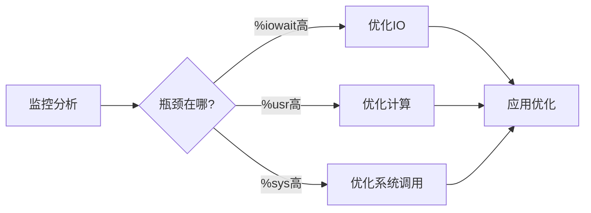

+++
title = "第75章：CPU 优化"
weight = 750
date = "2026-03-24T13:18:28+08:00"
type = "docs"
description = ""
isCJKLanguage = true
draft = false
+++


# 第七十五章：CPU 优化

## 75.1 CPU 性能分析

### 查看 CPU 信息

```bash
# 查看 CPU 详细信息
cat /proc/cpuinfo

# 关键信息
# processor: CPU 核心编号
# model name: CPU 型号
# cpu MHz: 当前频率
# cache size: 缓存大小
# flags: 支持的特性

# 简洁输出
lscpu

# 预期输出：
# Architecture:        x86_64
# CPU(s):              8
# Thread(s) per core:   2
# Core(s) per socket:  4
# Model name:          Intel(R) Core(TM) i7-10700 @ 2.90GHz
# CPU MHz:             2900.000
# Cache size:         16384 KB
```

### top/htop 分析

```bash
# top 基本使用
top

# 快捷键
# P: 按 CPU 排序
# M: 按内存排序
# N: 按 PID 排序
# 1: 显示每个 CPU 核心
# k: 杀死进程
# r: 调整优先级

# htop（更友好）
htop
```

### mpstat 多核统计

```bash
# 安装
sudo apt install sysstat

# 查看所有 CPU
mpstat -P ALL

# 每秒更新
mpstat 1

# 查看 CPU 详细统计
mpstat -I

# 预期输出：
# 02:45:00 PM  CPU    %usr   %nice    %sys %iowait    %irq   %soft  %steal  %guest  %gnice   %idle
# 02:45:01 PM    0   10.00    0.00    5.00    0.00    0.00    0.00    0.00    0.00    0.00   85.00
```

### perf 性能分析

```bash
# 安装
sudo apt install linux-tools-common linux-tools-generic

# perf stat 基本统计
perf stat -a sleep 5

# perf top 实时热点分析
sudo perf top

# perf record 记录数据
sudo perf record -a -g -- sleep 30

# perf report 查看报告
sudo perf report
```

### CPU 使用率分析

```bash
# 查看 CPU 使用情况
mpstat 1

# 分析
# %usr: 用户空间使用
# %sys: 内核空间使用
# %iowait: IO 等待
# %idle: 空闲

# 如果 %iowait 高，说明 IO 是瓶颈
# 如果 %sys 高，说明系统调用多
# 如果 %usr 高，说明应用计算多
```

## 75.2 CPU 调优参数

### /proc/cpuinfo

```bash
# 查看 CPU 频率信息
cat /proc/cpuinfo | grep MHz

# 查看 CPU governor（调频策略）
cat /sys/devices/system/cpu/cpu0/cpufreq/scaling_governor

# 查看可用 governor
cat /sys/devices/system/cpu/cpu0/cpufreq/scaling_available_governors
```

### CPU 频率调节

```bash
# 查看当前频率
cpufreq-info

# 设置 performance 模式（性能优先）
for cpu in /sys/devices/system/cpu/cpu*/cpufreq/scaling_governor; do
    echo performance > $cpu
done

# 设置 powersave 模式（节能）
for cpu in /sys/devices/system/cpu/cpu*/cpufreq/scaling_governor; do
    echo powersave > $cpu
done

# 设置 ondemand 模式（动态调节）
for cpu in /sys/devices/system/cpu/cpu*/cpufreq/scaling_governor; do
    echo ondemand > $cpu
done
```

### sysctl 调度参数

```bash
# 查看调度参数
sysctl -a | grep kernel.sched

# scheduler latency（调度延迟）
sysctl -w kernel.sched_latency_ns=10000000

# minimum granularity（最小粒度）
sysctl -w kernel.sched_min_granularity_ns=1000000

# wakeup granularity
sysctl -w kernel.sched_wakeup_granularity_ns=1000000

# CPU 核心隔离（需要内核参数 isolcpus）
# 在 grub 添加：isolcpus=1,2,3
```

### 永久生效配置

```bash
# /etc/sysctl.conf
sudo nano /etc/sysctl.conf

# 添加：
kernel.sched_latency_ns = 10000000
kernel.sched_min_granularity_ns = 1000000
kernel.sched_wakeup_granularity_ns = 1000000
```

## 75.3 进程优化

### nice/renice 优先级

```bash
# nice 值范围：-20 到 19
# 越低优先级越高

# 启动时设置优先级
nice -n -10 ./my_program

# 查看进程 nice 值
ps -eo pid,ni,comm

# 修改运行中进程优先级
renice -n 10 -p PID

# 批量修改
renice -n 10 -p $(pgrep -f process_name)

# 最高优先级
sudo renice -n -20 -p PID
```

### taskset CPU 亲和性

```bash
# 查看进程 CPU 亲和性
taskset -cp PID

# 设置 CPU 亲和性
taskset -c 0,1 ./my_program     # 只使用 CPU 0 和 1
taskset -c 0-3 ./my_program    # 使用 CPU 0-3
taskset -c 4 ./my_program      # 只使用 CPU 4

# 修改运行中进程
taskset -cp 0-3 PID

# 查看 CPU 核心
nproc
```

### CPU 隔离示例

```bash
# 1. 在 /etc/default/grub 中添加
GRUB_CMDLINE_LINUX="isolcpus=1,2,3"

# 2. 更新 grub
sudo update-grub

# 3. 重启后验证
cat /proc/cmdline

# 4. 将进程绑定到隔离的核心
taskset -c 0 ./my_program
```

### 高性能场景配置

```bash
#!/bin/bash
# enable-performance-mode.sh

# 1. 设置 performance governor
for cpu in /sys/devices/system/cpu/cpu*/cpufreq/scaling_governor; do
    echo performance > $cpu
done

# 2. 关闭透明大页
echo never > /sys/kernel/mm/transparent_hugepage/enabled
echo never > /sys/kernel/mm/transparent_hugepage/defrag

# 3. 调整调度参数
sysctl -w kernel.sched_latency_ns=10000000
sysctl -w kernel.sched_min_granularity_ns=1000000

# 4. 设置 CPU 亲和性（根据需要）
taskset -c 0-3 ./my_high_performance_app
```

## 本章小结

本章我们学习了 CPU 优化的核心知识：

| 工具 | 用途 |
|------|------|
| /proc/cpuinfo | CPU 硬件信息 |
| lscpu | CPU 概要信息 |
| top/htop | 实时进程监控 |
| mpstat | 多核统计 |
| perf | 性能分析 |
| nice/renice | 进程优先级 |
| taskset | CPU 亲和性 |

CPU 优化流程：



---

> 💡 **温馨提示**：
> CPU 优化的关键是找出真正的瓶颈。盲目调参可能适得其反，先用工具分析，再针对性优化！

---

**第七十五章：CPU 优化 — 完结！** 🎉

下一章我们将学习"内存优化"，掌握内存分析、Swap 调优等技能。敬请期待！ 🚀
