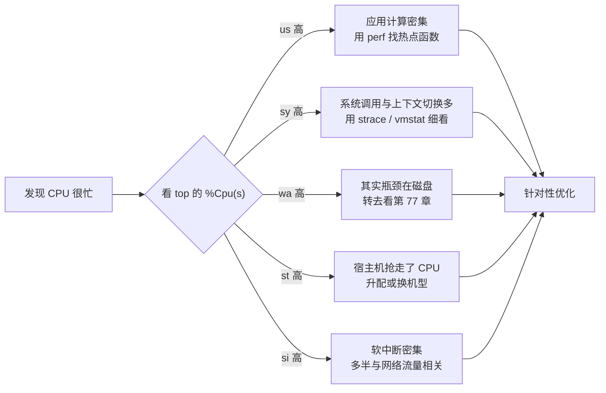

+++
title = "第75章：CPU 优化"
weight = 750
date = "2026-03-24T13:18:28+08:00"
type = "docs"
description = ""
isCJKLanguage = true
draft = false
+++


# 第七十五章：CPU 优化

## 75.1 先搞清楚 CPU 的基础信息

### 75.1.1 /proc/cpuinfo 与 lscpu

```bash
# 原始信息：每个逻辑核一段，输出很长
cat /proc/cpuinfo

# 汇总视图，日常看这个就够
lscpu
```

```text
Architecture:            x86_64
CPU(s):                  8                # 逻辑 CPU 总数
  Thread(s) per core:    2                # 每个核心 2 个线程（超线程）
  Core(s) per socket:    4                # 每颗物理 CPU 4 个核心
  Socket(s):             1                # 1 颗物理 CPU
Model name:              Intel(R) Core(TM) i7-10700 @ 2.90GHz
CPU max MHz:             4800.0000
CPU min MHz:             800.0000
L1d cache:               256 KiB
L2 cache:                2 MiB
L3 cache:                16 MiB
```

需要看懂的两个概念：

- **物理核 vs 逻辑核**：上面是 4 核 × 2 线程 = 8 个逻辑 CPU，`nproc` 返回的也是 8。超线程能提升吞吐，但两个线程共享同一个物理核的执行单元，所以"8 个逻辑核"并不等于一台 8 核机器
- **NUMA**：多路服务器上 `Socket(s)` 会大于 1，每个 socket 带着自己的内存。跨 socket 访问内存的延迟明显更高，75.7 会讲怎么处理

> `cat /proc/cpuinfo` 里的 `cpu MHz` 是**当前瞬时频率**，会随负载和调频策略不断变化，别拿它当"CPU 主频"来看。

### 75.1.2 系统到底忙不忙：uptime 与 top

```bash
uptime
```

```text
 14:32:01 up 12 days,  3:41,  2 users,  load average: 0.52, 0.68, 0.71
```

`load average` 是过去 1 / 5 / 15 分钟的平均负载。要特别注意它统计的是什么：**处于可运行状态、以及处于不可中断睡眠状态（`D`，通常在等磁盘 IO）的进程数**。所以：

- 负载必须和 CPU 核数一起看。8 核机器上负载 8 大致是满载，1 核机器上负载 8 就是过载 8 倍
- **负载高不一定代表 CPU 忙**：大量进程卡在等 IO 时，负载会飙高，但 CPU 可能很闲

```bash
top
```

```text
top - 14:32:01 up 12 days,  3:41,  2 users,  load average: 0.52, 0.68, 0.71
Tasks: 213 total,   1 running, 212 sleeping,   0 stopped,   0 zombie
%Cpu(s):  3.2 us,  1.1 sy,  0.0 ni, 94.9 id,  0.6 wa,  0.0 hi,  0.1 si,  0.0 st
MiB Mem :  15872.0 total,   1024.5 free,   4102.3 used,  10745.2 buff/cache
```

常用按键：

| 按键 | 作用 |
|------|------|
| `P` | 按 CPU 使用率排序（默认） |
| `M` | 按内存占用排序 |
| `T` | 按累计运行时间排序 |
| `1` | 展开显示每个逻辑 CPU（再按一次收起） |
| `H` | 显示线程而不是进程 |
| `k` | 结束某个进程（会提示输入 PID） |
| `r` | 修改 nice 值 |
| `q` | 退出 |

嫌 `top` 难用的话，`htop` 更友好（彩色、可鼠标点击、F9 直接杀进程）：`sudo apt install htop` 或 `sudo dnf install htop`。

### 75.1.3 读懂 %Cpu(s) 那一行

这一行是排障时最关键的信息：

| 字段 | 含义 | 高了说明什么 |
|------|------|--------------|
| `us` | 用户态 CPU 时间 | 应用在计算（业务逻辑、加解密、压缩） |
| `sy` | 内核态 CPU 时间 | 系统调用密集（频繁读写、上下文切换、处理网络包） |
| `ni` | 低优先级（nice 过的）进程占用 | 一般不用管 |
| `id` | 空闲 | —— |
| `wa` | 等待 IO 完成的时间 | **磁盘是瓶颈**（CPU 其实是空闲着在等） |
| `hi` / `si` | 硬中断 / 软中断 | 网卡、磁盘中断密集，通常和网络流量相关 |
| `st` | 被宿主机"偷走"的时间 | **只在虚拟机里出现**，说明宿主机把 CPU 分给了别人 |

> **`st` 在云服务器上尤其值得盯。** 如果你的云主机 `%st` 长期不低，说明物理资源被邻居抢了，这时候怎么优化自己的程序都没用——该考虑升配或换机型了。

## 75.2 细化到每个核心：mpstat

`top` 给的是整机平均，而"整机不忙但某个核跑满"才是很多问题的真相（单线程的 Node.js、Redis、某些 Java 应用）。

```bash
# 安装
sudo apt install sysstat        # RHEL 系：sudo dnf install sysstat

# 每个核心一行，每秒刷新
mpstat -P ALL 1
```

```text
14:32:01  CPU    %usr   %nice    %sys %iowait    %irq   %soft  %steal  %guest  %gnice   %idle
14:32:02  all   12.51    0.00    3.13    0.25    0.00    0.38    0.00    0.00    0.00   83.74
14:32:02    0   99.00    0.00    1.00    0.00    0.00    0.00    0.00    0.00    0.00    0.00
14:32:02    1    0.00    0.00    0.00    0.00    0.00    0.00    0.00    0.00    0.00  100.00
```

这个例子就是典型的"整机看起来只用了 12%，其实 0 号核已经 100%"——单线程瓶颈。

几个常用写法：

```bash
# 只看汇总（不加 -P ALL 就是所有核心的平均值）
mpstat 1

# 按中断类型汇总；注意 -I 后面必须跟 SUM / CPU / ALL / SCPU 之一
mpstat -I SUM 1

# 按进程看 CPU 使用（同一套工具里的另一个命令）
pidstat -u 1
```

> 原稿里的 `mpstat -I` 是个不完整的命令——`-I` 需要参数，直接执行会报错。

## 75.3 用 perf 找到"热点函数"

`top` 只能告诉你哪个进程在吃 CPU，`perf` 能告诉你**进程里的哪个函数在吃 CPU**。

```bash
# 安装：Ubuntu 上要装与当前内核匹配的工具包
sudo apt install linux-tools-common "linux-tools-$(uname -r)"
# RHEL 系：sudo dnf install perf
```

```bash
# 对整个系统做 5 秒统计（需要 root）
sudo perf stat -a sleep 5
```

```text
 Performance counter stats for 'system wide':

         12,345.67 msec cpu-clock                 #    8.001 CPUs utilized
           123,456      context-switches          #   10.001 K/sec
             1,234      cpu-migrations            #  100.001 /sec
    12,345,678,901      cycles                    #    1.000 GHz
     3,456,789,012      instructions              #    0.28  insn per cycle
           123,456,789  cache-misses              #    1.00% of all cache refs
```

其中 `instructions per cycle`（IPC）很能说明问题：

- IPC 很低（比如不到 1）且 `cache-misses` 比例高 → 大概率是**内存 / 缓存瓶颈**，不是 CPU 算不过来
- IPC 正常偏高、`cpu-clock` 也高 → 确实是计算密集型

```bash
# 采样 30 秒，并把调用链一起记录下来
sudo perf record -a -g -- sleep 30

# 交互式查看报告，按占用从高到低列出函数
sudo perf report
```

> 如果 `perf` 报 `Permission denied`，是内核的 `perf_event_paranoid` 在限制，可以临时 `sudo sysctl -w kernel.perf_event_paranoid=1`。生产环境不建议长期设成 `-1`。
>
> 想要更直观的"火焰图"，可以用 Brendan Gregg 的 FlameGraph 脚本：`perf script | stackcollapse-perf.pl | flamegraph.pl > cpu.svg`，会看到哪条调用链最宽。

## 75.4 频率调节：governor

现代 CPU 会根据负载自动调频，由 governor 决定策略：

| governor | 行为 | 适合 |
|----------|------|------|
| `powersave` | 尽量压低频率 | 省电优先 |
| `performance` | 一直跑最高频 | **延迟敏感的服务**（数据库、网关） |
| `ondemand` | 负载升高就升频 | 老式动态调频，现已不推荐 |
| `schedutil` | 由调度器提供升频依据 | 现代内核的默认选择，兼顾省电与响应 |

```bash
# 查看当前策略
cat /sys/devices/system/cpu/cpu0/cpufreq/scaling_governor

# 查看支持哪些策略
cat /sys/devices/system/cpu/cpu0/cpufreq/scaling_available_governors

# 临时改成 performance
for cpu in /sys/devices/system/cpu/cpu*/cpufreq/scaling_governor; do
    echo performance | sudo tee "$cpu" > /dev/null
done
```

> **`sudo echo x > 文件` 是无效写法。** 重定向 `>` 是当前 shell 以你的身份打开的，`sudo` 只作用于 `echo`，写文件这一步照样会被权限拒绝。标准做法是 `echo x | sudo tee 文件`——原稿里那种 `echo ... > /sys/...` 的写法在非 root 下必然失败。

永久生效（Debian 系用 `cpufrequtils`）：

```bash
sudo apt install cpufrequtils
echo 'GOVERNOR="performance"' | sudo tee /etc/default/cpufrequtils
sudo systemctl restart cpufrequtils
```

> 虚拟机上常常看不到可调的 governor（`scaling_available_governors` 为空或只有一项），因为调频由宿主机管理，这是正常现象。
>
> 另外现代 x86 服务器 CPU 多由硬件管理调频（`intel_pstate` 的 active 模式），可选项可能只有 `powersave` 和 `performance`，而这里的 `powersave` 其实也会自动升到最高频——名字和实际行为不完全一致，看到不必奇怪。

## 75.5 进程优先级：nice 与 renice

Linux 用 nice 值表示 CPU 优先级，范围 `-20`（最高）到 `19`（最低），默认 `0`。**数值越小越"不客气"。**

```bash
# 以较低优先级启动（更礼让）
nice -n 10 ./batch_job

# 以较高优先级启动（需要 root：普通用户只能调高，不能调低 nice 值）
sudo nice -n -10 ./latency_sensitive_app

# 查看进程的 nice 值
ps -eo pid,ni,comm --sort=-ni | head

# 调整正在运行的进程
sudo renice -n 10 -p 12345

# 批量调整：把所有 ffmpeg 进程的优先级降下来
sudo renice -n 10 -p $(pgrep -f ffmpeg)
```

实用经验：

- 备份、压缩、批量转码这类**吞吐型、对延迟不敏感**的任务，把 nice 值调高（10~19），让它们见缝插针，别和在线服务抢 CPU
- **普通用户只能调高 nice 值（降优先级），不能调低。** 想要负值必须有 root
- nice 只影响"CPU 时间怎么分配"，对 IO 和内存没有作用。要限制 IO 优先级得用 `ionice`（见 77.6）

## 75.6 CPU 亲和性：taskset 与 cgroup

`taskset` 把进程"钉"在指定的 CPU 上。它的价值在于**减少缓存失效和跨 NUMA 访问**，而不是"提升并发能力"。

```bash
# 查看进程当前的亲和性
taskset -cp 12345

# 让程序只用 0 号和 1 号 CPU
taskset -c 0,1 ./my_program

# 用 0~3 号 CPU
taskset -c 0-3 ./my_program

# 修改正在运行的进程
sudo taskset -cp 0-3 12345

# 看看机器上有多少逻辑 CPU
nproc
```

> **什么时候真的需要绑核？** 主要是这几类场景：对延迟极度敏感的服务；Redis 这类单线程服务配合多实例部署（每个实例绑一个核，互不抢）；NUMA 机器上让进程和它用到的内存留在同一个 socket。
>
> **普通业务盲目绑核往往得不偿失**——一旦绑到本来就繁忙的核上，性能反而下降。

systemd 服务有更"正式"的配置项，比 `taskset` 更适合长期使用：

```ini
# /etc/systemd/system/myapp.service
[Service]
CPUAffinity=0 1        # 绑定到 0、1 号 CPU
AllowedCPUs=0-3        # 更现代的做法（cgroup v2），限制可用 CPU 集合
CPUWeight=200          # CPU 权重（对应 cgroup v2 的 cpu.weight，默认 100）
```

```bash
sudo systemctl daemon-reload
sudo systemctl restart myapp
```

## 75.7 中断与 NUMA

高流量网卡会把大量中断打到某一个核上，造成"一个核 100%、其它核闲着"。相关的排查手段：

```bash
# 看每个 CPU 上的中断分布
mpstat -I SUM 1

# 查看中断计数与亲和性
head -20 /proc/interrupts

# 查看网卡有多少个收发队列
ethtool -l eth0
```

> 实际工作中更推荐依靠 `irqbalance` 服务（默认就装好了）自动分配中断。手工改 `/proc/irq/*/smp_affinity` 属于高阶操作，**改错会导致网络中断不再响应，远程操作前务必确认有控制台或带外管理可用。**

NUMA 相关：

```bash
# 查看 NUMA 拓扑
numactl --hardware
lscpu | grep -i numa

# 让程序只在 node 0 上运行（CPU 和内存都限制在 node 0）
numactl --cpunodebind=0 --membind=0 ./my_app

# 查看某个进程的内存分布
numastat -p 12345
```

> 多路服务器上跑内存密集型服务（数据库、Redis）时，一定要警惕跨 NUMA 节点访问内存——延迟可能翻倍。用 `numactl` 或 cgroup 把服务限制在一个节点内，改善往往很明显。

## 75.8 内核调度参数：先看这条重要提醒

```bash
# 查看调度相关参数
sysctl -a | grep '^kernel.sched'
```

老教程里常见这样一段"优化"：

```bash
# 以下写法在新内核上会直接报错，请先看下面的说明
sudo sysctl -w kernel.sched_latency_ns=10000000
sudo sysctl -w kernel.sched_min_granularity_ns=1000000
sudo sysctl -w kernel.sched_wakeup_granularity_ns=1000000
```

> **重要提醒：从 Linux 6.6 起，CFS 调度器被 EEVDF 取代，上面这三个参数已经被删除。** 在新内核上执行会得到 `No such file or directory`。也就是说，网上大量"Linux 性能调优"文章里的这几行，在 2024 年以后的新系统上**已经失效**。
>
> 先确认自己的内核版本：
>
> ```bash
> uname -r                              # 6.6 及以上即为 EEVDF
> sysctl kernel.sched_base_slice_ns     # EEVDF 时代对应的参数
> ```
>
> 更重要的是：**这些调度参数本就不建议随便改。** 调度器的默认值经过大量场景验证，调错会让交互延迟变差或吞吐下降。除非你有明确的压测数据支撑，否则不要动。

确实需要调整时，写在独立文件里，别直接改 `/etc/sysctl.conf`：

```bash
sudo tee /etc/sysctl.d/99-cpu-tuning.conf <<'EOF'
# 确认有必要时再放开，并记录改动原因和日期
# kernel.sched_base_slice_ns = 3000000
EOF

sudo sysctl --system
```

## 75.9 CPU 隔离：isolcpus 与 cpuset

想让某个核"专供"关键程序，可以把它从普通调度中摘出去：

```bash
# 1. 编辑 GRUB 配置
sudo vim /etc/default/grub
```

```text
# 在 GRUB_CMDLINE_LINUX 里追加：把 2、3 号核隔离出来
GRUB_CMDLINE_LINUX="... isolcpus=2,3"
```

```bash
# 2. 重建 GRUB 配置
sudo update-grub                                   # Debian / Ubuntu
# RHEL 系：sudo grub2-mkconfig -o /boot/grub2/grub.cfg

# 3. 重启后验证
cat /proc/cmdline

# 4. 把程序绑到隔离出来的核上（isolcpus 只是不让别人用，还得自己指定）
taskset -c 2,3 ./my_latency_sensitive_app
```

> `isolcpus` 是"大炮"：它实实在在地减少系统可用 CPU，而且改完必须重启。更灵活的替代方案是 cgroup v2 的 cpuset：
>
> ```bash
> sudo systemctl set-property myapp.service AllowedCPUs=2,3
> ```
>
> 不用重启、只影响指定服务、出问题容易回退。**优先用这个。**

## 75.10 一份"性能模式"脚本

把前面的操作整理成脚本。注意：**整个脚本以 root 运行**，所以此时 shell 自己就有写权限，可以直接用 `>`。

```bash
#!/bin/bash
# enable-performance-mode.sh —— 需要以 root 运行
set -euo pipefail

# 1. 调频策略设为 performance
for cpu in /sys/devices/system/cpu/cpu*/cpufreq/scaling_governor; do
    [ -w "$cpu" ] && echo performance > "$cpu"
done

# 2. 关闭透明大页（对 Redis 和部分数据库有明显好处）
if [ -e /sys/kernel/mm/transparent_hugepage/enabled ]; then
    echo never > /sys/kernel/mm/transparent_hugepage/enabled
    echo never > /sys/kernel/mm/transparent_hugepage/defrag
fi

# 3. 把备份类任务降优先级
pgrep -f backup | xargs -r renice -n 10 -p 2>/dev/null || true

echo "完成。注意：governor 与 THP 的改动重启后会失效，需写成开机脚本。"
```

> 这里能直接 `echo > "$cpu"`，是因为**脚本本身以 root 运行**；而在普通命令行里单条执行时，就必须用 `echo x | sudo tee 文件`。这个区别很容易混淆，也是很多"照着抄却失败"的根源。

## 本章小结

| 工具 / 参数 | 用途 |
|-------------|------|
| `lscpu` / `/proc/cpuinfo` | 看清物理核与逻辑核的数量关系 |
| `uptime` / `top` | 负载与实时占用，重点看 `us`/`sy`/`wa`/`st` |
| `mpstat -P ALL 1` | 定位"某一个核跑满"的单线程瓶颈 |
| `pidstat -u 1` | 按进程查看 CPU 使用 |
| `perf stat` / `perf record` | 找到具体是哪个函数在吃 CPU |
| CPU governor | 延迟敏感服务设为 `performance` |
| `nice` / `renice` | 让批处理任务给在线服务让路 |
| `taskset` / cgroup `AllowedCPUs` | 绑核、避免跨 NUMA 访问 |
| `numactl` | 多路服务器上的 NUMA 调优 |
| `isolcpus` | 核隔离（"大炮"，优先用 cgroup cpuset 替代） |

排障思路：


```mermaid
graph LR
    A["发现 CPU 很忙"] --> B{"看 top 的 %Cpu(s)"}
    B -->|"us 高"| C["应用计算密集<br/>用 perf 找热点函数"]
    B -->|"sy 高"| D["系统调用与上下文切换多<br/>用 strace / vmstat 细看"]
    B -->|"wa 高"| E["其实瓶颈在磁盘<br/>转去看第 77 章"]
    B -->|"st 高"| F["宿主机抢走了 CPU<br/>升配或换机型"]
    B -->|"si 高"| G["软中断密集<br/>多半与网络流量相关"]
    C --> H["针对性优化"]
    D --> H
    E --> H
    F --> H
    G --> H
```

> **一句话提醒**：CPU 优化的价值在于"先看清楚瓶颈在哪"。`%wa` 高的时候去调调度参数、`%st` 高的时候去优化代码，都是白费力气。先用 `top` + `mpstat` 定位，再用 `perf` 深挖，最后才动手改参数。

下一章我们看内存优化。
