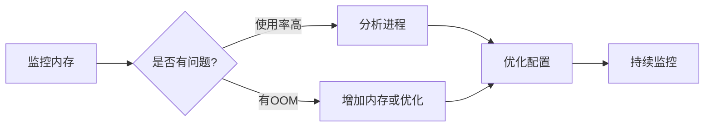

+++
title = "第76章：内存优化"
weight = 760
date = "2026-03-24T13:18:28+08:00"
type = "docs"
description = ""
isCJKLanguage = true
draft = false
+++


# 第七十六章：内存优化

## 76.1 内存分析

### 查看内存使用

```bash
# 基本信息
free -h

# 详细统计
free -m           # MB 为单位
free -g           # GB 为单位
free -s 1         # 每秒刷新

# 预期输出：
#               total        used        free      shared  buff/cache   available
# Mem:           31Gi       8.5Gi       4.2Gi       1.0Gi        18Gi        22Gi
# Swap:         2.0Gi          0B       2.0Gi
```

### /proc/meminfo

```bash
# 详细内存信息
cat /proc/meminfo

# 关键指标：
# MemTotal: 总内存
# MemFree: 空闲内存
# MemAvailable: 可用内存（考虑缓存）
# Buffers: 缓冲区
# Cached: 缓存
# SwapCached: 交换出去的缓存
# AnonPages: 匿名页（程序内存）
# Mapped: 映射的文件
# Shmem: 共享内存
```

### 进程内存分析

```bash
# 查看进程内存使用
ps aux --sort=-%mem | head

# 或使用 top
top
# M: 按内存排序

# 查看特定进程
pmap -x PID

# 查看内存映射
cat /proc/PID/maps

# 查看进程的内存使用详情
cat /proc/PID/status | grep -E "Vm|Rss"
```

### 内存泄漏检测

```bash
# 方法一：监控内存增长
while true; do
    ps -o pid,vsz,rss,comm -p PID
    sleep 5
done

# 方法二：使用 valgrind
sudo apt install valgrind
valgrind --leak-check=full ./my_program

# 方法三：使用 smem
sudo apt install smem
smem -r -k
```

## 76.2 Swap 优化

### swappiness 参数

```bash
# 查看当前 swappiness
cat /proc/sys/vm/swappiness

# 临时修改（重启失效）
sudo sysctl vm.swappiness=10

# 永久修改
sudo nano /etc/sysctl.conf

# 添加：
vm.swappiness=10
```

### swappiness 调优建议

| 场景 | swappiness | 说明 |
|------|------------|------|
| 数据库服务器 | 10-30 | 减少 swap，数据库需要内存 |
| 桌面系统 | 60-80 | 更多使用 swap，让内存给程序 |
| 大内存服务器 | 10 或更低 | 内存足够，swap 主要是防止 OOM |
| 内存不足 | 60+ | 不得已才 swap |

### Swap 分区 vs 文件

```bash
# 创建 Swap 文件（更灵活）
sudo fallocate -l 2G /swapfile
sudo chmod 600 /swapfile
sudo mkswap /swapfile
sudo swapon /swapfile

# 查看 swap
swapon -s

# 关闭 swap
sudo swapoff /swapfile

# 永久启用（在 /etc/fstab 添加）
/swapfile none swap sw 0 0
```

### 调整 VM 参数

```bash
# vm.overcommit_memory
# 0: 内核执行启发式 overcommit
# 1: 始终 overcommit
# 2: 禁止 overcommit，超过会 OOM

# 查看
cat /proc/sys/vm/overcommit_memory

# 修改
sudo sysctl -w vm.overcommit_memory=1

# 永久修改
echo "vm.overcommit_memory = 1" | sudo tee -a /etc/sysctl.conf

# vm.overcommit_ratio（overcommit 时允许的比例）
sudo sysctl -w vm.overcommit_ratio=50
```

### 内存优化脚本

```bash
#!/bin/bash
# optimize-memory.sh

echo "=== 内存优化开始 ==="

# 1. 设置 swappiness
echo "设置 swappiness = 10"
sudo sysctl -w vm.swappiness=10

# 2. 清理缓存
echo "清理缓存..."
sync
sudo sysctl -w vm.drop_caches=3

# 3. 调整 overcommit
echo "设置 overcommit_memory = 1"
sudo sysctl -w vm.overcommit_memory=1

# 4. 调整 vm.min_free_kbytes（为紧急情况保留内存）
echo "设置 min_free_kbytes = 65536"
sudo sysctl -w vm.min_free_kbytes=65536

# 5. 查看当前状态
echo ""
echo "=== 当前内存状态 ==="
free -h

echo ""
echo "=== 优化完成 ==="
```

## 本章小结

本章我们学习了内存优化的核心知识：

| 参数 | 说明 | 建议值 |
|------|------|--------|
| swappiness | 使用 swap 的倾向 | 10-60 |
| overcommit_memory | 内存超额分配策略 | 1 |
| min_free_kbytes | 保留最小空闲内存 | 65536 |
| drop_caches | 清理缓存 | 临时使用 |

内存优化流程：



---

> 💡 **温馨提示**：
> Linux 会尽可能利用内存做缓存，提高性能。不要看到"used"高就紧张，关键是看 `available` 和交换使用情况！

---

**第七十六章：内存优化 — 完结！** 🎉

下一章我们将学习"磁盘 IO 优化"，掌握 IO 分析和文件系统调优技能。敬请期待！ 🚀
