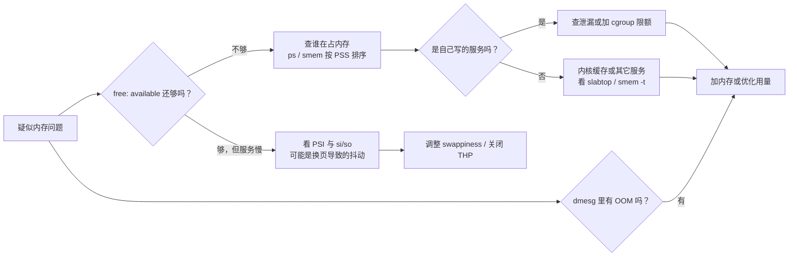

+++
title = "第76章：内存优化"
weight = 760
date = "2026-03-24T13:18:28+08:00"
type = "docs"
description = ""
isCJKLanguage = true
draft = false
+++


# 第七十六章：内存优化

## 76.1 先学会"正确地看内存"

### 76.1.1 free -h 到底怎么读

```bash
free -h
```

```text
               total        used        free      shared  buff/cache   available
Mem:            31Gi       8.5Gi       1.2Gi       0.4Gi        21Gi        21Gi
Swap:          2.0Gi          0B       2.0Gi
```

很多人第一次看这个输出会紧张："31G 内存用了 8.5G，只剩 1.2G 空闲了！"——这是**误读**。Linux 的设计理念是"空闲的内存就是浪费的内存"，它会主动把用不上的内存拿去做**页缓存**（`buff/cache`），加速文件读写。

真正要看的只有两个数：

- **`available`**：还能给新程序用多少内存（已经算上了可以随时回收的缓存）。**这个数才是"还剩多少内存"的答案**
- **`free`**：完全没被使用的内存。它很小甚至接近 0 都是正常的

所以判断"内存够不够"，看 `available`，不要看 `free`，更不要看 `used`。

```bash
# 每秒刷新一次，观察变化趋势
free -s 1

# 以 MB / GB 为单位查看
free -m
free -g
```

### 76.1.2 /proc/meminfo 里的关键字段

```bash
cat /proc/meminfo
```

```text
MemTotal:       32737016 kB      # 总内存
MemFree:         1258392 kB      # 完全空闲
MemAvailable:   22049816 kB      # 估算的可用内存（最重要）
Buffers:          123456 kB      # 块设备元数据缓存
Cached:         20480000 kB      # 文件页缓存
SwapCached:            0 kB      # 换出后又换回、仍留在 swap 里的页
Dirty:              8192 kB      # 已修改但还没写回磁盘的页
Writeback:             0 kB      # 正在写回磁盘的页
AnonPages:       8123456 kB      # 匿名页（堆/栈，也就是"程序真正占的内存"）
Mapped:           654321 kB      # 被 mmap 映射的文件
Shmem:            409600 kB      # 共享内存（/dev/shm、tmpfs）
Slab:             987654 kB      # 内核对象缓存
Committed_AS:   18000000 kB      # 已承诺分配的内存总量
CommitLimit:    16368508 kB      # 允许承诺的上限（与 overcommit 相关）
```

几个值得盯的：

- **`MemAvailable` 持续下降**：才是"内存真的在变紧"的信号
- **`Dirty` / `Writeback` 很高**：说明有大量数据在等写盘，往往伴着 IO 抖动
- **`Slab` 异常大**：内核对象缓存膨胀，可以用 `sudo slabtop` 看是哪个子系统
- **`AnonPages` 很大**：说明应用的堆内存占用高（而不是被缓存占了），这时候才是真的要扩容或查内存泄漏
- **`Committed_AS` 远超 `CommitLimit`**：说明内存严重超额承诺，有触发 OOM 的风险（与 76.4 的 overcommit 有关）

### 76.1.3 进程内存：VSZ、RSS、PSS 别搞混

```bash
# 按内存占用排序（%MEM 用的是 RSS）
ps aux --sort=-%mem | head

# 查看某进程的内存在各段之间怎么分布
pmap -x 12345

# 更精确的汇总（推荐）
cat /proc/12345/smaps_rollup

# 查看关键字段
grep -E 'Vm(Size|RSS|Swap|Data|Stk)' /proc/12345/status
```

| 指标 | 含义 | 注意 |
|------|------|------|
| VSZ / VmSize | 虚拟内存大小 | **含大量未真正分配的空间**，看它容易吓到自己 |
| RSS / VmRSS | 常驻物理内存 | 常用指标，但**共享库和共享内存会被重复计算** |
| PSS | 按共享比例分摊后的物理内存 | 要"把多个进程加起来"时用 PSS，最准 |
| USS | 该进程独占的物理内存 | 判断"杀掉它能释放多少"时用它 |
| VmSwap | 被换出到 swap 的量 | 不为 0 说明这个进程正被换页 |

> **为什么把所有进程的 RSS 加起来常常超过总内存？** 因为共享库（如 `libc`）、共享内存被每个进程各算了一遍。要准确统计，用 `smem`：
>
> ```bash
> sudo apt install smem
> sudo smem -t -k          # 显示总量，并按 PSS 计算
> sudo smem -r -k | head   # 按 PSS 排序
> ```
>
> 另外注意：**在容器里用 `ps`/`top` 看到的内存也不是容器限额**，那是宿主机的数字（有些容器运行时已做修正）。容器内的内存限制要看 cgroup（见 76.5）。

## 76.2 判断"内存到底是不是瓶颈"

光看 `available` 不够，因为内存不足的表现往往在别处。按顺序查这几项：

```bash
# 1) 是否在用 swap（si/so 长期不为 0 就说明内存吃紧）
vmstat 1
```

```text
procs -----------memory---------- ---swap-- -----io---- -system-- ------cpu-----
 r  b   swpd   free   buff  cache   si   so    bi    bo   in   cs us sy id wa st
 1  0  51200 125839 123456 20480000   120  240  4200 18000 3200 9800  8  5 78  9  0
```

`si`（从 swap 读入）和 `so`（写入 swap）持续非零，说明内存不足，系统正在频繁换页——这会让服务响应时间明显变差。

```bash
# 2) 有没有被 OOM Killer 杀过进程
dmesg -T | grep -i -E 'out of memory|killed process'
journalctl -k | grep -i -E 'oom|killed process'
```

```text
[Mon Mar 23 10:12:01 2026] Out of memory: Killed process 12345 (java) total-vm:8g, anon-rss:4g, file-rss:0kB
```

看到这条就实锤了：**内核因为内存不足，直接杀掉了进程**。

```bash
# 3) 页错误与内存压力
sar -B 1        # majflt/s 高说明大量页要从磁盘换入
cat /proc/pressure/memory    # PSI：内存压力（avg10/avg60 越大压力越重）
```

```text
some avg10=12.34 avg60=8.21 avg300=4.10 total=12345678
full avg10=3.21 avg60=2.10 avg300=1.05 total=2345678
```

> `/proc/pressure/memory`（PSI）是**判断内存压力最直接的指标**：`avg10` 持续偏高，说明进程经常因为等内存而停顿。它比"内存使用率 90%"这种数字有意义得多——使用率高但都是可回收缓存时，其实毫无压力。

## 76.3 Swap：该不该用、怎么用

### 76.3.1 swappiness

`vm.swappiness` 控制"内核有多愿意把匿名页换出到 swap"，取值 0-100，默认 60。

```bash
# 查看
cat /proc/sys/vm/swappiness

# 临时修改
sudo sysctl -w vm.swappiness=10

# 永久修改：写在独立文件里（不要直接改 /etc/sysctl.conf）
sudo tee /etc/sysctl.d/99-memory-tuning.conf <<'EOF'
vm.swappiness = 10
EOF
sudo sysctl --system
```

| 场景 | swappiness | 说明 |
|------|-----------|------|
| 数据库（MySQL、PostgreSQL） | 1-10 | 宁可回收缓存，也不要把数据库的内存换出去 |
| Redis、内存数据库 | 1 | 换出会带来灾难性的延迟抖动 |
| 通用服务器 | 10-30 | 常见折中值 |
| 桌面 / 交互式系统 | 60（默认） | 保留默认即可，让系统在内存紧张时更从容 |
| 内存严重不足 | 60-100 | 这是"没办法的办法"，根本解法还是加内存 |

> **关于 `swappiness=0`**：它并不是"禁用 swap"，而是"只有在快 OOM 时才用"。在某些内核版本上，`0` 反而会导致内存回收更激进（因为更倾向丢弃文件缓存），所以 **1 比 0 更稳妥**。
>
> 现代 Linux 还有一个 `vm.swapiness` 的补充项：内存压力大时内核可能选择**换出**而不是**丢弃缓存**，这解释了为什么有时 `swappiness` 设得很低，`si/so` 还是不为零。判断标准始终是 PSI 和 `si/so`，而不是单看这个数值。

### 76.3.2 Swap 分区 vs Swap 文件

| 形式 | 优点 | 缺点 |
|------|------|------|
| 独立分区 | 性能稍好、不受文件系统影响 | 大小固定，事后调整麻烦 |
| 交换文件 | 随时创建、调整大小、扩容方便 | 需要在支持的文件系统上创建，性能略低（差距很小） |

现代部署普遍用**交换文件**。创建步骤：

```bash
# 1) 创建文件（2GB）
sudo fallocate -l 2G /swapfile
# 如果 fallocate 不被支持，改用：
# sudo dd if=/dev/zero of=/swapfile bs=1M count=2048 status=progress

# 2) 权限必须是 600，否则 mkswap 会拒绝
sudo chmod 600 /swapfile

# 3) 格式化为 swap 并启用
sudo mkswap /swapfile
sudo swapon /swapfile

# 4) 确认（swapon --show 等价于老命令 swapon -s）
swapon --show
free -h
```

永久启用写进 `/etc/fstab`：

```text
/swapfile  none  swap  sw  0  0
```

```bash
# 验证 fstab 没问题（很重要，写错了可能开不了机）
sudo swapon --show
```

```bash
# 不再需要时关闭并删除
sudo swapoff /swapfile
sudo rm /swapfile
```

> **文件系统上的坑（原稿没提到，但很常见）：**
>
> - **Btrfs**：从 Linux 5.0 起支持 swap 文件，但**必须关闭该文件的 COW**：先 `sudo chattr +C /swapfile`（要在一个空文件上设置）再写入内容
> - **ZFS**：**不支持 swap 文件**，只能用 zvol
> - **RHEL 系**：除了 `chmod 600`，还要注意 SELinux 上下文，必要时 `sudo chcon -t swapfile_t /swapfile`
> - 交换文件**不能放在 Btrfs 的 RAID 或多设备 profile 上**

### 76.3.3 Swap 该分多大

"swap 要等于 2 倍内存"是老机器时代的经验，早就不适用了。现在的原则是：

- **大部分现代服务器**：给 2-4GB 就够，它的作用只是"兜底"和"让内核有地方放冷页"，而不是真的拿来做内存
- **需要休眠（hibernate）**：swap 必须 ≥ 内存容量（这是硬要求）
- **内存很小的机器 / 桌面**：按内存的 1-2 倍给比较从容

### 76.3.4 更现代的方案：zram 与 zswap

如果不希望数据真的落到慢速磁盘上，有两个更现代的选择：

- **zswap**：在内存里开一块压缩缓存，被换出的页先压缩存在这里，只有压不下时才写进磁盘。对 SSD 寿命和延迟都有好处
- **zram**：把一部分内存做成压缩的块设备当 swap 用。**压缩后能存 2-3 倍的数据，而且完全不碰磁盘**，在容器、桌面和低内存场景非常流行

```bash
# 查看 zram 设备（如果系统已启用）
zramctl

# Ubuntu / Debian 上安装 zram 工具
sudo apt install zram-tools
# 配置在 /etc/default/zramswap 里，改完重启 zramswap 服务
```

> Fedora、部分桌面发行版默认就启用了 zram。**但不要在服务器上盲目启用**：zram 会占用内存并消耗 CPU 做压缩，对已经内存紧张的服务来说，这可能是雪上加霜。

## 76.4 overcommit：内存"超额承诺"策略

`vm.overcommit_memory` 决定内核如何对待内存申请：

| 取值 | 含义 | 说明 |
|------|------|------|
| 0 | 启发式检查（默认） | 明显不合理的申请会被拒绝，**绝大多数服务器就用它** |
| 1 | 总是允许超额申请 | 申请必然成功，风险推迟到真正写内存时（可能触发 OOM） |
| 2 | 按 `CommitLimit` 严格限制 | 超额直接拒绝，适合想"提前失败"的场景 |

```bash
# 查看
cat /proc/sys/vm/overcommit_memory

# 需要时再改（先确认真的有必要）
sudo sysctl -w vm.overcommit_memory=1

# overcommit_ratio 只在 overcommit_memory=2 时生效
sudo sysctl -w vm.overcommit_ratio=50
```

> ⚠️ **别把 `overcommit_memory=1` 当成"通用优化"。** 它的含义是"内核不再认真检查是否超额"，好处是避免某些程序 `fork` 时申请不到内存，坏处是把风险推迟到真正分配的那一刻——最坏的结果就是 OOM Killer 直接杀掉你的业务进程。
>
> 典型的**确有必要**的场景只有几个：**Redis** 做后台保存（`BGSAVE`）时会 fork 子进程，官方明确建议把它设为 1；此外是一些会 fork 出大子进程的工具（部分 JVM 场景、某些数据库备份工具）。**其它情况请保持默认的 0。**

## 76.5 用 cgroup 给进程设定内存上限

单个进程内存失控时，与其等 OOM Killer 随机挑一个"倒霉蛋"（可能正是你的核心业务），不如**主动给服务划出内存限额**，让超限只影响它自己。

systemd 服务直接加配置项（底层是 cgroup v2）：

```ini
# /etc/systemd/system/myapp.service
[Service]
MemoryMax=2G          # 硬上限，超过就触发 cgroup 内的 OOM
MemoryHigh=1500M      # 软上限，超过后开始强制回收、明显放慢
MemorySwapMax=512M    # 允许用多少 swap
OOMScoreAdjust=-500   # 降低被系统级 OOM Killer 选中的概率（-1000 ~ 1000）
```

```bash
sudo systemctl daemon-reload
sudo systemctl restart myapp

# 查看该服务的内存使用与限额
systemctl show myapp -p MemoryCurrent -p MemoryMax -p MemoryHigh
```

> **为什么推荐给关键服务加限额？** 因为有 `MemoryMax` 之后，一个服务内存涨疯时，**内核只会在这个 cgroup 内触发 OOM**，杀掉这个服务自己的进程，而不是把整机拖垮、误杀掉别的服务。这是一种"用可控的小事故换取整机稳定"的做法。
>
> cgroup v2 的对应文件是 `/sys/fs/cgroup/<路径>/memory.max`、`memory.high`、`memory.current`、`memory.events`（`oom` 计数就在这里）。容器同理，Docker 的 `--memory`、Kubernetes 的 `resources.limits.memory` 都是这个机制。

## 76.6 透明大页（THP）与 HugePages

CPU 管理内存是按"页"来的，默认页大小 4KB。**大页（HugePages，通常 2MB 或 1GB）** 能显著减少页表项数量，提升 TLB 命中率。

问题出在"透明"大页（THP）上——它由内核自动合并，某些应用（Redis、部分数据库、JVM）会因此出现**不可预测的延迟抖动**。

```bash
# 当前 THP 策略：always / madvise / never
cat /sys/kernel/mm/transparent_hugepage/enabled

# 查看碎片整理策略
cat /sys/kernel/mm/transparent_hugepage/defrag

# 临时关闭（注意这里在 root shell 下可以直接写）
echo never | sudo tee /sys/kernel/mm/transparent_hugepage/enabled
echo never | sudo tee /sys/kernel/mm/transparent_hugepage/defrag
```

> **`madvise` 通常是更好的选择**：只有程序显式调用 `madvise(MADV_HUGEPAGE)` 时才启用大页，既保留了性能收益，又不会让 Redis 这类程序无端抖动。现代发行版很多已经默认使用 `madvise`。
>
> **THP 的改动重启后会失效**，要持久化得写进 systemd 单元或 `rc.local`（也可以通过 `tuned` 的 profile 管理）。
>
> 如果某个应用确实需要确定性的大页性能（如 Oracle、DPDK），可以用**静态 HugePages**：在 GRUB 里加 `hugepages=1024`，或运行时设置 `vm.nr_hugepages`，然后由应用显式申请。**代价是这部分内存被预留后无法给普通程序使用**，必须按需规划。

## 76.7 其它值得了解的参数

```ini
# /etc/sysctl.d/99-memory-tuning.conf
# 内核保留的空闲内存下限（单位 KB）。默认由内核按内存总量自动计算，
# 手工设得过大反而会浪费时间回收内存，除非有明确理由，保持默认值即可。
# vm.min_free_kbytes = 65536

# inode / dentry 缓存的回收倾向。默认 100，调小（如 50）会更舍不得回收它们，
# 在"大量小文件"的场景（文件服务器、CI 缓存）有助于提升命中率。
vm.vfs_cache_pressure = 50

# 脏页回写阈值（与第 77 章配合看）：大内存机器建议用绝对字节数而不是百分比
vm.dirty_background_ratio = 5
vm.dirty_ratio = 10
```

运行时相关：

- **`MALLOC_ARENA_MAX=2`**：glibc 在多线程程序里会为每个线程准备内存池（arena），可能让进程占用大量虚拟内存。把它设为 `2`（或 4）常能显著降低 Java、Python 服务的 VSZ，对内存紧张的容器很有用
- **`sudo slabtop`**：实时查看内核 slab 缓存的构成，排查"内核吃了很多内存"
- **`memory.stat`**：容器/cgroup 场景下用 `cat /sys/fs/cgroup/<path>/memory.stat` 看内存具体花在哪（`file`、`anon`、`slab`）

## 76.8 一份排查脚本

```bash
#!/bin/bash
# mem-check.sh —— 内存问题的一次性体检
set -uo pipefail

echo "===== 1. 总体使用 ====="
free -h

echo
echo "===== 2. 内存压力（PSI，avg10 越大压力越重）====="
cat /proc/pressure/memory 2>/dev/null || echo "（内核未开启 PSI）"

echo
echo "===== 3. Swap 使用 ====="
swapon --show
echo "swappiness = $(cat /proc/sys/vm/swappiness)"

echo
echo "===== 4. 占用内存最多的 10 个进程 ====="
ps -eo pid,user,rss,vsz,comm --sort=-rss | head -11

echo
echo "===== 5. 最近是否发生 OOM ====="
dmesg -T 2>/dev/null | grep -i -E 'out of memory|killed process' | tail -5 || echo "（需要 root 才能读 dmesg）"

echo
echo "===== 6. 匿名页 vs 缓存 ====="
grep -E '^(AnonPages|Cached|Buffers|Slab|Dirty|MemAvailable)' /proc/meminfo
```

> 顺带说一句 `vm.drop_caches`：它可以手工清掉页缓存（`echo 3 | sudo tee /proc/sys/vm/drop_caches`），但**页缓存本来就是用来加速的**，清掉之后所有读都要重新走磁盘，性能会短暂变差。**它只适合"做 IO 基准测试前把环境弄干净"这一种用途**，日常生产不要跑，更不要放进任何定时任务。

## 本章小结

| 参数 / 工具 | 说明 | 建议 |
|-------------|------|------|
| `free -h` 的 `available` | 真正可用的内存 | 判断内存是否够用只看它 |
| `/proc/pressure/memory` | 内存压力（PSI） | 比"使用率"更能说明问题 |
| `swappiness` | 换出匿名页的倾向 | 数据库/Redis 取 1-10，通用取 10-60 |
| `overcommit_memory` | 超额承诺策略 | 保持 0，Redis 等特殊场景才用 1 |
| cgroup `MemoryMax` | 给服务设硬限额 | 关键服务建议设置，避免拖垮整机 |
| THP | 透明大页 | 一般用 `madvise`，Redis/DB 可设 `never` |
| `MALLOC_ARENA_MAX` | glibc 内存池数量 | 多线程服务设 2 可省下大量虚拟内存 |
| `vfs_cache_pressure` | inode/dentry 缓存回收倾向 | 大量小文件场景可调小 |
| `vm.drop_caches` | 手工清缓存 | 仅用于性能测试，不要日常使用 |

排查思路：


```mermaid
graph LR
    A["疑似内存问题"] --> B{"free: available 还够吗？"}
    B -->|"够，但服务慢"| C["看 PSI 与 si/so<br/>可能是换页导致的抖动"]
    B -->|"不够"| D["查谁在占内存<br/>ps / smem 按 PSS 排序"]
    D --> E{"是自己写的服务吗？"}
    E -->|"是"| F["查泄漏或加 cgroup 限额"]
    E -->|"否"| G["内核缓存或其它服务<br/>看 slabtop / smem -t"]
    C --> H["调整 swappiness / 关闭 THP"]
    F --> I["加内存或优化用量"]
    G --> I
    A --> J{"dmesg 里有 OOM 吗？"}
    J -->|"有"| I
```

> **一句话提醒**：Linux 会把内存尽量拿来做缓存，所以"使用率高"本身不是问题。**真正要盯的是 `available` 是否持续下降、PSI 压力是否升高、有没有出现 swap 换入换出和 OOM 记录**。看到 `used` 高就急着清缓存、加内存，往往是在解决一个并不存在的问题。

下一章我们看磁盘 IO 优化。
