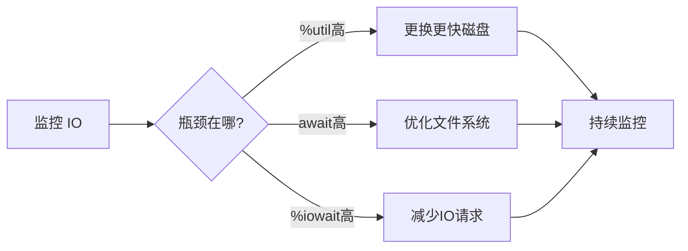

+++
title = "第77章：磁盘 IO 优化"
weight = 770
date = "2026-03-24T13:18:28+08:00"
type = "docs"
description = ""
isCJKLanguage = true
draft = false
+++


# 第七十七章：磁盘 IO 优化

## 77.1 IO 分析

### iostat 使用

```bash
# 安装
sudo apt install sysstat

# 基本使用
iostat -x 1

# 输出解读：
# %util: IO 占用率，100% = 饱和
# await: 平均 IO 等待时间（毫秒）
# avgqu-sz: 平均队列长度
# r/s, w/s: 每秒读写次数
# rkB/s, wkB/s: 每秒读写 KB
```

### iotop 进程监控

```bash
# 安装
sudo apt install iotop

# 实时监控
sudo iotop

# 只显示有 IO 的进程
sudo iotop -o

# 查看累计 IO
sudo iotop -a

# 快捷键
# 左右箭头: 排序
# r: 反向排序
# q: 退出
```

### IO 瓶颈分析

```bash
# 1. 检查 CPU 等待 IO
# 如果 %iowait 高，说明 CPU 在等待 IO
vmstat 1

# 2. 检查磁盘使用率
iostat -x 1
# %util 接近 100% 说明磁盘饱和

# 3. 检查 IO 队列
iostat -x
# avgqu-sz > 1 说明有队列积压

# 4. 检查 IO 延迟
iostat -x 1
# await > 100ms 说明 IO 慢
```

## 77.2 文件系统优化

### 选择合适的文件系统

| 文件系统 | 特点 | 适用场景 |
|----------|------|---------|
| ext4 | 通用、稳定 | 默认选择 |
| XFS | 大文件、高并发 | 数据库、日志 |
| Btrfs | 快照、校验 | 需要数据保护 |
| ZFS | 高级功能 | 存储服务器 |

### 挂载选项优化

```bash
# noatime: 不记录访问时间（提升性能）
# nodiratime: 不记录目录访问时间
# nobarrier: 关闭写入屏障（提升性能，但可能丢数据）
# data=writeback: 日志模式（比 ordered 快）

# 挂载示例
sudo mount -o noatime,nodiratime,noexec /dev/sda1 /mnt

# 查看当前挂载选项
mount | grep sda1

# 永久生效（/etc/fstab）
UUID=xxx / ext4 defaults,noatime,nodiratime 0 1
```

### ext4 优化

```bash
# 创建时指定特性
mkfs.ext4 -O extent,uninit_bg /dev/sda1

# 调整日志大小
tune2fs -J size=4096 /dev/sda1

# 关闭访问时间
tune2fs -o noatime /dev/sda1

# 检查和修复
sudo fsck.ext4 -p /dev/sda1
```

### XFS 优化

```bash
# XFS 特性
# - 大文件支持（8EB）
# - 高并发
# - 日志优化

# 创建时优化
mkfs.xfs -f -l size=128m,lazy-count=1 /dev/sda1

# XFS 调优参数
# noatime 已在 XFS 默认启用
```

### 磁盘 IO 调度算法

```bash
# 查看当前调度器
cat /sys/block/sda/queue/scheduler

# 可用调度器：
# - mq-deadline: 适合 SSD
# - none: 适合 NVMe/SSD
# - bfq: 适合桌面/多媒体
# - kyber: 适合服务器

# 临时修改
echo mq-deadline > /sys/block/sda/queue/scheduler

# 永久修改（udev）
sudo nano /etc/udev/rules.d/60-scheduler.rules

# 添加：
ACTION=="add|change", KERNEL=="sd[a-z]", ATTR{queue/scheduler}="mq-deadline"
ACTION=="add|change", KERNEL=="nvme[0-9]*", ATTR{queue/scheduler}="none"
```

## 本章小结

本章我们学习了磁盘 IO 优化的核心知识：

| 工具/参数 | 用途 |
|-----------|------|
| iostat | IO 统计 |
| iotop | 进程 IO 监控 |
| noatime | 禁用访问时间 |
| 调度算法 | IO 调度策略 |

IO 优化检查清单：



---

> 💡 **温馨提示**：
> 磁盘 IO 往往是系统最慢的部分。能用内存缓存的就用内存，能用 SSD 就用 SSD，能顺序读写就别随机！

---

**第七十七章：磁盘 IO 优化 — 完结！** 🎉

下一章我们将学习"网络优化"，掌握 TCP 调优和网络分析技能。敬请期待！ 🚀
