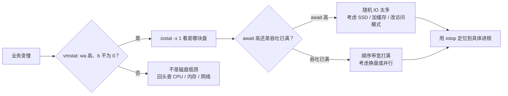

+++
title = "第77章：磁盘 IO 优化"
weight = 770
date = "2026-03-24T13:18:28+08:00"
type = "docs"
description = ""
isCJKLanguage = true
draft = false
+++


# 第七十七章：磁盘 IO 优化

## 77.1 先理解：磁盘为什么总是瓶颈

CPU 的延迟是纳秒级，内存是几十纳秒，SSD 是几十微秒，机械硬盘的随机寻道是**毫秒级**——差了好几个数量级。所以磁盘往往是整套系统里最慢的一环，也常常是优化收益最大的地方。

理解磁盘 IO，先分清两组概念：

- **吞吐（throughput）**：每秒能传多少 MB。顺序读写（大文件复制、备份）主要看它
- **IOPS 与延迟（latency）**：每秒能完成多少次 IO 操作、单次平均要等多久。随机小 IO（数据库、日志、大量小文件）主要看它们

**这两类负载的优化手段完全不同**，先搞清楚自己的业务属于哪一类，再谈调优。

还有一层很关键：**Linux 会用空闲内存做页缓存（page cache）**。读操作大多直接命中内存，根本不到磁盘；写操作先写进内存，随后由内核异步刷盘。所以看到"磁盘看起来很闲但写入很慢"时，瓶颈往往在**刷盘节奏**上，而不是磁盘本身——77.7 会专门讲这块。

## 77.2 用 iostat 看磁盘到底有多忙

```bash
# 安装（sysstat 里还带着 mpstat、pidstat、sar）
sudo apt install sysstat        # RHEL 系：sudo dnf install sysstat

# -x 显示扩展统计，1 表示每秒刷新
iostat -x 1
```

```text
Device   r/s     w/s     rkB/s    wkB/s  rrqm/s wrqm/s  %rrqm  %wrqm r_await w_await aqu-sz rareq-sz wareq-sz  svctm  %util
sda     12.00  340.00    512.0   4096.0    0.00  20.00   0.00   5.56    0.45    1.20   0.42    42.7    12.0   0.30   4.30
nvme0n1 1200.0 2400.0 102400.0 204800.0   0.00   0.00   0.00   0.00    0.08    0.12   3.60    85.3    85.3   0.02  58.20
```

重点看这几列：

| 字段 | 含义 | 怎么判断有问题 |
|------|------|----------------|
| `r/s`、`w/s` | 每秒完成的读写次数（即 IOPS） | 是否已接近设备的标称能力 |
| `rkB/s`、`wkB/s` | 每秒读写吞吐 | 是否已接近磁盘带宽上限 |
| `aqu-sz` | 平均请求队列长度 | 要和设备的并行能力比较，**不是简单地 `>1` 就算积压** |
| `await` | 平均 IO 等待时间（毫秒，含排队） | 机械盘 > 20ms、SSD > 5ms 就值得关注 |
| `%util` | 设备"至少有一个请求在处理"的时间占比 | **SSD / NVMe 上 100% 不等于饱和**（见下） |
| `rareq-sz` / `wareq-sz` | 平均每个请求的大小（KB） | 远小于 4KB 说明是小 IO、随机性高 |

> **"`avgqu-sz > 1` 就说明队列积压"这个说法并不准确。** 队列长度要跟设备的并行度比较：机械盘并行度基本是 1，队列 1 就意味着后面在排队；而一块 NVMe 的并行度可能上百，队列 10 反而很轻松。
>
> 同理，`%util` 表示"设备忙的时间比例"，对支持并行处理的 NVMe 来说，`%util` 到 100% 仍可能远未触及上限。**判断是否饱和要看 `await` 是否明显上升、吞吐是否已经打满，而不是只盯 `%util`。**

> **"`await > 100ms` 就是 IO 慢"也要分设备看。** 机械盘 `await` 十几毫秒是正常的（寻道时间摆在那里）；SSD 应该在 1ms 以内；NVMe 更是 0.1ms 量级。拿 SSD 的标准去衡量机械盘，或者反过来，都会得出错误结论。

## 77.3 找出是谁在读写：iotop 与 pidstat

```bash
# 安装
sudo apt install iotop        # RHEL 系：sudo dnf install iotop

# 实时按进程显示 IO
sudo iotop

# -o 只显示真正有 IO 的进程（推荐，否则列表里全是 0）
sudo iotop -o

# -a 显示累计 IO，而不是瞬时速率
sudo iotop -a
```

`iotop` 的快捷键：左右箭头切换排序字段、`r` 反向排序、`o` 切换只显示活跃进程、`q` 退出。

> `iotop` 显示的是**进程主动发起的块设备 IO**。有一类 IO 是内核替进程做的（页缓存回写、文件系统日志提交），会记到 `[kworker]` 这类内核线程头上，看不到"真凶"。这时候配合 `vmstat` 的 `bi`/`bo` 一起判断。
>
> 补充一个很好用的命令：`pidstat -d 1`（同在 sysstat 包里），按进程显示读写 KB 和 IO 延迟（`iodelay`）。

## 77.4 判断 IO 瓶颈的完整套路

```bash
# 第 1 步：是不是在等 IO？看 b 列和 wa
vmstat 1
```

```text
procs -----------memory---------- ---swap-- -----io---- -system-- ------cpu-----
 r  b   swpd   free   buff  cache   si   so    bi    bo   in   cs us sy id wa st
 2  6      0 512340  98210 4102332    0    0  4200 18000 3200 9800  8  5 78  9  0
```

关键组合是：**`b` 列（处于不可中断睡眠的进程数）不为 0，同时 `wa` 高**，就说明有进程在等 IO。`bi` / `bo` 是每秒从块设备读入 / 写出的块数。

```bash
# 第 2 步：是哪块盘、哪个指标不对劲
iostat -x 1

# 第 3 步：是哪个进程
sudo iotop -o

# 第 4 步：如果 IO 是"写"出来的，看是不是刷盘节奏的问题
grep -E 'dirty|Writeback' /proc/meminfo
sysctl vm.dirty_ratio vm.dirty_background_ratio vm.dirty_expire_centisecs
```

## 77.5 文件系统选择与挂载选项

### 77.5.1 常见文件系统怎么选

| 文件系统 | 特点 | 适用场景 |
|----------|------|----------|
| ext4 | 通用、成熟、工具链完善，**支持缩容** | 系统盘、一般业务盘 |
| XFS | 大文件与高并发表现好，**不支持缩容** | 数据库、日志盘、大容量存储 |
| Btrfs | 快照、校验和、压缩，功能多但更复杂 | 需要快照 / 回滚的场景 |
| ZFS | 校验、快照、压缩、缓存（ARC）齐全 | 存储服务器（需额外安装） |

> 必须记住一点：**XFS 只能扩容、不能缩容。** 规划分区时别切得太满，否则后期调整会非常被动。

### 77.5.2 挂载选项

```bash
# 常用选项说明
# noatime     不更新文件访问时间（省掉大量元数据写入，收益最直接）
# nodiratime  不更新目录访问时间
# noexec      禁止在该分区执行程序（数据盘很有用，能挡住一部分攻击）
# nosuid      忽略 setuid / setgid 位
# nodev       不解析该分区上的设备文件
```

```bash
# 临时挂载
sudo mount -o noatime,nodiratime,noexec /dev/sdb1 /data

# 查看当前挂载参数
findmnt /data
```

永久生效写进 `/etc/fstab`：

```text
# <设备>          <挂载点>  <类型>  <选项>                            <dump> <pass>
UUID=xxxx-xxxx    /data     ext4    defaults,noatime,nodiratime,noexec  0 2
```

> **`noatime` 是收益最直接的一项。** 默认的 `relatime` 已经比老的 `atime` 好很多，但在读多写多的场景下，`noatime` 仍能省掉一批元数据写入。
>
> **`nobarrier` 这个挂载选项并不存在**——原稿里的写法会直接被 mount 拒绝。要关闭写入屏障，ext4 上的参数是 `barrier=0`，但代价是**断电时可能丢失已提交的数据**，只有在明确知道自己在做什么时才用。
>
> 同理，`data=writeback` 虽然比默认的 `data=ordered` 快，但崩溃时**已提交的文件数据可能丢失或读到旧内容**。生产环境不建议为了这点性能去冒数据风险。

### 77.5.3 ext4 调优

```bash
# 现代 e2fsprogs 默认已启用 extent、dir_index 等特性
# 原稿里的 mkfs.ext4 -O extent,uninit_bg 其实是在重复默认值，一般不需要写
sudo mkfs.ext4 /dev/sdb1

# 查看分区的当前特性与日志大小
sudo tune2fs -l /dev/sdb1 | grep -E 'Filesystem features|Journal size|Default mount options'

# 把 noatime 设为该分区的默认挂载选项（写进超级块）
sudo tune2fs -o noatime /dev/sdb1
```

关于日志（journal）大小：

```bash
# 查看当前日志大小
sudo tune2fs -l /dev/sdb1 | grep 'Journal size'

# 调整日志大小（单位是文件系统块），更大的日志有助于写入吞吐
sudo tune2fs -J size=1024 /dev/sdb1
```

> **调整日志大小必须在文件系统卸载（或只读挂载）状态下进行**，在线执行会被拒绝。而且日志过大反而拖慢 `fsck`、占用空间，除非确实有写入吞吐压力，用默认值就好。

### 77.5.4 XFS 相关

```bash
# 创建时指定日志大小（示例）
sudo mkfs.xfs -f -l size=256m /dev/sdb1

# 查看 XFS 信息
sudo xfs_info /data

# 在线扩容（只能扩大，不能缩小）
sudo xfs_growfs /data
```

> `lazy-count=1` 这类参数在新版 `mkfs.xfs` 里已经是默认值，不必手写。XFS 的强项是大文件和高并发元数据操作，**创建时按预期负载把 `agcount`、日志大小规划好，比事后调参更有意义**。

## 77.6 IO 调度器与 IO 优先级

### 77.6.1 调度器选哪个

```bash
# 查看当前调度器（中括号里的那个是生效值）
cat /sys/block/sda/queue/scheduler
```

```text
[mq-deadline] kyber bfq none
```

| 调度器 | 特点 | 建议 |
|--------|------|------|
| `none` | 基本不重排序，直接下发 | **NVMe、高性能 SSD**（设备自身并行度已足够高，内核不必插手） |
| `mq-deadline` | 尽量保证请求在期限内完成 | 通用默认值，SATA SSD 与机械盘都合适 |
| `kyber` | 轻量、低开销 | 高速设备与特定场景 |
| `bfq` | 按进程公平分配带宽 | 桌面、对交互体验有要求的场景（开销最大） |

```bash
# 临时修改（注意重定向要交给 root 的 shell，用 tee）
echo mq-deadline | sudo tee /sys/block/sda/queue/scheduler
```

> 原稿里写的 `echo mq-deadline > /sys/block/sda/queue/scheduler` 在普通用户下必然失败——`>` 是当前 shell 打开的，`sudo` 管不到它。

永久生效用 udev 规则：

```bash
sudo tee /etc/udev/rules.d/60-io-scheduler.rules <<'EOF'
# 非旋转设备（SSD）统一用 mq-deadline
ACTION=="add|change", KERNEL=="sd[a-z]", ATTR{queue/rotational}=="0", ATTR{queue/scheduler}="mq-deadline"
# NVMe 用 none
ACTION=="add|change", KERNEL=="nvme[0-9]*n[0-9]*", ATTR{queue/scheduler}="none"
EOF

sudo udevadm control --reload-rules
sudo udevadm trigger
```

### 77.6.2 ionice：给进程分配 IO 优先级

`nice` 只管 CPU，管 IO 的是 `ionice`：

```bash
# ionice 的三种 class：1=realtime，2=best-effort，3=idle
# 把备份任务设为 idle：只在没有别人用磁盘时才跑
sudo ionice -c 3 -p "$(pgrep -f backup)"
sudo ionice -c 3 tar czf /backup/data.tar.gz /data

# best-effort 类还可以再指定 0-7 的优先级
sudo ionice -c 2 -n 7 -p 12345
```

> **要提醒的是：只有 CFQ / BFQ 这类调度器才真正实现 IO 优先级。** 在 `none` / `mq-deadline` 下，`ionice` 的 best-effort 基本不生效（内核会直接忽略）。指望靠它在 NVMe 上限制备份任务是不现实的。
>
> **在 NVMe 上要限速，应该用 cgroup v2 的 `io.max`，或者干脆给工具本身限速**（如 `rsync --bwlimit=50m`、`tar` 配合 `pv -L 50m`）。

## 77.7 页缓存与脏页刷盘：最容易被忽略的一块

Linux 把空闲内存拿来做页缓存，写操作先落到内存，随后由内核的回写线程慢慢刷盘。参数不合理时会出现两种典型症状：

- **周期性 IO 抖动**：`dirty_ratio` 太大，脏页累积到很高才集中狂写，业务能感觉到规律性的卡顿
- **写延迟毛刺**：某个进程写了一大批数据但没到阈值，某一刻被强制同步刷盘阻塞住

```bash
# 查看当前值
sysctl vm.dirty_ratio vm.dirty_background_ratio vm.dirty_expire_centisecs vm.dirty_writeback_centisecs
```

```text
vm.dirty_background_ratio = 10     # 脏页达到内存的 10% 时，后台开始刷
vm.dirty_ratio = 20                # 脏页达到 20% 时，写操作被同步阻塞直到刷完
```

调优经验：

- **数据库、虚拟化宿主机**这类对写延迟敏感的机器，通常把这两个比例**调小**（例如 5 / 10），让刷盘更平滑
- 大内存机器上更应该**改用绝对字节数**（`vm.dirty_background_bytes` / `vm.dirty_bytes`）：128GB 内存按 20% 算就是 25GB 脏页，一旦触发同步刷盘，卡顿会非常明显
- **绝对不要设成 0**——那会让每次写都同步落盘，性能断崖式下跌

```bash
sudo tee /etc/sysctl.d/99-io-tuning.conf <<'EOF'
# 对写延迟敏感的场景（数值仅为示例，需按实际压测调整）
vm.dirty_background_bytes = 268435456   # 256MB
vm.dirty_bytes = 1073741824             # 1GB
EOF

sudo sysctl --system
```

> 另一块相关的参数是 `vm.swappiness`，它属于内存优化的范畴，在下一章会讲到——但它在数据库服务器上同样重要，因为不必要的换页会带来大量随机 IO。

## 77.8 其他值得了解的优化点

- **SSD 的 TRIM**：定期 `sudo fstrim -av`，或者启用 `fstrim.timer`，让 SSD 知道哪些块已无用，维持长期写入性能
- **`fio` 做基准测试**：优化前后用 `fio` 跑同一套随机读 / 随机写 / 顺序写负载，用数据对比而不是凭感觉
- **`blktrace` / `bpftrace`**：想看"一个 IO 请求在内核里各阶段各花了多久"，用它们能精确到排队、合并、下发
- **队列与预读**：`/sys/block/*/queue/nr_requests`、`read_ahead_kb`（顺序读场景适当加大预读能提升吞吐）
- **对齐**：分区与 RAID 条带对齐（现代分区工具默认已对齐）
- **换硬件往往最有效**：机械盘换 SSD、SATA 换 NVMe，收益通常比任何软件调参都大。**先排除硬件瓶颈，再谈调参**

## 本章小结

| 工具 / 参数 | 用途 |
|-------------|------|
| `iostat -x 1` | 看每块盘的 IOPS、吞吐、`await`、`%util` |
| `iotop -o` | 找出哪个进程在读写磁盘 |
| `pidstat -d 1` | 按进程查看 IO 量与延迟 |
| `vmstat 1` | 用 `b` 列和 `wa` 判断是否在等 IO |
| `mount -o noatime` | 最直接、收益最稳的挂载优化 |
| 调度器 / `ionice` | 控制 IO 的处理顺序与优先级 |
| `vm.dirty_*` | 控制脏页回写节奏，消除周期性卡顿 |

排查思路：


```mermaid
graph LR
    A["业务变慢"] --> B{"vmstat: wa 高、b 不为 0？"}
    B -->|是| C["iostat -x 1 看是哪块盘"]
    C --> D{"await 高还是吞吐已满？"}
    D -->|"await 高"| E["随机 IO 太多<br/>考虑 SSD / 加缓存 / 改访问模式"]
    D -->|"吞吐已满"| F["顺序带宽打满<br/>考虑换盘或并行"]
    B -->|否| G["不是磁盘瓶颈<br/>回头查 CPU / 内存 / 网络"]
    E --> H["用 iotop 定位到具体进程"]
    F --> H
```

> **一句话提醒**：磁盘优化的第一原则是"减少 IO"，第二原则是"让 IO 尽量顺序化"，第三才是调参数。加缓存、合并小写入、批量提交，效果通常远好于改调度器。

下一章我们看网络优化。
