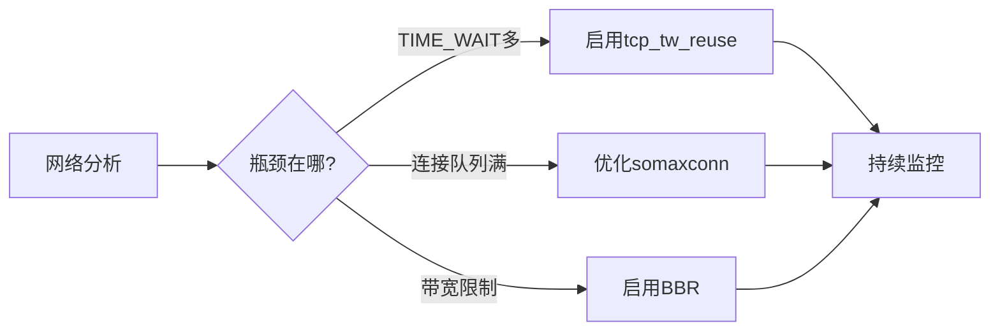

+++
title = "第78章：网络优化"
weight = 780
date = "2026-03-24T13:18:28+08:00"
type = "docs"
description = ""
isCJKLanguage = true
draft = false
+++


# 第七十八章：网络优化

## 78.1 网络分析

### netstat/ss

```bash
# netstat 基本用法
netstat -tuln                 # TCP 监听端口
netstat -an                  # 所有连接
netstat -r                   # 路由表
netstat -s                   # 网络统计

# ss（更现代，性能更好）
ss -tuln                    # TCP 监听
ss -s                       # 汇总统计
ss -tp                      # 显示进程
ss -ti                      # 显示 TCP info

# 查看连接状态
ss -o state established     # 已建立连接
ss -o state time-wait      # TIME_WAIT 状态
```

### 网络连接分析

```bash
# 查看并发连接数
ss -s

# 查看最大文件描述符
cat /proc/sys/fs/file-nr

# 查看网络接口
ip link show
ip addr show
ip -s link show eth0

# 查看网络统计
netstat -i
cat /proc/net/dev
```

## 78.2 TCP 优化

### TCP 参数

```bash
# 查看所有 TCP 参数
sysctl -a | grep tcp.

# 常用参数：
# net.ipv4.tcp_tw_reuse: 复用 TIME_WAIT
# net.ipv4.tcp_fin_timeout: FIN 超时
# net.ipv4.tcp_keepalive_time: Keepalive 时间
# net.ipv4.tcp_keepalive_probes: Keepalive 探测次数
# net.ipv4.tcp_keepalive_intvl: Keepalive 间隔
# net.ipv4.tcp_max_syn_backlog: SYN 队列长度
# net.ipv4.tcp_max_tw_buckets: TIME_WAIT 最大数量
```

### TCP 调优

```bash
# 1. TIME_WAIT 优化
sudo sysctl -w net.ipv4.tcp_tw_reuse=1
sudo sysctl -w net.ipv4.tcp_fin_timeout=30

# 2. 连接队列优化
sudo sysctl -w net.ipv4.tcp_max_syn_backlog=8192
sudo sysctl -w net.core.somaxconn=8192

# 3. 文件描述符优化
sudo sysctl -w net.core.rmem_max=16777216
sudo sysctl -w net.core.wmem_max=16777216
sudo sysctl -w fs.file-max=6553600

# 4. 内存优化
sudo sysctl -w net.ipv4.tcp_rmem="4096 87380 16777216"
sudo sysctl -w net.ipv4.tcp_wmem="4096 65536 16777216"
```

### 永久生效

```bash
# /etc/sysctl.conf
sudo nano /etc/sysctl.conf

# 添加：
net.ipv4.tcp_tw_reuse = 1
net.ipv4.tcp_fin_timeout = 30
net.ipv4.tcp_max_syn_backlog = 8192
net.core.somaxconn = 8192
fs.file-max = 6553600
net.ipv4.tcp_rmem = 4096 87380 16777216
net.ipv4.tcp_wmem = 4096 65536 16777216

# 应用配置
sudo sysctl -p
```

### 拥塞控制算法

```bash
# 查看可用算法
sysctl net.ipv4.tcp_available_congestion_control

# 查看当前算法
sysctl net.ipv4.tcp_congestion_control

# 常用算法：
# - cubic: 默认
# - bbr: Google 开发，高带宽延迟产品
# - reno: 传统算法

# 启用 BBR
sudo sysctl -w net.core.default_qdisc=fq
sudo sysctl -w net.ipv4.tcp_congestion_control=bbr

# 永久生效
echo "net.core.default_qdisc=fq" | sudo tee -a /etc/sysctl.conf
echo "net.ipv4.tcp_congestion_control=bbr" | sudo tee -a /etc/sysctl.conf
```

## 本章小结

本章我们学习了网络优化的核心知识：

| 工具/参数 | 用途 |
|-----------|------|
| ss/netstat | 连接统计 |
| TCP 参数 | 连接调优 |
| BBR | 拥塞控制算法 |

网络优化检查清单：



---

> 💡 **温馨提示**：
> 网络优化要根据实际场景来调，高并发服务器和普通 PC 配置不一样。盲目调参可能适得其反！

---

**第七十八章：网络优化 — 完结！** 🎉

下一章我们将学习"故障排查方法论"，掌握系统故障排查的系统化方法。敬请期待！ 🚀
