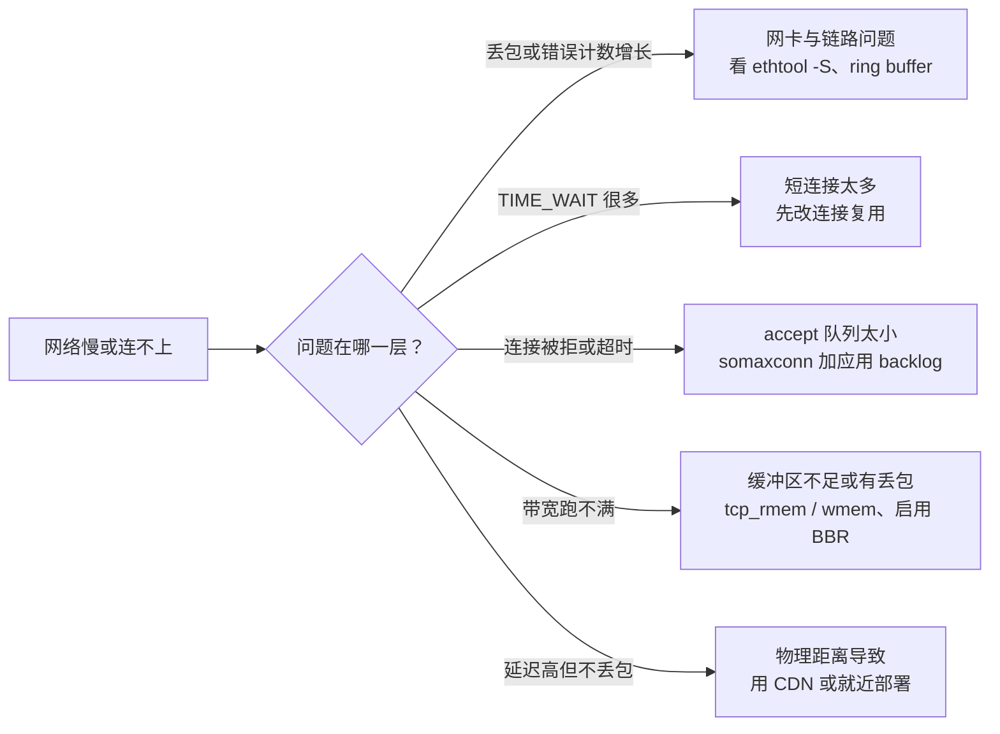

+++
title = "第78章：网络优化"
weight = 780
date = "2026-03-24T13:18:28+08:00"
type = "docs"
description = ""
isCJKLanguage = true
draft = false
+++


# 第七十八章：网络优化

## 78.1 动手之前，先认清三个限制

网络能优化到什么程度，受三件事制约。先把它们认清，能省下大量无效劳动：

1. **带宽**：云主机的公网带宽是买来的，跑满了就是跑满了，调内核参数不会凭空变宽
2. **往返延迟（RTT）**：由物理距离和中间链路决定。要改善它，只能靠就近部署、CDN、减少交互次数
3. **丢包与重传**：丢包会让 TCP 大幅降速。**"能 ping 通"完全不等于"能跑满"**，在高丢包链路上，其它调参都是次要的

所以合理的顺序是：**先确认带宽和丢包是否正常 → 再优化应用层（连接复用、减少请求）→ 最后才动内核参数。**

## 78.2 看清连接的现状：ss（netstat 已过时）

```bash
# net-tools 早已停止维护，很多新系统默认不装 netstat
# 优先用 ss：iproute2 自带，输出更清晰，性能也更好
ss -s                      # 各状态连接的汇总统计
ss -tuln                   # 监听中的 TCP / UDP 端口
ss -tunp                   # 加上进程信息（需 root 才能看到别人的进程）
ss -tan state established  # 只看已建立的连接
ss -tan state time-wait    # 只看 TIME_WAIT
ss -tan state listen       # 只看监听套接字
ss -ti                     # 单个连接的 TCP 内部详细信息（非常有用，见下）
```

```bash
# 统计各状态的连接数量（连接数暴涨时最常用）
ss -tan | awk 'NR>1 {print $1}' | sort | uniq -c | sort -rn
```

```bash
# 网卡层面的统计
ip -s link show eth0
# rx/tx 的 dropped、errors 是重点
```

> **`ss -ti` 值得单独说。** 它会输出每条连接的 `rtt`、`cwnd`（拥塞窗口）、`retrans`（重传次数）、`send-q`/`recv-q` 等。排查"这条连接为什么这么慢"时，一眼就能分辨是**在丢包重传**、**发送窗口被限制**，还是**接收方读得太慢**（`recv-q` 堆积）。

## 78.3 TIME_WAIT：最常见的"连接数告警"

先说清它是什么：**主动关闭连接的一方**会进入 `TIME_WAIT`，并保持 `2×MSL`（Linux 上约 60 秒）。这是协议要求，不是 bug——它保证最后一个 ACK 能被对端收到，也让迟到的旧报文不会污染新连接。

```bash
# 看有多少 TIME_WAIT，以及它们连着谁
ss -tan state time-wait | wc -l
ss -tan state time-wait | awk 'NR>1 {print $5}' | cut -d: -f1 | sort | uniq -c | sort -rn | head
```

**先判断"该不该处理"：**

- **服务端出现了很多 TIME_WAIT** → 说明服务端主动关闭了连接。如果客户端大量使用短连接，数量上万是常见的，一般不用特别处理；真正要改的是**让双方复用连接**
- **客户端侧大量 TIME_WAIT** → 说明这台机器在做大量短连接（爬虫、代理、压测机），这才是需要重点处理的情况

处理手段按优先级排列：

```bash
# 1) 最优：改应用，用连接池 / Keep-Alive 复用连接（治本）
# 2) 其次：调整设计，让 TIME_WAIT 落到能承受的一方
# 3) 内核选项：允许把 TIME_WAIT 状态的端口复用于新的"出站"连接
sudo sysctl -w net.ipv4.tcp_tw_reuse=1
```

```ini
# /etc/sysctl.d/99-net-tuning.conf
net.ipv4.tcp_tw_reuse = 1
net.ipv4.tcp_fin_timeout = 30
```

> **几点必须说清楚：**
>
> - `tcp_tw_reuse` 只对**主动发起连接的一方（出站连接）**有效，对"别人连我"的服务端场景没有帮助
> - 它依赖 TCP 时间戳（`tcp_timestamps`，默认开启）来保证安全
> - **`net.ipv4.tcp_tw_recycle` 千万不要用**：它在 NAT 环境下会导致连接异常，**早在 Linux 4.12 就被彻底移除了**。老教程里还在推荐它的，直接跳过
> - `tcp_max_tw_buckets` 只是"上限保护"：调小不会减少 TIME_WAIT，只会超出时直接丢掉连接并打印告警。不建议动

## 78.4 连接队列：somaxconn 与 backlog

瞬时并发连接冲上来时，已完成握手的连接会先排进一个队列，等应用调用 `accept()`。队列太小，内核就会丢弃新连接，表现为客户端偶发"连接超时"。

```bash
# 内核允许的最大 accept 队列长度
sysctl net.core.somaxconn

# 半连接（SYN）队列上限，与抗 SYN Flood 相关
sysctl net.ipv4.tcp_max_syn_backlog
```

```ini
net.core.somaxconn = 4096
net.ipv4.tcp_max_syn_backlog = 4096
```

> **注意：`somaxconn` 只是"上限"，应用也得主动申请。** Nginx 的 `listen 80 backlog=...`、Apache 的 `ListenBacklog` 如果没跟上，内核这个值改多大都没用。**要两头一起调。**
>
> 另外 `net.ipv4.tcp_abort_on_overflow` 默认是 0（队列满时静默丢弃，让客户端重传）——**保持 0 才是对的**。设成 1 会让服务器主动回 RST，客户端直接报错而不会重试。

## 78.5 缓冲区：让高带宽高延迟链路跑满

单条 TCP 连接的最大吞吐大致是 **接收窗口 ÷ RTT**。也就是说，RTT 越大的链路（比如跨国），需要的缓冲区越大，否则带宽跑不满——这就是所谓的"长肥管道"问题。

```bash
# 查看 socket 缓冲区上限与自动调优区间
sysctl net.core.rmem_max net.core.wmem_max
sysctl net.ipv4.tcp_rmem net.ipv4.tcp_wmem
```

```text
net.ipv4.tcp_rmem = 4096	131072	6291456
net.ipv4.tcp_wmem = 4096	16384	4194304
#                   最小    默认     最大
```

```ini
# /etc/sysctl.d/99-net-tuning.conf
# 单个 socket 可用的最大缓冲区（应用的 setsockopt 也受它限制）
net.core.rmem_max = 16777216
net.core.wmem_max = 16777216

# TCP 自动调优的区间：最小 / 默认 / 最大
net.ipv4.tcp_rmem = 4096 131072 16777216
net.ipv4.tcp_wmem = 4096 65536 16777216

# 网卡收包队列的积压上限（高 PPS 场景可适当调大）
net.core.netdev_max_backlog = 5000
```

> 现代 Linux 的 TCP 缓冲区是**自动调优**的（`tcp_moderate_rcvbuf` 默认开启），多数场景不需要手工设置默认值，**关键是把上限留够**。上限设小了，应用再怎么 `setsockopt` 也开不大。
>
> 但**别一上来就把所有值拉满**：缓冲区是"按连接占用内存"的。10 万并发连接 × 16MB 就是 1.6TB，直接把机器打死。调之前先算一下"并发连接数 × 缓冲区大小"。

## 78.6 文件描述符：别让连接数卡在这里

```bash
# 当前 shell 会话可打开的最大文件数
ulimit -n

# 系统级上限，以及当前使用情况
sysctl fs.file-max
cat /proc/sys/fs/file-nr     # 已分配 / 未使用 / 最大值
```

```ini
fs.file-max = 2097152
```

> `fs.file-max` 只是**系统级**上限，每个服务还受自己的限制约束：systemd 服务要配 `LimitNOFILE=`，Nginx 要配 `worker_rlimit_nofile`，shell 里则是 `ulimit -n`。
>
> **判断是否撞到上限**：看 `/proc/sys/fs/file-nr` 的第一个数字是否接近第三个，以及日志里有没有 `Too many open files`。

## 78.7 拥塞控制：CUBIC 与 BBR

拥塞控制算法决定"发多快"。现代 Linux 默认是 **CUBIC**；Google 提出的 **BBR** 在有丢包的链路上往往表现更好，因为它根据带宽和 RTT 建模，而不把丢包当作唯一信号。

```bash
# 查看可用算法与当前算法
sysctl net.ipv4.tcp_available_congestion_control
sysctl net.ipv4.tcp_congestion_control

# 加载模块并启用 BBR
sudo modprobe tcp_bbr
sudo sysctl -w net.core.default_qdisc=fq
sudo sysctl -w net.ipv4.tcp_congestion_control=bbr
```

```ini
# /etc/sysctl.d/99-net-tuning.conf
net.core.default_qdisc = fq
net.ipv4.tcp_congestion_control = bbr
```

```bash
# 验证是否真的生效
sysctl net.ipv4.tcp_congestion_control
ss -ti | grep -o bbr | head -1
```

> **BBR 不是万灵药。** 它对"带宽充足但有丢包"的链路（跨境、无线）提升明显；在本来就不丢包的内网，收益很小。而且 BBR 相对"强势"，在共享出口上可能挤压同链路里 CUBIC 流量的空间，多租户环境要注意。
>
> `net.core.default_qdisc=fq` 是配合 BBR 的队列调度规则（Fair Queue）。只改拥塞控制也能用，但两者一起改才是官方推荐的组合。
>
> 另外原稿把 BBR 描述成"高带宽延迟产品"，这里指的是 **高带宽时延积（BDP）** 的链路——意思是"带宽大、延迟也大"的网络。

## 78.8 网卡层面的调优（进阶）

```bash
# 查看网卡驱动统计（丢包、错误、队列溢出都在这里）
ethtool -S eth0 | grep -Ei 'error|drop|miss|nobuf'

# 查看 / 调整环形缓冲区大小
ethtool -g eth0
sudo ethtool -G eth0 rx 4096 tx 4096

# 查看 / 调整中断合并（降低 CPU 中断开销，代价是延迟略增）
ethtool -c eth0
sudo ethtool -C eth0 rx-usecs 100

# 查看 offload 特性
ethtool -k eth0

# 多队列网卡：查看队列数量
ethtool -l eth0
```

> 这些都是**延迟与吞吐的取舍**：把 `rx-usecs` 调大（中断合并）能显著降低高 PPS 场景下的 CPU 占用，但会增加微秒级延迟。核心数据库、交易类服务要谨慎，普通 Web 服务可以放心调。
>
> 环形缓冲区调大能减少丢包，代价是占用更多内存。**如果 `ethtool -S` 里的 `rx_no_buffer_count` 持续增长，就说明缓冲区太小了。**

## 78.9 别忽略应用层

内核参数调到最后，收益往往不如应用层改一行代码：

- **连接复用**：HTTP Keep-Alive、数据库连接池、Redis 连接池。这是收益最大、又最容易被忽略的一项
- **减少往返次数**：合并请求、提供批量接口、避免"一个请求里再发一个请求"
- **启用压缩**：文本类响应用 gzip / Brotli，传输量能砍掉一大半
- **静态资源交给 CDN**：既省带宽又省 RTT
- **就近部署**：用户在南方、服务器在北方，任何内核调优都补不回这几十毫秒
- **协议升级**：HTTP/2 的多路复用、QUIC / HTTP/3 对弱网与首包延迟的改善

## 本章小结

| 工具 / 参数 | 用途 |
|-------------|------|
| `ss -s`、`ss -tan state xxx` | 按状态统计连接，定位 TIME_WAIT 与连接堆积 |
| `ss -ti` | 查看单条连接的 RTT、重传、窗口 |
| `ip -s link`、`ethtool -S` | 网卡层丢包与错误计数 |
| `net.ipv4.tcp_tw_reuse` | 允许复用出站连接的 TIME_WAIT 端口 |
| `net.core.somaxconn` | accept 队列上限（还需应用侧配合） |
| `net.ipv4.tcp_rmem` / `tcp_wmem` | 缓冲区上限，影响高延迟链路的吞吐 |
| `fs.file-max` + `LimitNOFILE` | 连接数上限（系统级与进程级） |
| `tcp_congestion_control = bbr` | 有丢包链路上提升吞吐 |

排查思路：


```mermaid
graph LR
    A["网络慢或连不上"] --> B{"问题在哪一层？"}
    B -->|"丢包或错误计数增长"| C["网卡与链路问题<br/>看 ethtool -S、ring buffer"]
    B -->|"TIME_WAIT 很多"| D["短连接太多<br/>先改连接复用"]
    B -->|"连接被拒或超时"| E["accept 队列太小<br/>somaxconn 加应用 backlog"]
    B -->|"带宽跑不满"| F["缓冲区不足或有丢包<br/>tcp_rmem / wmem、启用 BBR"]
    B -->|"延迟高但不丢包"| G["物理距离导致<br/>用 CDN 或就近部署"]
```

> **一句话提醒**：网络优化尤其要"先量后调"。用 `ss -ti`、`ethtool -S` 拿到数据，再决定要不要动参数。绝大多数"网络慢"的真实原因，是丢包、连接没复用、或者服务端处理不过来——**这些都不是改几个 sysctl 能解决的**。

下一章我们讲故障排查方法论。
