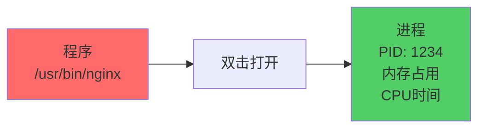
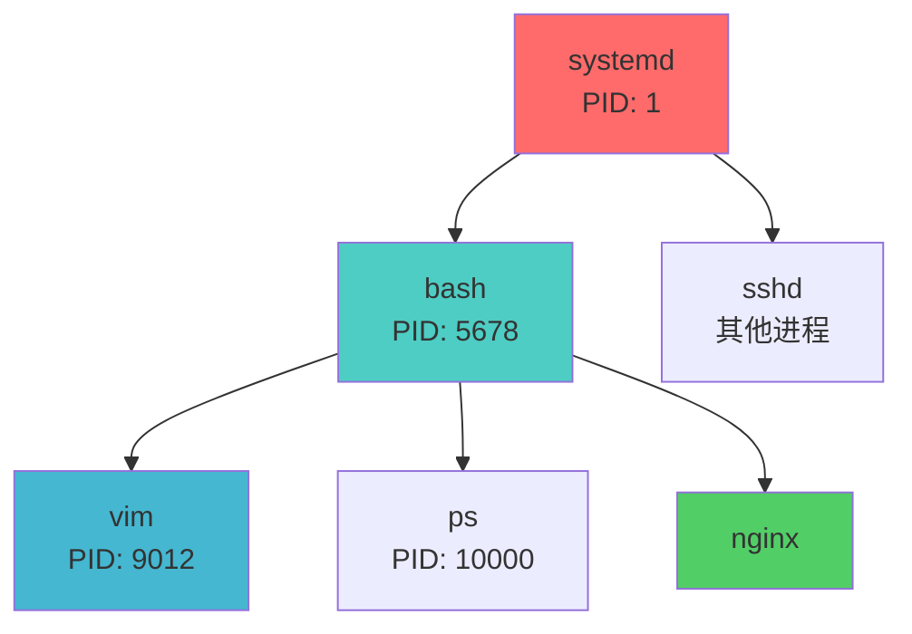
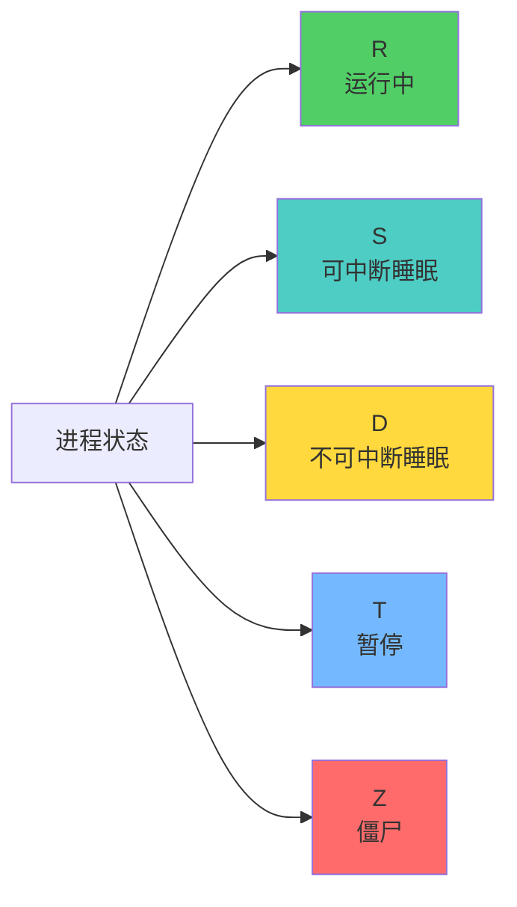
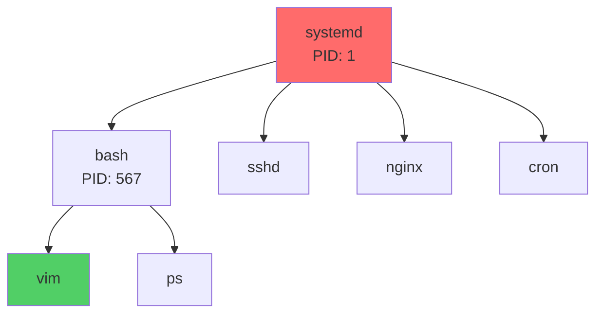

+++
title = "第25章：进程基础"
weight = 250
date = "2026-03-24T13:18:28+08:00"
type = "docs"
description = ""
isCJKLanguage = true
draft = false
+++


# 第二十五章：进程基础

想象一下，你打开一个应用程序——比如微信。程序开始运行，界面出现，你可以聊天、刷朋友圈。这个"运行中的微信"就是一个**进程**。

进程就像是一个正在工作的员工。程序是员工的**简历和工作手册**（静态的、不会动的文件），而进程是这个员工正在**实际工作**（动态的、占用CPU和内存的）。

这一章，我们就来聊聊Linux里进程的那些事儿！

---

## 25.1 什么是进程？进程与程序的区别

### 25.1.1 程序：静态文件

**程序**是存在磁盘上的一个文件，比如`/usr/bin/nginx`——它就静静地躺在那里，不占用CPU，不占用内存，就是一个普通的文件。

程序就像是你电脑里安装的**微信安装包**（.exe文件），你还没双击打开它的时候，它就只是一个文件，占用的是磁盘空间。

### 25.1.2 进程：运行中的程序

**进程**是程序被操作系统加载到内存中、正在执行的状态。进程会占用**CPU时间片**和**内存空间**。

当你双击打开微信，你就创建了一个进程。这个进程会：
- 占用一部分内存
- 占用CPU时间（虽然大部分时候在等待你的操作）
- 有自己的PID（进程ID）
- 有自己的状态（运行、等待、暂停等）



> [!NOTE]
> 一个程序可以同时运行多次，创建多个进程。比如你打开两个微信聊天窗口，就是两个进程（虽然实际上微信可能限制了同时登录）。

---

## 25.2 进程 PID：唯一标识符

**PID**（Process Identifier）是Linux内核给每个进程分配的**唯一身份证号**。

就像每个人都有唯一的身份证号一样，每个进程也有唯一的PID。PID是一个从1开始的正整数：

- PID 1：`init`或`systemd`，Linux系统启动后第一个运行的进程
- PID 2：`kthreadd`，内核线程的父进程
- 后续的进程PID依次递增

```bash
# 查看当前bash的PID
echo $$

# 输出大概是：
# 12345

# 或者用ps命令
ps -o pid,ppid,cmd | head -5

# 输出：
#   PID  PPID CMD
#     1     0 systemd
#   234     1 bash
# 12345  234 ps -o pid
```

```bash
# 查看系统的PID范围
cat /proc/sys/kernel/pid_max

# 输出：
# 4194304
# Linux支持最多约400万个PID，够用！
```

---

## 25.3 进程 PPID：父进程

**PPID**（Parent Process Identifier）是进程的**父进程ID**。

Linux里的进程都是**有家庭的**——几乎所有进程都是另一个进程"生出来"的。除了PID 1（init/systemd），没有父进程的进程只有它自己。

当你打开一个终端（bash），然后在终端里运行一个命令，这个命令进程就是bash的"孩子"。

```bash
# 查看进程的父子关系
ps -o pid,ppid,cmd

# 输出：
#   PID  PPID CMD
#  1234     1 systemd        # systemd是很多进程的祖先
#  5678  1234 bash          # bash是systemd的孩子
#  9012  5678 vim           # vim是bash的孩子
# 10000 5678 ps             # ps也是bash的孩子
```



> [!NOTE]
> 父子关系有什么用？当你关闭终端（bash）时，在bash里运行的命令进程会被**一起关掉**——这就是为什么关掉终端会让后台任务停止的原因。

---

## 25.4 进程状态

进程和人生一样，也有各种状态——有时在跑步（运行），有时在睡觉（等待），有时在发呆（暂停）。

### 25.4.1 R：运行中

**R**是Running的缩写，表示进程正在CPU上运行，或者在等待被CPU调度。

```bash
# 查看运行中的进程
ps aux | grep -E "STATE|R"

# ps输出的STAT列就是进程状态
ps -eo pid,stat,cmd

# 输出：
#   PID STAT CMD
#  1234 S    bash
#  5678 R    top        # R表示正在运行
```

### 25.4.2 S：睡眠（可中断）

**S**是Sleeping的缩写，表示进程在等待某个事件（比如等待用户输入、等待网络数据、等待文件IO等）。

"S"状态是可以被**信号唤醒**的，所以叫"可中断睡眠"。

```bash
# 很多进程大部分时间都是S状态
# 比如nginx在等待连接
ps -eo pid,stat,cmd | head -10
```

### 25.4.3 D：睡眠（不可中断）

**D**是Disk/Uninterruptible Sleep的缩写，表示进程在等待磁盘IO或者某些不能被信号中断的内核操作。

"D"状态的进程**不能被信号唤醒**，只能等IO完成。这时你只能等待或者解决IO问题。

```bash
# 如果你看到D状态的进程，不要轻易kill它
# 这通常意味着系统在等待磁盘响应
ps -eo pid,stat,cmd | grep D
```

> [!WARNING]
> 如果系统有大量D状态的进程，可能是磁盘出了毛病——要么是磁盘坏了，要么是NFS网络磁盘挂了。

### 25.4.4 T：暂停

**T**是Stopped的缩写，表示进程被**暂停**了，比如被Ctrl+Z挂起，或者被调试器暂停。

```bash
# 用Ctrl+Z可以暂停一个前台进程
# 比如在终端运行vim，然后按Ctrl+Z

# 查看暂停的进程
ps -eo pid,stat,cmd | grep T

# 输出：
#  9012 T    vim        # T表示被暂停
```

### 25.4.5 Z：僵尸

**Z**是Zombie的缩写，表示进程已经结束了，但**父进程还没有回收它的退出状态**。

进程结束后会变成僵尸，直到父进程调用`wait()`读取它的退出状态。如果父进程没有回收，僵尸进程就会一直存在。

```bash
# 查看僵尸进程
ps -eo pid,stat,cmd | grep Z

# 输出：
#  1234 Z    <defunct>    # Z就是僵尸进程
```

> [!NOTE]
> 少量的僵尸进程是无害的。但如果很多，可能是程序有bug（父进程没有正确回收子进程）。僵尸进程无法被kill——它已经死了，你不能杀死一个已经死的人。

### 📊 进程状态一览



---

## 25.5 ps 命令：查看进程

`ps`命令是Linux里最常用的进程查看工具，类似于Windows任务管理器。

### 25.5.1 ps：基本显示

```bash
# 查看当前终端的进程（只显示当前用户和当前终端的）
ps

# 输出：
#   PID TTY          TIME CMD
# 12345 pts/0    00:00:00 bash
# 23456 pts/0    00:00:00 ps
```

### 25.5.2 ps aux：详细显示

```bash
# a = 显示所有用户的进程
# u = 显示进程详细信息（内存、CPU等）
# x = 显示没有控制终端的进程

ps aux

# 输出大概是：
# USER       PID %CPU %MEM    VSZ   RSS TTY      STAT START   TIME COMMAND
# root         1  0.0  0.3  1234  5678 ?        Ss   10:00   0:05 systemd
# www-data  123  0.0  0.2   567  890 ?        S    10:01   0:00 nginx
# longx    456  0.1  0.5  1234  2345 pts/0    R+   10:05   0:00 ps aux
```

| 列 | 含义 |
|-----|------|
| USER | 进程所属用户 |
| PID | 进程ID |
| %CPU | CPU使用率 |
| %MEM | 内存使用率 |
| VSZ | 虚拟内存大小（KB） |
| RSS | 实际物理内存大小（KB） |
| TTY | 控制终端（?表示无终端） |
| STAT | 进程状态 |
| START | 启动时间 |
| TIME | 累计CPU时间 |
| COMMAND | 命令 |

### 25.5.3 ps -ef：完整格式

```bash
# -e = 显示所有进程
# -f = 显示完整格式（包含PPID等）

ps -ef

# 输出：
# UID        PID  PPID  C STIME TTY          TIME CMD
# root         1     0  0 10:00 ?        00:00:05 systemd
# root       234     1  0 10:00 ?        00:00:00 sshd
# longx     567   234  0 10:01 pts/0    00:00:00 bash
```

```bash
# 常用组合：查找特定进程
ps aux | grep nginx
ps -ef | grep redis

# 排除grep自身
ps aux | grep nginx | grep -v grep
```

---

## 25.6 pstree 进程树：查看进程关系

`pstree`以树形结构显示进程关系，一目了然地看到谁是爹谁是儿子。

```bash
# 安装pstree（如果没有）
sudo apt install psmisc

# 查看进程树
pstree

# 输出大概是：
# systemd─┬─sshd─┬─sshd───bash───pstree
#         ├─systemd───(sd-pam)
#         ├─nginx───nginx
#         └─cron
```

```bash
# 显示PID
pstree -p

# 显示用户的进程树
pstree longx

# 高亮显示某个进程
pstree -H 1234  # 高亮PID为1234的进程
```



---

## 25.7 pgrep 按名称查找进程

`pgrep`是根据进程名查找PID的工具，简单高效。

```bash
# 查找nginx进程
pgrep nginx

# 输出：
# 1234
# 5678
# 如果有多个nginx进程，会显示多个PID
```

```bash
# 显示进程名和PID
pgrep -l nginx

# 输出：
# 1234 nginx
# 5678 nginx

# 查找属于特定用户的进程
pgrep -u longx bash

# 显示PID和完整命令行
pgrep -a nginx
```

---

## 25.8 pidof 查找进程 PID

`pidof`是根据程序名查找PID的另一个工具，比pgrep更精确（只查找正在运行的进程）。

```bash
# 查找nginx的PID
pidof nginx

# 输出：
# 1234 5678
```

```bash
# 查找特定的程序
pidof sshd
pidof vim

# 如果进程不存在，返回空
pidof nonexistent_program
# （无输出）
```

```bash
# 查找init进程
pidof init
# 或者
pidof systemd
```

---

## 25.9 top 命令：实时进程监控

`top`是Linux里的"实时任务管理器"，可以动态地看到进程的资源占用情况。

### 25.9.1 top 界面说明

```bash
# 启动top
top

# 按q退出
```

top的界面分为两部分：

**第一行（系统信息）**：
```
top - 10:30:15 up 3 days, 14:22,  2 users,  load average: 0.15, 0.10, 0.05
```
- 当前时间：10:30:15
- 系统运行时间：3天14小时22分
- 当前用户数：2
- 系统负载：0.15, 0.10, 0.05（1分钟、5分钟、15分钟平均）

**第二行（进程统计）**：
```
Tasks: 125 total,   1 running, 124 sleeping,   0 stopped,   0 zombie
```
- 总进程数：125
- 运行中：1
- 睡眠中：124
- 暂停：0
- 僵尸：0

**第三行（CPU信息）**：
```
%Cpu(s):  5.2 us,  2.1 sy,  0.0 ni, 92.5 id,  0.2 wa,  0.0 hi,  0.0 si,  0.0 st
```
- us：用户空间占用CPU百分比
- sy：内核空间占用CPU百分比
- id：空闲CPU百分比
- wa：等待IO的CPU百分比

**第四行和第五行（内存）**：
```
MiB Mem :   8192.0 total,   2048.0 free,   4096.0 used,   2048.0 buff/cache
MiB Swap:   2048.0 total,   1536.0 free,    512.0 used,   2048.0 avail Mem
```
- 内存：总共8G，使用4G，空闲2G
- Swap：总共2G，使用512M

**进程列表**（默认按CPU使用率排序）：
```
  PID USER      PR  NI %CPU %MEM     TIME+ COMMAND
1234 root      20   0  5.2  0.5  10:30.15 nginx
5678 longx     20   0  1.2  0.3   0:05.23 vim
```

### 25.9.2 排序：P、M、T

在top界面里，按这些键可以排序：

```bash
# P：按CPU使用率排序（默认）
# M：按内存使用率排序
# T：按累计运行时间排序
# N：按PID排序
```

### 25.9.3 k：杀死进程

在top界面里，按`k`可以杀死进程：

```bash
# 在top界面按k后：
# 1. 输入要杀死的PID
# 2. 选择信号（默认15=SIGTERM）
# 3. 回车确认
```

> [!NOTE]
> top只是一个实时监控工具，具体操作还是用`kill`命令更方便。

---

## 25.10 htop 命令：增强版进程监控

`htop`是top的升级版，界面更友好，功能更强大。

### 25.10.1 安装：apt install htop

```bash
# 安装htop
sudo apt install htop

# 启动
htop
```

### 25.10.2 颜色区分

htop会用**颜色**区分不同类型的进程和资源使用情况：
- 绿色：普通进程
- 红色：高CPU占用
- 蓝色：低优先级进程
- 黄色：警告状态

### 25.10.3 鼠标操作

htop支持**鼠标操作**：
- 点击进程：选中进程
- F9：杀死进程
- F7/F8：降低/提高优先级
- F10：退出

```bash
# htop常用选项
htop -d 10      # 刷新间隔（10个十分之一秒）
htop -u longx   # 只显示某用户的进程
htop -p 1234    # 只显示指定PID
```

---

## 25.11 atop 命令：系统性能监控

`atop`是一个更专业的性能监控工具，特别擅长记录历史数据。

### 25.11.1 CPU、内存、磁盘

```bash
# 安装atop
sudo apt install atop

# 启动atop
atop
```

atop默认显示：
- CPU：每个核心的使用率
- 内存：物理内存和Swap使用
- 磁盘：每个磁盘的读写速度
- 网络：每个网卡流量

### 25.11.2 历史记录

atop的最大特点是**记录历史**！它会每小时保存一次系统快照，即使系统重启也能查看历史数据。

```bash
# 查看最近24小时的历史数据（atop会自动保存）
atop -r

# 按时间翻页
# 空格键：下一页
# b：跳到指定时间

# 查看具体时间的历史
atop -r -b 1430  # 跳到下午14:30的数据
atop -r -b 20260323 -a  # 查看2026年3月23日的数据
```

---

## 本章小结

本章我们学习了Linux进程的基础知识：

### 🔑 核心知识点

1. **程序 vs 进程**：
   - 程序是静态的文件（躺在磁盘上）
   - 进程是运行中的程序（占用CPU和内存）

2. **PID和PPID**：
   - PID是进程的唯一标识符
   - PPID是父进程的PID

3. **进程状态**：
   - R：运行中
   - S：可中断睡眠
   - D：不可中断睡眠（等待IO）
   - T：暂停
   - Z：僵尸

4. **进程查看命令**：
   - `ps aux`：详细进程列表
   - `ps -ef`：带父子关系的进程
   - `pstree`：进程树
   - `pgrep`：按名称查找PID
   - `top`/`htop`：实时监控

5. **监控工具**：
   - `top`：实时进程监控（简单）
   - `htop`：增强版（彩色、鼠标支持）
   - `atop`：专业级（带历史记录）

### 💡 记住这个原则

> **用`ps aux | grep xxx`查找进程，用`kill PID`杀死进程。** 这是最基本的进程操作，必须掌握。

---

**当前时间：2026年3月23日 22:05:03**
**已完成"第二十五章"，目前处理"第二十六章"**
