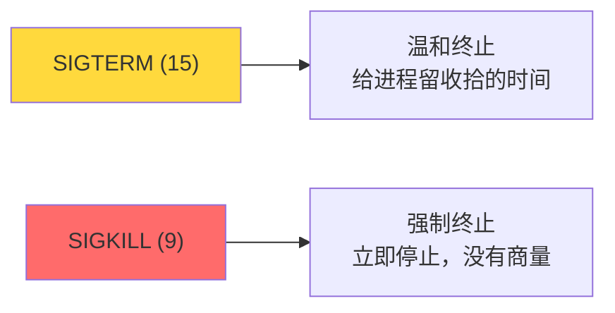
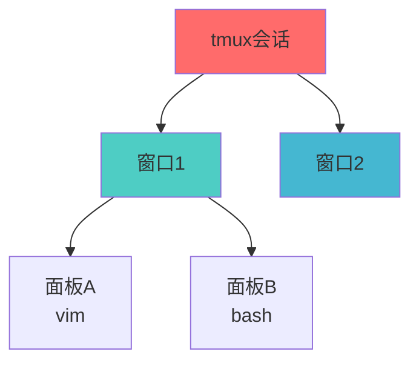

+++
title = "第26章：进程控制"
weight = 260
date = "2026-03-24T13:18:28+08:00"
type = "docs"
description = ""
isCJKLanguage = true
draft = false
+++


# 第二十六章：进程控制

上一章我们学了怎么看进程，这一章我们学怎么**管**进程。

想象一下：你开了很多程序，电脑变慢了；或者某个程序卡死了，窗口关不掉。这时候你就需要"进程控制"——杀死它、暂停它、或者把它扔到后台去。

Linux给了你一堆"魔法命令"，可以随意操控进程。这一章，让我们成为进程的"主宰者"！

---

## 26.1 进程信号

Linux里，进程之间 communicate（交流）的方式之一就是**信号（Signal）**。信号就像是操作系统给进程递的一张"小纸条"，告诉它"该做点什么了"。

### 26.1.1 SIGTERM (15)：正常终止

**SIGTERM**是"礼貌的终止"，信号编号15。

它会告诉进程："请你优雅地结束吧，把该收拾的收拾好再走。"进程收到SIGTERM后，会：
1. 停止接收新任务
2. 处理完当前任务
3. 释放内存、关闭文件
4. 体面地退出

这是**推荐的终止方式**，就像给朋友发微信说"咱们散了吧"——比较温和。

### 26.1.2 SIGKILL (9)：强制终止

**SIGKILL**是"强制终止"，信号编号9。

它会告诉进程："别废话，现在就给我滚！"进程收到SIGKILL后，**立即无条件终止**，没有任何商量的余地。

这是**最后的手段**，就像直接拔电源——数据可能来不及保存。不到万不得已不要用。

> ⚠️ **重要区别**：SIGTERM可以被进程捕获并处理（比如保存数据后退出），但SIGKILL**不能被捕获、阻塞或忽略**——这是内核强制的，进程必须立即终止。



### 26.1.3 SIGINT (2)：Ctrl+C

**SIGINT**是"中断信号"，信号编号2。

这就是你平时按`Ctrl+C`发送的信号。当你在终端运行一个程序时，按`Ctrl+C`会发送SIGINT，让前台程序终止。

这和SIGTERM类似，但通常用于**正在交互的程序**。

### 26.1.4 SIGHUP (1)：挂起

**SIGHUP**是"挂起信号"，信号编号1。

这个信号的原始含义是"终端连接断开"，但在现代Linux里，它的用途更多：
- 有些守护进程收到SIGHUP会**重新读取配置文件**
- 某些程序收到SIGHUP会**重新启动**

```bash
# 常用信号速查表
# 1   SIGHUP   挂起
# 2   SIGINT   中断（Ctrl+C）
# 9   SIGKILL  强制终止（不能被捕获）
# 15  SIGTERM  正常终止（默认kill信号）
# 18  SIGCONT  继续运行
# 19  SIGSTOP  暂停（不能被捕获）
```

> [!NOTE]
> 注意：SIGKILL和SIGSTOP是**不能被进程忽略或捕获**的——这是内核强制的，进程必须服从。

---

## 26.2 kill 命令：发送信号终止进程

`kill`命令可以给进程发送信号，最常用的就是终止信号。

### 26.2.1 kill PID

```bash
# 查找nginx的PID
pgrep nginx
# 假设输出是：1234

# 正常终止（发送SIGTERM）
kill 1234

# 等价于
kill -15 1234
kill -SIGTERM 1234
```

```bash
# 如果进程没有响应，可以多等几秒钟让它处理完
# 然后验证进程是否还在
ps -eo pid,cmd | grep nginx
```

### 26.2.2 kill -9 PID：强制终止

```bash
# 强制终止（发送SIGKILL）
kill -9 1234

# 等价于
kill -KILL 1234

# 如果正常终止杀不死，就用强制终止
kill -9 1234
```

> [!WARNING]
> `kill -9`是强制杀死，数据可能丢失！只有当进程真的无响应时才用。

```bash
# 杀死多个进程
kill 1234 5678 9012

# 杀死所有nginx进程
kill $(pgrep nginx)

# 或者用pgrep和kill组合
pgrep nginx | xargs kill
```

---

## 26.3 killall 命令：按名称终止进程

`killall`可以按进程名杀死所有匹配的进程，不用一个一个找PID。

### 26.3.1 killall nginx

```bash
# 杀死所有nginx进程
killall nginx

# 等价于
killall -15 nginx
```

```bash
# 如果用killall杀不死，用-9
killall -9 nginx
```

### 26.3.2 killall -9 nginx

```bash
# 强制杀死所有nginx进程
killall -9 nginx
```

```bash
# 杀死所有属于某用户的进程
sudo killall -u longx

# 杀死所有属于某用户的某个进程
sudo killall -u longx nginx
```

> [!NOTE]
> `killall`很方便，但也要小心——它会杀死**所有同名进程**。用之前确认你知道自己在干什么。

---

## 26.4 pkill 命令：按名称发送信号

`pkill`是`pgrep`和`kill`的结合体，可以按名称查找进程并发送信号。

```bash
# 杀死所有nginx进程
pkill nginx

# 强制杀死
pkill -9 nginx

# 杀死特定用户的进程
pkill -u longx nginx

# 杀死某终端的所有进程
pkill -t pts/0
```

```bash
# pgrep和kill的组合 vs pkill
# 两者效果一样，但pkill更简洁
pgrep nginx | xargs kill
pkill nginx    # 和上面等价，更简洁
```

---

## 26.5 nice 命令：设置进程优先级

你有没有遇到过这种情况：电脑很卡，但有个进程占用了大量CPU，其他程序都动不了了。这时候就需要**调整进程优先级**。

Linux用**nice值**来表示进程优先级，范围是**-20到19**：
- **-20**：最高优先级（别人都得让路）
- **0**：默认优先级
- **19**：最低优先级（佛系进程，CPU空闲时它才工作）

### 26.5.1 nice -n 10 命令

```bash
# 以优先级10启动一个进程
nice -n 10 long-running-script.sh

# nice -n 10 等价于 nice --adjustment=10
# 数值越大，优先级越低
```

```bash
# 以最低优先级运行，确保不会影响其他程序
nice -n 19 backup.sh

# 以更高优先级运行（需要root权限，nice值负数=更高优先级）
# -20是最高优先级，-10是较高优先级，0是默认
sudo nice -n -10 important-task.sh
```

### 26.5.2 优先级范围：-20 到 19

```bash
# nice值的含义：
# -20 到 -1：优先级最高（需要root权限才能设置）
# 0：默认优先级
# 1 到 19：优先级最低
# 注意：nice值越负，优先级越高
# 普通用户只能设置0-19（只能降低自己的优先级）

# 查看进程优先级
ps -eo pid,ni,cmd

# 输出：
#   PID  NI CMD
#     1   0 systemd
#  1234   0 nginx
#  5678  10 backup.sh     # 优先级较低
```

> [!NOTE]
> 普通用户只能设置0-19的nice值（更低优先级）。只有root能设置-20到-1的nice值（更高优先级）。

---

## 26.6 renice 命令：修改进程优先级

`renice`可以修改**已经运行中的进程**的优先级。

### 26.6.1 renice 10 PID

```bash
# 修改PID为1234的进程优先级为10
renice 10 1234

# 输出：
# 1234 (process ID) old priority 0, new priority 10
```

```bash
# 修改多个进程
renice 10 1234 5678 9012

# 按名称修改（所有nginx进程）
renice 10 $(pgrep nginx)

# 修改指定用户的进程
renice 10 -u longx

# 直接提高优先级（需要root）
sudo renice -10 1234
```

```bash
# 对比nice和renice
# nice：启动时就决定优先级
nice -n 10 ./script.sh

# renice：运行中修改优先级
./script.sh &  # 后台运行
renice 10 $(pgrep script.sh)  # 修改它的优先级
```

---

## 26.7 jobs 查看后台任务

有时候你启动了一个程序，但它需要很长时间，你又不想等，怎么办？扔到**后台**去！

### 26.7.1 jobs -l：显示 PID

```bash
# 启动一个耗时任务
sleep 100 &

# 查看后台任务
jobs

# 输出：
# [1]   Running                 sleep 100 &
# [2]-  Running                 sleep 200 &

# -l 显示PID
jobs -l

# 输出：
# [1]  12345 Running                 sleep 100 &
# [2]- 56789 Running                 sleep 200 &
```

```bash
# 任务编号旁边的+和-号：
# +：当前任务（fg默认拉起这个）
# -：下一个被拉起的任务
```

---

## 26.8 fg 将后台任务切换到前台

`fg`（foreground的缩写）可以把后台任务**拉到前台**来。

```bash
# 把最近放到后台的任务拉到前台
fg

# 如果有多个后台任务，先用jobs看看编号
jobs

# 输出：
# [1]   Running                 sleep 100 &
# [2]+  Running                 sleep 200 &

# 把编号为1的任务拉到前台
fg %1
```

```bash
# 如果只有一个后台任务，直接fg就行
sleep 100 &
fg
```

---

## 26.9 bg 将前台任务切换到后台

`bg`（background的缩写）可以把**暂停的**前台任务扔到后台继续运行。

```bash
# 启动一个任务，然后按Ctrl+Z暂停它
sleep 100
# 按Ctrl+Z

# 输出：
# [1]+  Stopped                 sleep 100

# 用bg把它扔到后台继续运行
bg

# 输出：
# [1]+ sleep 100 &

# 现在它就在后台运行了
```

---

## 26.10 & 后台运行：命令 &

在命令后面加`&`，可以直接在**后台运行**这个命令。

```bash
# 直接后台运行
./backup.sh &

# 后台运行且不占用终端
nohup ./script.sh &

# 后台运行，输出重定向到文件
./script.sh > output.log &
```

```bash
# & 的工作原理：
# 1. 把命令放到后台运行
# 2. 立即返回终端提示符
# 3. 你可以继续干其他事

# 但注意：关闭终端会导致后台任务停止
# 除非用nohup
```

---

## 26.11 nohup 后台运行：断开连接后继续运行

你有没有过这样的经历：在服务器上跑一个备份脚本，要好几个小时，你不能一直连着网。这时候就用`nohup`！

`nohup`（no hangup）可以让你**断开连接后任务继续运行**。

### 26.11.1 nohup 命令 &

```bash
# 后台运行备份脚本，断开连接后继续
nohup ./backup.sh &

# 输出：
# [1] 12345
# nohup: ignoring input and appending output to 'nohup.out'
```

### 26.11.2 输出重定向

```bash
# 默认输出会保存到nohup.out文件
# 如果你想保存到其他文件：
nohup ./script.sh > /path/to/output.log 2>&1 &

# 说明：
# > /path/to/output.log  # 标准输出重定向
# 2>&1                  # 标准错误重定向到标准输出（合并）
```

```bash
# 常用组合：后台运行 + 不受终端关闭影响 + 输出到指定文件
nohup ./backup.sh > /var/log/backup.log 2>&1 &

# 然后你可以安心关掉终端了
```

> [!NOTE]
> `nohup`只是忽略SIGHUP信号，进程还是可以被`kill`杀死的。

---

## 26.12 screen 终端会话管理：会话保持

如果说`nohup`是"断线保护"，那`screen`就是"虚拟终端"——你可以在一个screen会话里开多个窗口，而且**断开连接不会丢失会话**。

### 26.12.1 screen -S 会话名：创建

```bash
# 安装screen
sudo apt install screen

# 创建一个名为work的screen会话
screen -S work

# 进入screen后，你就像在普通终端里一样操作
# 要退出screen但不关闭会话：按 Ctrl+A 然后按 D
```

### 26.12.2 screen -ls：列出

```bash
# 列出所有screen会话
screen -ls

# 输出：
# There are screens on:
#     12345.work      (Attached)
#     56789.backup    (Detached)
# 2 Sockets in /run/screen/S-longx.
```

### 26.12.3 screen -r 会话名：恢复

```bash
# 恢复名为work的会话
screen -r work

# 如果会话已经在Attached状态，先分离再恢复
screen -d work
screen -r work

# 或者一步到位（强制分离并恢复）
screen -d -r work
```

### 26.12.4 Ctrl+A+D：分离

在screen会话里：

```bash
# 在screen里按这些快捷键：
# Ctrl+A 然后按 D：分离会话（退出会话但不关闭）
# Ctrl+A 然后按 C：在当前窗口创建新窗口
# Ctrl+A 然后按 N：切换到下一个窗口
# Ctrl+A 然后按 P：切换到上一个窗口
# Ctrl+A 然后按 K：关闭当前窗口
```

```bash
# screen内部快捷键（先按Ctrl+A）：
# d  - 分离当前会话
# c  - 创建新窗口
# n  - 下一个窗口
# p  - 上一个窗口
# k  - 关闭当前窗口
# "  - 列出所有窗口
# [ - 进入复制模式（可以滚动历史）
```

---

## 26.13 tmux 终端复用：功能强大的 screen 替代品

`tmux`是screen的现代替代品，功能更强大，界面更友好（虽然学习曲线稍微陡一点）。

### 26.13.1 tmux new -s 会话

```bash
# 安装tmux
sudo apt install tmux

# 创建一个名为work的tmux会话
tmux new -s work

# 退出但保持会话：按 Ctrl+B 然后按 D
```

### 26.13.2 Ctrl+B：前缀键

tmux的快捷键都需要**先按前缀键**，默认是`Ctrl+B`。

```bash
# tmux内部快捷键（先按Ctrl+B）：
# d  - 分离当前会话
# c  - 创建新窗口
# n  - 下一个窗口
# p  - 上一个窗口
# %  - 左右分屏
# "  - 上下分屏
# x  - 关闭当前面板
# [ - 进入复制模式（滚动历史）
```

### 26.13.3 窗口和面板操作

```bash
# 分离会话
tmux detach

# 列出所有会话
tmux ls

# 输出：
# work: 2 windows (created 2026-03-23 10:30:15)  [120x30]
# backup: 1 window (created 2026-03-23 11:00:00)  [120x30]

# 恢复会话
tmux attach -t work
tmux attach -t backup

# 或者简洁版
tmux a -t work
```



```bash
# 常用tmux操作
tmux new -s mysession    # 创建新会话
tmux ls                   # 列出所有会话
tmux a -t mysession      # 恢复会话
tmux kill-session -t mysession  # 关闭会话
```

---

## 本章小结

本章我们学习了Linux进程控制：

### 🔑 核心知识点

1. **进程信号**：
   - SIGTERM (15)：正常终止（推荐）
   - SIGKILL (9)：强制终止（最后手段）
   - SIGINT (2)：Ctrl+C
   - SIGHUP (1)：挂起/重载配置

2. **终止进程**：
   - `kill PID`：正常终止
   - `kill -9 PID`：强制终止
   - `killall nginx`：按名称杀死
   - `pkill nginx`：按名称发送信号

3. **进程优先级**：
   - nice值范围：-20（最高）到19（最低）
   - `nice -n 10 命令`：启动时设置优先级
   - `renice 10 PID`：修改运行中的进程

4. **后台任务**：
   - `命令 &`：后台运行
   - `jobs`：查看后台任务
   - `fg`：拉到前台
   - `bg`：暂停→后台

5. **会话保持**：
   - `nohup`：断线保护
   - `screen`：虚拟终端
   - `tmux`：更强大的终端复用

### 💡 记住这个原则

> **能用`kill -15`就别用`kill -9`。** 正常终止给进程留了收尾的机会，数据更安全。

---

**当前时间：2026年3月23日 22:13:03**
**已完成"第二十六章"，目前处理"第二十七章"**
