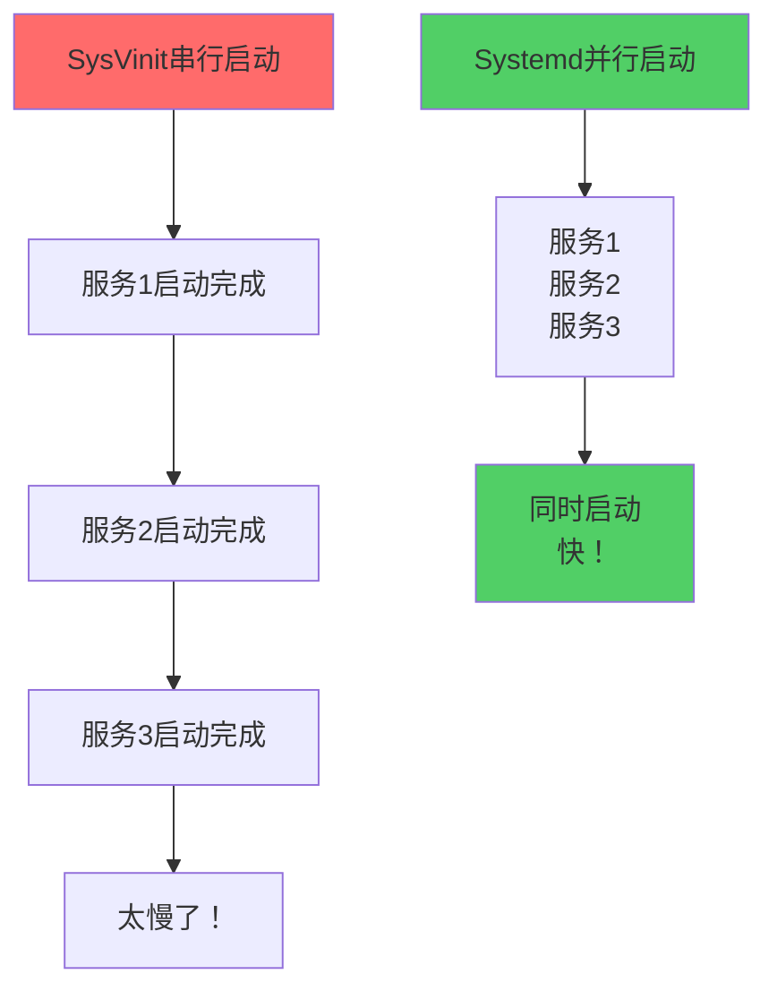

+++
title = "第27章：服务管理（Systemd）"
weight = 270
date = "2026-03-24T13:18:28+08:00"
type = "docs"
description = ""
isCJKLanguage = true
draft = false
+++


# 第二十七章：服务管理（Systemd）

你有没有想过这个问题：电脑开机的时候，那些nginx、sshd、mysql是怎么自动启动的？它们不是我们手动启动的，但系统一启动它们就在后台跑着了。

这就是**服务（Service）**——那些开机就自动启动、在后台默默运行的程序。

在现代Linux里，管理和控制这些服务的主力就是**Systemd**。这一章，让我们来认识一下这个系统老大！

---

## 27.1 什么是服务（Daemon）？后台运行的进程

**服务**（Service）也叫**守护进程（Daemon）**，是那些在**后台运行**的程序，它们不需要用户直接交互，通常是系统启动时就自动运行的。

### 27.1.1 类型：独立服务、xinetd 服务

Linux里有两种类型的服务：

**独立服务（Standalone）**：这类服务自己独立运行，比如nginx、sshd。它们一直开着，响应请求。

**xinetd服务**：这类服务不是一直开着，而是通过**超级守护进程（xinetd）**统一管理。有请求来了，xinetd才启动对应的服务。

现在xinetd已经很少用了，大多数服务都是独立服务。

### 27.1.2 常见服务：sshd、nginx、httpd

```bash
# 常见的系统服务
# sshd     - SSH服务器，让你远程登录
# nginx   - Web服务器
# httpd   - Apache服务器
# mysqld  - MySQL数据库
# postfix - 邮件服务器
# crond   - 定时任务服务
# rsyslog - 系统日志服务
```

```bash
# 查看所有正在运行的服务
systemctl list-units --type=service --state=running
```

---

## 27.2 Systemd 简介：Linux init 系统

### 27.2.1 替代 SysVinit

Linux系统启动的第一个进程是PID 1，也就是**init进程**。init是系统的"总指挥"，负责启动其他所有进程。

历史上有很多init系统：
- **SysVinit**（System V）：老前辈，地位稳固
- **Upstart**：Ubuntu曾经想用它
- **Systemd**：现在是主流，Fedora从2010年开始用，后来大多数发行版都跟进了

### 27.2.2 并行启动

Systemd最大的特点是**并行启动**——以前SysVinit是一个接一个启动服务，很慢；Systemd可以同时启动多个服务，速度飞快。

> 🚀 **性能提升**：Systemd的并行启动可以让系统启动时间从几十秒缩短到几秒！



---

## 27.3 Systemd 架构

Systemd不仅仅是个init系统，它是一个**系统管理套件**，包含了很多组件。

### 27.3.1 unit：单元

Systemd管理的每一样东西都叫**单元（Unit）**。不同类型的资源有不同的单元：

| 单元类型 | 后缀 | 说明 |
|---------|------|------|
| Service | .service | 进程服务 |
| Socket | .socket | 套接字 |
| Target | .target | 目标（一组单元） |
| Mount | .mount | 挂载点 |
| Timer | .timer | 定时任务 |

### 27.3.2 target：目标（类似 runlevel）

**Target**是Systemd里的"运行级别"概念，就像SysVinit里的runlevel。

```bash
# 常见的target
# graphical.target    - 图形界面模式（相当于runlevel 5）
# multi-user.target   - 多用户模式（相当于runlevel 3）
# rescue.target      - 救援模式（相当于runlevel 1）
# poweroff.target    - 关机
# reboot.target      - 重启
```

### 27.3.3 service：服务单元

最常用的单元类型是**.service**，就是一个可管理的服务。

```bash
# 查看默认target
systemctl get-default

# 输出：
# graphical.target
```

---

## 27.4 systemctl 命令：服务管理

`systemctl`是Systemd的核心命令，用来管理服务和系统状态。

### 27.4.1 systemctl start nginx：启动

```bash
# 启动nginx服务
sudo systemctl start nginx

# 注意：不需要写.service后缀
# systemctl start nginx 等价于 systemctl start nginx.service
```

### 27.4.2 systemctl stop nginx：停止

```bash
# 停止nginx服务
sudo systemctl stop nginx
```

### 27.4.3 systemctl restart nginx：重启

```bash
# 重启nginx（先停后开）
sudo systemctl restart nginx

# 如果服务在运行就重启，不在运行就启动
sudo systemctl try-restart nginx
```

### 27.4.4 systemctl reload nginx：重载配置

```bash
# 重载nginx配置文件（不重启服务）
sudo systemctl reload nginx

# 一般用于修改了配置文件后，让服务重新读取
# nginx -t  # 先测试配置是否正确
# systemctl reload nginx  # 然后重载
```

> [!NOTE]
> `reload`和`restart`的区别：`reload`是让服务重新读取配置文件，不中断服务；`restart`是重启服务，会短暂中断。

### 27.4.5 systemctl status nginx：查看状态

```bash
# 查看nginx服务状态
sudo systemctl status nginx

# 输出：
# ● nginx.service - A high performance web server
#      Loaded: loaded (/lib/systemd/system/nginx.service; enabled)
>      Active: active (running) since Mon 2026-03-23 10:00:00 CST; 2h 30min ago
>    Main PID: 1234 (nginx)
>       CGroup: /system.slice/nginx.service
>               └─1234 nginx: master process /usr/sbin/nginx -g daemon on;...
```

| 状态 | 含义 |
|------|------|
| enabled | 开机自启 |
| disabled | 开机不启动 |
| active (running) | 运行中 |
| active (exited) | 运行成功（一次性任务） |
| inactive (dead) | 未运行 |
| failed | 运行失败 |

### 27.4.6 systemctl enable nginx：开机自启

```bash
# 设置nginx开机自启
sudo systemctl enable nginx

# 输出：
# Created symlink /etc/systemd/system/multi-user.target.wants/nginx.service ...
```

### 27.4.7 systemctl disable nginx：关闭自启

```bash
# 关闭nginx开机自启
sudo systemctl disable nginx

# 输出：
# Removed symlink /etc/systemd/system/multi-user.target.wants/nginx.service.
```

### 27.4.8 systemctl is-enabled nginx：检查是否自启

```bash
# 检查服务是否开机自启
systemctl is-enabled nginx

# 输出：
# enabled
# 或者
# disabled
```

### 27.4.9 systemctl list-units：查看所有单元

```bash
# 列出所有service单元
systemctl list-units --type=service

# 只看运行中的
systemctl list-units --type=service --state=running

# 列出所有单元（包括失败的）
systemctl list-units --type=service --state=failed
```

### 27.4.10 systemctl list-unit-files：查看所有单元文件

```bash
# 列出所有服务单元文件
systemctl list-unit-files --type=service

# 输出格式：UNIT FILE STATE
# nginx.service enabled
# sshd.service enabled
# cron.service enabled
```

### 27.4.11 systemctl daemon-reload：重新加载配置

```bash
# 当你修改了.service文件后，需要重新加载Systemd配置
sudo systemctl daemon-reload

# 这不会重启任何服务，只是让Systemd重新读取配置文件
```

---

## 27.5 服务单元文件：.service 文件结构

### 27.5.1 [Unit] 段

```bash
# 查看nginx的service文件
cat /lib/systemd/system/nginx.service
```

```ini
[Unit]
Description=A high performance web server    # 服务描述
After=network.target                    # 在网络准备好之后启动
```

| 配置项 | 含义 |
|--------|------|
| Description | 服务描述 |
| After | 在指定服务之后启动 |
| Before | 在指定服务之前启动 |
| Requires | 依赖的服务（强依赖） |
| Wants | 依赖的服务（弱依赖） |

### 27.5.2 [Service] 段

```ini
[Service]
Type=forking                           # 启动类型
PIDFile=/run/nginx.pid                  # PID文件位置
ExecStartPre=/usr/sbin/nginx -t         # 启动前执行的命令
ExecStart=/usr/sbin/nginx               # 启动命令
ExecReload=/bin/kill -HUP $MAINPID     # 重载命令
ExecStop=/bin/kill -QUIT $MAINPID      # 停止命令
PrivateTmp=true                         # 使用私有临时目录
```

| 配置项 | 含义 |
|--------|------|
| Type | 启动类型（simple/forking/oneshot） |
| ExecStart | 启动命令 |
| ExecStop | 停止命令 |
| ExecReload | 重载命令 |
| PIDFile | PID文件位置 |
| Restart | 自动重启（no/always/on-failure/on-abnormal） |

### 27.5.3 [Install] 段

```ini
[Install]
WantedBy=multi-user.target            # 属于哪个target
```

```bash
# WantedBy的意思是：这个服务被哪个target"想要"
# 当你enable nginx时，Systemd会创建符号链接：
# /etc/systemd/system/multi-user.target.wants/nginx.service -> /lib/systemd/system/nginx.service
```

---

## 27.6 journalctl 日志：systemd 日志查看

Systemd有一个统一的日志系统，叫**journal**，日志存在`/var/log/journal/`里。

### 27.6.1 journalctl -u nginx：查看指定服务日志

```bash
# 查看nginx服务的日志
sudo journalctl -u nginx

# 最近20行
sudo journalctl -u nginx -n 20

# 倒过来看（最新的在前面）
sudo journalctl -u nginx -r

# 输出：
# Mar 23 10:00:00 server nginx[1234]: Using 8 worker processes
# Mar 23 10:00:01 server nginx[1234]: Listening on 0.0.0.0:80
```

### 27.6.2 journalctl -f：实时日志

```bash
# 实时跟踪日志（类似tail -f）
sudo journalctl -f

# 只看nginx的实时日志
sudo journalctl -u nginx -f
```

### 27.6.3 journalctl --since：按时间查看

```bash
# 查看今天早上9点以后的日志
sudo journalctl --since "2026-03-23 09:00:00"

# 查看昨天到现在所有的日志
sudo journalctl --since yesterday

# 查看最近1小时的日志
sudo journalctl --since "1 hour ago"

# 时间格式很灵活
sudo journalctl --since "2 days ago"
```

### 27.6.4 journalctl -b：启动日志

```bash
# 查看系统本次启动以来的日志
sudo journalctl -b

# 查看上次启动的日志
sudo journalctl -b -1

# 查看指定次数之前的启动日志
sudo journalctl -b -2
```

---

## 27.7 传统 init.d：SysVinit 脚本

虽然Systemd是主流，但很多老系统还在用**SysVinit**。

### 27.7.1 /etc/init.d/ 服务脚本

```bash
# SysVinit的服务脚本存在这里
ls /etc/init.d/

# 输出：
# functions  networking  nginx  redis  ssh
```

```bash
# 启动服务（SysVinit方式）
sudo /etc/init.d/nginx start

# 停止服务
sudo /etc/init.d/nginx stop

# 重启服务
sudo /etc/init.d/nginx restart
```

### 27.7.2 service 命令

```bash
# service命令是SysVinit的统一入口
sudo service nginx start

# 查看所有服务的状态
service --status-all

# 输出：
# [ - ]  apache2
# [ + ]  nginx
# [ ? ]  unrecognized
```

> [!NOTE]
> 在Systemd系统里，`service`命令实际上是在调用`systemctl`。但`/etc/init.d/`脚本在Systemd系统里仍然可用，Systemd会自动处理它们。

---

## 27.8 rc.local 开机启动：/etc/rc.local

有些系统还有**rc.local**文件，可以用来放开机执行的命令。

```bash
# 查看rc.local是否存在
cat /etc/rc.local

# 输出大概是：
#!/bin/bash
# This script will be executed at the end of the multi-user runlevel.
exit 0
```

```bash
# 如果rc.local不存在，创建它
sudo touch /etc/rc.local
sudo chmod +x /etc/rc.local

# 编辑rc.local，添加开机执行的命令
sudo bash -c 'cat >> /etc/rc.local << EOF
# 开机执行以下命令
echo "Hello, World!" >> /var/log/startup.log
EOF'
```

> [!NOTE]
> 在Systemd系统里，rc.local需要被显式启用。创建一个service文件来触发它：
> ```bash
> sudo systemctl enable rc-local
> ```

---

## 本章小结

本章我们学习了Linux服务管理（Systemd）：

### 🔑 核心知识点

1. **什么是服务**：
   - 后台运行的守护进程（Daemon）
   - 开机自启动
   - 不需要用户直接交互

2. **Systemd架构**：
   - Unit（单元）：Systemd管理的每一样东西
   - Target（目标）：类似于runlevel
   - Service（服务）：最常用的单元类型

3. **systemctl常用命令**：
   - `systemctl start/stop 服务`：启动/停止
   - `systemctl restart/reload 服务`：重启/重载
   - `systemctl status 服务`：查看状态
   - `systemctl enable/disable 服务`：开机自启/关闭
   - `systemctl is-enabled 服务`：检查是否自启

4. **日志管理**：
   - `journalctl -u 服务`：查看服务日志
   - `journalctl -f`：实时跟踪
   - `journalctl -b`：本次启动日志

5. **传统init.d**：
   - `/etc/init.d/`：SysVinit脚本目录
   - `service 命令`：统一入口

### 💡 记住这个原则

> **管理服务用`systemctl`，查看日志用`journalctl`。** 这是Systemd时代的标准操作。

---

**当前时间：2026年3月23日 22:21:03**
**已完成"第二十七章"，目前处理"第二十八章"**
