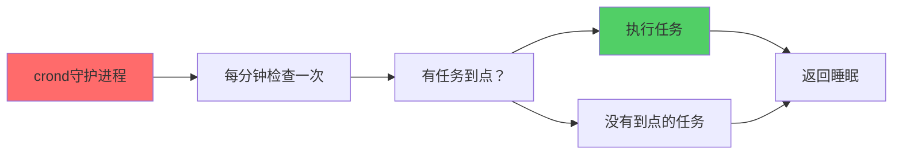
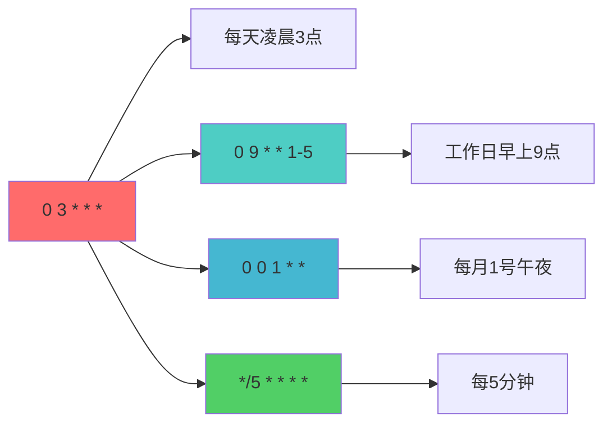

+++
title = "第28章：定时任务"
weight = 280
date = "2026-03-24T13:18:28+08:00"
type = "docs"
description = ""
isCJKLanguage = true
draft = false
+++


# 第二十八章：定时任务

你有没有过这种需求：
- 每天凌晨3点自动备份数据库
- 每周一早上9点发送周报
- 每个月1号清理一次过期文件

这些**定时自动执行的任务**，在Linux里叫**定时任务（Cron Job）**。

这一章，让我们学会给Linux安排"日程表"！

---

## 28.1 什么是定时任务？自动执行的任务

**定时任务**就是"到点就自动执行的任务"，不需要你手动触发。

想象一下：
- 你雇了一个保姆，每天早上8点自动给你做早餐——这就是**定时任务**
- 你设置了一个闹钟，每天早上7点响——这也是一种**定时任务**

在Linux里，最常用的定时任务工具是**cron**，它会在指定的时间自动运行你安排好的命令。

---

## 28.2 cron 定时任务：系统自带定时任务

### 28.2.1 cron 服务

**cron**是一个**守护进程**（服务），它一直在后台运行，每分钟检查一次是否有任务要执行。

```bash
# 检查cron服务状态
systemctl status cron

# 或者
systemctl status crond

# 输出大概是：
# ● cron.service - Regular background program processing daemon
#    Loaded: loaded (/lib/systemd/system/cron.service; enabled)
#    Active: active (running) since Mon 2026-03-23 10:00:00 CST; 2h 30min ago
```

### 28.2.2 crond 守护进程

cron的守护进程叫**crond**，它会：
1. 每分钟被唤醒一次
2. 检查任务调度表（crontab）
3. 执行到点的任务
4. 继续睡眠



---

## 28.3 crontab 命令：用户定时任务

### 28.3.1 crontab -e：编辑

```bash
# 编辑当前用户的crontab
crontab -e

# 第一次运行会让你选择编辑器
# 推荐选择nano（简单）或vim（功能强大）
# 选择后，以后都会用这个编辑器打开crontab

# 如果没有crontab，先安装
sudo apt install cron    # Debian/Ubuntu
sudo yum install cronie  # RHEL/CentOS
```

执行后会打开编辑器，每一行是一个定时任务，格式是：

```
分 时 日 月 周 命令
```

### 28.3.2 crontab -l：查看

```bash
# 查看当前用户的crontab
crontab -l

# 输出大概是：
# # m h dom mon dow command
# 0 3 * * * /usr/bin/backup.sh
# 30 9 * * 1 /usr/bin/send-report.sh
```

```bash
# 查看其他用户的crontab（需要root）
sudo crontab -u longx -l
```

### 28.3.3 crontab -r：删除

```bash
# 删除当前用户的所有crontab任务
crontab -r

# 会提示确认
# crontab: really delete longx's crontab? (y/n)
```

```bash
# 不提示直接删除
crontab -r -f
```

### 28.3.4 crontab -u 用户：指定用户

```bash
# 编辑指定用户的crontab（需要root）
sudo crontab -u longx -e

# 查看指定用户的crontab
sudo crontab -u longx -l
```

---

## 28.4 cron 表达式

cron表达式就是定时任务的"时间表"，告诉cron什么时候执行任务。

### 28.4.1 * * * * *：分 时 日 月 周

```bash
# cron表达式格式：
# ┌───────────── 分钟 (0-59)
# │ ┌───────────── 小时 (0-23)
# │ │ ┌───────────── 日 (1-31)
# │ │ │ ┌───────────── 月 (1-12)
# │ │ │ │ ┌───────────── 星期 (0-7, 0和7都是周日)
# │ │ │ │ │
# * * * * * command
```

| 字段 | 范围 | 特殊字符 |
|------|------|----------|
| 分钟 | 0-59 | * , - / |
| 小时 | 0-23 | * , - / |
| 日 | 1-31 | * , - / |
| 月 | 1-12 | * , - / |
| 周 | 0-7 | * , - / |

**特殊字符**：
- `*`（星号）：代表"每一"（每分钟、每小时、每天等）
- `,`（逗号）：列表，如`1,3,5`表示1点、3点、5点
- `-`（减号）：范围，如`1-5`表示1点到5点
- `/`（斜杠）：间隔，如`*/5`表示每5个单位

### 28.4.2 0 * * * *：每小时

```bash
# 每小时的第0分钟执行（比如1:00、2:00、3:00...）
0 * * * * /usr/bin/backup-hourly.sh
```

### 28.4.3 0 0 * * *：每天

```bash
# 每天午夜0点执行（也就是"每天"）
0 0 * * * /usr/bin/daily-backup.sh

# 每天早上8点执行
0 8 * * * /usr/bin/morning-task.sh
```

### 28.4.4 0 0 * * 0：每周

```bash
# 每周日（周日是0或7）午夜执行
0 0 * * 0 /usr/bin/weekly-cleanup.sh

# 每周一早上9点执行
0 9 * * 1 /usr/bin/send-weekly-report.sh

# 工作日每天执行
0 9 * * 1-5 /usr/bin/workday-task.sh
```

### 28.4.5 0 0 1 * *：每月

```bash
# 每月1号午夜执行
0 0 1 * * /usr/bin/monthly-report.sh

# 每月15号下午3点执行
0 15 15 * * /usr/bin/mid-month-task.sh

# 每季度第一天执行
0 0 1 1,4,7,10 * /usr/bin/quarterly-task.sh
```

### 📊 cron表达式速查表



| 表达式 | 含义 |
|--------|------|
| `* * * * *` | 每分钟 |
| `0 * * * *` | 每小时 |
| `0 0 * * *` | 每天午夜 |
| `0 9 * * 1-5` | 工作日早上9点 |
| `0 0 * * 0` | 每周日 |
| `0 0 1 * *` | 每月1号 |
| `*/15 * * * *` | 每15分钟 |
| `0 */2 * * *` | 每2小时 |
| `30 4 1,15 * *` | 每月1号和15号凌晨4:30 |

---

## 28.5 系统定时任务：/etc/cron.d/

除了用户crontab，Linux还有**系统级**的定时任务目录。

```bash
# 查看系统cron.d目录
ls -la /etc/cron.d/

# 输出：
# total 16
# drwxr-xr-x  2 root root 4096 Mar 23 10:00 .
# drwxr-xr-x 10 root root 4096 Mar 23 10:00 ..
# -rw-r--r-- 1 root root  220 Mar 23 10:00 anacron
# -rw-r--r--  1 root root  395 Mar 23 10:00 sysstat
```

```bash
# 系统cron.d文件的格式和用户crontab稍有不同
# 多了一个用户名字段
cat /etc/cron.d/sysstat

# 输出：
# # Run system activity accounting tool every 10 minutes
# */10 * * * * root cd /usr/lib/sa && /usr/lib/sa/sa1 1 1
```

---

## 28.6 系统定时目录

Linux预定义了几个**定时目录**，方便你放置脚本。

### 28.6.1 /etc/cron.daily/：每天

```bash
# 每天凌晨会自动执行这个目录里的脚本
# 通常是凌晨3点到6点之间随机执行
ls /etc/cron.daily/

# 输出：
# apt-compat  man-db  systemd-logrotate
# 如果你想让自己的脚本每天执行，放到这！
```

```bash
# 创建一个每天执行的脚本
sudo bash -c 'cat > /etc/cron.daily/my-daily-task.sh << EOF
#!/bin/bash
# 每天早上7点执行的任务
echo "每天早上好！" >> /var/log/daily.log
EOF'

sudo chmod +x /etc/cron.daily/my-daily-task.sh
```

### 28.6.2 /etc/cron.hourly/：每小时

```bash
# 每小时执行这个目录里的脚本
ls /etc/cron.hourly/
```

### 28.6.3 /etc/cron.weekly/：每周

```bash
# 每周执行这个目录里的脚本
ls /etc/cron.weekly/
```

### 28.6.4 /etc/cron.monthly/：每月

```bash
# 每月执行这个目录里的脚本
ls /etc/cron.monthly/
```

> [!NOTE]
> 这些目录里的脚本需要是**可执行的**（chmod +x），并且要有shebang（`#!/bin/bash`）。

---

## 28.7 at 命令：延时执行一次任务

**at**是用来执行**一次性任务**的，和cron的"重复执行"不同。

### 28.7.1 at 时间：安排任务

```bash
# 安装at（如果没有）
sudo apt install at

# 启动at服务
sudo systemctl enable --now atd

# 安排一个任务，3分钟后执行
at now + 3 minutes

# 进入at交互界面
# at> echo "Hello from at!" >> /tmp/at-test.log
# at> 按Ctrl+D保存
```

```bash
# at支持的时间格式很灵活
at 14:30           # 今天下午2:30
at 14:30 today      # 今天下午2:30
at 14:30 tomorrow   # 明天上午2:30
at noon             # 中午12:00
at midnight          # 午夜
at now + 1 hour     # 1小时后
at now + 3 days     # 3天后的这个时间
at 3pm + 2 days     # 2天后下午3点
```

### 28.7.2 at -l：查看

```bash
# 查看待执行的at任务
at -l

# 输出：
# 1   Mon Mar 23 15:30:00 2026 a longx
# 2   Tue Mar 24 10:00:00 2026 a longx
```

### 28.7.3 atrm 编号：删除

```bash
# 删除编号为1的at任务
atrm 1

# 查看确认
at -l
```

---

## 28.8 anacron 非实时定时

**anacron**是用来执行**非实时定时任务**的工具。

cron的问题是：如果电脑在任务该执行的时候关机了，cron不会补上这个任务。**anacron**就是来解决这个问题的。

```bash
# anacron的特点：
# 1. 如果任务该执行时电脑关机了，开机后会补上
# 2. 不要求精确的时间，只保证"每天/每周/每月至少执行一次"

# 查看anacron配置
cat /etc/anacrontab

# 输出：
# # /etc/anacrontab: configuration file for anacron
# SHELL=/bin/sh
# PATH=/usr/local/sbin:/usr/local/bin:/sbin:/bin:/usr/sbin:/usr/bin
# 1       5       cron.daily       run-parts /etc/cron.daily
# 7       10      cron.weekly      run-parts /etc/cron.weekly
# @monthly 15      cron.monthly    run-parts /etc/cron.monthly
```

| 字段 | 含义 |
|------|------|
| 周期 | 多少天执行一次 |
| 延迟 | 开机后延迟多少分钟执行 |
| 任务标识 | 任务的名字 |
| 命令 | 要执行的命令 |

---

## 28.9 systemd timer：systemd 定时任务

除了cron，Systemd也有自己的定时任务功能——**systemd timer**。

### 28.9.1 .timer 单元

timer单元和service单元是配对使用的：

```bash
# 创建一个定时任务：每5分钟执行一次
# 1. 创建.service文件
sudo bash -c 'cat > /etc/systemd/system/my-timer-task.service << EOF
[Unit]
Description=My Timer Task Service

[Service]
Type=oneshot
ExecStart=/usr/local/bin/my-task.sh
EOF'
```

### 28.9.2 .service 单元

```bash
# 2. 创建.timer文件
sudo bash -c 'cat > /etc/systemd/system/my-timer.timer << EOF
[Unit]
Description=My Timer Timer
Requires=my-timer-task.service

[Timer]
OnBootSec=5min        # 启动5分钟后第一次执行
OnUnitActiveSec=5min   # 之后每5分钟执行一次
Unit=my-timer-task.service

[Install]
WantedBy=timers.target
EOF'
```

```bash
# 3. 启用定时器
sudo systemctl daemon-reload
sudo systemctl enable --now my-timer.timer

# 4. 查看定时器状态
systemctl list-timers

# 输出：
# NEXT                        LEFT     LAST                        PASSED  UNIT
# Mon 2026-03-23 15:05:00  4min 55s Mon 2026-03-23 15:00:00  4s     my-timer.timer
```

```bash
# 常用timer选项
[Timer]
OnBootSec=5min        # 开机5分钟后执行
OnUnitActiveSec=1hour  # 每小时执行一次
OnCalendar=*:0/5       # 每5分钟（和cron的 */5 一样）
OnCalendar=daily        # 每天
OnCalendar=weekly       # 每周
```

---

## 本章小结

本章我们学习了Linux定时任务：

### 🔑 核心知识点

1. **cron定时任务**：
   - crond是守护进程，每分钟检查一次
   - `crontab -e`编辑任务
   - `crontab -l`查看任务

2. **cron表达式**：
   - 格式：`分 时 日 月 周 命令`
   - `*`每一，`,`列表，`-`范围，`/`间隔

3. **系统定时目录**：
   - `/etc/cron.daily/`：每天
   - `/etc/cron.hourly/`：每小时
   - `/etc/cron.weekly/`：每周
   - `/etc/cron.monthly/`：每月

4. **一次性任务**：
   - `at`命令安排一次性的延时任务
   - `at -l`查看
   - `atrm`删除

5. **Systemd定时器**：
   - `.timer`单元配`.service`单元
   - 比cron更现代，功能更强大

### 💡 记住这个原则

> **重复任务用cron，一次任务用at。** cron负责日常自动化，at负责临时延时任务。

---

**当前时间：2026年3月23日 22:29:03**
**已完成"第二十八章"！🎉**
