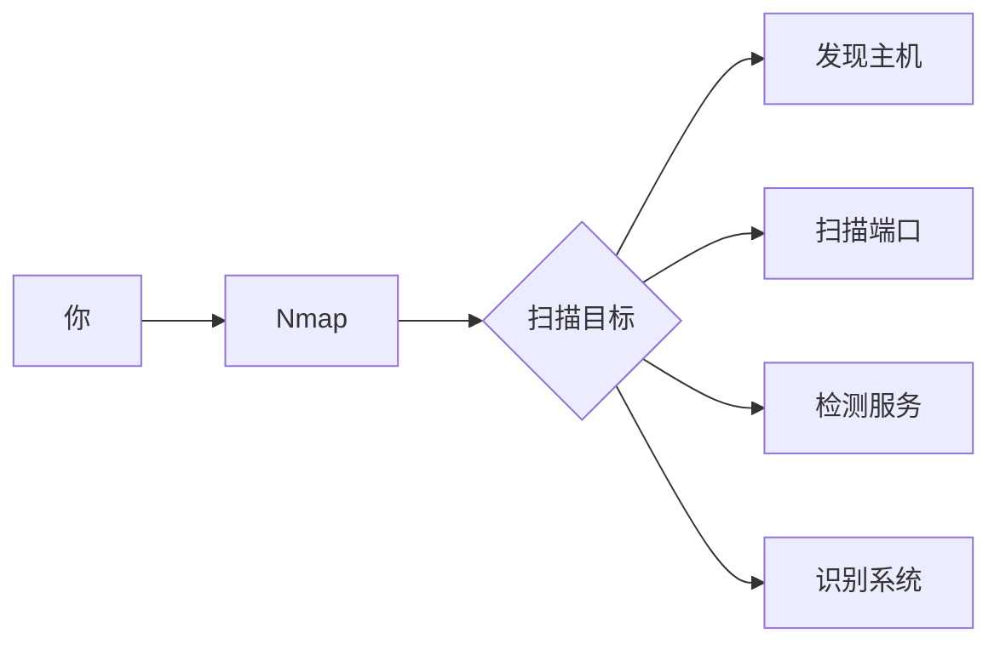
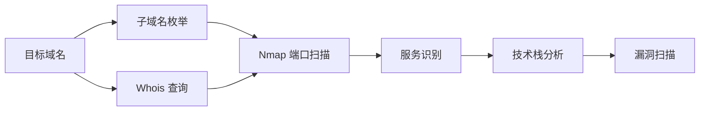

+++
title = "第71章：信息收集"
weight = 710
date = "2026-03-24T13:18:28+08:00"
type = "docs"
description = ""
isCJKLanguage = true
draft = false
+++


# 第七十一章：信息收集

## 71.1 Nmap 端口扫描

### 什么是 Nmap？

Nmap（Network Mapper）是网络扫描的"瑞士军刀"，渗透测试的第一步就是用它来摸清目标的网络情况。



> ⚠️ **免责声明**：
> 本章内容仅用于合法的安全测试和授权渗透测试。未经授权扫描他人系统是违法行为！

### Nmap 基本扫描

```bash
# 安装 Nmap
# Ubuntu/Debian
sudo apt install nmap

# CentOS/RHEL
sudo yum install nmap

# macOS
brew install nmap

# 基本语法
nmap [扫描类型] [选项] <目标>

# 扫描单个主机
nmap 192.168.1.1

# 扫描多个主机
nmap 192.168.1.1 192.168.1.2 192.168.1.3

# 扫描整个网段
nmap 192.168.1.0/24

# 扫描 IP 范围
nmap 192.168.1.1-100
```

### 端口扫描类型

| 类型 | 选项 | 说明 |
|------|------|------|
| TCP SYN | `-sS` | 隐蔽扫描，需要 root |
| TCP Connect | `-sT` | 完整连接，不需要 root |
| UDP | `-sU` | UDP 端口扫描 |
| ACK | `-sA` | 防火墙检测 |
| Window | `-sW` | 窗口扫描 |

```bash
# TCP SYN 扫描（半开放扫描，快且隐蔽）
sudo nmap -sS 192.168.1.1

# TCP Connect 扫描（不需要 root）
nmap -sT 192.168.1.1

# UDP 扫描（较慢）
sudo nmap -sU 192.168.1.1

# 扫描常见端口
nmap -F 192.168.1.1

# 扫描所有端口（65535个）
nmap -p- 192.168.1.1

# 指定端口扫描
nmap -p 22,80,443,3306,6379 192.168.1.1

# 端口范围
nmap -p 1-1000 192.168.1.1
```

### 操作系统检测

```bash
# 启用操作系统检测
sudo nmap -O 192.168.1.1

# 操作系统 + 服务版本检测
sudo nmap -A 192.168.1.1

# 激进扫描（包含 OS 检测、版本检测、脚本扫描、路由追踪）
sudo nmap -A -T4 192.168.1.1
```

### 服务版本检测

```bash
# 检测服务版本
nmap -sV 192.168.1.1

# 版本检测强度（1-5）
nmap -sV --version-intensity 5 192.168.1.1

# 轻量级版本检测
nmap -sV --version-intensity 0 192.168.1.1
```

### Nmap 输出格式

```bash
# 默认输出（人类可读）
nmap 192.168.1.1

# 输出到文件
nmap -oN scan.txt 192.168.1.1           # 正常格式
nmap -oX scan.xml 192.168.1.1           # XML 格式
nmap -oG scan.gnmap 192.1681.1          # Grepable 格式
nmap -oA scan 192.168.1.1                # 所有格式

# 详细输出
nmap -v 192.168.1.1

# 调试输出
nmap -dd 192.168.1.1
```

### Nmap 脚本

```bash
# 使用默认脚本
nmap -sC 192.168.1.1

# 使用特定脚本
nmap --script vuln 192.168.1.1           # 漏洞检测
nmap --script discovery 192.168.1.1       # 发现服务
nmap --script default 192.168.1.1         # 默认脚本

# 查看可用脚本
ls /usr/share/nmap/scripts/

# 搜索脚本
ls /usr/share/nmap/scripts/ | grep -i mysql
```

### 常用扫描示例

```bash
# 快速扫描（仅发现主机，不扫描端口）
nmap -sn 192.168.1.0/24

# 发现 + 路由追踪
nmap -sn --traceroute 192.168.1.1

# 全面扫描（-A = -O -sV -sC --traceroute）
sudo nmap -A -T4 192.168.1.1

# 绕过防火墙
nmap -f -sS 192.168.1.1                   # 报文分段
nmap --mtu 8 192.168.1.1                  # 设置 MTU
nmap --badsum 192.168.1.1                 # 伪造校验和
```

## 71.2 目录扫描

目录扫描是 Web 渗透的重要环节，找出隐藏的管理后台、备份文件、敏感信息。

### Dirbuster

```bash
# 安装
sudo apt install dirbuster

# 启动（GUI）
dirbuster

# 或者命令行使用
# Dirbuster 需要 GUI，这里不推荐
```

### gobuster

```bash
# 安装
sudo apt install gobuster

# 常用命令
# 目录扫描
gobuster dir \
    -u http://target.com \
    -w /usr/share/wordlists/dirb/common.txt \
    -o output.txt

# 指定扩展名
gobuster dir \
    -u http://target.com \
    -w /usr/share/wordlists/dirb/common.txt \
    -x php,html,asp,txt \
    -o output.txt

# 线程数
gobuster dir \
    -u http://target.com \
    -w /usr/share/wordlists/dirb/common.txt \
    -t 50

# 显示 403 等状态码
gobuster dir \
    -u http://target.com \
    -w /usr/share/wordlists/dirb/common.txt \
    -b 200,204,301,307,401,403
```

### ffuf

```bash
# 安装
go install github.com/ffuf/ffuf@latest

# 目录扫描
ffuf -w /usr/share/wordlists/dirb/common.txt \
    -u http://target.com/FUZZ

# 指定扩展名
ffuf -w /usr/share/wordlists/dirb/common.txt \
    -u http://target.com/FUZZ \
    -e .php,.html,.txt

# 并发和延迟
ffuf -w wordlist.txt \
    -u http://target.com/FUZZ \
    -t 50 -p "0.5"

# 过滤结果
ffuf -w wordlist.txt \
    -u http://target.com/FUZZ \
    -fc 400,404
```

### 字典选择

| 字典 | 路径 | 用途 |
|------|------|------|
| dirb common.txt | /usr/share/dirb/wordlists/ | 通用目录 |
| dirbuster directories | /usr/share/wordlists/dirbuster/ | 较大字典 |
| rockyou.txt | /usr/share/wordlists/rockyou.txt | 密码 |
| fuzz directories | /usr/share/wordlists/dirb/ | Web 目录 |

```bash
# 常用字典
ls /usr/share/dirb/wordlists/
ls /usr/share/wordlists/

# Kali Linux 额外字典
ls /usr/share/wordlists/
```

## 71.3 子域名枚举

### sublist3r

```bash
# 安装
git clone https://github.com/aboul3la/Sublist3r.git
cd Sublist3r
pip install -r requirements.txt

# 基本使用
python sublist3r.py -d example.com

# 显示详细输出
python sublist3r.py -d example.com -v

# 导出结果
python sublist3r.py -d example.com -o subdomains.txt

# 使用所有搜索引擎
python sublist3r.py -d example.com -b
```

### assetfinder

```bash
# 安装
go install github.com/tomnomnom/assetfinder@latest

# 基本使用
assetfinder example.com

# 只找子域名
assetfinder --subs-only example.com

# 配合其他工具
assetfinder example.com | httprobe
```

### amass

```bash
# 安装
sudo apt install amass

# 子域名枚举
amass enum -d example.com

# 被动收集
amass enum -passive -d example.com

# 主动扫描
amass enum -active -d example.com

# 输出结果
amass enum -o subdomains.txt -d example.com
```

### 子域名收集脚本

```bash
#!/bin/bash
# 子域名枚举脚本

TARGET=$1
OUTPUT="subdomains_$TARGET.txt"

echo "开始收集 $TARGET 的子域名..."

# assetfinder
echo "[*] assetfinder..."
assetfinder --subs-only $TARGET >> $OUTPUT

# subfinder
if command -v subfinder &> /dev/null; then
    echo "[*] subfinder..."
    subfinder -d $TARGET >> $OUTPUT
fi

# amass
if command -v amass &> /dev/null; then
    echo "[*] amass..."
    amass enum -passive -d $TARGET >> $OUTPUT
fi

# 排序去重
sort -u $OUTPUT -o $OUTPUT

echo "完成！共发现 $(wc -l < $OUTPUT) 个子域名"
echo "结果保存在: $OUTPUT"
```

## 71.4 Web 信息收集

### WhatWeb 技术识别

```bash
# 安装
sudo apt install whatweb

# 基本使用
whatweb http://target.com

# 激进模式
whatweb -a 3 http://target.com

# 批量扫描
whatweb -i targets.txt --log-xml=report.xml

# 查看支持的技术
whatweb --list | grep -i wordpress
```

### Wappalyzer 技术栈分析

```bash
# Web 界面
# https://www.wappalyzer.com/

# CLI 工具
npm install -g wapalyzer

# 使用
wapalyzer https://target.com

# Chrome/Firefox 扩展
# 在浏览器应用商店搜索 "Wappalyzer"
```

### Shodan 搜索

```bash
# 安装
pip install shodan

# 初始化
shodan init YOUR_API_KEY

# 基本搜索
shodan search nginx                                 # 搜索 nginx 服务器
shodan search 'port:22 country:CN'                # 中国的 SSH 服务器
shodan search 'http.title:admin'                  # 后台管理系统
shodan search 'product:"MySQL" country:CN'         # 中国的 MySQL

# 查看详情
shodan host 192.168.1.1

# 查看我的 IP
shodan myip
```

### Censys 搜索

```bash
# 安装
pip install censys

# 配置
export CENSYS_API_ID=your_api_id
export CENSYS_API_SECRET=your_api_secret

# 基本搜索
censys search "example.com"

# 查看主机
censys view 192.168.1.1
```

### Whois 查询

```bash
# whois 查询
whois example.com

# 查看注册信息
whois 192.168.1.1

# API 查询（替代方案）
curl http://ip-api.com/json/example.com
```

### DNS 信息收集

```bash
# DNS 记录查询
dig example.com A
dig example.com MX
dig example.com TXT
dig example.com NS

# 批量查询
for record in A MX NS TXT; do
    echo "[$record]"
    dig $record example.com +short
done

# DNS 区域传输（如果配置不当）
dig axfr example.com @ns1.example.com

# 子域名收集
dnsenum example.com
```

## 本章小结

本章我们学习了渗透测试的信息收集阶段：

| 工具 | 用途 |
|------|------|
| Nmap | 端口扫描、服务检测、系统识别 |
| gobuster/ffuf | Web 目录扫描 |
| sublist3r/assetfinder | 子域名枚举 |
| WhatWeb/Wappalyzer | 技术栈识别 |
| Shodan/Censys | 搜索引擎 |
| dig/whois | DNS/注册信息 |

信息收集流程：



---

> ⚠️ **温馨提示**：
> 本章内容仅供学习和授权测试使用。未经授权的渗透测试是违法行为，请遵守法律法规！

---

**第七十一章：信息收集 — 完结！** 🎉

下一章我们将学习"漏洞扫描"，掌握 OpenVAS、Nessus、SQLMap 等工具。敬请期待！ 🚀
