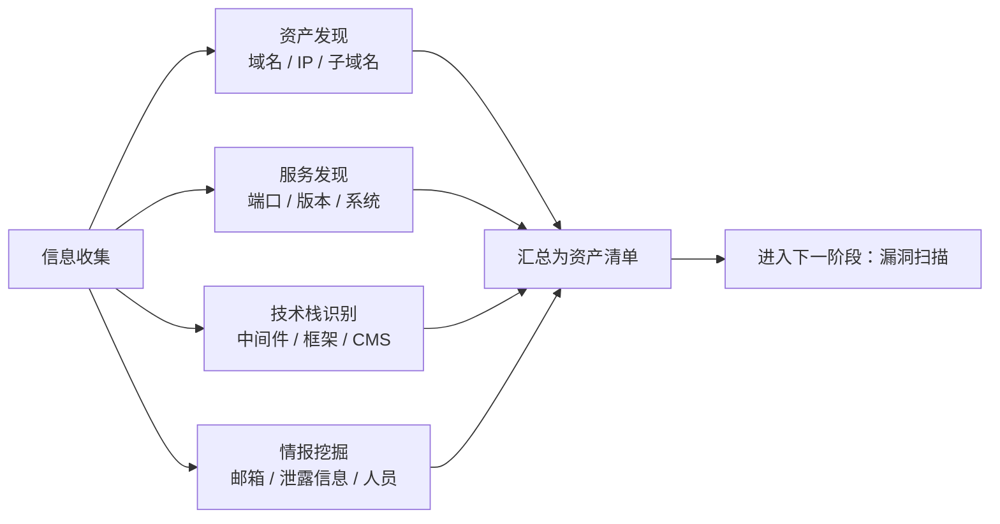
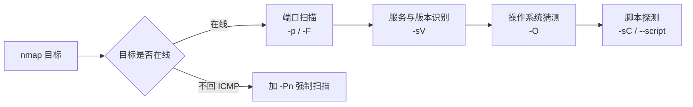

+++
title = "第71章：信息收集"
weight = 710
date = "2026-03-24T13:18:28+08:00"
type = "docs"
description = ""
isCJKLanguage = true
draft = false
+++


# 第七十一章：信息收集

> ⚠️ **免责声明**
>
> 本章及后续安全测试章节的全部内容，都**仅用于对自己的系统、或已获得书面授权的系统**做安全测试。
> 未经授权扫描、探测他人系统，在绝大多数国家和地区都属于违法行为，也可能违反服务商的服务条款。
> 动手前请先确认授权范围：允许测哪些域名和 IP、允许做哪些动作、允许在什么时间段进行。

## 71.0 先理解信息收集在做什么

信息收集（Reconnaissance）是安全测试的第一步，目标是在惊动目标的前提下，尽量画出目标的完整轮廓：
有哪些域名和 IP、开放了哪些端口、跑着什么服务、用了什么技术栈、有没有暴露敏感信息。
这一步越扎实，后面找薄弱点就越有方向；反之，信息收集敷衍了事，常常会漏掉最容易突破的那一面。


```mermaid
graph LR
    A[信息收集] --> B[资产发现<br/>域名 / IP / 子域名]
    A --> C[服务发现<br/>端口 / 版本 / 系统]
    A --> D[技术栈识别<br/>中间件 / 框架 / CMS]
    A --> E[情报挖掘<br/>邮箱 / 泄露信息 / 人员]
    B --> F[汇总为资产清单]
    C --> F
    D --> F
    E --> F
    F --> G[进入下一阶段：漏洞扫描]
```

按"是否直接接触目标"可分为两类，基本原则是**先被动、后主动**：

| 类型 | 说明 | 举例 |
|------|------|------|
| 被动收集 | 不直接接触目标，从公开渠道获取信息 | whois、证书透明度日志、搜索引擎、Shodan |
| 主动收集 | 直接向目标发包探测 | Nmap 扫描、目录爆破、DNS 暴力枚举 |

## 71.1 Nmap 端口扫描

### 什么是 Nmap？

Nmap（Network Mapper）是网络扫描的"瑞士军刀"，用它可以摸清目标主机是否在线、开放了哪些端口、跑着什么服务和版本、大致是什么操作系统。


```mermaid
graph LR
    A[nmap 目标] --> B{目标是否在线}
    B -->|在线| C[端口扫描<br/>-p / -F]
    B -->|不回 ICMP| D[加 -Pn 强制扫描]
    C --> E[服务与版本识别<br/>-sV]
    E --> F[操作系统猜测<br/>-O]
    F --> G[脚本探测<br/>-sC / --script]
```

### Nmap 基本扫描

```bash
# 安装 Nmap
# Ubuntu/Debian
sudo apt install nmap

# CentOS/RHEL
sudo yum install nmap

# macOS
brew install nmap

# 基本语法
nmap [扫描类型] [选项] <目标>

# 扫描单个主机
nmap 192.168.1.1

# 扫描多个主机
nmap 192.168.1.1 192.168.1.2 192.168.1.3

# 扫描整个网段
nmap 192.168.1.0/24

# 扫描 IP 范围
nmap 192.168.1.1-100
```

### 端口扫描类型

| 类型 | 选项 | 说明 |
|------|------|------|
| TCP SYN（半开放） | `-sS` | 默认扫描方式，速度快；需要 root |
| TCP Connect | `-sT` | 完成整个三次握手，不需要 root，但会被目标应用日志记录 |
| UDP | `-sU` | 扫 UDP 端口，慢，且"没有回应"不等于端口关闭 |
| ACK | `-sA` | 判断防火墙是有状态还是无状态，**不能**用来发现开放端口 |
| FIN/NULL/XMAS | `-sF` `-sN` `-sX` | 绕过部分无状态防火墙，对 Windows 基本无效 |
| Idle（空闲扫描） | `-sI <僵尸主机>` | 极隐蔽，需要另有一台空闲主机做跳板 |

```bash
# TCP SYN 扫描（半开放扫描，快且隐蔽）
sudo nmap -sS 192.168.1.1

# TCP Connect 扫描（不需要 root）
nmap -sT 192.168.1.1

# UDP 扫描（较慢，通常只扫最常见的若干端口）
sudo nmap -sU --top-ports 50 192.168.1.1

# 只扫最常见的 100 个端口（-F 等价于 --top-ports 100）
nmap -F 192.168.1.1

# 扫描全部 65535 个端口（耗时长，建议配合 -T4）
nmap -p- 192.168.1.1

# 指定端口扫描
nmap -p 22,80,443,3306,6379 192.168.1.1

# 端口范围
nmap -p 1-1000 192.168.1.1

# 目标禁 ping 时（云主机、防护设备丢弃 ICMP）必须加 -Pn，
# 否则 nmap 会把仍然存活的主机判定为 down 而直接跳过
nmap -Pn -p 80,443 192.168.1.1

# 只显示开放的端口，输出更清爽
nmap --open 192.168.1.1
```

> **"隐蔽"要打个问号**：`-sS` 只是不完成 TCP 连接，并不等于不会被发现。
> 现代 IDS/防火墙对半开放扫描很敏感，真正决定会不会被识破的是**扫描速率**（`-T` 参数）和扫描频率。

### 操作系统检测

```bash
# 启用操作系统检测
sudo nmap -O 192.168.1.1

# -A 是"激进扫描"开关，等价于 -O -sV -sC --traceroute
sudo nmap -A 192.168.1.1

# 再叠加 -T4 提速（T0 最慢最隐蔽，T4 较快，T5 最快但容易丢包/触发告警）
sudo nmap -A -T4 192.168.1.1
```

> **提示**：`-O` 只是根据 TCP/IP 协议栈指纹做**猜测**，结果不一定准确；
> 加了 `-A` 后还会同时打开 OS 检测、版本检测、默认脚本和路由追踪，噪声大、耗时长，
> 一般只在明确授权的目标上使用。只想快速摸清服务时，`-sV -sC` 的性价比更高。

### 服务版本检测

```bash
# 检测服务版本
nmap -sV 192.168.1.1

# 版本检测强度（1-5）
nmap -sV --version-intensity 5 192.168.1.1

# 轻量级版本检测
nmap -sV --version-intensity 0 192.168.1.1
```

### Nmap 输出格式

```bash
# 默认输出（人类可读）
nmap 192.168.1.1

# 输出到文件
nmap -oN scan.txt 192.168.1.1            # 正常（Normal）格式，人类可读
nmap -oX scan.xml 192.168.1.1            # XML 格式，便于程序解析
nmap -oG scan.gnmap 192.168.1.1          # Grepable 格式，一台主机一行，便于 grep/awk
nmap -oA scan 192.168.1.1                # 一次性生成上面三种：scan.nmap / scan.xml / scan.gnmap

# 详细输出
nmap -v 192.168.1.1

# 更详细的调试输出（-d 可叠加，-dd 更啰嗦）
nmap -dd 192.168.1.1
```

> **习惯建议**：渗透测试里推荐直接用 `-oA` 保存全部三种格式，
> 后面写报告、做统计、或把结果导入 Metasploit（`db_import`）时都不用重新扫一遍。

### Nmap 脚本

```bash
# 使用默认脚本（-sC 等价于 --script=default）
nmap -sC 192.168.1.1

# 使用特定脚本
nmap --script vuln 192.168.1.1            # 一批漏洞探测脚本，噪声大、耗时长
nmap --script discovery 192.168.1.1       # 服务/主机发现类脚本
nmap --script default 192.168.1.1         # 默认脚本集

# 查看某个脚本的说明与可传参数
nmap --script-help http-title

# 查看本机安装的全部脚本
ls /usr/share/nmap/scripts/

# 按关键字搜索脚本
ls /usr/share/nmap/scripts/ | grep -i mysql

# 脚本可以传参，例如指定 http-title 抓取 /admin 页面
nmap -p 80 --script http-title --script-args http-title.url=/admin 192.168.1.1
```

> **注意**：`--script vuln` 只是把一批"疑似漏洞"的探测跑一遍，
> 即便输出 `VULNERABLE`，也仍然需要人工复核才能写进报告，别当成最终结论。

### 常用扫描示例

```bash
# 主机发现（只 ping 探活，不扫端口）
nmap -sn 192.168.1.0/24

# 主机发现 + 路由追踪（看到达目标经过哪些跳点）
nmap -sn --traceroute 192.168.1.1

# 综合扫描（-A = -O -sV -sC --traceroute）
sudo nmap -A -T4 192.168.1.1

# 绕过简单防护的几种思路
nmap -f -sS 192.168.1.1                   # 把报文分片（fragment）
nmap --mtu 8 192.168.1.1                  # 自定义分片大小，必须是 8 的倍数
nmap --badsum 192.168.1.1                 # 故意用错误校验和，靠是否有回应判断存在何种防火墙
nmap -D RND:10 -sS 192.168.1.1            # 用 10 个随机诱饵 IP 掩护真实来源
nmap --data-length 25 -sS 192.168.1.1     # 追加随机数据，改变报文长度特征
```

> **提醒**：`--mtu` 必须是 **8 的倍数**（如 8、16、24），否则 nmap 会直接报错退出。
> 这些绕过手段只对配置粗糙的防护有效，遇到成熟的企业级防火墙/IDS 基本无效，别当成"万能免杀"。

## 71.2 目录扫描

目录扫描是 Web 渗透的重要环节，找出隐藏的管理后台、备份文件、敏感信息。

### DirBuster 与它的替代者

OWASP DirBuster 是早期的图形化目录爆破工具，**已多年无人维护**，新版 Kali 中不再提供该软件包。
现在更常用下面几个命令行工具：

| 工具 | 特点 |
|------|------|
| `feroxbuster` | Rust 编写，速度快、默认递归扫描，开箱即用 |
| `dirsearch` | Python 编写，参数直观、输出美观 |
| `gobuster` | Go 编写，轻量快速，本节下方有专门介绍 |

```bash
# feroxbuster（推荐）
sudo apt install feroxbuster
feroxbuster -u http://target.com \
    -w /usr/share/seclists/Discovery/Web-Content/raft-medium-directories.txt

# dirsearch
sudo apt install dirsearch
dirsearch -u http://target.com -e php,html,txt
```

### gobuster

```bash
# 安装
sudo apt install gobuster

# 常用命令
# 目录扫描
gobuster dir \
    -u http://target.com \
    -w /usr/share/seclists/Discovery/Web-Content/common.txt \
    -o output.txt

# 额外尝试常见扩展名（对每个词再拼上这些后缀）
gobuster dir \
    -u http://target.com \
    -w /usr/share/seclists/Discovery/Web-Content/common.txt \
    -x php,html,asp,txt \
    -o output.txt

# 并发线程数（默认 10，调太高容易被 WAF 拦截，也可能压垮小站）
gobuster dir \
    -u http://target.com \
    -w /usr/share/seclists/Discovery/Web-Content/common.txt \
    -t 30

# 只显示指定状态码（-s 是"白名单"；默认显示 200,204,301,302,307,401,403）
gobuster dir \
    -u http://target.com \
    -w /usr/share/seclists/Discovery/Web-Content/common.txt \
    -s 200,301,403

# 自签名 HTTPS 站点要加 -k 跳过证书校验
gobuster dir -k -u https://target.com \
    -w /usr/share/seclists/Discovery/Web-Content/common.txt
```

> **`-s` 和 `-b` 别弄反**：`-s`（status-codes）是"只看这些状态码"，
> `-b`（status-codes-blacklist）是"排除这些状态码"。
> 如果写成 `-b 200,301,403`，等于把最该关注的结果全过滤掉，只会得到一片空白。

### ffuf

```bash
# 安装（二选一）
sudo apt install ffuf                        # Kali / Debian 仓库
go install github.com/ffuf/ffuf/v2@latest    # 用 Go 安装，注意 v2 必须带 /v2

# 目录扫描（FUZZ 是占位符，可以放在路径、参数、请求头等任意位置）
ffuf -w /usr/share/seclists/Discovery/Web-Content/common.txt \
    -u http://target.com/FUZZ

# 自动追加扩展名
ffuf -w /usr/share/seclists/Discovery/Web-Content/common.txt \
    -u http://target.com/FUZZ \
    -e .php,.html,.txt

# 并发数（-t）与请求间隔延迟（-p，单位秒，可写 0.1-1.0 这样的随机区间）
ffuf -w wordlist.txt -u http://target.com/FUZZ -t 50 -p 0.1

# 过滤结果：-fc 按状态码过滤，-fs 按响应长度过滤，-fw 按单词数过滤
ffuf -w wordlist.txt -u http://target.com/FUZZ -fc 400,404

# 开启递归扫描并限制深度（默认不递归）
ffuf -recursion -recursion-depth 2 -w wordlist.txt -u http://target.com/FUZZ
```

> **实用技巧**：先随便请求一个肯定不存在的路径，记下它的状态码和响应长度，
> 再用 `-fc` / `-fs` 把这种"统一 404 页面"过滤掉，能大幅减少误报。
> 很多网站对不存在的路径也返回 200，只看状态码会满屏假结果。

### 字典选择

| 字典 | 典型路径 | 用途 |
|------|----------|------|
| dirb common.txt | /usr/share/dirb/wordlists/common.txt | 通用目录，条目少、速度快 |
| dirbuster directory-list-2.3-medium | /usr/share/wordlists/dirbuster/ | 中等规模目录字典 |
| SecLists Web-Content | /usr/share/seclists/Discovery/Web-Content/ | 最常用的目录/文件字典集合 |
| rockyou.txt | /usr/share/wordlists/rockyou.txt | **密码**字典，不是目录字典 |

```bash
# 看看本机有哪些字典
ls /usr/share/wordlists/
ls /usr/share/seclists/Discovery/Web-Content/ | head

# 没有 SecLists 就先装（Kali 自带，其他发行版需手动安装）
sudo apt install seclists
```

## 71.3 子域名枚举

### subfinder（推荐）

`subfinder` 用 Go 编写、维护活跃，通过大量被动数据源收集子域名，是目前最常用的选择之一。

```bash
# 安装
go install -v github.com/projectdiscovery/subfinder/v2/cmd/subfinder@latest
# 或者直接下发行版：apt install subfinder（Kali）

# 基本使用
subfinder -d example.com

# 只输出子域名，便于管道交给下一步
subfinder -d example.com -silent

# 把结果写入文件
subfinder -d example.com -o subdomains.txt
```

### sublist3r

Sublist3r 是基于搜索引擎的被动子域名收集脚本，**目前已基本停止维护**，遇到问题时可能无法使用；
了解即可，实际工作建议优先用 subfinder。

```bash
# 安装
git clone https://github.com/aboul3la/Sublist3r.git
cd Sublist3r
python3 -m pip install -r requirements.txt

# 基本使用
python3 sublist3r.py -d example.com

# 显示详细输出
python3 sublist3r.py -d example.com -v

# 导出结果
python3 sublist3r.py -d example.com -o subdomains.txt

# 开启暴力枚举模块（会用字典去爆破子域名，更慢但有时能挖到更多）
python3 sublist3r.py -d example.com -b
```

> **注意**：`-b` 是"暴力枚举（bruteforce）"，不是"使用所有搜索引擎"。
> 搜索引擎类数据源默认就会全部查询，不需要额外开关。

### assetfinder

```bash
# 安装
go install github.com/tomnomnom/assetfinder@latest

# 基本使用
assetfinder example.com

# 只找子域名
assetfinder --subs-only example.com

# 配合其他工具
assetfinder example.com | httprobe
```

### amass

```bash
# 安装
sudo apt install amass

# 子域名枚举（默认会综合被动数据源 + 少量主动探测）
amass enum -d example.com

# 只做被动收集（不向目标直接发包，最隐蔽）
amass enum -passive -d example.com

# 主动探测（会对目标域名做 DNS 解析/证书抓取等动作，噪声更大）
amass enum -active -d example.com

# 输出结果到文件（-o 写在 -d 前面或后面都可以）
amass enum -d example.com -o subdomains.txt
```

> **工具对比**：追求速度和稳定用 `subfinder`，需要更深入的结果合并与大字典爆破时用 `amass`。
> `amass enum` 有时会跑很久，可以用 `-timeout` 限制单轮时长。

### 子域名收集脚本

```bash
#!/bin/bash
# 子域名枚举脚本

TARGET=$1
OUTPUT="subdomains_$TARGET.txt"

echo "开始收集 $TARGET 的子域名..."

# assetfinder
echo "[*] assetfinder..."
assetfinder --subs-only "$TARGET" >> "$OUTPUT"

# subfinder
if command -v subfinder > /dev/null 2>&1; then
    echo "[*] subfinder..."
    subfinder -d "$TARGET" -silent >> "$OUTPUT"
fi

# amass
if command -v amass > /dev/null 2>&1; then
    echo "[*] amass..."
    amass enum -passive -d "$TARGET" >> "$OUTPUT"
fi

# 排序去重
sort -u "$OUTPUT" -o "$OUTPUT"

echo "完成！共发现 $(wc -l < "$OUTPUT") 个子域名"
echo "结果保存在: $OUTPUT"
```

> **小提示**：脚本里 `if command -v xxx > /dev/null 2>&1` 用来判断工具是否已安装，
> 比直接调用更友好——缺少某个工具时脚本会跳过它继续跑，而不是整段报错中断。

## 71.4 Web 信息收集

### WhatWeb 技术识别

```bash
# 安装
sudo apt install whatweb

# 基本使用
whatweb http://target.com

# 扫描强度 -a 1~4，数值越大探测越激进（也越容易被 WAF 盯上）
whatweb -a 3 http://target.com

# 批量扫描（-i 从文件读取目标列表），同时把结果写成 JSON/XML
whatweb -i targets.txt --log-json=report.json

# 查看支持的技术
whatweb --list | grep -i wordpress
```

> **说明**：WhatWeb 靠"指纹"识别技术栈（`Server` 响应头、Cookie 名、页面特征串等），
> 结果可能出现**误报或漏报**，务必结合页面细节人工确认，不要直接当作结论。

### Wappalyzer 技术栈分析

```bash
# 方式一：浏览器扩展（最直观）
# 在 Chrome/Firefox 扩展商店搜索 "Wappalyzer" 安装，打开目标网站点一下图标即可

# 方式二：命令行。Wappalyzer 本身已转为商业产品，
# 命令行版本由社区维护，包名是 wappalyzer-cli（不是 wapalyzer）
npm install -g wappalyzer-cli
wappalyzer https://target.com

# 方式三（更推荐）：webanalyze，复用 Wappalyzer 的指纹规则，Go 编写，可批量扫描
go install github.com/rverton/webanalyze/cmd/webanalyze@latest
webanalyze -update                       # 先更新指纹库
webanalyze -host https://target.com -crawl 2
```

### Shodan 搜索

```bash
# 安装
pip install shodan

# 初始化
shodan init YOUR_API_KEY

# 基本搜索（免费账号只能看到结果的第一页）
shodan search nginx                                 # 搜索 nginx 服务器
shodan search 'port:22 country:CN'                  # 中国的 SSH 开放主机
shodan search 'http.title:admin'                    # 标题带 admin 的后台
shodan search 'product:"MySQL" country:CN'          # 中国的 MySQL
shodan count 'port:3389'                            # 只统计数量，不消耗查询额度

# 查看某台主机的详情（必须是公网 IP，填内网地址查不到任何东西）
shodan host 8.8.8.8

# 查询本机出口 IP 及其暴露情况
shodan myip
```

> **重要提醒**：Shodan 只能看到**公网**资产。`shodan host 192.168.1.1` 这类内网地址永远返回空结果，
> 想了解内网资产要靠 Nmap 等主动扫描工具。另外免费 API Key 的搜索结果有限，很多条目要付费才能看全。

### Censys 搜索

```bash
# 安装
pip install censys

# 配置（新版 Censys 平台用 Personal Access Token）
export CENSYS_API_ID=your_api_id
export CENSYS_API_SECRET=your_api_secret

# 搜索 host 索引（语法为 censys search <索引> "<查询>"）
censys search hosts 'example.com'

# 查看某个 IP / 主机的详情
censys view 8.8.8.8
```

> **提醒**：Censys 的免费账号额度较小，接口和认证方式也改过几次，
> 使用前请以官方文档为准；同样只覆盖公网资产。

### Whois 查询

```bash
# whois 查询
whois example.com

# 查看 IP 的归属网段与注册信息（必须是公网 IP）
whois 8.8.8.8

# 免费的地理位置/ASN 查询接口（ip-api 免费版只提供 HTTP，加 https 需要付费）
curl 'http://ip-api.com/json/8.8.8.8'
```

> **whois 里值得关注的字段**：`Registrar`（注册商）、`Creation Date`（注册时间，
> 刚注册不久的域名要提高警惕）、`Expiration Date`、`Name Server`、
> 以及注册人邮箱和电话是否在隐私保护之外被公开。

### DNS 信息收集

```bash
# DNS 记录查询（记录类型可以显式指定）
dig example.com A
dig example.com MX
dig example.com TXT
dig example.com NS

# 更简洁的输出，只保留结果
dig example.com A +short

# 指定 DNS 服务器查询（用来对比不同解析结果、判断是否有 CDN/智能解析）
dig @8.8.8.8 example.com A

# 从根域名开始逐级追踪解析过程，DNS 排查问题时的利器
dig example.com +trace

# 批量查询
for record in A MX NS TXT; do
    echo "[$record]"
    dig $record example.com +short
done

# DNS 区域传输（AXFR）：配置不当的 DNS 服务器会把全部记录一次性吐出来
# 但绝大多数服务器都已禁止，能成功的概率很低，试一下即可，别指望它
dig axfr example.com @ns1.example.com

# 子域名收集
dnsenum example.com
```

### 证书透明度日志（crt.sh）

这是一条很多人忽略、却极其有效的子域名收集途径：任何机构为域名签发 HTTPS 证书时，
签发记录都会被写进**公开的证书透明度（Certificate Transparency）日志**，
而证书里通常会带上用到该证书的所有子域名。

```bash
# 查询某个域名出现过哪些子域名（返回 JSON）
curl -s 'https://crt.sh/?q=%25.example.com&output=json' | \
    jq -r '.[].name_value' | sed 's/\*\.//g' | sort -u

# 如果是通配符证书（*.example.com），要额外留意它可能覆盖大量子域名
```

> **要点**：CT 日志是**被动**数据，查询过程完全不接触目标服务器，不会留下扫描痕迹，
> 因此通常把它放在信息收集的最前面。查询结果里的子域名建议再用 `dig` 逐个验证是否仍然存活。

## 本章小结

本章我们学习了渗透测试的信息收集阶段：

| 工具 | 用途 |
|------|------|
| Nmap | 端口扫描、服务版本检测、系统识别 |
| gobuster / ffuf / feroxbuster | Web 目录与文件扫描 |
| subfinder / amass / assetfinder | 子域名枚举 |
| crt.sh（CT 日志） | 从证书签发记录被动挖子域名 |
| WhatWeb / webanalyze | 技术栈识别 |
| Shodan / Censys | 公网资产搜索引擎 |
| dig / whois | DNS 记录与域名注册信息 |

按"是否直接接触目标"可以把这些手段分成两类，理解这一点有助于控制暴露程度：

| 类型 | 典型手段 | 特点 |
|------|----------|------|
| 被动收集 | whois、CT 日志、Shodan/Censys、搜索引擎 | 不向目标发包，几乎无痕，应优先做 |
| 主动收集 | Nmap 扫描、目录爆破、DNS 暴力枚举 | 会与目标建立连接，可能触发告警和封禁 |

信息收集的整体流程：


```mermaid
graph LR
    A[目标域名] --> B[被动收集<br/>whois / CT 日志 / 搜索引擎]
    B --> C[子域名枚举]
    C --> D[探活与端口扫描<br/>Nmap]
    D --> E[服务与版本识别]
    E --> F[技术栈分析<br/>WhatWeb]
    F --> G[目录与文件扫描]
    G --> H[漏洞扫描]
```

几点实践经验：

1. **顺序很重要**：先做被动收集，把能免费拿到的信息拿全，再考虑主动扫描。
2. **控制节奏**：主动扫描时并发和速率不要开太大，既为隐蔽，也为不给目标造成影响。
3. **随时记录**：目标、时间、执行的命令、结果都要留痕，写报告时能省下大量时间。
4. **守住授权边界**：只扫授权范围内的资产，一旦发现目标解析到第三方（如 CDN、云厂商）要立即确认是否在授权范围内。

---

> ⚠️ **温馨提示**：
> 本章内容仅供学习和授权测试使用。未经授权的渗透测试是违法行为，请遵守法律法规！

---

**第七十一章：信息收集 — 完结！** 🎉

下一章我们将学习"漏洞扫描"，掌握 OpenVAS、Nessus、SQLMap 等工具。敬请期待！ 🚀
