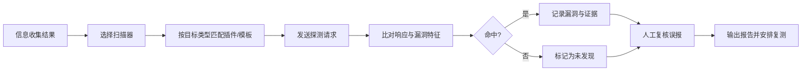
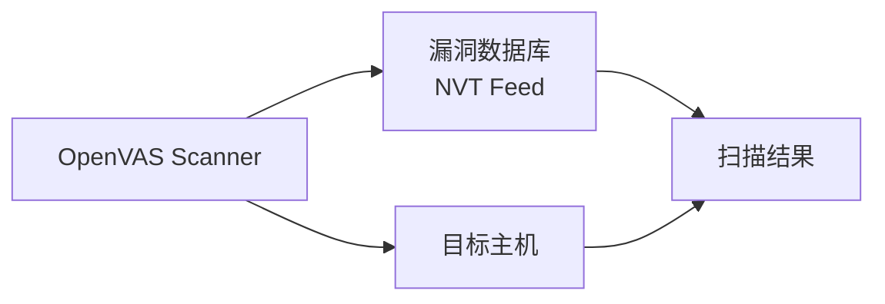
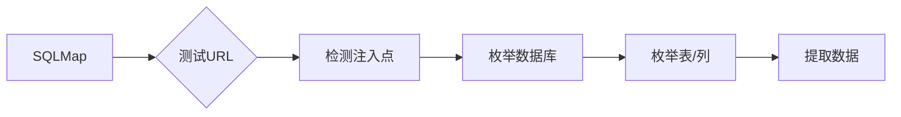
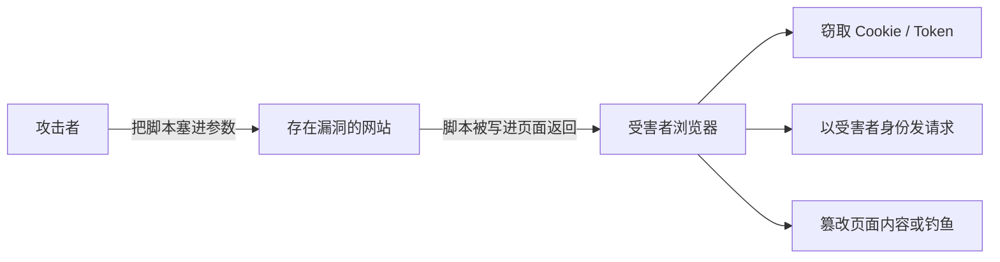
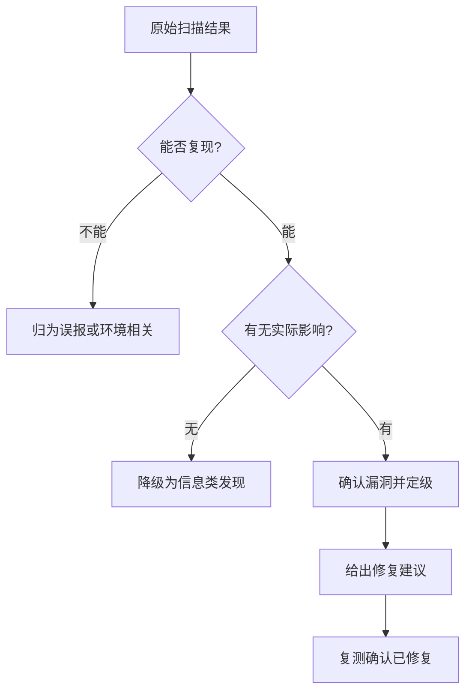
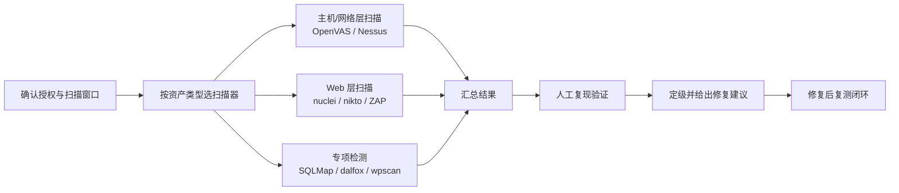

+++
title = "第72章：漏洞扫描"
weight = 720
date = "2026-03-24T13:18:28+08:00"
type = "docs"
description = ""
isCJKLanguage = true
draft = false
+++


# 第七十二章：漏洞扫描

> ⚠️ **使用提示**
>
> 本章工具只应用于**已获得授权的安全测试**和**对自己系统的加固排查**。
> 对未授权系统进行漏洞扫描，可能被认定为攻击行为，需要承担法律责任。

---

## 72.0 漏洞扫描的定位与风险

漏洞扫描是架在"信息收集"和"渗透测试"之间的一环：前面知道目标开了哪些端口、跑了什么服务，
这一步就是拿漏洞库去挨个比对，看这些服务有没有已知的、可以被利用的缺陷。


```mermaid
graph LR
    A[信息收集结果] --> B[选择扫描器]
    B --> C[按目标类型匹配插件/模板]
    C --> D[发送探测请求]
    D --> E[比对响应与漏洞特征]
    E --> F{命中?}
    F -->|是| G[记录漏洞与证据]
    F -->|否| H[标记为未发现]
    G --> I[人工复核误报]
    H --> I
    I --> J[输出报告并安排复测]
```

扫描器给出的结论**只是线索，不是判决**。它们普遍存在两类问题：

- **误报（False Positive）**：版本号看起来像有漏洞，但实际打了补丁或配置已规避，实际不可利用。
- **漏报（False Negative）**：真正的漏洞不在插件库里，或者被防护设备拦掉了探测请求，扫描器根本看不到。

因此在动手前，先确认三件事：

1. **有没有授权**：授权范围写清楚了吗？哪些 IP/域名、哪些端口、允许什么时间扫？
2. **有没有窗口**：扫描会产生大量请求，老旧的网络设备、工控系统、打印机很可能被扫挂，务必避开业务高峰。
3. **有没有退路**：关键系统扫描前先做快照或备份，出问题能回滚。

## 72.1 OpenVAS 漏洞扫描

### 什么是 OpenVAS？

OpenVAS（Open Vulnerability Assessment System）是开源的漏洞扫描系统，Greenbone Vulnerability Management 的核心组件。


```mermaid
graph LR
    A[OpenVAS Scanner] --> B[漏洞数据库<br/>NVT Feed]
    A --> C[目标主机]
    B --> D[扫描结果]
    C --> D
```

### 名称与安装方式

先别被名字绕晕，这套系统经历过几次改名：

| 现在的叫法 | 含义 |
|------------|------|
| Greenbone | 公司名，也是整个开源社区版项目的统称 |
| GVM（Greenbone Vulnerability Management） | 这套扫描系统的框架名称 |
| OpenVAS | 早期对整个系统的称呼，如今主要指其中的**扫描器**组件（openvas-scanner） |
| GSA / gsad | 提供 Web 界面的组件，默认监听 9392 端口 |

目前有两种主流安装方式，**推荐容器版**（官方维护、依赖干净、升级简单）：

```bash
# 方式一（推荐）：官方 Greenbone Community Container / Compose
# 按官方文档拉取镜像并启动即可，详见 greenbone.github.io 的 Community Container 章节

# 方式二：在 Kali 上用系统包安装
sudo apt update
sudo apt install gvm

# 初始化：建库、生成管理员密码、同步漏洞库
# 这步会同步 NVT/SCAP/CERT 数据，视网络情况可能需要几十分钟到数小时
sudo gvm-setup

# 自检：检查数据库、服务、端口是否都正常
sudo gvm-check-setup

# 启动 / 停止全部相关服务
sudo gvm-start
sudo gvm-stop

# 之后定期更新漏洞库
sudo gvm-feed-update

# 访问 Web 界面（用 gvm-setup 结束时显示的管理员密码登录）
# https://127.0.0.1:9392
```

> **常见坑**
>
> - `gvm-setup` 卡住通常是在**同步漏洞库**，不是死机，可看 `/var/log/gvm/` 里的日志确认进度。
> - 忘记管理员密码时可以在本机重置：`sudo gvmd --user=admin --new-password='新密码'`。
> - Debian 官方仓库里**没有** gvm 包，非 Kali 环境请走容器版，不要照抄 `apt install gvm`。

### OpenVAS 使用

```bash
# 1. 登录 Web 界面
# 用户名：admin
# 密码：初始化时设置的密码

# 2. 创建扫描任务
# Scans → Tasks → New Task
# Name: Test Scan
# Target: 点击 + 创建目标
# Scan Config: Full and fast

# 3. 启动扫描
# 点击播放按钮 ▶️

# 4. 查看结果
# Scans → Reports
```

扫描配置（Scan Config）决定了"用哪些检查项、有没有可能影响目标"，选错了要么漏得多、要么把服务扫挂：

| 扫描配置 | 用途与风险 |
|----------|------------|
| Host Discovery | 只判断主机是否在线，不查漏洞 |
| Discovery | 只做资产与服务发现，不查漏洞 |
| Base | 一组基础检查，速度快，覆盖有限 |
| Full and fast | **最常用的默认选择**，覆盖广、使用安全类检查 |
| Full and fast ultimate | 在上面基础上加入可能影响目标可用性的检查 |
| Full and very deep / very deep ultimate | 最全面也最慢，含侵入性检查，**生产环境慎用** |

> **实用建议**
>
> - 对生产系统：先用 `Full and fast`，只在必要时才考虑带 `ultimate` 的配置。
> - 在任务的目标设置里限制"并发主机数 / 每主机并发检查数"，别让扫描器把目标带宽和设备 CPU 打满。
> - 扫完之后重点看 **Results** 与 **Vulnerabilities** 两个视图，前者是按主机列出的问题清单，后者按漏洞聚合、更适合写报告。

### 命令行使用

> **注意**：老教程里常见的 `omp -h localhost -p 9390` 已经过时。
> 从 GVM 20.08 起明文的 9390 端口被移除，改为走 **GMP 协议 + Unix socket**。

```bash
# 安装命令行工具（Python 实现）
sudo apt install gvm-tools        # 或者 pip install gvm-tools

# 确认 socket 路径（不同发行版可能是 /run/gvm/gvmd.sock 或 /var/run/gvm/gvmd.sock）
ls -l /run/gvm/gvmd.sock 2>/dev/null

# 定义一个变量方便复用，后面几条命令都用它
GVMD_SOCK=/run/gvm/gvmd.sock

# 测试连接：能返回版本号就说明通了
gvm-cli socket --socketpath "$GVMD_SOCK" \
    --gmp-username admin --gmp-password 'your_password' \
    --xml '<get_version/>'

# 列出所有可用的扫描配置（对应 Web 界面里的 Scan Config）
gvm-cli socket --socketpath "$GVMD_SOCK" \
    --gmp-username admin --gmp-password 'your_password' \
    --xml '<get_configs/>'

# 创建一个扫描目标
gvm-cli socket --socketpath "$GVMD_SOCK" \
    --gmp-username admin --gmp-password 'your_password' \
    --xml '<create_target><name>My Target</name><hosts>192.168.1.0/24</hosts></create_target>'
```

> **提示**：GMP 需要手写 XML，日常操作还是 Web 界面更省事；
> 要把扫描接进自动化流程时，用 `python-gvm` 写脚本比拼 XML 方便得多。

## 72.2 Nessus 漏洞扫描

### Nessus 简介

Nessus 是 Tenable 开发的商业漏洞扫描器，插件生态成熟、报告友好，是业界使用最广的扫描器之一。
它提供免费版本，早期叫 **Nessus Home**，现在改名为 **Nessus Essentials**。

> 💡 **提示**：Nessus Essentials 免费版**最多扫描 16 个 IP**，适合个人学习和实验环境；
> 商业环境需要购买 Professional 授权。

### 安装 Nessus

> **注意**：Nessus 需要一个激活码（Activation Code）才能完成初始化，激活码通过邮箱免费申请。

```bash
# 1. 申请免费激活码（Nessus Essentials）
# 访问：https://www.tenable.com/products/nessus/nessus-essentials
# 填写邮箱，激活码会发到邮箱里

# 2. 下载对应版本的安装包
# https://www.tenable.com/downloads/nessus

# 3. 安装并启动服务
sudo dpkg -i Nessus-*.deb          # Debian/Ubuntu
sudo systemctl enable --now nessusd

# 4. 打开 Web 界面完成初始化
# https://localhost:8834
# 在页面上选择 "Nessus Essentials"，填入邮箱收到的激活码；
# 也可以先用命令行注册：sudo /opt/nessus/sbin/nessuscli fetch --register <激活码>

# 5. 首次启动要下载并编译插件，视网络情况可能耗时较久，耐心等待
```

> **常见坑**
>
> - `https://localhost:8834` 用的是**自签证书**，浏览器一定会报警告，属正常现象。
> - 忘了 Web 界面密码可以在本机重置：
>   `sudo /opt/nessus/sbin/nessuscli chpasswd <用户名>`。
> - 插件没有编译完时无法开始扫描，可在设置页查看插件更新进度。

### Nessus 使用

```bash
# 1. 登录 Web 界面
# https://localhost:8834

# 2. 创建扫描
# New Scan → Basic Network Scan

# 3. 配置扫描
# Name: My Scan
# Targets: 192.168.1.0/24

# 4. 启动扫描
# Launch → 等待完成

# 5. 查看报告
# Reports → 导出 PDF / HTML / CSV
```

> **扫描策略建议**：先用 Basic Network Scan 跑一轮摸清家底，再对重点主机（对外暴露的业务系统）
> 单独建 Advanced Scan，按需打开 Web 应用测试、认证扫描（Credentials）等更耗时的能力。
> 顺便提一句，Nessus 在扫描设置里同样可以限制并发主机数与每主机并发检查数，生产环境务必调低。

### Nessus 扫描类型

| 模板 | 说明 |
|------|------|
| Basic Network Scan | 基础网络扫描，日常默认选择 |
| Advanced Scan | 高级扫描，可自定义插件族、认证、并发等所有细节 |
| Web Application Tests | Web 应用测试（含 XSS、SQL 注入等 Web 类插件） |
| Malware Scan | 恶意软件/后门检测，检查主机上是否存在已知恶意文件 |
| Credentialed Patch Audit | 提供账户后做"带认证的补丁审计"，漏报率远低于无认证扫描 |
| Host Discovery | 只做主机存活与端口发现 |

> **注意**：网上很多老教程（包括早期版本的官方文档）还列着 `Shadow Brokers Scan`、
> `WannaCry Ransomware` 这类模板，它们属于特定年份的专项模板，
> **在新版 Nessus 中已被整合或移除**，界面里不一定找得到。
> 模板清单以你本机实际显示的为准，不要照搬旧截图。

## 72.3 SQLMap SQL 注入

### 什么是 SQLMap？

SQLMap 是自动化 SQL 注入检测和利用工具，支持多种数据库。


```mermaid
graph LR
    A[SQLMap] --> B{测试URL}
    B --> C[检测注入点]
    C --> D[枚举数据库]
    D --> E[枚举表/列]
    E --> F[提取数据]
```

### 基本使用

```bash
# 安装
sudo apt install sqlmap

# 基本用法
sqlmap -u "http://target.com/page.php?id=1"

# 高覆盖模式：--level 提高检测的"细致程度"（1-5），--risk 提高"可能造成影响"的测试强度（1-3）
# --batch 表示所有交互式提问都用默认值回答，适合脚本化运行
sqlmap -u "http://target.com/page.php?id=1" --batch --level=5 --risk=3
```

> **`--level` 与 `--risk` 要谨慎**
>
> - `--level` 越高，sqlmap 会测试越多的注入点（Cookie、User-Agent、Referer 等），请求量成倍增长。
> - `--risk=3` 会启用**可能修改数据**的测试（如基于 `OR` 的更新语句），对生产库有实际风险。
> - 生产环境建议先用默认（`--level=1 --risk=1`），确认有注入再逐步提高。

### SQLMap 常用选项

```bash
# 指定目标
sqlmap -u "http://target.com/page.php?id=1"

# POST 数据
sqlmap -u "http://target.com/login.php" \
    --data="username=admin&password=123"

# Cookie 认证
sqlmap -u "http://target.com/admin.php" \
    --cookie="PHPSESSID=abc123"

# 列出所有数据库
sqlmap -u "http://target.com/page.php?id=1" \
    --dbs

# 列出某个数据库下的所有表
sqlmap -u "http://target.com/page.php?id=1" \
    -D mydatabase --tables

# 列出某张表的所有字段
sqlmap -u "http://target.com/page.php?id=1" \
    -D mydatabase -T users --columns

# 导出整张表的数据
sqlmap -u "http://target.com/page.php?id=1" \
    -D mydatabase -T users --dump
```

> **补充技巧**：`--current-db` 看当前站库名，`--current-user` 看数据库连接用户，
> `--is-dba` 判断当前用户是否为管理员，`--users` / `--passwords` 列出数据库账户（后者能看到密码哈希）。
> `--dump` 大表会很慢，可以配合 `--start` / `--stop` 只取前若干条，或加 `--threads=5` 提高并发。

### 盲注技巧

```bash
# 只使用基于布尔的盲注
sqlmap -u "http://target.com/page.php?id=1" \
    --technique=B

# 只使用基于时间的盲注
sqlmap -u "http://target.com/page.php?id=1" \
    --technique=T

# 只使用联合查询注入
sqlmap -u "http://target.com/page.php?id=1" \
    --technique=U

# 只使用堆叠查询注入
sqlmap -u "http://target.com/page.php?id=1" \
    --technique=S
```

`--technique` 的取值只能是下面这些字母的**组合**（大写），可以自由拼接：

| 字母 | 含义 | 说明 |
|------|------|------|
| `B` | Boolean-based blind | 页面只有"真/假"两种表现时使用，靠逐字符猜测 |
| `E` | Error-based | 数据库直接报错回显，速度最快 |
| `U` | UNION query-based | 把查询结果拼在页面回显里，效率很高 |
| `S` | Stacked queries | 一次发多条语句，常用于执行文件操作 |
| `T` | Time-based blind | 页面毫无变化时使用，靠响应时间判断，最慢 |
| `Q` | Inline queries | 把子查询直接嵌进原语句中 |

```bash
# 不写 --technique 时，默认就是全选 BEUSTQ
sqlmap -u "http://target.com/page.php?id=1"

# 显式指定只用报错型和联合查询（速度快，但只对特定场景有效）
sqlmap -u "http://target.com/page.php?id=1" --technique=EU
```

> **别写成 `--technique=AUTO`**：sqlmap 只接受 `B/E/U/S/T/Q` 这六个字母的组合，
> 传入 `AUTO` 会被判为无效取值并直接报错退出。想"让它自己选"，**把 `--technique` 省略掉就是全选**。

### SQLMap 进阶

```bash
# 读取目标主机上的系统文件（需要数据库用户具备 FILE 权限）
sqlmap -u "http://target.com/page.php?id=1" \
    --file-read "/etc/passwd"

# 往目标主机写文件，例如上传一个 webshell（同样需要 FILE 权限）
sqlmap -u "http://target.com/page.php?id=1" \
    --file-write "shell.php" \
    --file-dest "/var/www/html/shell.php"

# 拿到一个交互式系统命令执行环境
sqlmap -u "http://target.com/page.php?id=1" --os-shell

# 交互式 SQL 执行环境（只执行 SQL，不碰系统命令，风险相对小）
sqlmap -u "http://target.com/page.php?id=1" --sql-shell

# 通过带外（OOB）通道获取 Meterpreter 等会话
# 注意：这要求目标服务器能主动回连到你的监听地址，内网穿透场景通常不可用
sqlmap -u "http://target.com/page.php?id=1" --os-pwn

# 在所有数据库中搜索名字类似 user 的表
sqlmap -u "http://target.com/page.php?id=1" --search -T user

# 在所有数据库中搜索名字类似 pass 的字段（常用于找密码列）
sqlmap -u "http://target.com/page.php?id=1" --search -C pass

# 通过 Burp/中间人代理发请求，便于观察和留证
sqlmap -u "http://target.com/page.php?id=1" \
    --proxy http://127.0.0.1:8080

# 使用随机 User-Agent 并加载 tamper 脚本绕过简单 WAF
sqlmap -u "http://target.com/page.php?id=1" \
    --random-agent \
    --tamper=space2comment,between
```

> **关于 `--file-read` / `--file-write` / `--os-shell`**：
> 这几个功能都属于"从漏洞到控制"的范畴，**风险极高**，只有在授权测试明确允许时才可以使用。
> 它们依赖数据库用户拥有文件读写权限（`FILE`）、`secure_file_priv` 配置宽松，或存在堆叠注入，
> 缺一不可；一旦成功，目标就相当于被拿下了。
>
> **关于 `--tamper`**：它只是对 payload 做轻微变形（如把空格换成注释），
> 对**特征检测很弱的 WAF** 有一定效果，遇到成熟的 WAF 基本无效，不要过度依赖。

### SQLMap 实战示例

```bash
# 1. 检测注入点（先只做检测，确认有注入再继续下一步）
sqlmap -u "http://target.com/product.php?id=5" --batch

# 2. 列出所有数据库
sqlmap -u "http://target.com/product.php?id=5" --dbs --batch

# 3. 查看当前数据库
sqlmap -u "http://target.com/product.php?id=5" --current-db --batch

# 4. 列出表
sqlmap -u "http://target.com/product.php?id=5" -D shop --tables --batch

# 5. 导出用户表（用 --dump 前建议加上 --start/--stop 限制条数，避免把库拖慢）
sqlmap -u "http://target.com/product.php?id=5" \
    -D shop -T admin_users --dump --batch
```

> **实战顺序小结**：`检测是否存在注入` → `--current-db` 看当前库 →
> `--dbs` 看有哪些库 → `-D 库 --tables` 看表 → `-D 库 -T 表 --columns` 看字段 →
> `--dump` 取数据。每一步都拿到结果再往下走，比一上来就 `--dump-all` 更稳、更有针对性。

## 72.4 XSS 测试工具

### 什么是 XSS？

XSS（Cross-Site Scripting，跨站脚本）的本质是：**服务器把用户可控的内容原样拼进 HTML，浏览器又把它当代码执行了**。
它的危害不是"弹个对话框"，而是让攻击者在受害者的身份下操作页面。


```mermaid
graph LR
    A[攻击者] -->|把脚本塞进参数| B[存在漏洞的网站]
    B -->|脚本被写进页面返回| C[受害者浏览器]
    C --> D[窃取 Cookie / Token]
    C --> E[以受害者身份发请求]
    C --> F[篡改页面内容或钓鱼]
```

按"脚本从哪里来、在哪里执行"分为三类，测试思路完全不同：

| 类型 | 形成原因 | 测试要点 |
|------|----------|----------|
| 反射型（Reflected） | 参数被立即拼回页面 | 看到输入是否原样出现在响应里，注意 HTML/属性/JS 三种上下文 |
| 存储型（Stored） | 内容被存进数据库，其他用户访问时触发 | 评论、昵称、留言、富文本编辑器最容易中招，危害最大 |
| DOM 型（DOM-based） | 前端 JS 把 `location.hash` 等危险源写进 `innerHTML` | 看 JS 源码里的源（source）和汇（sink），服务端响应里可能看不到 payload |

> **测试前提**：XSS 漏洞的判定必须在**浏览器里真的执行成功**才算数。
> 只看到字符原样回显、或者只看到 `alert` 弹窗字符串出现在页面源码里，都不足以断定存在漏洞。

### XSStrike

**dalfox（推荐）**：Go 编写、维护活跃，支持反射型/DOM 型的自动检测与参数爆破，是目前最常用的命令行 XSS 扫描器。

```bash
# 安装
go install github.com/hahwul/dalfox/v2@latest

# 单点检测
dalfox url "http://target.com/search?q=test"

# 从文件批量读取 URL（一行一条）
dalfox file urls.txt

# 把结果只输出存在漏洞的行，便于交给下一步处理
dalfox url "http://target.com/search?q=test" --only-poc

# 配合爬虫：先把站点爬一遍，再逐条 URL 检测
dalfox url "http://target.com/" --crawl
```

**XSStrike**：较早的 XSS 检测脚本，思路有趣（会分析上下文再构造 payload），但**目前基本停止维护**，
对新版本 Python 支持不佳，了解原理即可，实战建议优先用 dalfox。

```bash
# 安装
git clone https://github.com/s0md3v/XSStrike.git
cd XSStrike
python3 -m pip install -r requirements.txt

# 基本使用
python3 xsstrike.py -u "http://target.com/search?q=test"

# 主动测试 URL 中的参数
python3 xsstrike.py -u "http://target.com/page.php?id=1" --params
```

> **手工验证比工具更可靠**：自动化工具只负责"提出怀疑"，
> 最终结论要靠手工构造 payload 并在浏览器里确认执行效果，
> 尤其是需要绕过输入过滤、CSP、`HttpOnly` 的场景，工具往往力不从心。

### Burp Suite

Burp Suite 是 Web 渗透测试的瑞士军刀，Community 版本免费使用。

```bash
# 安装 Kali Linux（自带）
# 或手动安装

# 启动
burpsuite
```

### Burp Suite 功能模块

| 模块 | 功能 |
|------|------|
| Proxy | 拦截代理，查看与修改请求/响应 |
| Repeater | 反复修改并重放同一个请求，手工验证漏洞的主力 |
| Intruder | 爆破与模糊测试（社区版有人为限速） |
| Scanner | 自动漏洞扫描（**只有 Professional 版**） |
| Decoder / Comparer | 编解码、比较两次响应差异 |
| Extender | 用 BApp 商店里的插件扩展功能 |
| Sequencer | 分析会话令牌/CSRF token 的随机性 |

> **插件推荐**：`Logger++`（更强的请求记录）、`Autorize`（越权检测）、
> `J2EEScan`、`Turbo Intruder`（高并发爆破）等，都可以在 Extender → BApp Store 里一键安装。
> 早期版本里的 `Spider` 模块已经并入 **Dashboard → New scan → Crawl**，界面上不再单独出现。

### Burp Scanner

```bash
# 被动扫描：只要代理流量经过，Burp 就会对响应做静态分析（社区版也可用）
# Proxy → HTTP history → 选中请求 → Issues 面板查看自动发现的问题

# 主动扫描（需要 Professional 版）
# 1）先爬站：Target → Site map → 右键目标 → Scan / 或 Dashboard → New scan
# 2）扫描完成后在 Target → Site map → Issues 里查看漏洞详情

# 查看与导出报告
# Target → Site map → 选中主机 → Issues → 右键 → Report issues
```

> **社区版与专业版的差别**：社区版**没有自动漏洞扫描器**，只有手动工具（Repeater、Intruder、Decoder 等）；
> 很多教程里写的 "Scanner → 启动扫描" 只有 Professional 才有。
> 预算有限时，可以用免费的 OWASP ZAP 补上自动扫描能力。

### Burp Intruder

```bash
# 用途：暴力破解、参数枚举、Fuzzing

# 1. 拦截请求
# Proxy → Intercept → 开启

# 2. 发送到 Intruder
# 右键 → Send to Intruder

# 3. 配置
# Intruder → Positions
# 选中要攻击的参数，点击 Add §

# 4. 设置 Payload
# Payload Sets → Payload type
# - Simple list：简单列表
# - Runtime file：文件
# - Numbers：数字序列
# - Dates：日期
# - Brute forcer：字符组合

# 5. 启动攻击
# Intruder → Start attack
```

> **社区版的限制**：Burp Community 的 Intruder 是**限速**的（大约每秒 1 个请求），
> 用它跑大字典会非常慢。需要高并发时可以用 Extender 里的 `Turbo Intruder` 插件绕过，
> 或者改用 `ffuf`、`hydra` 这类独立工具。

### OWASP ZAP

```bash
# 安装
sudo apt install zaproxy        # Kali/Debian

# 启动图形界面
zaproxy

# 纯命令行扫描（无需开界面，适合自动化）
# -cmd: 命令行模式  -quickurl: 目标  -quickout: 报告输出路径
zaproxy -cmd -quickurl http://target.com -quickout /tmp/zap-report.html

# 不带参数启动后，在界面里：
# 1）在地址栏输入目标 URL 并点 Attack，ZAP 会先爬站再自动扫描
# 2）在 Alerts 面板查看结果，右键可生成报告
```

> **ZAP 的优势**：完全免费且**社区版就带自动扫描器**（Burp 社区版没有），
> 还提供 REST API，把 `zaproxy -cmd` 或 `zap.sh -daemon` 接进 CI/CD 做自动化安全测试很方便。
> 代价是自动扫描的准确性和报告的精细度不如 Burp Professional。

## 72.5 其他常用漏洞扫描工具

漏洞扫描不是一个工具包打天下，不同资产要用不同的扫描器，下面几个是实战中最常见的补充：

### nikto：Web 服务器配置检查

```bash
# 安装
sudo apt install nikto

# 基本扫描（检查危险文件、过期组件、错误配置、缺失的安全响应头等）
nikto -h http://target.com

# 指定端口与 HTTPS
nikto -h https://target.com -p 443

# 输出为 HTML 报告
nikto -h http://target.com -o report.html -Format html

# 只做单类检查（如只查 CGI 相关）
nikto -h http://target.com -Tuning 4
```

> nikto 靠特征匹配，**误报率相对高**，而且请求特征明显、容易被 WAF 拦截（返回大量 403）。
> 适合快速体检 Web 服务器配置，不适合当作权威结论。

### nuclei：基于模板的现代扫描器

```bash
# 安装
go install -v github.com/projectdiscovery/nuclei/v3/cmd/nuclei@latest

# 首次使用先下载/更新模板库
nuclei -update-templates

# 对单个目标扫描
nuclei -u https://target.com

# 批量扫描
nuclei -l urls.txt

# 只跑某一类模板（如只测 CVE）
nuclei -u https://target.com -tags cve

# 只跑严重和高级别漏洞
nuclei -u https://target.com -severity critical,high

# 控制速率，避免把目标打挂
nuclei -u https://target.com -rate-limit 50 -concurrency 10
```

> **为什么推荐 nuclei**：它的模板是 YAML，社区维护活跃、CVE 覆盖速度快，
> 而且不像传统扫描器那样"什么都试一遍"，而是按明确的特征去匹配，误报相对少、速度快。
> 反过来也要注意：模板更新很快，**没更新模板就扫不出新漏洞**，养成先 `-update-templates` 的习惯。

### wpscan：WordPress 专用

```bash
# 安装
sudo apt install wpscan

# 基本扫描（枚举插件、主题、用户、已知漏洞）
wpscan --url http://target.com

# 枚举易受攻击的插件，并指定 API Token（可提高漏洞库查询额度）
wpscan --url http://target.com -e vp --api-token YOUR_TOKEN

# 枚举用户名（后续可结合 hydra 做口令爆破）
wpscan --url http://target.com -e u
```

> 遇到 WordPress 站点，直接上通用扫描器效率很低，**先用 wpscan 确认版本和插件**，
> 再去查对应版本的已知漏洞，通常更快出结果。

### Nmap 的漏洞脚本

前面信息收集章节用 Nmap 做过端口扫描，它的脚本引擎（NSE）也能做一部分漏洞检查：

```bash
# 跑一遍漏洞检测类脚本（覆盖有限，但胜在轻量）
sudo nmap -sV --script vuln 192.168.1.1

# 针对特定服务，例如检查 SMB 相关漏洞
sudo nmap -p 445 --script smb-vuln-* 192.168.1.1
```

---

## 72.6 扫描结果的研判与报告

扫描完得到一大堆条目并不意味着工作结束，真正体现水平的是**如何筛掉噪声、给出可信结论**。


```mermaid
graph TD
    A[原始扫描结果] --> B{能否复现?}
    B -->|不能| C[归为误报或环境相关]
    B -->|能| D{有无实际影响?}
    D -->|无| E[降级为信息类发现]
    D -->|有| F[确认漏洞并定级]
    F --> G[给出修复建议]
    G --> H[复测确认已修复]
```

**1. 先分真假**

- 版本号命中不等于存在漏洞：目标可能打了 backport 补丁，也可能根本没启用出问题的模块。
- 因此每条高危发现都要尽量**复现一次**，并保留证据（请求/响应、截图、时间戳）。

**2. 再定轻重**

定级时别只看扫描器给的分数，还要结合：目标是否暴露在公网、是否需要认证才能触发、
利用后果是信息泄露还是可直接接管、有没有其他缓解措施。

| 维度 | 判断要点 |
|------|----------|
| 可达性 | 公网可直接访问 > 需要认证 > 仅内网可达 |
| 影响面 | 可直接接管/泄露大量数据 > 信息泄露 > 仅配置不规范 |
| 利用难度 | 现成 EXP 可用 > 需要组合利用 > 仅理论可行 |
| 是否已有缓解 | 有 WAF/网络隔离等手段会降低实际风险 |

**3. 最后写清楚**

一份能落地的报告，每条问题至少包含：问题描述、影响、复现步骤（含证据）、修复建议、参考链接。
修复建议要具体到版本号或配置项，尽量给出**验证方法**，例如"升级到 X.Y.Z 后重新执行以下命令确认不再出现"。

> **别忘了复测**：修复完成不等于漏洞关闭，要按原复现步骤再验证一次；
> 另外建议保留扫描记录（谁、什么时间、扫了哪些资产），这对后续审计和责任界定都很重要。

## 本章小结

本章我们学习了漏洞扫描阶段的主要工具：

| 工具 | 类型 | 适合场景 |
|------|------|----------|
| OpenVAS / GVM | 开源 | 内网主机、服务器的全面漏洞扫描，免费且覆盖全 |
| Nessus | 商业（有免费 Essentials） | 主机与网络层扫描，插件生态成熟、报告专业 |
| Nikto | 开源 | Web 服务器配置与危险文件快速体检 |
| Nuclei | 开源 | 按模板批量匹配已知 CVE 与常见缺陷，速度快、误报少 |
| WPScan | 开源 | WordPress 站点专用（版本、插件、用户枚举） |
| SQLMap | 开源 | SQL 注入的检测与利用，专项能力最强 |
| Dalfox / XSStrike | 开源 | XSS 检测，前者维护活跃、推荐优先使用 |
| Burp Suite | 商业（有社区版） | Web 渗透的手工测试平台，社区版无自动扫描 |
| OWASP ZAP | 开源 | 免费且自带自动扫描，适合替代 Burp 扫描器 + 自动化接入 |

顺带把这一章的要点串成一条线：


```mermaid
graph LR
    A[确认授权与扫描窗口] --> B[按资产类型选扫描器]
    B --> C[主机/网络层扫描<br/>OpenVAS / Nessus]
    B --> D[Web 层扫描<br/>nuclei / nikto / ZAP]
    B --> E[专项检测<br/>SQLMap / dalfox / wpscan]
    C --> F[汇总结果]
    D --> F
    E --> F
    F --> G[人工复现验证]
    G --> H[定级并给出修复建议]
    H --> I[修复后复测闭环]
```

三条最重要的经验：

1. **扫描器只提供线索**，结论必须靠人工复现；看到高危先别激动，先确认能不能打出来。
2. **不同资产用不同工具**：主机层用 OpenVAS/Nessus，Web 层用 nuclei/ZAP，注入和 XSS 交给 SQLMap/dalfox 这类专项工具。
3. **控制影响**：合理设置并发和速率，避开业务高峰，扫描前做好备份；宁可慢一点，也别把业务扫挂。

---

> ⚠️ **温馨提示**：
> 本章内容仅供授权测试和学习使用。未经授权的漏洞扫描是违法行为，可能面临法律制裁！

---

**第七十二章：漏洞扫描 — 完结！** 🎉

下一章我们将学习"渗透测试"，掌握暴力破解、密码破解、中间人攻击等技术。敬请期待！ 🚀
