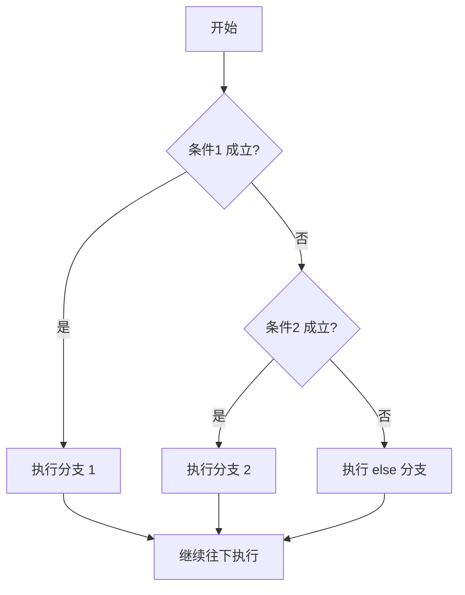

+++
title = "第53章：Bash 脚本基础"
weight = 530
date = "2026-03-24T13:18:28+08:00"
type = "docs"
description = ""
isCJKLanguage = true
draft = false
+++


# 第五十三章：Bash 脚本基础

## 53.1 Shell 与 Shell 脚本

你每天都在终端里敲命令：`ls` 看文件、`cd` 换目录、`git pull` 拉代码。如果同一串命令每天都要重复敲一遍，迟早会烦。

Shell 脚本就是**把这些命令按顺序写进一个文件**，以后运行这个文件，就等于把命令从头到尾替你敲了一遍。

### 53.1.1 Shell 是什么

Shell 是 Linux 的命令行解释器，它处在「你」和「内核」之间：你输入的是给人看的命令，内核只认系统调用，Shell 负责翻译。


常见的 Shell：

| Shell | 说明 |
|-------|------|
| `bash` | Bourne Again Shell，绝大多数 Linux 发行版的默认 Shell，本教程的主角 |
| `zsh` | macOS 的默认 Shell，交互体验好，语法与 bash 高度兼容 |
| `fish` | 交互友好，但语法与 bash **不兼容**，别拿它跑 bash 脚本 |
| `sh` | POSIX 标准的最小实现，不是一个具体程序，通常是指向别的 Shell 的软链接 |
| `dash` | Debian/Ubuntu 上 `/bin/sh` 实际指向它，启动快，但缺 bash 特性 |

这里有一个非常容易踩的坑：**`sh` 不等于 `bash`**。

```bash
# Debian / Ubuntu：/bin/sh 是 dash 的软链接
ls -l /bin/sh          # /bin/sh -> dash

# RHEL / CentOS / Rocky：/bin/sh 是 bash 的软链接
ls -l /bin/sh          # /bin/sh -> bash
```

所以用 `sh script.sh` 运行一个用了 `[[ ]]`、数组、`{1..5}` 的脚本，在 Ubuntu 上可能报错，在 CentOS 上却正常——这跟脚本本身无关，纯粹是 `/bin/sh` 指向不同。

查看当前 Shell 和系统认可的 Shell 列表：

```bash
echo $SHELL      # 登录 Shell 的路径，例如 /bin/bash
echo $0          # 当前进程的名字；在交互式 Shell 里也是它自己
cat /etc/shells  # 系统认为是"合法登录 Shell"的列表
```

注意 `$SHELL` 是**登录时**设定的默认 Shell，你手动敲了一句 `bash` 进了子 Shell，`$SHELL` 通常还是老值。

### 53.1.2 脚本能做什么

| 应用场景 | 示例 |
|---------|------|
| 自动化运维 | 批量部署、配置管理、定时任务 |
| 数据处理 | 日志分析、文件整理、格式转换 |
| 系统监控 | 检查服务状态、发送告警通知 |
| 备份恢复 | 自动备份数据库、清理过期文件 |
| 开发辅助 | 编译项目、批量测试、环境初始化 |

几个真实的小例子：

```bash
# 场景一：批量压缩图片（需要 ImageMagick 提供的 convert）
for img in *.jpg; do
    convert "$img" -quality 85 "compressed_$img"
done

# 场景二：一行搞定的部署脚本 deploy.sh
#!/bin/bash
set -euo pipefail
git pull
npm install
pm2 restart all
echo "部署完成"

# 场景三：交给 crontab 每天凌晨 3 点自动备份
# 0 3 * * * /opt/scripts/backup.sh >> /var/log/backup.log 2>&1
```

**Shell 脚本的定位**：它擅长"把现成的命令行工具串起来"。真要做复杂的字符串处理、JSON 解析、并发控制，Python/Go 会比 Shell 舒服得多。判断标准很简单——**一旦脚本超过两三百行还全是 `awk` 和 `sed`，就该考虑换语言了**。

## 53.2 第一个脚本

### 53.2.1 创建与编写

```bash
vim greeting.sh        # 或者 nano / code，随你喜欢
```

内容：

```bash
#!/bin/bash
# greeting.sh - 我的第一个正经脚本

# 定义变量
name="小明"
today=$(date +%Y年%m月%d日)

# 输出问候语
echo "========================================"
echo "  您好，$name！"
echo "  今天是：$today"
echo "========================================"
```

### 53.2.2 Shebang 到底是什么

第一行 `#!/bin/bash` 叫 **Shebang**（读作 shee-bang）。它只在一种情况下起作用：**你把脚本当成可执行文件直接运行时**（`./greeting.sh`）。这时内核会读第一行，知道要用 `/bin/bash` 来解释这个文件。

如果换成 `bash greeting.sh` 运行，那么这一行就只是一句普通注释，**写不写都一样**。

三条硬性要求：

1. `#!` 必须是**文件最开始的两个字节**，前面不能有空行、空格。
2. 保存文件时不能带 **UTF-8 BOM**，否则内核看到的是乱码，会报 `bad interpreter`。
3. 不能是 **Windows 换行符（CRLF）**，否则解释器路径会带上一个 `\r`，报错长这样：

```text
bash: ./greeting.sh: /bin/bash^M: bad interpreter: No such file or directory
# 修复：dos2unix greeting.sh   （或者 sed -i 's/\r$//' greeting.sh）
```

写 Shebang 有两种常见写法：

```bash
#!/bin/bash          # 绝对路径，明确、最常用
#!/usr/bin/env bash  # 从 PATH 里找 bash，换机器（如 macOS 自带 bash 3.2）时更省心
```

### 53.2.3 运行脚本的三种方式

```bash
# 方式一：加执行权限后直接运行（最标准）
chmod +x greeting.sh
./greeting.sh

# 方式二：显式指定解释器（脚本不需要执行权限）
bash greeting.sh

# 方式三：交给 sh 运行（POSIX 标准，bash 专有语法可能报错）
sh greeting.sh
```

| 方式 | 需要执行权限 | 在哪个进程里运行 | 典型用途 |
|------|-------------|-----------------|---------|
| `./script.sh` | 需要 | 新起的子 Shell（由 Shebang 决定） | 日常执行脚本 |
| `bash script.sh` | 不需要 | 新起的 bash 子进程 | 临时执行、换解释器 |
| `source script.sh`（等价 `. script.sh`） | 不需要 | **当前 Shell** | 加载配置、函数库 |

**`bash script.sh` 和 `source script.sh` 的区别极其重要**，新手几乎都在这翻过车：

```bash
# test_env.sh
#!/bin/bash
export MY_VAR="Hello from script"
cd /tmp

# 用 bash 运行：改动只发生在子进程里
bash test_env.sh
echo "$MY_VAR"    # 输出空行，变量不存在
pwd               # 还在原来的目录，cd 没有影响你

# 用 source 运行：改动直接作用在当前 Shell
source test_env.sh
echo "$MY_VAR"    # Hello from script
pwd               # /tmp
```

原因：`bash script.sh` 会 fork 一个子进程，脚本里的变量、`cd`、`export` 全都在子进程里，进程一退出就灰飞烟灭。`source` 则是在当前 Shell 里逐行执行，等于你亲手把那些命令敲了一遍。

> ⚠️ 所以：`source` 一个来源不明的脚本，等于把它的每一条命令都交给当前 Shell 执行，风险比 `bash` 运行大得多。修改完 `~/.bashrc` 用 `source ~/.bashrc` 生效是正常用法；从网上抄来的脚本，先看内容再决定。

### 53.2.4 脚本的组成结构

一个规整的脚本通常长这样：

```bash
#!/bin/bash
# ============================================
# 脚本名称：greeting.sh
# 作者：小明
# 日期：2026-03-24
# 描述：打印一句问候和一个日期
# ============================================

set -euo pipefail    # 出错就停，详见 53.10 节

NAME="Linux"         # 1. 变量定义
VERSION="1.0"

main() {             # 2. 主逻辑封装成函数
    echo "Hello, $NAME!"
    echo "Version: $VERSION"
}

main "$@"            # 3. 调用入口

exit 0               # 4. 退出码：0 表示成功
```

### 53.2.5 后缀名重要吗

不重要。`.sh` 只是给人看的约定，Linux 靠 Shebang 判断解释器：

```bash
mv greeting.sh greeting
./greeting              # 照样能跑
```

约定俗成：

- 工具脚本用 `.sh` 后缀，别人一眼能看出是什么；
- 可执行的命令（放在 `~/.local/bin`、`/usr/local/bin`）通常**不带后缀**，这样 `deploy` 比 `deploy.sh` 更像一个命令；
- 被 `source` 加载的库文件常用 `.bash`（如 `~/.bashrc`）或 `_lib.sh`，避免误当命令执行。

## 53.3 变量

### 53.3.1 定义与赋值

```bash
name="Linux"        # 字符串
version=1.0         # 数值（本质仍是字符串，做运算时才知道要当数字）
count=0
empty=""            # 空字符串
readonly PI=3.14    # 只读变量，之后赋值会报错
```

**等号两边绝对不能有空格**，这是 Shell 与几乎所有语言最大的不同：

```bash
name="Linux"        # ✅ 赋值
name = "Linux"      # ❌ 被解析成"执行 name 命令，参数是 = 和 Linux"
                    #    报错：name: command not found
```

变量**没有类型**，也没有布尔值。所谓"布尔变量"只是习惯用法：

```bash
is_ready=true
if [ "$is_ready" = "true" ]; then    # 必须和字符串比较
    echo "就绪"
fi
```

### 53.3.2 使用变量

取值要带 `$`，推荐加花括号（`${}`）明确边界：

```bash
name="Linux"

echo $name            # Linux
echo "$name"          # Linux（推荐：加双引号）
echo "${name}"        # Linux
echo "${name}_rule"   # Linux_rule；如果写 $name_rule 会去找名为 name_rule 的变量
```

字符串拼接直接把变量挨着写就行，不需要 `+`：

```bash
greeting="Hello, $name!"
```

花括号还支持一批"参数扩展"，处理默认值和空值非常方便：

| 写法 | 含义 |
|------|------|
| `${var}` | 普通取值 |
| `${var:-default}` | `var` 未定义或为空时，**临时**用 `default`，不改 `var` |
| `${var:=default}` | 同上，但会把 `default` **赋给** `var` |
| `${var:?提示信息}` | `var` 为空时报错退出，适合检查必填参数 |
| `${#var}` | 字符串长度 |
| `${var^^}` / `${var,,}` | 转大写 / 转小写（bash 4+） |
| `${var#前缀}` / `${var%后缀}` | 掐掉最短的前缀 / 后缀 |

```bash
: "${1:?用法: $0 <文件名>}"   # 没传参数就报错退出，脚本开头的常用保险
```

### 53.3.3 特殊变量

| 变量 | 含义 | 示例 |
|------|------|------|
| `$0` | 脚本名（含路径） | `./backup.sh` |
| `$1` … `$9` | 第 1–9 个参数 | `$1` 是第一个参数 |
| `${10}` | 第 10 个及以后的参数必须加花括号 | |
| `$#` | 参数个数 | `3` |
| `$@` | 所有参数；`"$@"` 会保留每个参数的边界 | |
| `$*` | 所有参数；`"$*"` 会拼成一个字符串 | |
| `$?` | **上一条命令**的退出状态，0 表示成功 | |
| `$$` | 当前 Shell 的进程号 | `12345` |
| `$!` | 最近一个后台进程的 PID | |
| `$LINENO` | 当前行号，调试时有用 | |
| `$RANDOM` | 0–32767 的随机整数 | `4823` |
| `$USER` `$HOME` `$PWD` `$PATH` | 用户名 / 家目录 / 当前目录 / 命令搜索路径 | |

`"$@"` 和 `"$*"` 的差别值得单独看一眼：

```bash
# 假设执行：./test.sh "a b" c
for arg in "$@"; do echo "[$arg]"; done
# [a b]
# [c]          ← 保留了两个参数

for arg in "$*"; do echo "[$arg]"; done
# [a b c]      ← 被拼成了一个参数

for arg in $@; do echo "[$arg]"; done
# [a]
# [b]
# [c]          ← 没加引号，被空格拆开了，参数边界丢失
```

结论：**传递参数永远用 `"$@"`**。

### 53.3.4 命令替换

把命令的**标准输出**当成字符串赋给变量：

```bash
# 推荐：$()
today=$(date +%Y-%m-%d)
disk_line=$(df -h / | tail -1)

# 不推荐：反引号，嵌套和转义都很别扭
today=`date +%Y-%m-%d`

# 反引号里再嵌一层，就要疯狂转义：
echo "今天是 `date +%Y` 年的第 `date +%j` 天"      # 能跑，但难读
echo "今天是 $(date +%Y) 年的第 $(date +%j) 天"    # 清晰得多
```

只捕获标准输出，标准错误仍然会直接打印到终端。要一起捕获就写 `2>&1`：

```bash
out=$(some_command 2>&1)
```

### 53.3.5 只读与删除

```bash
readonly MAX_RETRIES=3
MAX_RETRIES=5          # 报错：MAX_RETRIES: readonly variable

name="Linux"
unset name
echo "$name"           # 空
```

注意：如果打开了 `set -u`（未定义变量报错），`unset` 之后再读会直接让脚本退出。

## 53.4 引号、输出与输入

### 53.4.1 四种"引号"的区别

| 写法 | 变量是否展开 | 通配符是否展开 | 说明 |
|------|-------------|---------------|------|
| `'单引号'` | 否 | 否 | 所见即所得，一个字都不动 |
| `"双引号"` | 是 | 否 | 变量、`$( )`、反引号会展开 |
| `` `反引号` `` | — | — | 命令替换（旧写法，见 53.3.4） |
| 不加引号 | 是 | 是 | **最危险**，会做分词和通配符展开 |

```bash
name="Linux"

echo '$name'          # $name                （原样输出）
echo "$name"          # Linux                （展开变量）
echo $name            # Linux                （也能展开，但不安全，见下）

echo "*"              # *                    （双引号阻止通配符）
echo *                # 当前目录所有文件名    （通配符被展开）
```

**为什么到处都要加双引号**——因为不加引号时，变量的值会先被"拆词"，再做通配符匹配：

```bash
file="my document.txt"

cat $file             # 等于 cat "my" "document.txt"，报错：my 不存在
cat "$file"           # 正确
rm $file              # 如果目录里刚好有 my 和 document.txt 两个文件…你就删错了
rm "$file"            # 正确

dir=""
ls $dir/*             # 等于 ls /*  ——灾难现场
ls "$dir"/*           # 至少不会有意外
```

记住一句口诀：**变量要加双引号，除非你明确知道自己在做分词或通配符展开**。这条规则能挡掉八成的 Shell 脚本事故。

### 53.4.2 输出：echo 与 printf

`echo` 是 Shell 内置的，行为在不同实现间有差异。最重要的一条：

```bash
# echo 默认【不】解析反斜杠转义！
echo "Hello\nWorld"
# Hello\nWorld          ← 原样输出，不是换行

echo -e "Hello\nWorld"  # 加 -e 才解析转义
# Hello
# World

printf 'Hello\nWorld\n' # ✅ 需要转义时首选 printf，POSIX 标准、行为一致
```

所以看到老脚本里 `echo "a\tb"` 期待制表符的，基本是写错了。要么加 `-e`，要么换成 `printf`。

### 53.4.3 Here Document

把一段多行文本喂给命令的标准输入：

```bash
# 变量会展开
cat << EOF
=================================
    用户信息报表
=================================
用户名：$USER
日期：$(date +%Y-%m-%d)
主机：$HOSTNAME
=================================
EOF

# 分隔符加引号，则一个字都不展开（写配置、写脚本时很有用）
cat << 'EOF'
变量 $USER 不会被替换
EOF
```

在脚本里生成需要 root 权限的文件，配合 `sudo tee` 可以解决"重定向不受 sudo 管"的问题：

```bash
sudo tee /etc/example.conf > /dev/null << 'EOF'
key = value
EOF
```

### 53.4.4 Here String

```bash
# 把字符串当作标准输入（bash 专有语法）
cat <<< "Hello World"

# 等价于
echo "Hello World" | cat
```

## 53.5 运算符与条件测试

### 53.5.1 算术运算

Shell 的算术**只支持整数**，浮点要用 `bc` 或 `awk`。

```bash
# 方法一：$(( ))，最推荐
result=$((1 + 2))
echo "$result"      # 3

a=10
b=3
echo $((a + b))     # 13
echo $((a - b))     # 7
echo $((a * b))     # 30
echo $((a / b))     # 3    ← 整数除法，小数被丢掉
echo $((a % b))     # 1
echo $((a ** 2))    # 100  ← 幂运算

# 复合赋值
echo $((a += 5))    # 15（同时 a 变成 15）
echo $((a -= 3))    # 12
echo $((a *= 2))    # 24

# 方法二：let，写法更紧凑
let "c = a + b"

# 方法三：$[ ]，已废弃，别用
result=$[1 + 2]

# 浮点运算：交给 bc 或 awk
echo "scale=2; 10/3" | bc            # 3.33
awk 'BEGIN{printf "%.2f\n", 10/3}'   # 3.33
```

### 53.5.2 数值比较 vs 字符串比较

这是出错最多的地方：**数值比较用 `-eq -lt` 这类字母形式，字符串比较才用 `=` `<`**。

```bash
x=10
y=20

# 数值比较
[ "$x" -eq "$y" ]    # equal
[ "$x" -ne "$y" ]    # not equal
[ "$x" -gt "$y" ]    # greater than
[ "$x" -lt "$y" ]    # less than
[ "$x" -ge "$y" ]    # greater or equal
[ "$x" -le "$y" ]    # less or equal

# 字符串比较
[ "$s1" = "$s2" ]    # 相等（POSIX 用单个 =）
[ "$s1" != "$s2" ]   # 不等
[ -z "$s" ]          # 字符串为空（zero length）
[ -n "$s" ]          # 字符串非空

[[ "$s1" == "$s2" ]]    # bash 里可以用 ==，还能写通配符
[[ "$s" == a* ]]        # 前缀匹配
[[ "$s" =~ ^[0-9]+$ ]]  # 正则匹配（bash 3.0+）
```

一个经典陷阱：`[ "10" \> "9" ]` 是**字符串**比较，`10` 排在 `9` 前面，结果是假；想比大小必须用 `-gt`。

### 53.5.3 `[ ]`、`[[ ]]`、`(( ))` 该怎么选

| 写法 | 是什么 | 特点 |
|------|--------|------|
| `[ ... ]` | `test` 命令的别名 | POSIX 标准，`sh` 也能用；变量**必须加引号**，`>` `<` 会被当成重定向 |
| `[[ ... ]]` | bash 关键字 | 不做分词，变量可省引号；支持 `&&` `||` `=~` 和通配符比较 |
| `(( ... ))` | 算术求值 | 里面写数学表达式，不用加 `$`；结果非 0 为真 |

```bash
# [ ] 是命令，所以尖括号会被当成重定向，要转义
[ "$a" \> "$b" ]        # 能用但难读
[[ "$a" > "$b" ]]       # 清晰

# [[ ]] 里可以直接写 && ||
[[ -f "$f" && -r "$f" ]]
[ -f "$f" ] && [ -r "$f" ]    # [ ] 必须拆成两条

# (( )) 天生用来算数和比较
if (( count > 10 )); then
    echo "太多了"
fi
```

`test` 也可以直接当命令用：

```bash
test -f /etc/passwd && echo "文件存在"
```

### 53.5.4 逻辑运算与文件测试

```bash
# 逻辑运算
cmd1 && cmd2     # cmd1 成功才执行 cmd2
cmd1 || cmd2     # cmd1 失败才执行 cmd2
! cmd            # 取反

# 文件测试
[ -e "$path" ]   # 存在
[ -f "$path" ]   # 是普通文件
[ -d "$path" ]   # 是目录
[ -L "$path" ]   # 是符号链接
[ -r "$path" ]   # 可读
[ -w "$path" ]   # 可写
[ -x "$path" ]   # 可执行
[ -s "$path" ]   # 存在且非空

# 文件之间的比较
[ a -nt b ]      # a 比 b 新（newer than）
[ a -ot b ]      # a 比 b 旧
[ a -ef b ]      # 两者是同一个文件（硬链接或同一 inode）
```

## 53.6 条件判断：if 与 case

### 53.6.1 if 的基本写法

```bash
# 单分支
if [ 条件 ]; then
    ...
fi

# 双分支
if [ 条件 ]; then
    ...
else
    ...
fi

# 多分支
if [[ 条件1 ]]; then
    ...
elif [[ 条件2 ]]; then
    ...
else
    ...
fi
```

三种写法的执行路径：



在终端里手敲时，别忘了 `fi` 结尾——`if` 反着写就是 `fi`。

### 53.6.2 完整例子

```bash
#!/bin/bash
# check_number.sh - 判断数字大小

number=15

if (( number > 20 )); then
    echo "$number 比 20 大"
elif (( number > 10 )); then
    echo "$number 比 10 大，不超过 20"
else
    echo "$number 不超过 10"
fi
# 输出：15 比 10 大，不超过 20
```

多条件判断：

```bash
age=25
status="admin"

# 逻辑与：两个条件都成立
if [[ $age -ge 18 && $age -lt 65 ]]; then
    echo "劳动力人口"
fi

# 逻辑或
if [[ $status == "admin" || $status == "root" ]]; then
    echo "管理员权限"
fi

# 嵌套
if [[ $age -ge 18 ]]; then
    echo "已成年"
    if [[ $status == "admin" ]]; then
        echo "而且是管理员"
    fi
else
    echo "未成年"
fi
```

### 53.6.3 if 的常见坑

```bash
# 坑一：忘了空格。[ ] 是命令，[ 后面和 ] 前面必须有空格
if [$x -eq 1]; then        # ❌ 报错：command not found: [1
if [ $x -eq 1 ]; then      # ✅

# 坑二：变量没加引号，变量为空时语法就崩了
x=""
if [ $x = "a" ]; then      # ❌ 展开成 [ = "a" ]，报错
if [ "$x" = "a" ]; then    # ✅
if [[ $x == "a" ]]; then   # ✅ [[ ]] 不做分词

# 坑三：用了 == 却跑在 sh 里
if [ "$a" == "$b" ]; then  # bash 能跑，dash 报错
if [ "$a" = "$b" ]; then   # ✅ POSIX 写法
```

### 53.6.4 case 语句

分支很多时，`case` 比一长串 `if...elif` 清爽得多：

```bash
case "$变量" in
    模式1)
        命令
        ;;
    模式2|模式3)        # 用 | 表示"或"
        命令
        ;;
    *)
        默认分支
        ;;
esac
```

注意三点：`case` 结尾是 `esac`；每个分支以 `;;` 结束（最后一条可以省略，但建议都写上）；`*` 分支相当于 `else`，习惯放在最后。

```bash
#!/bin/bash
# menu.sh - 简单的菜单选择

echo "请选择你喜欢的操作系统："
echo "1) Linux"
echo "2) macOS"
echo "3) Windows"

read -r choice

case "$choice" in
    1) echo "明智的选择" ;;
    2) echo "设计优美" ;;
    3) echo "好吧……" ;;
    *) echo "无效选择，请输入 1-3" ;;
esac
```

`case` 的模式支持通配符，处理文件类型、分数段这类需求很合适：

```bash
# 按文件名后缀分类
case "$filename" in
    *.jpg|*.jpeg|*.png) echo "图片文件" ;;
    *.txt|*.md)         echo "文本文件" ;;
    *.sh)               echo "Shell 脚本" ;;
    *)                  echo "未知类型" ;;
esac

# 按分数段分类（注意 case 只做模式匹配，不理解数值大小）
case "$score" in
    100|9[0-9]) echo "优秀" ;;
    [7-8][0-9]) echo "良好" ;;
    6[0-9])     echo "及格" ;;
    [0-9])      echo "个位数，需要努力" ;;
    *)          echo "输入不合法" ;;
esac
```

> ⚠️ `case` 擅长的是**字符串和模式匹配**，不擅长数值范围。分数段这种需求用 `if (( ))` 表达更清楚，也不会漏掉边界值。

## 53.7 循环：for / while / until

### 53.7.1 for 循环

```bash
# 形式一：遍历一组值
for 变量 in 值1 值2 值3; do
    命令
done

# 形式二：C 语言风格（bash 专有）
for (( i=0; i<5; i++ )); do
    命令
done
```

实用例子：

```bash
# 遍历通配符匹配到的文件
for file in *.txt; do
    echo "处理文件: $file"
done

# 遍历数字序列（注意：{1..5} 是 bash 的括号展开，sh 不支持）
for i in {1..5}; do
    echo "第 $i 次迭代"
done

# 带步长
for i in {0..10..2}; do
    echo "$i"       # 0 2 4 6 8 10
done

# C 语言风格
for (( i=1; i<=5; i++ )); do
    echo "计数: $i"
done

# 遍历数组（必须用 "${arr[@]}"）
colors=("红" "绿" "蓝")
for color in "${colors[@]}"; do
    echo "颜色: $color"
done
```

**遍历文件时要小心两件事**：

```bash
# 1) 目录里一个 .txt 都没有时，*.txt 会原样保留，循环会跑一次，
#    此时 file 的值就是字面量 "*.txt"
shopt -s nullglob      # 让没匹配到的通配符展开成空，循环体一次都不执行

# 2) 文件名带空格时，ls 的输出不可靠，永远不要在脚本里解析 ls 的输出
for f in *.txt; do echo "$f"; done        # ✅ 通配符由 Shell 展开，天然安全
for f in $(ls *.txt); do echo "$f"; done  # ❌ 遇到 "my file.txt" 会被拆成两个
```

### 53.7.2 批量重命名

```bash
# 给所有 .txt 加 .bak 后缀
for file in *.txt; do
    mv "$file" "$file.bak"
done

# 把大写的 .JPG 统一改成 .jpg
for img in *.JPG; do
    mv "$img" "${img%.JPG}.jpg"
done
```

批量重命名属于"一旦写错就回不去"的操作，动手之前先跑一遍不带 `mv` 的版本：

```bash
# 先干跑：只打印，不改
for img in *.JPG; do
    echo "mv \"$img\" \"${img%.JPG}.jpg\""
done
# 确认输出没问题，再把 echo 换成真的执行
```

### 53.7.3 while 循环

条件成立时一直执行：

```bash
#!/bin/bash
# 计数器
count=1
while (( count <= 5 )); do
    echo "计数: $count"
    (( count++ ))
done
```

> ⚠️ `(( count++ ))` 在 `count` 为 0 时，表达式的值是 0，命令退出码为 1。配合 `set -e` 会让脚本莫名其妙退出。保险写法是 `count=$((count + 1))`。

**逐行读取文件的标准写法**（这是 Shell 脚本里最常用的模式之一）：

```bash
while IFS= read -r line; do
    echo "行内容: $line"
done < /etc/hostname
```

三个细节缺一不可：

- `IFS=` 保留行首行尾的空格，否则 `read` 会把它们吃掉；
- `-r` 不让反斜杠被当成转义符，否则路径里的 `\` 会丢失；
- `< 文件` 放在 `done` 后面，这样 `read` 才在同一个 Shell 里跑。

对比一下错误写法：

```bash
# ❌ 用管道，while 在子 Shell 中执行，循环里的变量在循环外拿不到
count=0
cat file.txt | while IFS= read -r line; do
    count=$((count + 1))
done
echo "$count"    # 空！子 Shell 里的修改丢了

# ✅ 用重定向，同一个 Shell
count=0
while IFS= read -r line; do
    count=$((count + 1))
done < file.txt
echo "$count"    # 正确
```

```bash
# 无限循环，Ctrl+C 停止
while true; do
    echo "按 Ctrl+C 停止..."
    sleep 1
done
```

### 53.7.4 until 循环

`until` 是 `while` 的反面：**条件为假时继续，条件成立就停**。

```bash
#!/bin/bash
# 倒计时
count=5
until (( count == 0 )); do
    echo "倒计时: $count"
    sleep 1
    (( count-- ))
done
echo "发射！"
```

它最常见的用途是**等待某个服务就绪**：

```bash
#!/bin/bash
# 等 MySQL 端口可用后再继续（最多等 60 秒）
port=3306
waited=0

until nc -z 127.0.0.1 "$port" 2>/dev/null; do
    if (( waited >= 60 )); then
        echo "等待超时，MySQL 仍未就绪" >&2
        exit 1
    fi
    echo "MySQL 还未启动，等待中..."
    sleep 2
    waited=$((waited + 2))
done

echo "MySQL 已就绪！"
```

> ⚠️ 等待循环**一定要有超时**。没有超时的 `until` 遇上服务永远起不来，脚本就会一直挂在那里。

### 53.7.5 循环控制

```bash
for i in {1..10}; do
    if (( i == 3 )); then
        continue      # 跳过本次，继续下一次
    fi
    if (( i == 8 )); then
        break         # 直接跳出整个循环
    fi
    echo "$i"         # 1 2 4 5 6 7
done
```

## 53.8 函数

### 53.8.1 定义与调用

两种写法完全等价，推荐第二种：

```bash
# 形式一：function 关键字（bash 专有）
function greet {
    echo "你好！"
}

# 形式二：POSIX 风格，更通用
greet() {
    echo "你好！"
}

greet     # 调用时写函数名，不要加 ()
```

注意：函数必须在**调用之前**定义。Shell 是逐行解释执行的，不像某些语言会先扫描整个文件。

### 53.8.2 函数参数

Shell 函数没有形参列表，参数通过 `$1`、`$2`… 取：

```bash
#!/bin/bash

greet_user() {
    local name="$1"        # 用 local 声明，避免污染全局
    local age="$2"
    echo "你好，$name！你 $age 岁了。"
}

greet_user "小明" 25
```

几个要点：

- `local` 只能在函数内用，能让变量不泄漏到函数外，**强烈建议所有局部变量都加**；
- 函数里的 `$1` 是函数自己的参数，不会和脚本的 `$1` 冲突（同一个名字在函数内被遮蔽，脚本名用 `$0` 仍然拿得到）；
- 想转发全部参数：`inner "$@"`；
- 想处理不定长参数，用 `for n in "$@"`：

```bash
sum() {
    local total=0
    for n in "$@"; do
        (( total += n ))
    done
    echo "$total"
}

sum 1 2 3 4       # 10
```

### 53.8.3 返回值

Shell 函数有两个"返回"通道，别混淆：

```bash
# 通道一：return 返回【状态码】，只能是 0–255 的整数，0 表示成功
check_file() {
    if [[ -f "$1" ]]; then
        return 0
    else
        return 1
    fi
}

if check_file "/etc/passwd"; then
    echo "文件存在"
else
    echo "文件不存在"
fi

# 通道二：把数据打到标准输出，用命令替换接住
get_date() {
    date +%Y-%m-%d
}
today=$(get_date)
echo "今天是: $today"
```

常见错误：把大数字或字符串 `return` 出去。`return 300` 会被截断成 `44`（300 对 256 取余），`return "abc"` 直接报错。**要返回数据就用 `echo`**。

另外，如果函数最后一条命令失败了，函数整体也会返回非 0，容易和"显式 return"混淆。写了 `set -e` 之后尤其要留意函数里的中间命令。

### 53.8.4 函数库

把常用函数写到一个文件，用 `source` 加载：

```bash
# 文件：common.sh
#!/bin/bash

red()    { printf '\033[31m%s\033[0m\n' "$*"; }
green()  { printf '\033[32m%s\033[0m\n' "$*"; }

log() {
    printf '[%s] %s\n' "$(date +%H:%M:%S)" "$*"
}
```

```bash
# 文件：deploy.sh
#!/bin/bash
set -euo pipefail

# 用脚本自身的位置定位库文件，这样在任何目录下执行都不会找不到
SCRIPT_DIR="$(cd "$(dirname "${BASH_SOURCE[0]}")" && pwd)"
source "${SCRIPT_DIR}/common.sh"

green "开始部署"
log "拉取代码..."
git pull
green "部署完成"
```

`${BASH_SOURCE[0]}` 是当前文件路径，比 `$0` 更准（被 `source` 加载时 `$0` 是外层脚本名）。这套 `SCRIPT_DIR` 写法几乎是每个正经 Shell 项目的标配。

## 53.9 数组

### 53.9.1 定义与访问

bash 的数组是**从 0 开始的整数索引数组**（字符串索引的关联数组需要 bash 4+）：

```bash
# 方式一：直接赋值（元素用空格分隔）
fruits=("苹果" "香蕉" "橙子" "葡萄")

# 方式二：按下标赋值
colors[0]="红色"
colors[1]="绿色"
colors[2]="蓝色"

# 方式三：稀疏数组，中间可以空着
sparse[0]="第一"
sparse[5]="第六"

# 方式四：由通配符或命令输出生成
files=(*.txt)                 # ✅ 通配符展开，文件名带空格也安全
files=($(ls *.txt))           # ❌ 会拆词，禁止
```

访问：

```bash
echo "${fruits[0]}"        # 苹果
echo "${fruits[2]}"        # 橙子
echo "${fruits[-1]}"       # 葡萄（bash 4.3+ 支持负数下标，从末尾数）

echo "${fruits[@]}"        # 所有元素
echo "${#fruits[@]}"       # 元素个数：4
echo "${#fruits[0]}"       # 第一个元素的字符数：2（"苹果"）
echo "${!fruits[@]}"       # 所有下标：0 1 2 3
```

> `"${arr[@]}"` 和 `"${arr[*]}"` 的区别与 `"$@"` / `"$*"` 一样：前者保留每个元素的边界，后者拼成一个字符串。**遍历一律用 `"${arr[@]}"`。**

### 53.9.2 切片

```bash
fruits=("苹果" "香蕉" "橙子" "葡萄" "西瓜")

# ${数组[@]:起始下标:个数}
echo "${fruits[@]:1:3}"    # 香蕉 橙子 葡萄（下标 1、2、3 三个元素）
echo "${fruits[@]:2}"      # 橙子 葡萄 西瓜（从下标 2 一直到末尾）
```

注意切片按**下标位置**取，不是按名称；稀疏数组用切片会跳过不存在的下标，容易出现意想不到的结果。

### 53.9.3 增删改

```bash
fruits=("苹果" "香蕉")

# 追加元素
fruits+=("橙子")                       # 最常用
fruits=("${fruits[@]}" "葡萄")         # 也能用，但啰嗦

# 修改元素
fruits[0]="红苹果"

# 删除某个元素（下标 1），后面的元素不会自动前移
unset 'fruits[1]'

# 清空整个数组
unset fruits
```

> `unset 'fruits[1]'` 里的引号不能省：不加引号时，如果当前目录恰好有能匹配 `fruits[1]` 的文件名，方括号会被通配符展开，删掉的就是别的东西。

### 53.9.4 关联数组

bash 4.0 起支持用字符串当键：

```bash
declare -A person        # -A 表示 associative（关联数组），必须先声明
person["name"]="小明"
person["age"]=25
person["city"]="北京"

echo "${person["name"]}"          # 小明
echo "${!person[@]}"              # 所有键：name age city
echo "${#person[@]}"              # 键的个数：3

# 遍历键值对
for key in "${!person[@]}"; do
    echo "$key = ${person[$key]}"
done
```

注意：关联数组的遍历顺序是**不确定的**，不要依赖它的输出顺序。

### 53.9.5 遍历数组

```bash
# 遍历值
for fruit in "${fruits[@]}"; do
    echo "水果: $fruit"
done

# 遍历下标（适合需要下标或要修改元素的场景）
for i in "${!fruits[@]}"; do
    echo "下标 $i -> ${fruits[$i]}"
done
```

## 53.10 脚本调试与错误处理

### 53.10.1 调试选项

| 选项 | 作用 |
|------|------|
| `bash -n script.sh` | 只做语法检查，不执行（提交代码前跑一次，能挡掉低级错误） |
| `bash -v script.sh` | 把读到的每一行原样打印出来 |
| `bash -x script.sh` | 打印每条真正执行的命令（最常用） |

```bash
bash -n script.sh               # 检查语法
bash -x script.sh               # 追踪执行过程
bash -x script.sh 2>&1 | less   # 输出多的时候配合 less 慢慢看
```

输出里带 `+` 前缀的就是 `-x` 打出来的追踪行，比如：

```text
+ name=小明
+ echo '你好，小明'
你好，小明
```

**变量值异常时，`-x` 是最快的定位手段。**

### 53.10.2 在脚本内部开关调试

```bash
#!/bin/bash

set -x              # 从这里开始追踪
name="小明"
echo "你好，$name"
set +x              # 关闭追踪

echo "这行不会被追踪"
```

想追踪得更好看，可以自定义提示符：

```bash
export PS4='+ [${BASH_SOURCE}:${LINENO}] '
set -x
```

这样每条追踪行都会带上**文件名和行号**，比光秃秃的 `+` 有用得多。

### 53.10.3 让脚本在出错时立刻停下

默认情况下，某条命令失败后 Shell **会继续往下跑**，这非常危险：`cd` 失败后继续删文件——事故多半出在这里。

```bash
#!/bin/bash
set -euo pipefail
```

| 参数 | 作用 |
|------|------|
| `set -e` | 任何命令返回非 0 就退出脚本（少数场景例外，见下） |
| `set -u` | 使用未定义的变量时报错退出，避免 `rm -rf "$DIR"/` 里 `$DIR` 为空 |
| `set -o pipefail` | 管道中任一环节失败，整条管道就算失败（默认只看最后一个命令） |

`pipefail` 为什么重要：

```bash
set -e
false | true       # 默认整条管道返回 0，脚本继续跑
set -o pipefail
false | true       # 整条管道返回 1，脚本会退出
```

`set -e` 的例外情况（它并不可靠，需要知道）：

```bash
# 出现在 if / while / until 的条件里，或 && || 的左侧时，-e 不生效
if false; then echo "不会执行"; fi     # 不会退出脚本

# 命令替换里的失败同样不受 -e 直接保护
out=$(false)

# 所以关键步骤要显式判断
if ! cp "$src" "$dst"; then
    echo "复制失败" >&2
    exit 1
fi
```

### 53.10.4 trap：退出时清理现场

脚本临时创建的文件、占用的锁、开的连接，都应该在退出时清理干净——不管是正常结束还是被 Ctrl+C 打断：

```bash
#!/bin/bash
set -euo pipefail

tmp_file="$(mktemp)"
lock_dir="/tmp/myscript.lock"

cleanup() {
    rm -f "$tmp_file"
    rmdir "$lock_dir" 2>/dev/null || true
    echo "已清理临时文件"
}

trap cleanup EXIT INT TERM      # 正常退出、Ctrl+C、被 kill 都会触发

mkdir "$lock_dir"
echo "开始执行..."
```

`trap ... EXIT` 的特点是**总会执行**（除非脚本被 `kill -9` 强杀），比把清理代码写在脚本末尾可靠得多。

其他常用的信号：

```bash
trap 'echo "收到 Ctrl+C，正在退出..."' INT
trap '' INT        # 忽略 Ctrl+C（谨慎使用）
```

### 53.10.5 其他实用技巧

```bash
# 1. 明确打出错误信息，并输出到标准错误
echo "错误：找不到配置文件" >&2

# 2. 出错时给出出错的行号，方便定位
trap 'echo "出错于第 $LINENO 行" >&2' ERR
```

```bash
# 3. 查看内置命令的帮助
help set              # set 是内置命令，用 help 而不是 man
help -d set           # 一行摘要

# 4. 查看函数定义
declare -F            # 只列出所有函数名
declare -f            # 列出所有函数的完整定义
declare -f my_func    # 查看指定函数

# 5. 打开语法检查工具（强烈推荐）
shellcheck script.sh
```

**ShellCheck 相当于 Shell 脚本的"编译器检查"**，能自动指出没加引号的变量、`$(ls)` 解析、未定义变量等问题。写完脚本跑一遍，比反复 `bash -x` 高效得多：

```bash
# Debian/Ubuntu
sudo apt install shellcheck
# RHEL 系列（需要 EPEL）
sudo dnf install ShellCheck
```

## 本章小结

本章我们走完了 Bash 脚本的基础路线：

| 知识点 | 关键内容 |
|--------|---------|
| Shell 与脚本 | Shell 是命令解释器；脚本把命令写进文件自动执行 |
| Shebang | `#!/bin/bash`，直接执行时才有用；不能有 BOM / CRLF |
| 运行方式 | `./s.sh`、`bash s.sh`（子进程）、`source s.sh`（当前 Shell） |
| 变量 | 无类型、等号不能有空格、取值加 `$` 和双引号 |
| 特殊变量 | `"$@"` 传参数、`$#` 个数、`$?` 退出码、`$0` 脚本名 |
| 引号 | 单引号原样、双引号展开变量、不加引号会分词和通配 |
| 输出 | `echo` 默认不解析 `\n`，要转义就用 `printf` 或 `echo -e` |
| 测试 | `[ ]`（POSIX，要加引号）vs `[[ ]]`（bash，更安全）vs `(( ))`（算术） |
| 条件 | `if / elif / else / fi`，多分支用 `case ... esac` |
| 循环 | `for`、`while`、`until`；读文件用 `while IFS= read -r` |
| 函数 | 参数用 `$1` `"$@"`；`return` 只给状态码，返回数据用 `echo`；局部变量加 `local` |
| 数组 | `"${arr[@]}"` 遍历、`${arr[@]:1:3}` 切片、`declare -A` 关联数组 |
| 调试 | `bash -n`、`bash -x`、`set -euo pipefail`、`trap ... EXIT`、ShellCheck |

几条能救命的原则，建议贴在显示器边上：

1. **变量加双引号**：`"$var"`、`"${arr[@]}"`、`"$@"`。
2. **脚本开头写 `set -euo pipefail`**，让错误尽早暴露。
3. **别解析 `ls` 的输出**，用通配符或 `find -print0 | xargs -0`。
4. **`$?` 只代表上一条命令**，中间插一句 `echo` 就把它冲掉了。
5. **`rm`、`mv`、`cd` 之前先 `echo` 干跑一遍**，尤其是带通配符的时候。

Shell 脚本是 Linux 运维的基石。这些语法看着琐碎，但掌握之后，原本要敲半小时的重复劳动，几行脚本就能搞定。

**下一章预告**：第五十四章进入 Bash 脚本进阶——字符串处理、正则表达式、`sed`、`awk` 这些真正的"文本处理三剑客"，以及如何写出健壮、可维护的运维脚本。
