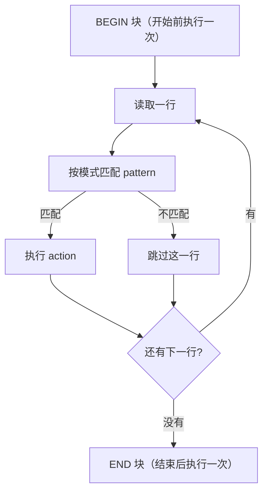

+++
title = "第54章：Bash 脚本进阶"
weight = 540
date = "2026-03-24T13:18:28+08:00"
type = "docs"
description = ""
isCJKLanguage = true
draft = false
+++


# 第五十四章：Bash 脚本进阶

上一章打好了地基：变量、引号、判断、循环、函数、数组。这一章我们补上运维脚本真正天天要用的东西——字符串处理、正则、`sed`、`awk`、进程与信号、并发与锁。

学会这些，你才能把"能跑的脚本"变成"敢放到生产上跑的脚本"。

## 54.1 字符串处理

Shell 里最常用的数据类型就是字符串。好消息是，**bash 内置了一批字符串操作**，不用每次都去请 `sed` 和 `awk`。

### 54.1.1 长度、截取、拼接

```bash
str="Hello World"

# 长度（字符数）
echo "${#str}"        # 11

# 截取：${变量:起始位置:长度}
echo "${str:0:5}"     # Hello（从下标 0 开始，取 5 个字符）
echo "${str:6}"       # World（从下标 6 到末尾）

# 从末尾数：冒号和减号之间必须有空格
echo "${str: -5}"     # World
# 写成 ${str:-5} 就变成了"如果 str 为空则用 5"，完全是另一个意思！

# 拼接：直接挨着写
str1="Hello"
str2="World"
result="$str1 $str2"
echo "$result"        # Hello World
```

> ⚠️ `${str:-5}` 和 `${str: -5}` 只差一个空格，含义天差地别：前者是"默认值"，后者才是"倒数 5 个字符"。这是 Shell 里最阴的坑之一。

### 54.1.2 查找与替换

```bash
str="Hello World, Hello Linux"

echo "${str/Hello/Hi}"        # 替换【第一个】匹配：Hi World, Hello Linux
echo "${str//Hello/Hi}"       # 替换【全部】：Hi World, Hi Linux
echo "${str/#Hello/Hi}"       # 只在【开头】匹配时替换
echo "${str/%Linux/Unix}"     # 只在【结尾】匹配时替换

# 把新内容留空，就是删除
echo "${str/Hello/}"          # World, Hello Linux
echo "${str//o/}"             # Hell Wrld, Hell Linux
```

速记：**一个斜杠换第一个，两个斜杠换全部，`#` 管开头，`%` 管结尾**。

### 54.1.3 大小写转换

```bash
str="hello world"

echo "${str^^}"          # HELLO WORLD（全部大写）
echo "${str,,}"          # hello world（全部小写）
echo "${str^}"           # Hello world（只把【第一个字符】变大写）

# 只转换指定的字符集合
s="Hello World"
echo "${s^^[aeiou]}"     # HEllO WOrld（只把元音变大写）
echo "${s,,[A-Z]}"       # hello world（把大写变小写）
```

注意 `${变量^}` 只动**第一个字符**，不会把后面的字母变，也不会把其余字母变小写，别指望它做"首字母大写标题化"。

> 这些写法（`^^`、`,,`、`^`）需要 **bash 4.0+**。老系统（如 macOS 自带的 bash 3.2）会报 `bad substitution`，脚本里要用得先看目标环境。

### 54.1.4 分割字符串

```bash
# 按分隔符拆分到多个变量
email="user@example.com"
IFS='@' read -r user domain <<< "$email"
echo "$user"      # user
echo "$domain"    # example.com

# 拆成数组（-a）
path="/home/user/documents/file.txt"
IFS='/' read -ra parts <<< "$path"
echo "${parts[-1]}"    # file.txt
echo "${parts[-2]}"    # documents
echo "${#parts[@]}"    # 5（注意最前面的空串也是一个元素）

# 想统计逗号分隔的字段数，用 awk 更省事
echo "a,b,c,d" | awk -F',' '{print NF}'    # 4
```

### 54.1.5 逐行读取：`while read` 与 `mapfile`

```bash
# 方式一：while read，边读边处理（适合大文件，不会把整个文件装进内存）
while IFS= read -r line; do
    echo "行: $line"
done < input.txt

# 方式二：mapfile 一次性读进数组（bash 4+，适合需要随机访问的场景）
mapfile -t lines < input.txt
echo "总行数: ${#lines[@]}"
echo "第一行: ${lines[0]}"
```

`mapfile`（别名 `readarray`）的常用选项：

| 选项 | 作用 |
|------|------|
| `-t` | 去掉每行结尾的换行符（几乎总是要加） |
| `-n N` | 最多读 N 行 |
| `-s N` | 跳过前 N 行 |
| `-d X` | 用 X 而不是换行符作为分隔符（如 `-d ''` 处理 NUL 分隔输出） |

用管道时 `while` 会在子 Shell 里跑，循环内的变量在循环外读不到——这一点在 53.7.3 讲过，`mapfile` 配合进程替换是另一种绕开方式：

```bash
mapfile -t lines < <(grep "error" app.log)
```

### 54.1.6 去掉首尾空白

纯 bash 写法（不需要外部命令）：

```bash
str="   前后有空格   "

# 去掉【开头】的空白
echo "${str#"${str%%[![:space:]]*}"}"
# 前后有空格

# 去掉【结尾】的空白
echo "${str%"${str##*[![:space:]]}"}"
#    前后有空格

# 去掉【两端】，封装成函数最实用
trim() {
    local var="$*"
    var="${var#"${var%%[![:space:]]*}"}"     # 掐掉开头
    var="${var%"${var##*[![:space:]]}"}"     # 掐掉结尾
    printf '%s' "$var"                       # 用 printf，别用 echo -n
}

name=$(trim "   小明   ")
echo "[$name]"    # [小明]
```

为什么是这么一串符号？拆开看：`${var%%[![:space:]]*}` 的意思是"从开头删掉最长的、由非空白字符组成的部分"，剩下的正好是开头的空白；再用 `${var#空白}` 把它剪掉。看着别扭，但这是纯 bash 的标准写法。

> ⚠️ 网上常见的 `echo "$str" | xargs` **不要用**：`xargs` 除了去掉空白，还会把引号和反斜杠当特殊字符处理，`echo -n` 在不同平台上行为也不一致。标准做法是上面的 `${var#...}`，或者 `sed -E 's/^[[:space:]]+//; s/[[:space:]]+$//'`。

### 54.1.7 格式化输出

需要控制对齐、补零、保留小数时，用 `printf`：

```bash
printf '%-10s|%5s|%s\n' "名字" "分数" "备注"
printf '%-10s|%5d|%s\n' "小明" 95 "优秀"
printf '%-10s|%5d|%s\n' "小红" 88 "良好"

# 输出：
# 名字        |   分数|备注
# 小明        |   95|优秀
# 小红        |   88|良好

# 补零对齐编号
printf '第%03d章\n' 7          # 第007章

# 保留两位小数
printf '使用率: %.2f%%\n' 87.456   # 使用率: 87.46%
```

`%-10s` 是左对齐、宽度 10；`%5s` 是右对齐、宽度 5。做表格输出时，`printf` 比拼空格可靠得多。

## 54.2 正则表达式

正则表达式是文本处理的通用语言，`grep`、`sed`、`awk`、`[[ =~ ]]` 都在用它。这一节只讲够用且常用的部分。

### 54.2.1 两种风格：BRE 与 ERE

**这是最容易出错的地方**：同一套正则，标准不同，写法就不同。

| 元字符 | 基础正则（BRE，`grep` `sed`） | 扩展正则（ERE，`grep -E` `awk` `[[ =~ ]]`） |
|--------|------------------------------|------------------------------------------|
| 或 | `\|` | `|` |
| 分组 | `\( \)` | `( )` |
| 一次或多次 | `\+` | `+` |
| 零次或一次 | `\?` | `?` |
| 重复 n 次 | `\{n\}` | `{n}` |

```bash
# BRE：想用 + 和 () 都得转义
grep '^[0-9]\+$' file.txt         # 纯数字行

# ERE：直接写，清爽得多（推荐）
grep -E '^[0-9]+$' file.txt       # 纯数字行
grep -E '^(error|warn)' file.txt  # error 或 warn 开头
```

**新脚本统一用 `grep -E`**。老的 `egrep` 命令已被官方标记为过时（deprecated），虽然现在还能用，但别往新代码里写。

### 54.2.2 常用元字符速查

| 写法 | 含义 |
|------|------|
| `^` / `$` | 行首 / 行尾 |
| `.` | 任意单个字符（不含换行） |
| `*` | 前面那个字符重复 0 次或多次 |
| `+` | 前面那个字符重复 1 次或多次（ERE） |
| `?` | 前面那个字符出现 0 次或 1 次（ERE） |
| `[abc]` / `[^abc]` | 字符集 / 取反 |
| `[a-z]` `[0-9]` | 范围 |
| `[[:digit:]]` `[[:space:]]` `[[:alpha:]]` | POSIX 字符类，比 `\d` `\s` 更通用 |
| `{n}` `{n,}` `{n,m}` | 精确重复 n 次 / 至少 n 次 / n 到 m 次（ERE） |
| `( )` | 分组与捕获（ERE） |
| `\|` 或 `|` | 或（BRE / ERE） |

> ⚠️ `\d`、`\s`、`\w` 是 **Perl/GNU 扩展**，不是 POSIX 标准。`grep -E '\d'` 在 GNU grep 里能用，在 BSD/macOS 或者用了 POSIX 模式时就会失效。写可移植脚本请用 `[[:digit:]]`、`[[:space:]]`、`[[:alnum:]_]`。

### 54.2.3 在 `[[ ]]` 里做匹配

bash 的 `=~` 操作符使用 ERE，匹配成功后的分组会留在 `BASH_REMATCH` 数组里：

```bash
str="Hello123World"

if [[ $str =~ ^([A-Za-z]+)([0-9]+)([A-Za-z]+)$ ]]; then
    echo "整段匹配: ${BASH_REMATCH[0]}"   # Hello123World
    echo "第 1 组: ${BASH_REMATCH[1]}"     # Hello
    echo "第 2 组: ${BASH_REMATCH[2]}"     # 123
    echo "第 3 组: ${BASH_REMATCH[3]}"     # World
fi
```

两个必须记住的细节：

```bash
# 细节一：右侧的正则【不要加引号】，加了就变成字面字符串匹配
pattern='^[0-9]+$'
[[ $str =~ $pattern ]]      # ✅ 变量里的正则生效
[[ $str =~ "$pattern" ]]    # ❌ 把 $pattern 当成普通字符串比

# 细节二：从左到右匹配，BASH_REMATCH 只保留最后一次匹配的结果，
#         所以匹配成功后要【立刻】取值，别中间插别的 [[ =~ ]]
```

### 54.2.4 常用校验正则

```bash
# 邮箱（能挡住绝大部分手误，但不追求完美符合 RFC）
email="user@example.com"
if [[ $email =~ ^[a-zA-Z0-9._%+-]+@[a-zA-Z0-9.-]+\.[a-zA-Z]{2,}$ ]]; then
    echo "邮箱格式正确"
fi

# 手机号（中国大陆：1 开头，第二位 3-9，共 11 位）
phone="13812345678"
if [[ $phone =~ ^1[3-9][0-9]{9}$ ]]; then
    echo "手机号格式正确"
fi

# IP 地址（只校验"四段 1-3 位数字"，不校验 0-255 范围）
ip="192.168.1.1"
if [[ $ip =~ ^[0-9]{1,3}(\.[0-9]{1,3}){3}$ ]]; then
    echo "IP 格式正确"
fi

# 日期 YYYY-MM-DD
date_str="2026-03-24"
if [[ $date_str =~ ^[0-9]{4}-[0-9]{2}-[0-9]{2}$ ]]; then
    echo "日期格式正确"
fi
```

> ⚠️ 正则校验只能保证"长得像"，不能保证"是真的"。`999.999.999.999` 能通过 IP 正则，`2026-13-45` 也能通过日期正则。要严格校验，用 `date -d`、`ipcalc` 之类的工具做二次确认。

## 54.3 sed

`sed`（stream editor）是流编辑器：**读一行、处理一行、输出一行**，天生适合处理大文件和批量替换。

### 54.3.1 基本语法与常用选项

```bash
sed [选项] '地址 命令' 文件
```

| 选项 | 作用 |
|------|------|
| `-n` | 不自动打印，只打印被 `p` 命令指定的行 |
| `-e` | 指定多个脚本片段（或用 `;` 分隔） |
| `-i` | 直接修改原文件（**危险，建议带备份后缀**） |
| `-E` / `-r` | 使用扩展正则（ERE） |
| `-f 文件` | 从文件里读 sed 脚本 |

### 54.3.2 替换命令 `s`

```bash
sed 's/old/new/' file.txt        # 每行【第一个】old 换成 new
sed 's/old/new/g' file.txt       # 每行【所有】old 都换
sed 's/old/new/2' file.txt       # 只换每行【第二个】
sed -n 's/old/new/p' file.txt    # 只打印发生了替换的行
sed 's/old/new/gI' file.txt      # I 表示忽略大小写（GNU sed）

# 内容里有 / 时，换一个分隔符，省得满屏转义
sed 's|/bin/bash|/bin/sh|' file.txt
sed 's#/var/log/old#/var/log/new#g' file.txt
```

`&` 代表"被匹配到的整段内容"，做前后包裹非常方便：

```bash
sed 's/.*/"&"/' file.txt          # 给每一行加上双引号
sed -E 's/[0-9]+/[\0]/g' file.txt # 给每个数字加方括号（\0 等价于 &，GNU 写法）
```

### 54.3.3 地址：只处理指定的行

```bash
sed '3s/old/new/' file.txt            # 只处理第 3 行
sed -n '1,10p' file.txt               # 只打印第 1-10 行
sed '1,5s/old/new/g' file.txt         # 只在 1-5 行里替换
sed -n '$p' file.txt                  # 只打印最后一行
sed -n '/^\[server\]/,/^\[/p' file.txt  # 打印从匹配到的行到下一处匹配（范围地址）
sed '/pattern/s/old/new/g' file.txt   # 只在包含 pattern 的行里替换
sed -n '1~2p' file.txt                # 奇数行（GNU 扩展：从第 1 行起每 2 行取一次）
```

### 54.3.4 删除、插入、追加

```bash
# 删除
sed '/^$/d' file.txt                  # 删空行
sed -E '/^[[:space:]]*(#|$)/d' file.txt   # 删注释行和空行
sed '1,10d' file.txt                  # 删第 1-10 行

# 插入（i = 在指定行【之前】）和追加（a = 在指定行【之后】）
sed '1i # 本文件由脚本生成，请勿手改' file.txt
sed '/^\[mysqld\]/a max_connections = 500' my.cnf

# 替换整行（c = change）
sed '/^listen=/c listen = 0.0.0.0' php-fpm.conf

# 在第 3 行前插入多行：GNU sed 支持在文本里写 \n
sed '3i first line\nsecond line' file.txt
```

> ⚠️ `i`/`a`/`c` 的写法在不同 sed 上差别很大：GNU sed 支持 `1i 文本`，BSD/macOS 的 sed 要求写成 `1i\` 再换行接文本。**脚本要跨平台时，尽量用 `printf` 配合临时文件，或者干脆用 `perl -i -pe`。**

### 54.3.5 反向引用与大小写转换

```bash
# 反向引用：\( \) 捕获，\1 \2 引用（ERE 下写成 ( ) 加 -E）
echo "2026-03-24" | sed -E 's/([0-9]{4})-([0-9]{2})-([0-9]{2})/\3\/\2\/\1/'
# 24/03/2026

echo "张三:95" | sed -E 's/(.*):(.*)/\2 是 \1 的分数/'
# 95 是 张三 的分数

# 大小写转换（GNU sed 扩展，BSD/macOS 不支持）
sed 's/[a-z]/\U&/g' file.txt    # 全文转大写
sed 's/[A-Z]/\L&/g' file.txt    # 全文转小写
sed -E 's/\b([a-z])/\u\1/g' file.txt   # 每个单词首字母大写
```

### 54.3.6 直接修改文件：-i 的正确用法

```bash
# GNU sed（Linux）：-i 后面直接跟备份后缀
sed -i.bak 's/old/new/g' file.txt      # 改原文件，同时生成 file.txt.bak

# macOS/BSD 的 sed：-i 后面【必须】跟一个参数，不想要备份就写空串
sed -i '' 's/old/new/g' file.txt
```

> ⚠️ 这是脚本在 Linux 和 macOS 之间移植时最常见的报错来源。要写跨平台脚本，可以判断系统后分支处理，或者统一改用 `perl -i -pe 's/old/new/g' file.txt`（perl 两边都有，语法一致）。

### 54.3.7 实战例子

```bash
# 1. 提取本机 IPv4 地址（ip 命令，别再依赖已过时的 ifconfig）
ip -4 addr show | sed -nE 's/.*inet ([0-9.]+)\/.*/\1/p'

# 2. 去掉配置文件里的注释和空行，看清楚真正生效的配置
sed -E '/^[[:space:]]*(#|$)/d' /etc/ssh/sshd_config

# 3. 日志只保留最近 100 行
#    注意：sed 的地址不能自己算数，得让 Shell 先算好再传进去
lines=$(wc -l < file.log)
if (( lines > 100 )); then
    sed -i "1,$((lines - 100))d" file.log
fi

# 4. 给每一行的行首加时间戳前缀
sed "s/^/[$(date '+%F %T')] /" input.txt > output.txt

# 5. 批量把文件里的旧域名换成新域名（先备份）
sed -i.bak 's/old.example.com/new.example.com/g' /etc/nginx/conf.d/*.conf
```

第 3 条里那个 `1,$((lines - 100))d` 有个关键点：`$((...))` 必须在**双引号**里由 Shell 计算，sed 本身不做算术。原稿里写成 `sed -i '1,$(($(wc -l<file.log)-100))d'`（单引号包住算式）是**跑不通的**——单引号里 Shell 不展开，sed 会把它当成一堆乱码地址。

## 54.4 awk

`awk` 是"按列处理文本"的瑞士军刀：自动按分隔符切好字段，还能做统计、累加、格式化输出。日志分析基本离不开它。

### 54.4.1 程序结构

```bash
awk 'pattern { action }' 文件
```

一段 awk 程序由三部分组成，执行顺序如下：



对应到代码：

```bash
awk 'BEGIN { print "=== 开始统计 ===" }     # 只执行一次
     /error/ { err++ }                      # 每一行都判断一次
     END { print "错误行数:", err }' app.log
```

BEGIN 常用来设分隔符、打印表头；END 常用来输出统计结果。

### 54.4.2 字段与内置变量

```bash
# 默认以"空白"为分隔符
echo "John 25 male Beijing" | awk '{print $1, $3}'
# John male

# 指定分隔符
echo "192.168.1.1" | awk -F'.' '{print $1"."$2"."$3".0"}'
# 192.168.1.0

# 多个分隔符（用方括号写字符集）
echo "user@example.com,123456" | awk -F'[@,]' '{print $1, $3}'
# user 123456
```

| 变量 | 含义 |
|------|------|
| `$0` | 当前整行 |
| `$1` `$2` … | 第 1、2… 个字段 |
| `$NF` | **最后一个**字段 |
| `$(NF-1)` | 倒数第二个字段 |
| `NF` | 当前行的字段数 |
| `NR` | 已读入的行号（跨文件累加） |
| `FNR` | 当前文件内的行号（换文件会重置） |
| `FILENAME` | 当前文件名 |
| `FS` / `OFS` | 输入 / 输出字段分隔符 |
| `RS` / `ORS` | 输入 / 输出记录分隔符 |
| `SUBSEP` | 多维数组下标的连接符（默认 `\034`） |

```bash
# 打印文件内容并加行号
awk '{print NR, $0}' file.txt

# 只处理第二个文件之后的内容（FNR 换文件会重置）
awk 'FNR==1 {print "--- " FILENAME " ---"} 1' a.txt b.txt

# 取最后一个字段和字段数
awk '{print NF, $NF}' /etc/passwd | head -3

# 用 -v 从 Shell 传变量进去（注意不要直接拼字符串，容易被注入或出错）
awk -v threshold=100 '$3 > threshold {print $1, $3}' data.txt
```

`-v` 传值是 awk 最容易被忽略的实用技巧：需要把 Shell 变量喂给 awk 时，一律用 `-v 变量=值`，而不是在脚本里硬拼字符串。

### 54.4.3 条件与模式

```bash
awk '$3 > 100 {print $1, $3}' data.txt        # 数值比较
awk '$1 == "admin" {print $0}' /etc/passwd    # 精确相等
awk '/error/ {print $0}' app.log              # 包含 error 的行
awk '!/^#/ {print}' config.conf               # 不以 # 开头
awk 'NR>=10 && NR<=20' data.txt               # 第 10-20 行
awk 'length($0) > 80 {print NR": 行太长"}' file.txt
```

```bash
awk 'BEGIN { FS=":"; OFS=" | " }     # 输入用 : 分，输出用 | 分
     $3 >= 1000 { print $1, $3, $7 }' /etc/passwd
# 打印 UID ≥ 1000 的普通用户的 用户名 | UID | 登录 Shell
```

### 54.4.4 累加与统计

```bash
# 1. 求某一列的和
awk '{ sum += $2 } END { printf "总计: %d\n", sum }' numbers.txt

# 2. 求平均、最大、最小
awk '{ s += $1; if (NR==1 || $1 > max) max=$1; if (NR==1 || $1 < min) min=$1 }
     END { printf "平均 %.2f 最大 %d 最小 %d\n", s/NR, max, min }' values.txt

# 3. 统计文件总字节数（用 find 拿尺寸，别去解析 ls 的输出）
find . -maxdepth 1 -name '*.txt' -printf '%s\n' 2>/dev/null | awk '{s+=$1} END {print s, "字节"}'

# 4. 统计访问日志里每个 URL 的访问次数，取 TOP 10
awk '{count[$7]++} END {for (url in count) printf "%6d %s\n", count[url], url}' access.log | sort -rn | head -10

# 5. 统计 HTTP 状态码分布
awk '{code[$9]++} END {for (c in code) printf "%s\t%d\n", c, code[c]}' access.log | sort

# 6. 求某列的去重计数
awk '!seen[$1]++ {n++} END {print "去重后:", n}' data.txt
```

> ⚠️ 上面用 `$7`、`$9` 举例，是按**常见的 Combined 格式**访问日志：
> `127.0.0.1 - - [10/Oct/2024:13:55:36 +0800] "GET /index.html HTTP/1.0" 200 2326`
> 字段位置是：IP、时间(两部分)、请求方法、URL、协议、状态码、字节数。日志格式一变，`$7` 就可能是别的东西——**先用 `head -1 access.log | awk '{for(i=1;i<=NF;i++) print i, $i}'` 看清每一列是什么，再写统计表达式**。

### 54.4.5 数组

awk 的数组默认就是**关联数组**（用字符串当键），这是它做统计的底气所在：

```bash
# 1. 词频统计
awk '{ for (i=1; i<=NF; i++) words[$i]++ }
     END { for (w in words) print words[w], w }' file.txt | sort -rn | head -20
```

```bash
# 2. 按第一个字段分组求和
awk '{sum[$1] += $2} END {for (k in sum) print k, sum[k]}' data.txt

# 3. 二维数组：a[i,j] 实际是 a[i SUBSEP j]
awk 'BEGIN {
    a[1,1]="a"; a[1,2]="b"
    a[2,1]="c"; a[2,2]="d"
    for (i=1; i<=2; i++)
        for (j=1; j<=2; j++)
            print "a[" i "," j "] =", a[i,j]
}'
# 输出：
# a[1,1] = a
# a[1,2] = b
# a[2,1] = c
# a[2,2] = d

# 4. 用 split 把字符串拆成数组
awk 'BEGIN { n = split("a:b:c", arr, ":"); for (i=1; i<=n; i++) print i, arr[i] }'
```

判断某个键是否存在，要用 `in`，而不是拿值去比：

```bash
awk '{ if ($1 in seen) dup++; else seen[$1]=1 } END {print "重复行:", dup+0}' data.txt
```

### 54.4.6 常用内置函数

| 函数 | 作用 | 例子 |
|------|------|------|
| `length(s)` | 字符串长度 | `length($0)` |
| `substr(s,m,n)` | 取子串 | `substr($1,1,3)` |
| `index(s,t)` | t 在 s 中的位置（没有则 0） | `index($0,"error")` |
| `split(s,a,sep)` | 拆分成数组，返回元素个数 | `split($0,a,",")` |
| `sub(re,rep)` / `gsub(re,rep)` | 替换第一个 / 全部 | `gsub(/ /,"",$0)` |
| `match(s,re)` | 匹配并设置 `RSTART`、`RLENGTH` | `match($0,/[0-9]+/)` |
| `toupper(s)` / `tolower(s)` | 转大写 / 小写 | `toupper($1)` |
| `sprintf(fmt,...)` | 格式化后返回字符串 | `sprintf("%05d",$1)` |
| `printf` | 直接输出，不自动换行 | `printf "%-10s\n",$1` |

```bash
# 用 gsub 去掉千分位逗号再求和
echo "1,234" | awk '{gsub(/,/,""); print $0+0}'    # 1234

# 格式化输出表格
awk -F: '{printf "%-16s %5s %s\n", $1, $3, $7}' /etc/passwd | head -5
```

### 54.4.7 写成 awk 脚本文件

逻辑长的时候，把 awk 代码单独放一个文件更清爽：

```awk
# report.awk
BEGIN {
    FS = ":"
    print "=== 用户报告 ==="
}

{
    print "用户: " $1
    print "UID: " $3
    print "Shell: " $7
    print "---"
}

END {
    print "=== 报告结束 ==="
}
```

```bash
# 用 -f 指定脚本文件
awk -f report.awk /etc/passwd
```

还可以给 awk 脚本加上 Shebang，把它当成普通命令直接执行：

```awk
#!/usr/bin/awk -f
# 上面这行必须是文件第一行，写完别忘了 chmod +x report.awk
BEGIN { FS = ":" }
{ print $1, $7 }
```

```bash
chmod +x report.awk
./report.awk /etc/passwd
```

> ⚠️ 不同 awk 实现有差异：Linux 上通常是 **gawk**（GNU awk，功能最全）或 **mawk**（Debian/Ubuntu 的默认，速度快但少一些扩展函数）。`gensub`、`systime`、`strftime`、`asort` 这类都是 gawk 扩展，mawk 不一定有。要写跨发行版的脚本，先在目标机器上 `awk --version` 看一眼。

## 54.5 参数解析：getopts

一个正经的命令行工具，应该支持 `-v`、`-o file` 这样的选项，而不是让用户按位置传一堆含义不明的参数。bash 内置的 `getopts` 就是干这个的。

```bash
#!/bin/bash
set -euo pipefail

usage() {
    cat << EOF
用法: $0 [-v] [-o 输出文件] [-n 次数] 输入文件

  -v          输出详细过程
  -o FILE     指定输出文件（默认输出到屏幕）
  -n NUM      重复次数（默认 3）
  -h          显示本帮助
EOF
    exit 1
}

verbose=0
outfile=""
count=3

# 开头的 : 表示"静默模式"：出错时不让 getopts 自己打印，
# 而是交给我们用 case 里的 :) 和 ?) 分支处理
while getopts ":vo:n:h" opt; do
    case "$opt" in
        v) verbose=1 ;;
        o) outfile="$OPTARG" ;;
        n) count="$OPTARG" ;;
        h) usage ;;
        :) echo "错误：选项 -$OPTARG 需要一个参数" >&2; usage ;;
        \?) echo "错误：未知选项 -$OPTARG" >&2; usage ;;
    esac
done

# 把已经解析过的选项移出参数列表，剩下的就是位置参数
shift $((OPTIND - 1))

if (( $# < 1 )); then
    echo "错误：缺少输入文件" >&2
    usage
fi

input="$1"
echo "输入文件: $input, 次数: $count, 输出: ${outfile:-屏幕}"
(( verbose )) && echo "详细模式已开启"

# 参数校验要趁早：次数必须是正整数
if ! [[ $count =~ ^[1-9][0-9]*$ ]]; then
    echo "错误：-n 需要正整数，收到 '$count'" >&2
    exit 1
fi
```

几个关键点：

- 选项字符串 `":vo:n:h"` 里，**带冒号的字母表示它需要参数**（`o:` 表示 `-o` 后面必须跟一个值），值会放进 `$OPTARG`；
- `$OPTIND` 是"下一个待处理参数"的位置，解析完用 `shift $((OPTIND - 1))` 把选项部分清掉；
- 只支持**短选项**（`-v`）。要支持 `--verbose` 这种长选项，得用外部命令 `getopt`（GNU 版本）：

```bash
# GNU getopt 支持长选项，注意必须用 eval 配合 set -- ，写法比较绕
TEMP=$(getopt -o vo:n: -l verbose,output:,count: -- "$@") || exit 1
eval set -- "$TEMP"
while true; do
    case "$1" in
        -v|--verbose) verbose=1; shift ;;
        -o|--output) outfile="$2"; shift 2 ;;
        -n|--count) count="$2"; shift 2 ;;
        --) shift; break ;;
    esac
done
```

## 54.6 进程与作业控制

### 54.6.1 查看进程

```bash
ps                     # 当前终端的进程
ps aux                 # BSD 风格：所有进程（常用）
ps -ef                 # UNIX 风格：所有进程（脚本里更稳，字段固定）
ps -eo pid,ppid,user,%cpu,%mem,etime,cmd --sort=-%cpu | head -10

pgrep -a nginx         # 按名字找进程并显示命令行（比 ps | grep 干净）
pidof nginx            # 只输出 PID
pstree -p              # 进程树，带 PID
```

> `ps aux | grep nginx` 是老习惯，但它会把 `grep nginx` 自己也匹配进去。要么写 `grep -v grep`，要么直接用 `pgrep -a nginx`。

### 54.6.2 前台、后台与作业

```bash
./long_task.sh &        # 后台运行
jobs -l                 # 查看当前 Shell 的后台作业（带 PID）
Ctrl+Z                  # 把前台任务挂起（暂停，不是终止）
bg                      # 让最近挂起的作业在后台继续跑
fg                      # 把最近的后台作业拉回前台
fg %2                   # 拉回 2 号作业
kill %1                 # 按作业号终止
```

**后台进程不一定"活得久"**：默认情况下，你关掉终端时，Shell 会给自己启动的所有作业发 `SIGHUP`，后台任务会跟着死掉。想让它不受影响，有三种常用手段：

```bash
nohup ./long_task.sh > task.log 2>&1 &   # 忽略 SIGHUP，输出重定向到文件
disown %1                                # 从作业表里摘掉，Shell 不再管它
setsid ./long_task.sh &                  # 新开会话，彻底脱离当前终端

# 生产环境更推荐交给 systemd，而不是裸 nohup
sudo systemctl start myapp.service
```

### 54.6.3 等待进程

```bash
#!/bin/bash
set -euo pipefail

./task_a.sh &
pid_a=$!
./task_b.sh &
pid_b=$!

echo "两个任务已在后台运行，先做点别的..."
sleep 1

wait "$pid_a"      # 等指定 PID
wait "$pid_b"
echo "两个任务都结束了"
```

```bash
wait               # 不带参数：等【所有】子进程
wait -n            # 等【任意一个】子进程结束（bash 4.3+），返回它的退出码
```

`wait -n` 是写并发脚本的关键：可以用它实现"最多同时跑 N 个任务"的池子，而不是一次性 fork 几百个进程。

### 54.6.4 结束进程

```bash
kill PID              # 发 SIGTERM（15），礼貌地请求退出，推荐
kill -SIGTERM PID     # 同上，写信号名更清楚
kill -9 PID           # SIGKILL，直接杀，进程来不及清理，最后手段
kill -l               # 列出所有信号名
killall nginx         # 按进程名杀
pkill -f "python app.py"   # 按完整命令行匹配（-f）

# 给整个进程组发信号（注意 -- 不能省，否则 -12345 会被当成选项）
kill -- -12345
```

> ⚠️ 先用 `kill PID`（SIGTERM）给进程机会保存数据、关闭连接。直接 `kill -9` 可能导致临时文件残留、数据库连接没释放、锁没解开。

### 54.6.5 进程信息

```bash
echo $$                # 当前 Shell 的 PID
echo $PPID             # 父进程 PID
cat /proc/$$/status    # 进程状态详情（Linux 专有）
ls -l /proc/$$/fd      # 这个进程打开的文件描述符
lsof -p PID            # 某进程打开了哪些文件、占用了哪些端口
ss -ltnp               # 谁在监听哪个端口（比 netstat 现代）
```

## 54.7 信号与 trap

信号是内核发给进程的"通知"。你按 Ctrl+C、系统关机、终端断开，背后都是信号。

### 54.7.1 常用信号

| 信号 | 编号 | 默认行为 | 说明 |
|------|------|---------|------|
| `SIGHUP` | 1 | 终止 | 终端断开时发送；很多守护进程用它触发"重载配置" |
| `SIGINT` | 2 | 终止 | Ctrl+C |
| `SIGQUIT` | 3 | 终止+core | Ctrl+\\ |
| `SIGKILL` | 9 | 终止 | **无法被捕获或忽略**，最后手段 |
| `SIGTERM` | 15 | 终止 | 默认的 `kill` 信号，可被捕获，用于优雅退出 |
| `SIGSTOP` | 19 | 暂停 | **无法被捕获**，暂停进程 |
| `SIGCONT` | 18 | 继续 | 让暂停的进程继续运行 |
| `SIGUSR1` | 10 | 终止 | 用户自定义 |
| `SIGUSR2` | 12 | 终止 | 用户自定义 |

> ⚠️ 表格里的编号是 **Linux x86-64** 的值。`SIGUSR1`、`SIGUSR2`、`SIGSTOP`、`SIGCONT` 的编号在别的架构和 macOS 上并不相同。**写脚本一律用信号名**（`kill -SIGUSR1`），别用数字。

### 54.7.2 trap：捕获信号

```bash
#!/bin/bash
# trap_demo.sh
set -euo pipefail

cleanup() {
    echo "收到信号，正在清理..."
}

# 正常退出、Ctrl+C、SIGTERM 都会走 cleanup
trap cleanup EXIT INT TERM

echo "PID: $$   （按 Ctrl+C 或 kill 本 PID 试试）"
while true; do
    sleep 1
done
```

`trap` 的语法是 `trap '要执行的命令' 信号...`，第二个参数可以是信号名（带不带 `SIG` 前缀都行）、信号编号，或者这几种特殊"伪信号"：

| 触发时机 | 说明 |
|---------|------|
| `EXIT` | 脚本退出时（无论正常还是异常，`kill -9` 除外） |
| `ERR` | 某条命令返回非 0 时（受 `set -e` 影响的那类错误） |
| `DEBUG` | 每条命令执行前 |
| `RETURN` | 函数或 `source` 返回时 |

```bash
# 恢复默认行为（不再捕获）
trap - INT

# 干脆忽略某个信号
trap '' INT      # 注意：SIGKILL 和 SIGSTOP 无法被忽略

# 组合用法：出错时打印出错行号
trap 'echo "出错于第 $LINENO 行" >&2' ERR
```

### 54.7.3 主动发送信号

```bash
kill -SIGUSR1 PID       # 让进程做点自定义的事（需要程序自己实现了处理器）
kill -HUP PID           # 让守护进程重载配置（nginx、sshd 都支持）
kill -0 PID             # 只检查进程是否存在，不发信号；存在则返回 0

# 给自己发信号
kill -SIGUSR1 $$

# 让脚本自己等信号：先启动后台任务，再 wait
./worker.sh & worker=$!
trap 'kill -TERM "$worker" 2>/dev/null' INT TERM
wait "$worker"
```

`kill -0 PID` 是判断"进程还活着吗"的经典技巧——它不发送任何信号，只做权限和存在性检查。

## 54.8 管道、子 Shell 与进程替换

### 54.8.1 管道的本质

管道把前一个命令的**标准输出**接到后一个命令的**标准输入**：


```bash
# 组合：过滤 → 排序 → 去重计数 → 取前 10
awk '{print $1}' access.log | sort | uniq -c | sort -rn | head -10

# tee：一份写文件，一份继续往管道后面送
grep "error" app.log | tee errors.txt | wc -l

# xargs：把标准输入变成命令行参数
grep -l "TODO" *.sh | xargs -r wc -l

# 管道组：把多条命令的合起来接到下一个命令
{ echo "=== 表头 ==="; cat data.csv; } | less
```

**管道中的每条命令都在自己的子进程里运行**（bash 最后一条除外，默认如此），所以：

```bash
# ❌ 变量在循环外读不到
count=0
grep "error" app.log | while read -r line; do
    (( count++ )) || true
done
echo "错误数: $count"        # 输出 0，改了白改

# ✅ 改用进程替换，while 在当前 Shell 里跑
count=0
while IFS= read -r line; do
    (( count++ )) || true
done < <(grep "error" app.log)
echo "错误数: $count"        # 正确

# ✅ 或者干脆用 awk 一条命令搞定
awk '/error/ {n++} END {print "错误数:", n+0}' app.log
```

### 54.8.2 子 Shell `( )` 与命令组 `{ }`

```bash
# ( ) ：在子 Shell 中执行，环境隔离，结束后回到原状
(cd /tmp && ls)
pwd                       # 还在原来的目录

var=100
( var=200; echo "子 Shell: $var" )   # 子 Shell: 200
echo "父 Shell: $var"                 # 父 Shell: 100

# { } ：在当前 Shell 中执行，改动会保留
{ cd /tmp; pwd; }         # /tmp
pwd                       # /tmp —— 回不去了！
```

两者的书写细节也不一样：`( )` 里可以随便写，`{ }` **左右大括号内侧必须有空格，且最后一条命令后要有 `;` 或换行**，否则报语法错误。

常用场景：

```bash
# 1. 临时切目录，不影响后面
(cd /opt/app && ./build.sh)

# 2. 临时改环境变量，只对这一个命令生效
(export PATH=/opt/node/bin:$PATH; node -v)

# 3. 并行执行并等待全部结束
./task1.sh &
./task2.sh &
./task3.sh &
wait

# 4. 一次性把多条输出接给管道
{ date; uptime; free -h; } | tee system_info.txt
```

### 54.8.3 进程替换 `<(...)` 与 `>(...)`

进程替换把命令的输出包装成一个"看起来像文件"的东西，让那些**只接受文件名**的命令也能吃到管道数据：

```bash
# diff 需要两个文件，但数据来自命令
diff <(sort a.txt) <(sort b.txt)

# 一边解压一边校验，不用落盘
tar -cf - /etc | tee >(md5sum > sum.txt) | gzip > etc.tar.gz

# 用 grep 的结果喂给 while，同时保持变量可见
while IFS= read -r line; do
    echo "命中: $line"
done < <(grep "WARN" app.log)
```

`<(...)` 在 Linux 上是通过 `/dev/fd/N` 实现的，本质还是 bash 的特性——**`sh` 里不能用**，脚本 Shebang 记得写 `#!/bin/bash`。

顺便区分两个容易混的变量：

```bash
echo $$        # 当前 Shell 的 PID；在子 Shell 里也不变（它显示的是父 Shell 的 PID）
echo $BASHPID  # 真实的当前进程 PID，子 Shell 里会变（bash 4+）
```

## 54.9 并发执行与文件锁

### 54.9.1 并发跑任务

```bash
# 方式一：& + wait，自己控制并发数
for f in *.log; do
    ./process.sh "$f" &
    # 已经在跑的超过 4 个，就等一下
    while (( $(jobs -rp | wc -l) >= 4 )); do
        wait -n
    done
done
wait
```

```bash
# 方式二：xargs -P，最简单的并行方案
find . -name '*.jpg' -print0 | xargs -0 -n1 -P4 ./compress.sh

# -n1   每个进程处理 1 个参数
# -P4   最多同时 4 个进程
# -0    配合 -print0，正确处理含空格的文件名
```

> ⚠️ 并发不是越多越好。CPU 密集的任务并发数接近核数即可；磁盘 I/O 密集的任务并发太高反而更慢。**先在测试机上看效果，再决定 `-P` 的值。**

### 54.9.2 用 flock 防止脚本重复运行

定时任务最常见的翻车方式：上一次执行还没结束，下一次又启动了，两个实例一起改同一份数据。用文件锁解决：

```bash
#!/bin/bash
set -euo pipefail

# 用 exec 打开一个文件描述符 9 指向锁文件
exec 9>/var/lock/mybackup.lock

# -n 表示"拿不到锁就立刻退出"，不等待
if ! flock -n 9; then
    echo "已有一个实例在运行，本次跳过" >&2
    exit 0
fi

echo "拿到锁，开始执行..."
# ... 真正的任务 ...
# 脚本退出时文件描述符自动关闭，锁自动释放
```

`flock` 的锁是**跟着文件描述符**走的：脚本一退出，描述符关闭，锁就自动释放——不需要手写"删除锁文件"的逻辑，也就不会出现"上次崩溃留下死锁"的问题（这也是为什么**不要**用"判断锁文件是否存在"的方式实现互斥）。

### 54.9.3 临时文件与原子替换

```bash
# 用 mktemp 生成唯一文件名，避免并发时互相覆盖
tmp=$(mktemp) || exit 1
tmp=$(mktemp -d) || exit 1        # 生成临时目录

# 记得清理
trap 'rm -f "$tmp"' EXIT

# 写文件时"先写临时文件，再原子替换"，避免读到写了一半的配置
echo "new content" > "$tmp"
mv "$tmp" /etc/myapp/config.conf    # 同一文件系统内，mv 是原子操作
```

> ⚠️ 不要在 `/tmp` 里用固定名字（如 `/tmp/myapp.tmp`）：多用户系统上别人可以提前创建同名文件或软链接，轻则冲突，重则被利用来覆盖你本无权写的文件。**一律用 `mktemp`。**

## 54.10 实战脚本

### 54.10.1 日志分析器

```bash
#!/bin/bash
# log_analyzer.sh - 统计日志里的错误、警告与成功条目
set -uo pipefail

RED='\033[0;31m'
GREEN='\033[0;32m'
YELLOW='\033[1;33m'
NC='\033[0m'

if (( $# == 0 )); then
    echo "用法: $0 <日志文件>" >&2
    exit 1
fi

LOG_FILE="$1"
if [[ ! -f "$LOG_FILE" ]]; then
    echo -e "${RED}错误: 文件不存在: $LOG_FILE${NC}" >&2
    exit 1
fi

echo "========================================"
echo "         日志分析报告"
echo "========================================"
echo "文件: $LOG_FILE"
echo "分析时间: $(date '+%F %T')"
echo ""

# 总行数（注意 wc -l 统计的是换行符个数，末行没有换行时会少算 1）
total_lines=$(wc -l < "$LOG_FILE")
echo -e "${GREEN}总行数: $total_lines${NC}"

# 统计条目数。
# 这里有个经典坑：grep -c 在"零匹配"时会输出 0 但返回退出码 1，
# 如果写成 $(grep -c ... || echo 0)，结果会变成两行的 "0\n0"。
# 正确做法是用 `|| true` 只是让退出码不为 1，输出的 0 仍然有效。
error_count=$(grep -ci "error" "$LOG_FILE" || true)
warn_count=$(grep -ci "warn" "$LOG_FILE" || true)
ok_count=$(grep -ciE "success|ok" "$LOG_FILE" || true)

echo -e "${RED}错误 (ERROR): $error_count${NC}"
echo -e "${YELLOW}警告 (WARN): $warn_count${NC}"
echo -e "${GREEN}成功 (SUCCESS/OK): $ok_count${NC}"

echo ""
echo "最近 10 条错误:"
grep -i "error" "$LOG_FILE" | tail -10

echo ""
echo "========================================"
```

### 54.10.2 系统状态巡检

```bash
#!/bin/bash
# system_monitor.sh - 输出 CPU / 内存 / 磁盘 / 负载的巡检结果
# 注意：这里有意不写 set -e —— 某个指标取不到值时，
# 我们希望能继续输出其余指标，而不是整个脚本退出。
set -uo pipefail

CPU_THRESHOLD=80
MEM_THRESHOLD=80
DISK_THRESHOLD=90

RED='\033[0;31m'
GREEN='\033[0;32m'
NC='\033[0m'

check() {   # check 当前值 阈值 名称
    if (( $1 >= $2 )); then
        printf '%b\n' "${RED}${3}: ${1}%  [警告: 超过 ${2}%]${NC}"
        return 1
    else
        printf '%b\n' "${GREEN}${3}: ${1}%  [正常]${NC}"
        return 0
    fi
}

echo "========== 系统状态 $(date '+%F %T') =========="

# CPU 使用率：取 vmstat 第二次采样的 idle，用 100 - idle 得到真实忙碌比例
# （不要用 top -bn1 | grep Cpu 取第 2 列，那一列只是 user 时间，不是总使用率）
cpu_usage=$(vmstat 1 2 | tail -1 | awk '{printf "%d", 100 - $15}')

# 内存使用率：用 available 而不是 free。
# Linux 会把空闲内存拿去做缓存，只看 free 会以为内存快满了。
mem_usage=$(free | awk '/^Mem:/ {printf "%d", (1 - $7/$2) * 100}')

# 根分区使用率
disk_usage=$(df / | awk 'NR==2 {gsub(/%/,"",$5); print $5}')

check "$cpu_usage"  "$CPU_THRESHOLD"  "CPU 使用率"
check "$mem_usage"  "$MEM_THRESHOLD"  "内存使用率"
check "$disk_usage" "$DISK_THRESHOLD" "根分区使用率"

echo ""
echo "负载: $(LC_ALL=C uptime | sed 's/.*load average[s]*: //')"
echo "在线用户: $(who | wc -l)"

echo ""
echo "TOP 5 CPU 进程:"
ps -eo pcpu,pmem,comm --sort=-pcpu | head -6 | tail -5

echo ""
echo "TOP 5 内存进程:"
ps -eo pcpu,pmem,comm --sort=-pmem | head -6 | tail -5
```

两个值得说的细节：

- `LC_ALL=C uptime` 是为了让输出稳定用 `load average` 这个词。系统语言是中文时，`awk -F'load average:'` 会直接切空。
- 用 `ps -eo ... --sort=` 而不是 `ps aux | head`，字段固定、可读性好，也不依赖 `aux` 这种 BSD 风格选项。

### 54.10.3 批量文件处理

```bash
#!/bin/bash
# batch_process.sh - 给输入目录里的每个文本文件加上行号，输出到 output/
set -euo pipefail

INPUT_DIR="./input"
OUTPUT_DIR="./output"
BACKUP_DIR="./backup"

mkdir -p "$OUTPUT_DIR" "$BACKUP_DIR"

log() {
    printf '[%s] %s\n' "$(date '+%F %T')" "$*"
}

process_file() {
    local src="$1"
    local filename
    filename=$(basename "$src")     # 先声明再赋值，避免掩盖命令失败
    local dst="$OUTPUT_DIR/$filename"

    log "处理: $filename"

    # 先备份
    cp -p "$src" "$BACKUP_DIR/$filename"

    # 加行号：用 awk 一步到位。
    # （不要用 wc -l 算行数再喂给 sed：文件末尾没有换行符时会漏掉最后一行）
    awk '{printf "%6d\t%s\n", NR, $0}' "$src" > "$dst"

    log "完成: $filename -> $dst"
}

main() {
    log "===== 批量处理开始 ====="

    if [[ ! -d "$INPUT_DIR" ]]; then
        log "错误: 输入目录不存在: $INPUT_DIR"
        exit 1
    fi

    if [[ -z "$(find "$INPUT_DIR" -maxdepth 1 -type f -print -quit)" ]]; then
        log "输入目录里没有文件，退出"
        exit 0
    fi

    local count=0
    local file
    # 通配符没匹配到时，未加 nullglob 的 * 会原样保留，这里用 -f 判断挡住
    for file in "$INPUT_DIR"/*; do
        [[ -f "$file" ]] || continue
        process_file "$file"
        count=$((count + 1))
    done

    log "===== 处理完成，共 $count 个文件 ====="
}

main "$@"
```

### 54.10.4 MySQL 数据库备份

```bash
#!/bin/bash
# mysql_backup.sh - 备份 MySQL 全部业务库并清理过期备份
set -euo pipefail

DB_HOST="127.0.0.1"
BACKUP_DIR="/backup/mysql"
KEEP_DAYS=7
DATE="$(date +%Y%m%d_%H%M%S)"

# 不把密码写在命令行里：-p密码 会被同机器上的其他用户
# 通过 ps 看到，mysqldump 自己也会打印一句警告。
# 推荐把凭据放进只有 root 可读的选项文件：
#
#   sudo install -m 600 /dev/null /root/.my.cnf
#   cat <<'EOF' | sudo tee /root/.my.cnf >/dev/null
#   [client]
#   host=127.0.0.1
#   user=backup
#   password=你的密码
#   EOF
#
# 然后运行时加 --defaults-extra-file=/root/.my.cnf
DB_OPTS=(--defaults-extra-file=/root/.my.cnf)

mkdir -p "$BACKUP_DIR"

log() {
    printf '[%s] %s\n' "$(date '+%F %T')" "$*"
}

backup_database() {
    local db="$1"
    local file="$BACKUP_DIR/${db}_${DATE}.sql.gz"

    log "开始备份: $db"

    # 关键点：mysqldump 失败时，gzip 通常仍然返回 0。
    # 如果不加 pipefail、只看 $?，就会把"空备份"当成成功。
    if ! mysqldump "${DB_OPTS[@]}" \
            --single-transaction --routines --triggers --events \
            "$db" | gzip -9 > "$file"; then
        log "备份失败: $db"
        rm -f "$file"        # 删掉可能残缺的备份文件
        return 1
    fi

    # 再验一次压缩包是否完整，并检查大小
    if ! gzip -t "$file"; then
        log "备份文件损坏: $file"
        return 1
    fi

    log "备份成功: $file ($(du -h "$file" | cut -f1))"
}

cleanup_old_backups() {
    log "清理 ${KEEP_DAYS} 天前的备份..."
    find "$BACKUP_DIR" -name '*.sql.gz' -type f -mtime "+$KEEP_DAYS" -delete
    log "清理完成"
}

main() {
    log "===== 备份开始 ====="

    # 排除系统库；业务库列表也可以写死在配置里，避免误备份
    local databases
    databases=$(mysql "${DB_OPTS[@]}" -N -B -e "SHOW DATABASES;" \
        | grep -Ev '^(information_schema|performance_schema|mysql|sys)$')

    local db
    for db in $databases; do
        backup_database "$db" || log "注意: $db 备份未成功"
    done

    cleanup_old_backups
    log "===== 备份结束 ====="
}

main "$@"
```

这个脚本示范了三个"生产级"习惯：

1. **凭据不进脚本、不进命令行**，用权限 600 的选项文件；
2. **判断管道是否成功要用 `pipefail`**，因为 `mysqldump | gzip` 的退出码默认只看 `gzip`；
3. **备份完要验证**（`gzip -t`），并且失败时把残缺文件删掉，避免"看起来有备份，实际是空的"。

## 本章小结

本章补齐了从"会写脚本"到"能写运维脚本"之间的关键能力：

| 知识点 | 关键内容 |
|--------|---------|
| 字符串处理 | `${#s}` 长度、`${s:2:3}` 截取、`${s//a/b}` 全替换、`${s^^}` 转大写；`${s: -5}` 的空格不能省 |
| 去空白 | 纯 bash 参数扩展，别用 `xargs`；`printf` 代替 `echo -n` |
| 逐行读取 | `while IFS= read -r` 处理大文件，`mapfile -t` 读入数组 |
| 正则 | BRE 与 ERE 的写法差异；`grep -E` 和 `[[ =~ ]]` + `BASH_REMATCH` |
| sed | `-n` 控制打印、`-E` 扩展正则、地址范围、`-i` 的备份与跨平台差异 |
| awk | BEGIN/模式/END 结构、`$n` 与内置变量、关联数组做统计、`-v` 传变量 |
| 参数解析 | `getopts` 处理短选项、`OPTARG`/`OPTIND`、`shift $((OPTIND-1))` |
| 进程管理 | `ps -eo`、`jobs`/`bg`/`fg`、`nohup`/`setsid`、`wait -n` |
| 信号 | 信号名而不是编号；`trap ... EXIT/ERR/INT/TERM` 做清理 |
| 管道与子 Shell | 管道里变量会丢；`< <(...)` 进程替换；`( )` 与 `{ }` 的区别 |
| 并发与锁 | `xargs -P`、`wait -n`、`flock -n` 防重复运行、`mktemp` + `mv` 原子替换 |
| 实战 | 日志分析、系统巡检、批量处理、数据库备份 |

最后再强调几个"踩过才知道疼"的点：

1. **`grep -c` 零匹配返回退出码 1**，别再用 `$(grep -c ... || echo 0)` 那种写法。
2. **管道只看最后一个命令的退出码**，关键管道记得 `set -o pipefail`。
3. **单引号里 Shell 不展开**，别把 `$(( ))` 写进单引号里指望 sed 帮你算。
4. **`sed -i` 和 `i`/`a`/`c` 在不同 sed 上写法不同**，跨平台脚本优先 `perl -i -pe`。
5. **密码不要写在命令行**，`ps` 看得见。

**第五十四章：Bash 脚本进阶 — 完结！**

下一章进入版本控制的世界：Git。
