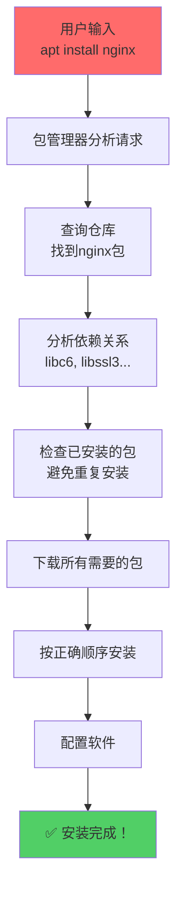
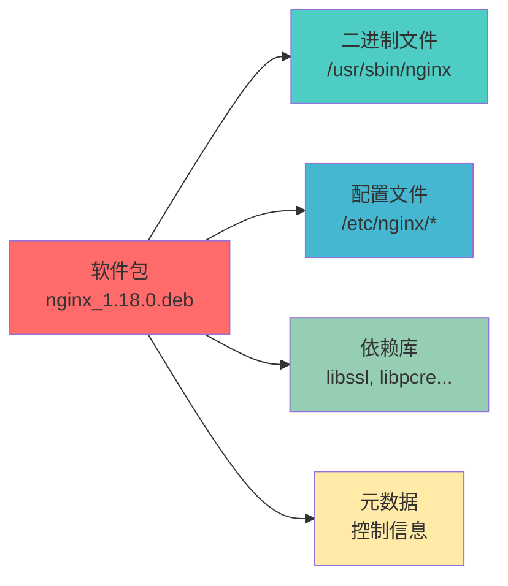
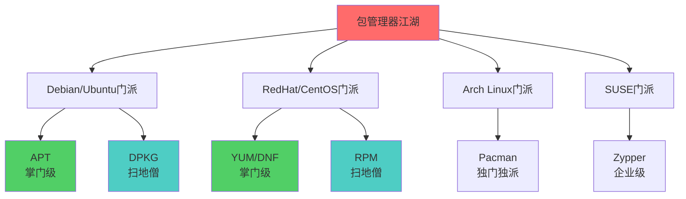
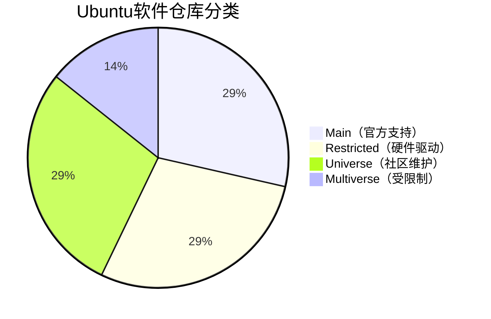

+++
title = "第20章：包管理器概述"
weight = 200
date = "2026-03-24T13:18:28+08:00"
type = "docs"
description = ""
isCJKLanguage = true
draft = false
+++


# 第二十章：包管理器概述

想象一下，你去超市买东西，超市里琳琅满目的商品都整整齐齐地摆在货架上。你不需要去找厂家直接拿货，只需要告诉超市你要什么，超市就会帮你搞定一切——包括从哪里进货、怎么保存、保质期多久等等。

**包管理器就是Linux系统的"超市"！**

你想装个微信？告诉包管理器，它自动帮你下载、帮你装好、帮你处理好各种依赖（就像超市帮你把你要的东西都配套好）。你想删个软件？告诉包管理器，它帮你删得干干净净，不留一丝痕迹。

这一章，我们就来聊聊这个神奇的"包管理器"到底是个什么玩意儿！

---

## 20.1 什么是包管理器？包管理器的工作原理

### 20.1.1 包格式：.deb、.rpm

在Linux世界里，软件包（Package）就是软件的"打包文件"。就像你网购的快递一样，软件被打包成一个文件，你只需要告诉包管理器"给我装这个"，它就会帮你拆包、安装、配置，一条龙服务。

常见的两种包格式：

- **.deb**：Debian/Ubuntu系专用，文件名长得像`nginx_1.18.0_amd64.deb`
- **.rpm**：RedHat/Fedora/CentOS系专用，文件名长得像`nginx-1.18.0-1.el8.x86_64.rpm`

这两种格式互不兼容，就像安卓的APK和iOS的IPA不能互换一样。.deb包在RedHat系上装不上，.rpm包在Debian系上也装不上。不过别担心，包管理器会自动识别你系统的格式，你只需要告诉它"装nginx"，它自然会给你适配好的包。

### 20.1.2 依赖解决

你有没有遇到过这种情况：你想看PDF，结果提示你"需要先安装PDF阅读器"；你装了PDF阅读器，又提示你"需要先安装某个库"；你装了那个库，又提示你"需要先安装另一个东西"……

这就是著名的**依赖地狱**！

包管理器就是来拯救你的**菩萨**！它会自动帮你分析所有依赖关系，然后一次性帮你把需要的东西全部装好。你只需要一句`apt install nginx`，包管理器就会自动分析："装nginx需要这些库，那些库又需要这些组件……"，然后一股脑儿全部给你安排妥当。

### 20.1.3 版本管理

包管理器还负责**版本管理**。它会追踪每个软件装了什么版本、什么时候装的、有没有冲突。

这就相当于给你的软件做了一个**完整的档案记录**：
- 2024-01-01 安装了 nginx 1.18.0
- 2024-03-15 升级到了 nginx 1.19.0
- 2024-06-20 因为出了安全问题，升级到了 nginx 1.20.0

哪天出问题了，包管理器可以帮你**回滚**到之前的版本，就像时光倒流一样！

### 📊 包管理器工作流程图



---

## 20.2 软件包包含什么？

你以为软件包就是一个简单的安装程序？太天真了！一个标准的Linux软件包其实是一个**豪华套餐**，里面包含了好多东西。

### 20.2.1 二进制文件

这是软件的核心——**程序本体**。就是那些`.exe`文件（哦不对，Linux里不叫`.exe`，叫"可执行文件"，没有后缀名）。

比如你装了nginx，它的二进制文件通常在：
- `/usr/sbin/nginx` —— 主程序
- `/usr/bin/nginx` —— 也许是个符号链接

### 20.2.2 配置文件

软件的各种**设置文件**。就像游戏的设置菜单一样，这些配置文件控制着软件怎么运行。

nginx的配置文件通常在：
- `/etc/nginx/nginx.conf` —— 主配置文件
- `/etc/nginx/sites-available/` —— 网站配置目录

### 20.2.3 依赖库

软件运行时需要的**公共库文件**。就像游戏需要DirectX一样，很多软件都需要调用一些公共的代码库。

比如nginx需要这些库：
- `libssl.so.3` —— SSL加密库
- `libpcre.so.3` —— 正则表达式库
- `libz.so.1` —— 压缩库

### 20.2.4 元数据

包管理器自己的"说明书"，告诉系统这个东西叫什么、版本多少、谁开发的、有什么依赖、装完之后要执行什么脚本等等。

这些信息存在：
- `/var/lib/dpkg/info/` —— Debian系的包信息
- `/var/lib/rpm/` —— RPM系的包信息

### 📊 软件包内容结构



---

## 20.3 主要包管理器家族介绍

Linux世界里有好几大"门派"的包管理器，就像武侠小说里的少林、武当、峨眉一样。每个门派都有自己的独门绝技。

### 20.3.1 APT：Debian、Ubuntu（高级工具）

**APT**（Advanced Package Tool）是Debian/Ubuntu系的"掌门级"包管理器，号称"最聪明的包管理器"。

它的特点：
- 自动解决依赖关系
- 支持在线升级
- 仓库搜索功能强大
- 社区支持超级好（Ubuntu的软件源里可能有几十万个包）

代表命令：
```bash
apt update      # 更新软件列表
apt install     # 安装软件
apt upgrade     # 升级软件
```

### 20.3.2 DPKG：Debian、Ubuntu（底层工具）

**DPKG**（Debian Package）是APT的"扫地僧"——真正的幕后高手。APT实际上是调用DPKG来干活的。

你可以把APT理解为"智能助手"，把DPKG理解为"仓库管理员"。你想装软件，APT帮你分析好一切，然后指挥DPKG去执行具体的安装操作。

代表命令：
```bash
dpkg -i package.deb   # 安装一个deb包
dpkg -l                # 列出已安装的包
dpkg -L package       # 查看某个包装了哪些文件
dpkg -S /path/to/file # 查找某个文件属于哪个包
```

### 20.3.3 YUM/DNF：RedHat、CentOS、Fedora

**YUM**（Yellowdog Updater Modified）和**DNF**（Dandified YUM）是RedHat系的包管理器。

- YUM是老前辈，CentOS 7及以前版本用它
- DNF是YUM的升级版，Fedora先采用，CentOS 8之后也用它了

它们的特点：
- 自动解决依赖
- 支持仓库分组
- 企业级支持

代表命令：
```bash
yum install nginx    # 安装nginx
yum update           # 更新所有
dnf upgrade         # 升级（Fedora推荐用dnf）
```

### 20.3.4 RPM：RedHat 系（底层工具）

**RPM**（RPM Package Manager，之前叫RedHat Package Manager）是RedHat系的"DPKG"——底层工具。

YUM/DNF实际上是调用RPM来干活的。RPM直接管理包，但不会自动处理依赖。

代表命令：
```bash
rpm -ivh package.rpm    # 安装
rpm -qa                   # 列出所有已安装的包
rpm -e package           # 卸载
rpm -qi package          # 查看包信息
```

### 20.3.5 Pacman：Arch Linux、Manjaro

**Pacman**是Arch Linux的包管理器，它的口号是："简单即是美"。

Pacman的哲学是**极简主义**——一个命令走天下：

```bash
pacman -S nginx          # 安装nginx（-S = sync）
pacman -Syu             # 升级整个系统（-y = 刷新，-u = 升级）
pacman -R nginx         # 删除nginx（-R = remove）
pacman -Ss nginx        # 搜索nginx（-Ss = search sync）
```

pacman默认不包含图形界面，Arch用户都是"命令行原教旨主义者"。

### 20.3.6 Zypper：SUSE

**Zypper**是openSUSE和SUSE Linux Enterprise的包管理器。

它的特点：
- 支持多种仓库类型
- 对企业用户友好
- 支持补丁管理

代表命令：
```bash
zypper install nginx     # 安装
zypper update            # 更新
zypper remove nginx      # 卸载
zypper search nginx      # 搜索
```

### 📊 包管理器门派一览



---

## 20.4 源码安装 vs 二进制包

在Linux世界，除了用包管理器安装现成的二进制包，还有一种更"硬核"的方式——**从源码编译安装**。

**二进制包安装**（包管理器方式）：
- 省心省力，一条命令搞定
- 包管理器帮你处理一切
- 适合懒人（褒义）

**源码编译安装**：
- 源码 = "食谱"，需要自己"做饭"
- 可以自定义编译选项
- 适合需要精细控制的场景
- 编译过程可能很慢（有的源码编译要半小时）

```bash
# 二进制包安装（简单）
apt install nginx

# 源码编译安装（硬核）
wget http://nginx.org/download/nginx-1.24.0.tar.gz
tar -zxf nginx-1.24.0.tar.gz
cd nginx-1.24.0
./configure
make
make install
```

普通用户建议用二进制包，**不要没事儿就去编译源码**——除非你有特殊需求（比如需要某个特定的编译选项，或者要修改源码）。

---

## 20.5 软件仓库（Repository）

**软件仓库（Repo）**就是存放软件包的地方，可以理解为"软件的仓库"。

包管理器会从仓库里下载你需要的软件，所以你需要告诉包管理器："去哪里下载？"

### 20.5.1 官方源

每个Linux发行版都有自己的**官方软件仓库**，里面经过官方测试，稳定可靠。

Ubuntu的官方源地址示例（在`/etc/apt/sources.list`里）：
```
deb http://archive.ubuntu.com/ubuntu/ jammy main restricted universe multiverse
deb http://archive.ubuntu.com/ubuntu/ jammy-updates main restricted universe multiverse
```

### 20.5.2 镜像源

官方源服务器通常在国外，下载速度可能很慢（如果你在中国的话）。**镜像源**就是在世界各地复制了官方仓库的"副本"，让你从最近的服务器下载，速度更快。

国内常用的镜像源：
- 阿里云镜像：`mirrors.aliyun.com`
- 清华镜像：`mirrors.tuna.tsinghua.edu.cn`
- 中科大镜像：`mirrors.ustc.edu.cn`

### 20.5.3 PPA（Ubuntu）

**PPA**（Personal Package Archive）是Ubuntu特有的"私人软件仓库"。

如果你想给Ubuntu用户发布一个软件，可以创建一个PPA，把你的包上传上去，Ubuntu用户就可以通过PPA安装你的软件了。

```bash
# 添加一个PPA
sudo add-apt-repository ppa:some/ppa

# 然后就可以安装了
sudo apt update
sudo apt install some-package
```

PPA就像是Ubuntu世界的"个人公众号"，开发者可以自己发布软件，不用经过官方审核。

### 📊 Ubuntu软件源分类



---

## 本章小结

本章我们学习了Linux包管理器的基础知识：

### 🔑 核心知识点

1. **包管理器是什么**：
   - Linux系统的"软件超市"
   - 自动处理依赖关系
   - 版本管理、升级、卸载一条龙

2. **两种主要包格式**：
   - .deb（Debian/Ubuntu系）
   - .rpm（RedHat/CentOS系）

3. **包管理器门派**：
   - Debian/Ubuntu：APT + DPKG
   - RedHat/CentOS：YUM/DNF + RPM
   - Arch Linux：Pacman
   - SUSE：Zypper

4. **软件仓库**：
   - 官方源：稳定，经过测试
   - 镜像源：国内加速
   - PPA：Ubuntu的私人软件仓库

### 💡 记住这个原则

> **能用包管理器装的，就别编译源码。** 包管理器会帮你处理依赖、更新、卸载，省心省力还安全。

---

**当前时间：2026年3月23日 21:20:03**
**已完成"第二十章"，目前处理"第二十一章"**
