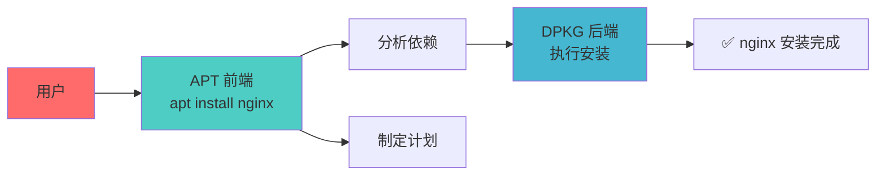

+++
title = "第21章：Ubuntu/Debian 包管理（APT）"
weight = 210
date = "2026-03-24T13:18:28+08:00"
type = "docs"
description = ""
isCJKLanguage = true
draft = false
+++


# 第二十一章：Ubuntu/Debian 包管理（APT）

这一章我们来聊聊Ubuntu和Debian的包管理器——**APT**。

如果说Linux是一个江湖，那APT就是这个江湖里最流行的"万能工具箱"。不管是装软件、卸载软件、还是升级系统，一条命令全搞定。

Debian的用户说："我们的APT天下第一！"
Ubuntu的用户说："我们用的是改良版的APT，更香！"
然后Arch用户默默飘过："我们用pacman，一条命令走天下……"

别吵别吵，让我们来看看APT到底有什么本事！

---

## 21.1 APT 工作原理：前端与后端

APT其实是一个**两层架构**的系统：

- **前端（APT）**：负责和用户交互、分析依赖、决定安装顺序等"智能化"的工作
- **后端（DPKG）**：负责实际的安装、配置等"体力活"

你可以把APT理解为"老板"，把DPKG理解为"员工"。老板负责思考和决策，员工负责干活。



当你执行`apt install nginx`时，APT会：
1. 查询软件仓库，找到nginx包
2. 分析nginx依赖哪些库
3. 检查系统中已安装了哪些库
4. 计算出需要额外安装哪些库
5. 生成安装计划
6. 调用DPKG执行安装

---

## 21.2 apt 与 apt-get 的区别：该用哪个？

这是一个让很多新手困惑的问题："都是APT，到底该用`apt`还是`apt-get`？"

### 21.2.1 apt：用户友好，彩色输出

`apt`是后来出的"新版本"，主打**用户体验**：

```bash
# apt 会显示彩色输出，更直观
apt install nginx

# apt 会显示进度条
apt upgrade

# apt 会提示你有哪些重要更新
apt list --upgradable
```

apt的输出更友好，更适合人类阅读。但apt的输出可能会有变化，因为它面向最终用户。

### 21.2.2 apt-get：更底层，稳定

`apt-get`是"老前辈"，主打**稳定性**：

```bash
# apt-get 适合脚本使用
apt-get install nginx

# apt-get 的输出格式固定
apt-get upgrade
```

apt-get的输出格式是**固定的**，不会因为版本更新而改变，所以**脚本和自动化工具**通常用apt-get。

### 总结：该用哪个？

| 场景 | 推荐命令 |
|------|----------|
| 日常使用（人类用户） | `apt` |
| Shell脚本（自动化） | `apt-get` |
| 需要固定输出格式 | `apt-get` |

简单来说：**人类用户用`apt`，程序用`apt-get`**。

---

## 21.3 apt update：更新软件列表

在你安装任何软件之前，**第一步永远是`apt update`**！

### 21.3.1 读取 /etc/apt/sources.list

`apt update`会读取`/etc/apt/sources.list`文件，这个文件里记录了你从哪里下载软件：

```bash
# 查看软件源配置
cat /etc/apt/sources.list
```

输出大概是：

```
deb http://archive.ubuntu.com/ubuntu/ jammy main restricted universe multiverse
deb http://archive.ubuntu.com/ubuntu/ jammy-updates main restricted universe multiverse
deb http://security.ubuntu.com/ubuntu jammy-security main restricted universe multiverse
```

> 🐱 **版本代号趣闻**：Ubuntu每个版本都用动物命名，而且都是字母顺序：
> - 22.04 LTS = **Jammy** Jellyfish（水母）🪼
> - 20.04 LTS = **Focal** Fossa（马达加斯加长尾狸猫）🐱
> - 18.04 LTS = **Bionic** Beaver（河狸）🦫
> - 16.04 LTS = **Xenial** Xerus（非洲地松鼠）🐿️
> 
> 看出来了吗？Jammy、Focal、Bionic、Xenial...都是按字母顺序排的！这就是Ubuntu的版本代号规律。

### 21.3.2 从仓库下载软件包列表

`apt update`会连接这些仓库，下载最新的**软件包列表**（不是下载软件本身，只是下载一个"菜单"）：

```bash
# 更新软件包列表
sudo apt update

# 输出大概是：
# Hit:1 http://archive.ubuntu.com/ubuntu jammy InRelease
# Hit:2 http://security.ubuntu.com/ubuntu jammy-security InRelease
# Reading package lists... Done
# Building dependency tree... Done
# All packages are up to date.
```

> [!NOTE]
> `apt update`只是更新"软件包列表"，不是升级软件！升级软件要用`apt upgrade`。

---

## 21.4 apt upgrade：升级所有软件

更新完软件列表之后，你可能想升级所有已安装的软件到最新版本。这就是`apt upgrade`的工作！

### 21.4.1 不删除任何包

`apt upgrade`是一个**温和的升级**：
- 它只会升级已有的包
- **不会删除任何已安装的包**
- **不会安装新的包**（只是升级现有的）

### 21.4.2 智能升级

```bash
# 升级所有可升级的软件
sudo apt upgrade

# 输出大概是：
# Reading package lists... Done
# Building dependency tree... Done
# The following packages will be upgraded:
#   libssl3 3.0.2-0ubuntu1.10
#   nginx 1.18.0-6ubuntu1.2
# 2 packages upgraded, 0 newly installed, 0 to remove.
# Need to get 1.5 MB of archives.
# After this operation, 0 B of additional disk space will be used.
```

```bash
# 如果想看详细信息（升级哪些、哪些会被跳过）
sudo apt upgrade -V
# -V 显示详细信息
```

---

## 21.5 apt dist-upgrade：系统升级

`apt dist-upgrade`是一个**激进版的升级**。

### 21.5.1 处理依赖变化

有些软件的升级会涉及到**依赖关系的变化**：
- 新版本可能需要新的库
- 新版本可能废弃某些旧的库

`dist-upgrade`会**智能处理**这些依赖变化。

### 21.5.2 可能删除旧包

与`upgrade`不同，`dist-upgrade`在必要时**会删除某些包**（比如一个包被新版替代了）。

```bash
# 激进升级（可能删除包）
sudo apt dist-upgrade

# 提示：
# The following packages were automatically installed and are no longer required:
#   liboldpkg1
# Use 'apt autoremove' to remove them.
```

> [!WARNING]
> `dist-upgrade`可能会删除一些包，日常使用`upgrade`就够了。只有在**系统大版本升级**（比如Ubuntu 22.04到24.04）时才需要`dist-upgrade`。

---

## 21.6 apt install：安装软件

好了，终于到了安装软件的环节！这是你最常用的命令。

### 21.6.1 apt install nginx

```bash
# 安装nginx
sudo apt install nginx
```

输出大概是：

```
Reading package lists... Done
Building dependency tree... Done
The following NEW packages will be installed:
  nginx nginx-common nginx-core
0 upgraded, 3 newly installed, 0 to remove.
Need to get 500 KB of archives.
After this operation, 1500 KB of additional disk space will be used.
Do you want to continue? [Y/n]
```

输入`Y`或直接回车确认安装。

### 21.6.2 apt install -y 自动确认

如果你不想每次都按`Y`，可以用`-y`参数自动确认：

```bash
# 自动确认安装（不再询问）
sudo apt install -y nginx
```

这在**脚本**里特别有用！

### 21.6.3 apt install --reinstall 重新安装

有时候软件出问题了，想重新安装（覆盖安装）：

```bash
# 重新安装nginx
sudo apt install --reinstall nginx
```

这会：
1. 先卸载现有的nginx
2. 再重新安装nginx
3. 配置文件通常会保留（除非你用`--purge`）

---

## 21.7 apt remove：卸载软件（保留配置）

想删掉一个软件，但**保留配置文件**？用`apt remove`：

```bash
# 卸载nginx（保留配置）
sudo apt remove nginx

# 输出：
# The following packages will be REMOVED:
#   nginx nginx-common nginx-core
# 0 upgraded, 0 newly installed, 3 to remove.
# After this operation, 500 KB disk space will be freed.
```

> [!NOTE]
> `apt remove`会卸载软件包，但**不会删除配置文件**。配置文件通常在`/etc/nginx/`目录下。删除软件后，这些配置文件还在。

---

## 21.8 apt purge：完全卸载（删除配置）

想删得**干干净净**？用`apt purge`！

### 21.8.1 apt purge nginx

```bash
# 完全卸载nginx（包括配置文件）
sudo apt purge nginx

# 或者 combine remove and purge
sudo apt remove --purge nginx
```

```bash
# 输出：
# The following packages will be REMOVED:
#   nginx nginx-common nginx-core
# The following configuration files will be removed:
#   /etc/nginx/nginx.conf
#   /etc/nginx/sites-enabled/default
# Configuration files in '/etc/nginx' have not been removed.
# Use 'apt purge' if you want to remove these configuration files.
```

> [!WARNING]
> `purge`会删除配置文件！如果你是主动卸载想重装，建议用`remove`；如果是真的不要了，才用`purge`。

---

## 21.9 apt autoremove：自动清理无用依赖

你有没有遇到过这种情况：安装了一个软件，它带来了很多"帮手"（依赖），后来你卸载了主软件，但这些"帮手"还在系统里占地方？

`apt autoremove`就是来清理这些**孤儿的**！

```bash
# 自动清理无用的依赖包
sudo apt autoremove

# 输出：
# The following packages will be REMOVED:
#   libsomething1 libuseless2
# 0 upgraded, 0 newly installed, 2 to remove.
```

```bash
# 建议定期运行一下，保持系统干净
sudo apt autoremove -y
```

> [!TIP]
> 建议每次`apt remove`之后都跑一下`apt autoremove`，保持系统干净整洁！

---

## 21.10 apt search：搜索软件

不知道软件叫什么名字？先搜一搜！

```bash
# 搜索nginx相关的包
apt search nginx

# 输出大概是：
# Sorting... Done
# Full Text Search... Done
# nginx/bionic-updates,bionic-security 1.14.0.orig.tar.gz.asc - 1.18.0-6ubuntu1.4 amd64
#   HTTP server and reverse proxy, as well as IMAP/POP3 proxy server
#
# nginx-common/bionic-updates,bionic-security 1.14.0.orig.tar.gz.asc.asc - 1.18.0-6ubuntu1.4 all
#   Helpers for configuring nginx
```

```bash
# 支持正则表达式搜索
apt search "^python.*$"
```

> [!NOTE]
> `apt search`会搜索包的名字和描述，如果你记得软件的一部分名字，直接搜就行。

---

## 21.11 apt show：查看软件信息

找到了软件，想看看详细信息？用`apt show`！

### 21.11.1 包大小

```bash
# 查看nginx包的详细信息
apt show nginx
```

输出大概是：

```
Package: nginx
Version: 1.18.0-6ubuntu1.4
Priority: optional
Section: httpd
Maintainer: Ubuntu Developers <ubuntu-devel-discuss@lists.ubuntu.com>
Original-Maintainer: Debian Nginx Maintainers <pkg-nginx-maintainers@lists.alioth.debian.org>
Installed-Size: 45.2 KB
Depends: nginx-common, nginx-core
Recommends: logrotate
Suggests: document-terminus
Size: 45.2 KB
Homepage: https://nginx.org
Download-Size: 500 KB
APT-Manual-Installed: no
APT-Sources: http://archive.ubuntu.com/ubuntu jammy-updates/main amd64 Packages
Description: HTTP server and reverse proxy
 nginx (pronounced "engine-x") is an HTTP and reverse proxy server...
```

### 21.11.2 依赖关系

看`Depends`字段，这里写着nginx**依赖**哪些包：
- `nginx-common`
- `nginx-core`

如果你想看**反向依赖**（哪些包依赖nginx），用`apt-cache rdepends`（后面会讲）。

### 21.11.3 描述信息

看`Description`字段，这里详细描述了这个包是干嘛的。

---

## 21.12 apt list：列出已安装软件

想知道你系统里装了哪些软件？`apt list`来帮你！

### 21.12.1 apt list --installed

```bash
# 列出所有已安装的包
apt list --installed

# 输出大概是：
# Listing...
adduser/jammy,now 3.131 all [installed]
apt/jammy,now 2.4.11 amd64 [installed]
bash/jammy,now 5.1-6ubuntu1 amd64 [installed]
nginx/jammy,now 1.18.0-6ubuntu1.4 amd64 [installed]
...
```

```bash
# 只看特定包
apt list --installed nginx

# 输出：
# nginx/jammy,now 1.18.0-6ubuntu1.4 amd64 [installed]
```

### 21.12.2 apt list --upgradable

```bash
# 列出所有可升级的包
apt list --upgradable

# 输出大概是：
# Listing...
nginx/jammy-updates 1.18.0-6ubuntu1.5 amd64 [upgradable from: 1.18.0-6ubuntu1.4]
openssl/jammy-security 3.0.2-0ubuntu1.10 amd64 [upgradable from: 3.0.2-0ubuntu1.9]
```

---

## 21.13 apt-cache：apt 的缓存工具

`apt-cache`是一个**查询工具**，用来在本地缓存的包列表里查找信息。

### 21.13.1 apt-cache depends 包名

查看某个包的**依赖关系**：

```bash
# 查看nginx依赖哪些包
apt-cache depends nginx

# 输出：
# nginx
# Depends: nginx-common
# Depends: nginx-core
```

### 21.13.2 apt-cache rdepends 包名

查看**反向依赖**——哪些包**依赖**这个包：

```bash
# 查看哪些包依赖nginx
apt-cache rdepends nginx

# 输出：
# nginx
# Reverse Depends:
#   nginx-full
#   nginx-light
#   nginx-extras
```

> [!NOTE]
> `apt-cache`只是查询工具，不会修改任何东西，很安全！

---

## 21.14 dpkg 基础命令

终于轮到DPKG出场了！这是APT的"幕后英雄"。

### 21.14.1 dpkg -i xxx.deb：安装

直接安装一个`.deb`文件：

```bash
# 安装一个deb包
sudo dpkg -i package.deb
```

> [!NOTE]
> `dpkg -i`不会自动处理依赖！如果这个包依赖其他包，你需要先手动安装那些依赖，或者用`apt install -f`来修复。

### 21.14.2 dpkg -l：列出已安装

```bash
# 列出所有已安装的包
dpkg -l

# 只看特定的包
dpkg -l nginx

# 输出：
# Desired=Unknown/Install/Remove/Hold/Purge
# | Status=Not/Inst/Conf-files/Unpacked/halF-conf/Half-inst/trig-aWait/Trig-pend
# |/ Err?=(none)/Reinst-required (Status,Err: uppercase=bad)
# ||/ Name          Version      Architecture Description
# +++-=============-============-============-=================================
# ii  nginx         1.18.0-6ub~ amd64         HTTP server and reverse proxy
```

### 21.14.3 dpkg -L 包名：列出文件

查看某个包装了**哪些文件**：

```bash
# 查看nginx装了哪些文件
dpkg -L nginx

# 输出：
# /.
/usr
/usr/sbin
/usr/sbin/nginx
/etc
/etc/nginx
/etc/nginx/nginx.conf
...
```

### 21.14.4 dpkg -S 文件：查找包

知道一个文件，想知道它属于**哪个包**？

```bash
# 查找这个文件属于哪个包
dpkg -S /usr/sbin/nginx

# 输出：
# nginx: /usr/sbin/nginx
```

---

## 21.15 deb 包安装：dpkg -i xxx.deb

有时候你需要手动安装一个`.deb`文件，比如从网上下载的第三方软件。

### 21.15.1 依赖问题处理

```bash
# 直接安装可能会遇到依赖问题
sudo dpkg -i package.deb

# 输出：
# dpkg: dependency problems prevent configuration of package:
#  package depends on libssl1.1; however:
#   Package libssl1.1 is not installed.
```

### 21.15.2 apt install -f 修复

遇到依赖问题怎么办？用`apt install -f`来**自动修复**！

```bash
# 自动修复依赖关系
sudo apt install -f

# 输出：
# The following packages will be installed:
#   libssl1.1
# 0 upgraded, 1 newly installed, 0 to remove.
# Need to get 1.5 MB of archives.
# After this operation, 3.5 MB of additional disk space will be used.
```

> [!TIP]
> 正确的安装顺序是：
> 1. `sudo dpkg -i package.deb`
> 2. 如果报依赖错误，执行`sudo apt install -f`修复

---

## 21.16 依赖问题解决

依赖问题是Linux安装软件时最常见的问题之一。

### 21.16.1 apt install -f

就像上面说的，`apt install -f`（`--fix-broken`）会**自动安装缺失的依赖**。

### 21.16.2 手动安装依赖

有时候`apt install -f`也解决不了，你需要手动把依赖一个个装上：

```bash
# 1. 先看缺什么依赖
sudo dpkg -i package.deb

# 报错：
# package depends on libssl1.1, libpcre3, libz1

# 2. 手动安装这些依赖
sudo apt install libssl1.1 libpcre3 libz1

# 3. 再重新安装主包
sudo dpkg -i package.deb
```

```bash
# 如果仓库里有这个包，可以直接一条命令
sudo apt-get install -f
```

> [!TIP]
> 最佳实践：尽量用`apt install`而不是`dpkg -i`！因为`apt`会自动处理所有依赖问题。

---

## 本章小结

本章我们学习了Ubuntu/Debian的APT包管理器：

### 🔑 核心知识点

1. **APT vs apt-get**：
   - `apt`：面向人类用户，输出友好，有彩色显示
   - `apt-get`：面向脚本，输出稳定，不易变动

2. **日常命令**：
   - `apt update`：更新软件包列表
   - `apt upgrade`：升级所有软件
   - `apt install 包名`：安装软件
   - `apt remove 包名`：卸载（保留配置）
   - `apt purge 包名`：卸载（删除配置）

3. **查询命令**：
   - `apt search`：搜索软件
   - `apt show`：查看软件详情
   - `apt list --installed`：列出已安装

4. **DPKG底层命令**：
   - `dpkg -i package.deb`：安装deb包
   - `dpkg -l`：列出已安装
   - `dpkg -L 包名`：查看包装了哪些文件
   - `dpkg -S 文件`：查找文件属于哪个包

5. **依赖问题**：
   - `apt install -f`：自动修复依赖
   - 尽量用`apt install`而不是`dpkg -i`

### 💡 记住这个原则

> **能用`apt install`就别用`dpkg -i`！** APT会帮你处理所有依赖问题，省心省力！

---

**当前时间：2026年3月23日 21:28:03**
**已完成"第二十一章"，目前处理"第二十二章"**


