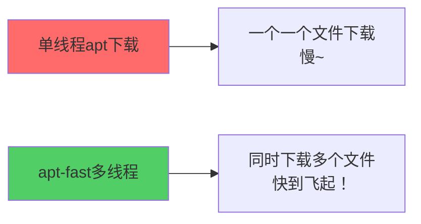
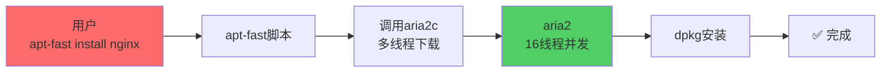

+++
title = "第22章：apt-fast 多线程加速"
weight = 220
date = "2026-03-24T13:18:28+08:00"
type = "docs"
description = ""
isCJKLanguage = true
draft = false
+++


# 第二十二章：apt-fast 多线程加速

你有没有遇到过这种情况：带宽明明是100Mbps，但apt下载软件只有几百KB/s，慢得像蜗牛爬？

这通常是**单线程下载**的问题。apt默认一次只从服务器下载一个文件，就像单车道的高速公路，车一多就堵。

**apt-fast**就是来解决这个问题的！它可以让apt像高铁一样快，多线程下载，软件秒装！

这一章，我们来聊聊怎么让apt飞速运行！

---

## 22.1 为什么需要 apt-fast？下载速度优化

### 22.1.1 默认单线程下载

apt默认情况下是**单线程下载**的：

```bash
# 用apt下载，你会看到它是一个文件一个文件地下载
sudo apt install nginx

# 下载过程中显示：
# Get:1 http://archive.ubuntu.com/ubuntu jammy/main amd64 nginx amd64 1.18.0-6ubuntu1.4 [500 KB]
# 100%[===================>] 500 KB   200 KB/s   time 2.5s
```

如果你网速是100Mbps，理论上下载速度可以达到12.5MB/s，但apt单线程可能只能跑到几MB/s，甚至更慢。

### 22.1.2 多线程加速原理

apt-fast使用**aria2**作为下载工具，aria2支持**多线程并发下载**：



一个100MB的软件包：
- 单线程apt：可能需要60秒
- apt-fast（8线程）：可能只需要8秒

这就是差距！

---

## 22.2 apt-fast 安装：添加 PPA 或手动安装

### 22.2.1 add-apt-repository ppa:apt-fast/stable

Ubuntu用户可以通过PPA安装apt-fast：

```bash
# 1. 添加apt-fast的PPA
sudo add-apt-repository ppa:apt-fast/stable -y

# 2. 更新软件列表
sudo apt update

# 3. 安装apt-fast（会提示配置最大连接数）
sudo apt install apt-fast -y
```

> 💡 **PPA是什么？** PPA（Personal Package Archive）是Ubuntu的"个人软件源"，就像有人自己开了个小超市，卖官方超市里没有的东西。apt-fast的PPA就是开发者自己维护的软件源。

### 22.2.2 apt update && apt install apt-fast

```bash
# 完整安装流程
sudo apt update
sudo apt install apt-fast -y
```

安装过程中会让你配置**最大连接数**（默认是5，建议改成16或32）。

---

## 22.3 apt-fast 配置：修改 MAXCONN 参数

### 22.3.1 配置文件：/etc/apt-fast.conf

apt-fast的配置文件在`/etc/apt-fast.conf`：

```bash
# 查看当前配置
cat /etc/apt-fast.conf
```

```bash
# 配置文件示例：
# deb http://archive.ubuntu.com/ubuntu/ jammy main restricted universe multiverse
# deb http://archive.ubuntu.com/ubuntu/ jammy-updates main restricted universe multiverse
# deb http://archive.ubuntu.com/ubuntu/ jammy-security main restricted universe multiverse

# 最大连接数
MAXCONN=16

# 每个镜像的最大连接数
MAXCONN_PER_MIRROR=4

# 下载工具（aria2c）
DOWNLOADBINE=aria2c

# APT/Debian configuration example
_aptSourcesList='/etc/apt/sources.list.d/*.list'
```

### 22.3.2 MAXCONN=10：最大连接数

`MAXCONN`是最大并发连接数，可以调大来加速：

```bash
# 编辑配置文件
sudo nano /etc/apt-fast.conf

# 修改MAXCONN的值
MAXCONN=32

# 保存退出（nano: Ctrl+O, Ctrl+X）
```

> [!NOTE]
> 如果你带宽很大（比如千兆网络），可以设置更高的值。但太高可能会对服务器造成负担，也可能导致连接被封。

---

## 22.4 apt-fast 镜像源配置：阿里云、清华源

使用国内镜像源可以大幅提升下载速度！

```bash
# 编辑apt-fast配置
sudo nano /etc/apt-fast.conf
```

配置示例（阿里云镜像）：

```
deb http://mirrors.aliyun.com/ubuntu/ jammy main restricted universe multiverse
deb http://mirrors.aliyun.com/ubuntu/ jammy-updates main restricted universe multiverse
deb http://mirrors.aliyun.com/ubuntu/ jammy-security main restricted universe multiverse
deb http://mirrors.aliyun.com/ubuntu/ jammy-backports main restricted universe multiverse
```

或者清华镜像：

```
deb https://mirrors.tuna.tsinghua.edu.cn/ubuntu/ jammy main restricted universe multiverse
deb https://mirrors.tuna.tsinghua.edu.cn/ubuntu/ jammy-updates main restricted universe multiverse
deb https://mirrors.tuna.tsinghua.edu.cn/ubuntu/ jammy-security main restricted universe multiverse
```

---

## 22.5 apt-fast 使用：apt-fast install xxx

### 22.5.1 使用 aria2c 多线程下载

apt-fast的用法和apt一样，只是把`apt`换成`apt-fast`：

```bash
# 用apt-fast安装nginx
sudo apt-fast install nginx

# 输出大概是：
# [apt-fast] apt-get install --yes nginx
# Downloading 3 packages with aria2c...
#  ...   0% Download rate: 12.5 MB/s   ETA: 0s
#  ... 100% Download rate: 12.5 MB/s   ETA: 0s
# Reading package lists... Done
# Building dependency tree... Done
# 0 upgraded, 3 newly installed.
# Done.
```

### 22.5.2 与 apt 兼容

apt-fast完全兼容apt的用法：

```bash
# 安装
sudo apt-fast install nginx

# 升级
sudo apt-fast upgrade

# 更新
sudo apt-fast update

# 卸载（apt-fast没有remove子命令，用apt remove即可）
sudo apt remove nginx
```

---

## 22.6 apt-fast 原理：aria2 多线程下载

apt-fast的背后功臣是**aria2**。aria2是一个轻量级的多协议下载工具，支持：

- HTTP/HTTPS 多线程下载
- FTP 多线程下载
- BitTorrent 下载
- 金属ink（这个不太常用）

apt-fast实际上是一个**脚本**，它调用aria2来下载`.deb`包，然后用dpkg安装。



---

## 22.7 国内镜像源配置：加速软件安装

### 22.7.1 阿里云镜像配置

```bash
# 备份原来的源
sudo cp /etc/apt/sources.list /etc/apt/sources.list.bak

# 更换为阿里云源
sudo bash -c 'cat > /etc/apt/sources.list << EOF
deb http://mirrors.aliyun.com/ubuntu/ jammy main restricted universe multiverse
deb http://mirrors.aliyun.com/ubuntu/ jammy-updates main restricted universe multiverse
deb http://mirrors.aliyun.com/ubuntu/ jammy-security main restricted universe multiverse
deb http://mirrors.aliyun.com/ubuntu/ jammy-backports main restricted universe multiverse
EOF'

# 更新
sudo apt update
```

### 22.7.2 清华镜像配置

```bash
# 更换为清华源
sudo bash -c 'cat > /etc/apt/sources.list << EOF
deb https://mirrors.tuna.tsinghua.edu.cn/ubuntu/ jammy main restricted universe multiverse
deb https://mirrors.tuna.tsinghua.edu.cn/ubuntu/ jammy-updates main restricted universe multiverse
deb https://mirrors.tuna.tsinghua.edu.cn/ubuntu/ jammy-security main restricted universe multiverse
deb https://mirrors.tuna.tsinghua.edu.cn/ubuntu/ jammy-backports main restricted universe multiverse
EOF'

# 更新
sudo apt update
```

### 22.7.3 华为云镜像配置

```bash
# 华为云镜像
sudo bash -c 'cat > /etc/apt/sources.list << EOF
deb http://repo.huaweicloud.com/ubuntu/ jammy main restricted universe multiverse
deb http://repo.huaweicloud.com/ubuntu/ jammy-updates main restricted universe multiverse
deb http://repo.huaweicloud.com/ubuntu/ jammy-security main restricted universe multiverse
EOF'

sudo apt update
```

### 22.7.4 网易镜像配置

```bash
# 网易镜像
sudo bash -c 'cat > /etc/apt/sources.list << EOF
deb http://mirrors.163.com/ubuntu/ jammy main restricted universe multiverse
deb http://mirrors.163.com/ubuntu/ jammy-updates main restricted universe multiverse
deb http://mirrors.163.com/ubuntu/ jammy-security main restricted universe multiverse
EOF'

sudo apt update
```

---

## 22.8 sources.list 详解：deb 行的格式

### 22.8.1 deb uri distribution component

`/etc/apt/sources.list`里的每一行都是一个软件源，格式是：

```
deb 镜像地址 Ubuntu版本代号 主仓库
```

例如：

```
deb http://mirrors.aliyun.com/ubuntu/ jammy main restricted universe multiverse
```

| 部分 | 含义 |
|------|------|
| `deb` | 二进制包（还有`deb-src`表示源码包） |
| `http://mirrors.aliyun.com/ubuntu/` | 镜像地址 |
| `jammy` | Ubuntu 22.04的代号 |
| `main restricted universe multiverse` | 仓库组件 |

Ubuntu代号：
- Ubuntu 24.04 → `noble`
- Ubuntu 22.04 → `jammy`
- Ubuntu 20.04 → `focal`

### 22.8.2 deb-src：源码包

如果你需要**下载源码**，要添加`deb-src`行：

```
deb-src http://mirrors.aliyun.com/ubuntu/ jammy main restricted universe multiverse
```

```bash
# 下载nginx源码
sudo apt-get source nginx

# 安装构建依赖
sudo apt-get build-dep nginx
```

---

## 22.9 换源实战：Ubuntu 22.04 换源

完整换源流程：

```bash
# 1. 备份原来的源
sudo cp /etc/apt/sources.list /etc/apt/sources.list.bak

# 2. 查看Ubuntu版本代号
lsb_release -cs

# 输出应该是：jammy

# 3. 写入新的源
sudo bash -c 'cat > /etc/apt/sources.list << EOF
deb http://mirrors.aliyun.com/ubuntu/ jammy main restricted universe multiverse
deb http://mirrors.aliyun.com/ubuntu/ jammy-updates main restricted universe multiverse
deb http://mirrors.aliyun.com/ubuntu/ jammy-security main restricted universe multiverse
deb http://mirrors.aliyun.com/ubuntu/ jammy-backports main restricted universe multiverse
EOF'

# 4. 更新软件列表
sudo apt update

# 5. 升级所有软件
sudo apt upgrade -y
```

> [!TIP]
> 换源后第一次`apt update`可能会警告一些key问题，运行这个命令修复：
> ```bash
> sudo apt install -y ubuntu-keyring
> ```

---

## 本章小结

本章我们学习了apt-fast多线程加速：

### 🔑 核心知识点

1. **为什么需要apt-fast**：
   - apt默认单线程下载，速度有限
   - apt-fast使用aria2多线程下载，速度飙升

2. **安装apt-fast**：
   - `sudo add-apt-repository ppa:apt-fast/stable`
   - `sudo apt install apt-fast`

3. **配置**：
   - 配置文件：`/etc/apt-fast.conf`
   - `MAXCONN`：最大并发连接数

4. **国内镜像源**：
   - 阿里云：`mirrors.aliyun.com`
   - 清华：`mirrors.tuna.tsinghua.edu.cn`
   - 华为云：`repo.huaweicloud.com`

5. **使用**：
   - 把`apt`换成`apt-fast`即可
   - `apt-fast install 包名`

### 💡 记住这个原则

> **带宽大、下载多，就用apt-fast！** 多线程下载，速度提升10倍不是梦！

---

**当前时间：2026年3月23日 21:36:03**
**已完成"第二十二章"，目前处理"第二十三章"**

