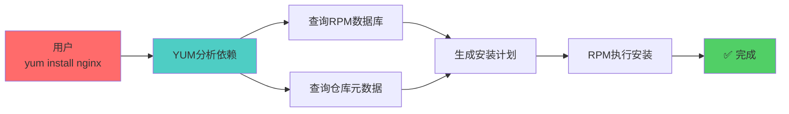

+++
title = "第23章：RedHat/CentOS 包管理（YUM/DNF）"
weight = 230
date = "2026-03-24T13:18:28+08:00"
type = "docs"
description = ""
isCJKLanguage = true
draft = false
+++


# 第二十三章：RedHat/CentOS 包管理（YUM/DNF）

如果说Ubuntu是Linux界的"大众"，那RedHat/CentOS就是Linux界的"丰田"——稳定、可靠、企业级！

RedHat系的包管理器是**YUM**和**DNF**，它们的使命和APT一样——让软件安装变得简单。

这一章，我们来聊聊RedHat世界的包管理之道！

---

## 23.1 RPM 包管理器：RPM 数据库

### 23.1.1 RPM 数据库：/var/lib/rpm

RPM（RedHat Package Manager）管理系统里有一个**数据库**，记录着所有已安装的RPM包信息。

```bash
# RPM数据库位置
ls -la /var/lib/rpm

# 输出大概是：
# total 4
# -rw-r--r-- 1 root root 4096 Jan 15 10:00 Packages
# -rw-r--r-- 1 root root 4096 Jan 15 10:00 Basenames
# -rw-r--r-- 1 root root 4096 Jan 15 10:00 Requirename
# ...
```

这个数据库帮RPM追踪：
- 已安装了什么包
- 每个包包含哪些文件
- 包的版本信息
- 依赖关系

### 23.1.2 YUM 依赖解决

YUM（Yellowdog Updater Modified）是基于RPM的**智能层**，它能自动解决依赖问题。



---

## 23.2 YUM 工作原理

YUM是CentOS 7及以前默认的包管理器。

### 23.2.1 仓库配置：.repo 文件

YUM通过`.repo`文件来知道去哪里下载软件：

```bash
# 查看仓库配置目录
ls -la /etc/yum.repos.d/

# 输出大概是：
# CentOS-Base.repo
# CentOS-AppStream.repo
# CentOS-Extras.repo
```

### 23.2.2 元数据缓存

YUM会缓存仓库的**元数据**，加快查询速度：

```bash
# 清除YUM缓存
sudo yum clean all

# 查看缓存
ls -la /var/cache/yum/
```

---

## 23.3 DNF 包管理器：YUM 的替代品

DNF（Dandified YUM）是YUM的"升级版"，从Fedora 22开始成为默认包管理器，后来CentOS 8也采用了DNF。

### 23.3.1 Fedora 首先采用

Fedora认为YUM太老了，于是创造了DNF。DNF解决了YUM的一些历史遗留问题，性能更好。

> 🎩 **命名趣闻**：DNF的全称是"Dandified YUM"，dandified意思是"时髦的、打扮花哨的"。就像YUM换了身新衣服，变成了时髦的DNF！

```bash
# Fedora查看DNF版本
dnf --version
```

### 23.3.2 CentOS 8+ 默认

CentOS 8开始默认使用DNF，但YUM仍然是DNF的软链接，所以`yum`和`dnf`命令基本可以互换：

```bash
# CentOS 8上，这两个命令是一样的
yum install nginx
dnf install nginx
```

> [!NOTE]
> 日常使用中，`yum`和`dnf`的用法几乎完全一样。本章会混用这两个命令（以`yum`为主，因为更广为人知）。

---

## 23.4 yum/dnf install：安装软件

```bash
# 安装nginx（CentOS 7）
sudo yum install nginx

# 安装nginx（CentOS 8+ / Fedora）
sudo dnf install nginx

# 自动确认安装
sudo yum install -y nginx

# 从指定仓库安装
sudo yum install --enablerepo=epel nginx
```

```bash
# 输出大概是：
# Loaded plugins: fastestmirror
# Determining fastest mirrors
# Resolving Dependencies
# --> Running transaction check
# ---> Package nginx.x86_64 1:1.20.1-1.el8 will be installed
# --> Processing Dependency: httpd-filesystem = 1:1.20.1-1.el8 for package: nginx-1:1.20.1-1.el8.x86_64
# --> Running transaction test
# --> Package nginx.x86_64 1:1.20.1-1.el8 will be installed
# Install  1 Package (+3 dependent packages)
# Total download size: 1.5 MB
# Installed size: 4.5 MB
# Is this ok [Y/d/N]:
```

输入`Y`确认安装。

---

## 23.5 yum/dnf remove：卸载软件

```bash
# 卸载nginx
sudo yum remove nginx

# 或者
sudo dnf remove nginx

# 自动确认卸载
sudo yum remove -y nginx
```

> [!NOTE]
> `yum remove`会删除软件包，但**不会删除配置文件**（和Debian的`apt remove`类似）。如果要完全删除，用`yum remove`加`--purge`？（其实RPM系统没有`--purge`选项，配置文件会保留）。

---

## 23.6 yum/dnf update：更新软件

### 23.6.1 yum update：更新所有

```bash
# 更新所有可更新的包
sudo yum update

# 自动确认
sudo yum update -y
```

### 23.6.2 yum update 包名：更新指定

```bash
# 只更新nginx
sudo yum update nginx

# 更新所有以php开头的包
sudo yum update php*
```

```bash
# 查看可更新的包
yum list updates

# 输出大概是：
# Loaded plugins: fastestmirror
# nginx.x86_64         1:1.20.1-1.el8      @base
# openssl.x86_64       1:1.1.1-14.el8_5   @base
```

---

## 23.7 yum/dnf search：搜索软件

```bash
# 搜索nginx
yum search nginx

# 输出大概是：
# Loaded plugins: fastestmirror
# ================ Matched: nginx ===================
# nginx.x86_64 : High performance web server
# nginx-filesystem.noarch : Nginx filesystem structure
# nginx-all-modules.noarch : All nginx modules
# nginx-mod-http-image-filter.x86_64 : Nginx image filter module
```

---

## 23.8 yum/dnf info：查看软件信息

```bash
# 查看nginx详细信息
yum info nginx

# 输出大概是：
# Loaded plugins: fastestmirror
# Loading mirror speeds from cached hostfile
# Available Packages
# Name        : nginx
# Arch        : x86_64
# Version     : 1.20.1
# Release     : 1.el8
# Size        : 1.5 MB
# Repository  : base
# Summary     : High performance web server
# URL         : https://nginx.org/
# License     : BSD
# Description : Nginx is a high performance web server...
```

---

## 23.9 yum/dnf list：列出软件

### 23.9.1 yum list installed

```bash
# 列出所有已安装的包
yum list installed

# 只看nginx
yum list installed nginx

# 输出：
# Installed Packages
# nginx.x86_64    1:1.20.1-1.el8    @base
```

### 23.9.2 yum list available

```bash
# 列出所有可安装的包
yum list available

# 搜索特定的包
yum list available | grep nginx
```

---

## 23.10 yum/dnf history：操作历史

YUM/DNF会记录所有的操作历史，出了问题可以回滚！

### 23.10.1 yum history

```bash
# 查看操作历史
yum history

# 输出大概是：
# ID     | Command line             | Date and time    | Action(s)      | Altered
# --------------------------------------------------------------------------------
#     6  | install nginx            | 2026-03-23 14:00 | Install        |    4
#     5  | update                  | 2026-03-23 10:00 | Update         |   15
#     4  | install vim             | 2026-03-22 16:00 | Install        |    1
```

### 23.10.2 yum history undo

```bash
# 撤销ID为6的操作（也就是撤销安装nginx）
sudo yum history undo 6

# 这会卸载nginx安装的那些包
```

---

## 23.11 repo 仓库配置：/etc/yum.repos.d/

### 23.11.1 .repo 文件格式

```bash
# 查看一个repo文件
cat /etc/yum.repos.d/CentOS-Base.repo
```

```bash
# 典型的.repo文件格式：
[base]
name=CentOS-$releasever - Base
baseurl=http://mirror.centos.org/centos/$releasever/BaseOS/$basearch/os/
enabled=1
gpgcheck=1
gpgkey=file:///etc/pki/rpm-gpg/RPM-GPG-KEY-centosofficial
```

| 字段 | 含义 |
|------|------|
| `[base]` | 仓库ID（唯一标识） |
| `name=` | 仓库名称 |
| `baseurl=` | 仓库地址 |
| `enabled=` | 是否启用（1=启用，0=禁用） |
| `gpgcheck=` | 是否检查GPG签名 |
| `gpgkey=` | GPG密钥位置 |

### 23.11.2 baseurl、mirrorlist、enabled

```bash
# 使用镜像列表（自动选择最近的服务器）
mirrorlist=http://mirrorlist.centos.org/?release=$releasever&arch=$basearch&repo=BaseOS

# 或者直接指定镜像地址
baseurl=http://mirrors.aliyun.com/centos/$releasever/BaseOS/$basearch/os/
```

---

## 23.12 EPEL 源：Extra Packages for Enterprise Linux

EPEL（Enterprise Linux Extra Packages）是一个社区项目，为RHEL/CentOS提供额外的软件包。

### 23.12.1 epel-release 包

```bash
# 安装EPEL源
sudo yum install -y epel-release

# 安装后会自动创建.repo文件
ls /etc/yum.repos.d/ | grep epel

# 输出：
# epel.repo
# epel-testing.repo
```

### 23.12.2 epel.repo

```bash
# 查看EPEL配置
cat /etc/yum.repos.d/epel.repo
```

```bash
# 现在可以安装EPEL里的软件了（htop、tmux、iotop等都是EPEL的明星产品）
sudo yum install -y htop tmux iotop
```

> [!TIP]
> EPEL源包含很多在默认仓库里没有的软件，比如`htop`、`tmux`、`iotop`等。

---

## 23.13 CentOS 镜像源配置：阿里云、清华源

```bash
# 备份原来的repo
sudo mkdir -p /etc/yum.repos.d/backup
sudo mv /etc/yum.repos.d/*.repo /etc/yum.repos.d/backup/

# 阿里云CentOS 7镜像
sudo bash -c 'cat > /etc/yum.repos.d/CentOS-Base.repo << EOF
[base]
name=CentOS-7 - Base - Aliyun
baseurl=https://mirrors.aliyun.com/centos/7/os/x86_64/
gpgcheck=1
gpgkey=https://mirrors.aliyun.com/centos/RPM-GPG-KEY-CentOS-7

[updates]
name=CentOS-7 - Updates - Aliyun
baseurl=https://mirrors.aliyun.com/centos/7/updates/x86_64/
gpgcheck=1
gpgkey=https://mirrors.aliyun.com/centos/RPM-GPG-KEY-CentOS-7

[extras]
name=CentOS-7 - Extras - Aliyun
baseurl=https://mirrors.aliyun.com/centos/7/extras/x86_64/
gpgcheck=1
gpgkey=https://mirrors.aliyun.com/centos/RPM-GPG-KEY-CentOS-7
EOF'

# 清华源（CentOS 7）
sudo bash -c 'cat > /etc/yum.repos.d/CentOS-Base.repo << EOF
[base]
name=CentOS-7 - Base - Tsinghua
baseurl=https://mirrors.tuna.tsinghua.edu.cn/centos/7/os/x86_64/
gpgcheck=1
gpgkey=https://mirrors.tuna.tsinghua.edu.cn/centos/RPM-GPG-KEY-CentOS-7
EOF'

# 清除缓存并重建
sudo yum clean all
sudo yum makecache
```

---

## 23.14 rpm 命令使用

RPM是YUM/DNF的"底层员工"，直接和RPM数据库打交道。

### 23.14.1 rpm -ivh 包名.rpm：安装

```bash
# 安装一个rpm包
sudo rpm -ivh package.rpm

# -i: 安装
# -v: 显示详细信息
# -h: 显示进度条
```

> [!NOTE]
> `rpm -i`不会自动处理依赖！如果包依赖其他包，你需要先手动安装那些依赖。

### 23.14.2 rpm -qa：列出已安装

```bash
# 列出所有已安装的包
rpm -qa

# 列出特定的包
rpm -qa | grep nginx

# 输出：
# nginx-1.20.1-1.el8.x86_64
```

### 23.14.3 rpm -e 包名：卸载

```bash
# 卸载nginx（包名不是文件名）
sudo rpm -e nginx

# 如果有依赖，卸载会失败
# rpm: dependencies: libssl.so.11 is needed by package nginx
```

```bash
# 强制卸载（不推荐，可能导致依赖它的软件崩溃）
sudo rpm -e --nodeps nginx
```

> [!WARNING]
> `rpm -e --nodeps`非常危险！强制卸载可能导致系统不稳定。除非你知道自己在干什么，否则不要用`--nodeps`。

---

## 本章小结

本章我们学习了RedHat/CentOS的YUM/DNF包管理器：

### 🔑 核心知识点

1. **RPM包管理器**：
   - RPM数据库在`/var/lib/rpm`
   - RPM是底层工具，不处理依赖

2. **YUM vs DNF**：
   - YUM：CentOS 7及以前默认
   - DNF：CentOS 8+、Fedora默认
   - 两者用法几乎完全一样

3. **日常命令**：
   - `yum install 包名`：安装
   - `yum remove 包名`：卸载
   - `yum update`：升级所有
   - `yum search 包名`：搜索
   - `yum info 包名`：查看信息

4. **仓库配置**：
   - 配置文件在`/etc/yum.repos.d/*.repo`
   - EPEL源提供额外软件

5. **RPM命令**：
   - `rpm -ivh 包.rpm`：安装
   - `rpm -qa`：列出已安装
   - `rpm -e 包名`：卸载

### 💡 记住这个原则

> **能用`yum`/`dnf`就别直接用`rpm`！** 包管理器会帮你处理依赖问题，省心省力。

---

**当前时间：2026年3月23日 21:44:03**
**已完成"第二十三章"，目前处理"第二十四章"**

