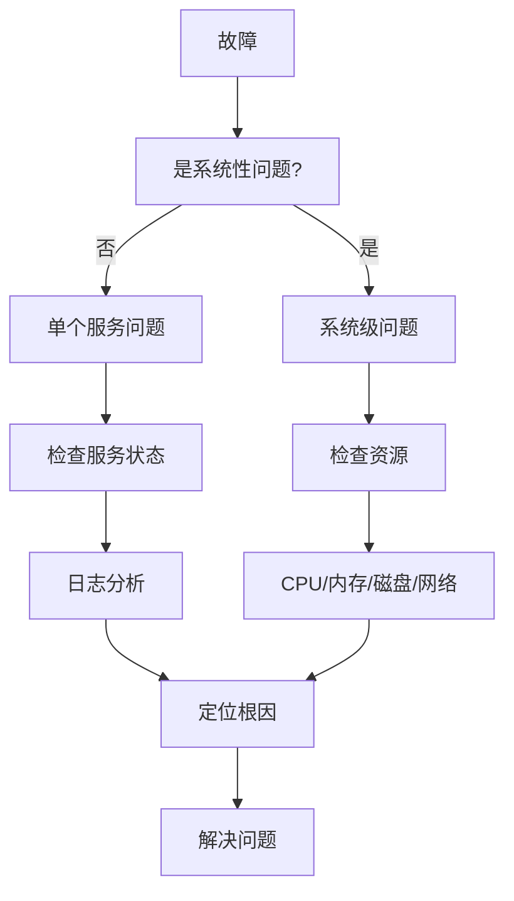

+++
title = "第79章：故障排查方法论"
weight = 790
date = "2026-03-24T13:18:28+08:00"
type = "docs"
description = ""
isCJKLanguage = true
draft = false
+++


# 第七十九章：故障排查方法论

## 79.1 排查流程

### 系统化排查方法

故障排查就像医生看病，需要"望闻问切"：


### 排查口诀

> "一看二问三动手，四查五记六复查"

- **一看**：观察症状、错误信息、环境变化
- **二问**：了解最近变更、操作历史
- **三动手**：使用工具收集数据
- **四查**：分析数据、找出根因
- **五记**：记录过程和解决方案
- **六复查**：确认问题彻底解决

### 常用诊断工具

| 类别 | 工具 |
|------|------|
| 系统信息 | top, htop, free, df, uptime |
| 网络 | ping, traceroute, netstat, ss, tcpdump |
| 进程 | ps, pgrep, pstree, lsof |
| 日志 | journalctl, dmesg, /var/log/* |
| 文件 | ls, stat, file, md5sum |
| 性能 | perf, strace, ltrace |

## 79.2 网络故障排查

### 连通性测试

```bash
# 1. ping 测试（检查网络通不通）
ping 8.8.8.8
ping www.baidu.com

# 2. traceroute/tracert（检查路由）
traceroute www.baidu.com
tracert www.baidu.com     # Windows

# 3. mtr（结合 ping 和 traceroute）
mtr www.baidu.com
```

### 端口测试

```bash
# telnet（经典方法）
telnet 192.168.1.1 80

# nc（Netcat）
nc -zv 192.168.1.1 80
nc -zv 192.168.1.1 22 80 443

# curl（测试 HTTP）
curl -v http://example.com
curl -I http://example.com

# 查看端口占用
ss -tuln | grep :80
netstat -tuln | grep :80
```

### DNS 故障

```bash
# 查看 DNS 解析
nslookup www.baidu.com
dig www.baidu.com
host www.baidu.com

# 检查 DNS 配置
cat /etc/resolv.conf

# 测试 DNS 解析
ping -c 3 www.baidu.com

# 清 DNS 缓存
# 方法1：systemd-resolve（Ubuntu/Debian 新版）
sudo systemd-resolve --flush-caches

# 方法2：service 命令（旧版系统）
sudo service systemd-resolved restart

# 方法3：nmcli（NetworkManager）
nmcli general reload

# 方法4：直接重启解析服务
sudo systemctl restart systemd-resolved
# 或
sudo systemctl restart NetworkManager

# 验证缓存是否清除
systemd-resolve --statistics | grep "Current Cache Size"
```

## 79.3 服务故障排查

### systemctl 状态检查

```bash
# 查看服务状态
systemctl status nginx

# 关键信息：
# - Active: running (绿色)
# - Main PID: 主进程 PID
# - Processes: 子进程数
# - Memory: 内存使用

# 常用命令
systemctl start nginx          # 启动
systemctl stop nginx           # 停止
systemctl restart nginx        # 重启
systemctl reload nginx         # 重载配置
systemctl enable nginx         # 开机启动
systemctl disable nginx        # 取消开机启动
systemctl daemon-reload        # 重载 systemd 配置
```

### journalctl 日志查看

```bash
# 查看服务日志
journalctl -u nginx

# 实时跟踪
journalctl -u nginx -f

# 最近日志
journalctl -u nginx -n 50

# 按时间过滤
journalctl -u nginx --since "1 hour ago"
journalctl -u nginx --since today
journalctl -u nginx --since "2024-01-15 10:00:00" --until "2024-01-15 11:00:00"

# 查看错误日志
journalctl -p err -u nginx
journalctl -p err --since today
```

### 配置文件检查

```bash
# 语法检查
nginx -t
apache2ctl configtest
systemctl cat nginx           # 查看服务配置

# 查看配置
cat /etc/nginx/nginx.conf
nginx -T                      # 测试并显示完整配置
```

### 端口和进程检查

```bash
# 查看端口占用
ss -tulpn | grep :80
netstat -tulpn | grep :80

# 查看进程
ps aux | grep nginx
pgrep -a nginx

# 查看进程打开的文件
lsof -i :80
lsof -p PID
```

## 79.4 磁盘故障排查

### 磁盘使用率

```bash
# 查看磁盘使用
df -h

# 查看 inode
df -i

# 找出大文件
du -sh /* | sort -h | tail -10

# 查看某个目录大小
du -sh /var/log

# 按大小排序
du -ah / | sort -rh | head -20
```

### 磁盘 IO 排查

```bash
# 查看 IO 等待
vmstat 1

# 查看 IO 统计
iostat -x 1

# 查看进程 IO
iotop
```

## 79.5 性能问题排查

### 资源使用分析

```bash
# CPU 使用
top
htop

# 内存使用
free -h
cat /proc/meminfo

# 找出 CPU/内存占用高的进程
ps aux --sort=-%cpu | head
ps aux --sort=-%mem | head
```

### 进程挂起分析

```bash
# 查看进程状态
ps -ef | grep process_name

# 查看进程的父子关系
pstree -p PID

# 查看进程的系统调用
strace -p PID

# 查看进程打开的文件
lsof -p PID
```

## 79.6 日志分析技巧

### grep 关键字搜索

```bash
# 搜索错误
grep -i error /var/log/syslog
grep -E "error|warning|critical" /var/log/syslog

# 显示行号
grep -n "error" /var/log/syslog

# 显示上下文
grep -B 5 -A 5 "error" /var/log/syslog

# 统计错误次数
grep -c "error" /var/log/syslog

# 使用正则
grep -E "[0-9]{2}:[0-9]{2}:[0-9]{2}" /var/log/syslog
```

### awk 数据提取

```bash
# 提取特定字段
awk '{print $1, $5}' /var/log/syslog

# 按条件过滤
awk '$3 == "CRON" {print}' /var/log/syslog

# 统计
awk '{print $5}' /var/log/access.log | sort | uniq -c | sort -rn

# 计算总和
awk '{sum+=$10} END {print sum}' /var/log/access.log
```

### 日志时间分析

```bash
# 按时间段分析
awk '/Jan 15 10:/ {print}' /var/log/syslog

# 统计每小时日志量
awk '{print $3}' /var/log/access.log | cut -d: -f1 | sort | uniq -c

# 查看错误时间分布
grep -i error /var/log/syslog | awk '{print $1, $2, $3}' | sort | uniq -c
```

## 79.7 常用诊断工具

### strace 系统调用跟踪

```bash
# 跟踪进程系统调用
strace -p PID

# 跟踪命令执行
strace -o output.txt command

# 显示时间
strace -t -p PID

# 显示被调用的库
strace -e trace=open,read,write -p PID
```

### lsof 文件/端口

```bash
# 查看端口占用
lsof -i :80
lsof -i -P -n | grep :80

# 查看进程打开的文件
lsof -p PID

# 查看谁在用文件
lsof /var/log/syslog

# 查看网络连接
lsof -i
lsof -i tcp
lsof -i udp
```

### 其他工具

```bash
# dmesg 内核日志
dmesg
dmesg | tail
dmesg -T                      # 可读时间

# uptime 负载
uptime

# who 在线用户
who
w

# last 最近登录
last
last reboot
```

## 故障排查案例

### 案例一：网站打不开

```bash
# 1. 检查网络
ping www.example.com

# 2. 检查 DNS
nslookup www.example.com

# 3. 检查端口
curl -v www.example.com

# 4. 检查服务状态
systemctl status nginx

# 5. 检查日志
journalctl -u nginx --since "10 minutes ago"
```

### 案例二：服务器卡顿

```bash
# 1. 查看负载
uptime
top

# 2. 检查 CPU
mpstat 1

# 3. 检查内存
free -h

# 4. 检查磁盘
df -h
iostat 1

# 5. 查看进程
ps aux --sort=-%cpu | head
```

## 本章小结

本章我们学习了故障排查的系统化方法：

| 步骤 | 说明 |
|------|------|
| 收集信息 | 了解症状、环境、最近变更 |
| 分析问题 | 使用工具排查 |
| 定位原因 | 找出根因 |
| 解决问题 | 执行修复 |
| 验证修复 | 确认问题解决 |
| 总结记录 | 记录过程，防止复发 |

故障排查思维导图：



---

> 💡 **温馨提示**：
> 故障排查最重要的是冷静和系统化。别急着动手，先观察现象，了解背景，再一步步排查。遇到问题时，记得："现象→分析→验证→解决"！

---

**第七十九章：故障排查方法论 — 完结！** 🎉

---

# 🎊 全书完结！🎊

## 教程总结

经过十五章的学习，我们完成了 Linux 核心教程的全部内容：

| 卷 | 章节 | 主题 |
|----|------|------|
| 第十九卷 | 65-68 | 云服务与 IaC |
| 第二十卷 | 69-70 | 虚拟化技术 |
| 第二十一卷 | 71-74 | 安全测试 |
| 第二十二卷 | 75-78 | 性能优化 |
| 第二十三卷 | 79 | 故障排查 |

## 学习路线图

```
云服务(65-68) → 虚拟化(69-70) → 安全(71-74) → 优化(75-78) → 排障(79)
```

---

> 🎉 **恭喜你完成了 Linux 核心教程全部 79 章！**
> 
> 从 Shell 脚本到 Git，从监控到备份，从自动化到高可用，从云计算到安全测试——你已经掌握了 Linux 世界的核心知识！
> 
> 记住：**技术是工具，思维是灵魂**。持续学习，不断实践，你就是下一个 Linux 大师！

**感谢阅读，祝学习愉快！** 🚀
