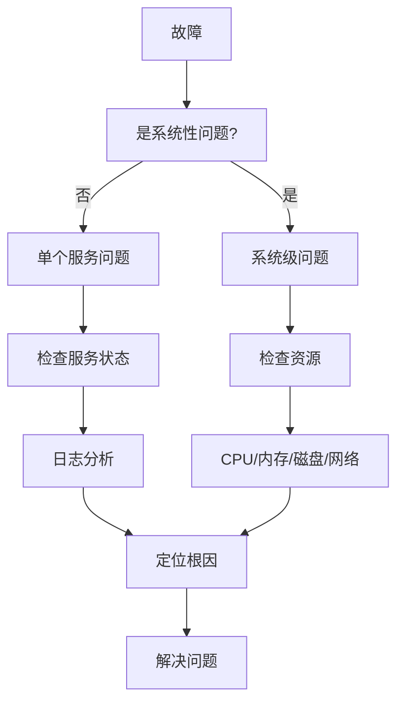

+++
title = "第79章：故障排查方法论"
weight = 790
date = "2026-03-24T13:18:28+08:00"
type = "docs"
description = ""
isCJKLanguage = true
draft = false
+++


# 第七十九章：故障排查方法论

## 79.1 排查流程

### 系统化排查方法

故障排查就像医生看病，需要"望闻问切"：


```mermaid
graph LR
    A[收集信息] --> B[分析问题]
    B --> C[定位原因]
    C --> D[解决问题]
    D --> E[验证修复]
    E --> F[总结记录]
```

### 排查口诀

> "一看二问三动手，四查五记六复查"

- **一看**：观察症状、错误信息、环境变化
- **二问**：了解最近变更、操作历史
- **三动手**：使用工具收集数据
- **四查**：分析数据、找出根因
- **五记**：记录过程和解决方案
- **六复查**：确认问题彻底解决

### 常用诊断工具

| 类别 | 工具 |
|------|------|
| 系统信息 | top, htop, free, df, uptime |
| 网络 | ping, traceroute, netstat, ss, tcpdump |
| 进程 | ps, pgrep, pstree, lsof |
| 日志 | journalctl, dmesg, /var/log/* |
| 文件 | ls, stat, file, md5sum |
| 性能 | perf, strace, ltrace |

## 79.2 网络故障排查

### 连通性测试

```bash
# 1. ping 测试（检查网络通不通）
ping 8.8.8.8
ping www.baidu.com

# 2. traceroute/tracert（检查路由）
traceroute www.baidu.com
tracert www.baidu.com     # Windows

# 3. mtr（结合 ping 和 traceroute）
mtr www.baidu.com
```

### 端口测试

```bash
# telnet（经典方法）
telnet 192.168.1.1 80

# nc（Netcat）
nc -zv 192.168.1.1 80
nc -zv 192.168.1.1 22 80 443

# curl（测试 HTTP）
curl -v http://example.com
curl -I http://example.com

# 查看端口占用
ss -tuln | grep :80
netstat -tuln | grep :80
```

### DNS 故障

```bash
# 查看解析结果（三个工具都能用，各有侧重）
dig www.baidu.com              # 输出最详细，首选
dig +short www.baidu.com       # 只看解析到的 IP
host www.baidu.com
nslookup www.baidu.com
```

```bash
# 看 DNS 服务器配置
cat /etc/resolv.conf

# 更完整的视图：谁在提供解析、上游是谁、缓存情况
resolvectl status
```

几条黄金排查路线：

```bash
# 1) 直接问指定的 DNS 服务器，绕开本机配置，
#    以此判断是"上游 DNS 的问题"还是"本机配置的问题"
dig @223.5.5.5 www.baidu.com
dig @8.8.8.8 www.baidu.com

# 2) 从根域名一路追踪，看解析到底在哪一层断掉（很有说服力）
dig +trace www.example.com

# 3) 查特定记录类型
dig MX example.com
dig TXT example.com
dig -x 8.8.8.8                 # 反向解析

# 4) 看解析耗时（输出里的 Query time 字段）
dig www.example.com | grep -i 'query time'
```

`/etc/resolv.conf` 里值得看的两项：`nameserver`（用哪台 DNS）和 `search`（域名补全后缀）。**注意在装了 systemd-resolved 或 NetworkManager 的系统上，这个文件往往只是个软链接**，直接改它会被覆盖：

```bash
ls -l /etc/resolv.conf
```

```text
/etc/resolv.conf -> ../run/systemd/resolve/stub-resolv.conf
```

这种情况要改的是上游 DNS（NetworkManager 的连接配置，或 `/etc/systemd/resolved.conf` 里的 `DNS=`），改完 `sudo systemctl restart systemd-resolved`。

清 DNS 缓存：

```bash
# systemd-resolved（现代发行版默认）——注意命令名叫 resolvectl
sudo resolvectl flush-caches

# 确认缓存情况
resolvectl statistics | head

# 装了 nscd 的话
sudo systemctl restart nscd

# 装了 dnsmasq 的话
sudo systemctl restart dnsmasq
```

> **原稿这份"清缓存方法清单"有几处问题**：`systemd-resolve` 这个命令在 systemd 239 之后已改名为 **`resolvectl`**，新系统上敲 `systemd-resolve` 会直接提示找不到命令；`nmcli general reload` 只是让 NetworkManager 重新加载配置，**并不会清 DNS 缓存**；另外"清缓存"通常也不是必须的——大多数"解析不对"的问题，根源在配置或上游 DNS，而不在缓存。

## 79.3 服务故障排查

### systemctl 状态检查

```bash
# 查看服务状态
systemctl status nginx

# 关键信息：
# - Active: running (绿色)
# - Main PID: 主进程 PID
# - Processes: 子进程数
# - Memory: 内存使用

# 常用命令
systemctl start nginx          # 启动
systemctl stop nginx           # 停止
systemctl restart nginx        # 重启
systemctl reload nginx         # 重载配置
systemctl enable nginx         # 开机启动
systemctl disable nginx        # 取消开机启动
systemctl daemon-reload        # 重载 systemd 配置
```

### journalctl 日志查看

```bash
# 查看服务日志
journalctl -u nginx

# 实时跟踪
journalctl -u nginx -f

# 最近日志
journalctl -u nginx -n 50

# 按时间过滤
journalctl -u nginx --since "1 hour ago"
journalctl -u nginx --since today
journalctl -u nginx --since "2024-01-15 10:00:00" --until "2024-01-15 11:00:00"

# 查看错误日志
journalctl -p err -u nginx
journalctl -p err --since today
```

### 配置文件检查

```bash
# 语法检查
nginx -t
apache2ctl configtest
systemctl cat nginx           # 查看服务配置

# 查看配置
cat /etc/nginx/nginx.conf
nginx -T                      # 测试并显示完整配置
```

### 端口和进程检查

```bash
# 查看端口占用
ss -tulpn | grep :80
netstat -tulpn | grep :80

# 查看进程
ps aux | grep nginx
pgrep -a nginx

# 查看进程打开的文件
lsof -i :80
lsof -p PID
```

## 79.4 磁盘故障排查

磁盘问题的表现差异很大，先判断属于哪一类：

| 症状 | 大概率原因 |
|------|-----------|
| `df` 显示 100%，`du` 加起来却对不上 | 有文件被删除，但进程仍持有句柄 |
| `df -i` 显示 inode 用满 | 目录里有海量小文件 |
| 报 `No space left on device` 但 `df` 明明有空间 | inode 用满，或配额（quota）用完 |
| 空间充足但 IO 很慢 | 见第 77 章 |

```bash
# 使用率（-h 人类可读，-T 显示文件系统类型）
df -hT

# inode 使用情况（排查"小文件过多"，这一项经常被忽略）
df -i

# 找大目录：先限定在可能出问题的目录，不要直接扫整个 /
sudo du -xh --max-depth=1 /var | sort -rh | head -20

# 找大文件
sudo find /var -xdev -type f -size +100M -exec ls -lh {} + 2>/dev/null | head -20
```

**经典场景："`df` 说磁盘满了，`du` 却翻不到那个大文件"。** 这几乎总是因为**文件已被删除，但仍有进程持有它的文件句柄**——空间要等那个进程释放句柄（通常是重启）才真正回收：

```bash
# 找出"已删除但仍被占用"的文件（+L1 表示 link count 小于 1）
sudo lsof +L1
```

输出里会写明是哪个进程（`COMMAND` / `PID`）占着多大的已删除文件。处理方式有两种：

```bash
# 方式一（最稳）：重启对应的服务，让句柄释放
sudo systemctl restart <服务名>

# 方式二（不重启，但要谨慎）：把文件内容清空，空间会立即释放
sudo truncate -s 0 /proc/<PID>/fd/<FD编号>
```

> 用 `truncate` 操作 `/proc/<PID>/fd/` 是有风险的技巧——有些程序不接受日志文件"突然变空"，可能出现写偏移错乱。**最稳的仍然是重启对应服务**，之所以要了解这个技巧，是因为生产环境常常要等维护窗口才能重启。

**inode 用满**的排查与处理：

```bash
# 看哪个目录里小文件最多
sudo find /var -xdev -type f | sed 's#/[^/]*$##' | sort | uniq -c | sort -rn | head -20

# 常见元凶：会话文件、缓存目录、邮件队列
ls /var/spool/
```

磁盘 IO 层面的排查（详见第 77 章）：

```bash
# 是否有进程在等 IO
vmstat 1              # 重点看 b 列和 wa 列

# 是哪块盘、哪个指标不对
iostat -x 1

# 是哪个进程在读写
sudo iotop -o
```

## 79.5 性能问题排查

### 资源使用分析

```bash
# CPU 使用
top
htop

# 内存使用
free -h
cat /proc/meminfo

# 找出 CPU/内存占用高的进程
ps aux --sort=-%cpu | head
ps aux --sort=-%mem | head
```

### 进程挂起分析

```bash
# 查看进程状态
ps -ef | grep process_name

# 查看进程的父子关系
pstree -p PID

# 查看进程的系统调用
strace -p PID

# 查看进程打开的文件
lsof -p PID
```

## 79.6 日志分析技巧

### grep 关键字搜索

```bash
# 搜索错误
grep -i error /var/log/syslog
grep -E "error|warning|critical" /var/log/syslog

# 显示行号
grep -n "error" /var/log/syslog

# 显示上下文
grep -B 5 -A 5 "error" /var/log/syslog

# 统计错误次数
grep -c "error" /var/log/syslog

# 使用正则
grep -E "[0-9]{2}:[0-9]{2}:[0-9]{2}" /var/log/syslog
```

### awk 数据提取（以 Nginx access.log 为例）

先对照一下 combined 日志格式的字段位置，后面才看得懂命令在取什么：

```text
$1 客户端IP   $2 ident   $3 用户   $4 [时间]   $5 "请求行"   $6 状态码   $7 响应字节   $8 Referer   $9 User-Agent   $10 body_bytes_sent
```

```text
192.168.1.100 - - [23/Mar/2026:10:15:32 +0800] "GET /index.html HTTP/1.1" 200 5123 "https://example.com/" "Mozilla/5.0"
```

```bash
# 提取特定字段（例如 客户端IP 和 请求行）
awk '{print $1, $5}' /var/log/nginx/access.log

# 按条件过滤：只看状态码不是 200 的请求
awk '$9 != 200 {print $1, $9, $7}' /var/log/nginx/access.log

# 统计各状态码的出现次数（想看"哪类错误最多"，取的是 $9）
awk '{print $9}' /var/log/nginx/access.log | sort | uniq -c | sort -rn

# 统计总响应字节数
awk '{sum += $10} END {print sum/1024/1024 " MB"}' /var/log/nginx/access.log

# 找出访问量最高的 10 个 IP
awk '{print $1}' /var/log/nginx/access.log | sort | uniq -c | sort -rn | head -10
```

> **这里要纠正原稿的两处笔误**：
>
> - `awk '{print $5}' | sort | uniq -c` 的注释写的是"统计"，但 `$5` 是**请求行**（每个 URL 都不一样，统计出来基本都是 1）。要统计状态码分布，应该取 **`$9`**
> - 求和用的 `$10` 取决于你的 `log_format`，默认 combined 里它是响应字节数，但如果自己改过日志格式，用之前一定要先确认字段位置

### 日志时间分析

```bash
# 按时间段筛选
grep 'Jan 15 10:' /var/log/syslog
journalctl --since "2026-03-23 10:00" --until "2026-03-23 11:00"

# 统计每小时日志量（$4 形如 [23/Mar/2026:10:15:32，去掉 [ 再按 : 取小时）
awk '{print $4}' /var/log/nginx/access.log | tr -d '[' | cut -d: -f2 | sort | uniq -c

# 看错误的日期分布（syslog 里 $1-$2 是月份和日期）
grep -i error /var/log/syslog | awk '{print $1, $2}' | sort | uniq -c
```

> 分析大日志时，`sort | uniq -c | sort -rn` 这套组合很吃内存和磁盘 IO。**日志上 GB 时建议先用 `grep` 缩小范围**，或者改成 `awk` 单遍统计，避免反复排序：
>
> ```bash
> awk '{c[$9]++} END {for (k in c) print c[k], k}' /var/log/nginx/access.log | sort -rn
> ```

## 79.7 常用诊断工具

### strace：跟踪系统调用

```bash
# 跟踪一个正在运行的进程（需要 root 或同样的用户身份）
sudo strace -p 12345

# 跟踪一条命令从头到尾做了什么（排查"启动就失败"非常好用）
strace -o /tmp/trace.txt ./my_program

# 加时间信息（-tt 带微秒，-T 显示每个调用实际耗时）
sudo strace -tt -T -p 12345

# 只看关心的调用，输出量能小很多
sudo strace -e trace=openat,read,write -p 12345

# 只做统计，不刷屏，适合先看一眼整体情况
sudo strace -c -p 12345

# 连同子进程 / 线程一起跟踪
sudo strace -f -p 12345
```

> **`strace` 会明显拖慢被跟踪的进程**（有时慢几十倍），因为每次系统调用都要被暂停一次。**生产环境不要长时间挂着它**，更不要对高并发服务做 `-f` 全量跟踪。观察线上性能问题，优先用 `perf`、`bpftrace` 这类低开销工具。

### lsof：谁打开了文件、谁占着端口

```bash
# 谁占用了 80 端口
sudo lsof -i :80

# 不解析端口名和主机名（更快、输出更干净）
sudo lsof -i -P -n | grep :80

# 某个进程打开了哪些文件
sudo lsof -p 12345

# 谁正在使用某个文件（"文件被占用"时很有用）
sudo lsof /var/log/syslog

# 网络连接情况
sudo lsof -i            # 所有网络连接
sudo lsof -i tcp        # 只看 TCP
sudo lsof -i udp        # 只看 UDP

# 找出"已删除但仍被占用"的文件（磁盘空间不释放的元凶）
sudo lsof +L1
```

> 在容器里，`lsof` 看到的可能是宿主机的 PID，需要 `nsenter` 进入容器的命名空间再看。也可以用 `fuser -v 文件名` 或 `fuser -n tcp 80` 作为替代。

### 其它高频工具

```bash
# 内核日志（-T 输出可读时间，-w 实时跟踪新消息）
dmesg -T | tail -50
sudo dmesg -Tw

# 负载
uptime

# 在线用户
who
w

# 最近登录与重启记录
last
last reboot | head -5

# systemd 层面：哪些单元启动失败、哪些启动最慢
systemctl --failed
systemd-analyze blame | head -10

# 上一次启动的日志（排查"重启后就起不来了"极其有用）
journalctl -b -1 -p err

# 日志占用了多少磁盘
journalctl --disk-usage
```

> **`journalctl -b -1` 值得专门记住。** 服务崩溃重启之后，当前这次启动的日志里往往找不到崩溃原因，而崩溃前的记录全都在"上一次启动"里。这一条命令救过很多人的场。

## 故障排查案例

### 案例一：网站打不开

```bash
# 1. 检查网络
ping www.example.com

# 2. 检查 DNS
nslookup www.example.com

# 3. 检查端口
curl -v www.example.com

# 4. 检查服务状态
systemctl status nginx

# 5. 检查日志
journalctl -u nginx --since "10 minutes ago"
```

### 案例二：服务器卡顿

```bash
# 1. 查看负载
uptime
top

# 2. 检查 CPU
mpstat 1

# 3. 检查内存
free -h

# 4. 检查磁盘
df -h
iostat 1

# 5. 查看进程
ps aux --sort=-%cpu | head
```

## 本章小结

本章我们学习了故障排查的系统化方法：

| 步骤 | 说明 |
|------|------|
| 收集信息 | 了解症状、环境、最近变更 |
| 分析问题 | 使用工具排查 |
| 定位原因 | 找出根因 |
| 解决问题 | 执行修复 |
| 验证修复 | 确认问题解决 |
| 总结记录 | 记录过程，防止复发 |

故障排查思维导图：


```mermaid
graph TB
    A[故障] --> B[是系统性问题?]
    B -->|否| C[单个服务问题]
    B -->|是| D[系统级问题]
    C --> E[检查服务状态]
    D --> F[检查资源]
    E --> G[日志分析]
    F --> H[CPU/内存/磁盘/网络]
    G --> I[定位根因]
    H --> I
    I --> J[解决问题]
```

---

> 💡 **温馨提示**：
> 故障排查最重要的是冷静和体系化。别急着动手，先观察现象、了解背景（尤其是"最近改过什么"），再一步步缩小范围。记住这个循环：**现象 → 假设 → 验证 → 解决 → 复盘**。

---

**第七十九章：故障排查方法论 — 完结！**

---

# 🎊 全书完结 🎊

## 教程总结

到这里，Linux 核心教程的全部 79 章就讲完了。最后五卷（第 65-79 章）的内容是：

| 卷 | 章节 | 主题 |
|----|------|------|
| 第十九卷 | 65-68 | 云服务与 IaC |
| 第二十卷 | 69-70 | 虚拟化技术 |
| 第二十一卷 | 71-74 | 安全测试 |
| 第二十二卷 | 75-78 | 性能优化 |
| 第二十三卷 | 79 | 故障排查 |

## 学习路线图

```text
云服务(65-68) → 虚拟化(69-70) → 安全测试(71-74) → 性能优化(75-78) → 故障排查(79)
```

---

> 🎉 **恭喜你走完了 Linux 核心教程的全部 79 章。**
>
> 从命令行基础到 Shell 脚本，从用户权限到软件包管理，从网络到防火墙，从容器到高可用，从云计算到安全测试，最后收在这两块最考验功力的内容上：**性能优化**与**故障排查**。
>
> 最后留三句话：
>
> - **变更前先备份、先想好怎么回滚**——绝大多数故障都源于一次没准备好的变更
> - **先量后调、先看后改**——用数据说话，别凭感觉动参数
> - **把每次故障都变成一条经验**——记录下来，下次它能帮你省下几个小时
>
> 记住：**技术是工具，思维是灵魂。** 祝你排障顺利。
