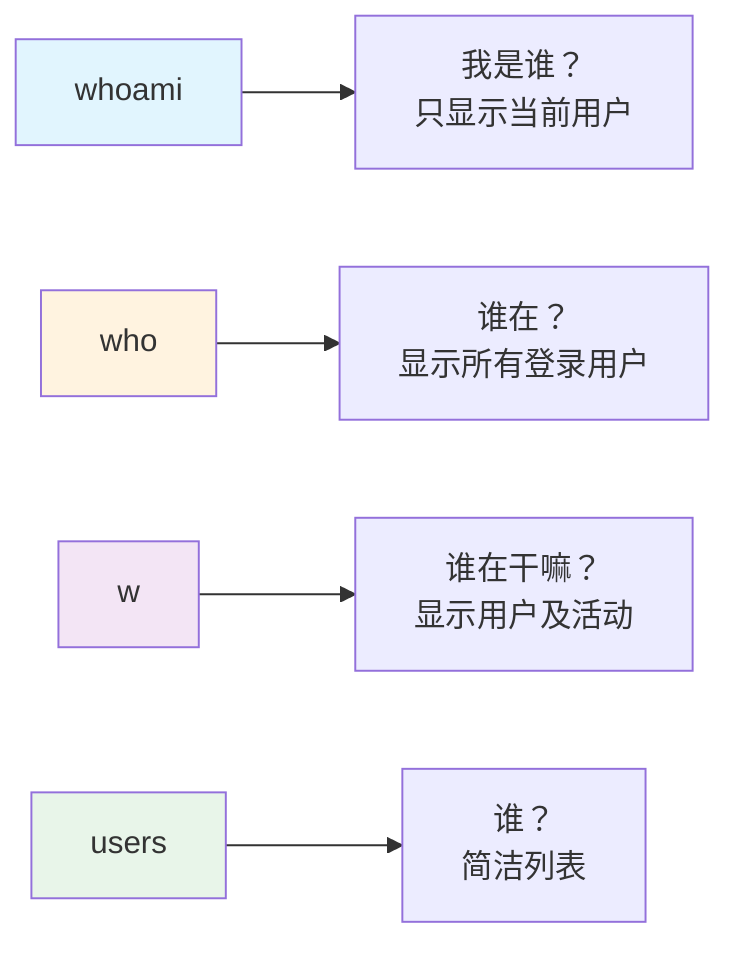

+++
title = "第15章：用户管理基础"
weight = 150
date = "2026-03-24T13:18:28+08:00"
type = "docs"
description = ""
isCJKLanguage = true
draft = false
+++


# 第十五章：用户管理基础

想象一下，你的Linux系统是一座摩天大楼，里面住着各种各样的"居民"。有只手遮天的物业老板（root），有负责电梯维护的打工人们（系统用户），还有每天上下班的白领们（普通用户）。这一章，我们就来聊聊这些居民的故事——他们是谁，怎么进来的，怎么管他们。

在Linux的世界里，**用户管理**可不是闹着玩的。要么你把权限给多了，系统被黑得底裤都不剩；要么你把权限给少了，连自己都登录不进去。所以，且听我细细道来，保证让你听完还想听，笑完还能记住！

---

## 15.1 Linux 用户分类

你知道吗？Linux系统里的用户，就像现实世界里的银行卡——卡与卡之间，权限天差地别。有的卡能在银行里横着走（想干嘛干嘛），有的卡连ATM机都吞你钱（处处受限）。Linux也一样，它把用户分成了三六九等，每一等的"待遇"都不一样。

### 15.1.1 root：UID 0，超级管理员

**UID为0的用户**，这就是Linux系统里的**终极大Boss**——root用户，中文名叫"根用户"或"超级管理员"。

root用户有多猛？这么说吧：

- 他能删除系统里**任何一个文件**，甭管你是系统文件还是你的私人小电影
- 他能修改系统**任何一项配置**，让Linux从乖巧小绵羊变成狂野大灰狼
- 他能创建和删除**任何其他用户**，仿佛上帝说"要有光"，于是就有了用户
- 他甚至能把自己给删了（别问我为什么要这么干，闲得慌的人什么都做得出来）

**UID** 是User Identifier的缩写，中文叫"用户标识符"，说白了就是系统给每个用户分配的**身份证号**。root的身份证号是0，所以只要你在系统里看到UID为0的用户，那他就是老大，甭管他叫什么名字——就算他把自己改名叫"小可爱"，系统里谁见了都得抖三抖。

> 温馨提示：root用户虽猛，但也是最危险的。在生产环境中，root直接登录操作就像是在银行金库里裸舞——好看是好看，但万一脚下一滑，后果不堪设想。建议日常使用普通用户，需要权限时再用sudo临时提权。

怎么知道当前用户是不是root？很简单：

```bash
# 查看当前用户的UID
id

# 输出大概是：
# uid=0(root) gid=0(root) groups=0(root)
```

看到那个`uid=0`了吗？这就是root的身份证号。后面那个`gid=0`是**主组ID**，我们后面讲组的时候再说。

### 15.1.2 系统用户：UID 1-999，守护进程

接下来登场的是**系统用户**，UID范围是**1到499或1到999**（不同Linux发行版略有差异，Debian/Ubuntu通常是1-999，RHEL/CentOS是1-499）。

系统用户是干嘛的？说白了就是**给各种系统服务和守护进程打工的**。

守护进程是什么？就是那些在后台默默运行的"打工人"进程，比如：

- **sshd**：让你的电脑能远程登录的打工进程
- **httpd/apache2/nginx**：网站服务器的打工进程
- **mysqld/postgres**：数据库的打工进程
- **systemd-journald**：系统日志的打工进程

这些进程需要一个"身份"来运行，但又不需要它真的能登录系统操作文件（它就是个程序，又不是人），所以就给它们创建了**系统用户**。

你可以把系统用户理解为公司的"工号账户"——每个工号只能操作特定的工位（进程对应的工作目录和文件），但工号本身是进不了公司大门的（无法登录系统）。

来看一下你的系统里有哪些系统用户：

```bash
# 查看UID在1-999范围内的用户
cat /etc/passwd | awk -F: '$3 >= 1 && $3 <= 999 {print $1, $3}'

# 典型的输出大概是：
# daemon 1
# bin 2
# sys 3
# games 5
# man 6
# lp 7
# mail 8
# news 10
# proxy 13
# www-data 33
# nobody 65534
```

看到这些名字了吧？`daemon`是守护进程（daemon这个名字来源于希腊神话中的"daimon"，意思是"超自然的存在"），`www-data`是给网页服务器打工的，`nobody`是谁都不拥有的"幽灵用户"——常用于给那些不需要任何特权的进程使用。

### 15.1.3 普通用户：UID 1000+，日常使用

最后出场的是**普通用户**，UID从**1000或1001**开始（取决于系统的`UID_MIN`和`UID_MAX`配置）。

普通用户就是**你自己**——每天坐在电脑前敲代码、写文档、刷视频的这个小可怜。

普通用户的权限有多大？这么说吧：

- ✅ 可以在自己的**家目录**里为所欲为（家目录就是`/home/用户名`）
- ✅ 可以运行程序、创建文件、删除自己的文件
- ✅ 可以修改自己的密码
- ❌ 不能修改系统配置
- ❌ 不能访问其他用户的文件（除非对方授权）
- ❌ 不能安装软件到系统目录
- ❌ 不能删除root用户（除非你疯了）

所以普通用户就像是一个**高档小区的住户**——你可以在自己家里随便造（搞破坏除外），但想动小区的公共设施？对不起，你得找物业（root）。

查看当前系统有多少普通用户：

```bash
# 查看UID >= 1000的用户数量
cat /etc/passwd | awk -F: '$3 >= 1000 {print $1}' | wc -l

# 或者直接看当前登录的用户信息
whoami

# 查看当前用户详细信息
id
```

```bash
# 一个普通用户的id输出示例：
uid=1000(longx) gid=1000(longx) groups=1000(longx),4(adm),24(cdrom),27(sudo),30(dip),46(plugdev),1001(docker)
```

看到没？`uid=1000`的小明同学（longx是我的名字，你改成你自己的用户名），他的主组也是1000，但同时加入了`sudo`组——这意味着他可以临时获得root权限。

### 📊 Linux 用户分类一览表


| 用户类型 | UID范围 | 数量 | 用途 | 能否登录 |
|---------|---------|------|------|---------|
| root | 0 | 唯一 | 系统最高权限 | ✅ 可以（但不建议） |
| 系统用户 | 1-999 | 约200+ | 运行系统服务 | ❌ 通常不能 |
| 普通用户 | 1000+ | 若干 | 人类日常使用 | ✅ 可以 |

### 🔑 记住这个口诀

> **UID 0是老板，系统用户是工号，普通用户是住户。**
> 
> 老板能删库跑路，工号只能干活，住户只能在自己家嗨皮。

---

## 15.2 UID 和 GID：用户和组的数字标识

上节我们提到了UID，那GID又是什么？它们俩是什么关系？

**UID**（User Identifier）就是用户的**身份证号**，**GID**（Group Identifier）就是用户所属的**组身份证号**。

**组**是什么？可以理解为一个"兴趣小组"。比如你喜欢踢球，进了足球小组；我喜欢唱歌，进了合唱团。在Linux里，一个用户可以加入多个组，组内的所有用户可以共享某些文件的访问权限。

- **主组（Primary Group）**：每个用户必须有且只有一个主组，用户的文件默认属于这个组。就像你的户口本上的户主——你只能有一个户口本，但你可以挂靠多个集体户口。
- **附加组（Supplementary Group）**：用户可以加入多个附加组，类似于你参加了多个兴趣小组。

来看个例子：

```bash
# 查看用户longx的UID、GID以及所属的所有组
id longx

# 输出：
# uid=1000(longx) gid=1000(longx) groups=1000(longx),4(adm),24(cdrom),27(sudo),30(dip),46(plugdev),1001(docker)
```

解释一下这个输出：

- `uid=1000(longx)`：用户longx的UID是1000，用户名也是longx
- `gid=1000(longx)`：用户longx的主组GID是1000，组名也是longx
- `groups=1000(longx),4(adm),24(cdrom),27(sudo)...`：用户加入了这些组

> [!NOTE]
> 为什么GID和UID都是1000？这是巧合，因为创建用户时默认会创建一个同名主组，GID和UID通常是连续的。

```bash
# 查看系统UID和GID的范围配置
grep -E "^(UID_MIN|UID_MAX|GID_MIN|GID_MAX)" /etc/login.defs

# 输出大概是：
# UID_MIN      1000
# UID_MAX      60000
# GID_MIN      1000
# GID_MAX      60000
```

也就是说，在默认配置下：
- UID 1000以下是系统用户
- UID 1000-60000是普通用户
- 超过60000？那是给特殊用途预留的

---

## 15.3 useradd 创建用户

终于到了动手环节！创建用户用什么命令？`useradd`！就像给新员工开账户一样简单。

### 15.3.1 useradd 用户名 —— 最简单的创建方式

```bash
# 创建一个叫xiaoming的用户（最简形式）
sudo useradd xiaoming
```

执行完这条命令，系统会：
1. 在`/etc/passwd`里添加一行xiaoming的信息
2. 分配一个UID（通常是1000以上的下一个可用数字）
3. 创建一个同名主组（GID = UID）
4. 但！**不会创建家目录**，也不会设置密码

> 警告：这种最简方式创建的用户，基本就是个"空壳"——没有家目录，登录不了。适合批量创建系统账户，不适合创建真实用户。

### 15.3.2 useradd -m -s /bin/bash 用户名 —— 完整创建方式

日常使用推荐这种方式：

```bash
# -m: 创建家目录（会在/home下创建/home/xiaoming）
# -s /bin/bash: 指定登录Shell为bash（不用bash难道用sh？那多没意思）
sudo useradd -m -s /bin/bash xiaoming
```

这下好了，系统会：
1. 创建用户xiaoming
2. 在`/home`下创建`/home/xiaoming`目录（家目录）
3. 复制骨架文件到`/home/xiaoming`（就是那些`.bashrc`、`.profile`之类的配置文件）
4. 设置登录Shell为bash

创建完成后，别忘了给这个用户设置一个密码：

```bash
# 设置xiaoming的密码
sudo passwd xiaoming

# 会提示你输入新密码（输入时看不见字符，放心大胆敲）：
# Enter new UNIX password: 
# Retype new UNIX password:
```

### 15.3.3 useradd -u UID 用户名 —— 指定UID创建

有时候你需要指定一个特定的UID（比如要和老系统的用户ID保持一致）：

```bash
# 指定UID为1500创建用户
sudo useradd -u 1500 -m -s /bin/bash zhangsan
```

> [!NOTE]
> UID 0已经被root占了，所以别想着创建UID 0的用户（除非你想搞事情）。另外，UID 1-999是系统用户专区，强烈建议普通用户使用1000以上的UID。

### 15.3.4 useradd -g 组名 用户名 —— 指定主组创建

默认情况下，创建用户时会创建一个同名主组。但如果你想让用户加入一个已存在的组作为主组：

```bash
# 先创建组（后面会详细讲）
sudo groupadd developers

# 创建用户并指定主组为developers
sudo useradd -g developers -m -s /bin/bash lisi
```

### 15.3.5 useradd 常用选项汇总

```bash
# 创建一个完整配置的用户（推荐）
sudo useradd -m -s /bin/bash -c "小明同学" xiaoming
# -c: 添加注释信息（通常是用户全名或描述）

# 创建用户并指定UID和主组
sudo useradd -u 2000 -g developers -m -s /bin/bash wangwu

# 创建用户并加入多个附加组（-G，大写G）
sudo useradd -G sudo,docker,www-data -m -s /bin/bash zhaoliu

# 创建系统用户（不创建家目录，UID在系统范围内）
sudo useradd -r -s /bin/false mysql_service
# -r: 创建系统用户
# -s /bin/false: 该用户无法登录（常用于服务账户）
```

```bash
# 查看创建的用户信息
id xiaoming

# 输出大概是：
# uid=1001(xiaoming) gid=1001(xiaoming) groups=1001(xiaoming)
```

---

## 15.4 usermod 修改用户

创建用户之后，发现配置错了怎么办？删掉重建？不，聪明人用`usermod`——这是个"用户信息修改器"，专门干改改改的活儿。

### 15.4.1 usermod -l 新用户名 旧用户名 —— 修改用户名

```bash
# 把xiaoming改名为xiaohong
sudo usermod -l xiaohong xiaoming
```

> 警告：这个命令只改用户名，**不会**改家目录名，也不会改其他引用该用户的地方。所以改完之后，家目录还是叫`/home/xiaoming`，你可能需要手动改一下：
> 
> ```bash
> sudo mv /home/xiaoming /home/xiaohong
> sudo usermod -d /home/xiaohong xiaohong
> ```

### 15.4.2 usermod -g 组名 用户名 —— 修改用户主组

```bash
# 把用户zhangsan的主组从zhangsan改成developers
sudo usermod -g developers zhangsan
```

### 15.4.3 usermod -aG 组名 用户名 —— 添加用户到附加组

这个是最常用的！假设你的用户想用`sudo`命令（临时获得root权限），就得把他加到`sudo`组里：

```bash
# 把xiaohong添加到sudo组（-a是追加，-G指定附加组）
# 注意：-a必须和-G一起用！
sudo usermod -aG sudo xiaohong

# 把xiaohong添加到多个组
sudo usermod -aG docker,www-data,developers xiaohong
```

```bash
# 修改完成后，验证一下
id xiaohong

# 输出大概是：
# uid=1001(xiaohong) gid=1001(xiaohong) groups=1001(xiaohong),27(sudo),1002(docker),1003(www-data),1004(developers)
```

现在xiaohong可以用sudo了！试试：

```bash
# 以root权限执行命令
sudo whoami

# 输出：
# root
```

### 15.4.4 usermod -L 用户名 —— 锁定用户

锁定用户，就像把他的账户冻结了——账户还在，但谁也登录不进去：

```bash
# 锁定xiaohong的账户
sudo usermod -L xiaohong

# 解锁用户
sudo usermod -U xiaohong
```

锁定后会发生什么？用户的密码字段会被加个`!`前缀，导致密码验证永远失败，但用户文件都还在。

> [!TIP]
> 锁定用户比删除用户安全，因为锁定后账户可以随时恢复，删除可就真的没了（除非你有备份）。

### 15.4.5 usermod 常用选项汇总

```bash
# 修改用户的登录Shell
sudo usermod -s /bin/zsh username

# 修改用户的UID
sudo usermod -u 1500 username

# 修改用户的家目录
sudo usermod -d /new/home/dir -m username
# -m 选项会自动把旧家目录的内容迁移到新家目录

# 修改用户的描述信息
sudo usermod -c "这是一个可爱的用户" username

# 锁定+解锁，一套组合拳
sudo usermod -L username   # 锁定
sudo usermod -U username   # 解锁
```

---

## 15.5 userdel 删除用户

删除用户？`userdel`命令来帮忙。但删除用户这事儿可不能冲动，冲动是魔鬼，删库跑路可不是开玩笑的。

### 15.5.1 userdel 用户名 —— 删除用户（保留家目录）

```bash
# 删除xiaohong，但保留他的家目录和邮件
sudo userdel xiaohong
```

> 警告：这个命令**不会删除家目录**！用户没了，但`/home/xiaohong`还在，里面可能有重要文件。除非你确认不要了，否则建议保留。

### 15.5.2 userdel -r 用户名 —— 删除用户（同时删除家目录）

```bash
# 删除xiaohong，同时删除他的家目录和邮件
sudo userdel -r xiaohong
```

> ⚠️ 这是不可逆操作！家目录一旦删除，**所有文件都没了**！建议先备份或者确认清楚再执行。

```bash
# 建议的操作流程：
# 1. 先看看用户有没有重要文件
ls -la /home/xiaohong

# 2. 备份重要文件（如果有的话）
sudo cp -r /home/xiaohong /backup/xiaohong_home

# 3. 确认无误后，删除用户和家目录
sudo userdel -r xiaohong
```

---

## 15.6 passwd 修改密码

创建了用户，当然要设密码！`passwd`命令就是干这个的——给用户一个身份证明，让系统知道"哦，这是主人，不是闯入者"。

### 15.6.1 passwd 用户名 —— 普通用户修改自己的密码

```bash
# xiaoming修改自己的密码
passwd

# 或者root帮某个用户改密码
sudo passwd xiaoming
```

### 15.6.2 passwd -l 用户名 —— 锁定用户（禁用密码登录）

```bash
# 锁定xiaoming的账户
sudo passwd -l xiaoming

# 等效于：
# sudo usermod -L xiaoming
```

锁定后，用户**只能用其他方式登录**（比如SSH密钥），但不能用密码登录了。

### 15.6.3 passwd -u 用户名 —— 解锁用户

```bash
# 解锁xiaoming的账户
sudo passwd -u xiaoming

# 等效于：
# sudo usermod -U xiaoming
```

### 15.6.4 passwd -d 用户名 —— 删除密码

```bash
# 删除xiaoming的密码
sudo passwd -d xiaoming
```

删除密码后，用户可以直接登录（有些系统可能会禁止无密码登录），这个操作**很危险**，慎用！

### 15.6.5 passwd 常用选项汇总

```bash
# 修改当前用户密码
passwd

# 修改指定用户密码（需要root）
sudo passwd username

# 锁定用户（禁用密码登录）
sudo passwd -l username

# 解锁用户
sudo passwd -u username

# 删除密码（危险！）
sudo passwd -d username

# 查看密码状态（需要root）
sudo passwd -S username

# 设置密码后立即过期（强制用户下次登录改密码）
sudo passwd -e username
```

```bash
# 查看密码状态
sudo passwd -S xiaoming

# 输出：
# xiaoming P 2026-03-23 0 99999 7 -1
# 格式：用户名 密码状态 最后修改日期 最小天数 最大天数 警告期 过期
# 密码状态：P=有密码，L=锁定，NP=无密码
```

---

## 15.7 /etc/passwd 文件格式详解

说了这么多创建用户修改密码，你有没有想过——用户信息到底存在哪儿了？

Linux里，用户信息主要存在两个地方：**/etc/passwd**（用户基本信息）和**/etc/shadow**（密码加密信息）。

先来看`/etc/passwd`：

```bash
# 查看passwd文件内容
cat /etc/passwd
```

输出大概是长这样的：

```
root:x:0:0:root:/root:/bin/bash
daemon:x:1:1:daemon:/usr/sbin:/usr/sbin/nologin
bin:x:2:2:bin:/bin:/usr/sbin/nologin
sys:x:3:3:sys:/dev:/usr/sbin/nologin
nobody:x:65534:65534:nobody:/nonexistent:/usr/sbin/nologin
longx:x:1000:1000:LongX,,,:/home/longx:/bin/bash
```

每行代表一个用户，字段之间用冒号`:`分隔，共**7个字段**。

### 15.7.1 格式：用户名:密码:UID:GID:描述:家目录:Shell

| 字段序号 | 字段名 | 说明 | 示例 |
|---------|--------|------|------|
| 1 | 用户名 | 登录时使用的名字 | `longx` |
| 2 | 密码 | 以前存明文密码，现在都是`x`，表示密码在/etc/shadow里 | `x` |
| 3 | UID | 用户标识符 | `1000` |
| 4 | GID | 主组标识符 | `1000` |
| 5 | 描述 | 用户的备注信息，可以是姓名、电话等 | `LongX,,,` |
| 6 | 家目录 | 用户登录后的默认目录 | `/home/longx` |
| 7 | Shell | 用户登录后使用的命令行解释器 | `/bin/bash` |

> [!NOTE]
> 为什么密码字段显示的是`x`而不是真正的密码？因为真正的密码（加密后的）是存在`/etc/shadow`文件里的，这个我们后面会讲。

来看个具体例子：

```bash
# 提取当前用户的passwd条目
whoami  # 先看看当前用户是谁，输出大概是 longx

grep "^$(whoami):" /etc/passwd
```

输出：

```
longx:x:1000:1000:LongX,,,:/home/longx:/bin/bash
```

字段解析：
- `longx` — 用户名
- `x` — 密码占位符（实际密码在/etc/shadow）
- `1000` — UID
- `1000` — GID
- `LongX,,,` — 描述信息（可以有逗号分隔的多个字段）
- `/home/longx` — 家目录
- `/bin/bash` — 登录Shell

```bash
# 用awk更清晰地展示
cat /etc/passwd | grep "^longx:" | awk -F: '{print "用户名: "$1"\n密码: "$2"\nUID: "$3"\nGID: "$4"\n描述: "$5"\n家目录: "$6"\nShell: "$7}'
```

---

## 15.8 /etc/shadow 文件格式详解（密码加密）

如果说`/etc/passwd`是户口本，那`/etc/shadow`就是**保险柜**——存的是用户密码的加密信息。

普通用户**没有权限查看**shadow文件，只有root才能读：

```bash
# 查看shadow文件（需要root权限）
sudo cat /etc/shadow
```

输出大概是：

```
root:!$6$somethinghashed:19000:0:99999:7:::
daemon:*:19000:0:99999:7:::
nobody:*:65534:0:99999:7:::
longx:$6$randomsalt$hash:19000:0:99999:7:14::
```

### 15.8.1 格式：用户名:加密密码:最后修改:最小:最大:警告:过期

每行有**9个字段**，用冒号分隔：

| 字段序号 | 字段名 | 说明 | 示例 |
|---------|--------|------|------|
| 1 | 用户名 | 与passwd对应 | `longx` |
| 2 | 加密密码 | 哈希后的密码，`!`或`*`表示锁定 | `$6$randomsalt$hash` |
| 3 | 最后修改时间 | 上次修改密码的日期（从1970-01-01算起的天数） | `19000` |
| 4 | 最小天数 | 密码修改后至少多少天才能再改 | `0` |
| 5 | 最大天数 | 密码最多能用多少天 | `99999` |
| 6 | 警告天数 | 密码快过期前多少天开始警告 | `7` |
| 7 | 过期天数 | 密码过期后多少天还能登录（需要改密码） | 空 |
| 8 | 保留字段 | 预留的，目前没用 | 空 |
| 9 | 禁用时间 | 账户被禁用的日期（从1970-01-01算起的天数） | 空 |

### 15.8.2 密码字段：! 表示锁定

```bash
# 查看shadow文件格式，用head拿前几行
sudo head -5 /etc/shadow

# 如果密码字段是 ! 或 *，说明账户被锁定或没有密码
# !$6$...  : 密码被锁定
# *        : 密码被设置为不可用
# 加密密码以 $6$ 开头，表示用SHA-512加密
# 加密密码以 $1$ 开头，表示用MD5加密（老系统）
# 加密密码以 $2y$ 开头，表示用Blowfish加密
```

```bash
# 用 chage 命令查看和修改密码策略（更友好）
sudo chage -l longx

# 输出：
# 最近一次密码修改时间              : 3月 23, 2026
# 密码过期时间                    : 从不
# 密码失效时间                    : 从不
# 账户过期时间                    : 从不
# 两次改变密码之间相距的最小天数    : 0
# 两次改变密码之间相距的最大天数    : 99999
# 在密码过期之前警告的天数         : 7
```

```bash
# 设置密码策略
# 强制用户每90天改一次密码
sudo chage -M 90 longx

# 设置密码最小存活期（改完要等7天才能再改）
sudo chage -m 7 longx

# 设置密码过期前15天开始警告
sudo chage -W 15 longx

# 设置账户过期日期
sudo chage -E 2026-12-31 longx
```

> [!IMPORTANT]
> `/etc/shadow`文件包含加密的密码信息，**绝对不能让普通用户读取**！如果普通用户能读shadow文件，理论上他可以拿加密后的密码去跑彩虹表破解。所以这个文件的权限是`root:root 000`：
> 
> ```bash
> ls -l /etc/shadow
> # -rw-r----- 1 root root  ... /etc/shadow
> ```
> 只有root能读写，其他人只能瞪眼。

---

## 15.9 id 查看用户信息

想知道某个用户的UID、GID和所属组？`id`命令是你最好的朋友。

### 15.9.1 id 用户名 —— 查看指定用户信息

```bash
# 查看root用户的信息
id root

# 输出：
# uid=0(root) gid=0(root) groups=0(root)
```

### 15.9.2 id —— 查看当前用户信息

```bash
# 不带参数，查看当前用户
id

# 输出：
# uid=1000(longx) gid=1000(longx) groups=1000(longx),4(adm),27(sudo),...
```

```bash
# 查看多个用户的信息
id root longx nobody

# 输出：
# uid=0(root) gid=0(root) groups=0(root)
# uid=1000(longx) gid=1000(longx) groups=1000(longx),4(adm),27(sudo)
# uid=65534(nobody) gid=65534(nogroup) groups=65534(nogroup)
```

```bash
# 查看UID对应的用户名（反向查询）
getent passwd 1000

# 输出：
# longx:x:1000:1000:LongX,,,:/home/longx:/bin/bash
```

```bash
# 查看GID对应的组名
getent group 1000

# 输出：
# longx:x:1000:
```

---

## 15.10 whoami、who、w、users 查看登录用户

想知道现在谁登录在系统里？这几个命令可以帮你"点名"。

### 15.10.1 whoami：当前用户名

最简单的一个——就是显示你当前的用户名：

```bash
whoami

# 输出：
# longx
```

等同于：

```bash
echo $USER

# 或者
id -un
```

### 15.10.2 who：当前登录用户

`who`命令比`whoami`强大一点，能显示所有当前登录的用户：

```bash
who

# 输出大概是：
# longx   pts/0    2026-03-23 12:00 (192.168.1.100)
# root     pts/1    2026-03-23 13:30 (192.168.1.101)
```

| 字段 | 说明 |
|------|------|
| longx | 用户名 |
| pts/0 | 终端设备名（pts是伪终端，0是编号） |
| 2026-03-23 12:00 | 登录时间 |
| 192.168.1.100 | 登录来源IP（如果是本地则是时间） |

```bash
# 只显示当前登录的用户数
who | wc -l

# 只显示当前登录的用户名（去重）
who | awk '{print $1}' | sort | uniq
```

### 15.10.3 w：详细信息

`w`命令是`who`的升级版，不仅显示谁登录了，还显示他们在干什么：

```bash
# 查看登录用户及其当前活动
w

# 输出大概是：
#  20:04:00 up 3 days, 14:22,  2 users,  load average: 0.15, 0.10, 0.05
# USER     TTY      FROM             LOGIN@   IDLE   JCPU   PCPU WHAT
# longx    pts/0    192.168.1.100    12:00    0.00s  0.08s  0.04s bash
# root     pts/1    192.168.1.101    13:30    1:30   0.05s  0.05s  top
```

第一行是系统负载信息：
- `up 3 days`：系统运行了3天
- `2 users`：2个用户登录
- `load average: 0.15, 0.10, 0.05`：1分钟、5分钟、15分钟的平均负载

其他列：
- `USER`：用户名
- `TTY`：终端
- `FROM`：登录来源
- `IDLE`：空闲时间
- `WHAT`：正在运行的命令

```bash
# w命令的一些选项
w -h      # 不显示表头
w -s      # 简洁模式（不显示JCPU和PCPU）
w -f      # 不显示 FROM 字段
```

### 15.10.4 users：简洁的用户列表

```bash
users

# 输出：
# longx root
```

就显示登录的用户名，简单粗暴。

### 📊 登录查看命令对比



---

## 本章小结

本章我们学习了Linux用户管理的基础知识：

### 🔑 核心知识点

1. **Linux用户分类**：
   - root用户（UID 0）：系统最高权限，相当于皇帝
   - 系统用户（UID 1-999）：运行系统服务和守护进程，不能登录
   - 普通用户（UID 1000+）：人类用户，权限受限

2. **UID和GID**：
   - UID是用户的身份证号，唯一标识每个用户
   - GID是组的身份证号，每个用户有一个主组，可以有多个附加组

3. **用户管理命令**：
   - `useradd`：创建用户（推荐加`-m -s /bin/bash`）
   - `usermod`：修改用户信息（`-l`改名字，`-aG`加组，`-L`锁定）
   - `userdel`：删除用户（`-r`同时删家目录）
   - `passwd`：管理密码（`-l`锁定，`-u`解锁，`-d`删密码）

4. **重要配置文件**：
   - `/etc/passwd`：用户基本信息（7个字段）
   - `/etc/shadow`：密码加密信息（9个字段）

5. **登录查看命令**：
   - `whoami`：我是谁
   - `who`：谁在登录
   - `w`：谁在登录以及在干嘛
   - `id`：查看用户的UID/GID/组信息

### 💡 记住这个原则

> **root用得越多，死的越快。** 日常操作用普通用户，需要权限时用sudo临时提权，这才是正确的Linux打开方式。

---

**当前时间：2026年3月23日 20:14:03**
**已完成"第十五章"，目前处理"第十六章"**

