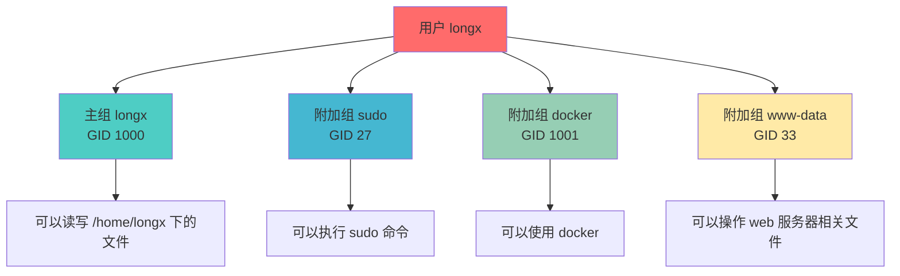
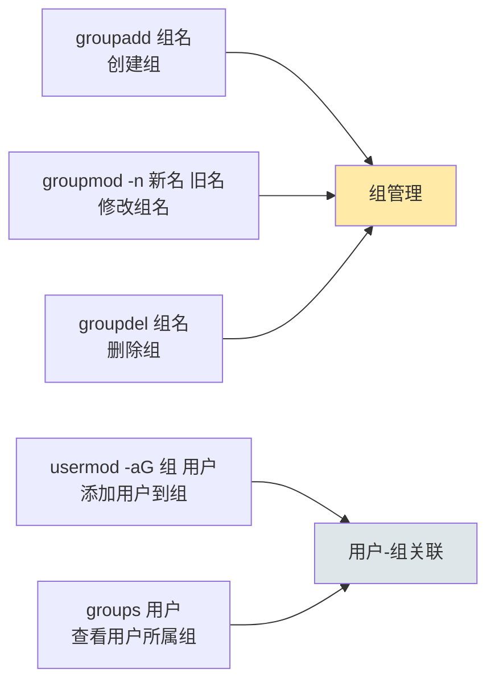

+++
title = "第16章：用户组管理"
weight = 160
date = "2026-03-24T13:18:28+08:00"
type = "docs"
description = ""
isCJKLanguage = true
draft = false
+++


# 第十六章：用户组管理

上一章我们讲了用户管理，用户就像是每个学生。那么问题来了——学生多了，要不要搞个"兴趣小组"？

没错！Linux里的**组（Group）**就是干这个用的。

想象一下：
- 班里有语文课代表、数学课代表、英语课代表——这就是各种用户组
- 课代表可以收发作业（管理特定文件）
- 普通学生只能交作业（读写自己的文件）

组的好处是：**一组人共享某些权限**，比如开发组的成员都能访问项目代码仓库，而市场部的人就进不去。

这一章，我们就来聊聊怎么创建组、管理组，以及组到底是怎么工作的！

---

## 16.1 什么是用户组？组的作用

**组（Group）**是Linux系统中管理一组用户权限的机制。可以理解为"微信群"——你加入一个群，就能看到这个群里的共享文件、群聊记录等。

### 为什么需要组？

假设你是公司服务器的管理员，服务器上有三个部门的文件：
- `/data/sales/` —— 销售部的文件
- `/data/HR/` —— 人事部的文件
- `/data/IT/` —— 技术部的文件

没有组的情况下，如果让销售部的小王访问销售部文件，你会：
1. 给小王单独的读写权限

但如果有20个销售员呢？挨个设置？累死你！

有组的情况下：
1. 创建一个`sales`组
2. 把20个销售员都加到`sales`组
3. 给`sales`组设置访问`/data/sales/`的权限

搞定！以后新来一个销售员，只需要把他加到`sales`组就行了。

### 组的两大类型

- **主组（Primary Group）**：每个用户必须有且只有一个主组，用户创建的文件默认属于这个组。主组就像你的"户口本所在"，你只能有一个户口本。
- **附加组（Supplementary Group）**：用户可以加入多个附加组，类似于你参加的各种兴趣社团。

### 组的存储位置

- `/etc/group` —— 组的基本信息（组名、密码、GID、成员列表）
- `/etc/gshadow` —— 组的密码信息（一般不常用）

### 📊 组的工作原理图



---

## 16.2 groupadd 创建用户组

终于动手了！创建组的命令是`groupadd`，简单粗暴。

### 16.2.1 groupadd 组名 —— 最基本的创建方式

```bash
# 创建一个叫developers的组
sudo groupadd developers
```

执行完，系统会：
1. 在`/etc/group`里添加一行developers的信息
2. 分配一个GID（通常是1000以上的下一个可用数字）
3. 组成员列表为空（暂时没人）

就这么简单！

### 16.2.2 groupadd -g GID 组名 —— 指定GID创建

有时候需要指定特定的GID：

```bash
# 指定GID为5000创建组
sudo groupadd -g 5000 designers
```

> [!NOTE]
> GID 0已经被root组占了，GID 1-999是系统组专区。普通用户组建议使用1000以上的GID。

### 16.2.3 groupadd 常用选项

```bash
# 创建系统组（类似创建系统用户，GID在系统范围内）
sudo groupadd -r system_group

# 创建组并查看结果
sudo groupadd project_team
grep project_team /etc/group
```

```bash
# 输出大概是：
# project_team:x:1005:
```

创建完成后，可以用这些方式验证：

```bash
# 方法1：grep查看
grep developers /etc/group

# 输出：
# developers:x:1003:

# 方法2：getent查看（更可靠）
getent group developers

# 方法3：group命令（某些发行版有）
cat /etc/group | grep developers
```

---

## 16.3 groupmod 修改用户组

创建组之后发现名字起错了？用`groupmod`来修改。

### 16.3.1 groupmod -n 新组名 旧组名 —— 修改组名

```bash
# 把developers组改名为devs
sudo groupmod -n devs developers
```

### 16.3.2 groupmod -g GID 组名 —— 修改GID

```bash
# 把devs组的GID改成6000
sudo groupmod -g 6000 devs
```

> ⚠️ 修改GID可能会导致文件所属组发生变化！如果有文件属于旧GID，改完之后这些文件就会变成新GID。所以改GID之前最好三思。

### 16.3.3 groupmod 常用选项

```bash
# 同时修改组名和GID
sudo groupmod -n new_group_name -g 6000 old_group_name

# 修改完成后验证
getent group new_group_name
```

---

## 16.4 groupdel 删除用户组

删除组用`groupdel`，但有些注意事项：

```bash
# 删除devs组
sudo groupdel devs
```

> [!WARNING]
> 删除组之前，确保没有用户把这个组当作主组！如果某个用户的主组是developers，你直接删了developers组，这个用户的文件可就"无家可归"了（文件会显示GID但找不到对应的组名）。所以：
> 1. 先检查有没有用户用这个组作为主组
> 2. 把用户的主组改成其他组
> 3. 再删除组

```bash
# 1. 先看看谁把这个组当作主组
getent group devs

# 2. 如果有用户，把用户的主组改成另一个组
sudo usermod -g another_group username

# 3. 然后再删除组
sudo groupdel devs
```

```bash
# 查看所有组
getent group | awk -F: '{print $1}'

# 或者
cat /etc/group | cut -d: -f1
```

---

## 16.5 /etc/group 文件格式详解

组的信息存在`/etc/group`文件里，格式比passwd简单多了——只有4个字段。

### 16.5.1 格式：组名:密码:GID:成员列表

```bash
# 查看group文件内容
cat /etc/group
```

输出大概是：

```
root:x:0:
daemon:x:1:
bin:x:2:
sys:x:3:
adm:x:4:longx
sudo:x:27:longx
users:x:100:
developers:x:1003:zhangsan,lisi,wangwu
```

| 字段序号 | 字段名 | 说明 | 示例 |
|---------|--------|------|------|
| 1 | 组名 | 组的名称 | `developers` |
| 2 | 密码 | 以前存组密码，现在都是`x`，表示在/etc/gshadow | `x` |
| 3 | GID | 组标识符 | `1003` |
| 4 | 成员列表 | 附加组成员，用逗号分隔（主组成员不在这里显示） | `zhangsan,lisi,wangwu` |

> [!NOTE]
> **重要区分**：`members`字段只显示**附加组成员**，不显示主组成员。比如zhangsan的主组是developers，但zhangsan的名字不会出现在developers组的members列表里——因为他是主组成员，不是附加组成员。

看个具体例子：

```bash
# 查看当前用户的所属组
id

# 输出：
# uid=1000(longx) gid=1000(longx) groups=1000(longx),4(adm),27(sudo)

# 查看longx在group文件里的对应行
grep "^longx:" /etc/group

# 输出：
# longx:x:1000:
# adm:x:4:longx
# sudo:x:27:longx

# 解释：
# longx:x:1000:     -> longx是主组，members为空
# adm:x:4:longx     -> longx是adm组的附加成员
# sudo:x:27:longx  -> longx是sudo组的附加成员
```

```bash
# 用awk格式化输出group文件的某个用户所在的组
groups longx

# 输出：
# longx : longx adm sudo
```

---

## 16.6 usermod -aG 将用户添加到组

这是日常最常用的组操作之一！把用户加入某个组，让用户获得该组的权限。

```bash
# 把用户zhangsan添加到developers组
sudo usermod -aG developers zhangsan

# 把用户添加到多个组
sudo usermod -aG docker,www-data,developers zhangsan
```

> [!IMPORTANT]
> `-aG`中的`-a`是**追加（append）**的意思，必须和`-G`一起用！如果不用`-a`，而是直接用`-G`，会把用户从所有附加组里踢出去，只保留你指定的组。

正确做法：
```bash
sudo usermod -aG developers zhangsan   # 追加到developers组
```

错误做法：
```bash
sudo usermod -G developers zhangsan    # 这会把zhangsan从其他附加组踢出去！
```

```bash
# 验证一下
id zhangsan

# 输出大概是：
# uid=1001(zhangsan) gid=1001(zhangsan) groups=1001(zhangsan),1003(developers)
```

### gpasswd 命令：另一种添加用户到组的方式

```bash
# 把用户添加到组
sudo gpasswd -a zhangsan developers

# 从组里删除用户
sudo gpasswd -d zhangsan developers
```

```bash
# 设置组密码（用户可以临时用newgrp切换到该组）
sudo gpasswd developers

# 管理员可以设置组密码
# 用户切换组的操作：
# newgrp developers
```

### 图形化方式添加用户到组（桌面环境）

如果你在图形界面下，有些发行版提供了用户管理工具：

```bash
# Ubuntu/Debian
sudo users-admin

# 或者
gnome-control-center user-accounts

# Fedora/RHEL
sudo system-config-users
```

---

## 16.7 groups 查看用户所属组

想知道某个用户加入了哪些组？用`groups`命令：

```bash
# 查看当前用户的组
groups

# 输出：
# longx : longx adm sudo docker

# 查看指定用户的组
groups zhangsan

# 输出：
# zhangsan : zhangsan developers
```

```bash
# 也可以用id命令
id -nG zhangsan
# -n: 显示名称而不是数字
# -G: 显示所有组ID

# 输出：
# zhangsan developers
```

---

## 16.8 newgrp 切换当前组

这是一个比较高级的命令。`newgrp`可以让你**临时切换当前会话的主组**。

有什么用？假设你创建了一个新文件，这个文件默认属于你的主组。如果你想让文件属于另一个组，可以用`newgrp`切换：

```bash
# 查看当前主组
id

# 输出：
# uid=1000(longx) gid=1000(longx) groups=1000(longx),27(sudo)

# 切换主组到developers
newgrp developers

# 再看id
id

# 输出：
# uid=1000(longx) gid=1003(developers) groups=1003(developers),1000(longx),27(sudo)

# 现在创建的文件，所属组就是developers了
touch test_file
ls -la test_file
# -rw-r--r-- 1 longx developers ... test_file

# 切换回原来的组
exit
# 或者
newgrp longx
```

> [!NOTE]
> `newgrp`会启动一个新的shell，而且需要用户属于目标组才能切换（或者知道组密码）。切换回原来的组用`exit`命令。

---

## 16.9 组的实际操作示例

### 场景：为一个项目团队设置共享目录

假设你要为web项目创建一个共享目录，只有项目组成员才能访问。

```bash
# 1. 创建项目组
sudo groupadd webproject

# 2. 创建项目目录
sudo mkdir -p /data/webproject
sudo chown :webproject /data/webproject   # 目录所属组设为webproject

# 3. 设置目录权限（组可读写执行，其他人无权限）
sudo chmod 770 /data/webproject

# 4. 把用户加入组
sudo usermod -aG webproject zhangsan
sudo usermod -aG webproject lisi
sudo usermod -aG webproject wangwu

# 5. 验证
ls -ld /data/webproject
# drwxrwx--- 2 root webproject ... /data/webproject
```

```bash
# 结果：
# zhangsan、lisi、wangwu可以读写/data/webproject里的文件
# 其他用户无法访问该目录
# root用户无视权限，依然可以访问（root是上帝）
```

### 场景：把用户从组中移除

```bash
# 移除用户从某个组
sudo gpasswd -d zhangsan webproject

# 或者用usermod（需要重新指定所有要保留的组）
sudo usermod -G sudo,docker,adm zhangsan
# 注意：这会替换掉原有的附加组列表！
```

---

## 📊 组管理命令速查表



| 操作 | 命令 | 示例 |
|------|------|------|
| 创建组 | `groupadd [-g GID] 组名` | `sudo groupadd developers` |
| 修改组名 | `groupmod -n 新名 旧名` | `sudo groupmod -n devs developers` |
| 修改GID | `groupmod -g GID 组名` | `sudo groupmod -g 5000 devs` |
| 删除组 | `groupdel 组名` | `sudo groupdel developers` |
| 添加用户到组 | `usermod -aG 组 用户` | `sudo usermod -aG sudo zhangsan` |
| 从组移除用户 | `gpasswd -d 用户 组` | `sudo gpasswd -d zhangsan developers` |
| 查看用户所属组 | `groups [用户]` | `groups zhangsan` |

---

## 本章小结

本章我们学习了Linux用户组管理：

### 🔑 核心知识点

1. **组的作用**：
   - 组是用来管理一组用户权限的机制
   - 类似"微信群"，成员共享群资源
   - 分主组（用户必须有且只有一个）和附加组（可以加入多个）

2. **组管理命令**：
   - `groupadd`：创建组
   - `groupmod`：修改组（`-n`改名字，`-g`改GID）
   - `groupdel`：删除组（要确认没有用户以此为主组）

3. **用户-组关系**：
   - `usermod -aG 组 用户`：添加用户到组（`-a`是追加）
   - `gpasswd -a/-d 用户 组`：添加/删除用户
   - `groups 用户`：查看用户所属组
   - `newgrp 组`：临时切换主组

4. **组配置文件**：
   - `/etc/group`：组信息（4个字段：组名:密码:GID:成员列表）
   - `/etc/gshadow`：组密码信息

### 💡 记住这个原则

> **主组是户口本，附加组是兴趣小组。** 一个用户只能有一个户口本，但可以参加无数个兴趣小组。创建文件时，文件默认属于创建者的主组。

---

**当前时间：2026年3月23日 20:21:03**
**已完成"第十六章"，目前处理"第十七章"**
