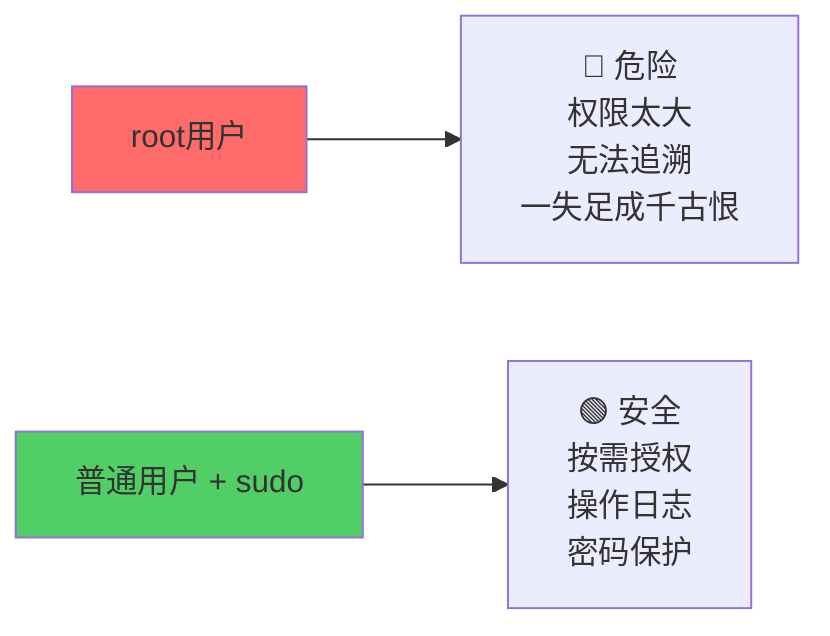
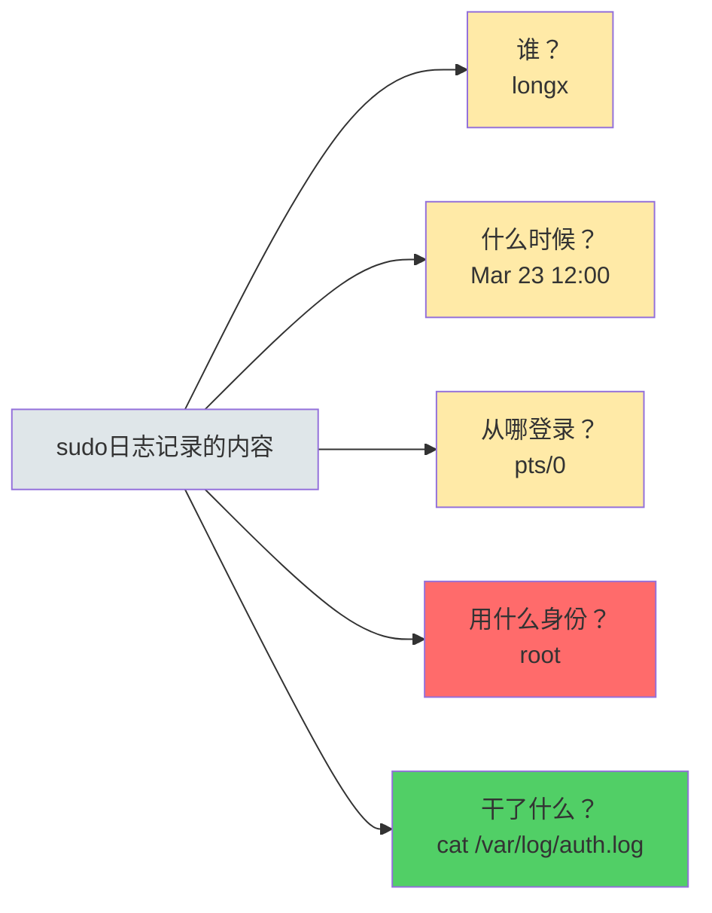
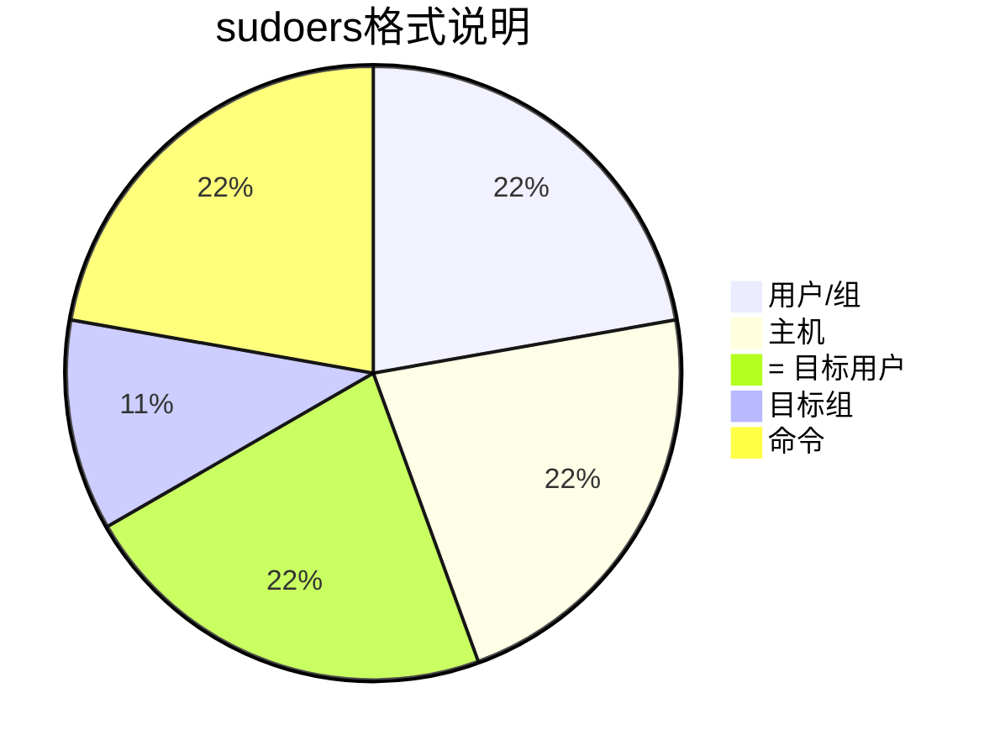

+++
title = "第17章：sudo 权限管理"
weight = 170
date = "2026-03-24T13:18:28+08:00"
type = "docs"
description = ""
isCJKLanguage = true
draft = false
+++


# 第十七章：sudo 权限管理

想象一下这个场景：你是公司大楼的物业经理，但不是老板。你有一把"万能钥匙"，能在紧急情况下打开任何门——但平时你只能用自己家的钥匙。

这就是sudo！普通用户用它临时"升级"成root，干完活又自动降级回普通用户。

这一章，我们来聊聊为什么不要直接用root、怎么用sudo、以及sudo的配置大法。

---

## 17.1 为什么要用 sudo？直接用 root 的危险

直接用root有多危险？这么说吧——root权限就像一把上了膛的枪，走火就是命。

### root 的三大原罪

**1. 杀伤力太大**

root可以`rm -rf /`——没错，这就是著名的"删库跑路"命令。如果你用root敲了这个，眼睛一闭，服务器就成空壳了。

```bash
# 当你以root身份运行时：
rm -rf /     # 这是真的在删系统！不是演习！
# 系统：完蛋，告辞
```

**2. 没有问责机制**

root做的任何操作，系统都记录为"root干的"。如果团队里有多个人用root，你根本不知道是谁误删了文件。

```bash
# root的操作日志里只写：
# root : 删库了
# root : 又删库了
# root : 删库真爽
# 分不清是谁！
```

**3. 远程入侵等于全盘沦陷**

如果有人破解了你的root密码，你的整个系统就像大门敞开的金库——想拿什么拿什么。

### sudo 的四大好处

| sudo的好处 | 解释 |
|-----------|------|
| 最小权限原则 | 只给需要的命令授权，不多不少 |
| 操作可追溯 | 每次sudo都有日志，记录谁在什么时候干了什么 |
| 防误操作 | sudo通常要求输入自己的密码，不是root密码 |
| 团队协作友好 | 不同用户有不同的sudo权限，互不干扰 |

### 📊 root vs sudo 对比图



> [!IMPORTANT]
> **最佳实践**：永远不要直接登录root。用普通用户登录，日常操作用sudo临时提权，需要root时`sudo -i`切换到root shell。

---

## 17.2 sudo 命令使用

sudo的基本语法超级简单：`sudo + 你想执行的命令`

### 17.2.1 sudo + 命令 —— 最基本用法

```bash
# 普通用户想查看系统日志，但日志只有root能读
sudo cat /var/log/auth.log

# 系统会提示输入当前用户的密码（不是root密码！）
# [sudo] password for longx:   # 输入longx的密码
# ... 日志内容输出 ...
```

> [!NOTE]
> 输入密码后，sudo会在一段时间内（默认15分钟）记住你验证过身份，这段时间内再次使用sudo不需要重新输入密码。

### 17.2.2 sudo -i —— 切换到 root

如果你要连续执行多个root命令，用`sudo 命令`一个一个敲太麻烦了，可以切换到root shell：

```bash
# 切换到root shell（会要求输入当前用户密码）
sudo -i

# 现在你是root了，提示符会变成 # 
# root@server:/home/longx#

# 干完活，输入 exit 退回到普通用户
exit
```

### 17.2.3 sudo -s —— 保持当前用户环境

```bash
# -s 会启动一个root shell，但保持当前用户的环境变量
sudo -s

# 跟 -i 的区别：
# -i : 以login shell启动，环境变量重置为root的
# -s : 以non-login shell启动，保持当前用户的环境
```

```bash
# 实际对比
sudo -i    # HOME=/root, 当前目录不变
sudo -s    # HOME=/home/longx（还是你的home），当前目录不变
sudo -i -H # HOME=/root, 当前目录变为root的家目录
```

### 17.2.4 sudo 常用选项

```bash
# -u 用户名：以指定用户的身份运行命令
sudo -u www-data whoami
# 输出：
# www-data

# -l：查看当前用户可以用sudo运行哪些命令
sudo -l

# 输出大概是：
# [sudo] password for longx:
# User longx may run the following commands on this host:
#     (ALL : ALL) ALL

# -k：清除sudo缓存，下次使用需要重新输入密码
sudo -k

# -v：延长sudo验证时间（刷新缓存）
sudo -v

# 查看sudo版本
sudo -V
```

```bash
# 实战例子：安装软件（Debian/Ubuntu）
sudo apt update
sudo apt install nginx

# 实战例子：重启服务
sudo systemctl restart nginx

# 实战例子：以www-data用户身份创建文件
sudo -u www-data touch /var/www/html/test.txt
```

---

## 17.3 /etc/sudoers 文件：sudo 配置

sudo的配置都存在`/etc/sudoers`文件里。这个文件极其重要，配置错了可能导致：
- 所有人都不能用sudo（系统管理灾难）
- 所有人都变成root（安全灾难）

### 17.3.1 格式：用户 主机=(用户) 命令

sudoers的基本格式是：

```bash
用户 主机=(目标用户:目标组) 命令
```

解释一下：
- **用户**：哪个用户可以使用sudo
- **主机**：在哪台主机上可以用（通常用`ALL`表示所有主机）
- **目标用户**：以哪个用户身份运行命令（通常用`ALL`表示任意用户）
- **目标组**：以哪个组身份运行命令（通常省略）
- **命令**：可以运行哪些命令（通常用`ALL`表示所有命令）

### 17.3.2 %组名：用户组

用`%组名`表示一个用户组的成员：

```bash
# sudoers文件里的配置示例：

# 允许wheel组的成员以root身份运行所有命令
%wheel  ALL=(ALL)  ALL

# 允许developers组的成员以任意用户身份运行某些命令
%developers  ALL=(ALL)  /usr/bin/systemctl restart, /usr/bin/apt
```

### 17.3.3 ALL=(ALL) ALL：所有命令

最常见的配置：

```bash
# 让用户longx可以在任何主机上以任何用户身份运行任何命令
longx  ALL=(ALL)  ALL
```

这个配置的意思是：
- `longx` —— 用户longx
- `ALL=(ALL)` —— 可以在任何主机上，以任何用户身份
- `ALL` —— 运行任何命令

### 17.3.4 NOPASSWD：无密码

有些场景下，你可能想让某些命令不需要输入密码：

```bash
# 让longx在本地不需要密码就能sudo
longx  ALL=(ALL)  NOPASSWD: ALL

# 或者只对特定命令免密
longx  ALL=(ALL)  NOPASSWD: /usr/bin/systemctl restart nginx
```

> [!WARNING]
> **免密sudo非常危险！** 除非你有充分的理由，否则不要使用`NOPASSWD: ALL`。

### 17.3.5 sudoers 配置示例

```bash
# 1. 给单个用户完全sudo权限
longx  ALL=(ALL)  ALL

# 2. 给用户组完全sudo权限
%sudo  ALL=(ALL)  ALL

# 3. 让运维用户可以运行所有命令，但需要密码
%ops  ALL=(ALL)  ALL

# 4. 让开发用户只能重启nginx服务
%developers  ALL=(ALL)  /usr/bin/systemctl restart nginx

# 5. 让数据库管理员可以管理mysql
%dbadmin  ALL=(mysql)  ALL

# 6. 限制用户只能以root身份运行特定命令
john  ALL=(root)  /usr/bin/systemctl restart httpd, /usr/bin/systemctl stop httpd

# 7. 限制用户只能在特定主机上使用sudo
alice  webserver01=(ALL)  ALL
```

---

## 17.4 visudo 安全的编辑 sudoers

**绝对不要直接用文本编辑器打开`/etc/sudoers`！** 如果你保存的时候语法错误了，下次谁都可能用不了sudo——包括你自己！

正确做法是用`visudo`命令。

### 17.4.1 语法检查

```bash
# 用visudo编辑sudoers（会锁定文件防止其他人同时编辑）
sudo visudo
```

`visudo`会在你保存前检查语法：
- 如果语法正确，正常保存退出
- 如果语法错误，会报错并让你重新编辑：

```bash
# 错误示例：忘了写ALL
longx  ALL=      # visudo会说：>>> /etc/sudoers: syntax error, line 25 <<

# 正确写法：
longx  ALL=(ALL)  ALL
```

### 17.4.2 锁定文件

`visudo`会锁定`/etc/sudoers`和`/etc/sudoers.d/`目录，防止多人同时编辑造成文件损坏。

```bash
# 查看visudo是否正在运行（锁定状态）
sudo visudo -c

# 输出大概是：
# /etc/sudoers: parsed OK
# /etc/sudoers.d/README: parsed OK
```

### 17.4.3 在 sudoers.d 目录下添加独立配置

`/etc/sudoers.d/`目录是存放额外sudo配置的地方。好处是：
- 不污染主sudoers文件
- 可以单独管理不同用户/组的配置
- 出问题了可以快速禁用（移动文件即可）

```bash
# 在 /etc/sudoers.d/ 下创建一个配置文件
sudo visudo -f /etc/sudoers.d/zhangsan

# 添加内容：
# zhangsan  ALL=(ALL)  ALL

# 保存退出

# 目录下的文件需要设置正确的权限
sudo chmod 0440 /etc/sudoers.d/zhangsan

# 查看所有sudoers配置
sudo visudo -c
# /etc/sudoers: parsed OK
# /etc/sudoers.d/zhangsan: parsed OK
```

> [!NOTE]
> `/etc/sudoers.d/`目录下的文件命名有讲究：
> - 文件名不能包含`.`（点号）
> - 文件权限必须是`0440`
> - 以`#`或`%`开头表示禁用该配置文件

```bash
# 推荐的sudoers.d目录结构：
/etc/sudoers.d/
├── README              # 说明文件（会被忽略）
├── admin               # 管理员组配置
├── developers          # 开发者配置
└── zhangsan            # 某个用户的单独配置
```

---

## 17.5 sudo -l 查看当前用户权限

想知道当前用户能sudo哪些命令？用`-l`选项：

```bash
# 查看当前用户的sudo权限
sudo -l

# 输出示例1（普通用户）：
# User longx may run the following commands on this host:
#     (ALL : ALL) ALL

# 输出示例2（受限用户）：
# User zhangsan may run the following commands on this host:
#     (root) /usr/bin/systemctl restart nginx
```

```bash
# 查看指定用户的sudo权限
sudo -l -u zhangsan

# 以指定用户身份运行whoami
sudo -u zhangsan whoami
# 输出：
# zhangsan
```

```bash
# 查看某个特定命令是否可以用sudo运行
sudo -l | grep systemctl
```

---

## 17.6 sudo 日志：/var/log/auth.log

sudo的每次使用都会被记录下来。日志文件通常是：

- **Debian/Ubuntu**: `/var/log/auth.log`
- **RHEL/CentOS/Fedora**: `/var/log/secure`
- **Arch Linux**: `/var/log/auth.log`或`journalctl`

### 查看sudo操作记录

```bash
# 查看最近的sudo操作
sudo tail -50 /var/log/auth.log | grep sudo

# 输出大概是：
# Mar 23 12:00:00 server sudo: longx : TTY=pts/0 ; PWD=/home/longx ; USER=root ; COMMAND=/bin/cat /var/log/auth.log
# Mar 23 12:05:00 server sudo: longx : TTY=pts/0 ; PWD=/home/longx ; USER=root ; COMMAND=/usr/bin/apt update
```

每条日志都记录了：
- **用户**：谁执行的sudo
- **时间**：什么时候
- **TTY**：从哪个终端
- **PWD**：执行时在哪个目录
- **USER**：以哪个用户身份运行
- **COMMAND**：执行了什么命令

### journalctl 查看sudo日志（systemd系统）

```bash
# 查看sudo日志（journalctl方式）
sudo journalctl -u sudo

# 查看最近100条sudo记录
sudo journalctl -u sudo | tail -100

# 实时查看sudo日志
sudo journalctl -u sudo -f
```

### 📊 sudo日志分析示例



---

## 17.7 sudo 实战配置案例

### 案例1：创建一个"不能删库跑路"的管理员

```bash
# 用visudo添加以下配置：
# 允许zhangsan运行systemctl、journalctl、logsave等查看日志的命令
# 但不允许rm、dd等危险命令
zhangsan  ALL=(root)  /usr/bin/systemctl restart, /usr/bin/systemctl stop, /usr/bin/systemctl status, /usr/bin/journalctl
```

### 案例2：限制Web开发人员只能操作nginx

```bash
# 添加配置：
%webdev  ALL=(www-data)  /usr/bin/systemctl restart nginx, /usr/bin/systemctl stop nginx, /usr/bin/systemctl reload nginx
```

### 案例3：sudo免密码的合理使用场景

```bash
# 在sudoers.d/下创建自动化脚本的配置
# 比如监控脚本需要sudo权限但不应该要求密码

# /etc/sudoers.d/monitoring
monitor  ALL=(root)  NOPASSWD: /usr/local/bin/monitor.sh, /usr/local/bin/backup.sh
```

---

## 📊 sudo配置格式速查表



| 组成部分 | 含义 | 示例 |
|---------|------|------|
| 用户 | 被授权的用户（或`%组名`表示组） | `longx` 或 `%sudo` |
| 主机 | 允许使用的主机 | `ALL`、`192.168.1.100` |
| = 目标用户 | 以哪个用户身份运行 | `(ALL)`、`(root)`、`(www-data)` |
| :目标组 | 以哪个组身份运行 | `:wheel`（可选） |
| 命令 | 允许执行的命令 | `ALL`、`/usr/bin/apt` |

---

## 本章小结

本章我们学习了sudo权限管理：

### 🔑 核心知识点

1. **为什么不用root**：
   - 杀伤力太大，误操作可能毁掉整个系统
   - 没有操作追溯，出问题找不到责任人
   - 远程入侵直接全盘沦陷

2. **sudo基本用法**：
   - `sudo 命令`：以root运行命令
   - `sudo -i`：切换到root shell
   - `sudo -s`：保持当前用户环境的root shell
   - `sudo -u 用户`：以指定用户身份运行

3. **sudoers配置格式**：
   - 基本格式：`用户 主机=(目标用户:目标组) 命令`
   - `%组名`表示用户组
   - `ALL`表示所有
   - `NOPASSWD`表示免密（危险！慎用）

4. **安全编辑sudoers**：
   - **必须用`visudo`**，不能用普通编辑器
   - 配置放在`/etc/sudoers.d/`下更安全

5. **日志查看**：
   - Debian/Ubuntu: `/var/log/auth.log`
   - RHEL/CentOS: `/var/log/secure`

### 💡 记住这个原则

> **永远不要直接登录root。** 用普通用户做事，需要权限时`sudo`一下，这不仅是最佳实践，更是一种"操作系统礼仪"。

---

**当前时间：2026年3月23日 20:28:03**
**已完成"第十七章"，目前处理"第十八章"**
