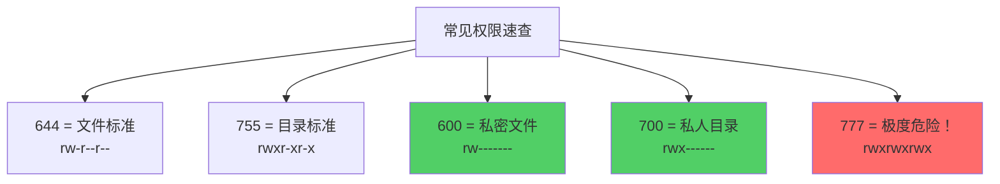
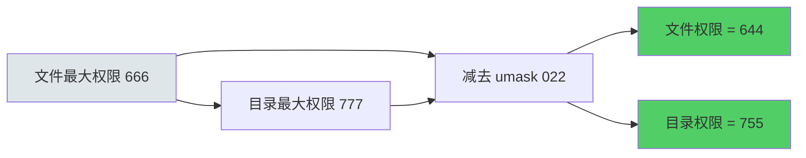
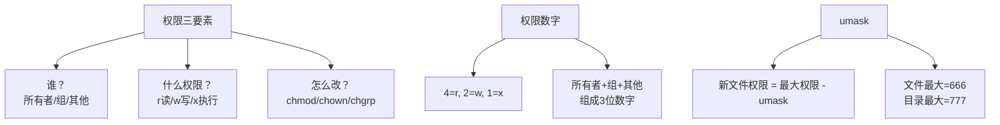

+++
title = "第18章：文件权限详解"
weight = 180
date = "2026-03-24T13:18:28+08:00"
type = "docs"
description = ""
isCJKLanguage = true
draft = false
+++


# 第十八章：文件权限详解

你有没有遇到过这种情况？
- 打开一个文件，显示"权限不够"
- 别人发给你的压缩包，解压出来全是乱码
- 网站突然403了，访问不了

这一切的罪魁祸首都是——**权限**！

Linux的权限系统就像一套复杂的"门禁系统"。每个文件都有它的"锁"，每个用户都有他的"钥匙"。钥匙对了，锁就开；钥匙错了，对不起，请出示您的邀请函。

这一章，我们就来深入聊聊Linux的权限系统。保证你学完之后，面对满屏的`rwxr-xr-x`，再也不会一脸懵。

---

## 18.1 权限的概念

Linux里的权限，其实就是规定了**谁可以对这个文件做什么**的规则。

### 18.1.1 r（read）：读取，数值 4

**读取权限**，说白了就是"能看但不能摸"。

- 对文件：有r权限，可以查看文件内容（`cat`、`less`、`grep`等）
- 对目录：有r权限，可以查看目录里有什么文件（`ls`）

```bash
# 读取文件内容
cat myfile.txt    # 需要r权限

# 列出目录内容
ls /mydir         # 需要r权限
```

### 18.1.2 w（write）：写入，数值 2

**写入权限**，也就是"能改"。

- 对文件：有w权限，可以修改文件内容（`echo`、`vim`、`sed`等）
- 对目录：有w权限，可以在目录里创建、删除文件（`touch`、`rm`、`mv`等）

```bash
# 修改文件内容
echo "hello" > myfile.txt   # 需要w权限

# 在目录里创建文件
touch /mydir/newfile        # 需要w权限
```

> [!WARNING]
> 目录的w权限很危险！如果目录有w权限，用户可以删除里面的任何文件——哪怕那个文件属于root！这就像给你一把万能钥匙，能打开并清空任何房间。

### 18.1.3 x（execute）：执行，数值 1

**执行权限**，就是"能跑"。

- 对文件：有x权限，可以把文件当程序运行（`./script.sh`、`./program`）
- 对目录：有x权限，可以进入这个目录（`cd`）

```bash
# 执行脚本
./my_script.sh   # 需要x权限

# 进入目录
cd /mydir         # 需要x权限
```

> [!NOTE]
> 对于目录来说，x权限意味着"能否穿透这个目录"。没有x权限，就像站在一扇锁着的门前——你能透过窗户看到里面（如果有r权限的话），但进不去。

---

## 18.2 三类用户

Linux的权限系统把用户分成三类：**所有者、所属组、其他用户**。

### 18.2.1 所有者（User）：文件创建者

文件创建的时候，创建者就是文件的所有者。类似于"这套房子是我的"——owner就是房子的业主。

```bash
# 查看文件的所有者
ls -l myfile.txt

# 输出：
# -rw-r--r-- 1 longx developers ... myfile.txt
#         ^^^
#         longx就是所有者
```

### 18.2.2 所属组（Group）：文件所属组

每个文件都属于一个组。类似于"这套房子属于XX小区的XX号楼"。组内的所有用户共享该组的权限。

```bash
# 查看文件的所属组
ls -l myfile.txt

# 输出：
# -rw-r--r-- 1 longx developers ... myfile.txt
#                   ^^^^^^^^^^
#                   developers就是所属组
```

### 18.2.3 其他用户（Other）：其他人

既不是所有者，也不属于所属组的用户，就是"其他用户"。类似于"既不是业主，也不是同楼住户的访客"。

---

## 18.3 权限的数字表示法

数字表示法是Linux权限的"快捷方式"。每个权限对应一个数字：

| 权限 | 符号 | 数值 |
|------|------|------|
| 读取 | r | 4 |
| 写入 | w | 2 |
| 执行 | x | 1 |
| 无权限 | - | 0 |

三个权限位一组，用三个数字表示：

```
所有者  所属组  其他用户
  rwx     r-x     r--
   7       5       4
```

### 18.3.1 - 18.3.8 权限数值对照表

```bash
# 0：无权限（---）
# 没有任何权限，连看都不能看
chmod 000 file    # 谁都不能访问

# 1：执行（--x）
# 只能执行，不能读不能写
chmod 001 file    # 可以运行

# 2：写入（-w-）
# 只能写，不能读不能执行（很少用）
chmod 002 file    # 可以修改

# 3：写+执行（-wx）
# 可以修改，可以运行，但不能读取内容
chmod 003 file    # 可以修改和运行

# 4：读（r--）
# 只能读取，不能修改不能执行
chmod 004 file    # 可以查看

# 5：读+执行（r-x）
# 可以查看，可以运行，但不能修改
chmod 005 file    # 可以查看和运行

# 6：读+写（rw-）
# 可以查看，可以修改，但不能执行
chmod 006 file    # 可以查看和修改

# 7：读+写+执行（rwx）
# 完整权限，啥都能干
chmod 007 file    # 完全控制
```

```bash
# 记住这个口诀：
# 0 = 没戏
# 1 = 跑
# 2 = 写
# 3 = 写+跑
# 4 = 看
# 5 = 看+跑
# 6 = 看+写
# 7 = 看+写+跑（全开）
```

---

## 18.4 常用权限数字

### 18.4.1 755：rwxr-xr-x（标准目录）

```bash
# 最常见的目录权限
# 所有者：rwx（7）—— 完全控制
# 所属组：r-x（5）—— 可以看和进入
# 其他用户：r-x（5）—— 可以看和进入
chmod 755 /mydir
```

这是目录的"标准权限"。任何人都可以进入和查看，但只有所有者能修改。

### 18.4.2 644：rw-r--r--（标准文件）

```bash
# 最常见的文件权限
# 所有者：rw-（6）—— 可以读和写
# 所属组：r--（4）—— 只能读
# 其他用户：r--（4）—— 只能读
chmod 644 readme.txt
```

这是文件的"标准权限"。所有者可以修改文件内容，其他人只能读取。

### 18.4.3 777：rwxrwxrwx（所有人可执行）

```bash
# 最高权限！所有人都能做任何事
# 所有者：rwx（7）
# 所属组：rwx（7）
# 其他用户：rwx（7）
chmod 777 danger.sh
```

> ⚠️ **危险！** 777权限意味着任何人都能修改和执行这个文件。如果是个脚本，那等于把系统大门敞开了。除非你有充分的理由，否则**永远不要设置777权限**。

### 📊 常见权限速查



---

## 18.5 权限的符号表示法

数字法很简洁，但符号法更直观。符号法用字母表示权限：

### 18.5.1 - 18.5.7 符号权限操作

| 符号 | 含义 |
|------|------|
| u | 所有者（user） |
| g | 所属组（group） |
| o | 其他用户（other） |
| a | 所有用户（all） |
| + | 添加权限 |
| - | 移除权限 |
| = | 设置权限（覆盖原有） |

```bash
# chmod u+x file：给所有者添加执行权限
chmod u+x myscript.sh

# chmod g-w file：从所属组移除写入权限
chmod g-w secret.txt

# chmod o=r file：设置其他用户只有读取权限
chmod o=r readme.md

# chmod a+x file：给所有人添加执行权限
chmod a+x launcher.sh

# chmod u=rwx,g=rx,o=：所有者rwx，组rx，其他人无权限
chmod u=rwx,g=rx,o= script.sh
```

```bash
# 实战例子
# 1. 让脚本可执行
chmod +x myscript.sh

# 2. 去掉group和其他人的所有权限
chmod go= file

# 3. 只给所有者读写权限
chmod u=rw,go= file

# 4. 给组和其他人添加读取权限
chmod go+r file
```

> [!NOTE]
> `chmod +x file` 等价于 `chmod a+x file`，是给所有人添加执行权限的快捷方式。

---

## 18.6 chmod 修改权限

`chmod`就是"change mode"的缩写，用来修改文件权限。

### 18.6.1 chmod +x 文件：添加执行权限

```bash
# 最常见的用法：让脚本可执行
chmod +x install.sh

# 等价于：
chmod a+x install.sh
# 或
chmod 755 install.sh
```

```bash
# 验证一下
ls -l install.sh

# 输出：
# -rwxr-xr-x 1 longx developers ... install.sh
#    ^^^
#    现在有执行权限了！
```

### 18.6.2 chmod 755 文件：数字方式

```bash
# 用数字设置权限
chmod 755 /mydir

# 等价于：
chmod u=rwx,g=rx,o=rx /mydir
```

```bash
# 批量设置权限
chmod 644 *.txt      # 所有txt文件设为644
chmod 755 *.sh       # 所有sh文件设为755
chmod 600 ~/.ssh/*   # SSH密钥设为600（只有自己能读写）
```

### 18.6.3 chmod u+x,g-r 文件：多用户设置

```bash
# 同时修改多个角色的权限
chmod u+x,g-w,o=rwx script.sh

# 解释：
# u+x：所有者添加执行权限
# g-w：所属组移除写入权限
# o=rwx：其他用户设为完全控制
```

```bash
# 常用组合
# 让文件可执行，且只有所有者能修改
chmod 755 file
chmod u+x,go-wx file   # 等价

# 撤销所有权限，然后只给所有者读写
chmod 000 file         # 先清零
chmod 600 file         # 再设回600
```

### 18.6.4 递归修改权限

```bash
# -R：递归修改目录及其内容
chmod -R 755 /mydir

# 警告：这会把目录里所有文件的权限都改成755
# 如果只是想改目录本身，不改里面的文件，用：
chmod 755 /mydir
```

---

## 18.7 chown 修改文件所有者

`chown`是"change owner"的缩写，用来修改文件的所有者。

### 18.7.1 chown 用户 文件

```bash
# 把文件的拥有者改成zhangsan
sudo chown zhangsan report.txt

# 验证
ls -l report.txt

# 输出：
# -rw-r--r-- 1 zhangsan developers ... report.txt
#            ^^^^^^^
#            现在是zhangsan的了
```

### 18.7.2 chown 用户:组 文件

```bash
# 同时修改所有者和所属组，用冒号分隔
sudo chown zhangsan:developers project.md

# 验证
ls -l project.md

# 输出：
# -rw-r--r-- 1 zhangsan developers ... project.md
#            ^^^^^^^^ ^^^^^^^^^^^
#            所有者       所属组
```

### 18.7.3 chown -R 用户:组 目录

```bash
# 递归修改：把目录及里面所有内容的主人改成zhangsan
sudo chown -R zhangsan:developers /var/www/html

# 这会修改：
# /var/www/html/（目录本身）
# /var/www/html/index.html（文件）
# /var/www/html/style.css（文件）
# /var/www/html/*.js（所有文件）
```

```bash
# 常用操作：给网站文件设置正确的权限
sudo chown -R www-data:www-data /var/www/html
# 网站服务器（nginx/apache）的用户通常是www-data
# 这样网站文件就归www-data了，网站服务器可以正常读写
```

> [!NOTE]
> 只有root可以修改文件的所有者。普通用户无法把自己的文件"送"给别人。

---

## 18.8 chgrp 修改文件所属组

`chgrp`是"change group"的缩写，用来修改文件所属的组。

```bash
# 把文件的所属组改成developers
chgrp developers report.txt

# 验证
ls -l report.txt

# 输出：
# -rw-r--r-- 1 longx developers ... report.txt
#                        ^^^^^^^^^^^
#                        现在是developers组了
```

```bash
# 递归修改
chgrp -R developers /shared/docs

# 普通用户也可以使用chgrp，但只能改成自己所在的组
# 你不能把文件改成你不属于的组
```

```bash
# chown也可以改组（更常用）
sudo chown :developers file.txt   # 只改组，不改所有者
# 注意：chown在所有者后面加冒号和组名
```

---

## 18.9 umask 默认权限

新创建的文件和目录，它的权限是怎么来的？这就要靠`umask`了！

**umask**是一个"权限掩码"，新文件的权限 = "最大权限" - umask。

### 18.9.1 文件默认：666 - umask

```bash
# 文件的默认权限是666（rw-rw-rw-）
# 减去umask，就是最终的权限

# 如果umask是022：
# 666 - 022 = 644
# rw-rw-rw- - ----w--w- = rw-r--r--
```

### 18.9.2 目录默认：777 - umask

```bash
# 目录的默认权限是777（rwxrwxrwx）
# 减去umask，就是最终的权限

# 如果umask是022：
# 777 - 022 = 755
# rwxrwxrwx - ----w--w- = rwxr-xr-x
```

### 18.9.3 默认 umask：022

```bash
# 查看当前的umask值
umask

# 输出：
# 0022
```

```bash
# umask的含义：
# 第一个0：特殊权限位（SUID/SGID/Sticky Bit）
# 第二个0：所有者的权限（rwx，数值7，这里减0）
# 第三个2：所属组的权限（r-x，数值5，这里减2）
# 第四个2：其他人的权限（r-x，数值5，这里减2）
```

```bash
# 设置umask（临时生效，当前shell会话内）
umask 027

# 设置umask为027的效果：
# 文件：666 - 027 = 640 (rw-r-----)
# 目录：777 - 027 = 750 (rwxr-x---)
```

```bash
# 永久设置umask（在~/.bashrc或~/.profile里）
echo "umask 027" >> ~/.bashrc
source ~/.bashrc

# 或者更规范的做法：
# 在 ~/.bashrc 中找到 umask 那行，修改它
```

```bash
# 不同场景推荐使用的umask值：
# 普通用户：0022（组外的人没有写入权限）
# 多用户协作：0002（组成员可以互相修改文件）
# 极度安全：0077（只有自己能访问）
```

### 📊 umask 计算示例



---

## 18.10 权限修改案例：网站目录权限配置

这是一个非常实用的场景！假设你搭了一个网站，目录是`/var/www/html`，怎么设置正确的权限？

```bash
# 1. 先看看现在的权限情况
ls -la /var/www/html

# 输出：
# total 8
# drwxr-xr-x 5 root root 4096 ... .
# drwxr-xr-x 2 root root 4096 ... ..
# -rw-r--r-- 1 root root  220 ... index.html
# -rw-r--r-- 1 root root  330 ... style.css
```

```bash
# 2. 把网站目录及所有文件设为www-data用户和组
sudo chown -R www-data:www-data /var/www/html

# 3. 设置目录权限为755（可以进入和查看）
sudo find /var/www/html -type d -exec chmod 755 {} \;

# 4. 设置文件权限为644（所有者可读写，其他人只能读）
sudo find /var/www/html -type f -exec chmod 644 {} \;

# 5. 给上传目录单独设置权限（允许写入）
sudo chown -R www-data:www-data /var/www/html/uploads
sudo chmod 755 /var/www/html/uploads

# 6. 验证最终权限
ls -la /var/www/html

# 输出：
# drwxr-xr-x 5 www-data www-data ... .
# drwxr-xr-x 3 root root   ... ..
# -rw-r--r-- 1 www-data www-data 220 ... index.html
# -rw-r--r-- 1 www-data www-data 330 ... style.css
# drwxr-xr-x 5 www-data www-data ... uploads/
```

> [!IMPORTANT]
> **安全提醒**：
> - 上传目录不要设置777！否则任何人都能往你的网站上传恶意文件
> - 网站配置文件（如`.env`）权限要更严格，比如600
> - 定期检查权限，发现异常及时调整

---

## 18.11 常见权限问题与解决

### 问题1：Permission denied（权限被拒绝）

```bash
# 错误信息：
# bash: ./script.sh: Permission denied

# 原因：脚本没有执行权限

# 解决：
chmod +x script.sh
./script.sh
```

### 问题2：Operation not permitted（操作不被允许）

```bash
# 错误信息：
# rm: cannot remove 'file': Operation not permitted

# 原因：可能是文件被锁定了（chattr +i）

# 解决：
# 查看文件属性
lsattr file
# 如果有 i 属性：
sudo chattr -i file
# 然后再删除
```

### 问题3：chown: changing ownership: Operation not permitted

```bash
# 错误信息：
# chown: changing ownership of 'file': Operation not permitted

# 原因：普通用户不能修改文件所有者（只有root可以）

# 解决：
# 用sudo
sudo chown newuser:newgroup file
```

### 问题4：目录有写权限但无法创建文件

```bash
# 现象：
# 目录权限是777，但创建文件报错

# 原因：可能是文件系统挂载时带了noexec或ro选项

# 检查：
mount | grep /mydir
# 如果看到ro或noexec，就需要sudo mount重新挂载
```

### 问题5：sudo仍然提示权限不够

```bash
# 错误信息：
# sudo: unable to open /var/log/sudo: Permission denied

# 原因：sudo日志文件权限被改坏了

# 解决：
# 从root会话修复
sudo -i
chmod 755 /var/log/sudo
chown root:root /var/log/sudo
```

---

## 📊 权限系统速查表



| 操作 | 命令 | 示例 |
|------|------|------|
| 修改文件权限 | `chmod` | `chmod 755 file` |
| 修改所有者 | `chown` | `chown user file` |
| 修改所属组 | `chgrp` | `chgrp group file` |
| 查看umask | `umask` | `umask` |
| 设置umask | `umask` | `umask 022` |

---

## 本章小结

本章我们学习了Linux文件权限系统：

### 🔑 核心知识点

1. **三种权限**：
   - r（read，4）：读取
   - w（write，2）：写入
   - x（execute，1）：执行

2. **三类用户**：
   - 所有者（u）：文件创建者
   - 所属组（g）：文件所属组
   - 其他用户（o）：既不是所有者也不在组里

3. **数字权限表示法**：
   - 0 = 无权限，7 = rwx
   - 常见：644（文件）、755（目录）、600（私钥）

4. **修改权限的命令**：
   - `chmod`：修改权限（数字或符号）
   - `chown`：修改所有者
   - `chgrp`：修改所属组
   - `umask`：设置新建文件的默认权限

5. **umask**：
   - 文件默认666，目录默认777
   - 新权限 = 最大权限 - umask

### 💡 记住这个原则

> **权限最小化原则**——只给需要的权限，不多给。网站目录用755，配置文件用600，永远别用777。

---

**当前时间：2026年3月23日 20:35:03**
**已完成"第十八章"，目前处理"第十九章"**
