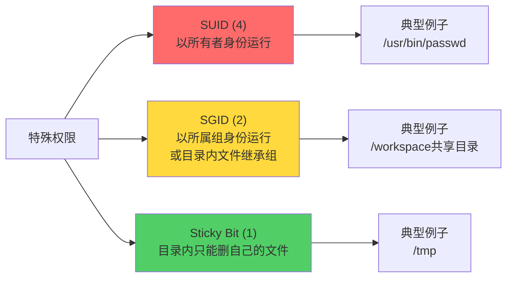
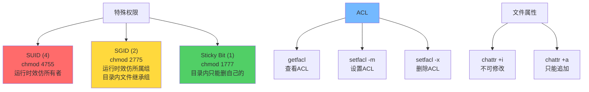

+++
title = "第19章：特殊权限与 ACL"
weight = 190
date = "2026-03-24T13:18:28+08:00"
type = "docs"
description = ""
isCJKLanguage = true
draft = false
+++


# 第十九章：特殊权限与 ACL

恭喜你！如果你能坚持到这里，说明你对Linux权限已经有相当的了解了。

但Linux的权限系统还有"隐藏关卡"——**特殊权限**和**ACL（访问控制列表）**。

普通权限只能控制"所有者、所属组、其他人"三类人，但如果我想让张三有读写权限，李四只有读权限，王五完全没权限呢？普通权限做不到，这就需要ACL出场了。

而特殊权限——SUID、SGID、Sticky Bit——则是一些"魔法权限"，能让普通用户干一些平时干不了的事。

这一章，让我们一起揭开这些"隐藏技能"！

---

## 19.1 SUID 特殊权限（4）：让普通用户执行 root 权限

**SUID**的全称是**Set User ID**，也叫Set-UID。

### 它的作用是什么？

当一个可执行文件设置了SUID权限后，**任何运行这个程序的用户，都会以该文件所有者的身份运行它**。

这听起来有点绕，让我举个例子：

```bash
# /usr/bin/passwd 命令的所有者是root
# 而且它设置了SUID权限

# 意味着：
# 普通用户longx运行passwd时
# 不是以longx的身份运行
# 而是以root的身份运行！

# 这样longx才能修改/etc/shadow（这个文件只有root能写）
```

### 19.1.1 典型例子：/usr/bin/passwd

```bash
# 查看passwd命令的权限
ls -l /usr/bin/passwd

# 输出：
# -rwsr-xr-x 1 root root ... /usr/bin/passwd
#       ^
#       注意这个s！这就是SUID的标志
```

正常情况下，普通用户不能修改`/etc/shadow`（因为只有root能写）。但`passwd`命令需要让普通用户能够修改自己的密码，怎么办？给它设置SUID！

设置了SUID后，运行passwd的任何人，都会暂时"变成"root，当然就能修改shadow文件了。

### 19.1.2 设置：chmod 4755 文件

```bash
# 设置SUID
# 4 = SUID
# 755 = rwxr-xr-x（普通权限）
# 所以4755 = SUID + rwxr-xr-x

chmod 4755 /path/to/file

# 或者用符号方式：
chmod u+s /path/to/file
```

```bash
# 查看SUID是否设置
ls -l /path/to/file

# 如果有SUID：
# -rwsr-xr-x  ... file
#    ^
#    s 表示SUID+执行权限

# 如果没有执行权限但有SUID：
# -rwSr-xr-x  ... file
#    ^
#    S 表示SUID但没有执行权限（无效状态）
```

### SUID的注意事项

```bash
# 危险的SUID示例：
chmod 4755 /bin/bash
# 这会让任何人运行bash都以root身份运行！
# 相当于给所有人开了个root后门！
# 绝对不要这么做！

# 正确的做法：
# SUID只应该用于确实需要的程序（如passwd）
# 不应该用于shell、编辑器等
```

```bash
# 查看系统里所有设置了SUID的文件
sudo find / -perm -4000 -type f 2>/dev/null

# 输出大概是：
# -rwsr-xr-x 1 root root /usr/bin/passwd
# -rwsr-xr-x 1 root root /usr/bin/sudo
# -rwsr-xr-x 1 root root /usr/bin/newgrp
# -rwsr-xr-x 1 root root /usr/bin/gpasswd
# -rwsr-xr-x 1 root root /usr/bin/mount
# -rwsr-xr-x 1 root root /usr/bin/umount
```

---

## 19.2 SGID 特殊权限（2）：目录内文件继承组

**SGID**的全称是**Set Group ID**，也叫Set-GID。

### 它的作用是什么？

SGID对文件和目录有不同的效果：

- **对文件**：类似SUID，但以文件所属组的身份运行
- **对目录**：在该目录内创建的文件，会自动继承该目录的所属组

### 19.2.1 典型例子：/usr/bin/mlocate

```bash
# mlocate数据库查询工具
ls -l /usr/bin/mlocate

# 输出：
# -r-xr-s 1 root mlocate ... /usr/bin/mlocate
#        ^
#        s 表示SGID
```

### 19.2.2 目录继承组：协作目录的最佳实践

SGID在目录上非常有用！假设一个团队在共享目录里工作：

```bash
# 场景：公司有一个共享项目目录/workspace
# 所有开发人员都属于developers组
# 团队希望所有新创建的文件都自动属于developers组

# 1. 创建共享目录
sudo mkdir /workspace

# 2. 设置目录所属组为developers
sudo chown :developers /workspace

# 3. 设置SGID，这样目录下创建的文件都自动属于developers组
sudo chmod 2775 /workspace
#       ^^
#       2 = SGID

# 4. 给开发者们设置权限
sudo chmod 770 /workspace
# 或者让所有developers组的人都能访问
sudo chmod 770 /workspace
```

```bash
# 现在验证一下SGID的效果
cd /workspace

# longx创建一个文件
touch project.txt

# 查看文件权限
ls -l project.txt

# 输出：
# -rw-r--r-- 1 longx developers ... project.txt
#              ^^^^^^^^^^
#              自动继承了目录的组！
```

```bash
# 设置SGID的命令
chmod 2775 /directory    # 2 = SGID
chmod g+s /directory      # 符号方式
```

```bash
# 查看SGID
ls -ld /directory

# 如果有SGID：
# drwxrwsr-x ... directory
#      ^
#      s 表示SGID+执行权限

# 如果有执行权限但没s（无效）：
# drwxr-Sr-x ... directory
```

---

## 19.3 Sticky Bit 粘滞位（1）：只能删除自己的文件

**Sticky Bit**，也叫粘滞位。

### 它的作用是什么？

设置了Sticky Bit的目录，**在该目录里，只有文件所有者才能删除自己的文件**。

这听起来有点绕？为什么需要这个？

### 19.3.1 典型例子：/tmp

```bash
# /tmp目录大家都能用，但谁也不能删别人的文件
ls -ld /tmp

# 输出：
# drwxrwxrwt 8 root root ... /tmp
#        ^
#        t 就是Sticky Bit的标志
```

`/tmp`目录是公共目录，所有人都在里面创建文件。如果不设置Sticky Bit：
- 假设我是张三，我创建了`/tmp/zhangsan.txt`
- 李四跑过来一看不顺眼，给我删了

这多可怕！设置Sticky Bit后：
- 只能删除自己的文件
- 别人的文件？对不起，删不了

### 19.3.2 设置：chmod 1777 目录

```bash
# 设置Sticky Bit
chmod 1777 /public_directory
#     ^
#     1 = Sticky Bit

# 或者用符号方式：
chmod +t /public_directory
```

```bash
# 查看Sticky Bit
ls -ld /public_directory

# 如果有Sticky Bit：
# drwxrwxrwt ... /public_directory
#        ^
#        t 表示Sticky Bit+执行权限

# 如果有执行权限但没t（无效）：
# drwxrwxr-T ... /public_directory
```

### 📊 三种特殊权限对比



---

## 19.4 查看特殊权限：ls -l 第四位字符

用`ls -l`查看文件权限时，特殊权限会显示在第四位：

```bash
# 普通权限
ls -l file.txt
# -rw-r--r-- ... file.txt

# SUID（所有者执行位变s）
ls -l /usr/bin/passwd
# -rwsr-xr-x ... /usr/bin/passwd
#    ^

# SGID（所属组执行位变s）
ls -ld /workspace
# drwxrwsr-x ... /workspace
#     ^

# Sticky Bit（其他人执行位变t）
ls -ld /tmp
# drwxrwxrwt ... /tmp
#       ^
```

```bash
# 权限位对照表：
#          SUID    SGID    Sticky
# 文件：  -rwSrwSrwx  (无效状态，有SUID/SGID但没有执行位)
#        -rwsr-xr-x    (SUID有效)
#        -rwxr-sr-x    (SGID有效)
#        -rwsr-xr-t    (SUID+Sticky有效)
#
# 目录：  drwxr-Sr-x    (无效状态)
#        drwxrwsr-x     (SGID有效)
#        drwxrwxrwt     (Sticky有效)
#        drwxrwsrwt     (SGID+Sticky有效)
```

---

## 19.5 设置特殊权限：chmod 4755

```bash
# 完整格式：特殊权限 + 普通权限
# chmod [特殊权限][所有者][所属组][其他人] 文件

# SUID (4) + rwxr-xr-x (755) = 4755
chmod 4755 myapp

# SGID (2) + rwxrwxr-x (775) = 2775
chmod 2775 shared_dir

# Sticky Bit (1) + rwxrwxrwx (777) = 1777
chmod 1777 /tmp

# 组合：SGID + Sticky Bit + rwxrwxr-x = 3775
chmod 3775 shared_dir
```

```bash
# 也可以分开设置
chmod u+s file    # 添加SUID
chmod g+s dir     # 添加SGID
chmod +t dir      # 添加Sticky Bit

chmod u-s file    # 移除SUID
chmod g-s dir     # 移除SGID
chmod -t dir      # 移除Sticky Bit
```

---

## 19.6 ACL 访问控制列表：更细粒度的权限

ACL（Access Control List）可以给文件设置"例外权限"——除了所有者、所属组、其他人之外，还能单独给某个特定用户或组设置权限。

### 为什么需要ACL？

普通权限只能控制三类人，但现实更复杂：

```bash
# 场景：
# 文件属于root:root，权限是640（root读写，组只读，其他人无权限）

# 但是！张三需要读写这个文件
# 普通权限做不到！

# 解决方案：ACL！
```

### 19.6.1 getfacl 文件：查看 ACL

```bash
# 查看文件的ACL
getfacl myfile.txt

# 输出大概是：
# # file: myfile.txt
# # owner: root
# # group: root
# user::rw-
# group::r--
# other::---
```

这就是默认的ACL（没有额外设置）。现在给张三添加读写权限：

```bash
# 1. 给用户zhangsan添加读写权限
setfacl -m u:zhangsan:rw myfile.txt

# 2. 再查看ACL
getfacl myfile.txt

# 输出：
# # file: myfile.txt
# # owner: root
# # group: root
# user::rw-
# user:zhangsan:rw-         # 新增的！
# group::r--
# mask::rw-                  # ACL掩码
# other::---
```

### 19.6.2 setfacl -m u:用户:权限 文件

```bash
# 格式：setfacl -m [u:用户:g:组]:权限 文件

# 给用户设置权限
setfacl -m u:username:rwx file

# 给组设置权限
setfacl -m g:groupname:rx file

# 同时设置多个ACL规则
setfacl -m u:zhangsan:rw,g:developers:r,o::- file
#           用户      组           其他
```

```bash
# 实战例子
# 文件属于root:root，权限644
# 现在需要：
# - zhangsan：读写
# - lisi：只读
# - developers组：读写

sudo setfacl -m u:zhangsan:rw /shared.txt
sudo setfacl -m u:lisi:r /shared.txt
sudo setfacl -m g:developers:rw /shared.txt

# 验证
getfacl /shared.txt

# 输出：
# # file: shared.txt
# # owner: root
# # group: root
# user::rw-
# user:zhangsan:rw-
# user:lisi:r--
# group::r--
# group:developers:rw-
# mask::rw-
# other::---
```

```bash
# 设置目录的默认ACL（该目录内新建的文件自动继承这个ACL）
setfacl -m d:u:zhangsan:rw /workspace

# 查看带默认ACL的目录
getfacl /workspace

# 输出：
# # file: workspace
# user::rwx
# group::r-x
# other::r-x
# default:user::rwx
# default:user:zhangsan:rw-
# default:group::r-x
# default:mask::rwx
# default:other::r-x
```

### ACL权限的删除

```bash
# 删除某个用户的ACL
setfacl -x u:zhangsan /shared.txt

# 删除某个组的ACL
setfacl -x g:developers /shared.txt

# 删除所有ACL
setfacl -b /shared.txt
```

### ACL掩码（mask）

```bash
# ACL有一个"掩码"，会限制所有ACL条目的最大权限
# 查看掩码
getfacl file | grep mask

# 设置掩码
setfacl -m m::rx file
# 这会把所有用户和组的ACL权限限制在r-x范围内
```

> [!NOTE]
> ACL掩码会自动更新为所有ACL条目的最大权限，但如果手动修改了掩码，所有ACL条目的实际权限都会受影响。

---

## 19.7 lsattr 查看文件属性

`lsattr`可以查看文件的特殊属性（不是权限！是属性！）。

```bash
# 查看文件的属性
lsattr myfile.txt

# 输出：
# -------------e-- myfile.txt
```

属性位说明：

| 属性 | 含义 |
|------|------|
| a | 只能追加（append only），只能写入，不能删除或覆盖 |
| A | 不更新访问时间（atime） |
| c | 自动压缩后存储 |
| i | 不可修改（immutable），不能删除、不能重命名、不能修改 |
| j | 数据写入前先记录到日志（ext3/4） |
| s | 安全删除（文件删除时，内容被零填充） |

---

## 19.8 chattr 修改文件属性

`chattr`用来修改文件的特殊属性。

### 19.8.1 chattr +i 文件：不可修改

```bash
# 设置i属性：文件不可修改（连root都不能删改）
sudo chattr +i /etc/passwd

# 尝试删除或修改
rm /etc/passwd
# rm: cannot remove '/etc/passwd': Operation not permitted

# 移除i属性
sudo chattr -i /etc/passwd
```

> [!WARNING]
> `+i`属性非常危险！如果对`/bin`、`/lib`等目录设置，可能导致系统无法启动。慎用！

### 19.8.2 chattr +a 文件：只能追加

```bash
# 设置a属性：只能追加，不能覆盖或删除
sudo chattr +a /var/log/mylog.log

# 可以追加内容
echo "new log entry" >> /var/log/mylog.log

# 但不能覆盖
echo "overwrite" > /var/log/mylog.log
# bash: /var/log/mylog.log: Operation not permitted

# 移除a属性
sudo chattr -a /var/log/mylog.log
```

### 常用场景

```bash
# 1. 保护系统配置文件
sudo chattr +i /etc/passwd
sudo chattr +i /etc/shadow
sudo chattr +i /etc/group

# 2. 日志文件只允许追加（防止被篡改）
sudo chattr +a /var/log/auth.log

# 3. 保护重要的日志文件（即使root也删不了）
sudo chattr +i /var/log/syslog

# 4. 查看所有设置了i属性的文件
sudo find / -attr +i 2>/dev/null
```

```bash
# chattr的属性对照表
chattr +i file    # 不可删除、不可修改（完全锁死）
chattr +a file    # 只能追加、不能覆盖
chattr +s file    # 安全删除（删除时内容清零）
chattr +u file    # 恢复删除（如果文件系统支持）
```

---

## 📊 特殊权限与 ACL 速查表



---

## 本章小结

本章我们学习了Linux的特殊权限和ACL：

### 🔑 核心知识点

1. **SUID（Set User ID）**：
   - 数值：4
   - 作用：任何用户运行该程序，都以文件所有者的身份运行
   - 典型例子：`/usr/bin/passwd`
   - 设置：`chmod 4755 file`

2. **SGID（Set Group ID）**：
   - 数值：2
   - 作用：对文件是以所属组身份运行，对目录是新建文件继承目录组
   - 设置：`chmod 2775 directory`

3. **Sticky Bit（粘滞位）**：
   - 数值：1
   - 作用：目录内每个用户只能删除自己的文件
   - 典型例子：`/tmp`
   - 设置：`chmod 1777 directory`

4. **ACL（访问控制列表）**：
   - 作用：给特定用户或组设置"例外权限"
   - `getfacl file`：查看ACL
   - `setfacl -m u:user:rw file`：添加用户ACL
   - `setfacl -x u:user file`：删除用户ACL

5. **文件属性（chattr）**：
   - `chattr +i`：不可修改（连root也挡不住）
   - `chattr +a`：只能追加

### 💡 记住这个原则

> **特殊权限是双刃剑**——用得好是神器，用不好是灾难。SUID/SGID不要滥用，Sticky Bit是共享目录的好帮手，ACL是细粒度权限的终极解决方案。

---

**当前时间：2026年3月23日 20:42:03**
**已完成"第十九章"！🎉**
