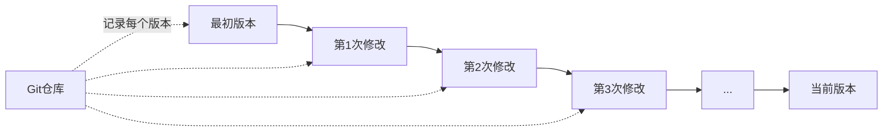
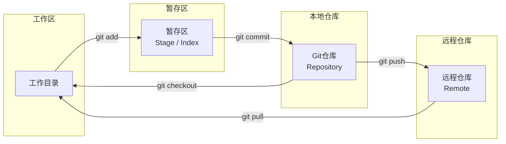
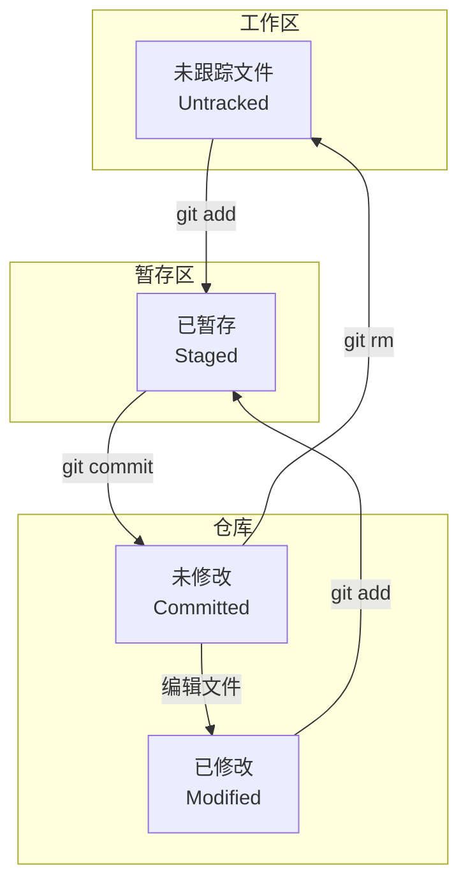
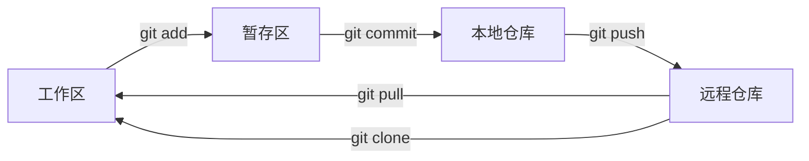

+++
title = "第55章：Git 基础"
weight = 550
date = "2026-03-24T13:18:28+08:00"
type = "docs"
description = ""
isCJKLanguage = true
draft = false
+++


# 第五十五章：Git 基础

## 55.1 Git 简介

### 什么是 Git？

想象一下：你写了一篇论文，每天改一点，改了30天。终于有一天，电脑蓝屏了，论文没了，只剩下一个礼拜前的版本。

或者这样：你和同事一起写代码，他把你写的代码覆盖了，还没法恢复。

**惨案现场.jpg**

这时候，**Git** 就是你的"时光机"和"后悔药"！



### Git 的诞生

Git 是 Linux 之父**林纳斯·托瓦兹**（Linus Torvalds）在 2005 年创造的。

当时，商业版本控制系统 BitKeeper 不再免费开源了，林纳斯一怒之下，花了**两周时间**写出了 Git。

> "我是个自大狂，所以我决定自己写一个版本控制系统。"
> —— 林纳斯·托瓦兹

结果 Git 成为了世界上最流行的版本控制系统，没有之一。

### Git 能做什么？

| 功能 | 说明 | 类比 |
|------|------|------|
| 版本控制 | 记录每个版本的修改 | 游戏的"存档"功能 |
| 多人协作 | 多人同时开发，合并代码 | 多人联机游戏 |
| 分支管理 | 创建独立开发线 | 看电影时的"平行世界" |
| 追溯历史 | 查看谁在什么时候改了什么 | 视频回放 |
| 备份恢复 | 代码不会丢失 | 云端存档 |

### Git vs 其他版本控制系统

| 特性 | Git | SVN | CVS |
|------|-----|-----|-----|
| 类型 | 分布式 | 集中式 | 集中式 |
| 离线可用 | ✅ 完全可用 | ❌ 需要服务器 | ❌ 需要服务器 |
| 分支 | 轻量级快速 | 笨重 | 不支持 |
| 速度 | 超快 | 慢 | 慢 |
| 安全性 | 难以篡改 | 一般 | 一般 |

### Git 的核心概念



**工作区 (Working Directory)**：你正在编辑文件的地方
**暂存区 (Stage/Index)**：准备提交的区域
**本地仓库 (Repository)**：本地的 Git 数据库
**远程仓库 (Remote)**：GitHub、GitLab 等服务器上的仓库

## 55.2 Git 安装与配置

### 安装 Git

**Ubuntu/Debian:**
```bash
sudo apt update
sudo apt install git
```

**CentOS/RHEL:**
```bash
sudo yum install git
```

**macOS:**
```bash
# 方法一：使用 Homebrew
brew install git

# 方法二：安装 Xcode Command Line Tools
xcode-select --install
```

**Windows:**
```bash
# 使用 Chocolatey
choco install git

# 或下载安装包
# https://git-scm.com/download/win
```

### 验证安装

```bash
$ git --version
git version 2.34.1
```

### 首次配置

Git 安装后需要设置用户名和邮箱，这是你每次提交的"签名"：

```bash
# 设置全局用户名（所有仓库都用这个）
git config --global user.name "你的名字"

# 设置全局邮箱
git config --global user.email "your.email@example.com"

# 查看所有配置
git config --list

# 查看某个配置
git config user.name
```

### 配置文件

Git 配置有三个级别，按优先级排序：

| 级别 | 文件位置 | 范围 |
|------|---------|------|
| 系统级 | `/etc/gitconfig` | 所有用户的所有仓库 |
| 用户级 | `~/.gitconfig` 或 `~/.config/git/config` | 当前用户的所有仓库 |
| 仓库级 | `.git/config` | 当前仓库 |

```bash
# 系统级配置（需要管理员权限）
git config --system core.editor vim

# 用户级配置
git config --global core.editor vim

# 仓库级配置（当前仓库）
git config core.editor vim
```

### 常用配置

```bash
# 设置默认分支名
git config --global init.defaultBranch main

# 设置克隆默认采用 SSH
git config --global url."git@github.com:".insteadOf "https://github.com/"

# 设置别名（简化命令）
git config --global alias.st status
git config --global alias.co checkout
git config --global alias.br branch
git config --global alias.ci commit
git config --global alias.unstage 'reset HEAD --'

# 启用彩色输出
git config --global color.ui auto

# 设置默认编辑器
git config --global core.editor vim

# 设置提交模板
git config --global commit.template ~/.gitmessage.txt
```

### 创建提交模板

```bash
# ~/.gitmessage.txt
# ====================
#
# 标题（必填，不超过50字）
#
# 详细内容（可选）
#
# 类型：
#   feat: 新功能
#   fix: 修复bug
#   docs: 文档变更
#   style: 代码格式
#   refactor: 重构
#   test: 测试
#   chore: 构建/工具
#
# ====================
```

## 55.3 仓库创建与克隆

### 创建新仓库

**方式一：在当前目录初始化**

```bash
# 进入项目目录
cd my-project

# 初始化 Git 仓库
git init

# 输出：
# Initialized empty Git repository in /path/to/my-project/.git/
```

**方式二：创建新目录并初始化**

```bash
git init my-new-project
cd my-new-project
```

### .git 目录

`git init` 会在当前目录创建一个 `.git` 目录，这是 Git 的"数据库"：

```bash
ls -la .git/
# .git/
# ├── HEAD          # 指向当前分支
# ├── config        # 仓库配置
# ├── description   # 仓库描述
# ├── hooks/        # 钩子脚本
# ├── info/         # 信息
# ├── objects/      # 对象存储（核心数据库）
# └── refs/         # 引用（分支、标签）
```

### 克隆远程仓库

```bash
# 克隆整个仓库
git clone https://github.com/user/repo.git

# 指定目录名
git clone https://github.com/user/repo.git my-folder

# 克隆特定分支
git clone -b develop https://github.com/user/repo.git

# 浅克隆（只下载最新版本，省时间）
git clone --depth 1 https://github.com/user/repo.git
```

### 常见协议

| 协议 | 格式 | 说明 |
|------|------|------|
| HTTPS | `https://github.com/user/repo.git` | 需要输入用户名密码（可用 token） |
| SSH | `git@github.com:user/repo.git` | 需要配置 SSH Key，更安全 |
| Git | `git://github.com/user/repo.git` | 只读，防火墙常用 |

### SSH Key 配置（推荐）

```bash
# 1. 检查是否已有 SSH Key
ls ~/.ssh/

# 2. 生成新的 SSH Key
ssh-keygen -t ed25519 -C "your.email@example.com"

# 3. 一路回车（使用默认位置，空密码）
# Enter file in which to save the key (/home/user/.ssh/id_ed25519):
# Enter passphrase (empty for no passphrase):

# 4. 查看公钥
cat ~/.ssh/id_ed25519.pub

# 5. 复制公钥到 GitHub/GitLab
# GitHub: Settings -> SSH and GPG keys -> New SSH key
```

## 55.4 文件状态

### Git 文件生命周期



### 四种文件状态

| 状态 | 说明 | 例子 |
|------|------|------|
| **Untracked** | Git 未跟踪的新文件 | 新创建的 `readme.txt` |
| **Modified** | 已跟踪文件被修改 | 修改了 `app.py` |
| **Staged** | 暂存区中的文件 | `git add` 后的文件 |
| **Committed** | 已提交到仓库 | `git commit` 后的文件 |

### 查看状态

```bash
git status

# 输出示例：
# On branch main
# 
# Changes not staged for commit:
#   modified:   app.py
#
# Untracked files:
#   newfile.txt
#
# Changes to be committed:
#   (use "git reset HEAD <file>..." to unstage)
#   modified:   readme.md
```

### 简化输出

```bash
# 简洁模式
git status -s

# 输出示例：
# M app.py           # M = Modified（工作区修改）
# A newfile.txt      # A = Added（新增，已暂存）
# D deleted.txt      # D = Deleted（删除）
# R renamed.txt      # R = Renamed（重命名）
# ?? readme.txt      # ?? = Untracked（未跟踪）
```

## 55.5 git add

`git add` 把文件从工作区放入暂存区，准备提交。

### 基本用法

```bash
# 添加单个文件
git add readme.txt

# 添加多个文件
git add readme.txt app.py

# 添加所有文件
git add .

# 添加所有修改和删除，不包含未跟踪文件
git add -u

# 查看将要添加的内容（不实际添加）
git add -n .
```

### 交互式添加

```bash
# 交互式添加
git add -i

# 输出：
# *** Commands ***
#   1: status      2: update      3: revert
#   4: add untracked  5: patch      6: diff
#   7: quit      8: help
# What now>
```

### 部分添加

```bash
# 只添加文件的部分修改（patch 模式）
git add -p

# 选项：
# y - stage this hunk
# n - skip this hunk
# s - split into smaller hunks
# e - manually edit the hunk
# q - quit
```

## 55.6 git commit

`git commit` 把暂存区的内容提交到仓库，创建一个快照。

### 基本用法

```bash
# 提交暂存区内容
git commit

# 提交并添加说明（推荐！）
git commit -m "提交说明"

# 提交所有已跟踪文件的修改（跳过 git add）
git commit -am "提交说明"

# 修改最后一次提交（还没 push）
git commit --amend
```

### 提交规范

```bash
# 格式：<类型>: <描述>

# 新功能
git commit -m "feat: 添加用户注册功能"

# 修复bug
git commit -m "fix: 修复登录页面无法跳转的问题"

# 文档更新
git commit -m "docs: 更新 README 使用说明"

# 代码格式
git commit -m "style: 格式化代码风格"

# 重构
git commit -m "refactor: 重构用户认证模块"

# 测试
git commit -m "test: 添加单元测试"

# 构建/工具
git commit -m "chore: 升级依赖包版本"
```

### 空提交

```bash
# 创建一个空提交（用于触发 CI/CD）
git commit --allow-empty -m "trigger CI/CD"
```

### 多提交操作

```bash
# 提交所有已跟踪的修改
git commit -am "快速提交"

# 提交时显示 diff
git commit -v

# 提交时强制签署（需要配置 GPG）
git commit -S -m "signed commit"
```

## 55.7 git status

`git status` 显示工作区和暂存区的状态。

### 完整输出

```bash
git status

# 详解：
# On branch main          # 当前分支
# 
# Changes to be committed: # 暂存区（即将提交）
#   modified:   file1.txt
# 
# Changes not staged for commit: # 工作区修改（未暂存）
#   modified:   file2.txt
# 
# Untracked files:         # 未跟踪文件（Git 不认识）
#   newfile.txt
```

### 简短输出

```bash
git status -s
git status --short

# 状态码：
# M  = Modified（修改）
# A  = Added（新增）
# D  = Deleted（删除）
# R  = Renamed（重命名）
# C  = Copied（复制）
# ?? = Untracked（未跟踪）
# !! = Ignored（忽略）

# 示例：
# M  app.py           # 暂存区的修改
#  M readme.txt       # 工作区的修改
# ?? newfile.txt      # 未跟踪文件
```

### 忽略文件

创建 `.gitignore` 文件：

```bash
# .gitignore 示例

# 操作系统文件
.DS_Store
Thumbs.db

# 编译产物
*.o
*.so
*.class

# 依赖目录
node_modules/
venv/
__pycache__/

# 日志文件
*.log

# 敏感信息
.env
*.pem

# IDE 配置
.vscode/
.idea/

# 构建目录
dist/
build/
```

## 55.8 git log

`git log` 显示提交历史。

### 基本用法

```bash
# 查看提交历史
git log

# 简洁输出
git log --oneline

# 图形化显示分支
git log --graph

# 显示最近 N 条
git log -n 5

# 显示文件修改
git log --stat
```

### 高级选项

```bash
# 显示每次提交的文件变化
git log --name-status

# 显示每次提交的差异
git log -p

# 显示每个提交者的提交次数
git shortlog

# 显示贡献者统计
git shortlog -sn

# 按日期范围查询
git log --since="2024-01-01"
git log --until="2024-12-31"

# 按作者查询
git log --author="John"

# 按提交信息关键词查询
git log --grep="fix"

# 显示某个文件的历史
git log --follow file.txt
```

### 美化输出

```bash
# 格式化输出
git log --pretty=format:"%h %an %s"

# 常用占位符：
# %H  完整 commit hash
# %h  简短 commit hash
# %an 作者名字
# %ae 作者邮箱
# %s  提交说明
# %b  提交详情
# %cr 相对时间
# %ci ISO 格式时间

# 美化样式
git log --pretty=format:"%C(yellow)%h%Creset - %C(bold)%s%Creset %C(dim)(%cr)%Creset" --graph
```

## 55.9 git diff

`git diff` 显示文件差异。

### 基本用法

```bash
# 查看工作区 vs 暂存区
git diff

# 查看暂存区 vs 仓库
git diff --staged
git diff --cached

# 查看工作区 vs 仓库（当前分支最新提交）
git diff HEAD

# 查看两个提交之间的差异
git diff abc123..def456
```

### 比较特定文件

```bash
git diff -- readme.txt
git diff HEAD -- readme.txt
```

### 高级选项

```bash
# 统计变化
git diff --stat

# 忽略空白变化
git diff --ignore-space-change

# 显示函数级别的差异
git diff -U 10

# 显示为统一的 diff 格式
git diff -U 1

# 简短 diff
git diff --shortstat
```

### 分支比较

```bash
# 比较两个分支
git diff main..develop

# 比较当前分支和 main
git diff main

# 查看未提交的合并
git diff --cached --staged
```

### 图形化工具

```bash
# 使用 vimdiff
git difftool

# 设置默认工具
git config --global diff.tool vimdiff
git config --global difftool.prompt false

# 使用 Beyond Compare
git config --global diff.tool bc3
```

## 本章小结

本章我们学习了 Git 的基础知识：

| 命令 | 说明 |
|------|------|
| `git init` | 初始化仓库 |
| `git clone` | 克隆仓库 |
| `git add` | 添加到暂存区 |
| `git commit` | 提交到仓库 |
| `git status` | 查看状态 |
| `git log` | 查看历史 |
| `git diff` | 查看差异 |

Git 的核心工作流程：



---

> 💡 **温馨提示**：
> Git 是程序员的"时光机"。养成勤提交的好习惯，每次提交只做一件事，提交信息写清楚。将来回溯历史时，你会感谢现在的自己！

---

**下一章预告**：第五十六章我们将学习 Git 进阶，包括分支管理、标签、远程协作、Git Flow 工作流、CI/CD 等内容。敬请期待！ 🚀
