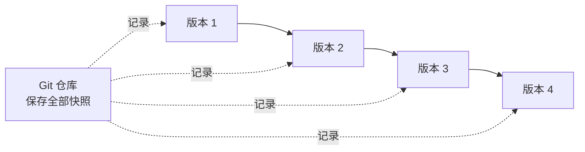
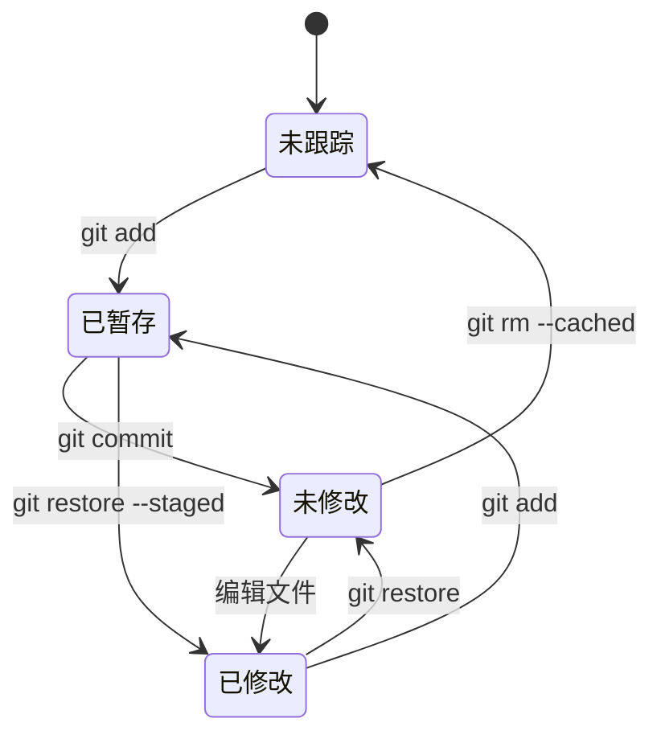

+++
title = "第55章：Git 基础"
weight = 550
date = "2026-03-24T13:18:28+08:00"
type = "docs"
description = ""
isCJKLanguage = true
draft = false
+++


# 第五十五章：Git 基础

## 55.1 Git 是什么

### 55.1.1 从一个"惨案"说起

你写了一篇论文，每天改一点。第 30 天，电脑蓝屏，文件损坏——只剩下一周前的备份。

或者：你和同事同时改同一份代码，他把你写的一下午覆盖了，而且找不回来。

这类问题的根源是：**只有一份"当前版本"，没有历史，也没有并行开发的机制。**

Git 就是来解决这个问题的：它给你的每一次修改都拍一张快照，随时可以回到过去，也允许多人各改各的、最后再合并。


```mermaid
graph LR
    A["版本 1"] --> B["版本 2"] --> C["版本 3"] --> D["版本 4"]
    E["Git 仓库<br>保存全部快照"] -.记录.-> A
    E -.记录.-> B
    E -.记录.-> C
    E -.记录.-> D
```

### 55.1.2 Git 的由来

Git 是 Linux 之父 **Linus Torvalds** 在 2005 年写的。背景是 Linux 内核开发一直用的商业工具 BitKeeper 收回了免费授权，Linus 干脆自己动手，用大约两周时间做出了第一版 Git，目标是：**快、完全分布式、能应对上千人协作**。

如今 Git 已经是事实上的标准，GitHub、GitLab、Gitee 全都建立在它之上。

### 55.1.3 Git 能做什么

| 功能 | 说明 |
|------|------|
| 版本控制 | 每次提交都是一个完整快照，可随时回退 |
| 多人协作 | 各人在自己的分支上开发，再合并 |
| 分支管理 | 建分支几乎是"零成本"，可以随意试验 |
| 追溯历史 | 谁在什么时候改了哪一行，一目了然 |
| 分布式 | 每个人手里都有一份完整仓库，服务器挂了也不怕 |

### 55.1.4 Git 与集中式版本控制的区别

| 特性 | Git（分布式） | SVN / CVS（集中式） |
|------|--------------|-------------------|
| 仓库位置 | 每人一份完整仓库 | 只有服务器上有 |
| 离线工作 | 可以照常提交、查看历史 | 连不上服务器基本没得干 |
| 分支 | 极轻量，秒建秒切 | 本质是复制目录，又慢又占空间 |
| 历史完整性 | 每个提交都有哈希校验，改动可被发现 | 强依赖中心服务器 |
| 典型使用 | 本地提交多次，再一次性推送 | 每次提交都必须联网 |

### 55.1.5 四个区域

Git 把"改动"按位置分成四个区域，理解这张图，后面所有命令都能对上号：


```mermaid
graph LR
    A["工作区<br>Working Directory<br>你正在编辑的文件"] -->|git add| B["暂存区<br>Stage / Index<br>即将提交的内容"]
    B -->|git commit| C["本地仓库<br>Repository<br>.git 里的对象库"]
    C -->|git push| D["远程仓库<br>Remote<br>GitHub / GitLab"]
    D -->|git fetch / git pull| C
    C -->|git checkout / switch| A
```

- **工作区**：你用编辑器实际改的文件；
- **暂存区**：一个"购物车"，`git add` 把改动放进去，`git commit` 才结账；
- **本地仓库**：`.git` 目录里的历史记录，全在你自己机器上；
- **远程仓库**：GitHub/GitLab 上的那份，用于协作和备份。

> ⚠️ 暂存区不是多余的设计。它让你**可以只提交一部分改动**：改了 5 个文件，但只想先提交其中 2 个的逻辑修复，就把另外 3 个留着。这是 Git 与"直接保存"最本质的区别。

## 55.2 安装与首次配置

### 55.2.1 安装

```bash
# Debian / Ubuntu
sudo apt update && sudo apt install -y git

# RHEL 8+ / CentOS Stream / Rocky / AlmaLinux / Fedora
sudo dnf install -y git

# 老旧的 RHEL 7 / CentOS 7（已停止维护，只作了解）
sudo yum install -y git

# macOS：Homebrew 版本通常比系统自带的新
brew install git
# 或者安装 Xcode 命令行工具（自带 git，版本偏老）
xcode-select --install

# Windows：官网安装包最省事
# https://git-scm.com/download/win
```

验证：

```bash
git --version
# git version 2.43.0   （具体版本号取决于发行版，能跑就行）
```

### 55.2.2 首次配置：用户名与邮箱

Git 会把这两项写进每一个提交里，相当于"签名"。**不配置就无法提交**：

```bash
git config --global user.name "你的名字"
git config --global user.email "your.email@example.com"

# 查看当前生效的值
git config user.name
git config user.email

# 查看所有配置及来源
git config --list --show-origin
```

> 邮箱建议用你 GitHub 账号绑定的邮箱（或 GitHub 提供的 `<id>+<用户名>@users.noreply.github.com` 隐私邮箱），这样提交才能正确归属到你的账号。

### 55.2.3 配置的三个级别

| 级别 | 文件 | 作用范围 | 命令 |
|------|------|---------|------|
| 系统级 | `/etc/gitconfig` | 本机所有用户 | `git config --system`（需要 root） |
| 用户级 | `~/.gitconfig` 或 `~/.config/git/config` | 当前用户的所有仓库 | `git config --global` |
| 仓库级 | `.git/config` | 仅当前仓库 | `git config --local`（默认） |

**优先级从下往上覆盖**：仓库级 > 用户级 > 系统级。所以公司仓库可以用 `--local` 单独设置工作邮箱，不影响你个人的全局配置：

```bash
cd ~/work/company-project
git config --local user.email "you@company.com"
```

### 55.2.4 值得一开始就设好的配置

```bash
# 新仓库的默认分支名（Git 2.28+ 才支持，不设的话可能是 master）
git config --global init.defaultBranch main

# 中文文件名不再被显示成 "\344\275\240" 这种八进制转义
git config --global core.quotepath false

# 换行符处理：防止 Windows 同事提交的 CRLF 把整个文件标成"全改了"
#   Linux/macOS 用 input，Windows 用 true
git config --global core.autocrlf input

# 让 git pull 更规范：只做快进合并，必要时明确报错
git config --global pull.rebase false      # 或者 true，看团队约定

# 记住 HTTPS 密码（Linux 上需要 libsecret；macOS 自带钥匙串）
git config --global credential.helper store   # 明文保存，谨慎使用
# macOS 推荐：git config --global credential.helper osxkeychain

# 彩色输出
git config --global color.ui auto

# 常用别名
git config --global alias.st status
git config --global alias.co checkout
git config --global alias.br branch
git config --global alias.ci commit
git config --global alias.lg "log --oneline --graph --decorate --all"

# 设置默认编辑器
git config --global core.editor vim

# 让 git 记住你解决过的冲突方式
git config --global rerere.enabled true
```

> `credential.helper store` 会把密码/令牌**明文**写进 `~/.git-credentials`。更安全的选择是系统的钥匙串（macOS 的 `osxkeychain`、Linux 的 `libsecret`），或者直接改用 SSH Key。

关于 `pull.rebase`：Git 2.27 之后，在不设置它的情况下执行 `git pull` 会打印一段长长的警告，让你明确选择"合并"还是"变基"。提前设好能少看一段噪音——团队用哪种方式，跟着团队的规范走。

### 55.2.5 提交信息模板

团队里约定提交格式（比如 Conventional Commits）时，可以做个模板：

```bash
# 写入文件
cat > ~/.gitmessage.txt << 'EOF'
# ---- 第一行：<类型>(<范围>): <简短描述>，不超过 50 字符 ----
#
# 详细说明（可选，每行不超过 72 字符）：为什么改，而不是改了什么
#
# 关联 issue: Closes #123
#
# ---- 类型 ----
# feat:     新功能
# fix:      修复缺陷
# docs:     文档
# style:    格式（不影响代码运行）
# refactor: 重构（既非新功能也非修复）
# perf:     性能优化
# test:     测试
# build:    构建系统或依赖
# ci:       CI 配置
# chore:    杂项
# ---- 以 # 开头的行不会进入提交信息 ----
EOF

git config --global commit.template ~/.gitmessage.txt
```

## 55.3 创建与克隆仓库

### 55.3.1 两种开始方式

```bash
# 方式一：先把已有目录变成仓库
cd my-project
git init
# Initialized empty Git repository in /path/to/my-project/.git/

# 方式二：新建目录并初始化
git init my-new-project
cd my-new-project

# 方式三：从远程克隆（最常用）
git clone https://github.com/user/repo.git
git clone https://github.com/user/repo.git my-folder   # 指定本地目录名
git clone -b develop --single-branch https://github.com/user/repo.git   # 只要一个分支
git clone --depth 1 https://github.com/user/repo.git   # 浅克隆，只要最新一次提交
```

`git clone` 做的事情不只是下载：它会把远程仓库完整复制到本地（包括全部历史），自动设置好名为 `origin` 的远程，并检出默认分支。

> `--depth 1` 常用于 CI 里只拉最新代码，速度快很多。但浅克隆**没有完整历史**，`git log`、`git blame`、`git bisect` 都会受限。日常开发别用。

### 55.3.2 `.git` 目录里有什么

```bash
ls -a .git/
# HEAD          当前指向哪个分支（如 ref: refs/heads/main）
# config        本仓库的配置（就是 git config --local 改的那个文件）
# index         暂存区的实际存储
# objects/      所有数据对象（提交、目录树、文件内容），Git 的核心
# refs/         分支、标签的引用（refs/heads/、refs/tags/）
# logs/         引用变更日志，git reflog 的数据来源
# hooks/        钩子脚本示例（默认都是 .sample，不生效）
# info/exclude  本仓库的忽略规则（.gitignore 的补充）
```

**不要手工修改 `.git` 里的文件**（`config` 和 `HEAD` 除外，而且也应该用命令改）。删掉 `.git` 就等于这个目录不再是仓库了；反过来，只要 `.git` 还在，哪怕你把工作区文件全删了，也能用 `git restore` 找回来。

### 55.3.3 远程地址的几种协议

| 协议 | 形式 | 说明 |
|------|------|------|
| HTTPS | `https://github.com/user/repo.git` | 最省事，需要凭据；现在 GitHub 要求用 **Personal Access Token**，不能用账号密码 |
| SSH | `git@github.com:user/repo.git` | 配好密钥后免密，推荐日常使用 |
| 本地路径 | `/srv/git/repo.git` 或 `file:///srv/git/repo.git` | 本机/共享目录上的仓库 |

> ⚠️ 老教程里常见的 `git://github.com/user/repo.git` 现在**不要用了**：这个协议不加密也不认证，容易被中间人篡改，GitHub 早在 2022 年就停止支持它。看到 `git://` 一律换成 `https://` 或 `ssh://`。

### 55.3.4 配置 SSH Key（推荐）

```bash
# 1. 先看有没有现成的密钥
ls -l ~/.ssh/id_*

# 2. 没有就生成一对（ed25519 比 RSA 更短更安全）
ssh-keygen -t ed25519 -C "your.email@example.com"
# 提示保存位置时直接回车；提示设置口令(passphrase)时。
#   留空 = 使用方便但安全性低；设置口令 = 更安全，配合 ssh-agent 也不麻烦

# 3. 查看公钥内容（.pub 是公钥，可以随便给；没有 .pub 的是私钥，绝不能外传）
cat ~/.ssh/id_ed25519.pub

# 4. 复制公钥内容，粘贴到：
#    GitHub → Settings → SSH and GPG keys → New SSH key
#    GitLab → Preferences → SSH Keys

# 5. 测试连接
ssh -T git@github.com
# 成功会看到：Hi 用户名! You've successfully authenticated, but GitHub does not provide shell access.

# 6. 把已有的 HTTPS 仓库换成 SSH
git remote -v
git remote set-url origin git@github.com:user/repo.git
```

## 55.4 文件状态与 git status

### 55.4.1 文件在 Git 眼里的几种状态


```mermaid
stateDiagram-v2
    [*] --> 未跟踪
    未跟踪 --> 已暂存: git add
    已暂存 --> 未修改: git commit
    未修改 --> 已修改: 编辑文件
    已修改 --> 已暂存: git add
    已暂存 --> 已修改: git restore --staged
    已修改 --> 未修改: git restore
    未修改 --> 未跟踪: git rm --cached
```

用文字说一遍：

- **未跟踪（Untracked）**：新建的文件，Git 还没开始管；
- **已修改（Modified）**：已跟踪的文件被改了，但改动还没进暂存区；
- **已暂存（Staged）**：改动放进暂存区了，下一次 `git commit` 会带上它；
- **未修改（Unmodified）**：和仓库里最后一次提交一模一样。

### 55.4.2 `git status` 怎么看

```bash
git status

# On branch main
# Your branch is up to date with 'origin/main'.
#
# Changes to be committed:            ← 已暂存，将被提交
#   (use "git restore --staged <file>..." to unstage)
#         modified:   readme.md
#         new file:   newfile.txt
#
# Changes not staged for commit:      ← 已修改但没暂存
#   (use "git add <file>..." to update what will be committed)
#   (use "git restore <file>..." to discard changes in working directory)
#         modified:   app.py
#
# Untracked files:                    ← Git 还不认识的文件
#   (use "git add <file>..." to include in what will be committed)
#         notes.txt
```

> 你看到的提示文字可能略有不同（旧版 Git 会提示 `git reset HEAD <file>`）。**提示里给什么命令，就用什么命令**——那些就是 Git 官方推荐的现代写法。

### 55.4.3 简洁模式：两个字母的含义

`git status -s` 的输出格式是 `XY 路径`，**两个字母分别代表两个不同方向的比较**：

```text
X = 暂存区相对上次提交的状态
Y = 工作区相对暂存区的状态
```

```bash
git status -s

#  M app.py            ← 注意：M 前面有一个空格
# M  readme.md
# A  newfile.txt
# D  deleted.txt
# R  old.txt -> new.txt
# ?? untracked.txt
# !! ignored.log       ← 需要加 --ignored 才会显示
```

| 状态 | 含义 |
|------|------|
| `??` | 未跟踪（Untracked） |
| `!!` | 被忽略（Ignored） |
| `A ` | 新文件已暂存 |
| `M ` | 已暂存的内容有修改（暂存区版本 ≠ 上次提交） |
| ` M` | 工作区又改了，但还没暂存（工作区 ≠ 暂存区） |
| `MM` | 两个方向都有改动：暂存之后又改了同一文件 |
| `D ` / ` D` | 同理，已暂存地删除 / 尚未暂存地删除 |
| `R ` | 重命名（会显示 `旧名 -> 新名`） |

**只看第一个字母还是第二个字母，含义完全不同**——这是 `-s` 模式最容易看错的地方：

```bash
# 想只提交已暂存的内容，先看清哪些是第一列有字
git status -s

# 只显示已暂存的改动（相当于旧版 git diff --cached）
git diff --staged --name-only
```

### 55.4.4 忽略文件：.gitignore

把"不该进版本库"的东西写进 `.gitignore`：

```gitignore
# ===== 按名称匹配 =====
.DS_Store
Thumbs.db
*.log

# ===== 按目录匹配（结尾的 / 表示只匹配目录）=====
node_modules/
build/
dist/
__pycache__/
.venv/

# ===== 用 / 锚定到仓库根目录 =====
/config.local.yml       # 只忽略根目录下的这个文件
/build                  # 只忽略根目录的 build 目录

# ===== 通配符 =====
*.o
*.so
*.class
temp-*.txt

# ** 匹配任意层目录
**/logs/

# ===== 取反：把上面忽略的某个文件捞回来 =====
*.log
!important.log          # 不忽略 important.log

# ⚠️ 取反的坑：如果整个目录被排除了，里面的文件就捞不回来了
#
#   错误写法：               正确写法：
#   logs/                    logs/*
#   !logs/keep.md            !logs/keep.md
#
# 因为 Git 看到 logs/ 被排除后，根本不会再进去看里面的文件，
# 后面那句 !logs/keep.md 也就无从生效。必须先排除目录的内容（logs/*），
# 再单独放行想保留的那个文件。

# ===== 敏感信息，永远别提交 =====
.env
*.pem
*.key
id_rsa

# ===== IDE / 编辑器 =====
.vscode/
.idea/
*.swp
```

几条必须知道的规则：

```bash
# 1. .gitignore 只管"未被跟踪"的文件。
#    已经提交过的文件，后加 .gitignore 也不生效，必须先取消跟踪：
git rm --cached config.local.yml     # 保留本地文件，只从版本库移除
git commit -m "chore: 停止跟踪本地配置"

# 2. 想排查"为什么这个文件被忽略了"，用 check-ignore 问 Git 本人
git check-ignore -v logs/app.log
# .gitignore:12:*.log    logs/app.log

# 3. 设置全局忽略文件（比如所有项目都忽略 .DS_Store）
git config --global core.excludesfile ~/.gitignore_global

# 4. 模板仓库：用 GitHub 的 gitignore 模板挑一份现成的
#    https://github.com/github/gitignore
```

## 55.5 日常操作：add、commit、rm、restore

### 55.5.1 git add：把改动放进暂存区

```bash
git add readme.txt                # 单个文件
git add readme.txt app.py         # 多个文件
git add src/                      # 整个目录
git add '*.py'                    # 只添加匹配的（引号防止 Shell 先展开）
git add .                         # 当前目录下的所有变化（含新增、修改、删除）
git add -A                        # 整个仓库的所有变化（在仓库根目录执行时和上面等价）
git add -u                        # 只处理【已跟踪】文件的修改和删除，不含新增文件
git add -f ignored-file.txt       # 强制添加被 .gitignore 忽略的文件
git add -n .                      # 演练：只显示会被添加什么，不真的添加
```

`.gitignore` 和 `add` 的搭配要记牢：

```bash
git add -A                # 会把所有未跟踪文件加进来，包括你不想要的
git add -n -A | head      # 先看一眼再说！
```

**部分提交**是 Git 的精髓之一：改了一个文件里的三处逻辑，只想先提交其中一处：

```bash
git add -p app.py
# 交互选项：
#   y  暂存这一块
#   n  跳过这一块
#   s  把这块拆得更细
#   e  手工编辑要暂存的内容
#   q  退出
```

### 55.5.2 git commit：把暂存区存成一次快照

```bash
git commit                        # 打开编辑器写提交信息
git commit -m "fix: 修复登录失败的问题"
git commit -am "fix: 快速提交"    # 只对【已跟踪】文件生效：自动 add + commit
git commit -v                     # 在编辑器里同时显示 diff，方便对照着写
git commit --amend                # 修改【上一次】提交（信息或内容）
git commit --amend --no-edit      # 只补内容，不改提交信息
git commit --allow-empty -m "ci: 触发流水线"   # 空提交
git commit -S -m "..."            # GPG 签名提交
```

关于 `-a` 的一个常见误解：

```bash
# -a 只把【已跟踪文件】的改动加进来，新建的文件仍然需要 git add
touch brand-new.js
git commit -am "feat: 加个文件"    # brand-new.js 不会被提交！
git status                        # 你会看到它还是 Untracked
```

关于 `--amend`，**它是"重写历史"**：

```bash
# 场景：提交信息写错、或者忘了加一个文件
git add forgotten.js
git commit --amend --no-edit      # 把这个文件并进上一次提交

# ⚠️ amend 会生成一个新的提交（新的哈希），
#    如果那次提交已经 push 到共享分支，别人拉下来的历史会和你的对不上。
#    只对"还没推送的提交"用 amend。
```

提交信息的写法建议：

```bash
# 第一行（主题行）：<类型>(<范围>): <做了什么>，50 字符以内，不要句号
fix(auth): 修复 token 过期后无法自动刷新

# 空一行，然后写"为什么"，而不是"改了什么"（改了什么看 diff 就知道了）
# 原来的判断只看 exp 字段，忽略了服务器时钟偏慢的情况，
# 导致用户偶发地被要求重新登录。改成预留 30 秒的宽限时间。

# 最后关联 issue
Closes #142
```

类型（type）速查：`feat`（新功能）、`fix`（修缺陷）、`docs`（文档）、`style`（格式）、`refactor`（重构）、`perf`（性能）、`test`（测试）、`build`（构建/依赖）、`ci`（流水线）、`chore`（杂项）。

### 55.5.3 删除与重命名

```bash
# 删除文件：从工作区和暂存区一起删，并记入版本库
git rm old.txt

# 只从版本库移除，保留本地文件（.gitignore 之后的标配动作）
git rm --cached config.local.yml

# 删除整个目录（-r）
git rm -r old-dir/

# 重命名：等价于 mv + git rm + git add
git mv old-name.txt new-name.txt

# 如果已经用普通 mv 改过名了，也可以补一次 add
mv a.txt b.txt
git add -A
```

### 55.5.4 撤销改动：restore（现代写法）

这是新手最需要的命令。**先想清楚要撤销的是哪一层的改动**：

```bash
# 1. 撤销【工作区】的修改（回到暂存区里的版本）—— 未提交的改动会永久丢失！
git restore app.py
git restore .                       # 撤销当前目录所有工作区改动

# 2. 撤销【暂存】（把文件从暂存区拿出来，工作区不动）
git restore --staged app.py
git restore --staged .              # 全部取消暂存

# 3. 同时撤销暂存和工作区（恢复到上次提交的样子）
git restore --source=HEAD --staged --worktree app.py

# 4. 老写法（旧教程里到处都是，现在仍能用）
git checkout -- app.py              # 等价于 git restore app.py
git reset HEAD app.py               # 等价于 git restore --staged app.py
```

> ⚠️ `git restore app.py` **是真的删掉你未提交的改动**，没有回收站。养成习惯：动手前先 `git diff app.py` 看清楚要丢的是什么。真丢了也别慌，下一章的 `git reflog` 能救提交，但救不回没提交过的内容。

## 55.6 查看历史：log、show、blame、diff

### 55.6.1 git log

```bash
git log                              # 完整历史（在 pager 里，按 q 退出）
git log --oneline                    # 一行一条，最常用
git log -n 5                         # 只看最近 5 条
git log --oneline -5 --no-merges      # 最近 5 条，跳过合并提交

# 看图形化分支结构（建议存成别名 lg）
git log --oneline --graph --decorate --all

git log --stat                       # 每次提交动了哪些文件、增删多少行
git log -p                           # 每次提交的完整 diff
git log --name-status                # 只列文件名和状态（A/M/D）
```

按条件筛选：

```bash
git log --author="John"                          # 按作者
git log --grep="fix"                             # 按提交信息（正则）
git log --grep="fix" --grep="bug" --all-match    # 同时满足多个关键词
git log --since="2 weeks ago" --until="yesterday"
git log -- path/to/file.txt                      # 只看某个文件的历史
git log --follow -- old-name.txt                 # 跨重命名追踪（能看到改名前的历史）
git log -S "some_function"                       # 搜索"增删过这段代码"的提交（pickaxe）
git log -G "regex"                               # 同上，但按正则匹配改动内容
git log --merges                                 # 只看合并提交
```

作者统计：

```bash
git shortlog                 # 按作者分组，列出各自的提交主题
git shortlog -sn             # 只显示每个作者的提交数（-s 汇总，-n 按数量排序）
git shortlog -sn --no-merges # 排除合并提交，数字更真实
```

自定义格式：

```bash
git log --pretty=format:"%h %an %s"

# 常用占位符：
# %H 完整哈希    %h 短哈希
# %an 作者名     %ae 作者邮箱
# %ad 作者日期   %ar 相对时间（"3 days ago"）
# %s 主题行      %b 正文
# %d 引用（分支、标签）

# 一份好用的"一屏看全"格式
git log --graph --pretty=format:'%C(yellow)%h%Creset %C(cyan)%ad%Creset %C(bold)%s%Creset %C(green)(%an)%Creset' --date=short
```

### 55.6.2 git show

```bash
git show                       # 显示最新提交的详情 + diff
git show abc1234               # 指定的提交
git show abc1234:src/app.js    # 某个提交时，某个文件的内容
git show v1.0.0                # 标签（下一章会讲）
git show --stat HEAD           # 只看这次提交动了哪些文件
```

### 55.6.3 git blame：每一行是谁写的

```bash
git blame app.py                          # 每行前面标出提交、作者、时间
git blame -L 20,40 app.py                 # 只看第 20-40 行
git blame -w app.py                       # 忽略纯空白改动
git log -L 20,40:app.py                   # 查看这段代码的演变历史
```

> 排查线上问题定位到某一行时，`git blame` 查"谁写的"，`git show <hash>` 查"为什么这么写"。两者配合，比在群里问"这行谁改的"高效得多。

### 55.6.4 git diff：看清到底改了什么

| 命令 | 比较的是 |
|------|---------|
| `git diff` | 工作区 ↔ 暂存区（**未暂存**的改动） |
| `git diff --staged`（= `--cached`） | 暂存区 ↔ 最后一次提交（**将要提交**的改动） |
| `git diff HEAD` | 工作区 ↔ 最后一次提交（工作区所有改动，含已暂存和未暂存） |
| `git diff abc123` | 工作区 ↔ 指定提交 |
| `git diff abc123..def456` | 两个提交之间 |
| `git diff main...develop` | 从"两者的共同祖先"到 develop（三点，看分支引入了什么） |

```bash
git diff                            # 提交前看一眼，好习惯
git diff --stat                     # 只看统计
git diff --shortstat                # 一行统计：X files changed, Y insertions(+), Z deletions(-)
git diff -- app.py                  # 只看某个文件（-- 用来把文件名和选项分开）
git diff -w                         # 忽略空白差异
git diff --word-diff                # 按词而不是按行展示（改文档时很好用）
git diff -U5                        # 上下文显示 5 行（默认 3 行）
git diff -W                         # 上下文扩到"整个函数"（--function-context）
git diff --color-words              # 彩色按词高亮
```

关于 `-U` 和 `-W` 的区别，很多教程会写错：

- `-U<n>`（`--unified=<n>`）只是把**上下文行数**从 3 改成 n，跟"函数"没有关系；
- 想按函数边界显示上下文，用 `-W`（`--function-context`）。

图形化对比：

```bash
git difftool                        # 用配置好的图形工具逐文件查看
git config --global diff.tool vimdiff
git config --global difftool.prompt false
```

## 本章小结

| 命令 | 作用 |
|------|------|
| `git init` / `git clone` | 创建 / 克隆仓库 |
| `git config --global ...` | 用户级配置（用户名、邮箱、别名……） |
| `git status` / `git status -s` | 查看状态；`-s` 的两列分别代表暂存区和工作区的状态 |
| `git add` / `git add -p` | 加入暂存区 / 只暂存部分改动 |
| `git commit -m` / `--amend` | 提交 / 修改尚未推送的上一次提交 |
| `git rm --cached` | 只从版本库移除，保留本地文件 |
| `git mv` | 重命名并记录 |
| `git restore` / `--staged` | 撤销工作区改动 / 取消暂存 |
| `git log --oneline --graph --all` | 看历史 |
| `git show` / `git blame` | 看某次提交 / 看某行的来历 |
| `git diff` / `--staged` / `HEAD` | 看未暂存 / 将提交 / 全部改动 |

三个最重要的心智模型：

1. **四区域**：工作区 →（`add`）→ 暂存区 →（`commit`）→ 本地仓库 →（`push`）→ 远程仓库；
2. **两列状态**：`git status -s` 里左边是"暂存区相对 HEAD"，右边是"工作区相对暂存区"；
3. **撤销分三层**：`git restore` 撤工作区、`git restore --staged` 撤暂存、`--amend` 改提交——搞错层次是最常见的翻车原因。

在本地把改动提交上去不需要联网，也不需要任何服务器——这是 Git 最让人安心的地方。

**下一章预告**：第五十六章进入 Git 进阶——分支与合并、冲突解决、远程协作、变基与拣选、标签与 Git Flow 工作流。
