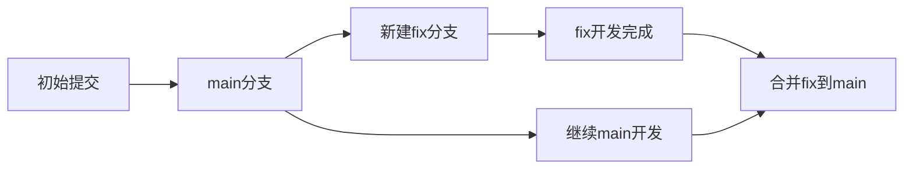
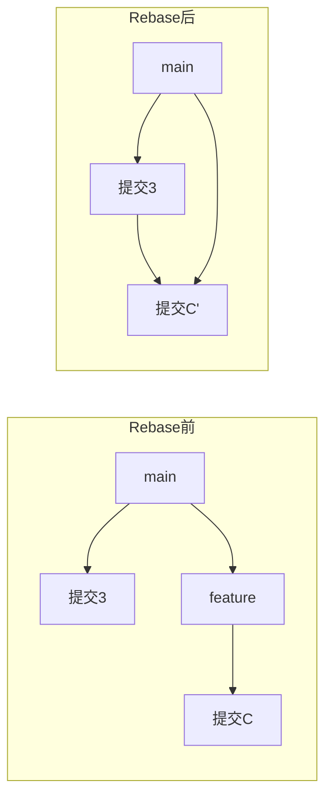
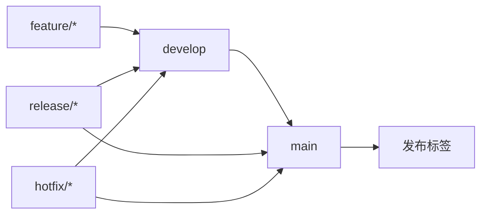
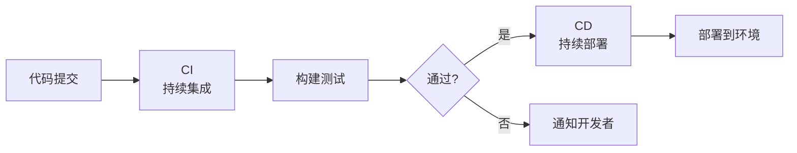
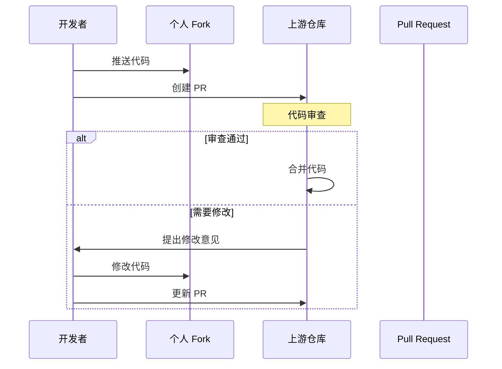
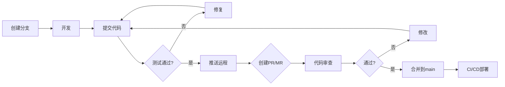

+++
title = "第56章：Git 进阶与远程协作"
weight = 560
date = "2026-03-24T13:18:28+08:00"
type = "docs"
description = ""
isCJKLanguage = true
draft = false
+++


# 第五十六章：Git 进阶与远程协作

## 56.1 分支管理

分支是 Git 最强大的功能之一，让你能够"平行宇宙"般地开发！

### 什么是分支？

想象一下：你正在开发 v2.0 版本，但 v1.0 突然发现了一个 bug。如果没有分支，你只能"先修 bug 再继续开发"或者"先开发再说"。

有了分支，你可以：
1. 创建一个 `fix-bug` 分支去修 bug
2. 在 `main` 分支继续开发 v2.0
3. bug 修好后，合并回 main



### 创建分支

```bash
# 查看当前分支
git branch

# 创建新分支
git branch feature-login

# 创建并切换到新分支
git checkout -b feature-login

# Git 2.23+ 推荐用 switch
git switch -c feature-login
```

### 切换分支

```bash
# 切换到已有分支
git checkout main
git switch main

# 切换并创建（简化）
git checkout -b new-feature

# 切换到上一个分支
git checkout -
git switch -
```

### 查看分支

```bash
# 列出所有分支
git branch

# 列出远程分支
git branch -r

# 列出所有分支（本地+远程）
git branch -a

# 显示分支详细信息
git branch -v

# 查看已合并/未合并的分支
git branch --merged
git branch --no-merged
```

### 删除分支

```bash
# 删除已合并的分支
git branch -d feature-login

# 强制删除分支（即使未合并）
git branch -D feature-login

# 删除远程分支
git push origin --delete feature-login
```

### 重命名分支

```bash
# 重命名当前分支
git branch -m old-name new-name

# 重命名其他分支
git branch -m feature-v1 feature-v2
```

## 56.2 标签管理

标签用于标记重要的提交点，比如版本发布。

### 创建标签

```bash
# 创建轻量标签
git tag v1.0.0

# 创建附注标签（推荐，包含更多信息）
git tag -a v1.0.0 -m "版本1.0.0发布"

# 给历史提交打标签
git tag -a v0.9.0 abc123 -m "版本0.9.0"
```

### 查看标签

```bash
# 列出所有标签
git tag

# 搜索标签
git tag -l "v1.*"

# 查看标签详情
git show v1.0.0
```

### 推送标签

```bash
# 推送单个标签
git push origin v1.0.0

# 推送所有标签
git push --tags

# 推送分支并带上标签
git push origin main --tags
```

### 删除标签

```bash
# 删除本地标签
git tag -d v1.0.0

# 删除远程标签
git push origin --delete v1.0.0
```

### 检出标签

```bash
# 检出到某个标签（创建匿名分支）
git checkout -b version-1 v1.0.0
```

## 56.3 远程仓库

### 查看远程仓库

```bash
# 查看远程仓库信息
git remote -v

# 输出示例：
# origin  git@github.com:user/repo.git (fetch)
# origin  git@github.com:user/repo.git (push)
```

### 添加远程仓库

```bash
# 添加远程仓库
git remote add origin git@github.com:user/repo.git

# 添加另一个远程仓库
git remote add gitee git@gitee.com:user/repo.git

# 重命名远程仓库
git remote rename origin github
```

### 修改远程仓库 URL

```bash
# 修改为 HTTPS（有时更稳定）
git remote set-url origin https://github.com/user/repo.git

# 修改为 SSH
git remote set-url origin git@github.com:user/repo.git
```

### 远程仓库操作

```bash
# 重命名远程仓库
git remote rename old-name new-name

# 移除远程仓库
git remote remove origin

# 显示远程仓库详细信息
git remote show origin
```

## 56.4 推送与拉取

### git push

```bash
# 推送当前分支到远程
git push origin main

# 推送并设置上游分支
git push -u origin feature-login

# 推送所有分支
git push --all

# 推送标签
git push --tags

# 强制推送（慎用！）
git push --force

# 删除远程分支
git push origin --delete old-branch
```

### git pull

```bash
# 拉取并合并
git pull

# 拉取并变基（保持线性历史）
git pull --rebase

# 拉取特定分支
git pull origin main
```

### git fetch

```bash
# 获取远程更新（不合并）
git fetch origin

# 获取所有远程更新
git fetch --all

# fetch + merge = pull
git fetch origin
git merge origin/main
```

### git merge

```bash
# 合并分支
git merge feature-login

# 取消合并（合并冲突时）
git merge --abort

# 快进合并
# 当没有冲突时，默认使用快进合并
```

### 解决合并冲突

```bash
# 当合并冲突时，编辑冲突文件
# 冲突标记：
# <<<<<<< HEAD
# 当前分支的内容
# =======
# 被合并分支的内容
# >>>>>>> feature-login

# 编辑完成后
git add conflicted-file.txt
git commit -m "解决合并冲突"
```

### 变基（Rebase）



```bash
# 变基到 main（保持线性历史）
git checkout feature-login
git rebase main

# 交互式变基（修改提交历史）
git rebase -i HEAD~3

# 变基后强制推送
git push --force
```

## 56.5 Git Flow

Git Flow 是一种分支管理模型，适合有计划发布周期的项目。



### 分支类型

| 分支 | 命名规则 | 说明 |
|------|---------|------|
| main | main | 生产环境代码 |
| develop | develop | 开发主分支 |
| feature | feature/功能名 | 新功能开发 |
| release | release/版本号 | 发布准备 |
| hotfix | hotfix/问题描述 | 紧急修复 |

### Git Flow 命令

```bash
# 初始化 Git Flow
git flow init

# 开始新功能
git flow feature start login

# 完成功能
git flow feature finish login

# 开始发布
git flow release start v1.0.0

# 完成发布
git flow release finish v1.0.0

# 开始热修复
git flow hotfix start bug-fix

# 完成热修复
git flow hotfix finish bug-fix
```

### GitHub Flow（简化版）

适合持续部署的项目：


## 56.6 GitHub/GitLab

### GitHub 常用操作

```bash
# Fork 仓库（在网页端操作）
# 克隆你的 Fork
git clone https://github.com/your-name/repo.git

# 添加上游仓库
git remote add upstream https://github.com/original/repo.git

# 同步上游更新
git fetch upstream
git merge upstream/main
```

### Pull Request 工作流

```bash
# 1. 从 main 创建功能分支
git checkout -b feature-login

# 2. 开发并提交
git commit -m "feat: 添加登录功能"

# 3. 推送到你的 Fork
git push origin feature-login

# 4. 在 GitHub 上创建 Pull Request
# 5. 代码审查后合并
```

### GitLab 特有功能

| 功能 | 说明 |
|------|------|
| Merge Request | 类似 GitHub 的 Pull Request |
| Pipeline | CI/CD 流水线 |
| Issues | 问题跟踪 |
| Wiki | 项目文档 |
| CI/CD | 内置持续集成 |

## 56.7 CI/CD

### 什么是 CI/CD？



**CI (Continuous Integration)**：频繁集成代码，自动测试
**CD (Continuous Deployment)**：自动部署通过测试的代码

### GitHub Actions 示例

创建 `.github/workflows/ci.yml`：

```yaml
name: CI

on:
  push:
    branches: [main]
  pull_request:
    branches: [main]

jobs:
  test:
    runs-on: ubuntu-latest
    
    steps:
    - uses: actions/checkout@v3
    
    - name: Set up Node.js
      uses: actions/setup-node@v3
      with:
        node-version: '18'
    
    - name: Install dependencies
      run: npm ci
    
    - name: Run tests
      run: npm test
    
    - name: Build
      run: npm run build
```

### GitLab CI 示例

创建 `.gitlab-ci.yml`：

```yaml
stages:
  - test
  - build
  - deploy

test:
  stage: test
  script:
    - npm ci
    - npm test

build:
  stage: build
  script:
    - npm ci
    - npm run build
  artifacts:
    paths:
      - dist/

deploy:
  stage: deploy
  script:
    - echo "部署到服务器..."
  only:
    - main
```

### 常用 CI 工具

| 工具 | 特点 |
|------|------|
| GitHub Actions | GitHub 原生，免费额度 |
| GitLab CI | GitLab 原生 |
| Jenkins | 老牌开源，插件丰富 |
| Travis CI | GitHub 好伙伴 |
| CircleCI | 速度快 |

### git stash（暂存工作区）

当你想临时切换分支，但又不想提交当前修改时：

```bash
# 暂存当前修改
git stash

# 保存时加备注
git stash save "正在进行的功能开发"

# 查看暂存列表
git stash list
# stash@{0}: WIP on main: abc123 提交说明
# stash@{1}: WIP on feature: def456 另一个暂存

# 恢复暂存（并保留暂存）
git stash apply stash@{0}

# 恢复暂存（并删除暂存）
git stash pop

# 删除暂存
git stash drop stash@{0}

# 清空所有暂存
git stash clear

# 暂存特定文件
git stash push -m "部分修改" file1.txt file2.txt

# 查看暂存内容
git stash show -p stash@{0}
```

### git bisect（二分调试）

用二分法快速定位引入 bug 的提交：

```bash
# 开始二分调试
git bisect start

# 标记当前版本为坏提交
git bisect bad

# 标记一个已知好的版本
git bisect good v1.0.0

# Git 会自动 checkout 到中间的提交
# 测试后标记
git bisect good   # 这个版本是好的
# 或
git bisect bad    # 这个版本有问题

# 重复直到找到问题提交
# Git 会告诉你第一个 "bad" 提交

# 结束二分调试
git bisect reset
```

### git reflog（找回丢失的提交）

Git 的"后悔药"，可以找回几乎任何丢失的提交：

```bash
# 查看所有操作历史
git reflog
# abc123 HEAD@{0}: commit: 添加新功能
# def456 HEAD@{1}: rebase: 应用补丁
# ghi789 HEAD@{2}: checkout: 切换到 main

# 恢复误删的分支
git checkout -b recovery-branch HEAD@{1}

# 恢复误 rebase 的提交
git reflog
# 找到 rebase 前的提交
git reset --hard HEAD@{5}

# 恢复误 amend 的提交
git reflog
git reset --hard ORIG_HEAD
```

### git cherry-pick（精选提交）

把某个提交"复制"到当前分支：

```bash
# 精选单个提交
git cherry-pick abc123

# 精选多个提交
git cherry-pick abc123 def456

# 精选但不自动提交
git cherry-pick -n abc123

# 继续 cherry-pick（解决冲突后）
git cherry-pick --continue

# 取消 cherry-pick
git cherry-pick --abort

# 示例场景
# 1. main 分支修复了一个 bug
# 2. 想把这个修复带到 feature 分支
git checkout feature
git cherry-pick abc123 (main分支的修复提交)
```

### git submodule（子模块）

在仓库中嵌套另一个仓库：

```bash
# 添加子模块
git submodule add https://github.com/user/repo.git libs/repo

# 克隆带子模块的仓库
git clone --recursive https://github.com/user/main-repo.git

# 初始化子模块
git submodule init
git submodule update

# 更新子模块
cd libs/repo
git checkout main
cd ../..
git add libs/repo
git commit -m "更新子模块"

# 修改子模块
cd libs/repo
git fetch origin
git merge origin/main
cd ../..
git add libs/repo
git commit -m "更新子模块到最新"
```

### Git LFS（大文件存储）

处理大文件的 Git 扩展：

```bash
# 安装
brew install git-lfs  # macOS
sudo apt install git-lfs  # Ubuntu

# 初始化
git lfs install

# 跟踪大文件
git lfs track "*.psd"
git lfs track "*.zip"
git lfs track "*.mp4"

# 查看跟踪的文件
git lfs track

# .gitattributes 会自动创建
cat .gitattributes

# 正常使用 Git
git add largefile.psd
git commit -m "添加大文件"
git push

# 查看 LFS 状态
git lfs status
git lfs ls-files
```

### Git 工作流详解

#### 团队协作流程



#### 实际团队工作流程示例

```bash
# 1. Fork 仓库（在 GitHub 网页操作）

# 2. 克隆你的 Fork
git clone https://github.com/your-name/repo.git
cd repo

# 3. 添加上游仓库
git remote add upstream https://github.com/original/repo.git

# 4. 创建功能分支
git checkout -b feature/user-auth

# 5. 开发并提交
git add .
git commit -m "feat: 添加用户认证功能"

# 6. 保持 Fork 与上游同步
git fetch upstream
git rebase upstream/main

# 7. 推送分支到你的 Fork
git push origin feature/user-auth

# 8. 在 GitHub 创建 Pull Request

# 9. 等待审查和合并
```

### Git 配置进阶

```bash
# 智能的推送目标
git config --global push.default current

# 自动拉取策略
git config --global pull.rebase true

# 记住凭证（15分钟）
git config --global credential.helper cache

# 记住凭证（永久）
git config --global credential.helper store

# 忽略文件权限变化
git config --global core.fileMode false

# 彩色输出
git config --global color.ui auto

# 提交模板
git config --global commit.template ~/.gitmessage

# 默认分支名
git config --global init.defaultBranch main

# 忽略检测的文件
git config --global help.autocorrect prompt

# 配置别名
git config --global alias.st status
git config --global alias.co checkout
git config --global alias.br branch
git config --global alias.ci commit
git config --global alias.lg "log --oneline --graph --all"
git config --global alias.last "log -1 HEAD"
git config --global alias.unstage "reset HEAD --"
```

### 提交规范（Conventional Commits）

```bash
# 格式：<type>(<scope>): <subject>
#
# type: feat, fix, docs, style, refactor, test, chore
# scope: 影响的模块（可选）
# subject: 简短描述

# 示例
git commit -m "feat(auth): 添加用户登录功能"
git commit -m "fix(api): 修复用户查询接口的越权问题"
git commit -m "docs(readme): 更新安装说明"
git commit -m "style(ui): 格式化代码风格"
git commit -m "refactor(payment): 重构支付模块"
git commit -m "test(user): 添加用户模块单元测试"
git commit -m "chore(deps): 升级依赖包版本"

# 破坏性变更
git commit -m "feat(api)!: 更改 API 响应格式"

# 多行详细说明
git commit -m "feat(auth): 支持 OAuth2 登录
>
> - 添加 GitHub 登录
> - 添加 Google 登录
> - 支持 JWT token"
```

### Git 钩子（Hooks）

Git 钩子让你在特定时机自动执行脚本：

```bash
# 查看可用的钩子
ls .git/hooks/

# 创建一个 pre-commit 钩子
cat > .git/hooks/pre-commit << 'EOF'
#!/bin/bash
# 检查代码格式（示例）
if [ -f "src/App.tsx" ]; then
    echo "检查代码..."
    # npm run lint
fi
EOF
chmod +x .git/hooks/pre-commit

# 常见钩子
# pre-commit: 提交前执行
# prepare-commit-msg: 提交信息编辑前
# commit-msg: 提交信息编辑后
# post-commit: 提交后执行
# pre-push: 推送前执行
# pre-rebase: 变基前执行
```

## 本章小结

本章我们学习了 Git 进阶内容：

| 知识点 | 说明 |
|--------|------|
| 分支管理 | 创建、切换、删除、重命名 |
| 标签管理 | 版本标记、轻量/附注标签 |
| 远程仓库 | 添加、修改、推送、拉取 |
| 分支合并 | merge、rebase、解决冲突 |
| Git Flow | 团队协作的分支模型 |
| GitHub/GitLab | 远程协作平台 |
| CI/CD | 持续集成与持续部署 |
| git stash | 暂存工作区 |
| git bisect | 二分调试定位 bug |
| git reflog | 找回丢失的提交 |
| git cherry-pick | 精选提交 |
| git submodule | 子模块管理 |
| Git LFS | 大文件存储 |
| 提交规范 | Conventional Commits |

Git 高级操作流程：



---

> 💡 **温馨提示**：
> Git 是团队协作的基石。掌握分支策略、代码审查、CI/CD，让你的团队效率翻倍！记住：**永远不要强制推送 main/develop 分支**！

---

**第五十六章：Git 进阶与远程协作 — 完结！** 🎉

下一章我们将学习"系统监控"，掌握 top、vmstat、sar、Zabbix、Prometheus、Grafana 等监控工具。敬请期待！ 🚀
