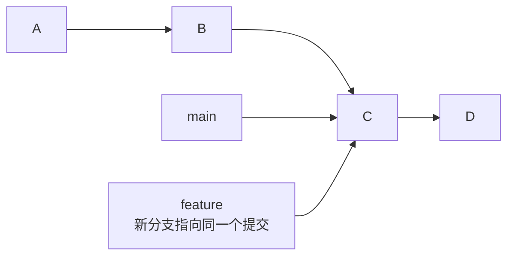
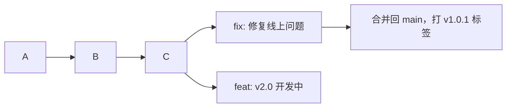
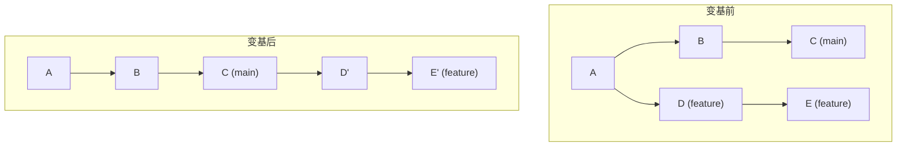
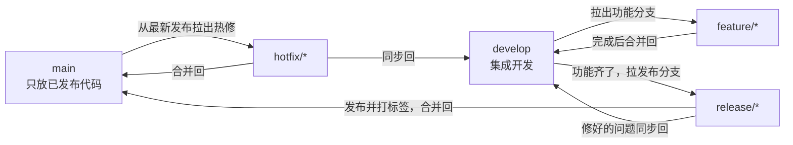
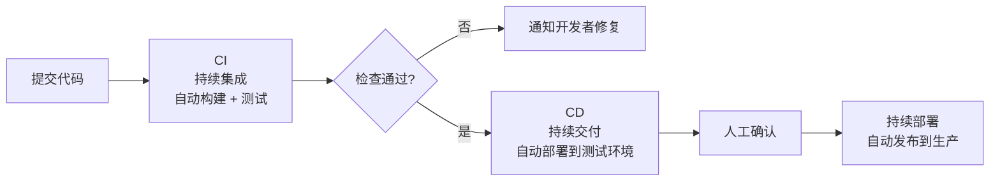

+++
title = "第56章：Git 进阶与远程协作"
weight = 560
date = "2026-03-24T13:18:28+08:00"
type = "docs"
description = ""
isCJKLanguage = true
draft = false
+++


# 第五十六章：Git 进阶与远程协作

## 56.1 分支管理

分支是 Git 最核心的能力。它让你可以在**不影响主线的前提下**修 bug、做实验、开发大功能。

### 56.1.1 分支是什么

分支本质上只是一个**指向某个提交的指针**（就是一个存着哈希值的 41 字节小文件）。所以 Git 建分支几乎是瞬时的，切换也很快——不像 SVN 那样需要复制整个目录。


```mermaid
graph LR
    A["A"] --> B["B"] --> C["C"]
    C --> D["D"]
    M["main"] --> C
    F["feature<br>新分支指向同一个提交"] --> C
```

场景：你正在开发 v2.0，线上 v1.0 突然有 bug。有分支就简单了：

1. 从 `main` 切出 `hotfix` 分支修 bug；
2. 修完合并回 `main`，打上 `v1.0.1` 标签；
3. 回到原来的 `feature` 分支继续开发 v2.0，两边互不干扰。


```mermaid
graph LR
    A["A"] --> B["B"] --> C["C"]
    C --> D["fix: 修复线上问题"]
    C --> E["feat: v2.0 开发中"]
    D --> F["合并回 main，打 v1.0.1 标签"]
```

### 56.1.2 创建与切换

Git 2.23 之后把"切换分支"和"恢复文件"两件事拆开了：

| 老命令 | 新命令 | 作用 |
|--------|--------|------|
| `git checkout <分支>` | `git switch <分支>` | 切换分支 |
| `git checkout -b <分支>` | `git switch -c <分支>` | 创建并切换 |
| `git checkout -- <文件>` | `git restore <文件>` | 丢弃工作区改动 |
| `git reset HEAD <文件>` | `git restore --staged <文件>` | 取消暂存 |

**新写法更安全**：`git checkout -- file` 一不小心就变成 `git checkout branch -- file`，含义完全不同。新脚本和新笔记一律用 `switch` / `restore`。

```bash
# 查看所有本地分支（带 * 的是当前分支）
git branch

# 创建分支（不切换）
git branch feature-login

# 创建并切换（现代写法）
git switch -c feature-login

# 基于某个提交/标签创建分支
git switch -c hotfix-v1 v1.0.0

# 切回上一个分支（在两个分支之间来回跳，很实用）
git switch -
```

### 56.1.3 查看分支

```bash
git branch                # 本地分支
git branch -r             # 远程分支
git branch -a             # 本地 + 远程
git branch -v             # 带每个分支的最新提交
git branch -vv            # 再加上"跟踪的是哪个远程分支、领先/落后多少"
git branch --merged       # 已经合并进当前分支的（可以安全删除）
git branch --no-merged    # 还没合并的（删了会丢东西）
git branch --sort=-committerdate    # 按最近提交时间排序
```

`git branch -vv` 的输出值得看懂：

```text
* main    a1b2c3d [origin/main: ahead 2, behind 1] fix: 修复登录
  feature e4f5g6h [origin/feature] feat: 开发中
```

`ahead 2, behind 1` 表示本地比远程多 2 个提交、少 1 个提交——看到 `behind` 就该先拉取了。

### 56.1.4 删除与重命名

```bash
# 删除已合并的分支（安全，Git 会检查）
git branch -d feature-login

# 强制删除（未合并也会删，会丢提交！）
git branch -D feature-login

# 删除远程分支
git push origin --delete feature-login
# 老写法：git push origin :feature-login（冒号前面为空，等于推一个空分支上去）

# 重命名【当前】分支：只写一个新名字
git branch -m main-new

# 重命名【其他】分支：写旧名和新名
git branch -m old-name new-name

# 重命名后同步远程：删旧的、推新的、重设上游
git push origin --delete old-name
git push -u origin main-new
```

> ⚠️ 删除分支前先 `git branch --no-merged` 确认。分支虽被删，提交对象通常还能靠 `git reflog` 找回一段时间，但别把"能找回"当保障。

## 56.2 合并与冲突

### 56.2.1 三种合并结果

```bash
git switch main
git merge feature-login
```

根据两个分支的历史关系，Git 会做出不同处理：

| 情况 | 结果 | 说明 |
|------|------|------|
| main 没有任何新提交 | **快进（fast-forward）** | main 指针直接前移，不产生合并提交 |
| 两边都有新提交，改动不冲突 | **三方合并** | 自动生成一个合并提交（有两个父提交） |
| 两边改了同一处 | **冲突** | 交给你手动解决 |

```bash
# 想保留"这里合并过一个功能分支"的痕迹，强制生成合并提交
git merge --no-ff feature-login

# 想保证历史是一条直线，不允许产生合并提交
git merge --ff-only feature-login

# 把分支上的所有提交压成一个未提交的改动，攒好后自己提交一次
git merge --squash feature-login
git commit -m "feat: 完成登录模块（squash 自 feature-login）"

# 合并到一半发现不对劲，撤销
git merge --abort
```

`--no-ff` 和 `--ff-only` 的区别，本质是团队对"历史长什么样"的偏好：

- **`--no-ff`**：每个功能分支在历史上留下一个明确的合并点，方便看清楚"这一坨改动是一起进来的"，发布分支常用；
- **`--ff-only`**：历史永远是直线，`git log` 好读，配合 rebase 工作流使用。

### 56.2.2 解决冲突

冲突发生时，Git 会在文件里插入标记，并停下让你处理：

```text
  <<<<<<< HEAD
  当前所在分支（ours）的内容
  =======
  被合并进来的分支（theirs）的内容
  >>>>>>> feature-login
```

（上面这段为了排版整体缩进了两格。在你自己的文件里，这三行标记是从**行首**开始的：处理冲突时要把 `<<<<<<<`、`=======`、`>>>>>>>` 三行连同你决定不要的那段内容一起删掉，只留下正确的结果。）

完整流程：

```bash
git merge feature-login
# CONFLICT (content): Merge conflict in app.py
# Automatic merge failed; fix conflicts and then commit the result.

git status                 # 会看到 both modified: app.py

# 打开 app.py，把 <<<<<<< ======= >>>>>>> 三行连同你不想要的内容一起删掉，
# 保留（或合并）真正需要的代码

git add app.py             # 标记为已解决
git commit                 # 完成合并（Git 会预填好提交信息）
# 或者
git merge --continue

# 后悔了
git merge --abort
```

不想手工编辑，可以整体选一边：

```bash
git checkout --ours   app.py    # 保留当前分支的版本
git checkout --theirs app.py    # 保留被合并分支的版本
# 或者用 Git 2.23+ 的写法
git restore --ours    app.py
git restore --theirs  app.py
```

> ⚠️ **在 rebase 过程中，`ours` / `theirs` 的含义是反的**：`ours` 指的是"你变基到的目标分支"（比如 main），`theirs` 才是"你正在重放的那个提交"。冲突时先 `git status` 看清楚现在在做什么操作，再决定用哪边。

图形化合并工具：

```bash
git mergetool                       # 用配置好的工具逐个处理冲突
git config --global merge.tool vimdiff
git config --global mergetool.keepBackup false   # 不留 .orig 备份文件
```

**反复遇到同一种冲突**时，打开 rerere 让它自动记住你的解决方式：

```bash
git config --global rerere.enabled true
# 之后同一个冲突再次出现，Git 会直接套用上次的解法，只需确认结果
```

## 56.3 变基（rebase）

### 56.3.1 变基本质上在做什么

`rebase` 的意思是"重新选定基准"：把你这一串提交**挨个重放到新的起点上**，从而得到一条直线历史。


```mermaid
graph TD
    subgraph 变基前
        A1["A"] --> B1["B"] --> C1["C (main)"]
        A1 --> D1["D (feature)"] --> E1["E (feature)"]
    end
    subgraph 变基后
        A2["A"] --> B2["B"] --> C2["C (main)"] --> D2["D'"] --> E2["E' (feature)"]
    end
```

```bash
git switch feature
git rebase main
```

注意 `D'`、`E'` 上的**撇号**：它们是**新的提交**（新的哈希），内容一样但父提交不同。原来的 `D`、`E` 会被留在 reflog 里慢慢回收。

### 56.3.2 黄金法则

> **不要对已经推送到共享分支、别人可能已经基于它工作的提交做变基。**

因为变基会产生新提交、丢掉旧提交。如果你的 `feature` 分支只有你自己在用，随便变基；如果别人已经拉了你的分支，你一变基，他下次拉取就会撞上一堆"历史分叉"的怪问题。

团队里的常见分工是：

- **本地整理历史** → 用 rebase（把零碎提交合并、改提交信息）；
- **已经推送的共享分支** → 用 merge，不要 rebase。

### 56.3.3 交互式变基：整理历史

这是 rebase 最有价值的用法——把开发过程中一堆"改错了""再试一次"的提交，整理成几条清晰的提交：

```bash
git rebase -i HEAD~3      # 编辑最近 3 个提交
git rebase -i main        # 编辑"从 main 分出来之后"的所有提交
```

编辑器里会列出提交，每行前面的动作词决定怎么处理：

| 动作 | 缩写 | 作用 |
|------|------|------|
| `pick` | `p` | 保留这个提交 |
| `reword` | `r` | 保留内容，改提交信息 |
| `edit` | `e` | 停下让你修改内容或拆分提交 |
| `squash` | `s` | 合并到上一个提交，并合并两条提交信息 |
| `fixup` | `f` | 合并到上一个提交，丢弃这条提交信息 |
| `drop` | `d` | 删掉这个提交 |
| `exec` | `x` | 在这个位置执行一条 shell 命令（跑测试很方便） |

```text
pick a1b2c3 feat: 添加登录接口
fixup d4e5f6 修正拼写
fixup 7g8h9i 再修一次拼写
reword j0k1l2 feat: 添加登录接口的单元测试
```

中途出问题随时可以退出：

```bash
git rebase --continue    # 解决冲突后继续
git rebase --skip        # 跳过当前这个提交
git rebase --abort       # 整个放弃，回到变基前的状态
```

### 56.3.4 变基后怎么推送

变基改变了提交哈希，普通的 `git push` 会被拒绝，需要强制推送。但**不要用 `--force`**：

```bash
# ❌ 危险：不管远程现在是什么状态，一律覆盖
git push --force

# ✅ 推荐：只有当远程还是你上次拉取时的样子才覆盖，
#    万一别人在这期间推过东西，就会失败并保护他的提交
git push --force-with-lease
```

另外，用 `git pull --rebase`（或者设成默认策略）可以避免 `pull` 时产生一堆无意义的合并提交：

```bash
git pull --rebase
git config --global pull.rebase true    # 让以后默认走这条路径
```

## 56.4 标签管理

标签用来标记"值得记住的节点"，最常见的就是版本号。

### 56.4.1 两种标签

```bash
# 轻量标签：只是一个指向提交的指针，不记录额外信息
git tag v1.0.0

# 附注标签（推荐）：是一个完整的对象，包含打标签的人、时间、说明，
# 还能用 GPG 签名
git tag -a v1.0.0 -m "1.0.0 正式发布"

# 给历史提交补打标签
git tag -a v0.9.0 abc1234 -m "0.9.0 内测版"

# 签名标签
git tag -s v1.1.0 -m "1.1.0（已签名）"
```

**正式发布一律用附注标签**：`git describe`、很多 CI/CD 工具、以及"这个版本什么时候、由谁打的"这类问题，都需要附注标签提供的元信息。

### 56.4.2 查看与推送

```bash
git tag                       # 列出所有标签
git tag -l "v1.*"             # 按模式筛选
git tag -l --sort=-v:refname  # 按版本号语义排序（不是字符串排序）
git show v1.0.0               # 标签详情 + 对应提交
git describe --tags           # 从当前提交往回找最近的标签，如 v1.0.0-12-gabc1234

# 推送：只推送指定标签
git push origin v1.0.0

# 推送所有本地标签（会推很多，慎用）
git push --tags

# 更好的做法：推送分支时顺带推送"由这次推送可达的附注标签"
git push --follow-tags
```

> ⚠️ `git push` **默认不会推送标签**。很多人打完标签就以为推上去了，结果 CI 找不到版本号——记得单独推，或者用 `--follow-tags`。

### 56.4.3 删除与检出

```bash
git tag -d v1.0.0                    # 删本地
git push origin --delete v1.0.0      # 删远程
# 老写法：git push origin :refs/tags/v1.0.0

# 检出到某个标签：这会让 HEAD 处于"游离"状态（detached HEAD）
git switch --detach v1.0.0
# 想基于标签继续开发，就新建一个分支
git switch -c hotfix-v1 v1.0.0
```

> 老写法 `git checkout v1.0.0` 效果一样，只是没把"我要进入游离 HEAD"这件事写在命令里，容易看漏。
>
> "游离 HEAD"状态下提交的代码不属于任何分支，切走之后看起来就"丢"了（其实还躺在 reflog 里）。想在标签的基础上长期改动，一定要先新建分支。

## 56.5 撤销与回退

这一节是 Git 最容易搞混的地方。先把三个"撤销"命令的分工说清楚：

| 命令 | 做什么 | 会不会改写历史 | 适用场景 |
|------|--------|---------------|---------|
| `git restore` | 丢弃**工作区**的改动 | 否（但改动会丢） | "这个文件我改坏了，恢复到上次提交的样子" |
| `git revert` | 生成一个**反向提交** | 否（历史只增不减） | "已推送到共享分支的提交想撤销" |
| `git reset` | 移动**分支指针** | 是（丢掉后面的提交） | "本地最近几次提交不要了" |

### 56.5.1 git reset 的三种模式

`reset` 的本质是"把分支指针移到别处"，另外还顺带决定"暂存区和工作区要不要跟着变"：

```bash
# --soft：只移动指针。改动全部保留在【暂存区】
git reset --soft HEAD~1
# 用途：提交信息写错了/想把最近 3 个提交合成 1 个，再重新 commit
git reset --soft HEAD~3
git commit -m "feat: 把 3 次提交合成一次"

# --mixed（默认）：移动指针 + 清空暂存区，改动保留在【工作区】
git reset HEAD~1
git reset            # 不带参数 = 取消所有暂存（git restore --staged 的等价物）
git reset app.py     # 只取消一个文件的暂存

# --hard：移动指针 + 清空暂存区 + 覆盖工作区
git reset --hard HEAD~1
# ⚠️ 未提交的改动会彻底消失，用之前先 git status / git stash
```

用一句话记住区别：**`--soft` 留得多、`--mixed` 留在工作区、`--hard` 什么也不留。**

```bash
# 把当前分支重置到远程的样子（本地乱改一通之后的"重开"）
git fetch origin
git reset --hard origin/main
# ⚠️ 这条命令会删掉你所有本地未推送的提交
```

### 56.5.2 git revert：安全地撤销已推送的提交

```bash
# 生成一个反向提交，抵消 abc1234 的改动
git revert abc1234

# 撤销多个提交
git revert abc1234 def5678

# 先不自动提交，攒几个反向改动一起提交
git revert -n abc1234
git commit -m "revert: 撤销误合并的登录改动"

# 撤销一个合并提交（-m 1 表示以第 1 个父提交为主线保留）
git revert -m 1 <merge-commit-hash>

# 冲突了
git revert --continue   # 或 --abort / --skip
```

**共享分支上只能用 revert，不能用 reset**：revert 只是"再加一笔抵消的提交"，别人的历史不受影响；reset 会抹掉提交，别人一拉取就历史分叉。

### 56.5.3 git reflog：后悔药

reflog 记录的是**本地的 HEAD 和分支指针移动过的每一步**，几乎可以救回任何"删掉/重置/变基搞丢"的东西：

```bash
git reflog
# a1b2c3d HEAD@{0}: reset: moving to HEAD~3
# e4f5g6h HEAD@{1}: commit: 添加用户认证
# i7j8k9l HEAD@{2}: rebase (finish): returning to refs/heads/feature

# 误删的分支：找到它当时的提交，再建回来
git switch -c feature-recovered e4f5g6h

# 误 reset / 误 rebase 的提交：把分支挪回去
git reset --hard HEAD@{1}

# 误 amend 的提交：amend 会把旧提交记在 ORIG_HEAD
git reset --hard ORIG_HEAD
```

> ⚠️ reflog **只存在本地**，默认保留 90 天（未引用的对象 30 天）。而且它救不了"从来没提交过的内容"——所以关键改动先提交，哪怕提交信息写得潦草。

## 56.6 远程仓库、推送与拉取

### 56.6.1 管理远程

```bash
git remote -v                                  # 查看远端及地址
git remote add origin git@github.com:user/repo.git
git remote add gitee  git@gitee.com:user/repo.git
git remote rename origin github
git remote remove gitee
git remote show origin                          # 详情：跟踪了哪些分支、本地分支的上游
git remote set-url origin git@github.com:user/repo.git   # 换地址（HTTPS ↔ SSH）
```

克隆时会自动创建名为 `origin` 的远程。做开源贡献时，通常还会有第二个远程 `upstream`（指向原项目）：

```bash
git clone git@github.com:your-name/repo.git
cd repo
git remote add upstream git@github.com:original-owner/repo.git
```

### 56.6.2 fetch 与 pull 的区别

`git pull` = `git fetch` + `git merge`（或 `git rebase`）。**推荐分开执行**，因为 `fetch` 只下载不改工作区，你有机会先看清楚远程到底变了什么：

```bash
git fetch origin                # 只下载，不动你的代码
git log HEAD..origin/main --oneline   # 看远程比我多了哪些提交
git diff HEAD origin/main --stat      # 看具体改了哪些文件
git merge origin/main           # 确认没问题再合并（或 git rebase origin/main）

git fetch --all                 # 拉取所有远程
git fetch --prune               # 顺手清理"远程已经删掉、本地还在"的跟踪分支
```

### 56.6.3 push 的几种写法

```bash
# 第一次推送新分支，并设置上游（之后就能直接 git push）
git push -u origin feature-login

# 之后
git push

# 推送指定分支
git push origin main

# 推送所有本地分支
git push --all

# 删除远程分支
git push origin --delete old-branch

# 强制推送（变基之后）——一律用 --force-with-lease
git push --force-with-lease
```

**`--force` 与 `--force-with-lease` 的差别值得记住**：`--force` 是无条件覆盖；`--force-with-lease` 会先检查"远程分支是不是还停在我上次看到的位置"，如果不是（说明别人推过新东西），就拒绝推送并报错。多花一秒钟，少一次事故。

> 保护措施：在 GitHub/GitLab 上给 `main` 设置**分支保护规则**（禁止直接推送、禁止强推、必须通过 PR、必须通过 CI 检查），比靠自觉靠谱得多。

## 56.7 好用的其他工具

### 56.7.1 git stash：临时把改动收起来

```bash
git stash                       # 收起已跟踪文件的改动
git stash push -m "登录表单半成品"    # 带说明（比老的 stash save 更推荐）
git stash -u                    # 连未跟踪的新文件一起收
git stash push -- app.py config.ini   # 只收指定文件

git stash list
# stash@{0}: On main: 登录表单半成品
# stash@{1}: WIP on feature: a1b2c3d feat: ...

git stash show -p stash@{0}     # 看 stash 里到底是什么
git stash apply stash@{0}       # 恢复，但保留这条 stash（可重复用）
git stash pop                   # 恢复并删除这条 stash（最常用）
git stash drop stash@{0}        # 删掉一条
git stash clear                 # 清空全部（不可恢复）
```

> ⚠️ `stash` 不适合长期存放东西——它不在任何分支上，容易忘记。临时切分支用它没问题，隔夜的工作请老老实实提交到一个临时分支。

### 56.7.2 git cherry-pick：把某个提交搬过来

```bash
git switch release/1.8
git cherry-pick a1b2c3d            # 把 main 上的这个修复搬到当前分支
git cherry-pick a1b2c3d e4f5g6h    # 一次挑多个
git cherry-pick a1b2c3d^..e4f5g6h  # 挑一个区间

git cherry-pick -n a1b2c3d         # 只改工作区，不自动提交
git cherry-pick --continue         # 解决冲突后继续
git cherry-pick --abort            # 放弃
```

典型场景：`main` 上修了一个 bug（提交 `a1b2c3d`），现在想把这个修复也带到正在维护的 `release/1.8` 分支上：

```bash
git switch release/1.8
git cherry-pick a1b2c3d
```

### 56.7.3 git bisect：二分法找出"哪次提交引入了 bug"

```bash
git bisect start
git bisect bad                 # 当前版本是坏的
git bisect good v1.0.0         # 这个旧版本是好的（或写一个提交哈希）

# Git 会自动切换到中间的那个提交，你编译/测试后告诉它结果
git bisect good                # 或 git bisect bad
# 反复几次后：
# a1b2c3d is the first bad commit

git bisect reset               # 结束，回到原来的分支
```

1000 个提交里定位问题，人工逐个试要上千次，二分只要约 10 次。能把测试自动化就更爽：

```bash
git bisect run ./test.sh       # 脚本返回 0 表示这个提交是好的
```

### 56.7.4 git worktree：同时检出多个分支

同一个仓库，想同时在两个分支上干活（比如一边修 bug 一边跑长测试），不必克隆两份：

```bash
git worktree add ../repo-hotfix hotfix/login
cd ../repo-hotfix        # 一个独立目录，但共享同一个 .git

git worktree list        # 看有哪些工作树
git worktree remove ../repo-hotfix   # 用完删掉
```

### 56.7.5 git submodule 与 Git LFS

**submodule**：在一个仓库里引用另一个仓库的某个提交。

```bash
git submodule add https://github.com/user/lib.git libs/lib

# 克隆带子模块的仓库（必须显式要求，否则子模块目录是空的）
git clone --recurse-submodules https://github.com/user/main-repo.git

# 已经克隆了，事后补上
git submodule update --init --recursive

# 更新子模块到它记录的新提交
git submodule update --remote --merge
```

> ⚠️ submodule 是出了名的"容易踩坑"：克隆时忘了 `--recurse-submodules`、子模块停在游离 HEAD、团队里有人没同步。**能用包管理器（npm/pip/go mod）解决的依赖，就别用 submodule。** 真要用，记得在 README 里写清楚操作步骤。

**Git LFS**：把大文件存在别处，仓库里只留一个指针，避免仓库体积爆炸。

```bash
# 安装（每个使用仓库的人都要装）
sudo apt install git-lfs          # Debian/Ubuntu
brew install git-lfs              # macOS

git lfs install                   # 在本机启用，每台机器一次
git lfs track "*.psd" "*.mp4"     # 声明哪些文件走 LFS，会写入 .gitattributes
git add .gitattributes           # ⚠️ 这个文件必须提交，否则别人拉下来不知道规则

git lfs ls-files                  # 看哪些文件在 LFS 里
git lfs status

# 把已经提交进普通 Git 历史的大文件迁移到 LFS（会重写历史！）
git lfs migrate import --include="*.psd"
```

> ⚠️ LFS 需要**服务器支持**（GitHub/GitLab 有免费额度，自建 GitLab 要额外配置对象存储），超出额度可能收费；而且它不能减少已经存在的历史体积，除非做 `migrate`（会重写历史）。小项目直接不管大文件即可。

## 56.8 分支模型：Git Flow 与 GitHub Flow

### 56.8.1 Git Flow

适合**有明确发布周期**的项目（比如每两周发一个版本、需要长期维护多个线上版本）。


```mermaid
graph LR
    M["main<br>只放已发布代码"]
    D["develop<br>集成开发"]
    F["feature/*"]
    R["release/*"]
    H["hotfix/*"]

    M -->|"从最新发布拉出热修"| H
    H -->|"合并回"| M
    H -->|"同步回"| D
    D -->|"拉出功能分支"| F
    F -->|"完成后合并回"| D
    D -->|"功能齐了，拉发布分支"| R
    R -->|"发布并打标签，合并回"| M
    R -->|"修好的问题同步回"| D
```

| 分支 | 从哪来 | 合并回哪 | 用途 |
|------|--------|---------|------|
| `main` | — | — | 只保存已发布的代码，每次合入都打标签 |
| `develop` | `main` | `main`（随发布） | 日常集成，功能都往这里并 |
| `feature/*` | `develop` | `develop` | 单个功能 |
| `release/*` | `develop` | `main` + `develop` | 发布前的测试与收尾（只修 bug，不加功能） |
| `hotfix/*` | `main` | `main` + `develop` | 线上紧急修复 |

```bash
# Git Flow 本身是一个独立工具（git-flow），不是 Git 内置命令
# Debian/Ubuntu: sudo apt install git-flow
# macOS:         brew install git-flow-avh

git flow init                                    # 初始化，采用默认分支命名

git flow feature start user-login                # 从 develop 拉出 feature/user-login
git flow feature finish user-login               # 合并回 develop 并删除该分支

git flow release start 1.0.0                     # 拉出 release/1.0.0
git flow release finish 1.0.0                    # 合并到 main、打标签、再合并回 develop

git flow hotfix start login-crash                # 从 main 拉出，修线上故障
git flow hotfix finish login-crash
```

Git Flow 的缺点是**分支多、流程重**，在每天要发好几次的互联网产品里会显得累赘——于是有了 GitHub Flow。

### 56.8.2 GitHub Flow：更简单的主流做法

只有一条长期分支 `main`，任何改动都走"短分支 + Pull Request"：


```mermaid
graph LR
    A["从 main 拉出短分支"] --> B["提交并推送"]
    B --> C["创建 Pull Request"]
    C --> D["CI 自动测试 + 人工评审"]
    D --> E["合并进 main"]
    E --> F["自动部署"]
```

规则就几条：

1. `main` 永远是**可发布**的状态；
2. 每个改动都开一个描述性名字的短分支（生命周期通常不超过几天）；
3. 通过 Pull Request 合并，合入前必须通过 CI 和评审；
4. 合并即部署（或手动触发部署）。

适合持续交付的项目，也是目前大多数团队的选择。

## 56.9 在 GitHub / GitLab 上协作

### 56.9.1 参与别人的项目（Fork 流程）

```bash
# 1. 在网页上点 Fork，得到 your-name/repo
# 2. 克隆自己的 Fork
git clone git@github.com:your-name/repo.git
cd repo

# 3. 把原项目加为 upstream，方便同步
git remote add upstream git@github.com:original-owner/repo.git
git remote -v        # 应该能看到 origin 和 upstream 两个

# 4. 从最新的 upstream 拉出功能分支
git fetch upstream
git switch -c fix/typo-in-readme upstream/main

# 5. 开发、提交、推送到自己的 Fork
git add .
git commit -m "docs: 修正 README 中的命令拼写"
git push -u origin fix/typo-in-readme

# 6. 在网页上创建 Pull Request，源分支选自己的，目标分支选原项目的 main
```

### 56.9.2 保持 Fork 与上游同步

```bash
git fetch upstream
git switch main
git merge --ff-only upstream/main     # 或 git rebase upstream/main
git push origin main
```

如果评审要求你改代码，**不要新开 PR**，直接在同一条分支上继续提交并推送，PR 会自动更新：

```bash
git add .
git commit -m "refactor: 按评审意见简化判断逻辑"
git push
```

### 56.9.3 PR/MR 的评审礼仪

- PR 尽量小。一个 PR 只做一件事，几百行的 PR 没人愿意认真看；
- 提交信息写清楚"为什么改"，评审人不必再猜；
- 自己先在本地跑通测试和 lint，别把 CI 当调试器；
- 对事不对人：评论针对代码，不针对作者；
- 合并方式（Merge commit / Squash / Rebase）按团队规范，别自选。

### 56.9.4 GitLab 的对应概念

| GitHub | GitLab | 说明 |
|--------|--------|------|
| Pull Request (PR) | Merge Request (MR) | 功能相同 |
| Actions | GitLab CI/CD（`.gitlab-ci.yml`） | 流水线 |
| Issues | Issues | 问题跟踪 |
| Wiki | Wiki | 文档 |
| Projects | Projects / Groups | 仓库组织方式 |

## 56.10 CI/CD 简介

### 56.10.1 三个概念


```mermaid
graph LR
    A["提交代码"] --> B["CI<br>持续集成<br>自动构建 + 测试"]
    B --> C{"检查通过?"}
    C -->|否| D["通知开发者修复"]
    C -->|是| E["CD<br>持续交付<br>自动部署到测试环境"]
    E --> F["人工确认"]
    F --> G["持续部署<br>自动发布到生产"]
```

- **CI（Continuous Integration，持续集成）**：每次提交都自动构建、跑测试，尽早发现"合起来就坏"的问题；
- **Continuous Delivery（持续交付）**：始终保证代码可以随时发布，发布前的最后一步由人工点一下；
- **Continuous Deployment（持续部署）**：连那一下也不用点，测试通过就自动上线。

中文里"CD"同时对应后两者，讨论时要问清楚是交付还是部署。

### 56.10.2 GitHub Actions 示例

`.github/workflows/ci.yml`：

```yaml
name: CI

on:
  push:
    branches: [main]
  pull_request:
    branches: [main]

jobs:
  test:
    runs-on: ubuntu-latest

    steps:
      - uses: actions/checkout@v4

      - name: 安装 Node.js
        uses: actions/setup-node@v4
        with:
          node-version: '22'
          cache: 'npm'          # 自动缓存 npm 依赖，显著加快后续构建

      - name: 安装依赖
        run: npm ci             # 比 npm install 更适合 CI：严格按 lock 文件安装

      - name: 代码检查
        run: npm run lint

      - name: 运行测试
        run: npm test

      - name: 构建
        run: npm run build
```

> ⚠️ 像 `actions/checkout@v3`、`node-version: '18'` 这种写法已经过时：Action 应当使用较新的主版本（`@v4` 或更新），Node.js 18 也已结束维护（LTS 请用 20 或 22）。**照抄网上教程时，先看一眼版本还在不在维护期。**

### 56.10.3 GitLab CI 示例

`.gitlab-ci.yml`：

```yaml
stages:
  - test
  - build
  - deploy

default:
  image: node:22
  cache:
    key: "$CI_COMMIT_REF_SLUG"
    paths:
      - .npm/

test:
  stage: test
  script:
    - npm ci --cache .npm --prefer-offline
    - npm run lint
    - npm test

build:
  stage: build
  script:
    - npm ci --cache .npm --prefer-offline
    - npm run build
  artifacts:
    paths:
      - dist/
    expire_in: 1 week

deploy:
  stage: deploy
  script:
    - echo "部署到生产环境..."
  # 用 rules 代替已被弃用的 only / except
  rules:
    - if: '$CI_COMMIT_BRANCH == "main"'
```

> ⚠️ `only:` / `except:` 是旧写法（已不推荐），新配置请用 `rules:`。另外流水线里要部署到生产环境时，用 GitLab 的 **Protected Environments / Environments** 配合审批，别把生产密码直接写在 `.gitlab-ci.yml` 里——用 CI/CD Variables 并勾选 Masked。

### 56.10.4 常见 CI 工具

| 工具 | 特点 |
|------|------|
| GitHub Actions | GitHub 原生，Marketplace 生态巨大，公开仓库免费额度充足 |
| GitLab CI/CD | GitLab 原生，一个 `.gitlab-ci.yml` 全搞定，自建方便 |
| Jenkins | 老牌自建方案，插件极多，但也需要自己维护服务器 |
| CircleCI | 配置简洁，速度快，云端为主 |
| Drone / Tekton | 容器原生，云原生场景常用 |
| Argo CD | 专注 GitOps 持续部署（配合 Kubernetes） |

选择原则：**代码放哪就用哪家的原生方案**（GitHub → Actions，GitLab → GitLab CI）；只有当权限、网络、成本有特殊要求时，才考虑自建 Jenkins 之类。

## 56.11 提交规范与 Git 钩子

### 56.11.1 Conventional Commits

统一的提交格式能让 `git log` 变得可读，也能让工具自动生成变更日志：

```text
<类型>(<范围>): <简短描述>

<可选正文：解释为什么这么改>

<可选脚注：BREAKING CHANGE、Closes #123>
```

类型清单：`feat`（新功能）、`fix`（修复）、`docs`（文档）、`style`（格式）、`refactor`（重构）、`perf`（性能）、`test`（测试）、`build`（构建/依赖）、`ci`（流水线）、`chore`（杂项）。

```bash
# 单行提交
git commit -m "feat(auth): 添加用户登录功能"
git commit -m "fix(api): 修复用户查询接口的越权问题"

# 破坏性变更：类型后面加 !，并在正文里写 BREAKING CHANGE
git commit -m "feat(api)!: 调整响应结构为 data/meta 两层"

# 多行提交：用多个 -m，每个 -m 会成为一段
git commit -m "feat(auth): 支持 OAuth2 登录" \
           -m "- 新增 GitHub 登录
- 新增 Google 登录
- 登录态使用 JWT" \
           -m "Closes #142"
```

> ⚠️ 不要用 `>` 去写多行提交信息（`git commit -m "第一行 > 第二行"`）——那只是一串普通字符，会原样出现在提交信息里。多段内容就多写几个 `-m`，或者干脆 `git commit` 打开编辑器写。

### 56.11.2 Git 钩子（Hooks）

钩子是 Git 在特定时机自动执行的脚本，最常用的是"提交前检查代码格式、跑测试"：

```bash
# 看有哪些可用钩子（默认都是 .sample，不会执行）
ls .git/hooks/

# 写一个 pre-commit 钩子
cat > .git/hooks/pre-commit << 'EOF'
#!/bin/bash
set -euo pipefail

# 对暂存区的文件跑 lint，不通过就不让提交
files=$(git diff --cached --name-only --diff-filter=ACM | grep -E '\.(js|ts|tsx)$' || true)
[[ -z "$files" ]] && exit 0

echo "正在检查: $files"
npx eslint $files
EOF

chmod +x .git/hooks/pre-commit
```

常用钩子：

| 钩子 | 触发时机 | 典型用途 |
|------|---------|---------|
| `pre-commit` | 提交前 | 跑 lint、格式检查、禁止提交大文件 |
| `commit-msg` | 提交信息写完后 | 校验提交信息是否符合规范 |
| `pre-push` | 推送前 | 跑测试，阻止坏代码上远程 |
| `post-commit` | 提交后 | 通知、日志 |
| `pre-rebase` | 变基前 | 保护共享分支不被变基 |

> ⚠️ `.git/hooks/` 里的钩子**不会被提交**，团队每人克隆后都要重装一遍。想共享，就把钩子放进仓库里的目录，然后让每个人都执行一次：
>
> ```bash
> git config core.hooksPath .githooks
> ```
>
> 更省事的选择是用现成的工具：**pre-commit**（Python 生态，跨语言）、**husky + lint-staged**（Node 生态）、**commitlint**（校验提交信息）。它们会把配置和自动安装逻辑一起管起来。

## 本章小结

| 主题 | 关键命令 / 要点 |
|------|----------------|
| 分支 | `git switch -c`、`git branch -d`、`git branch -vv` 看领先/落后 |
| 合并 | 快进 / 三方合并 / 冲突；`--no-ff` 保留痕迹，`--ff-only` 保持直线 |
| 冲突 | 编辑标记 → `git add` → `git commit`；`git checkout --ours/--theirs`；rebase 时 ours/theirs 含义相反 |
| 变基 | 重放提交得到线性历史；**只对未共享的分支**做；推送用 `--force-with-lease` |
| 交互式变基 | `git rebase -i` 整理历史：`pick`/`reword`/`squash`/`fixup`/`drop` |
| 标签 | 发布用附注标签（`-a`）；`git push` 默认不推标签 |
| 撤销 | `restore` 撤工作区、`reset --soft/--mixed/--hard` 撤销提交、`revert` 安全撤销已推送的提交 |
| 救援 | `git reflog` 找回被删的分支、误 reset、误 amend 的提交 |
| 远程 | `fetch` 只下载、`pull` = fetch + merge/rebase；`push -u` 设上游 |
| 工具箱 | `stash`、`cherry-pick`、`bisect`、`worktree`、`submodule`、`LFS` |
| 分支模型 | Git Flow（重、适合定期发布）vs GitHub Flow（轻、适合持续交付） |
| 协作 | Fork + upstream + PR；小步提交、写清"为什么" |
| CI/CD | CI 自动构建测试；CD 自动交付/部署；配置里别硬编码密码 |
| 规范 | Conventional Commits；钩子自动化检查（`core.hooksPath` 或 pre-commit/husky） |

最后三句"保命"准则：

1. **别对共享分支 rebase 或 `reset --hard`**，撤销已推送的改动请用 `revert`；
2. **强制推送只用 `--force-with-lease`**，并给 `main` 加分支保护；
3. **动手前先 `git status` + `git stash`**，搞清楚当前在哪个分支、有什么未提交的东西——绝大多数"Git 出事了"，都是从没看这两眼开始的。

**下一章预告**：第五十七章开始进入系统监控与日志管理，看看怎么用 `top`、`vmstat`、`sar`、`journalctl` 以及 Prometheus + Grafana 把机器的状态看明白。
