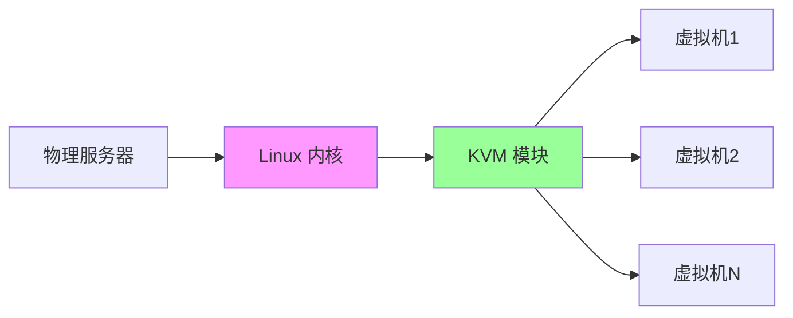
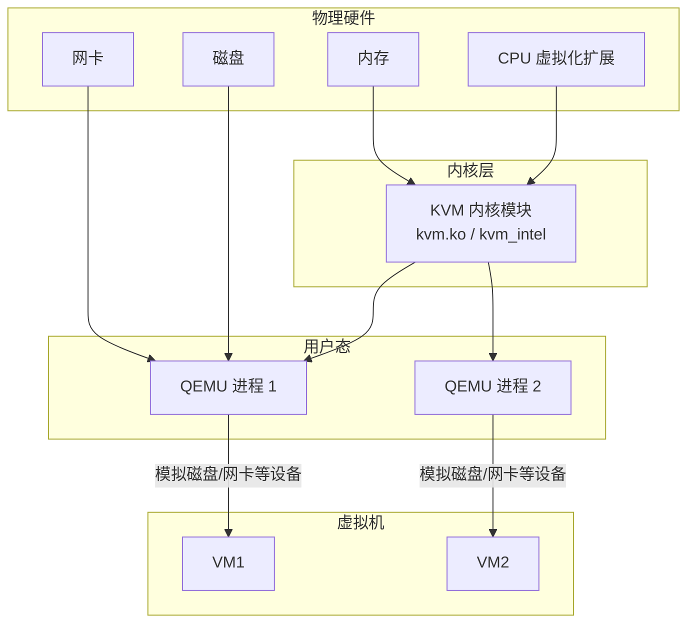
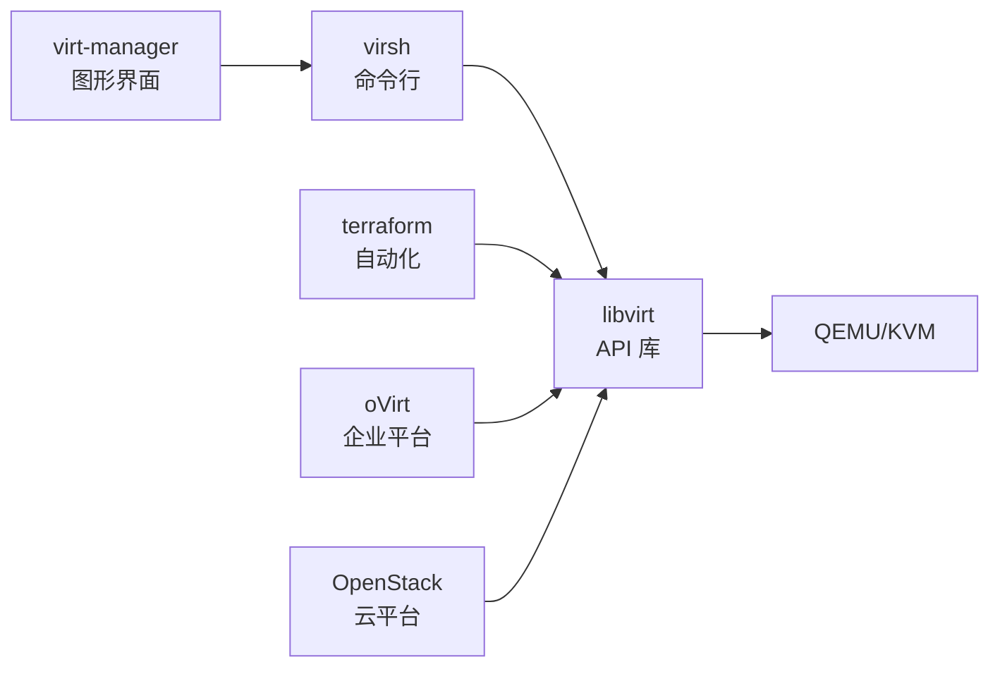
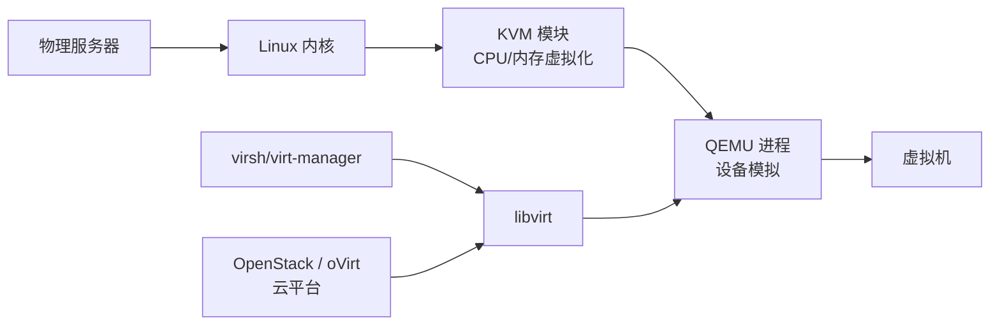

+++
title = "第69章：KVM/QEMU 虚拟化"
weight = 690
date = "2026-03-24T13:18:28+08:00"
type = "docs"
description = ""
isCJKLanguage = true
draft = false
+++


# 第六十九章：KVM/QEMU 虚拟化

## 69.1 KVM 简介

### 什么是 KVM？

KVM（Kernel-based Virtual Machine）是 Linux 内核原生虚拟化技术，让你的 Linux 变成"虚拟机管理员"。



### KVM vs 其他虚拟化

| 对比 | KVM | VMware | VirtualBox |
|------|-----|--------|-----------|
| 平台 | Linux 原生 | 跨平台 | 跨平台 |
| 性能 | 极高（内核级） | 高 | 中等 |
| 复杂度 | 较高 | 简单 | 简单 |
| 费用 | 免费开源 | 商业 | 免费 |
| 适用 | 服务器 | 桌面/服务器 | 桌面 |

### KVM 原理



> **这张图想说明的分工**：**每个虚拟机对应一个 QEMU 进程**。
> KVM 借助 CPU 的虚拟化扩展（Intel VT-x / AMD-V）负责最关键的 CPU 与内存虚拟化，
> 而磁盘、网卡、显卡这些设备的模拟由 QEMU 在用户态完成。
> 所以常说的 "KVM 虚拟化" 其实是 **KVM + QEMU** 两部分的组合：
> 少了 KVM 会退化成纯软件模拟（慢几十倍），少了 QEMU 就没有设备可用。

> **虚拟化类型的顺带说明**：KVM 属于**全虚拟化（Type-1 型 Hypervisor）**，
> 客户机不需要修改内核；而容器（Docker/Podman）属于**操作系统级虚拟化**，
> 与宿主机共享内核，因此更轻量但隔离性弱于 KVM。两者不是替代关系，常常一起使用。

### KVM 需要什么？

```bash
# 1. 检查 CPU 支持虚拟化
grep -E '(vmx|svm)' /proc/cpuinfo

# 有 vmx（Intel）或 svm（AMD）输出，说明支持
# 注意：如果本机本身是虚拟机，这里可能什么都没有——需要宿主开启"嵌套虚拟化"

# 也可以直接看是否已在虚拟机里运行（KVM 会输出 kvm）
systemd-detect-virt

# 2. 检查 KVM 模块是否加载
lsmod | grep kvm

# 如果没有加载，手动加载
sudo modprobe kvm
sudo modprobe kvm_intel    # Intel CPU
# 或
sudo modprobe kvm_amd      # AMD CPU
```

> **模块加载失败怎么办**：报 `Operation not permitted` 或加载后没有任何虚拟化能力，
> 说明虚拟化扩展在 **BIOS/UEFI 里被关闭了**（Intel 叫 VT-x / Virtualization Technology，
> AMD 叫 SVM Mode）。这是"装完 KVM 但 `virsh` 起不来虚拟机"最常见的原因，
> 需要进固件设置把它打开再重启。

## 69.2 KVM 安装

### Ubuntu/Debian 安装

```bash
# 更新系统
sudo apt update
sudo apt upgrade -y

# 安装 KVM 和相关工具
sudo apt install qemu-system-x86 qemu-utils \
    libvirt-daemon libvirt-daemon-system \
    virt-manager virt-viewer \
    libosinfo-bin cloud-image-utils \
    genisoimage acpica-tools

# 说明：老教程里的 qemu-kvm 在 Debian 10 / Ubuntu 20.04 之后已变成"过渡包"，
# 新环境请装 qemu-system-x86（KVM 加速已包含在 qemu-system-x86 中）

# 顺带装上 virtinst，virt-install 命令由它提供
sudo apt install virtinst

# 启动 libvirt 服务
sudo systemctl enable libvirtd
sudo systemctl start libvirtd

# 添加当前用户到 libvirt 组（免 sudo）
sudo usermod -aG libvirt $USER
sudo usermod -aG kvm $USER

# 重新登录使配置生效
```

### CentOS/RHEL 安装

```bash
# 安装 KVM
sudo dnf install -y qemu-kvm libvirt virt-install \
    libvirt-client virt-manager

# 注：bridge-utils（brctl）已经过时，桥接功能由 iproute2 的 ip/bridge 命令提供，
# 系统默认就有，不需要额外安装

# 启动服务
sudo systemctl enable libvirtd
sudo systemctl start libvirtd

# 添加用户到组
sudo usermod -aG libvirt $USER
sudo usermod -aG kvm $USER
```

### 验证安装

```bash
# 检查 libvirt 连接
virsh list --all

# 查看宿主机信息（CPU 型号、核数、内存等）
virsh nodeinfo

# 预期输出示例：
# CPU model:           x86_64
# CPU(s):              8
# CPU frequency:       3200 MHz
# CPU socket(s):       1
# Core(s) per socket:  4
# Thread(s) per core:  2
# NUMA cell(s):        1
# Memory size:         32768 MiB

# 确认 libvirt 真的在用 KVM 加速（输出里应包含 "QEMU" 与 "KVM"）
virsh version
```

## 69.3 virsh 命令行管理

virsh 是管理 KVM 虚拟机的命令行工具。

### virsh list

```bash
# 列出正在运行的虚拟机
virsh list

# 列出所有虚拟机（包括关闭的）
virsh list --all

# 预期输出：
#  Id    Name                           State
# ----------------------------------------------------
#  1     web-server                    running
#  2     db-server                    running
#  -     centos7-vm                   shut off
```

### virsh start/stop

```bash
# 启动虚拟机
virsh start web-server

# 关闭虚拟机（优雅关机）
virsh shutdown web-server

# 强制关闭（拔电源）
virsh destroy web-server

# 重启虚拟机
virsh reboot web-server

# 暂停（挂起）
virsh suspend web-server

# 恢复运行
virsh resume web-server

# 设置自动启动
virsh autostart web-server

# 取消自动启动
virsh autostart --disable web-server
```

### virsh console

```bash
# 连接虚拟机控制台
virsh console web-server

# 退出控制台
# 按 Ctrl + ]

# 如果需要在虚拟机内部配置 console
# Debian/Ubuntu/CentOS 现代版本都用同一个服务名
sudo systemctl enable serial-getty@ttyS0
sudo systemctl start serial-getty@ttyS0

# 部分发行版（如 CentOS 7）还需要确认内核命令行带了 console=ttyS0，
# 否则串口上什么都看不到：
#   grep console /proc/cmdline
```

> **`virsh console` 卡住不动的排查顺序**
>
> 1. 先确认客户机内核命令行里有 `console=ttyS0`（老发行版常见问题）；
> 2. 再确认 `serial-getty@ttyS0` 服务是 active；
> 3. 如果提示控制台已被占用，可以加 `--force`；
> 4. 退出当前控制台用 `Ctrl + ]`（不是 `Ctrl + C`，后者只会发给客户机）。

### virsh edit

```bash
# 编辑虚拟机配置（XML 格式）
virsh edit web-server

# 常用配置修改示例：
# - 调整内存、CPU
# - 修改网络配置
# - 添加磁盘
# - 修改启动顺序

# 查看完整配置
virsh dumpxml web-server > web-server.xml

# 从 XML 文件定义虚拟机
virsh define web-server.xml
```

### 更多 virsh 命令

```bash
# 查看虚拟机信息
virsh dominfo web-server

# 查看虚拟机 vCPU 使用
virsh vcpuinfo web-server

# 设置 vCPU 亲和性
virsh vcpupin web-server --vcpu 0 --cpulist 0-3

# 查看虚拟机磁盘
virsh domblklist web-server

# 查看虚拟机网络
virsh domiflist web-server
```

> **名称写错是最常见的低级错误**：`virsh` 的命令参数是虚拟机名字，
> 名字写错时会报 `error: failed to get domain 'xxx'`。
> 记不准时先 `virsh list --all` 看一眼，或者直接按 Tab 补全（bash 支持 `virsh` 的补全脚本）。
>
> 另外把几个常用的排障命令补齐，遇到问题按顺序试：
>
> ```bash
> virsh dominfo web-server           # 概览：状态、vCPU、内存、自动启动
> virsh domstate web-server          # 只看状态
> virsh domblklist web-server        # 磁盘与光驱
> virsh domifaddr web-server         # 客户机 IP（需要装 qemu-guest-agent）
> virsh domstats web-server          # 详细的实时统计
> virsh undefine web-server          # 删除虚拟机定义（磁盘文件不会自动删除）
> virsh undefine web-server --remove-all-storage   # 连磁盘一起删，慎用
> ```

## 69.4 libvirt 库

libvirt 是 KVM 的管理 API，提供统一的虚拟化管理接口。

### libvirt 架构



### libvirt 网络

```bash
# 查看网络
virsh net-list --all

# 默认网络（NAT）
# 10.0.3.0/24

# 创建桥接网络
cat > bridge-network.xml << 'EOF'
<network>
  <name>bridge-net</name>
  <forward mode="bridge"/>
  <bridge name="br0"/>
</network>
EOF

# 定义网络
virsh net-define bridge-network.xml

# 启动网络
virsh net-start bridge-net

# 设置自启动
virsh net-autostart bridge-net
```

### 存储池管理

```bash
# 查看存储池
virsh pool-list --all

# 创建目录存储池
virsh pool-define-as default-pool --type dir --target /var/lib/libvirt/images
virsh pool-build default-pool
virsh pool-start default-pool
virsh pool-autostart default-pool

# 创建 LVM 存储池
virsh pool-define-as lvm-pool --type lvm \
    --source-name vg_kvm \
    --target /dev/vg_kvm
virsh pool-start lvm-pool

# 删除存储池
virsh pool-destroy default-pool
virsh pool-undefine default-pool
```

> **LVM 存储池的两个容易混淆的参数**
>
> - `--source-name` 填的是**卷组名**（如 `vg_kvm`），这是必填项。
> - `--source-dev` 填的是**物理设备**（如 `/dev/sdb`），只在需要 libvirt 帮你创建卷组时才用。
>   把 `/dev/vg_kvm`（一个卷组路径）当成物理设备填进 `--source-dev`，池会创建失败。
>
> 也就是说：**卷组已经存在 → 只写 `--source-name`；卷组还不存在 → 写 `--source-dev /dev/sdX` +
> `--source-name 新的卷组名`，再执行 `virsh pool-build` 由 libvirt 创建它。**

## 69.5 virt-manager 图形化管理

virt-manager 是 KVM 的图形化管理工具，适合新手。

### 安装

```bash
# Ubuntu/Debian
sudo apt install virt-manager

# RHEL / Rocky / Alma / Fedora（现代 RHEL 系用 dnf）
sudo dnf install virt-manager

# 启动
# 注意：virt-manager 是图形程序，需要图形界面（本地桌面，或 SSH X11 转发）。
# 纯命令行的服务器上通常不装它，用 virsh + virt-install 即可。
virt-manager --connect qemu:///system
```

### 图形界面功能

```bash
# virt-manager 主要功能：
# 1. 创建虚拟机（图形向导）
# 2. 查看虚拟机状态
# 3. 打开虚拟机控制台
# 4. 编辑虚拟机配置
# 5. 管理存储池
# 6. 管理网络
# 7. 克隆虚拟机
# 8. 快照管理
```

### 创建虚拟机流程

```bash
# 1. 点击"新建"按钮
# 2. 选择安装方式：
#    - 本地安装介质（ISO）
#    - 网络安装（URL）
#    - 导入已有磁盘
# 3. 分配 CPU、内存
# 4. 配置存储
# 5. 配置网络
# 6. 完成安装
```

## 69.6 虚拟机创建

### 使用 virt-install

```bash
# 1. 创建虚拟机（最小化安装 CentOS）
sudo virt-install \
    --name centos7-vm \
    --ram 2048 \
    --vcpus 2 \
    --disk path=/var/lib/libvirt/images/centos7.qcow2,size=20 \
    --cdrom /path/to/CentOS-7-x86_64-DVD.iso \
    --network network=default \
    --graphics vnc \
    --os-variant rhel7

# 2. 创建虚拟机（Ubuntu Server）
sudo virt-install \
    --name ubuntu-vm \
    --ram 4096 \
    --vcpus 4 \
    --disk path=/var/lib/libvirt/images/ubuntu.qcow2,size=40 \
    --cdrom /path/to/ubuntu-22.04-live-server-amd64.iso \
    --network network=default \
    --graphics vnc \
    --os-variant ubuntu22.04

# 3. 从网络安装（不需要 ISO）
sudo virt-install \
    --name fedora-vm \
    --ram 2048 \
    --vcpus 2 \
    --disk path=/var/lib/libvirt/images/fedora.qcow2,size=20 \
    --location https://mirror.example.com/fedora/38/Server/x86_64/ \
    --network network=default \
    --graphics vnc \
    --os-variant fedora38
```

### 常用选项

| 选项 | 说明 | 示例 |
|------|------|------|
| --name | 虚拟机名称 | --name web-server |
| --ram | 内存（MB） | --ram 4096 |
| --vcpus | CPU 数量 | --vcpus 4 |
| --disk | 磁盘路径和大小 | --disk path=...,size=20 |
| --cdrom | ISO 路径 | --cdrom /path/to.iso |
| --network | 网络类型 | --network network=default |
| --graphics | 图形配置 | --graphics vnc |
| --os-variant | 操作系统类型 | --os-variant ubuntu22.04 |

### 创建 Windows 虚拟机

```bash
# 1. 需要添加 VirtIO 驱动
wget https://fedorapeople.org/groups/virt/virtio-win/direct-downloads/stable-virtio/virtio-win.iso

# 2. 创建 Windows VM
sudo virt-install \
    --name windows-vm \
    --ram 4096 \
    --vcpus 4 \
    --disk path=/var/lib/libvirt/images/win.qcow2,size=60,bus=virtio \
    --cdrom /path/to/windows.iso \
    --disk path=/var/lib/libvirt/images/virtio-win.iso,device=cdrom \
    --network network=default,model=virtio \
    --graphics vnc \
    --os-variant win10
```

## 69.7 虚拟机快照

快照是虚拟机的"存档"，可以随时恢复。

### 创建快照

```bash
# 1. 查看快照
virsh snapshot-list web-server

# 2. 创建普通（内部）快照：既能开机也能关机状态创建，
#    但两者包含的内容不同——关机时只保存磁盘状态，开机时还会保存内存状态
virsh snapshot-create-as web-server \
    --name "before-update" \
    --description "Update 前的快照"

# 3. 创建外部磁盘快照：磁盘生成一个新的覆盖层文件，原盘变为只读基础盘
#    常用在"在线备份"场景（先做外部快照，再拷贝基础盘）
#    注意：这类快照不支持 snapshot-revert 回滚，只能靠 blockcommit 合并
virsh snapshot-create-as centos7-vm \
    --name "before-upgrade" \
    --disk-only --atomic

# 4. 查看快照 XML
virsh snapshot-dumpxml web-server --snapshotname "before-update"
```

> **`--disk-only` 不是"关机快照"**：它的含义是"**只做磁盘快照、不保存内存**"，
> 通常用于运行中的虚拟机做外部快照。老教程把它说成"离线快照"是错的。
> 真正想要"关机状态下的干净快照"，做法是 `virsh shutdown` 关掉虚拟机后再执行
> 普通 `snapshot-create-as`（此时自然只包含磁盘状态）。
>
> **另外务必记住三条限制**
>
> | 限制 | 说明 |
> |------|------|
> | 只有 qcow2 支持内部快照 | raw 格式的磁盘做不了内部快照，需要先转换格式 |
> | 外部快照不能直接 revert | 只能用 `virsh blockcommit` 把覆盖层合并回基础盘 |
> | **快照不是备份** | 快照文件和原盘在**同一块存储**上，磁盘坏了快照一起没；误删原盘也会导致快照链断裂 |
>
> 因此快照适合"升级前留个后悔药"，不能替代备份。备份需要把数据复制到**另一套存储**上。

### 恢复快照

```bash
# 1. 恢复到指定快照
virsh snapshot-revert web-server --snapshotname "before-update"

# 2. 查看当前快照
virsh snapshot-current web-server
```

### 删除快照

```bash
# 删除快照
virsh snapshot-delete web-server --snapshotname "before-update"

# 删除快照链中的所有
virsh snapshot-delete web-server --current
```

### 快照管理脚本

```bash
#!/bin/bash
# backup_vm.sh - 虚拟机快照备份

set -euo pipefail

VM_NAME=$1
SNAPSHOT_NAME="backup-$(date +%Y%m%d_%H%M%S)"

if [ -z "$VM_NAME" ]; then
    echo "用法: $0 <虚拟机名称>"
    exit 1
fi

echo "为 $VM_NAME 创建快照: $SNAPSHOT_NAME"

# 创建快照
virsh snapshot-create-as "$VM_NAME" \
    --name "$SNAPSHOT_NAME" \
    --description "自动备份快照"

# 列出所有快照
echo "当前快照列表："
virsh snapshot-list "$VM_NAME"

# 保留最近 5 个快照：按创建时间排序，删掉更早的
# virsh snapshot-list 前两行是表头，用 --name 只输出名字更干净
KEEP=5
OLD_SNAPSHOTS=$(virsh snapshot-list "$VM_NAME" --name | head -n "-$KEEP" || true)
for SNAP in $OLD_SNAPSHOTS; do
    echo "删除旧快照: $SNAP"
    virsh snapshot-delete "$VM_NAME" --snapshotname "$SNAP"
done

echo "快照创建完成！"
echo "提醒：快照与原盘在同一存储上，它不能替代真正的异地备份。"
```

> **脚本的两个改进点**：一是加了 `set -euo pipefail`，任何一步出错就立刻停下，
> 不会"创建失败还继续删旧快照"；二是用 `virsh snapshot-list --name` 取名字，
> 避免之前用 `head/tail/awk` 去解析表格输出——那种写法在列宽变化时会解析出错误的名字。

## 69.8 存储池管理

### 存储池类型

| 类型 | 说明 | 适用场景 |
|------|------|---------|
| dir | 目录 | 简单文件存储 |
| fs | 文件系统 | 挂载的 NFS |
| logical | LVM | 高性能 |
| rbd | Ceph RBD | 生产环境 |
| glusterfs | GlusterFS | 分布式存储 |

### 创建存储池

```bash
# 1. 创建目录存储池
virsh pool-define-as default-pool dir \
    --target /var/lib/libvirt/images
virsh pool-build default-pool
virsh pool-start default-pool

# 2. 创建 LVM 存储池
virsh pool-define-as lvm-pool logical \
    --source-dev /dev/sdb \
    --source-name vg_libvirt \
    --target /dev/vg_libvirt
virsh pool-build lvm-pool
virsh pool-start lvm-pool

# 3. 创建 Ceph RBD 存储池
virsh pool-define-as ceph-pool rbd \
    --source-name libvirt_pool \
    --source-host ceph-mon \
    --auth-username admin \
    --secret-usage libvirt_ceph
virsh pool-start ceph-pool
```

> **存储池类型名别写混**：`dir`、`logical`、`fs`、`netfs`、`rbd`、`glusterfs` 都是合法类型，
> 但注意 **`lvm` 不是合法类型名**，对应的类型叫 `logical`（用 `--type lvm` 会报错）。
> 生产环境里最常用的组合是：本地临时用 `dir`，需要快照和精简置备用 `logical`，
> 集群环境用 `rbd`（Ceph）或 `netfs`（NFS）。另外，Ceph RBD 池还需要先用
> `virsh secret-define` / `secret-set-value` 把访问密钥交给 libvirt，否则 `pool-start` 会因鉴权失败。

### 存储卷管理

```bash
# 在存储池中创建卷
virsh vol-create-as default-pool ubuntu22.04.qcow2 40G --format qcow2

# 查看卷
virsh vol-list default-pool

# 克隆卷
virsh vol-clone original.qcow2 new-clone.qcow2 --pool default-pool

# 调整卷大小（语法为：vol-resize <卷名> <新容量> --pool <池名>）
# 加 --allocate 会立即分配空间；不加则只是把"虚拟容量"改大
virsh vol-resize ubuntu22.04.qcow2 80G --pool default-pool

# 注意：把卷调大之后，客户机里的分区和文件系统还看不到多出来的空间，
# 需要进入客户机用 growpart + resize2fs（ext4）/ xfs_growfs（XFS）继续扩

# 删除卷
virsh vol-delete ubuntu22.04.qcow2 --pool default-pool
```

> **`vol-resize` 只能调大不能随意调小**（缩小会丢数据，libvirt 会直接拒绝），
> 这是一个安全设计。另外它还有个常见误区：**改了 qcow2 文件的容量 ≠ 客户机看到了更多磁盘空间**，
> 后者必须进客户机扩分区和文件系统，两步都做完才算真正扩容完成。

## 69.9 网络配置

### 网络模式

| 模式 | 说明 | 特点 |
|------|------|------|
| NAT | 网络地址转换 | 虚拟机可访问主机，外部访问需端口映射 |
| 桥接 | 虚拟机像真实机器 | 虚拟机占用真实 IP |
| 隔离 | 虚拟机之间互通 | 与外部隔绝 |
| 路由 | 虚拟机通过主机路由 | 需要路由配置 |

### 配置桥接网络

```bash
# 1. 查看物理网卡
ip link show

# 2. 创建桥接网卡 br0
# 方式一：Ubuntu（netplan）
sudo tee /etc/netplan/01-bridge.yaml > /dev/null << 'EOF'
network:
  version: 2
  renderer: networkd
  ethernets:
    enp0s3:
      dhcp4: no
  bridges:
    br0:
      interfaces: [enp0s3]
      addresses: [192.168.1.100/24]
      routes:
        - to: default
          via: 192.168.1.1
      parameters:
        stp: false
        forward-delay: 0
EOF
sudo netplan apply

# 方式二：Debian（ifupdown，即 /etc/network/interfaces）
# auto br0
# iface br0 inet static
#     address 192.168.1.100
#     netmask 255.255.255.0
#     gateway 192.168.1.1
#     bridge_ports enp0s3
#     bridge_stp off
#     bridge_fd 0
#     bridge_maxwait 0
# 改完执行：sudo systemctl restart networking

# 方式三：RHEL 系（NetworkManager）
# sudo nmcli connection add type bridge ifname br0 con-name br0 stp no
# sudo nmcli connection add type ethernet ifname enp0s3 master br0
# sudo nmcli connection modify br0 ipv4.addresses 192.168.1.100/24 \
#     ipv4.gateway 192.168.1.1 ipv4.method manual
# sudo nmcli connection up br0

# 3. 验证桥接（brctl 已过时，改用 iproute2 自带的命令）
bridge link
ip link show master br0
```

> **桥接改造必须小心：这一步有把宿主机"改断网"的风险**，
> 尤其是通过 SSH 远程操作时。建议：优先在本地控制台/带外管理口操作，
> 或者先写一个"5 分钟后自动重启网络"的定时任务兜底
> （`echo 'systemctl restart networking' | sudo at now + 5 minutes`，验证成功后再取消）。
>
> 另外，**Ubuntu 22.04 及以后直接执行 `sudo systemctl restart networking` 会失败**
> （网络由 netplan + systemd-networkd 管理，不再有传统的 networking 服务），
> 这是很多教程照抄后卡住的地方，请按你的发行版选择上面的对应方式。

### virsh 网络配置

```bash
# 创建 NAT 网络（默认）
cat > nat-network.xml << 'EOF'
<network>
  <name>nat-net</name>
  <forward mode='nat'/>
  <bridge name='virbr1' stp='on' delay='0'/>
  <ip address='192.168.100.1' netmask='255.255.255.0'>
    <dhcp>
      <range start='192.168.100.128' end='192.168.100.254'/>
    </dhcp>
  </ip>
</network>
EOF

virsh net-define nat-network.xml
virsh net-start nat-net
virsh net-autostart nat-net
```

### 连接到桥接网络

```bash
# 方式一：修改虚拟机配置
virsh edit web-server

# 将：
# <interface type='network'>
#   <source network='default'/>
# </interface>
# 改为：
# <interface type='bridge'>
#   <source bridge='br0'/>
# </interface>

# 方式二：命令行修改
# 先加新网卡，确认能通之后再拆旧网卡（顺序反了会短暂断网）
virsh attach-interface web-server bridge br0 --current

# 卸载时要指定 MAC 来指明"卸哪一个"，
# 否则多网卡时 libvirt 无法判断你的意图
virsh domiflist web-server                     # 先查出要卸载网卡的 MAC
virsh detach-interface web-server --type network --mac 52:54:00:xx:xx:xx --current
```

> **改完网卡配置记得持久化**：`--current` 只作用于当前运行状态，**重启就没了**。
> 想永久生效，把 `--current` 换成 `--config`（或者两个都写 `--live --config`）。
> 调网络时最容易踩这个坑：当时明明通了，重启后配置又回到原样。

## 69.10 性能调优与在线迁移

虚拟机"跑得慢"往往不是硬件不够，而是几个关键开关没打开。下面按收益从高到低排列：

| 优化项 | 做法 | 说明 |
|--------|------|------|
| CPU 模式 | `<cpu mode='host-passthrough'/>` | 把宿主 CPU 特性完整暴露给客户机，性能最好；`host-model` 更保守、迁移兼容性更好 |
| 磁盘总线 | `bus=virtio` + `cache=none` + `io=native` | 绕过 QEMU 用户态缓存，让客户机直接走内核 IO 路径 |
| 网卡型号 | `<model type='virtio'/>` | 性能远好于 `e1000` 等模拟网卡 |
| 内存大页 | `<memoryBacking><hugepages/></memoryBacking>` | 减少 TLB miss，数据库类负载收益明显 |
| 内存气球 | virtio-balloon | 允许运行时回收客户机空闲内存，提高超卖比 |
| CPU 绑定 | `virsh vcpupin` + `virsh emulatorpin` | 把 vCPU 钉在物理核上，减少跨 NUMA 访问 |

```bash
# 查看当前生效的 CPU 模式
virsh dumpxml web-server | grep -A2 '<cpu'

# 改 CPU 模式：virsh edit 里把 <cpu> 段改成下面这样，改完需重启客户机生效
# <cpu mode='host-passthrough' check='none'/>

# 查看大页配置与剩余可用数量
grep -i hugepages /proc/meminfo
```

### 在线迁移（Live Migration）

把运行中的虚拟机从一台宿主机搬到另一台，业务几乎无中断，是宿主机维护和负载均衡的关键能力：

```bash
# 前置条件：两台宿主机能互相通过 ssh 访问、libvirt 使用相同或共享的存储、
# 且 CPU 特性兼容（不兼容时可先把 CPU 模式改成 host-model，或规划统一的 CPU 基线）

# 迁移到另一台宿主机（默认拷贝内存状态，停机时间通常在几十毫秒级）
virsh migrate --live web-server qemu+ssh://node2/system

# 内存大、带宽有限时，开启自动降速并设置超时，失败则回滚
virsh migrate --live --auto-converge --timeout 60 \
    web-server qemu+ssh://node2/system

# 查看迁移相关能力（是否支持 RDMA、压缩等）
virsh migrate-compcache web-server
```

> **迁移失败的三大常见原因**
>
> 1. **CPU 特性不一致**：新旧宿主机 CPU 型号不同，客户机在新机器上无法恢复。
>    解决办法是用统一的 CPU 基线（`host-model`），或把集群机器选成同型号。
> 2. **存储不是共享的**：内存迁过去了，但新宿主机访问不到磁盘文件。跨机迁移要求共享存储
>    （NFS/Ceph）或使用块迁移（`--copy-storage-all`，慢且有停机）。
> 3. **脏页追不上**：内存太大、带宽不足时，迁移进度永远追不上客户机产生新数据的速度。
>    这时可开 `--auto-converge` 让 QEMU 主动降低客户机运行速度，或改用带宽更大的网络。

## 本章小结

本章我们学习了 KVM/QEMU 虚拟化技术：

| 组件 | 说明 |
|------|------|
| KVM | 内核模块，提供 CPU/内存的硬件辅助虚拟化 |
| QEMU | 每个虚拟机一个进程，负责模拟磁盘、网卡等设备 |
| libvirt | 统一的虚拟化管理 API，屏蔽底层差异 |
| virsh | libvirt 的命令行客户端，日常管理主力 |
| virt-manager | 图形化管理工具，适合入门与临时操作 |
| virt-install | 命令行创建虚拟机（由 virtinst 提供） |

KVM 工作流程：



几个最容易记混、但必须记住的要点：

1. **KVM + QEMU 是一体的**：KVM 管 CPU 和内存，QEMU 管设备模拟，两者缺一不可。
2. **每个虚拟机对应一个 QEMU 进程**：用 `ps -ef | grep qemu` 能看到，排查性能时很有用。
3. **virt-install 只负责"创建"**：创建完之后就交给 libvirt 管理，日常操作用 virsh。
4. **快照不等于备份**：快照和原盘在同一存储上，必须另有异地/异盘备份。
5. **改动分 live 和 config**：`--current` 只改运行态、`--config` 才写进持久配置。

---

> 💡 **温馨提示**：
> KVM 是 Linux 服务器虚拟化的首选方案，性能接近物理机。
> 单机小规模用 libvirt + virt-manager 就够了；规模上来之后，
> 常见做法是配合 Ceph 做共享存储、用 Proxmox VE 或 OpenStack 做统一管理。
> 但无论用哪套，**改变不了三条铁律**：快照不是备份、没演练过的迁移不算可靠、CPU 与存储的兼容性要先想清楚。

---

**第六十九章：KVM/QEMU — 完结！** 🎉

下一章我们将学习"其他虚拟化技术"，包括 Proxmox、Podman、Docker Desktop、Hyper-V。敬请期待！ 🚀
