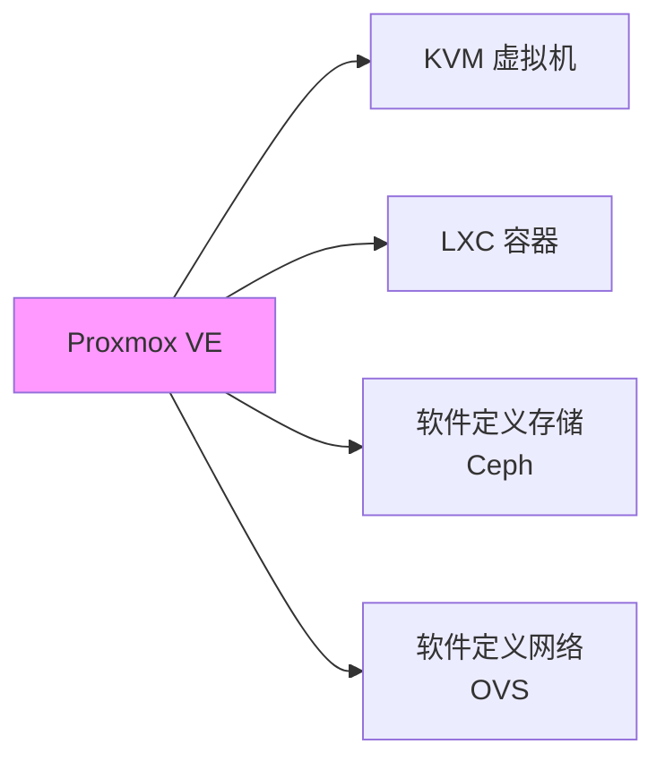
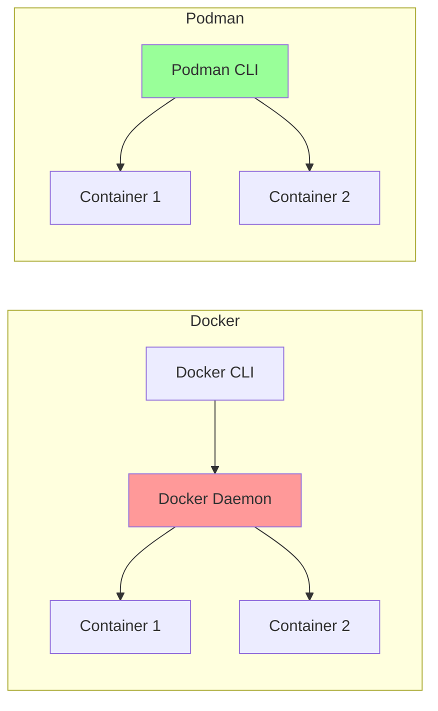
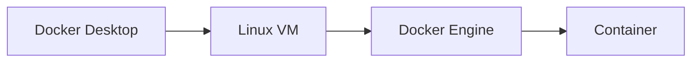
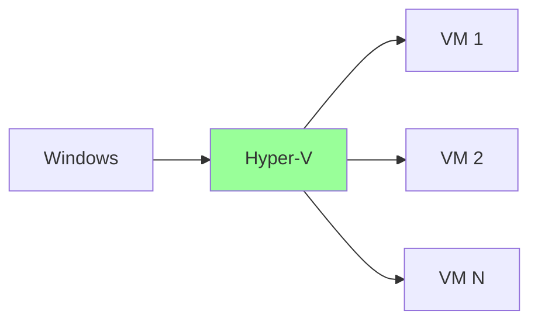
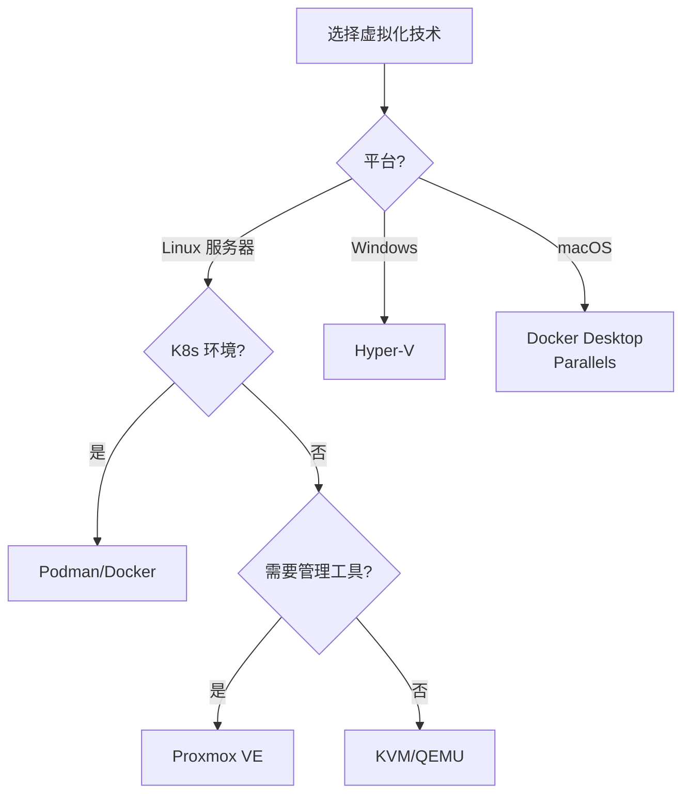

+++
title = "第70章：其他虚拟化技术"
weight = 700
date = "2026-03-24T13:18:28+08:00"
type = "docs"
description = ""
isCJKLanguage = true
draft = false
+++


# 第七十章：其他虚拟化技术

## 70.1 Proxmox VE

### 什么是 Proxmox VE？

Proxmox VE（Virtual Environment）是基于 Debian 的开源虚拟化平台，集合了 KVM 虚拟机和 LXC 容器，功能强大，界面友好。



### Proxmox vs 其他方案

| 对比 | Proxmox VE | VMware vSphere | Hyper-V |
|------|-------------|----------------|---------|
| 费用 | 免费开源 | 商业版昂贵 | Windows 许可 |
| 界面 | Web 界面 | vSphere Client | Hyper-V Manager |
| 容器支持 | LXC 原生 | 需要 vSphere Integrated Containers | Windows Container |
| 存储 | Ceph 内置 | 需要 vSAN | SMB/ISCSI |
| 学习曲线 | 中等 | 陡峭 | 中等 |

### Proxmox 安装

```bash
# 1. 下载 ISO
# https://www.proxmox.com/en/downloads

# 2. 创建启动盘
# Linux
dd if=proxmox-ve_*.iso of=/dev/sdX bs=4M status=progress

# Windows: 使用 Rufus 或 Balena Etcher

# 3. 安装（图形界面引导）
# - 选择磁盘
# - 设置网络
# - 设置 root 密码
# - 等待安装完成

# 4. 访问 Web 界面
# https://你的IP:8006
```

### Proxmox Web 界面

```bash
# 默认登录信息：
# 用户名：root
# 密码：安装时设置
# 端口：8006

# 主要功能：
# - 创建/管理虚拟机
# - 创建/管理容器
# - 存储管理
# - 网络管理
# - 用户权限管理
# - 集群管理
# - 备份/恢复
```

### 创建虚拟机

```bash
# 方式一：Web 界面操作
# 1. 点击"创建 VM"
# 2. 选择操作系统类型
# 3. 选择 ISO 或网络安装
# 4. 配置 CPU、内存、磁盘
# 5. 配置网络
# 6. 完成

# 方式二：命令行创建
qm create 100 --name "web-server" \
    --memory 2048 --net0 virtio,bridge=vmbr0

qm set 100 --cores 2 --cpu host
qm set 100 --ide2 local:iso/ubuntu-22.04.iso,media=cdrom
qm set 100 --scsi0 local-lvm:vm-100-disk-0,size=20G
qm start 100
```

### LXC 容器

```bash
# 创建 LXC 容器（比 VM 更轻量）
pct create 100 local:vztmpl/ubuntu-22.04.tar.xz \
    --hostname web-container \
    --memory 1024 \
    --cores 2 \
    --rootfs local-lvm:8 \
    --net0 name=eth0,bridge=vmbr0,ip=dhcp

# 启动容器
pct start 100

# 进入容器
pct enter 100

# 容器操作
pct stop 100      # 停止
pct reboot 100    # 重启
pct destroy 100   # 删除
pct list          # 列出容器
```

### 存储管理

```bash
# 查看存储
pvesm list

# 添加 NFS 存储
pvesm add nfs backup \
    --server 192.168.1.100 \
    --export /data \
    --content backup,iso,vztmpl

# 添加 Ceph 存储
pvesm add cephfs cephfs-storage \
    --monhost "192.168.1.101,192.168.1.102,192.168.1.103" \
    --username admin \
    --secret /etc/pve/priv/ceph/cephfs.secret

# 查看存储使用
pvesm status
```

### 集群管理

```bash
# 创建集群
pvecm create my-cluster

# 加入节点（在其他服务器上执行）
pvecm add 192.168.1.100

# 查看集群状态
pvecm status

# 迁移虚拟机
qm migrate 100 node2 --online
```

## 70.2 Podman

### 什么是 Podman？

Podman 是"无守护进程容器"引擎，和 Docker 兼容但不需要 Docker 守护进程，更安全。



### Podman vs Docker

| 对比 | Podman | Docker |
|------|--------|--------|
| 守护进程 | 无 | 需要 |
| 用户权限 | 普通用户 | 需要 root |
| 安全性 | 更高 | 一般 |
| 兼容性 | Docker 兼容 | - |
| 镜像构建 | buildah | docker build |
| K8s 支持 | 原生 | 需要 daemon |

### 安装 Podman

```bash
# Ubuntu/Debian
sudo apt install podman

# CentOS/RHEL
sudo yum install podman

# macOS
brew install podman

# Windows (使用 WSL2)
winget install RedHat.Podman
```

### Podman 基本使用

```bash
# 拉取镜像
podman pull nginx:latest

# 运行容器
podman run -d --name nginx -p 8080:80 nginx:latest

# 查看容器
podman ps -a

# 查看镜像
podman images

# 进入容器
podman exec -it nginx /bin/bash

# 停止容器
podman stop nginx

# 删除容器
podman rm nginx

# 查看日志
podman logs nginx
```

### Podman 生成 K8s YAML

```bash
# 从运行中的容器生成 K8s YAML
podman generate kube nginx > nginx.yaml

# 生成结果示例：
# apiVersion: v1
# kind: Pod
# metadata:
#   creationTimestamp: "2024-01-15T10:30:00Z"
#   labels:
#     app: nginx
#   name: nginx
# spec:
#   containers:
#   - image: nginx:latest
#     name: nginx
#     ports:
#     - containerPort: 80
#       hostPort: 8080
```

### Podman Pod

```bash
# 创建 Pod（类似 K8s Pod）
podman pod create --name myapp

# 在 Pod 中运行容器
podman run -d --pod myapp --name web nginx:latest
podman run -d --pod myapp --name app myapp:latest
podman run -d --pod myapp --name db postgres:latest

# 查看 Pod
podman pod ls

# 查看 Pod 内容器
podman pod inspect myapp

# 停止/删除 Pod
podman pod stop myapp
podman pod rm myapp
```

## 70.3 Docker Desktop

### Docker Desktop 简介

Docker Desktop 是 Docker 的桌面版，专为 Windows 和 macOS 设计，让你在本地轻松运行容器。



### 安装 Docker Desktop

```bash
# Windows
# 1. 下载 Docker Desktop for Windows
# https://www.docker.com/products/docker-desktop

# 2. 运行安装程序
# 3. 启用 WSL 2（推荐）或 Hyper-V
# 4. 重启电脑
# 5. 运行 Docker Desktop

# macOS
# 1. 下载 Docker Desktop for Mac
# 2. 拖动到应用程序文件夹
# 3. 运行 Docker Desktop
```

### Docker Desktop vs Docker Engine

| 对比 | Docker Desktop | Docker Engine |
|------|----------------|---------------|
| 平台 | Windows/macOS | Linux |
| VM | 内置 Linux VM | 不需要 |
| Kubernetes | 内置（可选） | 需要单独安装 |
| 资源占用 | 较高 | 低 |
| 性能 | 稍低 | 高 |

### Docker Desktop 设置

```bash
# 设置 Docker 镜像加速
# Docker Desktop → Settings → Docker Engine
# 添加：
{
  "registry-mirrors": [
    "https://docker.mirrors.ustc.edu.cn",
    "https://hub-mirror.c.163.com"
  ],
  "builder": {
    "gc": {
      "enabled": true,
      "defaultKeepStorage": "20GB"
    }
  },
  "features": {
    "buildkit": true
  }
}
```

### Docker Desktop Extensions

```bash
# Docker Extensions 市场
# Extensions → Browse Extensions

# 常用扩展：
# - Docker Extensions for VS Code
# - Portainer（容器管理）
# - Disk Usage（磁盘分析）
# - Resource Usage（资源监控）
```

## 70.4 Hyper-V

### 什么是 Hyper-V？

Hyper-V 是 Windows 的原生虚拟化平台，从 Windows 8 开始内置，让 Windows 变成"虚拟机管理员"。



### 启用 Hyper-V

```powershell
# Windows 10/11 专业版/企业版

# 方式一：PowerShell（管理员）
Enable-WindowsOptionalFeature -Online -FeatureName Microsoft-Hyper-V -All

# 方式二：控制面板
# 程序 → 启用或关闭 Windows 功能 → 勾选"Hyper-V"
# 重启电脑

# 方式三：CMD
dism /online /enable-feature /featurename:Microsoft-Hyper-V /All
```

### Hyper-V 管理器

```powershell
# 打开 Hyper-V 管理器
# 开始菜单 → Windows 管理工具 → Hyper-V 管理器

# 主要功能：
# - 创建虚拟机
# - 管理虚拟机
# - 虚拟交换机管理
# - 存储管理
# - 检查点（快照）管理
```

### PowerShell 管理 Hyper-V

```powershell
# 创建虚拟机
New-VM -Name "WebServer" `
    -MemoryStartupBytes 2GB `
    -Generation 2 `
    -NewVHDPath "C:\VMs\WebServer.vhdx" `
    -NewVHDSizeBytes 60GB

# 查看虚拟机
Get-VM

# 启动虚拟机
Start-VM -Name "WebServer"

# 停止虚拟机
Stop-VM -Name "WebServer"

# 创建检查点（快照）
Checkpoint-VM -Name "WebServer" -SnapshotName "BeforeUpdate"

# 恢复检查点
Restore-VMSnapshot -VMName "WebServer" -Name "BeforeUpdate" -Confirm:$false

# 导出虚拟机
Export-VM -Name "WebServer" -Path "C:\VMExports\"
```

### Quick Create

```powershell
# 使用 Hyper-V 快速创建（图形化）
# Hyper-V 管理器 → 右侧"快速创建"

# 或者 PowerShell
# 下载 Ubuntu 虚拟机
New-VM -Name "Ubuntu22" -MemoryStartupBytes 4GB -Switch "Default Switch"

# 挂载 Ubuntu ISO
Set-VMDvdDrive -VMName "Ubuntu22" -Path "C:\ISOs\ubuntu-22.04.iso"

# 启动
Start-VM -Name "Ubuntu22"
```

### 嵌套虚拟化

```powershell
# 在 Hyper-V 虚拟机中运行 Hyper-V
# 需要在宿主机启用嵌套虚拟化

# 在宿主机执行
Set-VMProcessor -VMName "WSL-Dev" -ExposeVirtualizationExtensions $true

# 在虚拟机内部就可以安装 Hyper-V
Enable-WindowsOptionalFeature -Online -FeatureName Microsoft-Hyper-V -All
```

## 本章小结

本章我们学习了其他虚拟化技术：

| 技术 | 说明 | 适用场景 |
|------|------|---------|
| Proxmox VE | 开源虚拟化平台 | 企业服务器 |
| Podman | 无守护进程容器 | Linux 服务器 |
| Docker Desktop | 桌面容器平台 | 开发环境 |
| Hyper-V | Windows 原生虚拟化 | Windows 服务器 |

虚拟化技术选择指南：



---

> 💡 **温馨提示**：
> 虚拟化技术各有特点：生产服务器用 Proxmox 或 KVM，开发环境用 Docker Desktop 或 Podman，Windows 服务器用 Hyper-V。选择合适的工具，事半功倍！

---

**第七十章：其他虚拟化技术 — 完结！** 🎉

下一章我们将学习"信息收集"，掌握 Nmap、目录扫描、子域名枚举等渗透测试前期工作。敬请期待！ 🚀
