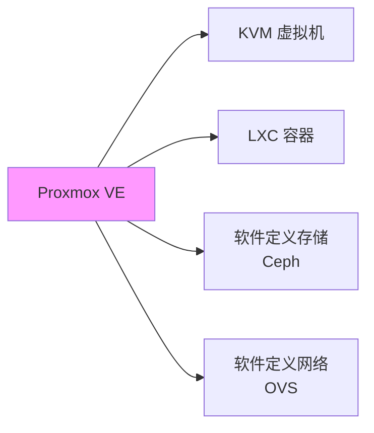
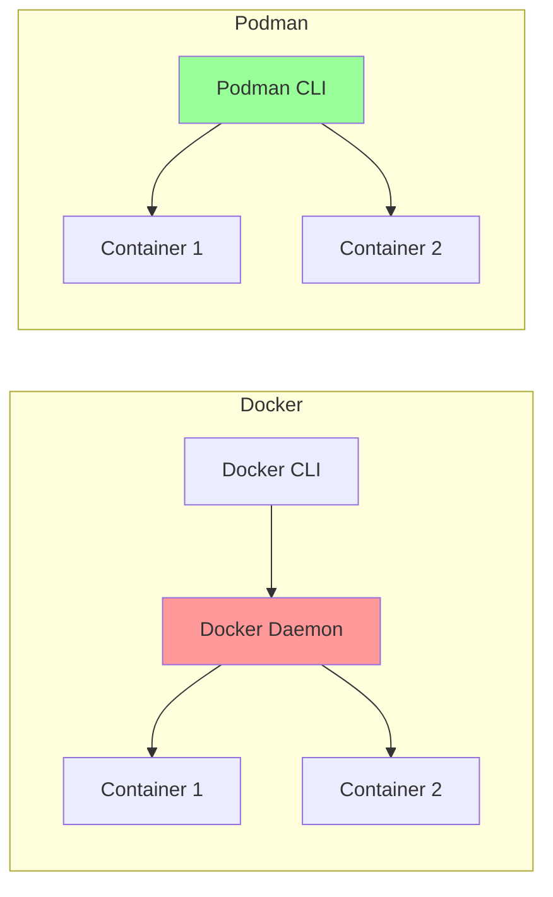
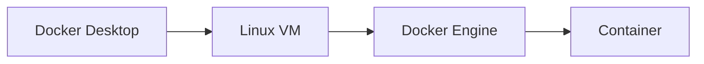
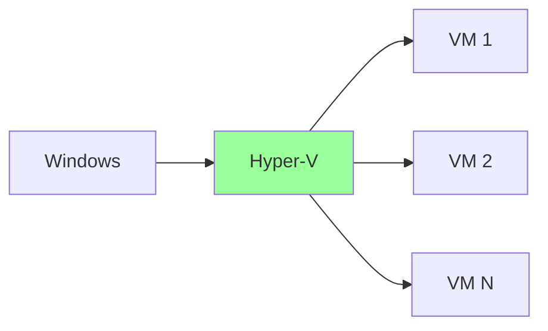
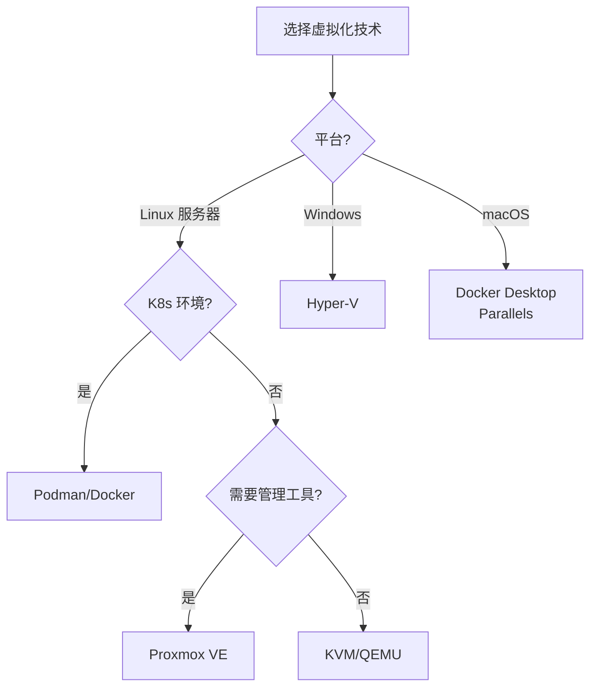

+++
title = "第70章：其他虚拟化技术"
weight = 700
date = "2026-03-24T13:18:28+08:00"
type = "docs"
description = ""
isCJKLanguage = true
draft = false
+++


# 第七十章：其他虚拟化技术

## 70.1 Proxmox VE

### 什么是 Proxmox VE？

Proxmox VE（Virtual Environment）是基于 Debian 的开源虚拟化平台，集合了 KVM 虚拟机和 LXC 容器，功能强大，界面友好。


```mermaid
graph LR
    A[Proxmox VE] --> B[KVM 虚拟机]
    A --> C[LXC 容器]
    A --> D[软件定义存储<br/>Ceph]
    A --> E[软件定义网络<br/>OVS]
    
    style A fill:#f9f
```

### Proxmox vs 其他方案

| 对比 | Proxmox VE | VMware vSphere | Hyper-V |
|------|-------------|----------------|---------|
| 费用 | 免费开源 | 商业版昂贵 | Windows 许可 |
| 界面 | Web 界面 | vSphere Client | Hyper-V Manager |
| 容器支持 | LXC 原生 | 需要 vSphere Integrated Containers | Windows Container |
| 存储 | Ceph 内置 | 需要 vSAN | SMB/ISCSI |
| 学习曲线 | 中等 | 陡峭 | 中等 |

### Proxmox 安装

```bash
# 1. 下载 ISO
# https://www.proxmox.com/en/downloads

# 2. 创建启动盘
# Linux
# ⚠️ 先用 lsblk 确认 U 盘的设备名，of= 写错会把系统盘直接覆盖成 ISO
lsblk
sudo dd if=proxmox-ve_*.iso of=/dev/sdX bs=4M status=progress conv=fsync
# 写完执行 sync 确保数据刷盘，再拔 U 盘
sync

# Windows: 使用 Rufus 或 Balena Etcher

# 3. 安装（图形界面引导）
# - 选择磁盘
# - 设置网络
# - 设置 root 密码
# - 等待安装完成

# 4. 访问 Web 界面
# https://你的IP:8006
```

### Proxmox Web 界面

```bash
# 默认登录信息：
# 用户名：root
# 密码：安装时设置
# 端口：8006

# 主要功能：
# - 创建/管理虚拟机
# - 创建/管理容器
# - 存储管理
# - 网络管理
# - 用户权限管理
# - 集群管理
# - 备份/恢复
```

### 创建虚拟机

```bash
# 方式一：Web 界面操作
# 1. 点击"创建 VM"
# 2. 选择操作系统类型
# 3. 选择 ISO 或网络安装
# 4. 配置 CPU、内存、磁盘
# 5. 配置网络
# 6. 完成

# 方式二：命令行创建
qm create 100 --name "web-server" \
    --memory 2048 --net0 virtio,bridge=vmbr0

qm set 100 --cores 2 --cpu host
qm set 100 --ide2 local:iso/ubuntu-22.04.iso,media=cdrom
qm set 100 --scsi0 local-lvm:vm-100-disk-0,size=20G
qm start 100
```

### LXC 容器

```bash
# 创建 LXC 容器（比 VM 更轻量）
pct create 100 local:vztmpl/ubuntu-22.04.tar.xz \
    --hostname web-container \
    --memory 1024 \
    --cores 2 \
    --rootfs local-lvm:8 \
    --net0 name=eth0,bridge=vmbr0,ip=dhcp

# 启动容器
pct start 100

# 进入容器
pct enter 100

# 容器操作
pct stop 100      # 停止
pct reboot 100    # 重启
pct destroy 100   # 删除
pct list          # 列出容器
```

### 存储管理

```bash
# 查看存储
# 注意：pvesm list 需要带存储 ID（用于列出某个存储里的内容），
# 想"总览所有存储及容量"应该用 pvesm status
pvesm status

# 列出某个存储里已有的内容
pvesm list local

# 添加 NFS 存储
pvesm add nfs backup \
    --server 192.168.1.100 \
    --export /data \
    --content backup,iso,vztmpl

# 添加 Ceph 存储
pvesm add cephfs cephfs-storage \
    --monhost "192.168.1.101,192.168.1.102,192.168.1.103" \
    --username admin \
    --secret /etc/pve/priv/ceph/cephfs.secret

# 查看存储使用
pvesm status
```

### 集群管理

```bash
# 创建集群
pvecm create my-cluster

# 加入节点（在其他服务器上执行）
pvecm add 192.168.1.100

# 查看集群状态
pvecm status

# 迁移虚拟机
qm migrate 100 node2 --online
```

> **用命令行操作 Proxmox 时的几个提醒**
>
> - Web 界面能做的事，命令行基本都有对应工具：`qm`（KVM 虚拟机）、`pct`（LXC 容器）、
>   `pvesm`（存储）、`pvecm`（集群）、`pveum`（用户与权限）。记名字的规律是 `pv*`。
> - **集群是"一次成型"的**：节点加入集群需要节点上没有虚拟机/容器，且要覆盖本机配置。
>   生产环境建议装好系统后**第一件事就是建集群**，别等到跑满业务再折腾。
> - **需要奇数个节点**：Proxmox 集群靠仲裁（quorum）判断存活，两个节点时一台故障，
>   另一台也会因为"没有多数票"而拒绝写操作。所以正式集群最少 3 台，
>   或者两台 + 一台轻量的仲裁设备（`pvecm qdevice`）。
> - 官方企业版仓库需要订阅才能使用；换成免费仓库（`pve-no-subscription`）是常见做法，
>   但**生产环境建议购买订阅**以获得稳定更新与支持。

## 70.2 Podman

### 什么是 Podman？

Podman 是"无守护进程容器"引擎，和 Docker 兼容但不需要 Docker 守护进程，更安全。


```mermaid
graph LR
    subgraph Docker
        A[Docker CLI] --> D[Docker Daemon]
        D --> C[Container 1]
        D --> B[Container 2]
    end
    
    subgraph Podman
        E[Podman CLI] --> F[Container 1]
        E --> G[Container 2]
    end
    
    style D fill:#f99
    style E fill:#9f9
```

### Podman vs Docker

| 对比 | Podman | Docker |
|------|--------|--------|
| 守护进程 | 无（每个容器是普通进程） | 需要 dockerd 常驻 |
| 默认权限 | rootless（以普通用户身份运行） | 守护进程以 root 运行（也支持 rootless 模式） |
| 安全性 | 攻击面更小，无需 root 权限即可用 | 守护进程有 root 权限，一旦被攻破影响更大 |
| 命令行兼容性 | 基本兼容 `docker` 命令，可 `alias docker=podman` | - |
| 镜像构建 | `podman build`（内部用 buildah） | `docker build` |
| 单元编排 | Pod / Quadlet（生成 systemd 服务） | Docker Compose |
| K8s 支持 | `podman kube play` 直接跑 K8s YAML | 需要额外工具 |

### 安装 Podman

```bash
# Ubuntu/Debian
sudo apt install podman

# CentOS/RHEL
sudo dnf install podman

# macOS
brew install podman

# Windows (使用 WSL2)
winget install RedHat.Podman
```

### Podman 基本使用

```bash
# 拉取镜像
podman pull nginx:latest

# 运行容器
podman run -d --name nginx -p 8080:80 nginx:latest

# 查看容器
podman ps -a

# 查看镜像
podman images

# 进入容器
podman exec -it nginx /bin/bash

# 停止容器
podman stop nginx

# 删除容器
podman rm nginx

# 查看日志
podman logs nginx
```

### Podman 生成 K8s YAML

```bash
# 从运行中的容器生成 K8s YAML
# 注意：podman generate kube 在 Podman 4.0 起已废弃，新写法是 podman kube generate
podman kube generate nginx > nginx.yaml

# 生成的 YAML 可以直接在本地按 Pod 方式重新拉起，也可以交给真实的 K8s 集群
podman kube play nginx.yaml

# 生成结果示例：
# apiVersion: v1
# kind: Pod
# metadata:
#   creationTimestamp: "2024-01-15T10:30:00Z"
#   labels:
#     app: nginx
#   name: nginx
# spec:
#   containers:
#   - image: nginx:latest
#     name: nginx
#     ports:
#     - containerPort: 80
#       hostPort: 8080
#   restartPolicy: Never
```

> **注意 `generate kube` 与 `kube generate` 的区别**：前者是旧命令（4.0 起废弃，将来会移除），
> 后者是新命令，两者结果基本一致。看到老教程写 `podman generate kube` 时，
> 在较新的 Podman 上会收到弃用警告，直接换用 `podman kube generate` 即可。

### Podman Pod

```bash
# 创建 Pod（类似 K8s Pod）
podman pod create --name myapp

# 在 Pod 中运行容器
podman run -d --pod myapp --name web nginx:latest
podman run -d --pod myapp --name app myapp:latest
podman run -d --pod myapp --name db postgres:latest

# 查看 Pod
podman pod ls

# 查看 Pod 内容器
podman pod inspect myapp

# 停止/删除 Pod
podman pod stop myapp
podman pod rm myapp
```

### 用 systemd 管理 Podman 容器

Podman 没有守护进程，容器不会"开机自启"，这在生产环境是个必须解决的问题。
标准做法是**生成 systemd 服务**，让 systemd 代替守护进程来管理生命周期：

```bash
# 生成 systemd 服务单元（新版本可用 Quadlet，写 .container 文件更简洁）
# 注意：podman generate systemd 也已标记为废弃，官方推荐转向 Quadlet
mkdir -p ~/.config/containers/systemd
cat > ~/.config/containers/systemd/nginx.container << 'EOF'
[Unit]
Description=Nginx container

[Container]
Image=docker.io/library/nginx:latest
PublishPort=8080:80

[Install]
WantedBy=default.target
EOF

# 让 systemd 识别并启动（用户级服务）
systemctl --user daemon-reload
systemctl --user start nginx.service
systemctl --user enable nginx.service

# 让用户服务在未登录时也能运行（服务器场景必做）
sudo loginctl enable-linger "$USER"
```

> **Podman 的真实使用体验**：日常命令几乎可以和 Docker 互换（`alias docker=podman` 基本能用），
> 差异主要在"没有守护进程"带来的一系列连带影响：容器不自启（要用 Quadlet/systemd）、
> 端口 < 1024 需要额外配置、`docker compose` 要用 `podman-compose` 或 `podman compose`。
> 这也是为什么**开发机上 Docker 更顺手，服务器上 Podman 更受欢迎**。

## 70.3 Docker Desktop

### Docker Desktop 简介

Docker Desktop 是 Docker 的桌面版，主要为 Windows 和 macOS 设计（也提供 Linux 版），
让你在本地不需要额外准备一台 Linux 机器就能跑容器。


```mermaid
graph LR
    A[Docker Desktop] --> B[Linux VM]
    B --> C[Docker Engine]
    C --> D[Container]
```

> **为什么 macOS/Windows 上要有"Linux 虚拟机"**：容器依赖 Linux 内核的 namespace 与 cgroups，
> 而 macOS 和 Windows 的内核完全不是这一套，所以必须先跑一个轻量 Linux 虚拟机，
> 容器实际运行在那个虚拟机里。
> 这也解释了为什么 macOS 上挂载宿主机目录比较慢（要跨一层文件系统共享），
> 以及为什么容器里访问的资源其实都在虚拟机内部。
>
> **许可提醒**：Docker Desktop 对**大公司**（员工超过 250 人或年收入超过 1000 万美元）
> 需要付费订阅才能商用，个人、小团队和开源项目免费。
> 预算敏感时，替代方案是使用更轻量的 Colima / Podman Desktop / OrbStack 这类工具。

### 安装 Docker Desktop

```bash
# Windows
# 1. 下载 Docker Desktop for Windows
# https://www.docker.com/products/docker-desktop

# 2. 运行安装程序
# 3. 启用 WSL 2（推荐）或 Hyper-V
# 4. 重启电脑
# 5. 运行 Docker Desktop

# macOS
# 1. 下载 Docker Desktop for Mac
# 2. 拖动到应用程序文件夹
# 3. 运行 Docker Desktop
```

### Docker Desktop vs Docker Engine

| 对比 | Docker Desktop | Docker Engine |
|------|----------------|---------------|
| 平台 | Windows/macOS | Linux |
| VM | 内置 Linux VM | 不需要 |
| Kubernetes | 内置（可选） | 需要单独安装 |
| 资源占用 | 较高 | 低 |
| 性能 | 稍低 | 高 |

### Docker Desktop 设置

```bash
# 设置 Docker 镜像加速
# Docker Desktop → Settings → Docker Engine，编辑 JSON 后 Apply & Restart
{
  "registry-mirrors": [
    "https://<你的镜像加速地址>"
  ]
}
```

> **注意到处抄镜像源很容易踩坑**：国内公共 Docker 镜像加速服务这两年**大批关停或限流**，
> 网上流传的很多地址（如 `docker.mirrors.ustc.edu.cn`、`hub-mirror.c.163.com` 等）
> 早已不可用或仅限校内。用之前请先确认该地址当前是否可用，最可靠的做法是：
> 用云厂商提供的**私有镜像仓库**（ACR/ECR/CCR），或自己在境外机器上搭一个 registry 代理。
>
> 另外，`"features": { "buildkit": true }` 这种写法也已经过时——
> 新版 Docker 默认就用 BuildKit，该字段在较新版本中已被移除，照着老教程填可能报错。

### Docker Desktop Extensions

```bash
# Docker Extensions 市场
# Extensions → Browse Extensions

# 常用扩展：
# - Docker Extensions for VS Code
# - Portainer（容器管理）
# - Disk Usage（磁盘分析）
# - Resource Usage（资源监控）
```

## 70.4 Hyper-V

### 什么是 Hyper-V？

Hyper-V 是 Windows 的原生虚拟化平台（Type-1 型 Hypervisor），
从 Windows 8 时代就作为系统功能提供，让 Windows 本身承担虚拟化宿主的角色。


```mermaid
graph LR
    A[Windows] --> B[Hyper-V]
    B --> C[VM 1]
    B --> D[VM 2]
    B --> E[VM N]
    
    style B fill:#9f9
```

### 启用 Hyper-V

```powershell
# Windows 10/11 专业版/企业版

# 先确认 CPU 支持虚拟化，且 BIOS/UEFI 里的虚拟化选项已开启
# 另外要求 Windows 是 64 位、并启用了 SLAT

# 方式一：PowerShell（管理员）
Enable-WindowsOptionalFeature -Online -FeatureName Microsoft-Hyper-V -All

# 方式二：控制面板
# 程序 → 启用或关闭 Windows 功能 → 勾选"Hyper-V"
# 重启电脑

# 方式三：CMD
dism /online /enable-feature /featurename:Microsoft-Hyper-V /All
```

### Hyper-V 管理器

```powershell
# 打开 Hyper-V 管理器
# 开始菜单 → Windows 管理工具 → Hyper-V 管理器

# 主要功能：
# - 创建虚拟机
# - 管理虚拟机
# - 虚拟交换机管理
# - 存储管理
# - 检查点（快照）管理
```

### PowerShell 管理 Hyper-V

```powershell
# 创建虚拟机
New-VM -Name "WebServer" `
    -MemoryStartupBytes 2GB `
    -Generation 2 `
    -NewVHDPath "C:\VMs\WebServer.vhdx" `
    -NewVHDSizeBytes 60GB

# 查看虚拟机
Get-VM

# 启动虚拟机
Start-VM -Name "WebServer"

# 关闭虚拟机：注意 Stop-VM 默认是"直接断电"，等价于拔电源
Stop-VM -Name "WebServer"                 # 强制关机（可能丢数据）
Stop-VM -Name "WebServer" -Shutdown       # 请求客户机优雅关机（需已装集成服务）

# 暂停与恢复（暂停是挂起，不关机）
Suspend-VM -Name "WebServer"
Resume-VM -Name "WebServer"

# 创建检查点（快照）
Checkpoint-VM -Name "WebServer" -SnapshotName "BeforeUpdate"

# 恢复检查点
Restore-VMSnapshot -VMName "WebServer" -Name "BeforeUpdate" -Confirm:$false

# 查看检查点
Get-VMSnapshot -VMName "WebServer"

# 查看虚拟交换机
Get-VMSwitch

# 新建"外部"交换机（把虚拟机直接接到物理网络）
New-VMSwitch -Name "ExternalSwitch" -NetAdapterName "以太网" -AllowManagementOS $true

# 导出虚拟机
Export-VM -Name "WebServer" -Path "C:\VMExports\"
```

### Quick Create

```powershell
# 使用 Hyper-V 快速创建（图形化）
# Hyper-V 管理器 → 右侧"快速创建"

# 或者 PowerShell 手动创建
# 注意：New-VM 不带 -NewVHDPath 时只会建一台"没有硬盘"的虚拟机，
# 装不了系统，所以下面两条必须一起写
New-VM -Name "Ubuntu22" `
    -MemoryStartupBytes 4GB `
    -Generation 2 `
    -NewVHDPath "C:\VMs\Ubuntu22.vhdx" `
    -NewVHDSizeBytes 60GB `
    -Switch "Default Switch"

# 挂载 Ubuntu ISO
Set-VMDvdDrive -VMName "Ubuntu22" -Path "C:\ISOs\ubuntu-22.04.iso"

# 设置从光驱启动（Gen2 虚拟机还需关闭安全启动或用 Microsoft UEFI 模板）
Set-VMFirmware -VMName "Ubuntu22" -FirstBootDevice (Get-VMDvdDrive -VMName "Ubuntu22")

# 启动
Start-VM -Name "Ubuntu22"
```

> **Windows 家庭版没有 Hyper-V**：Hyper-V 管理器只在**专业版/企业版/教育版**提供，
> 家庭版在"启用或关闭 Windows 功能"里找不到它。
> 但家庭版依然可以装 **WSL2**（它底层用的就是 Hyper-V 的平台组件）和 Docker Desktop，
> 所以"不能在家庭版里跑 Linux"这个说法并不准确，只是拿不到完整的 Hyper-V 管理功能。

### 嵌套虚拟化

```powershell
# 在 Hyper-V 虚拟机中运行 Hyper-V
# 需要在宿主机启用嵌套虚拟化

# 在宿主机执行
Set-VMProcessor -VMName "WSL-Dev" -ExposeVirtualizationExtensions $true

# 前置条件：虚拟机必须处于关闭状态才能改这个参数；
# 同时要关闭动态内存，并开启 MAC 地址欺骗（否则嵌套虚拟机上不了网）
Set-VMMemory -VMName "WSL-Dev" -DynamicMemoryEnabled $false
Set-VMNetworkAdapter -VMName "WSL-Dev" -MacAddressSpoofing On

# 在虚拟机内部就可以安装 Hyper-V
Enable-WindowsOptionalFeature -Online -FeatureName Microsoft-Hyper-V -All
```

> **嵌套虚拟化的性能是递减的**：虚拟机里再跑虚拟机，会多一层地址转换与调度开销，
> 同时宿主机的 CPU 虚拟化能力要在多层之间传递。
> 它适合**开发和测试**（比如练习 KVM、跑 WSL2 里的 Docker），
> 不适合当作生产方案——真要跑两层，建议直接用云上的裸金属或带嵌套支持的实例类型。

## 本章小结

本章我们学习了其他虚拟化技术：

| 技术 | 说明 | 适用场景 |
|------|------|---------|
| Proxmox VE | 开源的虚拟化平台（KVM + LXC + Ceph） | 中小企业自建私有云、需要 Web 统一管理的场景 |
| Podman | 无守护进程、默认 rootless 的容器引擎 | 服务器上跑容器、对安全与 root 权限敏感的环境 |
| Docker Desktop | 桌面容器平台（内含 Linux 虚拟机） | 本地开发、学习容器；大公司商用需付费订阅 |
| Hyper-V | Windows 原生虚拟化（Type-1） | Windows 服务器、Windows 上的开发测试，家庭版不可用 |

再补充两个经常会被问到、但没单独成节的方案：

| 技术 | 一句话定位 |
|------|-----------|
| WSL2 | Windows 里跑 Linux 的官方方案，底层用 Hyper-V 平台，开发体验最好 |
| Firecracker / Kata | 微虚拟机方案，把每个容器放进极轻量的 VM，兼顾隔离性与启动速度（Serverless 平台常用） |

> **虚拟机还是容器，到底怎么选**：两者不是替代关系。
> 需要**强隔离、跑不同内核、跑 Windows 或全套操作系统**时用虚拟机；
> 需要**快速启动、高密度部署、一致的环境交付**时用容器。
> 现实中很常见的组合是"物理机上跑 KVM 做资源隔离，每台虚拟机上再跑容器"。

虚拟化技术选择指南：


```mermaid
graph TD
    A[选择虚拟化技术] --> B{平台?}
    B -->|Linux 服务器| C{K8s 环境?}
    C -->|是| D[Podman/Docker]
    C -->|否| E{需要管理工具?}
    E -->|是| F[Proxmox VE]
    E -->|否| G[KVM/QEMU]
    B -->|Windows| H[Hyper-V]
    B -->|macOS| I[Docker Desktop<br/>Parallels]
```

---

> 💡 **温馨提示**：
> 虚拟化技术各有特点：生产服务器用 Proxmox 或 KVM，开发环境用 Docker Desktop 或 Podman，Windows 服务器用 Hyper-V。选择合适的工具，事半功倍！

---

**第七十章：其他虚拟化技术 — 完结！** 🎉

下一章我们将学习"信息收集"，掌握 Nmap、目录扫描、子域名枚举等渗透测试前期工作。敬请期待！ 🚀
