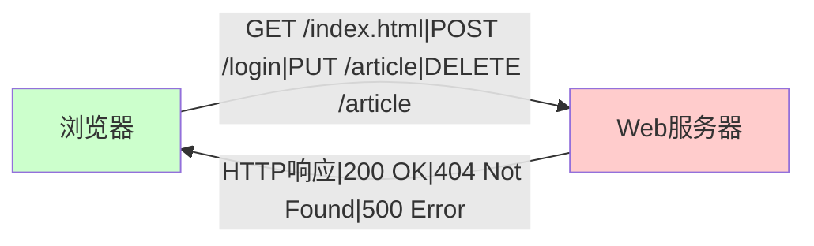
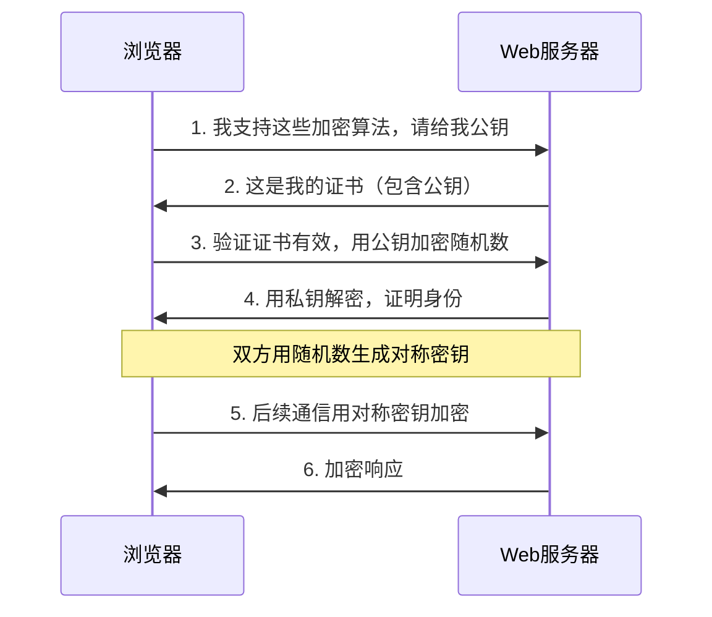
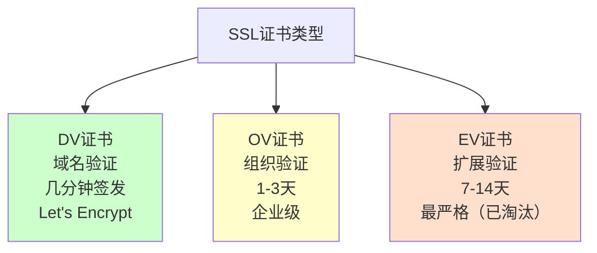
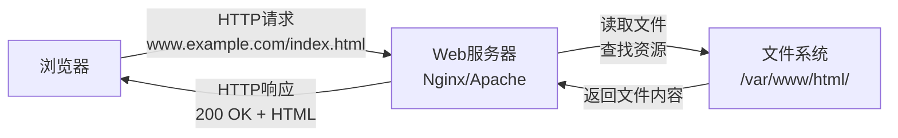
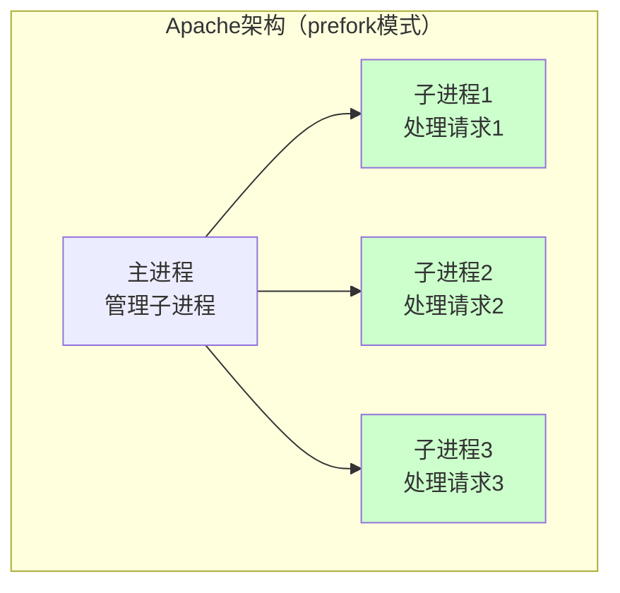
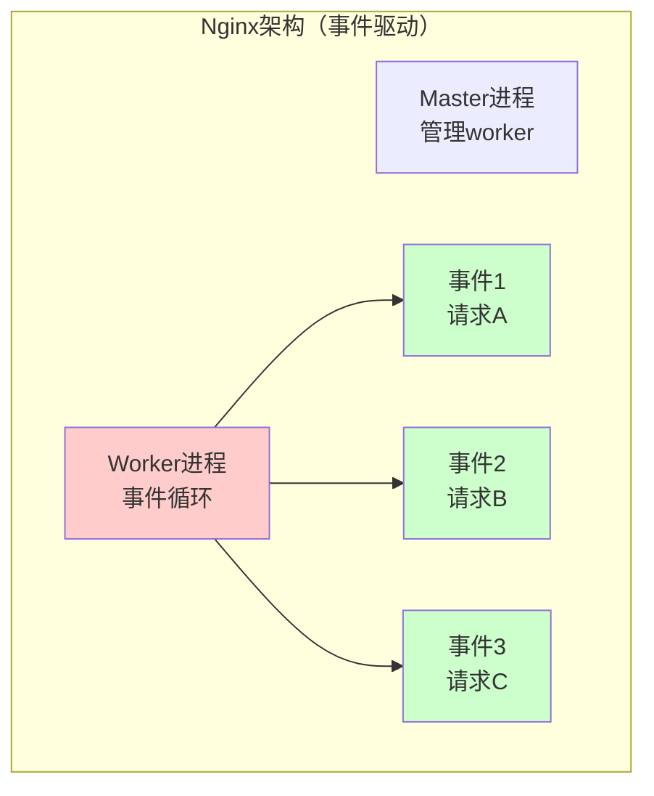

+++
title = "第39章：Web 服务器基础"
weight = 390
date = "2026-03-24T13:18:28+08:00"
type = "docs"
description = ""
isCJKLanguage = true
draft = false
+++


# 第三十九章：Web 服务器基础

你每天都在用Web，但你真的知道Web是怎么工作的吗？

你在浏览器地址栏输入`www.baidu.com`，回车，网页就出现了。这中间发生了什么？HTTP是什么？HTTPS和HTTP有什么区别？Web服务器又是怎么接收请求、返回页面的？

本章就来解答这些"小白"问题。

> 本章配套视频：输入网址到看到网页，浏览器和服务器之间发生了什么？

## 39.1 HTTP 协议

HTTP（HyperText Transfer Protocol，超文本传输协议）是Web的基石。没有HTTP，就没有今天的互联网。

HTTP是一种**请求-响应协议**——客户端（浏览器）发起请求，服务器返回响应。一问一答，有来有回。

### 39.1.1 请求方法：GET、POST、PUT、DELETE

HTTP定义了多种请求方法（也叫"动词"），表示对资源的不同操作：

**GET**：获取资源。你在浏览器输入网址，按回车，就是发起GET请求——"把百度的首页给我"。

```bash
# GET请求示例（模拟浏览器行为）
GET /index.html HTTP/1.1
Host: www.example.com
User-Agent: Mozilla/5.0
Accept: text/html
```

**POST**：提交数据。比如你登录网站，输入用户名密码点"登录"，就是POST请求——"这是我的用户名密码，帮我验证"。

```bash
# POST请求示例
POST /login HTTP/1.1
Host: www.example.com
Content-Type: application/x-www-form-urlencoded
Content-Length: 29

username=admin&password=123456
```

**PUT**：更新资源。比如修改博客文章，提交新版本——"把这篇文章更新成这个版本"。

**DELETE**：删除资源。比如删除一篇博客文章——"帮我把这篇文章删了"。

> 记忆口诀：**GET是拿东西，POST是交东西，PUT是换东西，DELETE是扔东西。**



### 39.1.2 状态码：200、301、302、404、500

服务器返回响应时，会带一个三位数的状态码，表示请求的处理结果。

**2xx 成功类**：

- `200 OK`：最常见，请求成功，服务器返回了数据
- `201 Created`：创建成功，通常用于POST创建资源
- `204 No Content`：成功但没内容，通常用于DELETE请求

**3xx 重定向类**：

- `301 Moved Permanently`：永久重定向，浏览器会缓存，下次直接访问新地址
- `302 Found`：临时重定向，浏览器每次还是会先问老地址
- `304 Not Modified`：缓存命中，浏览器直接用本地缓存

**4xx 客户端错误类**：

- `400 Bad Request`：请求格式有问题，服务器看不懂
- `401 Unauthorized`：未认证，你得先登录
- `403 Forbidden`：禁止访问，你有身份但没权限
- `404 Not Found`：找不到，经典的"页面去火星了"

**5xx 服务器错误类**：

- `500 Internal Server Error`：服务器内部出错，代码bug了
- `502 Bad Gateway`：网关错误，通常是代理/负载均衡后面的服务器挂了
- `503 Service Unavailable`：服务不可用，可能是服务器过载或维护中
- `504 Gateway Timeout`：网关超时，代理等太久没收到响应

> **趣味记忆**：2是"**success**"，3是"re**direct**"，4是"**your** fault"，5是"**my** fault"。记住了吗？没记住？那就再读一遍，毕竟"你的锅"（4xx）和"我的锅"（5xx）还是很好区分的。
> 
> 🎯 **实际应用**：看到4xx错误，检查你的请求（URL、参数、权限）；看到5xx错误，联系服务器管理员或查看服务器日志。

### 39.1.3 请求头、响应头

HTTP头部（Headers）是请求和响应的"元数据"，包含了很多关键信息。

**常见请求头**：

```bash
Host: www.example.com              # 目标主机
User-Agent: Mozilla/5.0            # 浏览器标识
Accept: text/html                  # 客户端能接受的内容类型
Accept-Language: zh-CN,zh;q=0.9    # 能接受的语言
Accept-Encoding: gzip, deflate      # 能接受的压缩格式
Cookie: session_id=abc123           # Cookie信息
Referer: https://www.google.com     # 从哪个页面跳转来的
```

**常见响应头**：

```bash
HTTP/1.1 200 OK
Content-Type: text/html; charset=utf-8
Content-Length: 1234
Server: nginx/1.18.0
Date: Mon, 23 Mar 2026 12:00:00 GMT
Set-Cookie: session_id=xyz789; HttpOnly; Secure
Cache-Control: max-age=3600
ETag: "abc123"
```

- `Content-Type`：告诉浏览器这是什么类型的数据（HTML、图片、JSON等）
- `Content-Length`：响应体的大小
- `Server`：服务器的软件和版本（暴露版本号是安全隐患，建议隐藏）
- `Set-Cookie`：让浏览器设置Cookie
- `Cache-Control`：缓存策略，控制浏览器怎么缓存这个响应
- `ETag`：资源的版本标识，用于缓存校验

## 39.2 HTTPS 协议

HTTPS（HTTP Secure）是HTTP的加密版本，通过SSL/TLS协议对通信内容进行加密。

### 39.2.1 SSL/TLS 加密

SSL（Secure Sockets Layer，安全套接字层）和TLS（Transport Layer Security，传输层安全协议）是加密协议，用于在两个通信程序之间建立加密通道。

HTTPS的工作原理：



加密过程：

1. 浏览器向服务器打招呼，列出支持的加密算法和TLS版本
2. 服务器返回SSL证书（包含公钥和证书信息）
3. 浏览器验证证书是否由可信CA签发，确认服务器身份
4. 浏览器生成一个随机的"预主密钥"（pre-master secret），用服务器公钥加密后发给服务器
5. 服务器用私钥解密，得到预主密钥
6. 双方用这个预主密钥计算出相同的主密钥（master secret），并生成会话密钥
7. 此后所有HTTP通信都用会话密钥进行对称加密传输

> **通俗理解**：想象你要寄一个秘密给远方的朋友。你买了一把锁（公钥），把锁寄给他（证书）。他收到锁后，把秘密（pre-master secret）放进盒子里，用锁锁上寄回来（公钥加密）。只有你有钥匙（私钥），所以只有你能打开这个盒子，看到秘密是什么。然后你们俩就用这个秘密作为暗号来对话。

### 39.2.2 证书类型

SSL证书（也称TLS证书）有不同的验证级别：

**DV证书（Domain Validation）**：只验证域名所有权。最快，几分钟就能签发，免费证书（如Let's Encrypt）都是DV证书。

**OV证书（Organization Validation）**：验证域名所有权 + 申请组织的真实身份。证书里包含组织名称。

**EV证书（Extended Validation）**：最严格的验证，证书里包含详细的组织信息。曾经，浏览器地址栏会显示绿色的公司名称（如Chrome地址栏左侧的绿色公司名）。但从2019年起，Chrome等主流浏览器陆续移除了EV证书的绿色标识，EV证书的实用性大打折扣。



## 39.3 Web 服务器工作原理

Web服务器（如Nginx、Apache）的核心工作流程：



Web服务器处理请求的步骤：

1. **接收连接**：监听TCP 80（HTTP）或443（HTTPS）端口，接收浏览器发来的TCP连接
2. **解析请求**：解析HTTP请求行和请求头，知道浏览器要什么（URL、请求方法等）
3. **查找资源**：根据URL找到服务器上的文件或路由到应用
4. **处理请求**：如果是静态文件，直接读取返回；如果是动态请求（如PHP），转发给后端应用处理
5. **返回响应**：返回HTTP响应（状态码、响应头、响应体）
6. **记录日志**：把请求记录到日志文件

## 39.4 Nginx vs Apache 对比

Linux下最常用的两大Web服务器是Nginx和Apache，各有优劣。

### 39.4.1 架构：事件驱动 vs 进程

这是两者最本质的区别：

**Apache**：传统的"进程/线程"模型。每个请求用一个进程或线程处理。简单直接，但并发高了就撑不住——进程/线程是"重量级"资源，创建和切换都很耗性能。



**Nginx**：事件驱动（Event-Driven）架构。使用单个进程处理大量并发连接，每个连接对应一个"事件"，非阻塞I/O让单个进程能同时处理成千上万个连接。



### 39.4.2 性能：Nginx 更高效

Nginx采用事件驱动的异步架构，单个Worker能处理上万个并发连接，内存和CPU占用远低于Apache。

Apache的prefork模式（进程模型）每个连接耗一个进程/线程；即使是最新的event模式，也不如Nginx高效。

实测对比（相同硬件）：

- Nginx：10000并发连接，CPU占用10-20%
- Apache：10000并发连接，CPU占用可能达到80-90%

### 39.4.3 功能：Apache 更丰富

Apache胜在生态：

- `.htaccess`：目录级配置，不需要重载服务器就能改配置，社区支持极其丰富
- mod_php：Apache内置PHP支持（虽然现在不推荐）
- 更丰富的模块：Rewrite、认证、代理等功能开箱即用
- 更广泛的兼容性：某些老应用在Apache上配置更简单

> **选择建议**：静态内容为主的高并发场景选Nginx，需要复杂目录配置或使用老旧Apache特有功能选Apache。

## 39.5 选择 Web 服务器的考虑因素

选Nginx还是Apache？考虑以下几个因素：

| 考虑因素 | 选Nginx | 选Apache |
|---------|---------|---------|
| 并发量 | 高并发场景（>1000） | 低并发场景 |
| 静态内容 | 静态内容为主 | 混合内容 |
| 动态内容 | PHP（配合php-fpm） | PHP（mod_php）或其他 |
| 配置复杂度 | 配置简洁 | 配置稍复杂但灵活 |
| .htaccess | 不需要 | 需要（WordPress等） |
| 社区生态 | 新兴项目 | 老项目、历史积累 |

> **实战经验**：现代Web架构中，Nginx通常放在最前面做反向代理/负载均衡，Apache/Nginx在后端处理动态请求。前端Nginx做静态资源缓存和SSL卸载，后端Apache处理PHP等动态请求，各尽其才。这就像五星级酒店的管理模式——前台（Nginx）负责接待、引导、安保，后厨（Apache/Nginx）负责做菜。

---

## 本章小结

本章我们学习了Web服务器的基础知识：

- **HTTP协议**：请求-响应协议，请求方法有GET/POST/PUT/DELETE
- **状态码**：2xx成功、3xx重定向、4xx客户端错误、5xx服务器错误
- **请求头/响应头**：HTTP的元数据，包含内容类型、缓存、认证等信息
- **HTTPS**：HTTP+TLS加密，证书有DV/OV/EV三种级别
- **Web服务器工作原理**：接收连接→解析请求→查找资源→返回响应→记录日志
- **Nginx vs Apache**：Nginx事件驱动高效，Apache功能丰富生态好

下一章，我们深入学习Nginx的配置。
