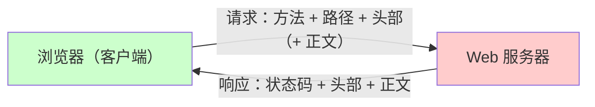
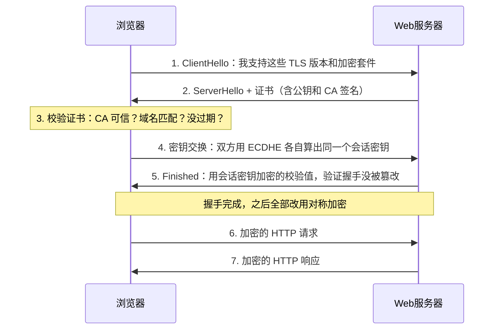
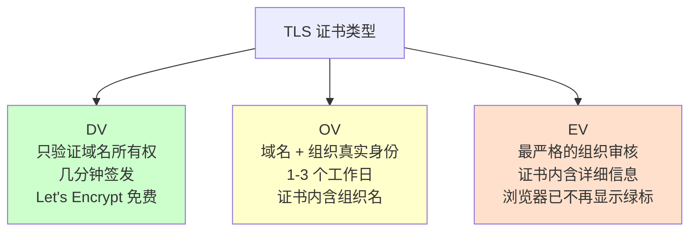
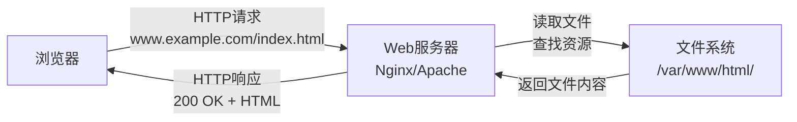
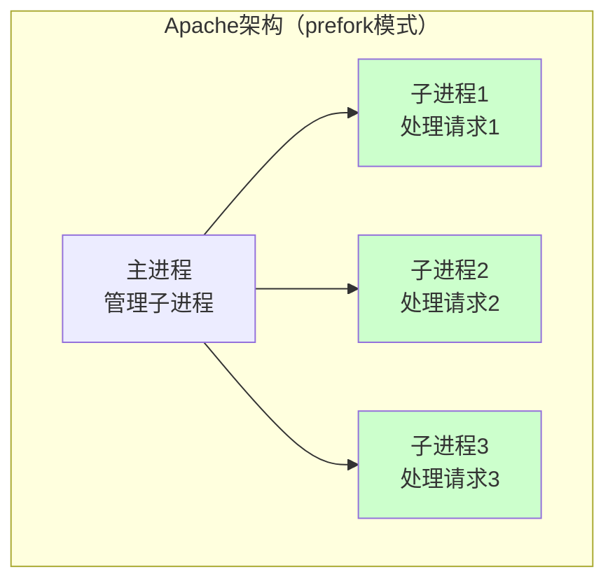
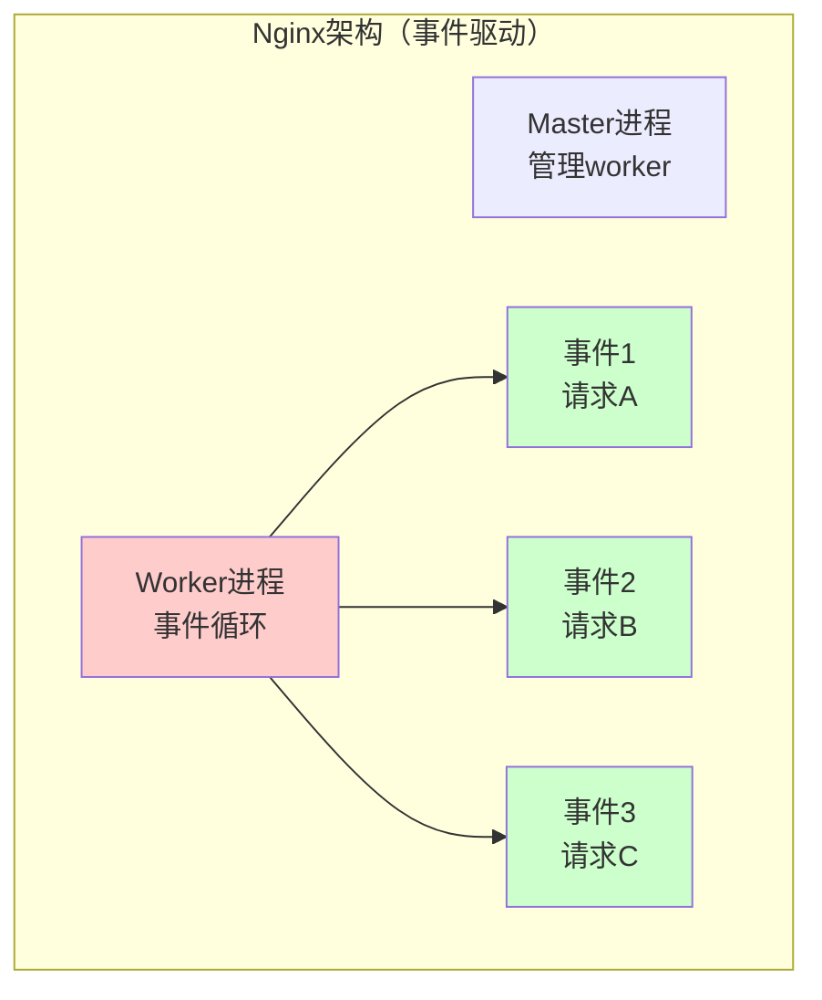

+++
title = "第39章：Web 服务器基础"
weight = 390
date = "2026-03-24T13:18:28+08:00"
type = "docs"
description = ""
isCJKLanguage = true
draft = false
+++


# 第三十九章：Web 服务器基础

你每天都在用Web，但你真的知道Web是怎么工作的吗？

你在浏览器地址栏输入`www.baidu.com`，回车，网页就出现了。这中间发生了什么？HTTP是什么？HTTPS和HTTP有什么区别？Web服务器又是怎么接收请求、返回页面的？

本章就来解答这些"小白"问题。

> 本章配套视频：输入网址到看到网页，浏览器和服务器之间发生了什么？

## 39.1 HTTP 协议

HTTP（HyperText Transfer Protocol，超文本传输协议）是Web的基石。没有HTTP，就没有今天的互联网。

HTTP是一种**请求-响应协议**——客户端（浏览器）发起请求，服务器返回响应。一问一答，有来有回。

### 39.1.1 请求方法：GET、POST、PUT、DELETE

HTTP定义了多种请求方法（也叫"动词"），表示对资源的不同操作：

**GET**：获取资源。你在浏览器输入网址、按回车，就是发起 GET 请求——"把首页给我"。

```http
# 注：下面是为了方便阅读加了注释，真实的 HTTP 报文里没有 # 注释
GET /index.html HTTP/1.1
Host: www.example.com
User-Agent: Mozilla/5.0
Accept: text/html
```

**POST**：提交数据。比如登录时输入用户名密码点"登录"，就是 POST——"这是我的凭据，帮我验证"。

```http
POST /login HTTP/1.1
Host: www.example.com
Content-Type: application/x-www-form-urlencoded
Content-Length: 29

username=admin&password=123456
```

**PUT**：整体替换某个资源。比如把文章完整地覆盖成新版本——"这篇文章以后就是这个样子"。

**PATCH**：局部更新。只改文章的标题，其它字段不动——"只把这一个字段改成这样"。

**DELETE**：删除资源。比如删掉一篇博客文章——"帮我把它删了"。

**HEAD**：只要响应头，不要响应体。常用来探测资源是否存在、大小多少、有没有更新。

> 记忆口诀：**GET 是拿东西，POST 是交东西，PUT 是换东西，PATCH 是补东西，DELETE 是扔东西。**

这里有一个面试常问的点——**幂等性**（同一个请求执行一次和执行多次，结果是否相同）：

| 方法 | 语义 | 幂等 | 有请求体 | 典型用途 |
|------|------|------|---------|---------|
| GET | 读取 | 是 | 无 | 打开页面、拉取数据 |
| HEAD | 读取元数据 | 是 | 无 | 检查资源、探测更新 |
| POST | 创建 / 提交 | **否** | 有 | 登录、下单、表单提交 |
| PUT | 整体替换 | 是 | 有 | 覆盖式保存 |
| PATCH | 局部修改 | 通常否 | 有 | 改单个字段 |
| DELETE | 删除 | 是 | 无 | 删除资源 |

之所以要点出"POST 不幂等"，是因为浏览器刷新一个 POST 结果页时，经常会弹出"是否要重新提交表单"——重复提交就会重复下单、重复扣款。这也是为什么支付类接口都要额外做幂等设计（幂等键、一次性 token）。


```mermaid
graph LR
    A["浏览器（客户端）"] -->|"请求：方法 + 路径 + 头部（+ 正文）"| B["Web 服务器"]
    B -->|"响应：状态码 + 头部 + 正文"| A
    style A fill:#ccffcc
    style B fill:#ffcccc
```

### 39.1.2 状态码：200、301、302、404、500

服务器返回响应时，会带一个三位数的状态码，表示请求的处理结果。

**2xx 成功类**：

- `200 OK`：最常见，请求成功，服务器返回了数据
- `201 Created`：创建成功，通常用于POST创建资源
- `204 No Content`：成功但没内容，通常用于DELETE请求

**3xx 重定向 / 缓存类**：

- `301 Moved Permanently`：永久重定向。浏览器和搜索引擎都会记住，以后直接去新地址。用错了很难撤销，换域名时才用它
- `302 Found`：临时重定向。每次仍会先访问老地址再被转走，做临时跳转用它
- `304 Not Modified`：内容没变，用你本地的缓存就行。注意它**不是**"缓存命中"这么简单——客户端要先带着 `If-None-Match` / `If-Modified-Since` 发条件请求，服务器比对后才知道"不用重传"
- `307 Temporary Redirect` / `308 Permanent Redirect`：和 302 / 301 含义对应，但**明确要求客户端保持原来的请求方法**——用 302 时部分客户端会把 POST 变成 GET，307/308 则不会

**4xx 客户端错误类**：

- `400 Bad Request`：请求格式有问题，服务器看不懂
- `401 Unauthorized`：**没通过认证**（其实名字起错了，语义是 unauthenticated）。通常响应里会带 `WWW-Authenticate`，提示你该怎么登录
- `403 Forbidden`：**认证过了，但没权限**。有身份 ≠ 有资格
- `404 Not Found`：找不到，经典的"页面去火星了"
- `405 Method Not Allowed`：路径存在，但不支持你这个方法（比如对只读接口发 POST）
- `429 Too Many Requests`：请求太频繁，被限流了。响应头里通常有 `Retry-After` 告诉你要等多久

**5xx 服务器错误类**：

- `500 Internal Server Error`：服务器内部出错，多半是应用代码抛异常了
- `502 Bad Gateway`：网关错误。反向代理（Nginx）把请求转给后端，后端返回了无法识别的响应或直接挂了
- `503 Service Unavailable`：服务不可用。可能过载、在维护，也可能后端还在启动中
- `504 Gateway Timeout`：网关超时。代理等后端太久还没等到响应

> 排查时先分清一件事：**4xx 基本要改客户端 / 请求本身，5xx 要去翻服务端日志**。而 502 和 504 的区别很有用——502 是"后端给的答复不对/连不上"，504 是"后端太慢了"，两者的排查方向完全不同。

> **趣味记忆**：2是"**success**"，3是"re**direct**"，4是"**your** fault"，5是"**my** fault"。记住了吗？没记住？那就再读一遍，毕竟"你的锅"（4xx）和"我的锅"（5xx）还是很好区分的。
> 
> 🎯 **实际应用**：看到4xx错误，检查你的请求（URL、参数、权限）；看到5xx错误，联系服务器管理员或查看服务器日志。

### 39.1.3 请求头、响应头

HTTP头部（Headers）是请求和响应的"元数据"，包含了很多关键信息。

**常见请求头**（下面是一个完整的请求报文，注意报文里不能写 `#` 注释，解释放在后面）：

```http
GET /index.html HTTP/1.1
Host: www.example.com
User-Agent: Mozilla/5.0 (Windows NT 10.0; Win64; x64)
Accept: text/html
Accept-Language: zh-CN,zh;q=0.9
Accept-Encoding: gzip, deflate
Cookie: session_id=abc123
Referer: https://www.google.com
```

- `Host`：目标主机名。**HTTP/1.1 要求必须有**，因为同一个 IP 上可能挂着多个站点（虚拟主机）
- `User-Agent`：客户端标识。有些网站靠它区分浏览器还是爬虫
- `Accept` / `Accept-Language` / `Accept-Encoding`：告诉服务器"我能接受什么类型、什么语言、什么压缩格式"，服务器据此做内容协商
- `Cookie`：浏览器自动带上的身份凭证。会话保持基本都靠它
- `Referer`：从哪个页面跳过来的（拼写确实是少了一个 r，历史遗留）。常被用作防盗链

**常见响应头**：

```http
HTTP/1.1 200 OK
Content-Type: text/html; charset=utf-8
Content-Length: 1234
Server: nginx/1.18.0
Date: Mon, 23 Mar 2026 12:00:00 GMT
Set-Cookie: session_id=xyz789; HttpOnly; Secure
Cache-Control: max-age=3600
ETag: "abc123"
```

- `Content-Type`：告诉浏览器这是什么类型的数据（HTML、图片、JSON等）
- `Content-Length`：响应体的大小
- `Server`：服务器的软件和版本（暴露版本号是安全隐患，建议隐藏）
- `Set-Cookie`：让浏览器设置Cookie
- `Cache-Control`：缓存策略，控制浏览器怎么缓存这个响应
- `ETag`：资源的版本标识，用于缓存校验

> 顺带一句安全常识：`Server: nginx/1.18.0` 这种把版本号明明白白写出来的响应头，等于告诉扫描器"去找这个版本的已知漏洞"。生产环境一般会在配置里关掉版本号（Nginx 的 `server_tokens off;`）。

一个完整的 HTTPS 交互还涉及几个容易混淆的概念：**HTTP 版本**（1.1 / 2 / 3）、**端口**（HTTP 默认 80，HTTPS 默认 443）、**连接复用**（HTTP/1.1 默认 Keep-Alive，一次 TCP 连接可以跑多个请求，省掉反复握手的开销）。

## 39.2 HTTPS 协议

HTTPS（HTTP Secure）是 HTTP 的加密版本，通过 TLS 协议对通信内容加密，解决三个问题：**机密性**（别人看不到内容）、**完整性**（内容没被中途篡改）、**身份认证**（确认对面真的是那个网站，而不是假冒的）。

> 名字上的历史包袱：这套协议最早叫 SSL（Secure Sockets Layer），后来标准化时改名为 TLS（Transport Layer Security）。SSL 2.0 / 3.0 早已被证实不安全并被废弃，现在实际用的是 **TLS 1.2 和 TLS 1.3**。所以"SSL 证书""SSL 加密"只是口语习惯，严格说都该叫 TLS。

### 39.2.1 TLS 加密握手


```mermaid
sequenceDiagram
    participant B as 浏览器
    participant S as Web服务器

    B->>S: 1. ClientHello：我支持这些 TLS 版本和加密套件
    S->>B: 2. ServerHello + 证书（含公钥和 CA 签名）
    Note over B: 3. 校验证书：CA 可信？域名匹配？没过期？
    B->>S: 4. 密钥交换：双方用 ECDHE 各自算出同一个会话密钥
    S->>B: 5. Finished：用会话密钥加密的校验值，验证握手没被篡改
    Note over B,S: 握手完成，之后全部改用对称加密
    B->>S: 6. 加密的 HTTP 请求
    S->>B: 7. 加密的 HTTP 响应
```

整个过程分两段，理解这两段就够用了：

1. **握手阶段（非对称加密）**：解决"怎么在不安全信道上安全地协商出一把共同的钥匙"。浏览器发 ClientHello 列出自己支持的 TLS 版本和加密套件；服务器回应 ServerHello、把证书发给客户端；客户端验证证书是否由可信 CA 签发、域名是否对得上、有没有过期；然后双方通过密钥交换算法各自算出同一个"会话密钥"。全程用非对称加密和签名保证中间人无法冒充。
2. **传输阶段（对称加密）**：拿到会话密钥后，后续所有 HTTP 数据都用它做对称加密——**对称加密快得多**，这才是 HTTPS 性能可接受的关键。非对称加密只在握手时用一次。

> 关于"用服务器公钥加密随机数"这个说法：这是 TLS 1.2 里 RSA 密钥交换的做法，**现在已经被淘汰**。TLS 1.3 和启用了前向保密（PFS，Perfect Forward Secrecy）的 TLS 1.2 用的是临时密钥交换（ECDHE）——服务器证书里的公钥只用来**验证签名**，不再用它加密数据。好处是：即使某天服务器私钥泄露，攻击者也无法解密之前录下来的历史流量。这也是为什么现在都要求开启 TLS 1.3 / ECDHE。

> **通俗理解**：可以这样想——你和一个陌生人在广场上要约定暗号。你会先检查对方的证件（证书验证），确认身份后，两人各自拿出一组只有自己知道的临时数字，当众交换其中一部分，最后各自都能算出同一个结果，而旁观的窃听者算不出来（ECDHE 密钥交换）。从此你们说悄悄话就用这个结果当暗号（对称加密）。证件的作用是"证明你是谁"，而不是"用来传递暗号"。

### 39.2.2 证书类型

SSL证书（也称TLS证书）有不同的验证级别：

**DV证书（Domain Validation）**：只验证域名所有权。最快，几分钟就能签发，免费证书（如Let's Encrypt）都是DV证书。

**OV证书（Organization Validation）**：验证域名所有权 + 申请组织的真实身份。证书里包含组织名称。

**EV证书（Extended Validation）**：最严格的验证，证书里包含详细的组织信息。曾经，浏览器地址栏会显示绿色的公司名称（如Chrome地址栏左侧的绿色公司名）。但从2019年起，Chrome等主流浏览器陆续移除了EV证书的绿色标识，EV证书的实用性大打折扣。


```mermaid
graph TB
    A["TLS 证书类型"] --> B["DV<br/>只验证域名所有权<br/>几分钟签发<br/>Let's Encrypt 免费"]
    A --> C["OV<br/>域名 + 组织真实身份<br/>1-3 个工作日<br/>证书内含组织名"]
    A --> D["EV<br/>最严格的组织审核<br/>证书内含详细信息<br/>浏览器已不再显示绿标"]
    style B fill:#ccffcc
    style C fill:#ffffcc
    style D fill:#ffe0cc
```

> 需要纠正一个常见说法：EV 证书**并没有"被淘汰"**，只是浏览器从 2019 年前后陆续取消了地址栏的绿色公司名展示，用户肉眼看不出差别，所以大多数人没必要多花钱买它。金融、政务等有合规要求、或需要向对方出示"经过深度审核的组织身份"的场景，仍然会用 EV。

> 另外，按**覆盖的域名数量**还分单域名、通配符（`*.example.com`）、多域名（SAN）证书，这和上面的 DV/OV/EV 是两个不同维度，选购时都要确认。

## 39.3 Web 服务器工作原理

Web服务器（如Nginx、Apache）的核心工作流程：


```mermaid
graph LR
    A["浏览器"] -->|"HTTP请求<br/>www.example.com/index.html"| B["Web服务器<br/>Nginx/Apache"]
    B -->|"读取文件<br/>查找资源"| C["文件系统<br/>/var/www/html/"]
    C -->|"返回文件内容"| B
    B -->|"HTTP响应<br/>200 OK + HTML"| A
```

Web服务器处理请求的步骤：

1. **接收连接**：监听TCP 80（HTTP）或443（HTTPS）端口，接收浏览器发来的TCP连接
2. **解析请求**：解析HTTP请求行和请求头，知道浏览器要什么（URL、请求方法等）
3. **查找资源**：根据URL找到服务器上的文件或路由到应用
4. **处理请求**：如果是静态文件，直接读取返回；如果是动态请求（如PHP），转发给后端应用处理
5. **返回响应**：返回HTTP响应（状态码、响应头、响应体）
6. **记录日志**：把请求记录到日志文件

## 39.4 Nginx vs Apache 对比

Linux下最常用的两大Web服务器是Nginx和Apache，各有优劣。

### 39.4.1 架构：事件驱动 vs 进程

这是两者最本质的区别：

**Apache**：传统的"进程 / 线程"模型，每个连接交给一个进程或线程处理。简单直接，但连接一多，进程 / 线程的创建和切换开销就上来了——它们是"重量级"资源，每个都要占内存。

Apache 为此提供了三种工作模式（MPM，Multi-Processing Module），切换方式不同、特征差别很大：

| MPM | 模型 | 特点 |
|-----|------|------|
| prefork | 一个请求一个进程 | 最稳、兼容性最好（老的非线程安全模块只能用它），内存占用最高 |
| worker | 一个请求一个线程 | 比 prefork 省内存，但依赖线程安全 |
| event | 线程 + 事件驱动 | 解决了 Keep-Alive 空连接占用线程的问题，**是现代 Apache 的默认选择** |

所以"Apache 慢"这个印象，更多来自十几年前的 prefork + mod_php 组合；现在的 event MPM 配合 php-fpm，差距已经小了很多。


```mermaid
graph TB
    subgraph "Apache架构（prefork模式）"
        A["主进程<br/>管理子进程"]
        B1["子进程1<br/>处理请求1"]
        B2["子进程2<br/>处理请求2"]
        B3["子进程3<br/>处理请求3"]
        A --> B1
        A --> B2
        A --> B3
    end
    style B1 fill:#ccffcc
    style B2 fill:#ccffcc
    style B3 fill:#ccffcc
```

**Nginx**：事件驱动（Event-Driven）架构。它有一个 Master 进程（只负责管理、不处理请求）和若干个 Worker 进程（通常是 CPU 核数，每个都绑定到一个核）。**每个 Worker 内部是一个事件循环**，用非阻塞 I/O 同时照看成千上万个连接——连接在等磁盘、等后端时不会占住 Worker，Worker 转头去服务别的连接。所以少数几个 Worker 就能扛住很高的并发，且内存占用是可控的（每个连接只占一小块内存）。


```mermaid
graph TB
    subgraph "Nginx架构（事件驱动）"
        M["Master进程<br/>管理worker"]
        W["Worker进程<br/>事件循环"]
        E1["事件1<br/>请求A"]
        E2["事件2<br/>请求B"]
        E3["事件3<br/>请求C"]
        W --> E1
        W --> E2
        W --> E3
    end
    style W fill:#ffcccc
    style E1 fill:#ccffcc
    style E2 fill:#ccffcc
    style E3 fill:#ccffcc
```

### 39.4.2 性能：静态与高并发场景 Nginx 更省资源

上面的架构差异落到实际表现上，主要差在这几个地方：

- **内存**：Nginx 每个连接的开销是固定的小块内存；prefork 的 Apache 每个连接一个进程，几 MB 起步，几千连接就能把内存吃光
- **静态文件**：Nginx 用 `sendfile` / 异步 I/O 直接把文件推给网卡，路径短、开销小
- **慢客户端**：客户端网速慢时，Nginx 用异步处理不占 Worker；同步模型里这个连接会一直占着一个进程或线程（所谓"慢连接攻击"打的就是这一点）
- **CPU 切换**：连接越多，进程 / 线程模型的上下文切换成本越高

> 关于"实测数据"：网上流传的"Nginx 1 万并发 CPU 只占 10%"这类数字，绝大多数没有说明硬件、配置、请求类型（静态还是动态、响应多大）——它们只能代表**量级差异**，不能当结论用。真正要选型，应该用 `wrk`、`ab`、`hey` 这类工具在你自己的实际场景下压测。
>
> 而且有一点常被忽略：**并发能力往往不取决于 Web 服务器本身，而取决于后端**。如果请求最终要查数据库或跑 PHP，那 Nginx 再能扛并发，瓶颈也在后端。

### 39.4.3 功能：Apache 更丰富

Apache 胜在生态：

- `.htaccess`：目录级配置。上传一个文件就能改这一级目录的规则，**不需要重启服务器**——这是大批共享主机和老牌 CMS（WordPress、Drupal 等）依赖它的原因
- `mod_php`：把 PHP 直接编译进 Apache，省去额外进程。但 PHP 老版本并非线程安全，只能配 prefork，内存开销大；现在主流做法是 `php-fpm` + Nginx/Apache，两种服务器上都一样
- 模块生态：`mod_rewrite`、认证、代理、限流等历史模块非常丰富，文档和社区答案也最多
- 兼容性：一些只在 Apache 文档里描述过部署方式的老应用，照抄文档就能跑起来

> 顺带一提 `.htaccess` 的代价：Apache 在每次请求中都要逐级目录去查找并解析 `.htaccess`，站点越大、目录越深，这个开销越明显。Nginx 干脆**不支持** `.htaccess`（配置必须写进主配置里），这也是它更快的原因之一，但代价是很多 PHP 应用需要额外把规则翻译过来。

> **选择建议**：静态内容为主的高并发场景选Nginx，需要复杂目录配置或使用老旧Apache特有功能选Apache。

## 39.5 选择 Web 服务器的考虑因素

选Nginx还是Apache？考虑以下几个因素：

| 考虑因素 | 选 Nginx | 选 Apache |
|---------|---------|---------|
| 并发量 | 高并发、连接数多 | 并发不高的常规站点 |
| 静态内容 | 静态资源为主（图片、视频、前端打包产物） | 混合内容 |
| 动态内容 | 配合 php-fpm / 反向代理到后端 | mod_php，或同样配合 php-fpm |
| 配置风格 | 主配置集中管理，改完 reload | 可用 `.htaccess` 做目录级覆盖 |
| .htaccess | 不支持 | 支持（老牌 PHP 应用常依赖） |
| 上手难度 | 配置语法简洁，但概念要理解 | 文档多、示例多，照抄容易跑起来 |
| 典型场景 | 反向代理、负载均衡、静态服务 | 老项目迁移、需要大量现成模块 |

> **实战经验**：现代Web架构中，Nginx通常放在最前面做反向代理/负载均衡，Apache/Nginx在后端处理动态请求。前端Nginx做静态资源缓存和SSL卸载，后端Apache处理PHP等动态请求，各尽其才。这就像五星级酒店的管理模式——前台（Nginx）负责接待、引导、安保，后厨（Apache/Nginx）负责做菜。

---

## 本章小结

本章是后面所有 Nginx / Apache 配置章节的地基，要点如下：

- **HTTP 是请求-响应协议**：客户端发请求，服务器回响应，一问一答
- **请求方法有语义**：GET 读、POST 创建（**不幂等**，重复提交要小心）、PUT 整体替换、PATCH 局部改、DELETE 删、HEAD 只要头
- **状态码分五类**：1xx 信息、2xx 成功、3xx 重定向 / 缓存、4xx 客户端问题、5xx 服务端问题。302 与 307 的区别在于后者保证不改请求方法
- **头部是元数据**：`Host` 决定访问哪个站点，`Cookie` 维持会话，`Cache-Control` / `ETag` 决定缓存行为。暴露 `Server` 版本号是常见的信息泄露
- **HTTPS = HTTP + TLS**：TLS 提供机密性、完整性、身份认证；握手用非对称加密协商出一把会话密钥，之后的数据用对称加密传。现代 TLS 1.3 / ECDHE 不再用服务器公钥直接加密数据
- **证书分级**：DV / OV / EV 是验证深度，单域名 / 通配符 / 多域名是覆盖范围，两个维度要分开看
- **Web 服务器工作流程**：接收连接 → 解析请求 → 查找资源（静态直接返回、动态交给后端）→ 生成响应 → 记录日志
- **Nginx vs Apache**：Nginx 是事件驱动，几个 Worker 扛高并发，省内存，擅长静态和反向代理；Apache 是进程 / 线程模型（现在默认 event MPM），胜在 `.htaccess` 和模块生态

下一章，我们深入学习Nginx的配置。
