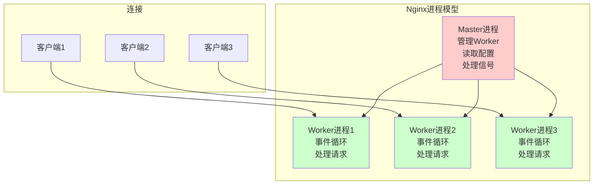

+++
title = "第40章：Nginx 深入详解"
weight = 400
date = "2026-03-24T13:18:28+08:00"
type = "docs"
description = ""
isCJKLanguage = true
draft = false
+++


# 第四十章：Nginx 深入详解

Nginx（发音"Engine X"，不是"恩ginx"或"恩记克斯"）是世界上最流行的Web服务器之一。它以高性能、高并发、低资源消耗著称，全球约35%的网站使用Nginx。可以说，Nginx就是Web服务器界的特斯拉——速度快、性能强、身材苗条（内存占用极低）。

本章，我们从Nginx的架构开始，深入到每个配置细节。

> 本章配套视频：Nginx配置一通百通，核心语法就那么几个。

## 40.1 Nginx 架构：多进程、异步非阻塞

理解Nginx的架构，是掌握它的前提。

### 40.1.1 Master 进程

Nginx启动后，首先创建Master进程（主进程）。Master进程不处理具体请求，它负责：

- 读取和验证配置文件
- 管理Worker进程（启动、停止、重启）
- 接收管理员信号（如`nginx -s reload`）
- 重新加载配置、平滑升级Nginx

```bash
# 查看Nginx的进程
ps aux | grep nginx
```

```bash
root     12345  0.0  0.2  12345  6789   ?   Ss   10:00   0:00 nginx: master process /usr/sbin/nginx -c /etc/nginx/nginx.conf
root     12346  0.0  0.1  12345  5678   ?   S    10:00   0:00   nginx: worker process
root     12347  0.0  0.1  12345  5679   ?   S    10:00   0:00   nginx: worker process
root     12348  0.0  0.1  12345  5680   ?   S    10:00   0:00   nginx: worker process
```

可以看到：Master进程PID 12345，Worker进程12346/12347/12348。

### 40.1.2 Worker 进程

Worker进程是真正处理请求的进程。Master进程fork出Worker进程后，自己退居幕后。

Worker进程的工作：

- 处理客户端请求
- 与上游服务器（后端）通信（反向代理时）
- 读写磁盘（静态文件）
- 缓存（如果有）

Worker进程的数量默认等于CPU核心数，可以手动配置。

### 40.1.3 连接处理

Nginx使用事件驱动模型处理连接。每个Worker维护一个事件循环（Event Loop），用epoll（Linux）等高效I/O多路复用机制，同时监控成千上万的连接。



Nginx的Worker进程是"各自为战"的，每个Worker独立接收连接、独立处理、独立返回。这就是为什么Nginx能高效处理高并发——没有锁竞争，没有进程间通信开销。

## 40.2 Nginx 安装

### 40.2.1 apt install nginx

Ubuntu/Debian上安装Nginx：

```bash
# 安装
sudo apt update
sudo apt install nginx

# 查看版本
nginx -v
```

```bash
nginx version: nginx/1.18.0 (Ubuntu)
```

```bash
# 启动Nginx
sudo systemctl start nginx

# 设置开机自启
sudo systemctl enable nginx

# 查看状态
sudo systemctl status nginx
```

```bash
nginx.service - A high performance web server and a reverse proxy server
   Loaded: loaded (/lib/systemd/system/nginx.service; enabled; vendor preset: enabled)
   Active: active (running) since Mon 2026-03-23 10:00:00 CST; 1min 30s ago
```

安装完成后，打开浏览器访问服务器IP，应该能看到Nginx的欢迎页面。

### 40.2.2 编译安装

生产环境有时需要定制编译Nginx：

```bash
# 安装编译依赖
sudo apt install build-essential libpcre3 libpcre3-dev zlib1g zlib1g-dev libssl-dev

# 下载Nginx源码
cd /tmp
wget http://nginx.org/download/nginx-1.24.0.tar.gz
tar -xzf nginx-1.24.0.tar.gz
cd nginx-1.24.0

# 配置编译参数
./configure --prefix=/usr/local/nginx \
    --with-http_ssl_module \
    --with-http_v2_module \
    --with-http_realip_module \
    --with-http_gzip_static_module \
    --with-http_stub_status_module

# 编译并安装
make
sudo make install

# 创建软链接
sudo ln -s /usr/local/nginx/sbin/nginx /usr/bin/nginx

# 验证安装
nginx -v
```

## 40.3 Nginx 目录结构

### 40.3.1 /etc/nginx/：配置

Nginx的配置目录：

```bash
ls -la /etc/nginx/
```

```bash
.
drwxr-xr-x  1 root root 4096 Mar 23 10:00 ./
drwxr-xr-x  1 root root 4096 Mar 23 10:00 ../
drwxr-xr-x  1 root root 4096 Mar 23 10:00 conf.d/
drwxr-xr-x  1 root root 4096 Mar 23 10:00 modules-enabled/
drwxr-xr-x  2 root root 4096 Mar 23 10:00 sites-available/
drwxr-xr-x  2 root root 4096 Mar 23 10:00 sites-enabled/
drwxr-xr-x  1 root root 4096 Mar 23 10:00 snippets/
-rw-r--r--  1 root root 4096 Mar 23 10:00 nginx.conf
```

关键文件：

- `nginx.conf`：主配置文件
- `conf.d/`：自定义配置目录（会被主配置include）
- `sites-available/`：可用的站点配置
- `sites-enabled/`：已启用的站点配置（通常是符号链接）
- `snippets/`：配置片段

### 40.3.2 /var/log/nginx/：日志

```bash
ls -la /var/log/nginx/
```

```bash
access.log    # 访问日志，记录所有请求
error.log     # 错误日志，记录错误和警告
```

### 40.3.3 /usr/share/nginx/html/：默认页面

```bash
ls -la /usr/share/nginx/html/
```

```bash
index.html    # 默认欢迎页面
50x.html      # 默认错误页面
```

## 40.4 nginx.conf 主配置文件结构

Nginx配置文件采用块结构，由指令和块组成。

### 40.4.1 user、worker_processes

```bash
# 查看nginx.conf
cat /etc/nginx/nginx.conf
```

```bash
user www-data;                        # Worker进程运行用户
worker_processes auto;                # Worker进程数量，auto=自动检测CPU核心数
worker_cpu_affinity auto;             # Worker进程CPU绑定（可选）
worker_rlimit_nofile 65535;           # Worker最大打开文件数

error_log /var/log/nginx/error.log warn;
pid /run/nginx.pid;
```

- `user www-data`：Worker进程以www-data用户运行，保证安全
- `worker_processes auto`：自动使用所有CPU核心，通常不需要改
- `worker_rlimit_nofile`：最大打开文件描述符数量，高并发时调大

### 40.4.2 events 块

events块配置事件驱动模型：

```bash
events {
    worker_connections 1024;      # 每个Worker最大并发连接数
    use epoll;                    # 使用epoll事件模型（Linux）
    multi_accept on;              # 一次接受多个新连接
}
```

- `worker_connections`：单个Worker能处理的最大并发连接数。总并发 = worker_processes × worker_connections。
- `use epoll`：Linux下使用epoll，性能最高。

### 40.4.3 http 块

http块是Web服务器配置的核心，包含所有HTTP相关配置：

```bash
http {
    # 基础配置
    include /etc/nginx/mime.types;
    default_type application/octet-stream;

    # 日志格式
    log_format main '$remote_addr - $remote_user [$time_local] "$request" '
                    '$status $body_bytes_sent "$http_referer" '
                    '"$http_user_agent" "$http_x_forwarded_for"';

    access_log /var/log/nginx/access.log main;

    # 性能优化
    sendfile on;
    tcp_nopush on;
    tcp_nodelay on;
    keepalive_timeout 65;
    types_hash_max_size 2048;

    # Gzip压缩
    gzip on;
    gzip_vary on;
    gzip_proxied any;
    gzip_comp_level 6;
    gzip_types text/plain text/css application/json application/javascript text/xml application/xml;

    # 引入其他配置
    include /etc/nginx/conf.d/*.conf;
    include /etc/nginx/sites-enabled/*;
}
```

### 40.4.4 include 指令

include指令用于将其他配置文件引入主配置：

```bash
include /etc/nginx/sites-enabled/*;    # 引入所有启用的站点配置
include /etc/nginx/conf.d/*.conf;      # 引入conf.d下的所有.conf文件
```

include是模块化配置的关键——每个网站一个配置文件，互不干扰。

## 40.5 server 块配置：虚拟主机

server块定义一个虚拟主机（Virtual Host），类似Apache的`<VirtualHost>`。

```bash
# /etc/nginx/sites-available/example.com
server {
    listen 80;                      # 监听80端口
    server_name example.com;        # 域名

    root /var/www/example.com;      # 网站根目录
    index index.html index.htm;     # 默认首页

    # 访问日志
    access_log /var/log/nginx/example.com.access.log;
    error_log /var/log/nginx/example.com.error.log;

    # 默认location
    location / {
        try_files $uri $uri/ =404;
    }
}
```

> **启用站点**：在`/etc/nginx/sites-available/`创建配置，然后在`/etc/nginx/sites-enabled/`创建符号链接指向它，最后`nginx -s reload`。

```bash
# 创建符号链接启用站点
sudo ln -s /etc/nginx/sites-available/example.com /etc/nginx/sites-enabled/

# 测试配置语法
sudo nginx -t

# 重新加载配置
sudo systemctl reload nginx
```

## 40.6 location 块：URL 匹配规则

location块定义URL匹配规则和对应的处理方式。匹配优先级是Nginx配置中最容易出错的地方。

### 40.6.1 精确匹配：=

精确匹配URL，优先级最高。

```bash
# 只有访问 http://example.com/ 时才匹配
location = / {
    root /var/www/home;
    index index.html;
}
```

### 40.6.2 前缀匹配：^~

前缀匹配，找到后不再检查正则匹配。

```bash
# 以 /static/ 开头的URL匹配
location ^~ /static/ {
    root /var/www;
    autoindex on;
}
```

### 40.6.3 正则匹配：~

正则匹配，区分大小写。

```bash
# 匹配 .php 结尾的URL
location ~ \.php$ {
    fastcgi_pass unix:/run/php/php-fpm.sock;
    fastcgi_param SCRIPT_FILENAME $document_root$fastcgi_script_name;
    include fastcgi_params;
}
```

### 40.6.4 普通前缀匹配

没有任何前缀修饰符的前缀匹配，按长度从长到短排序。

```bash
# /images/logo.png 会匹配这个
location /images/ {
    root /var/www/static;
}

# /images 会匹配这个
location / {
    root /var/www/default;
}
```

**匹配优先级（从高到低）**：

1. `location = /`：精确匹配
2. `location ^~ /images/`：前缀匹配（^~）
3. `location ~ \.php$`：正则匹配（~）
4. `location /images/`：普通前缀匹配（最长匹配）

```mermaid
graph TB
    A["访问 URL: /static/logo.png"] --> B{"匹配规则"}
    B -->|"1. = /"| C["不匹配"]
    B -->|"2. ^~ /static/| D["匹配!<br/>停止匹配"]
    B -->|"3. ~ \\.php$"| E["不匹配"]
    B -->|"4. /"| F["匹配"]
    style D fill:#ccffcc
```

## 40.7 根目录与索引文件

### 40.7.1 root：文档根目录

`root`指令设置网站的文档根目录（Document Root）：

```bash
server {
    listen 80;
    server_name example.com;

    # 访问 http://example.com/index.html 时
    # Nginx会在 /var/www/example.com/index.html 查找文件
    root /var/www/example.com;

    location / {
        try_files $uri $uri/ =404;
    }
}
```

### 40.7.2 index：默认首页

`index`指令指定默认首页文件：

```bash
server {
    root /var/www/example.com;

    # 当访问 http://example.com/ 时
    # Nginx依次查找 index.html, index.htm, index.php
    index index.html index.htm index.php;
}
```

## 40.8 错误页面配置

### 40.8.1 error_page 404

自定义404错误页面：

```bash
server {
    root /var/www/example.com;

    # 当返回404时，显示这个页面
    error_page 404 /404.html;

    location = /404.html {
        internal;  # 只能内部访问，不能直接URL访问
        root /var/www/example.com;
    }
}
```

### 40.8.2 error_page 500 502

自定义500系列错误页面：

```bash
server {
    root /var/www/example.com;

    error_page 500 502 503 504 /50x.html;

    location = /50x.html {
        internal;
        root /var/www/example.com;
    }
}
```

## 40.9 access_log 与 error_log

### 40.9.1 access_log：访问日志

```bash
# 在server块中指定
server {
    access_log /var/log/nginx/example.com.access.log;
}
```

### 40.9.2 error_log：错误日志

```bash
# 在server块或http块中指定
error_log /var/log/nginx/example.com.error.log warn;
```

错误日志级别（从低到高）：debug、info、notice、warn、error、crit、alert、emerg。

### 40.9.3 log_format：日志格式

自定义日志格式：

```bash
http {
    # 定义JSON格式日志
    log_format json_log escape=json
        '{'
        '"time":"$time_local",'
        '"remote_addr":"$remote_addr",'
        '"host":"$host",'
        '"request":"$request",'
        '"status":"$status",'
        '"body_bytes_sent":"$body_bytes_sent",'
        '"request_time":"$request_time",'
        '"http_referer":"$http_referer",'
        '"http_user_agent":"$http_user_agent"'
        '}';

    server {
        access_log /var/log/nginx/example.com.access.log json_log;
    }
}
```

## 40.10 静态网站托管

最简单的一个静态网站配置：

```bash
server {
    listen 80;
    server_name static.example.com;

    root /var/www/static;
    index index.html;

    # 开启目录浏览
    location / {
        autoindex on;              # 显示目录列表
        autoindex_exact_size off;  # 文件大小显示为KB/MB而不是精确字节
        autoindex_localtime on;    # 显示本地时间
    }

    # 静态资源缓存
    location ~* \.(css|js|png|jpg|jpeg|gif|ico|svg|woff|woff2)$ {
        expires 30d;               # 缓存30天
        add_header Cache-Control "public, no-transform";
    }

    # 先放行 .well-known 目录（Let's Encrypt 自动续期需要访问这个目录）
    location ~ /\.well-known {
        allow all;
    }

    # 禁止访问其他隐藏文件
    location ~ /\. {
        deny all;
        access_log off;
        log_not_found off;
    }
}
```

## 40.11 反向代理配置

Nginx最强大的功能之一是反向代理——把请求转发给后端应用服务器。

### 40.11.1 proxy_pass

把请求转发给后端应用：

```bash
server {
    listen 80;
    server_name api.example.com;

    # 所有请求转发到后端
    location / {
        proxy_pass http://127.0.0.1:3000;
    }
}
```

### 40.11.2 proxy_set_header

转发请求时，传递原始请求信息给后端：

```bash
location / {
    proxy_pass http://127.0.0.1:3000;

    # 传递真实IP给后端
    proxy_set_header Host $host;
    proxy_set_header X-Real-IP $remote_addr;
    proxy_set_header X-Forwarded-For $proxy_add_x_forwarded_for;
    proxy_set_header X-Forwarded-Proto $scheme;

    # 超时设置
    proxy_connect_timeout 60s;
    proxy_send_timeout 60s;
    proxy_read_timeout 60s;
}
```

### 40.11.3 proxy_redirect

修改后端返回的HTTP重定向地址：

```bash
location / {
    proxy_pass http://127.0.0.1:3000;
    proxy_redirect default;       # 用后端返回的Location头，会自动替换为nginx地址
    # proxy_redirect off;          # 关闭重定向修改
}
```

## 40.12 负载均衡

Nginx自带负载均衡功能，不需要单独安装。

### 40.12.1 upstream 块

定义后端服务器组：

```bash
http {
    upstream backend {
        server 192.168.1.100:8080;
        server 192.168.1.101:8080;
        server 192.168.1.102:8080;
    }

    server {
        listen 80;
        server_name example.com;

        location / {
            proxy_pass http://backend;
        }
    }
}
```

### 40.12.2 轮询、IP哈希、最少连接

```bash
upstream backend {
    # 默认：轮询（Round Robin）
    server 192.168.1.100:8080;
    server 192.168.1.101:8080;
    server 192.168.1.102:8080;
}
```

```bash
upstream backend {
    # IP哈希：同一IP的请求总是打到同一台后端
    ip_hash;
    server 192.168.1.100:8080;
    server 192.168.1.101:8080;
    server 192.168.1.102:8080;
}
```

```bash
upstream backend {
    # 最少连接：把请求发给当前连接数最少的服务器
    least_conn;
    server 192.168.1.100:8080;
    server 192.168.1.101:8080;
    server 192.168.1.102:8080;
}
```

### 40.12.3 weight：权重

```bash
upstream backend {
    # weight参数：数字越大，接收的请求越多
    server 192.168.1.100:8080 weight=5;    # 5份请求
    server 192.168.1.101:8080 weight=3;    # 3份请求
    server 192.168.1.102:8080 weight=2;    # 2份请求（总共10份）
}
```

## 40.13 HTTPS/SSL 配置

### 40.13.1 ssl_certificate

```bash
server {
    listen 443 ssl;
    server_name example.com;

    # SSL证书（包含中间证书）
    ssl_certificate /etc/ssl/certs/example.com.crt;
    ssl_certificate_key /etc/ssl/private/example.com.key;

    root /var/www/example.com;
    index index.html;
}
```

### 40.13.2 ssl_certificate_key

私钥文件路径，**必须保证安全**，权限设为600。

### 40.13.3 ssl_protocols

指定允许的SSL/TLS版本：

```bash
# 只允许TLSv1.2和TLSv1.3（禁用不安全的SSLv3和TLSv1.0/1.1）
ssl_protocols TLSv1.2 TLSv1.3;
```

### 40.13.4 ssl_ciphers

指定允许的加密算法套件：

```bash
ssl_ciphers ECDHE-ECDSA-AES128-GCM-SHA256:ECDHE-RSA-AES128-GCM-SHA256:ECDHE-ECDSA-AES256-GCM-SHA384:ECDHE-RSA-AES256-GCM-SHA384;

# 强制使用服务端加密套件顺序
ssl_prefer_server_ciphers on;
```

**完整的HTTPS服务器配置**：

```bash
server {
    listen 443 ssl http2;
    server_name example.com;

    ssl_certificate /etc/ssl/certs/example.com.crt;
    ssl_certificate_key /etc/ssl/private/example.com.key;
    ssl_session_timeout 1d;
    ssl_session_cache shared:SSL:50m;
    ssl_session_tickets off;

    ssl_protocols TLSv1.2 TLSv1.3;
    ssl_ciphers ECDHE-ECDSA-AES128-GCM-SHA256:ECDHE-RSA-AES128-GCM-SHA256:ECDHE-ECDSA-AES256-GCM-SHA384:ECDHE-RSA-AES256-GCM-SHA384;
    ssl_prefer_server_ciphers off;

    root /var/www/example.com;
    index index.html;
}
```

## 40.14 Let's Encrypt 免费证书

Let's Encrypt是免费的自动证书颁发机构（CA），证书有效期90天，Nginx支持自动续期。

### 40.14.1 certbot 安装

```bash
# Ubuntu安装certbot
sudo apt update
sudo apt install certbot python3-certbot-nginx
```

### 40.14.2 申请证书

```bash
# 为域名申请证书
sudo certbot --nginx -d example.com -d www.example.com
```

```bash
# 交互式申请
Saving debug log to /var/log/letsencrypt/letsencrypt.log
Plugins selected: Authenticator nginx, Installer nginx
Enter email address (used for urgent renewal and security notices): admin@example.com
Please read the Terms of Service at https://letsencrypt.org/documents/LE-SA-v1.2-November-15-2017.pdf.
Would you be willing to share your email address with the Electronic Frontier Foundation?
- - - - - - - - - - - - - - - - - - - - - - - - - - - - - - - - - - - - - - - - - -
(A)gree/(C)ancel: A
Obtaining a new certificate
Performing the following challenges:
http-01 challenge for example.com
Waiting for verification...
Cleaning up challenges
Deploying Certificate to VirtualHost /etc/nginx/sites-enabled/example.com
Deploying SSL Certificate
- - - - - - - - - - - - - - - - - - - - - - - - - - - - - - - - - - - - - - - - - -
Please choose whether or not to redirect HTTP traffic to HTTPS, removing HTTP access.
1: No redirect - Make no further changes to the webserver configuration.
2: Redirect - Make all requests redirect to secure HTTPS access.
Select the appropriate number [1-2] then [Enter]: 2
```

### 40.14.3 自动续期

Let's Encrypt证书有效期90天，certbot会自动设置定时任务续期：

```bash
# 测试续期（不实际续期）
sudo certbot renew --dry-run

# 查看定时任务
sudo systemctl list-timers | grep certbot
```

```bash
NEXT                        LEFT          LAST                        PASSED       UNIT            ACTIVATES
Mon 2026-03-30 00:00:00 CST  6 days left  Mon 2026-03-23 00:00:00 CST  22:37:42 ago  certbot.timer  certbot.service
```

## 40.15 HTTP/2 配置：http2

HTTP/2是HTTP的新版本，相比HTTP/1.1有显著性能提升（多路复用、头部压缩、服务器推送）。

```bash
server {
    listen 443 ssl http2;
    server_name example.com;

    ssl_certificate /etc/ssl/certs/example.com.crt;
    ssl_certificate_key /etc/ssl/private/example.com.key;

    root /var/www/example.com;
    index index.html;
}
```

> **前提条件**：使用HTTP/2必须使用HTTPS（TLS），没有HTTPS就想用HTTP/2？不存在的。http2是在listen指令中添加的，不是单独指令，直接加在ssl后面就行。

## 40.16 Gzip 压缩

Gzip压缩可以大幅减少传输数据量，通常能压缩60-70%。

### 40.16.1 gzip on

```bash
http {
    gzip on;
}
```

### 40.16.2 gzip_types

指定压缩的文件类型：

```bash
http {
    gzip on;
    gzip_vary on;                              # 添加Vary头
    gzip_proxied any;                          # 代理请求也压缩
    gzip_comp_level 6;                          # 压缩级别1-9，越高压缩越好但越耗CPU
    gzip_min_length 1024;                       # 小于1024字节不压缩
    gzip_types
        text/plain
        text/css
        text/xml
        application/json
        application/javascript
        application/xml
        application/xml+rss
        application/x-javascript
        image/svg+xml
        font/opentype
        font/ttf
        font/eot
        font/otf;
}
```

### 40.16.3 gzip_comp_level

压缩级别，1最快但压缩率低，9最慢但压缩率高。默认值5是速度和压缩率的平衡点。

## 40.17 缓存配置

### 40.17.1 expires

设置浏览器缓存时间：

```bash
location ~* \.(css|js|png|jpg|jpeg|gif|ico|svg|woff|woff2)$ {
    expires 30d;         # 30天
    add_header Cache-Control "public, no-transform";
}

location ~* \.(html|htm)$ {
    expires -1;          # 不缓存
    add_header Cache-Control "no-store, no-cache, must-revalidate";
}
```

`expires`参数格式：

- `expires 30d`：30天
- `expires 24h`：24小时
- `expires modified +1 month`：从文件修改时间开始算1个月
- `expires -1`：不缓存

### 40.17.2 add_header

添加自定义HTTP头：

```bash
location / {
    # 禁止iframe嵌入（防点击劫持）
    add_header X-Frame-Options "SAMEORIGIN" always;

    # 防止XSS
    add_header X-Content-Type-Options "nosniff" always;
    add_header X-XSS-Protection "1; mode=block" always;

    # 内容安全策略
    add_header Content-Security-Policy "default-src 'self'; script-src 'self'" always;
}
```

## 40.18 URL 重写

### 40.18.1 rewrite 指令

重写URL，不改变浏览器地址栏：

```bash
# 将 /old-page.html 重写到 /new-page
rewrite ^/old-page\.html$ /new-page permanent;    # 301永久重定向
rewrite ^/old-page\.html$ /new-page redirect;     # 302临时重定向
```

### 40.18.2 last、break

rewrite指令的flag：

- `last`：重写后重新搜索location（URI会重新走一遍location匹配流程）
- `break`：重写后停止当前location的处理（不再重写）

```bash
# last示例：重写后重新匹配location
location / {
    rewrite ^/news/(.*)$ /article/$1 last;
}

location /article/ {
    # 这里会处理重写后的请求
}

# break示例：重写后停止
location /old/ {
    rewrite ^/old/(.*)$ /new/$1 break;
    # 后续的rewrite和location处理到此为止
}
```

## 40.19 限流配置

### 40.19.1 limit_req_zone

限制请求速率：

```bash
http {
    # 定义限流区域
    # key=变量名 zone=空间名:大小 rate=速率
    limit_req_zone $binary_remote_addr zone=api_limit:10m rate=10r/s;

    server {
        location /api/ {
            # zone=区域名 burst=突发量 nodelay=不延迟处理
            limit_req zone=api_limit burst=20 nodelay;
            proxy_pass http://backend;
        }
    }
}
```

- `10r/s`：每秒10个请求
- `burst=20`：允许突发20个请求

### 40.19.2 limit_conn_zone

限制并发连接数：

```bash
http {
    limit_conn_zone $binary_remote_addr zone=conn_limit:10m;

    server {
        location /download/ {
            limit_conn conn_limit 5;    # 同一IP最多5个并发连接
            alias /var/www/downloads/;
        }
    }
}
```

## 40.20 性能优化

### 40.20.1 worker_processes

```bash
# nginx.conf
worker_processes auto;    # 自动使用所有CPU核心
```

### 40.20.2 worker_connections

```bash
events {
    worker_connections 1024;    # 单个Worker最大1024并发
}
```

### 40.20.3 keepalive_timeout

```bash
http {
    # 客户端连接保持时间
    keepalive_timeout 65;      # 65秒无活动则断开
    keepalive_requests 1000;   # 单个连接最多处理1000个请求
}
```

---

## 本章小结

本章我们全面深入了Nginx的配置：

- **Nginx架构**：Master进程管理、Worker进程处理请求、事件驱动非阻塞
- **安装**：apt安装和编译安装两种方式
- **目录结构**：/etc/nginx/配置、/var/log/nginx/日志
- **nginx.conf**：user、worker_processes、events块、http块
- **server块**：虚拟主机配置，listen+server_name+root
- **location块**：URL匹配规则，优先级 = → ^~ → ~ → 普通前缀
- **反向代理**：proxy_pass + proxy_set_header传递原始信息
- **负载均衡**：upstream块，轮询/IP哈希/最少连接，weight权重
- **HTTPS/SSL**：证书配置，TLSv1.2/1.3，ciphers
- **Let's Encrypt**：certbot自动证书，自动续期
- **HTTP/2**：listen 443 ssl http2
- **Gzip压缩**：gzip on + gzip_types
- **缓存**：expires + add_header
- **URL重写**：rewrite + last/break flag
- **限流**：limit_req_zone + limit_conn_zone
- **性能优化**：worker_processes + worker_connections + keepalive_timeout

Nginx配置虽然多，但核心就那么几个指令。掌握了这些，你就掌握了Web服务器性能优化的精髓。
