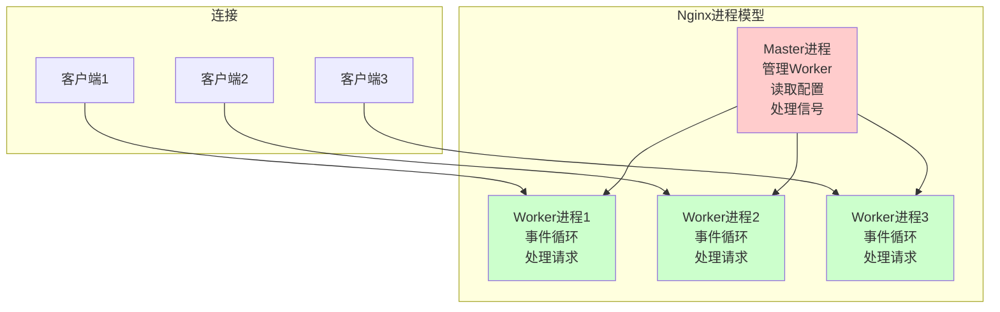
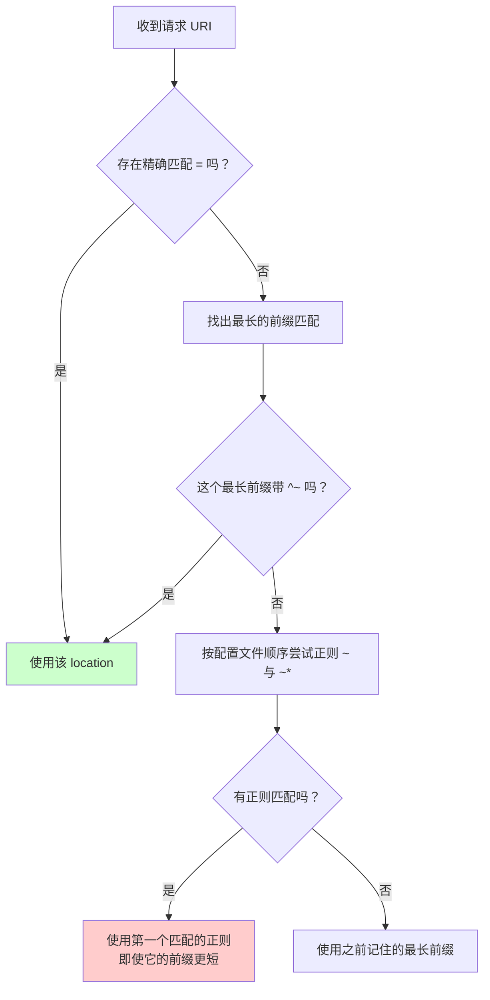

+++
title = "第40章：Nginx 深入详解"
weight = 400
date = "2026-03-24T13:18:28+08:00"
type = "docs"
description = ""
isCJKLanguage = true
draft = false
+++


# 第四十章：Nginx 深入详解

Nginx（发音"Engine X"，不是"恩ginx"或"恩记克斯"）是世界上最流行的Web服务器之一。它以高性能、高并发、低资源消耗著称，全球约35%的网站使用Nginx。可以说，Nginx就是Web服务器界的特斯拉——速度快、性能强、身材苗条（内存占用极低）。

本章，我们从Nginx的架构开始，深入到每个配置细节。

> 本章配套视频：Nginx配置一通百通，核心语法就那么几个。

## 40.1 Nginx 架构：多进程、异步非阻塞

理解Nginx的架构，是掌握它的前提。

### 40.1.1 Master 进程

Nginx启动后，首先创建Master进程（主进程）。Master进程不处理具体请求，它负责：

- 读取和验证配置文件
- 管理Worker进程（启动、停止、重启）
- 接收管理员信号（如`nginx -s reload`）
- 重新加载配置、平滑升级Nginx

```bash
# 查看Nginx的进程
ps aux | grep nginx
```

```bash
root     12345  0.0  0.2  12345  6789   ?   Ss   10:00   0:00 nginx: master process /usr/sbin/nginx -c /etc/nginx/nginx.conf
root     12346  0.0  0.1  12345  5678   ?   S    10:00   0:00   nginx: worker process
root     12347  0.0  0.1  12345  5679   ?   S    10:00   0:00   nginx: worker process
root     12348  0.0  0.1  12345  5680   ?   S    10:00   0:00   nginx: worker process
```

可以看到：Master进程PID 12345，Worker进程12346/12347/12348。

### 40.1.2 Worker 进程

Worker 进程是真正处理请求的进程。Master 进程 fork 出 Worker 进程后，自己退居幕后，只做管理。

Worker 进程的工作：

- 处理客户端请求（解析 HTTP、返回响应）
- 与上游服务器（后端）通信（反向代理时）
- 读写磁盘（静态文件）
- 维护缓存（如果开启了 proxy_cache 等）

**Worker 数量该设多少？** 官方建议：

- `worker_processes auto;`：让 Nginx 按 CPU 核心数自己决定，绝大多数场景直接用这个
- 纯静态文件服务、瓶颈在磁盘时，也可以设成略多于核心数
- 注意：**Nginx 源码里的默认值是 1**，是各发行版的配置文件把它改成了 `auto`。自己编译安装又没改配置时，默认只有一个 Worker

Worker 数量定下来后，真正决定并发能力的是每个 Worker 能开多少连接（`worker_connections`，见 40.4.2）。

### 40.1.3 连接处理

Nginx使用事件驱动模型处理连接。每个Worker维护一个事件循环（Event Loop），用epoll（Linux）等高效I/O多路复用机制，同时监控成千上万的连接。


```mermaid
graph TB
    subgraph "Nginx进程模型"
        M["Master进程<br/>管理Worker<br/>读取配置<br/>处理信号"]
        W1["Worker进程1<br/>事件循环<br/>处理请求"]
        W2["Worker进程2<br/>事件循环<br/>处理请求"]
        W3["Worker进程3<br/>事件循环<br/>处理请求"]
    end
    subgraph "连接"
        C1["客户端1"]
        C2["客户端2"]
        C3["客户端3"]
    end
    C1 --> W1
    C2 --> W2
    C3 --> W3
    M --> W1
    M --> W2
    M --> W3
    style M fill:#ffcccc
    style W1 fill:#ccffcc
    style W2 fill:#ccffcc
    style W3 fill:#ccffcc
```

Nginx的Worker进程是"各自为战"的，每个Worker独立接收连接、独立处理、独立返回。这就是为什么Nginx能高效处理高并发——没有锁竞争，没有进程间通信开销。

## 40.2 Nginx 安装

### 40.2.1 apt install nginx

Ubuntu/Debian上安装Nginx：

```bash
# 安装
sudo apt update
sudo apt install nginx

# 查看版本
nginx -v
```

```bash
nginx version: nginx/1.18.0 (Ubuntu)
```

```bash
# 启动Nginx
sudo systemctl start nginx

# 设置开机自启
sudo systemctl enable nginx

# 查看状态
sudo systemctl status nginx
```

```bash
nginx.service - A high performance web server and a reverse proxy server
   Loaded: loaded (/lib/systemd/system/nginx.service; enabled; vendor preset: enabled)
   Active: active (running) since Mon 2026-03-23 10:00:00 CST; 1min 30s ago
```

安装完成后，打开浏览器访问服务器IP，应该能看到Nginx的欢迎页面。

### 40.2.2 编译安装

发行版自带的包通常够用。需要自己编译的典型场景：要加上官方仓库没有的第三方模块（如 `ngx_brotli`）、要精确控制编译选项、或者必须跑某个特定版本。

```bash
# 安装编译依赖
# Ubuntu / Debian
sudo apt install build-essential libpcre2-dev zlib1g-dev libssl-dev

# RHEL 系对应的是：
# sudo dnf install gcc make pcre2-devel zlib-devel openssl-devel

# 下载源码（版本号请替换为官网上的当前稳定版）
cd /tmp
curl -fSLO https://nginx.org/download/nginx-1.26.2.tar.gz
# 建议连签名一起校验，确认包没被掉包：
# curl -fSLO https://nginx.org/download/nginx-1.26.2.tar.gz.asc
# gpg --keyserver keyserver.ubuntu.com --recv-keys 13C82A63B603576156E30A4EA0EA981B66B0D967
# gpg --verify nginx-1.26.2.tar.gz.asc nginx-1.26.2.tar.gz

tar -xzf nginx-1.26.2.tar.gz
cd nginx-1.26.2

# 配置编译参数
./configure --prefix=/usr/local/nginx \
    --user=www-data --group=www-data \
    --with-http_ssl_module \
    --with-http_v2_module \
    --with-http_v3_module \
    --with-http_realip_module \
    --with-http_gzip_static_module \
    --with-http_stub_status_module

# 编译并安装
make
sudo make install

# 验证（用绝对路径，避免和系统里已有的 nginx 混淆）
/usr/local/nginx/sbin/nginx -v
```

几个容易踩的点：

- 依赖里的 **PCRE 现在是 PCRE2**（`libpcre2-dev` / `pcre2-devel`），老的 `libpcre3-dev` 已经过时。没装 PCRE，`location` 里的正则和 `rewrite` 都不能用
- `--user=www-data --group=www-data` 是为了让 Worker 以非 root 身份运行；RHEL 系上通常是 `nginx`
- **不要**随手 `ln -s /usr/local/nginx/sbin/nginx /usr/bin/nginx`。如果系统里已经有 apt/dnf 装过的 Nginx，这条软链接会让 `nginx` 命令到底执行哪个版本变得非常混乱。用绝对路径更省事
- 编译安装的 Nginx **没有 systemd 服务文件**，需要自己写一个 `/etc/systemd/system/nginx.service`，否则开机不会自启，`systemctl restart nginx` 也用不了

## 40.3 Nginx 目录结构

### 40.3.1 /etc/nginx/：配置

Nginx的配置目录：

```bash
ls -la /etc/nginx/
```

```bash
.
drwxr-xr-x  1 root root 4096 Mar 23 10:00 ./
drwxr-xr-x  1 root root 4096 Mar 23 10:00 ../
drwxr-xr-x  1 root root 4096 Mar 23 10:00 conf.d/
drwxr-xr-x  1 root root 4096 Mar 23 10:00 modules-enabled/
drwxr-xr-x  2 root root 4096 Mar 23 10:00 sites-available/
drwxr-xr-x  2 root root 4096 Mar 23 10:00 sites-enabled/
drwxr-xr-x  1 root root 4096 Mar 23 10:00 snippets/
-rw-r--r--  1 root root 4096 Mar 23 10:00 nginx.conf
```

关键文件：

- `nginx.conf`：主配置文件
- `conf.d/`：自定义配置目录（会被主配置include）
- `sites-available/`：可用的站点配置
- `sites-enabled/`：已启用的站点配置（通常是符号链接）
- `snippets/`：配置片段

### 40.3.2 /var/log/nginx/：日志

```bash
ls -la /var/log/nginx/
```

```bash
access.log    # 访问日志，记录所有请求
error.log     # 错误日志，记录错误和警告
```

### 40.3.3 /usr/share/nginx/html/：默认页面

```bash
ls -la /usr/share/nginx/html/
```

```bash
index.html    # 默认欢迎页面
50x.html      # 默认错误页面
```

## 40.4 nginx.conf 主配置文件结构

Nginx配置文件采用块结构，由指令和块组成。

### 40.4.1 user、worker_processes

```bash
# 查看nginx.conf
cat /etc/nginx/nginx.conf
```

```bash
user www-data;                        # Worker进程运行用户
worker_processes auto;                # Worker进程数量，auto=自动检测CPU核心数
worker_cpu_affinity auto;             # Worker进程CPU绑定（可选）
worker_rlimit_nofile 65535;           # Worker最大打开文件数

error_log /var/log/nginx/error.log warn;
pid /run/nginx.pid;
```

- `user www-data`：Worker进程以www-data用户运行，保证安全
- `worker_processes auto`：自动使用所有CPU核心，通常不需要改
- `worker_rlimit_nofile`：最大打开文件描述符数量，高并发时调大

### 40.4.2 events 块

events 块配置事件驱动模型，是并发能力的"地基"：

```bash
events {
    worker_connections 1024;      # 每个 Worker 能同时打开的最大连接数
    use epoll;                    # Linux 下使用 epoll 事件模型
    multi_accept on;              # 一次事件循环里尽量多接受新连接
}
```

- `worker_connections`：**每个 Worker** 的连接数上限。理论最大并发连接数 ≈ `worker_processes × worker_connections`，但要打个折扣——做反向代理时，一个客户端请求会同时占用"客户端连接 + 后端连接"两条，所以实际能服务的客户端数大约是它的一半
- `use epoll`：Linux 上本来就是默认值，一般不用写，只有排查问题时才显式指定
- `multi_accept on`：一次唤醒就接受所有排队的连接，突发流量下更平滑；代价是单次处理时间变长。默认是 `off`
- **最常见的坑**：`worker_connections` 调大了，但 `worker_rlimit_nofile`（还要受系统 `ulimit -n` 限制）没跟着调大，结果被文件描述符卡住，日志里报 `too many open files`

### 40.4.3 http 块

http块是Web服务器配置的核心，包含所有HTTP相关配置：

```bash
http {
    # 基础配置
    include /etc/nginx/mime.types;
    default_type application/octet-stream;

    # 日志格式
    log_format main '$remote_addr - $remote_user [$time_local] "$request" '
                    '$status $body_bytes_sent "$http_referer" '
                    '"$http_user_agent" "$http_x_forwarded_for"';

    access_log /var/log/nginx/access.log main;

    # 性能优化
    sendfile on;
    tcp_nopush on;
    tcp_nodelay on;
    keepalive_timeout 65;
    types_hash_max_size 2048;

    # Gzip压缩
    gzip on;
    gzip_vary on;
    gzip_proxied any;
    gzip_comp_level 6;
    gzip_types text/plain text/css application/json application/javascript text/xml application/xml;

    # 引入其他配置
    include /etc/nginx/conf.d/*.conf;
    include /etc/nginx/sites-enabled/*;
}
```

### 40.4.4 include 指令

include指令用于将其他配置文件引入主配置：

```bash
include /etc/nginx/sites-enabled/*;    # 引入所有启用的站点配置
include /etc/nginx/conf.d/*.conf;      # 引入conf.d下的所有.conf文件
```

include是模块化配置的关键——每个网站一个配置文件，互不干扰。

## 40.5 server 块配置：虚拟主机

`server` 块定义一个虚拟主机（Virtual Host），作用类似 Apache 的 `<VirtualHost>`。一台服务器上可以有很多个 `server` 块，Nginx 靠 `listen` 的端口 + `server_name` 来决定这个请求该交给谁。

```bash
# /etc/nginx/sites-available/example.com
server {
    listen 80;                      # 监听 80 端口
    server_name example.com;        # 匹配的域名

    root /var/www/example.com;      # 网站根目录
    index index.html index.htm;     # 默认首页

    access_log /var/log/nginx/example.com.access.log;
    error_log /var/log/nginx/example.com.error.log;

    location / {
        try_files $uri $uri/ =404;   # 先找文件，再找目录，都没有就 404
    }
}
```

**启用站点的标准流程**（Debian / Ubuntu 的目录约定）：

```bash
# 1. 配置写在 sites-available/
sudo vim /etc/nginx/sites-available/example.com

# 2. 在 sites-enabled/ 里建软链接，表示"启用"
sudo ln -s /etc/nginx/sites-available/example.com /etc/nginx/sites-enabled/

# 3. 先测语法，再重载
sudo nginx -t
sudo systemctl reload nginx
```

> RHEL 系没有 `sites-available/sites-enabled` 这套约定，站点配置直接放进 `/etc/nginx/conf.d/*.conf`（主配置里已经 `include` 过这个目录）。

几个必须知道的细节：

- **`reload` 不是 `restart`**：`reload` 会让老 Worker 处理完手上的请求再退出，不断连接；`restart` 则是直接断开。改配置优先用 `reload`，只有改监听端口、换二进制时才需要 `restart`
- **改完先 `nginx -t`**：语法有错时 `reload` 会失败并保留旧配置（这是好事），但养成习惯能省很多事
- **该端口上的第一个 `server` 是默认站点**：当请求的 `Host` 没匹配上任何 `server_name` 时，Nginx 会把请求交给这个端口上的第一个 `server`（或显式标了 `default_server` 的那个）。所以那种 `server_name _;` 的兜底站点如果排在前面，会把你没配过的域名全部接过去
- **`try_files $uri $uri/ =404;` 别省**：它决定了文件不存在时是干脆 404，还是暴露真实情况（比如目录列表）

## 40.6 location 块：URL 匹配规则

location块定义URL匹配规则和对应的处理方式。匹配优先级是Nginx配置中最容易出错的地方。

### 40.6.1 精确匹配：=

精确匹配URL，优先级最高。

```bash
# 只有访问 http://example.com/ 时才匹配
location = / {
    root /var/www/home;
    index index.html;
}
```

### 40.6.2 前缀匹配：^~

前缀匹配，找到后不再检查正则匹配。

```bash
# 以 /static/ 开头的URL匹配
location ^~ /static/ {
    root /var/www;
    autoindex on;
}
```

### 40.6.3 正则匹配：~

正则匹配，区分大小写。

```bash
# 匹配 .php 结尾的URL
location ~ \.php$ {
    fastcgi_pass unix:/run/php/php-fpm.sock;
    fastcgi_param SCRIPT_FILENAME $document_root$fastcgi_script_name;
    include fastcgi_params;
}
```

### 40.6.4 普通前缀匹配

没有任何前缀修饰符的前缀匹配，按长度从长到短排序。

```bash
# /images/logo.png 会匹配这个
location /images/ {
    root /var/www/static;
}

# /images 会匹配这个
location / {
    root /var/www/default;
}
```

**匹配优先级到底怎么算**

很多人背的顺序（`=` → `^~` → `~` → 前缀）其实只对了一半。真实算法是这样：

1. **先看精确匹配**：存在 `location = /uri` 且完全相等，直接用它，结束
2. **记住最长的前缀匹配**：把所有普通前缀和 `^~` 前缀都比一遍，挑出最长的那个先记住
3. **看这个最长前缀是不是 `^~`**：如果是，就用它，**跳过正则匹配**，结束
4. **否则按配置文件里的先后顺序依次尝试正则**（`~` 区分大小写、`~*` 忽略大小写）：**第一个匹配上的正则就赢**
5. **正则全都不匹配**：回到第 2 步记住的那个最长前缀

第 4 步是最大的坑：**正则的优先级高于普通前缀匹配**。也就是说，即使 `/static/` 这个前缀更长，只要后面有一条正则能匹配上，正则也会赢。想让某个前缀"拦住"正则，必须写成 `^~`。


```mermaid
graph TB
    A["收到请求 URI"] --> B{"存在精确匹配 = 吗？"}
    B -->|是| Z["使用该 location"]
    B -->|否| C["找出最长的前缀匹配"]
    C --> D{"这个最长前缀带 ^~ 吗？"}
    D -->|是| Z
    D -->|否| E["按配置文件顺序尝试正则 ~ 与 ~*"]
    E --> F{"有正则匹配吗？"}
    F -->|是| G["使用第一个匹配的正则<br/>即使它的前缀更短"]
    F -->|否| H["使用之前记住的最长前缀"]
    style Z fill:#ccffcc
    style G fill:#ffcccc
```

举例说明，假设同时存在这四条规则：

```bash
location ^~ /static/ { }              # A：最长前缀且带 ^~，命中后不再看正则
location ~ \.(gif|jpg|png)$ { }       # B：正则
location /images/ { }                 # C：普通前缀
location / { }                        # D：兜底
```

| 请求 URI | 命中 | 原因 |
|----------|------|------|
| `/static/a.jpg` | A | `^~` 前缀命中即停止，不再考虑正则 B |
| `/images/a.jpg` | B | 前缀 C 命中，但正则 B 也能匹配，且正则优先级更高 |
| `/images/a.txt` | C | 没有正则匹配，回落到最长前缀 C |
| `/about` | D | 只有兜底的前缀 D 匹配 |

## 40.7 根目录与索引文件

### 40.7.1 root：文档根目录

`root`指令设置网站的文档根目录（Document Root）：

```bash
server {
    listen 80;
    server_name example.com;

    # 访问 http://example.com/index.html 时
    # Nginx会在 /var/www/example.com/index.html 查找文件
    root /var/www/example.com;

    location / {
        try_files $uri $uri/ =404;
    }
}
```

### 40.7.2 index：默认首页

`index`指令指定默认首页文件：

```bash
server {
    root /var/www/example.com;

    # 当访问 http://example.com/ 时
    # Nginx依次查找 index.html, index.htm, index.php
    index index.html index.htm index.php;
}
```

## 40.8 错误页面配置

### 40.8.1 error_page 404

自定义404错误页面：

```bash
server {
    root /var/www/example.com;

    # 当返回404时，显示这个页面
    error_page 404 /404.html;

    location = /404.html {
        internal;  # 只能内部访问，不能直接URL访问
        root /var/www/example.com;
    }
}
```

### 40.8.2 error_page 500 502

自定义500系列错误页面：

```bash
server {
    root /var/www/example.com;

    error_page 500 502 503 504 /50x.html;

    location = /50x.html {
        internal;
        root /var/www/example.com;
    }
}
```

## 40.9 access_log 与 error_log

### 40.9.1 access_log：访问日志

```bash
# 在server块中指定
server {
    access_log /var/log/nginx/example.com.access.log;
}
```

### 40.9.2 error_log：错误日志

```bash
# 在server块或http块中指定
error_log /var/log/nginx/example.com.error.log warn;
```

错误日志级别（从低到高）：debug、info、notice、warn、error、crit、alert、emerg。

### 40.9.3 log_format：日志格式

自定义日志格式：

```bash
http {
    # 定义JSON格式日志
    log_format json_log escape=json
        '{'
        '"time":"$time_local",'
        '"remote_addr":"$remote_addr",'
        '"host":"$host",'
        '"request":"$request",'
        '"status":"$status",'
        '"body_bytes_sent":"$body_bytes_sent",'
        '"request_time":"$request_time",'
        '"http_referer":"$http_referer",'
        '"http_user_agent":"$http_user_agent"'
        '}';

    server {
        access_log /var/log/nginx/example.com.access.log json_log;
    }
}
```

## 40.10 静态网站托管

最简单的一个静态网站配置：

```bash
server {
    listen 80;
    server_name static.example.com;

    root /var/www/static;
    index index.html;

    location / {
        try_files $uri $uri/ =404;   # 先找文件，再找目录，都没有就 404
    }

    # 静态资源缓存
    location ~* \.(css|js|png|jpg|jpeg|gif|ico|svg|woff|woff2)$ {
        expires 30d;                 # 缓存 30 天
        add_header Cache-Control "public, no-transform";
    }

    # 先放行 .well-known 目录（Let's Encrypt 验证域名时要用）
    location ~ /\.well-known {
        allow all;
    }

    # 禁止访问其它隐藏文件（.git、.env 等）
    location ~ /\. {
        deny all;
        access_log off;
        log_not_found off;
    }
}
```

两点必须提醒：

> **`autoindex on;` 要慎用。** 它会把目录里的文件列成一张清单给所有人看。只有真的要做"文件下载站"时才开；普通网站开着它，等于把服务器目录结构公开了（尤其是错误配置把 `root` 指到包含配置、备份的目录时，后果更严重）。
>
> **正则 `location` 的书写顺序在这里很关键。** `~ /\.well-known` 必须写在 `~ /\.` 前面：正则按出现顺序匹配，第一个命中就赢。顺序反了，`.well-known` 会被下面的 `deny all` 拦掉，证书续期就会失败——这是个很隐蔽、又很常见的坑。

## 40.11 反向代理配置

Nginx最强大的功能之一是反向代理——把请求转发给后端应用服务器。

### 40.11.1 proxy_pass

把请求转发给后端应用：

```bash
server {
    listen 80;
    server_name api.example.com;

    # 所有请求转发到后端
    location / {
        proxy_pass http://127.0.0.1:3000;
    }
}
```

### 40.11.2 proxy_set_header

转发请求时，传递原始请求信息给后端：

```bash
location / {
    proxy_pass http://127.0.0.1:3000;

    # 传递真实IP给后端
    proxy_set_header Host $host;
    proxy_set_header X-Real-IP $remote_addr;
    proxy_set_header X-Forwarded-For $proxy_add_x_forwarded_for;
    proxy_set_header X-Forwarded-Proto $scheme;

    # 超时设置
    proxy_connect_timeout 60s;
    proxy_send_timeout 60s;
    proxy_read_timeout 60s;
}
```

### 40.11.3 proxy_redirect：改写后端返回的跳转地址

后端应用如果返回 `Location: http://127.0.0.1:3000/login`，浏览器会直接去访问那个内网地址，必然失败。`proxy_redirect` 就是用来改写这类地址的：

```bash
location / {
    proxy_pass http://127.0.0.1:3000;

    proxy_redirect default;      # 默认值：按 proxy_pass 的地址自动替换
    # proxy_redirect off;        # 关闭改写（后端本来就会返回正确地址时用）
    # 也可以手写映射规则：
    # proxy_redirect http://127.0.0.1:3000/ /;
}
```

> 只有当后端应用不认 `X-Forwarded-*` 头、又硬编码了内网地址时，才需要动这个指令。如果后端能根据 `X-Forwarded-Host` / `X-Forwarded-Proto` 生成正确的地址，保持 `default` 就够了。

## 40.12 负载均衡

Nginx 自带负载均衡，不需要额外装东西。（更强健的健康检查和可视化状态页属于商业版 Nginx Plus，开源版只有下面的被动检查。）

### 40.12.1 upstream 块

`upstream` 定义一组后端服务器，`proxy_pass` 直接写这组的名字：

```bash
http {
    upstream backend {
        server 192.168.1.100:8080;
        server 192.168.1.101:8080;
        server 192.168.1.102:8080;
    }

    server {
        listen 80;
        server_name example.com;

        location / {
            proxy_pass http://backend;   # 写 upstream 的名字，不写具体 IP
        }
    }
}
```

### 40.12.2 调度算法：轮询、IP 哈希、最少连接

```bash
upstream backend {
    # 默认：轮询（Round Robin），请求依次分给各后端
    server 192.168.1.100:8080;
    server 192.168.1.101:8080;
    server 192.168.1.102:8080;
}
```

```bash
upstream backend {
    # IP 哈希：同一个客户端 IP 总是落到同一台后端
    ip_hash;
    server 192.168.1.100:8080;
    server 192.168.1.101:8080;
    server 192.168.1.102:8080;
}
```

```bash
upstream backend {
    # 最少连接：把请求发给当前活跃连接数最少的那台
    least_conn;
    server 192.168.1.100:8080;
    server 192.168.1.101:8080;
    server 192.168.1.102:8080;
}
```

> `ip_hash` 的副作用要知道：客户端 IP 一变（手机从 WiFi 切到 4G），会话就"漂"到另一台后端去了；后端机器增删也会导致大批客户端重新分布。真正要会话保持，用后端共享的 Redis 存 session 更可靠。

### 40.12.3 权重与后端状态

```bash
upstream backend {
    # weight：权重越高分到的请求越多，按比例分配即可，不必凑成 100
    server 192.168.1.100:8080 weight=5;
    server 192.168.1.101:8080 weight=3;
    server 192.168.1.102:8080 weight=2;
    server 192.168.1.103:8080 backup;    # 备份节点：前面的都不可用才启用
    server 192.168.1.104:8080 down;      # 手动摘除，不参与调度
}
```

- `weight=N`：机器配置有高有低时按比例分配
- `backup`：平时不接流量，只在前面的节点全部不可用时顶上
- `down`：显式标记为下线，方便临时摘节点而不用删配置
- `max_fails=3 fail_timeout=10s`：**被动健康检查**的默认参数——10 秒内失败 3 次，就把这台标记为不可用 10 秒

> **开源版 Nginx 没有主动健康检查。** 它只有在"有请求打过去、并且失败了"之后才会把后端摘掉，所以总会有少量请求先失败一下。要求"后端一挂就立刻摘除"，就得用商业版、或者在前面放 HAProxy / LVS。

### 40.12.4 让 Nginx 与后端复用连接

最容易漏掉、收益又很明显的一项优化。默认情况下，Nginx 每转发一个请求都要和后端**新建一条 TCP 连接**；开启 `keepalive` 后可以复用：

```bash
upstream backend {
    server 192.168.1.100:8080;
    server 192.168.1.101:8080;

    keepalive 32;                  # 每个 Worker 保留最多 32 条空闲长连接
}

server {
    location / {
        proxy_pass http://backend;

        # 下面这两行必须配，否则长连接不会生效
        proxy_http_version 1.1;
        proxy_set_header Connection "";
    }
}
```

> 少了 `proxy_http_version 1.1;` 和清空 `Connection` 这两句，是"配了 keepalive 却没效果"的头号原因——不加的话 Nginx 仍按 HTTP/1.0 发请求，后端会在响应后直接把连接关掉。

## 40.13 HTTPS / TLS 配置

### 40.13.1 ssl_certificate：证书链别拼错

```bash
server {
    listen 443 ssl;
    server_name example.com;

    # 证书文件必须是"服务器证书 + 中间证书"的完整链
    ssl_certificate /etc/ssl/certs/example.com-fullchain.crt;
    ssl_certificate_key /etc/ssl/private/example.com.key;

    root /var/www/example.com;
    index index.html;
}
```

> **部署 HTTPS 最常见的事故**：`ssl_certificate` 里只放了服务器证书，忘了拼上中间 CA 证书。桌面浏览器有时能靠缓存或自动补链蒙过去，但手机 App、Java 客户端、`curl` 往往会直接报"证书不受信任"。所以证书文件里应该是：自己的证书 → 中间 CA 证书，按这个顺序拼接。

### 40.13.2 ssl_certificate_key：私钥必须锁好

```bash
# 只让 root 能读（注意是 600，不是 644）
sudo chown root:root /etc/ssl/private/example.com.key
sudo chmod 600 /etc/ssl/private/example.com.key
```

> 私钥泄露等于别人可以完整冒充你的网站。所以：不要提交进 Git、不要在几十台机器之间复制同一把私钥、轮换证书后记得销毁旧私钥。

### 40.13.3 ssl_protocols：只留 TLS 1.2 / 1.3

```bash
# SSLv3、TLSv1.0、TLSv1.1 都已被证实不安全，一律禁用
ssl_protocols TLSv1.2 TLSv1.3;
```

### 40.13.4 ssl_ciphers 与 ssl_prefer_server_ciphers

```bash
ssl_ciphers ECDHE-ECDSA-AES128-GCM-SHA256:ECDHE-RSA-AES128-GCM-SHA256:ECDHE-ECDSA-AES256-GCM-SHA384:ECDHE-RSA-AES256-GCM-SHA384;
```

选型思路很简单：只要 **ECDHE + AEAD（GCM）** 的组合。`ECDHE` 保证前向保密，`GCM` 是现代的认证加密模式。

> `ssl_prefer_server_ciphers on;` 表示"按服务器排列的顺序选套件"，但它**对 TLS 1.3 无效**——TLS 1.3 的套件选择规则由协议规定。它只影响 TLS 1.2 及以下，所以在只开 TLS 1.2/1.3 的现代配置里，写 `on` 还是 `off` 差别已经很小。

**一份可以直接抄的完整 HTTPS 配置**：

```bash
server {
    listen 443 ssl;
    listen [::]:443 ssl;
    http2 on;                       # Nginx 1.25.1 及以后的写法，详见 40.15
    server_name example.com;

    ssl_certificate /etc/ssl/certs/example.com-fullchain.crt;
    ssl_certificate_key /etc/ssl/private/example.com.key;

    # 会话复用：避免每次连接都完整握手，明显降低 CPU 开销
    ssl_session_cache shared:SSL:50m;   # 所有 Worker 共享 50MB
    ssl_session_timeout 1d;

    ssl_protocols TLSv1.2 TLSv1.3;
    ssl_ciphers ECDHE-ECDSA-AES128-GCM-SHA256:ECDHE-RSA-AES128-GCM-SHA256:ECDHE-ECDSA-AES256-GCM-SHA384:ECDHE-RSA-AES256-GCM-SHA384;
    ssl_prefer_server_ciphers off;

    # OCSP Stapling：由 Nginx 代客户端去查吊销状态，省掉客户端的一次外部请求
    ssl_stapling on;
    ssl_stapling_verify on;
    resolver 223.5.5.5 8.8.8.8 valid=300s;

    # HSTS：让浏览器以后只用 HTTPS 访问（确认全站都支持 HTTPS 后再开）
    add_header Strict-Transport-Security "max-age=31536000" always;

    root /var/www/example.com;
    index index.html;
}
```

> 配合 80 端口的跳转才算完整（把 HTTP 请求 301 到 HTTPS）：
>
> ```bash
> server {
>     listen 80;
>     server_name example.com;
>     return 301 https://$host$request_uri;
> }
> ```
## 40.14 Let's Encrypt 免费证书

Let's Encrypt是免费的自动证书颁发机构（CA），证书有效期90天，Nginx支持自动续期。

### 40.14.1 certbot 安装

```bash
# Ubuntu安装certbot
sudo apt update
sudo apt install certbot python3-certbot-nginx
```

### 40.14.2 申请证书

```bash
# 一条命令搞定：申请证书并自动写进 nginx 配置
sudo certbot --nginx -d example.com -d www.example.com
```

交互过程大致如下：

```text
Saving debug log to /var/log/letsencrypt/letsencrypt.log
Plugins selected: Authenticator nginx, Installer nginx
Enter email address (used for urgent renewal and security notices): admin@example.com
(A)gree/(C)ancel: A

Obtaining a new certificate
Performing the following challenges:
http-01 challenge for example.com
Waiting for verification...
Cleaning up challenges
Deploying Certificate to VirtualHost /etc/nginx/sites-enabled/example.com

Please choose whether or not to redirect HTTP traffic to HTTPS.
1: No redirect - Make no further changes to the webserver configuration.
2: Redirect - Make all requests redirect to secure HTTPS access.
Select the appropriate number [1-2] then [Enter]: 2
```

几个实用细节：

- **前提：域名要已经解析到这台服务器，并且 80 端口能从公网访问**。Let's Encrypt 是通过访问 `http://你的域名/.well-known/acme-challenge/...` 来验证域名归属的（http-01 挑战）
- `--nginx` 是插件模式：certbot 读你的 Nginx 配置、临时加验证规则、签发后再把证书路径写回配置并 reload。用之前最好先备份配置
- 想完全不交互（放进自动化脚本），加 `--non-interactive --agree-tos -m you@example.com`
- **`--dry-run` 值得在上线前跑一次**：它走完整的验证流程，但不真的签发、也不写配置，能提前发现端口、DNS、防火墙的问题
- 如果前面有 CDN / 反向代理，或者 80 端口确实不能开放，就改用 `--webroot -w /var/www/html`，或者用 DNS 验证（`--dns` 系列插件）

### 40.14.3 自动续期

Let's Encrypt 证书只有 **90 天**有效期（这是有意设计的，为的是缩短密钥泄露后的风险窗口），所以"记得续期"必须交给自动化：

```bash
# 演练一次续期流程，不实际签发，用来确认续期能成功
sudo certbot renew --dry-run

# 查看续期定时器
systemctl list-timers | grep certbot
```

```text
NEXT                        LEFT          LAST                        PASSED      UNIT           ACTIVATES
Mon 2026-03-30 00:00:00 CST 6 days left   Mon 2026-03-23 00:00:00 CST 22h ago     certbot.timer  certbot.service
```

> `certbot.timer` 由安装证书时一并启用，**每天跑两次**，但只有在证书剩余有效期不足 30 天时才会真正续签（`renew` 自带这个判断），续期成功后会自动 reload Nginx。
>
> 所以你要做的只有两件事：**别把定时器关掉**，以及**偶尔看一眼续期有没有失败**（`certbot renew` 的结果会写到 `/var/log/letsencrypt/`，也可以配置邮件通知）。最怕的情况是：装好证书后从没管过，直到某天证书过期、整站 HTTPS 报错才发现续期早就在默默失败了。
## 40.15 HTTP/2 配置

HTTP/2 相比 HTTP/1.1 的三个主要改进：**多路复用**（一条 TCP 连接上并行跑多个请求，不再排队等待）、**头部压缩**（HPACK）、**二进制分帧**。

```bash
server {
    listen 443 ssl;
    listen [::]:443 ssl;
    http2 on;                       # Nginx 1.25.1 及以后的正确写法
    server_name example.com;

    ssl_certificate /etc/ssl/certs/example.com-fullchain.crt;
    ssl_certificate_key /etc/ssl/private/example.com.key;

    root /var/www/example.com;
    index index.html;
}
```

> **语法变过，这是很多人配置后看到警告的原因。** 老教程里写的是 `listen 443 ssl http2;`。从 **Nginx 1.25.1** 起，官方把 HTTP/2 拆成了独立的 `http2` 指令，旧写法会打印 `the "listen ... http2" directive is deprecated`。两种写法眼下都还能跑，但新配置应该用 `http2 on;`。
>
> 另外两个常见误解：
>
> - **"HTTP/2 必须用 HTTPS"** —— 严格说不完全对，协议本身有明文版本（h2c），但**所有主流浏览器都只在 TLS 上启用 HTTP/2**，所以实际部署等同于必须上 HTTPS
> - **"HTTP/2 的服务器推送很厉害"** —— 推送已被 Chrome 于 2022 年移除支持，Nginx 也在 1.25.1 起移除了 `http2_push` 指令。现在谈 HTTP/2 的性能，说的是多路复用和头部压缩，别再惦记推送了

## 40.16 Gzip 压缩

Gzip 能显著减少传输数据量。文本类资源（HTML、CSS、JS、JSON）通常能压到原体积的 20%-40%；而图片、视频本身就是压缩格式，再压几乎没有收益，纯属浪费 CPU。

### 40.16.1 开启 gzip

```bash
http {
    gzip on;
}
```

单独一句 `gzip on;` **只对 `text/html` 生效**（这是内置的默认类型），其它类型必须用 `gzip_types` 显式列出。

### 40.16.2 gzip_types 与相关参数

```bash
http {
    gzip on;
    gzip_vary on;              # 响应加 Vary: Accept-Encoding，让缓存服务器区分压没压
    gzip_proxied any;          # 对来自代理的请求也压缩（默认只压一部分情况）
    gzip_comp_level 5;         # 压缩级别 1-9
    gzip_min_length 1024;      # 小于 1KB 的响应不压（压完可能反而更大）

    # 只列文本类资源；图片、视频、woff2 字体不要放进来
    gzip_types
        text/plain
        text/css
        text/xml
        application/json
        application/javascript
        application/xml
        application/rss+xml
        image/svg+xml;
}
```

> `text/html` 不需要（也不能）写进 `gzip_types`，它永远会被压缩。

### 40.16.3 gzip_comp_level 怎么选

级别 1 最快、压缩率最低；级别 9 最慢、压缩率最高。**Nginx 的默认值是 1**，不是很多人以为的 5 或 6。

实际经验：从 1 提到 5 或 6，压缩率提升明显而 CPU 增加有限；从 6 再提到 9，体积只小一点点，CPU 开销却陡增。所以**生产上一般用 5 或 6**。

想进一步省 CPU，用 `gzip_static on;`：构建时就把文件压好（`app.js` 旁边放一个 `app.js.gz`），Nginx 直接发送现成的压缩文件，运行时零压缩开销（这个模块需要编译时加 `--with-http_gzip_static_module`）。

> 顺带一提：现在更高效的选择是 **Brotli**，同体积下压缩率普遍优于 gzip。但它不是 Nginx 官方模块，需要额外编译 `ngx_brotli`，用发行版自带包时不一定带。先用 gzip 完全够用。

## 40.17 浏览器缓存配置

缓存是前端性能优化里性价比最高的一环：命中缓存时请求根本不发出去，既省带宽又省服务器。

### 40.17.1 expires：设置缓存有效期

```bash
# 带哈希指纹的静态资源：可以缓存很久
location ~* \.(css|js|png|jpg|jpeg|gif|ico|svg|woff|woff2)$ {
    expires 30d;
    add_header Cache-Control "public, no-transform";
}

# HTML 入口文件：不能缓存，否则用户永远看不到新版本
location ~* \.(html|htm)$ {
    expires -1;
    add_header Cache-Control "no-store, no-cache, must-revalidate";
}
```

`expires` 的几种写法：

- `expires 30d`：30 天后过期
- `expires 24h`：24 小时后过期
- `expires modified +1 month`：从文件的最后修改时间起算 1 个月（依赖文件时间戳）
- `expires -1`：立即过期，等价于"不缓存"
- `expires max`：过期时间设为十年后

> 缓存的经典策略是 **"HTML 不缓存 + 静态资源长缓存 + 文件名带指纹"**。前端构建工具（Vite、webpack）会给产物文件名加上哈希（`app.3f2a1b.js`），内容一变文件名就变，于是静态资源可以放心缓存一年。
>
> 反过来，如果文件名不变又设了长缓存，更新了文件用户却还在用旧的——这就是"改了没生效"的元凶。临时办法是在引用地址后面加个版本号，如 `app.js?v=2`。

### 40.17.2 add_header：加上安全响应头

```bash
add_header X-Frame-Options "SAMEORIGIN" always;                   # 防点击劫持
add_header X-Content-Type-Options "nosniff" always;               # 禁止浏览器猜类型
add_header Referrer-Policy "strict-origin-when-cross-origin" always;
add_header Strict-Transport-Security "max-age=31536000" always;   # HTTPS 站点启用 HSTS
add_header Content-Security-Policy "default-src 'self'; script-src 'self'" always;
add_header Permissions-Policy "geolocation=(), camera=(), microphone=()" always;
```

- `always` 表示**不管响应状态码是什么都加上这个头**。不加 `always` 时，4xx / 5xx 的响应不会带它
- **`X-XSS-Protection` 已经废弃**：老教程常写 `"1; mode=block"`，但现代浏览器都移除了这个过滤器（它自身还会引入漏洞）。现在推荐显式设为 `"0"`，或者干脆不写
- **`add_header` 有继承陷阱**：只要在子块（比如 `location`）里写了任意一条 `add_header`，父块里的 `add_header` 就会**全部被丢弃**，而不是合并。要么把所有头写在同一个层级，要么把统一的一组头放进一个文件用 `include` 复用
## 40.18 URL 重写与跳转

### 40.18.1 rewrite 指令

```bash
# 将 /old-page.html 重写到 /new-page
rewrite ^/old-page\.html$ /new-page permanent;    # 301 永久重定向（浏览器地址栏会变）
rewrite ^/old-page\.html$ /new-page redirect;     # 302 临时重定向（地址栏也会变）
rewrite ^/old-page\.html$ /new-page;              # 不带 flag：内部重写，地址栏不变
```

注意这里有个容易混淆的地方：**加了 `permanent` / `redirect` 就不再是"内部重写"，而是真的给浏览器返回一个跳转响应**。只有不加 flag（或加 `last` / `break`）时，地址栏才保持不变。

> 简单的跳转其实用 `return` 更清楚、性能也更好：
>
> ```bash
> return 301 https://$host$request_uri;      # HTTP 全站跳 HTTPS
> return 302 /maintenance.html;              # 临时跳维护页
> ```
>
> `rewrite` 更适合需要正则捕获、改写的场景；纯粹"换个地址"用 `return`。

### 40.18.2 last、break 的区别

- `last`：重写后**重新走一遍 location 匹配**（用新的 URI 去找 location）
- `break`：重写后**留在当前 location 里继续**，不再重新匹配

```bash
# last：改完 URI 后重新匹配 location
location / {
    rewrite ^/news/(.*)$ /article/$1 last;
}

location /article/ {
    # /news/123 会被改写成 /article/123，然后由这里处理
}

# break：在当前 location 内就地处理，不再跳
location /old/ {
    rewrite ^/old/(.*)$ /new/$1 break;
    # 下面继续用改写后的 URI 找文件（比如配合 root/alias），不再重新匹配 location
}
```

> 用一句话记：**`last` 是"改完再重新找一遍规则"，`break` 是"就在这儿继续往下走"**。在 `server` 层级（不在 location 里）写 `rewrite` 时只能用 `last` 或 `break` 之一，且 `break` 的效果等同于停在那儿。

## 40.19 限流配置

限流是保护后端不被打垮的最后一道防线——尤其是有爬虫、或者某个客户端在狂刷接口的时候。

### 40.19.1 limit_req_zone：限制请求速率

```bash
http {
    # 定义限流区域：key=按什么维度限流 zone=名字:共享内存大小 rate=平均速率
    limit_req_zone $binary_remote_addr zone=api_limit:10m rate=10r/s;

    server {
        location /api/ {
            # burst=允许排队/突发的请求数，nodelay=突发部分立刻处理不排队
            limit_req zone=api_limit burst=20 nodelay;

            # 被限流时返回 429（默认是 503）
            limit_req_status 429;

            proxy_pass http://backend;
        }
    }
}
```

- `rate=10r/s`：平均允许每秒 10 个请求
- `burst=20`：在平均速率之外，额外允许 20 个请求"突发"进来。**不加 `nodelay` 时这 20 个会被排队延迟处理**；加了 `nodelay` 则立刻处理，超出部分才被拒
- `$binary_remote_addr`：按客户端 IP 限流。用它而不用 `$remote_addr`，是因为二进制形式只占 4 字节，同样内存能存下更多 IP
- 有个格式上的硬规定：**速率低于 1 时不能用小数**，`rate=0.5r/s` 是非法的，要写成 `rate=30r/m`（每分钟 30 次）

> 注意 `limit_req` 是按"平均速率 + 突发"工作的，不是严格的令牌桶整形：`rate=10r/s burst=20 nodelay` 意味着短时间内可能瞬间通过 20 个请求。要压得更平缓，可以减小 burst、或者去掉 `nodelay` 让它排队。

### 40.19.2 limit_conn_zone：限制并发连接数

速率限制防的是"请求太密"，并发限制防的是"同时占着连接不放"（比如下载站、大文件传输）。

```bash
http {
    limit_conn_zone $binary_remote_addr zone=conn_limit:10m;

    server {
        location /download/ {
            limit_conn conn_limit 5;      # 同一 IP 最多 5 个并发连接
            limit_conn_status 429;
            alias /var/www/downloads/;
        }
    }
}
```

> 两个 zone 都是放在 `http` 块里的，但 `limit_req` / `limit_conn` 要在 `server` 或 `location` 里引用才生效——忘了引用是"配了限流却没效果"的常见原因。
>
> 另外，如果你前面还有 CDN 或负载均衡，`$binary_remote_addr` 拿到的是**上一层代理的 IP**，所有用户会被当成同一个 IP 来限流。这种情况下要先配好 `real_ip` 模块（`set_real_ip_from` + `real_ip_header`），把真实客户端 IP 还原出来。

## 40.20 性能优化要点

### 40.20.1 worker_processes

```bash
# nginx.conf
worker_processes auto;    # 按 CPU 核心数自动决定
```

### 40.20.2 worker_connections

```bash
events {
    worker_connections 1024;    # 每个 Worker 的连接数上限
}
```

调这个值时，别忘了同时把 `worker_rlimit_nofile` 和系统的 `ulimit -n` 一起调大，否则会被文件描述符限制卡住。

### 40.20.3 连接复用

```bash
http {
    keepalive_timeout 65;      # 和客户端保持长连接 65 秒
    keepalive_requests 1000;   # 单条连接最多处理 1000 个请求
}
```

`keepalive_timeout` 设太长会让空闲连接一直占着 Worker 的资源，太短又会让浏览器频繁重连。65 秒是常用折中值。

> 除了上面这几个，本章还提到过几个收益很大的优化点，实际调优时别忘了：
>
> - 静态文件用 `sendfile`（配合 `tcp_nopush`）
> - Nginx 到后端启用 `keepalive`（40.12.4）
> - 静态资源开 `gzip` 或 `gzip_static`
> - 配置合理的 `expires` 让浏览器缓存静态资源
> - 给 `/api/` 之类的接口加 `limit_req` 保护后端

---

## 本章小结

Nginx 的配置项很多，但主线其实很清楚：

- **架构**：Master 进程管配置和信号，Worker 进程（通常是 CPU 核数）各跑一个事件循环，用 epoll 非阻塞地同时照看大量连接
- **安装**：发行版包最省事；编译安装适合要加第三方模块或指定版本的场景，但需要自己写 systemd 服务
- **目录**：`/etc/nginx/` 放配置（`nginx.conf` 是主入口，`conf.d/`、`sites-enabled/` 是模块化扩展），`/var/log/nginx/` 放日志
- **配置文件结构**：`main` → `events` → `http` → `server` → `location`，块可以嵌套，指令有继承关系
- **虚拟主机**：靠 `listen` + `server_name` 区分站点；该端口的第一个 server 是默认站点
- **location 匹配**：先精确 `=`，再看最长前缀是否带 `^~`，否则按顺序试正则，正则优先于普通前缀。**正则的顺序很重要**
- **反向代理**：`proxy_pass` + `proxy_set_header`（尤其别丢 `Host` 和 `X-Forwarded-*`）
- **负载均衡**：`upstream` 里配轮询 / `ip_hash` / `least_conn`，用 `weight`、`backup`、`down` 精细化控制；开源版只有被动健康检查
- **HTTPS**：证书要带完整链，私钥权限 600，只开 TLS 1.2/1.3，用会话缓存减少握手开销
- **Let's Encrypt**：`certbot --nginx` 一键申请并自动配置续期
- **HTTP/2**：Nginx 1.25.1 起用独立的 `http2 on;`，只能在 HTTPS 上用
- **Gzip**：`gzip on` 只压 HTML，其它类型要 `gzip_types` 显式列出；级别默认 1，常用 5-6；静态文件可预压缩
- **缓存**：`expires` 控制有效期，策略是"HTML 不缓存 + 资源长缓存 + 文件名带哈希"
- **URL 重写**：`rewrite` 做正则改写，`last` 重新匹配 location、`break` 就地继续；简单跳转用 `return` 更清楚
- **限流**：`limit_req_zone` 限速率（注意 burst 语义），`limit_conn_zone` 限并发
- **性能**：`worker_processes auto`、合适的 `worker_connections`、`keepalive`、`sendfile`，再配合缓存和压缩

掌握这些之后，去读一份别人的 `nginx.conf` 基本就能看懂它在做什么了。下一章我们再看另一位老牌选手——Apache。
